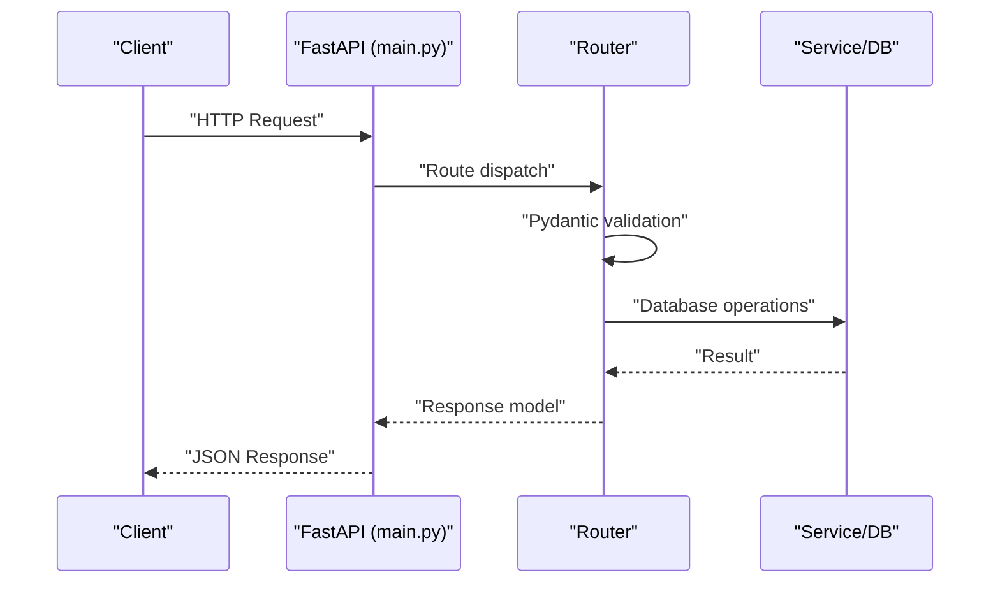
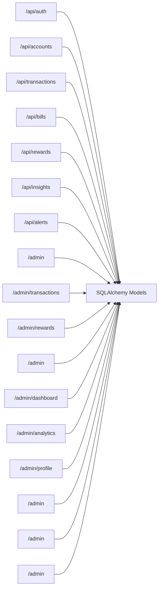

# API Reference

<cite>
**Referenced Files in This Document**
- [main.py](file://backend/app/main.py)
- [auth.py](file://backend/app/routers/auth.py)
- [accounts.py](file://backend/app/routers/accounts.py)
- [transactions.py](file://backend/app/routers/transactions.py)
- [bills.py](file://backend/app/routers/bills.py)
- [rewards.py](file://backend/app/routers/rewards.py)
- [insights.py](file://backend/app/routers/insights.py)
- [alerts.py](file://backend/app/routers/alerts.py)
- [admin.py](file://backend/app/routers/admin.py)
- [admin_transactions.py](file://backend/app/routers/admin_transactions.py)
- [admin_rewards.py](file://backend/app/routers/admin_rewards.py)
- [admin_alerts.py](file://backend/app/routers/admin_alerts.py)
- [admin_dashboard.py](file://backend/app/routers/admin_dashboard.py)
- [admin_analytics.py](file://backend/app/routers/admin_analytics.py)
- [admin_profile.py](file://backend/app/routers/admin_profile.py)
- [admin_system_simple.py](file://backend/app/routers/admin_system_simple.py)
- [admin_rewards_fixed.py](file://backend/app/routers/admin_rewards_fixed.py)
- [admin_rewards_simple.py](file://backend/app/routers/admin_rewards_simple.py)
</cite>

## Table of Contents
1. [Introduction](#introduction)
2. [Project Structure](#project-structure)
3. [Core Components](#core-components)
4. [Architecture Overview](#architecture-overview)
5. [Detailed Component Analysis](#detailed-component-analysis)
6. [Dependency Analysis](#dependency-analysis)
7. [Performance Considerations](#performance-considerations)
8. [Troubleshooting Guide](#troubleshooting-guide)
9. [Conclusion](#conclusion)
10. [Appendices](#appendices)

## Introduction
This document provides comprehensive API documentation for the Modern Digital Banking Dashboard backend. It covers all REST endpoints grouped by functional areas, including Authentication, Accounts, Transactions, Transfers, Budgets, Bills, Rewards, Insights, Alerts, Exports, Devices, Settings, and Admin endpoints. For each endpoint, you will find HTTP methods, URL patterns, request/response schemas, authentication requirements, error handling, and example requests/responses. Additional topics include API versioning, rate limiting, security considerations, and client integration guidelines.

## Project Structure
The backend is a FastAPI application that registers multiple routers under a single application entry point. Routers are organized by domain (e.g., auth, accounts, transactions, admin/*). CORS middleware is configured to allow selected origins.

```mermaid
graph TB
Client["Client"] --> Main["FastAPI App<br/>backend/app/main.py"]
Main --> AuthR["/api/auth/*<br/>backend/app/routers/auth.py"]
Main --> AccountsR["/api/accounts/*<br/>backend/app/routers/accounts.py"]
Main --> TransactionsR["/api/transactions/*<br/>backend/app/routers/transactions.py"]
Main --> BillsR["/api/bills/*<br/>backend/app/routers/bills.py"]
Main --> RewardsR["/api/rewards/*<br/>backend/app/routers/rewards.py"]
Main --> InsightsR["/api/insights/*<br/>backend/app/routers/insights.py"]
Main --> AlertsR["/api/alerts/*<br/>backend/app/routers/alerts.py"]
Main --> AdminBase["/admin/*<br/>backend/app/routers/admin.py"]
Main --> AdminTxn["/admin/transactions/*<br/>backend/app/routers/admin_transactions.py"]
Main --> AdminRewards["/admin/rewards/*<br/>backend/app/routers/admin_rewards.py"]
Main --> AdminAlerts["/admin/*<br/>backend/app/routers/admin_alerts.py"]
Main --> AdminDash["/admin/dashboard/*<br/>backend/app/routers/admin_dashboard.py"]
Main --> AdminAnalytics["/admin/analytics/*<br/>backend/app/routers/admin_analytics.py"]
Main --> AdminProfile["/admin/profile/*<br/>backend/app/routers/admin_profile.py"]
Main --> AdminSys["/admin/*<br/>backend/app/routers/admin_system_simple.py"]
Main --> AdminRewFixed["/admin/*<br/>backend/app/routers/admin_rewards_fixed.py"]
Main --> AdminRewSimple["/admin/*<br/>backend/app/routers/admin_rewards_simple.py"]
```

**Diagram sources**
- [main.py:56-85](file://backend/app/main.py#L56-L85)
- [auth.py:16](file://backend/app/routers/auth.py#L16)
- [accounts.py:9](file://backend/app/routers/accounts.py#L9)
- [transactions.py:9](file://backend/app/routers/transactions.py#L9)
- [bills.py:9](file://backend/app/routers/bills.py#L9)
- [rewards.py:8](file://backend/app/routers/rewards.py#L8)
- [insights.py:7](file://backend/app/routers/insights.py#L7)
- [alerts.py:8](file://backend/app/routers/alerts.py#L8)
- [admin.py:11](file://backend/app/routers/admin.py#L11)
- [admin_transactions.py:14](file://backend/app/routers/admin_transactions.py#L14)
- [admin_rewards.py:13](file://backend/app/routers/admin_rewards.py#L13)
- [admin_alerts.py:7](file://backend/app/routers/admin_alerts.py#L7)
- [admin_dashboard.py:8](file://backend/app/routers/admin_dashboard.py#L8)
- [admin_analytics.py:10](file://backend/app/routers/admin_analytics.py#L10)
- [admin_profile.py:10](file://backend/app/routers/admin_profile.py#L10)
- [admin_system_simple.py:5](file://backend/app/routers/admin_system_simple.py#L5)
- [admin_rewards_fixed.py:7](file://backend/app/routers/admin_rewards_fixed.py#L7)
- [admin_rewards_simple.py:5](file://backend/app/routers/admin_rewards_simple.py#L5)

**Section sources**
- [main.py:56-109](file://backend/app/main.py#L56-L109)

## Core Components
- Application entry point initializes FastAPI, registers routers, and sets up CORS.
- Authentication endpoints (/api/auth/*) handle signup, login, forgot password, OTP verification, password reset, and profile retrieval.
- User endpoints (/api/accounts, /api/transactions, /api/bills, /api/rewards, /api/insights, /api/alerts) require bearer token authentication via OAuth2.
- Admin endpoints (/admin/* and sub-namespaces) require admin authentication and authorization checks.

Key implementation patterns:
- Pydantic models define request/response schemas.
- SQLAlchemy sessions are injected via dependency functions.
- Centralized error handling via HTTPException with appropriate status codes.
- OAuth2 bearer token scheme for protected routes.

**Section sources**
- [main.py:25-85](file://backend/app/main.py#L25-L85)
- [auth.py:16](file://backend/app/routers/auth.py#L16)
- [accounts.py:9](file://backend/app/routers/accounts.py#L9)
- [transactions.py:9](file://backend/app/routers/transactions.py#L9)
- [bills.py:9](file://backend/app/routers/bills.py#L9)
- [rewards.py:8](file://backend/app/routers/rewards.py#L8)
- [insights.py:7](file://backend/app/routers/insights.py#L7)
- [alerts.py:8](file://backend/app/routers/alerts.py#L8)
- [admin.py:11](file://backend/app/routers/admin.py#L11)

## Architecture Overview
High-level API flow:
- Client sends HTTP requests to FastAPI endpoints.
- Routers validate request bodies using Pydantic models.
- Services interact with the database via SQLAlchemy sessions.
- Responses are returned as JSON objects.

**Diagram sources**
- [main.py:56-85](file://backend/app/main.py#L56-L85)
- [auth.py:135-202](file://backend/app/routers/auth.py#L135-L202)
- [accounts.py:18-52](file://backend/app/routers/accounts.py#L18-L52)
- [transactions.py:19-38](file://backend/app/routers/transactions.py#L19-L38)

## Detailed Component Analysis

### Authentication Endpoints
- Base path: /api/auth
- Security: OAuth2 with bearer token for protected routes; login route returns tokens.

Endpoints:
- POST /api/auth/signup
  - Description: Register a new user.
  - Authentication: Not required.
  - Request body: UserRegister { email, password, name }.
  - Response: { access_token, refresh_token, token_type, user }.
  - Status codes: 201 on success, 400 if user exists, 500 on server error.
  - Example request: { "email": "...", "password": "...", "name": "..." }.
  - Example response: { "access_token": "...", "refresh_token": "...", "token_type": "bearer", "user": { "email": "...", "name": "..." } }.

- POST /api/auth/login
  - Description: Authenticate user and return tokens.
  - Authentication: Not required.
  - Request body: UserLogin { email, password, role }.
  - Response: { access_token, refresh_token, token_type, user }.
  - Status codes: 200 on success, 401 on invalid credentials, 500 on server error.
  - Example request: { "email": "...", "password": "...", "role": "user" }.

- POST /api/auth/forgot-password
  - Description: Initiate password reset by sending OTP.
  - Authentication: Not required.
  - Request body: ForgotPassword { email }.
  - Response: Generic message indicating email presence handled.
  - Status codes: 200 regardless of user existence.
  - Example request: { "email": "..." }.

- POST /api/auth/verify-otp
  - Description: Verify OTP for password reset.
  - Authentication: Not required.
  - Request body: VerifyOTP { email, otp }.
  - Response: { "message": "OTP verified", "valid": true } or error.
  - Status codes: 200 on success, 400 on invalid OTP.
  - Example request: { "email": "...", "otp": "..." }.

- POST /api/auth/reset-password
  - Description: Reset password using OTP.
  - Authentication: Not required.
  - Request body: ResetPassword { email, new_password, otp }.
  - Response: { "message": "Password reset successfully" }.
  - Status codes: 200 on success, 400 on invalid/expired OTP, 404 if user not found, 500 on server error.
  - Example request: { "email": "...", "new_password": "...", "otp": "..." }.

- GET /api/auth/me
  - Description: Get current user profile.
  - Authentication: Required (Bearer token).
  - Response: { id, name, email, kyc_status }.
  - Status codes: 200 on success, 401 on invalid token.
  - Example response: { "id": 1, "name": "...", "email": "...", "kyc_status": "unverified" }.

Security and error handling:
- Invalid credentials result in 401 Unauthorized with WWW-Authenticate header.
- OTP verification and reset enforce expiration and usage checks.
- Password hashing and token creation handled internally.

**Section sources**
- [auth.py:135-315](file://backend/app/routers/auth.py#L135-L315)

### Accounts Endpoints
- Base path: /api/accounts
- Authentication: Required (Bearer token).

Endpoints:
- GET /api/accounts/
  - Description: List user accounts; auto-creates default if none exist.
  - Response: Array of account objects with fields: id, name, account_type, balance, masked_account, bank_name, currency, is_active, created_at.
  - Status codes: 200 on success, 500 on database error.
  - Example response: [ { "id": 1, "name": "Main Checking", "account_type": "checking", "balance": 25000.0, "masked_account": "****1234", "bank_name": "Demo Bank", "currency": "INR", "is_active": true, "created_at": "2025-01-01T00:00:00" } ].

- POST /api/accounts/
  - Description: Create a new account.
  - Request body: AccountCreate { name, account_type, bank_name, balance }.
  - Response: Single account object similar to GET response.
  - Status codes: 201 on success, 400 on invalid account type, 500 on database error.
  - Example request: { "name": "Savings", "account_type": "savings", "bank_name": "Demo Bank", "balance": 0.0 }.

- DELETE /api/accounts/{account_id}
  - Description: Delete an account owned by the user; cascades related transactions.
  - Response: { "message", "transactions_deleted" }.
  - Status codes: 200 on success, 404 if not found, 500 on failure.
  - Example response: { "message": "Account deleted successfully", "transactions_deleted": 0 }.

Validation and error handling:
- Account type must be a valid enum value; aliases supported (e.g., credit -> credit_card).
- Insufficient balance checks are not enforced during account creation.

**Section sources**
- [accounts.py:18-141](file://backend/app/routers/accounts.py#L18-L141)

### Transactions Endpoints
- Base path: /api/transactions
- Authentication: Required (Bearer token).

Endpoints:
- GET /api/transactions/
  - Description: List all transactions for the user, ordered by date descending.
  - Response: Array of transaction objects with fields: id, description, amount, txn_type, category, merchant, date, account_id.
  - Status codes: 200 on success.
  - Example response: [ { "id": 1, "description": "Grocery", "amount": 100.0, "txn_type": "debit", "category": "Groceries", "merchant": "Supermarket", "date": "2025-01-01T12:00:00", "account_id": 1 } ].

- POST /api/transactions/
  - Description: Create a transaction and update account balance accordingly.
  - Request body: TransactionCreate { account_id, description, amount, txn_type, category, merchant }.
  - Response: Single transaction object.
  - Status codes: 201 on success, 400 on insufficient balance, 404 if account not found, 500 on database error.
  - Example request: { "account_id": 1, "description": "Salary", "amount": 5000.0, "txn_type": "credit" }.

Validation and error handling:
- Debit transactions check against current account balance.
- Transaction type normalized to enum; amounts cast to float.

**Section sources**
- [transactions.py:19-96](file://backend/app/routers/transactions.py#L19-L96)

### Bills Endpoints
- Base path: /api/bills
- Authentication: Required (Bearer token) for user-facing operations; exchange rates endpoint is public.

Endpoints:
- GET /api/bills/
  - Description: List user bills; auto-creates sample bills if none exist.
  - Response: Array of bill objects with fields: id, name, amount, dueDate, status, autoPay, category.
  - Status codes: 200 on success.
  - Example response: [ { "id": 1, "name": "Electricity Bill", "amount": 150.0, "dueDate": "2025-01-15", "status": "pending", "autoPay": false, "category": "Bills & Utilities" } ].

- POST /api/bills/
  - Description: Create a new bill.
  - Request body: BillCreate { name, amount, due_date }.
  - Response: Single bill object.
  - Status codes: 201 on success, 500 on database error.
  - Example request: { "name": "Internet Bill", "amount": 80.0, "due_date": "2025-01-20" }.

- GET /api/bills/exchange-rates
  - Description: Public endpoint returning mock exchange rates.
  - Response: { "INR": 1.0, "USD": 0.012, ... }.
  - Status codes: 200 on success.

- GET /api/bills/{bill_id}
  - Description: Retrieve a specific bill.
  - Response: Single bill object.
  - Status codes: 200 on success, 404 if not found.

- PUT /api/bills/{bill_id}
  - Description: Update a bill.
  - Response: Updated bill object.
  - Status codes: 200 on success, 404 if not found.

- DELETE /api/bills/{bill_id}
  - Description: Delete a bill.
  - Response: { "message": "Bill deleted successfully" }.
  - Status codes: 200 on success, 404 if not found.

- PATCH /api/bills/{bill_id}/pay
  - Description: Mark a bill as paid.
  - Response: { "message": "Bill marked as paid", "id", "status" }.
  - Status codes: 200 on success, 404 if not found.

- PATCH /api/bills/{bill_id}/autopay
  - Description: Toggle autopay for a bill.
  - Response: { "message": "Auto-pay enabled/disabled", "id", "autoPay" }.
  - Status codes: 200 on success, 404 if not found.

Validation and error handling:
- Due dates parsed from ISO string.
- Autopay toggling handles missing field gracefully.

**Section sources**
- [bills.py:16-175](file://backend/app/routers/bills.py#L16-L175)

### Rewards Endpoints
- Base path: /api/rewards
- Authentication: Required (Bearer token).

Endpoints:
- GET /api/rewards/
  - Description: List user rewards.
  - Response: Array of reward objects with fields: id, title, points, points_balance, cash_value, category, is_claimed, given_by_admin, admin_message, description, created_at, last_updated.
  - Status codes: 200 on success, 500 on server error.

- GET /api/rewards/currency/rates
  - Description: Public endpoint returning mock currency rates.
  - Response: { "INR": 1.0, "USD": 0.012, ... }.
  - Status codes: 200 on success.

- POST /api/rewards/redeem
  - Description: Redeem points for cash or other redemption types.
  - Request body: RedeemRequest { points, redemption_type }.
  - Response: { "points_redeemed", "cash_value", "redemption_type" }.
  - Status codes: 200 on success, 400 if insufficient points.

- POST /api/rewards/
  - Description: Create a reward for the user.
  - Request body: RewardCreateRequest { title, description, points }.
  - Response: { "id", "title", "points", "message" }.
  - Status codes: 201 on success, 500 on server error.

- GET /api/rewards/{reward_id}
  - Description: Retrieve a specific reward.
  - Response: { "id", "title", "points", "cash_value", "category", "is_claimed" }.
  - Status codes: 200 on success, 404 if not found.

- PUT /api/rewards/{reward_id}
  - Description: Update a reward.
  - Response: { "id", "title", "points", "message" }.
  - Status codes: 200 on success, 404 if not found.

- DELETE /api/rewards/{reward_id}
  - Description: Delete a reward.
  - Response: { "message": "Reward deleted successfully" }.
  - Status codes: 200 on success, 404 if not found.

- POST /api/rewards/{reward_id}/claim
  - Description: Claim a reward (mock implementation).
  - Response: { "message", "reward_id", "points_claimed" }.
  - Status codes: 200 on success, 404 if not found.

Validation and error handling:
- Redemption type determines multiplier; simple deduction logic applied.

**Section sources**
- [rewards.py:19-162](file://backend/app/routers/rewards.py#L19-L162)

### Insights Endpoints
- Base path: /api/insights
- Authentication: Required (Bearer token).

Endpoints:
- GET /api/insights/
  - Description: Basic financial summary (income, expenses, net flow, savings rate, top category, transactions count).
  - Response: { income, expenses, net_flow, savings_rate, top_category, transactions_count }.
  - Status codes: 200 on success.

- GET /api/insights/spending
  - Description: Spending analysis by period (default month).
  - Query: period (month|week).
  - Response: { period, total_spent, daily_burn_rate, projected_monthly_spend, top_merchants }.
  - Status codes: 200 on success.

- GET /api/insights/categories
  - Description: Category breakdown (mock data).
  - Response: Array of category objects with category, amount, percentage.
  - Status codes: 200 on success.

- GET /api/insights/trends
  - Description: Monthly trends (mock data).
  - Response: Array of monthly trend objects.
  - Status codes: 200 on success.

- GET /api/insights/budgets
  - Description: Budget insights summary (mock data).
  - Response: { total_budgets, over_budget_count, average_utilization, highest_category }.
  - Status codes: 200 on success.

- GET /api/insights/cash-flow
  - Description: Cash flow metrics (mock data).
  - Query: period (monthly|quarterly).
  - Response: { period, income, expenses, net_flow, savings_rate }.
  - Status codes: 200 on success.

- GET /api/insights/top-merchants
  - Description: Top merchants (mock data).
  - Query: limit (integer).
  - Response: Array of merchant objects with merchant, total_spent, transaction_count.
  - Status codes: 200 on success.

- GET /api/insights/burn-rate
  - Description: Burn rate metrics (mock data).
  - Response: { current_month_spent, days_passed, daily_burn_rate, projected_monthly_spend }.
  - Status codes: 200 on success.

- GET /api/insights/category-breakdown
  - Description: Category breakdown (mock data).
  - Response: Array of category objects.
  - Status codes: 200 on success.

- GET /api/insights/savings-trend
  - Description: Savings trend over months (mock data).
  - Query: months (integer).
  - Response: Array of monthly savings objects.
  - Status codes: 200 on success.

Validation and error handling:
- All endpoints return mock data; no database queries for these endpoints.

**Section sources**
- [insights.py:9-159](file://backend/app/routers/insights.py#L9-L159)

### Alerts Endpoints
- Base path: /api/alerts
- Authentication: Required (Bearer token).

Endpoints:
- GET /api/alerts/
  - Description: List user alerts; auto-creates a welcome alert if none exist.
  - Response: Array of alert objects with fields: id, title, message, alert_type, type, is_read, created_at.
  - Status codes: 200 on success.

- POST /api/alerts/
  - Description: Create an alert with priority mapping to internal alert types.
  - Request body: AlertCreate { title, message, priority }.
  - Response: Created alert object.
  - Status codes: 201 on success, 422 if invalid priority/type mapping.

- PATCH /api/alerts/{alert_id}/read
  - Description: Mark an alert as read.
  - Response: { "message": "Alert marked as read" }.
  - Status codes: 200 on success, 404 if not found.

- PUT /api/alerts/{alert_id}
  - Description: Update an alert’s type and message.
  - Response: Updated alert object.
  - Status codes: 200 on success, 404 if not found.

- DELETE /api/alerts/{alert_id}
  - Description: Delete an alert.
  - Response: { "message": "Alert deleted successfully" }.
  - Status codes: 200 on success, 404 if not found.

- GET /api/alerts/check-reminders
  - Description: Compatibility endpoint returning empty array.
  - Response: [].
  - Status codes: 200 on success.

- POST /api/alerts/bill-reminders
  - Description: Compatibility endpoint returning empty reminders.
  - Response: { "reminders": [], "count": 0 }.
  - Status codes: 200 on success.

- GET /api/alerts/summary
  - Description: Summary counts by alert type.
  - Response: { total, critical, high, medium, recent }.
  - Status codes: 200 on success.

Validation and error handling:
- Priority mapping supports info/low/low_balance, high/bill_due, critical/budget_exceeded.
- Duplicate endpoints without trailing slash included for compatibility.

**Section sources**
- [alerts.py:26-180](file://backend/app/routers/alerts.py#L26-L180)

### Admin Endpoints
- Base path: /admin (and sub-namespaces)
- Authentication: Admin required.

Endpoints:
- GET /admin/users
  - Query: search (optional), kyc_status (optional).
  - Response: Array of users matching filters.
  - Status codes: 200 on success.

- GET /admin/users/{user_id}
  - Path: user_id (integer).
  - Response: User details.
  - Status codes: 200 on success, 404 if not found.

- PATCH /admin/users/{user_id}/kyc
  - Path: user_id (integer).
  - Request body: AdminKycUpdate { status }.
  - Response: Updated user object.
  - Status codes: 200 on success, 404 if not found.

- GET /admin/transactions/
  - Query: category, txn_type, start_date, end_date.
  - Response: Array of transactions with user info.
  - Status codes: 200 on success.

- GET /admin/transactions/export
  - Description: Export all transactions to CSV.
  - Response: { filename, content }.
  - Status codes: 200 on success.

- POST /admin/transactions/import
  - Description: Import transactions from CSV.
  - Form-data: file (CSV).
  - Response: { "message": "{N} transactions imported successfully" }.
  - Status codes: 200 on success, 400 if file type invalid.

- GET /admin/rewards/
  - Description: List admin rewards.
  - Response: Array of admin rewards.
  - Status codes: 200 on success.

- POST /admin/rewards/
  - Description: Create an admin reward.
  - Response: Created reward object.
  - Status codes: 201 on success.

- PATCH /admin/rewards/{reward_id}/approve
  - Path: reward_id (integer).
  - Response: { "message": "Reward approved successfully" }.
  - Status codes: 200 on success, 404 if not found.

- DELETE /admin/rewards/{reward_id}
  - Path: reward_id (integer).
  - Response: { "message": "Reward deleted successfully" }.
  - Status codes: 200 on success, 404 if not found.

- GET /admin/alerts
  - Query: type (optional).
  - Response: Admin alerts filtered by type.
  - Status codes: 200 on success.

- GET /admin/logs
  - Query: action (optional).
  - Response: Audit logs filtered by action.
  - Status codes: 200 on success.

- GET /admin/dashboard/summary
  - Response: Admin dashboard summary.
  - Status codes: 200 on success.

- GET /admin/analytics/summary
  - Response: Admin analytics summary.
  - Status codes: 200 on success.

- GET /admin/analytics/top-users
  - Response: Top users by activity.
  - Status codes: 200 on success.

- GET /admin/profile
  - Response: Admin profile details.
  - Status codes: 200 on success.

- PUT /admin/profile
  - Request body: AdminProfileUpdate { name, phone }.
  - Response: { "message": "Admin profile updated" }.
  - Status codes: 200 on success.

- PUT /admin/change-password
  - Request body: AdminChangePassword { current_password, new_password }.
  - Response: { "message": "Password updated successfully" }.
  - Status codes: 200 on success, 400 if current password invalid.

- GET /admin/system-summary
  - Response: System health summary.
  - Status codes: 200 on success.

- GET /admin/alerts
  - Response: System alerts.
  - Status codes: 200 on success.

- GET /admin/suspicious-activity
  - Response: Empty array placeholder.
  - Status codes: 200 on success.

- GET /admin/system/health
  - Response: System health metrics.
  - Status codes: 200 on success.

- POST /admin/system/backup
  - Response: { "message": "System backup completed successfully", "status": "completed" }.
  - Status codes: 200 on success.

- POST /admin/system/clear-cache
  - Response: { "message": "System cache cleared successfully", "status": "completed" }.
  - Status codes: 200 on success.

- GET /admin/system/config
  - Response: { "maintenance_mode": false, "backup_enabled": true }.
  - Status codes: 200 on success.

- PUT /admin/system/config
  - Response: { "message": "Configuration updated successfully" }.
  - Status codes: 200 on success.

- GET /admin/rewards/recent
  - Response: Recent admin-given rewards with user details.
  - Status codes: 200 on success.

- POST /admin/users/{user_id}/give-reward
  - Path: user_id (integer).
  - Request body: Reward payload (title, points, admin_message).
  - Response: { "message": "Successfully gave {points} points to {name}" }.
  - Status codes: 200 on success, 404 if user not found.

Validation and error handling:
- Admin endpoints enforce admin authentication via dependency.
- CSV import validates file extension and skips invalid rows.
- Password change validates current password before updating.

**Section sources**
- [admin.py:14-45](file://backend/app/routers/admin.py#L14-L45)
- [admin_transactions.py:63-111](file://backend/app/routers/admin_transactions.py#L63-L111)
- [admin_rewards.py:28-68](file://backend/app/routers/admin_rewards.py#L28-L68)
- [admin_alerts.py:10-24](file://backend/app/routers/admin_alerts.py#L10-L24)
- [admin_dashboard.py:11-14](file://backend/app/routers/admin_dashboard.py#L11-L14)
- [admin_analytics.py:13-21](file://backend/app/routers/admin_analytics.py#L13-L21)
- [admin_profile.py:15-46](file://backend/app/routers/admin_profile.py#L15-L46)
- [admin_system_simple.py:7-84](file://backend/app/routers/admin_system_simple.py#L7-L84)
- [admin_rewards_fixed.py:9-63](file://backend/app/routers/admin_rewards_fixed.py#L9-L63)
- [admin_rewards_simple.py:7-19](file://backend/app/routers/admin_rewards_simple.py#L7-L19)

## Dependency Analysis
- Router-to-router dependencies:
  - No direct intra-router dependencies observed among the documented routers.
- Router-to-model/service dependencies:
  - Routers depend on SQLAlchemy models and services for persistence and business logic.
- Cross-cutting concerns:
  - OAuth2 bearer token dependency for user-protected endpoints.
  - Admin-only dependency for admin endpoints.
  - CORS configured globally for allowed origins.

**Diagram sources**
- [auth.py:16](file://backend/app/routers/auth.py#L16)
- [accounts.py:9](file://backend/app/routers/accounts.py#L9)
- [transactions.py:9](file://backend/app/routers/transactions.py#L9)
- [bills.py:9](file://backend/app/routers/bills.py#L9)
- [rewards.py:8](file://backend/app/routers/rewards.py#L8)
- [insights.py:7](file://backend/app/routers/insights.py#L7)
- [alerts.py:8](file://backend/app/routers/alerts.py#L8)
- [admin.py:11](file://backend/app/routers/admin.py#L11)
- [admin_transactions.py:14](file://backend/app/routers/admin_transactions.py#L14)
- [admin_rewards.py:13](file://backend/app/routers/admin_rewards.py#L13)
- [admin_alerts.py:7](file://backend/app/routers/admin_alerts.py#L7)
- [admin_dashboard.py:8](file://backend/app/routers/admin_dashboard.py#L8)
- [admin_analytics.py:10](file://backend/app/routers/admin_analytics.py#L10)
- [admin_profile.py:10](file://backend/app/routers/admin_profile.py#L10)
- [admin_system_simple.py:5](file://backend/app/routers/admin_system_simple.py#L5)
- [admin_rewards_fixed.py:7](file://backend/app/routers/admin_rewards_fixed.py#L7)
- [admin_rewards_simple.py:5](file://backend/app/routers/admin_rewards_simple.py#L5)

**Section sources**
- [main.py:56-85](file://backend/app/main.py#L56-L85)

## Performance Considerations
- Endpoint-level:
  - GET /api/transactions/ performs a full user transaction scan; consider pagination for large datasets.
  - GET /api/insights/* endpoints return mock data; production should implement efficient aggregations.
- Database-level:
  - Use indexes on frequently filtered fields (e.g., user_id, account_id, txn_date).
  - Batch operations for CSV import to reduce round trips.
- Network-level:
  - Enable compression (gzip) at the web server/proxy level.
  - Consider caching for read-heavy public endpoints (e.g., exchange rates).

[No sources needed since this section provides general guidance]

## Troubleshooting Guide
Common issues and resolutions:
- Authentication failures:
  - Symptom: 401 Unauthorized on protected endpoints.
  - Cause: Invalid or missing bearer token.
  - Resolution: Ensure Authorization header is set with Bearer token obtained from /api/auth/login.

- Invalid credentials during login/signup:
  - Symptom: 401 Unauthorized or signup conflict.
  - Cause: Incorrect password/email mismatch or existing user.
  - Resolution: Verify credentials; ensure unique email.

- OTP-related errors:
  - Symptom: 400 Invalid OTP or Invalid or expired OTP.
  - Cause: Wrong OTP or expired window.
  - Resolution: Re-initiate forgot-password flow; verify OTP within expiry window.

- Transaction creation failures:
  - Symptom: 400 Insufficient balance or 404 Account not found.
  - Cause: Debit exceeding balance or invalid account_id.
  - Resolution: Check account balance and account ownership.

- CSV import errors:
  - Symptom: 400 Only CSV files are allowed.
  - Cause: Non-CSV upload.
  - Resolution: Ensure file extension is .csv.

- Admin access denied:
  - Symptom: 401 or 403 when accessing /admin/* endpoints.
  - Cause: Missing or invalid admin credentials.
  - Resolution: Authenticate as admin and retry.

**Section sources**
- [auth.py:58-63](file://backend/app/routers/auth.py#L58-L63)
- [transactions.py:54-55](file://backend/app/routers/transactions.py#L54-L55)
- [admin_transactions.py:20-22](file://backend/app/routers/admin_transactions.py#L20-L22)

## Conclusion
This API reference documents all REST endpoints in the banking application, covering user and admin functionalities. Authentication is enforced via OAuth2 bearer tokens, and CORS is configured for development and production domains. Admin endpoints provide administrative controls for users, transactions, rewards, alerts, and system monitoring. Clients should implement token refresh strategies, handle OTP flows, and adopt pagination for large datasets.

[No sources needed since this section summarizes without analyzing specific files]

## Appendices

### API Versioning
- No explicit API versioning is implemented in the documented routers. Base URLs use /api/ and /admin/ prefixes. Consider adopting URL versioning (/api/v1/) or Accept-Version headers for future-proofing.

[No sources needed since this section provides general guidance]

### Rate Limiting
- No built-in rate limiting is present in the documented code. Implement rate limiting at the gateway/proxy or via middleware for production deployments.

[No sources needed since this section provides general guidance]

### Security Considerations
- Transport security: Use HTTPS in production.
- Token security: Store refresh tokens securely; rotate tokens periodically.
- Input validation: Pydantic models provide validation; sanitize and normalize inputs.
- Admin privileges: Enforce admin-only access for /admin/* endpoints.
- CORS: Origins are configurable via environment variable; restrict to trusted domains.

**Section sources**
- [main.py:91-109](file://backend/app/main.py#L91-L109)

### Client Implementation Guidelines
- Authentication flow:
  - POST /api/auth/signup to register.
  - POST /api/auth/login to authenticate and obtain tokens.
  - Use access_token in Authorization header for protected endpoints.
  - Refresh tokens via application-specific refresh mechanism if needed.
- Error handling:
  - Parse HTTPException details for user-friendly messages.
  - Handle 401 Unauthorized by prompting re-login.
- Pagination and filtering:
  - Apply query parameters for admin endpoints (category, txn_type, start_date, end_date).
  - Implement client-side pagination for large lists.
- CSV operations:
  - For imports, ensure CSV headers match expected fields.
  - Validate file type before upload.

[No sources needed since this section provides general guidance]