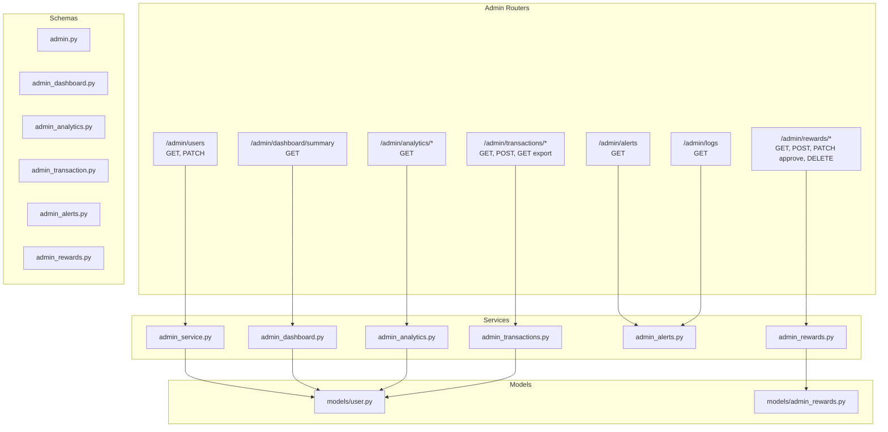
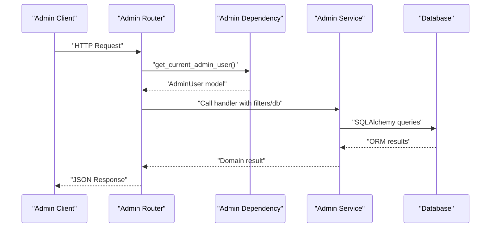
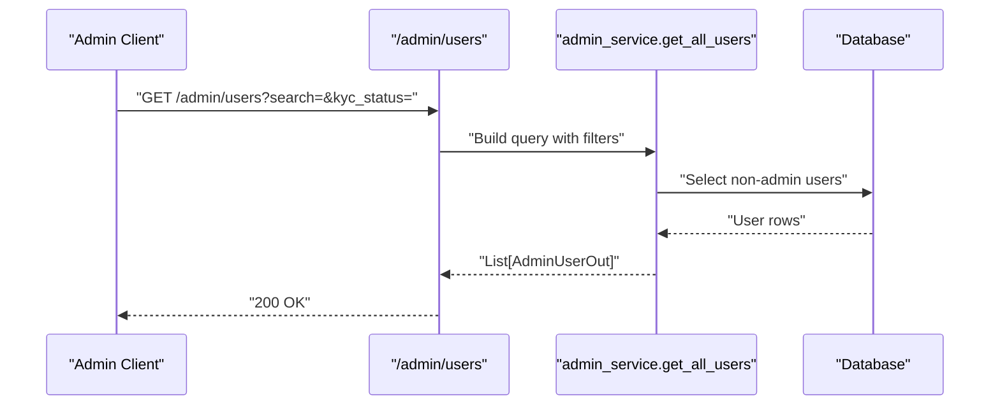
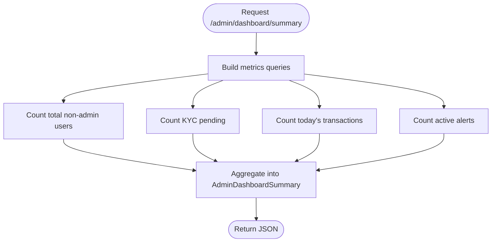
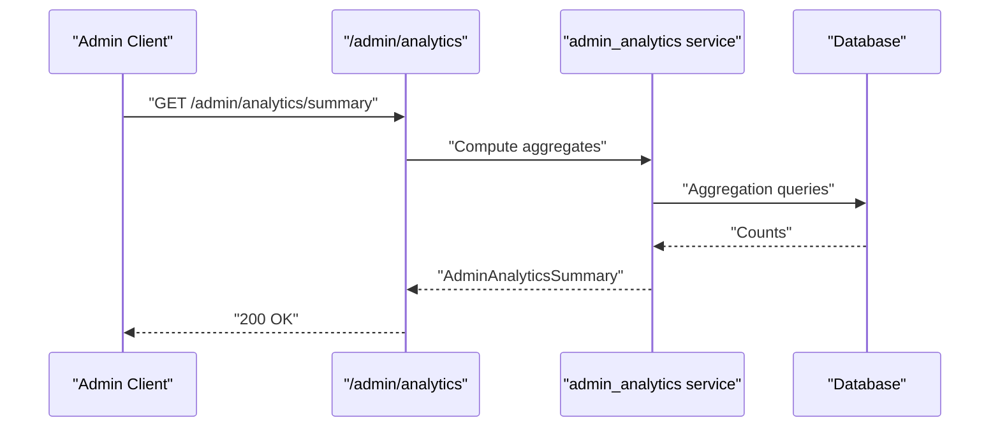
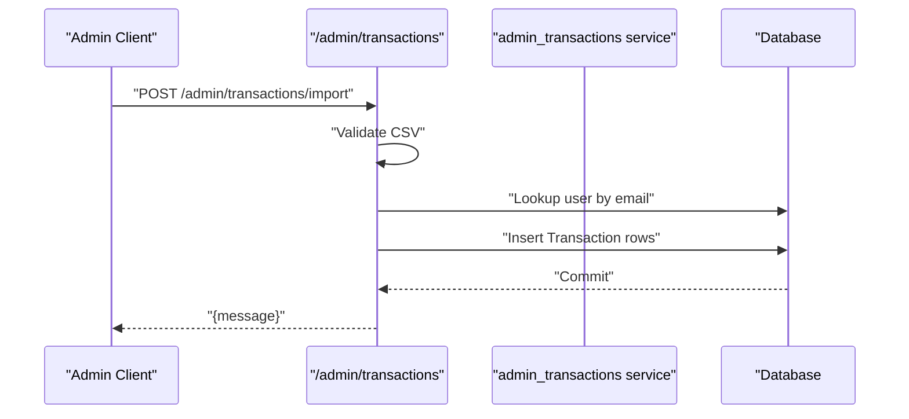
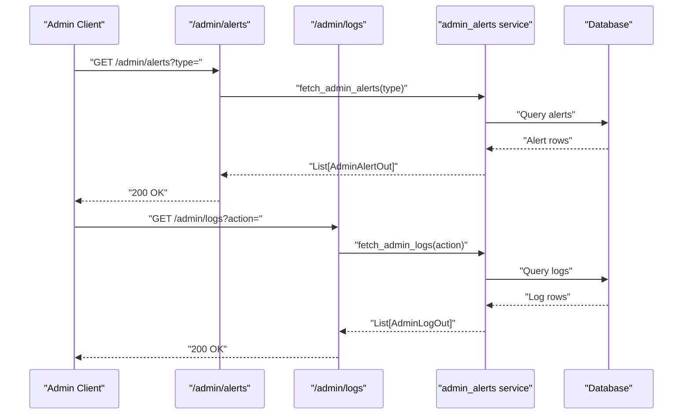
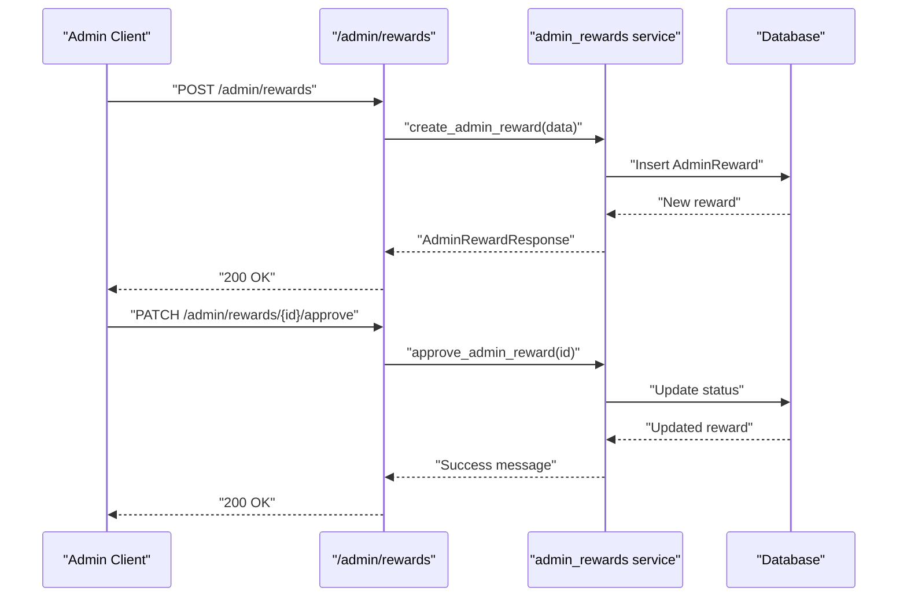
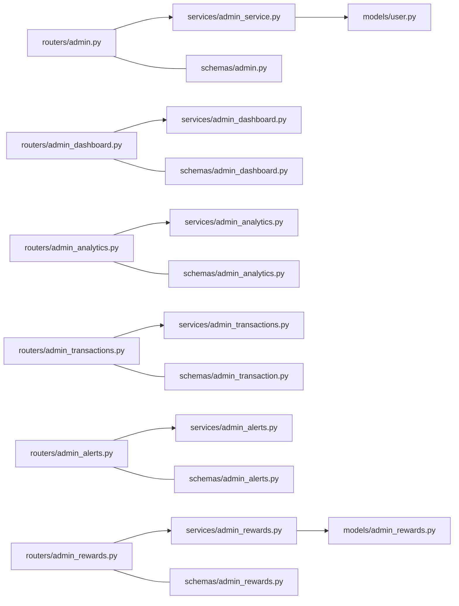

# Administrative API

<cite>
**Referenced Files in This Document**
- [admin.py](file://backend/app/routers/admin.py)
- [admin_service.py](file://backend/app/services/admin_service.py)
- [admin.py](file://backend/app/schemas/admin.py)
- [user.py](file://backend/app/models/user.py)
- [admin_dashboard.py](file://backend/app/routers/admin_dashboard.py)
- [admin_analytics.py](file://backend/app/routers/admin_analytics.py)
- [admin_transactions.py](file://backend/app/routers/admin_transactions.py)
- [admin_alerts.py](file://backend/app/routers/admin_alerts.py)
- [admin_rewards.py](file://backend/app/routers/admin_rewards.py)
- [admin_dashboard.py](file://backend/app/schemas/admin_dashboard.py)
- [admin_analytics.py](file://backend/app/schemas/admin_analytics.py)
- [admin_transaction.py](file://backend/app/schemas/admin_transaction.py)
- [admin_alerts.py](file://backend/app/schemas/admin_alerts.py)
- [admin_rewards.py](file://backend/app/schemas/admin_rewards.py)
- [admin_rewards.py](file://backend/app/models/admin_rewards.py)
- [admin_service.py](file://backend/app/services/admin_dashboard.py)
- [admin_service.py](file://backend/app/services/admin_analytics.py)
- [admin_service.py](file://backend/app/services/admin_transactions.py)
- [admin_service.py](file://backend/app/services/admin_alerts.py)
- [admin_service.py](file://backend/app/services/admin_rewards.py)
- [dependencies.py](file://backend/app/dependencies.py)
- [main.py](file://backend/app/main.py)
</cite>

## Table of Contents
1. [Introduction](#introduction)
2. [Project Structure](#project-structure)
3. [Core Components](#core-components)
4. [Architecture Overview](#architecture-overview)
5. [Detailed Component Analysis](#detailed-component-analysis)
6. [Dependency Analysis](#dependency-analysis)
7. [Performance Considerations](#performance-considerations)
8. [Troubleshooting Guide](#troubleshooting-guide)
9. [Conclusion](#conclusion)
10. [Appendices](#appendices)

## Introduction
This document provides comprehensive API documentation for administrative endpoints. It covers admin dashboard metrics, user management, transaction review and import/export, analytics reporting, and system monitoring/alerts. It also documents schemas for admin operations, user administration, and system analytics, along with role-based access control, admin authentication, and privileged operations. Workflow examples and best practices are included to guide administrators through common tasks.

## Project Structure
Administrative APIs are organized under dedicated routers and services, with schemas defining request/response contracts. The admin domain is prefixed consistently and protected via dependency injection that enforces admin privileges.

**Diagram sources**
- [admin.py:1-45](file://backend/app/routers/admin.py#L1-L45)
- [admin_dashboard.py:1-14](file://backend/app/routers/admin_dashboard.py#L1-L14)
- [admin_analytics.py:1-21](file://backend/app/routers/admin_analytics.py#L1-L21)
- [admin_transactions.py:1-111](file://backend/app/routers/admin_transactions.py#L1-L111)
- [admin_alerts.py:1-24](file://backend/app/routers/admin_alerts.py#L1-L24)
- [admin_rewards.py:1-68](file://backend/app/routers/admin_rewards.py#L1-L68)
- [admin_service.py:1-63](file://backend/app/services/admin_service.py#L1-L63)
- [admin_dashboard.py](file://backend/app/services/admin_dashboard.py)
- [admin_analytics.py](file://backend/app/services/admin_analytics.py)
- [admin_transactions.py](file://backend/app/services/admin_transactions.py)
- [admin_alerts.py](file://backend/app/services/admin_alerts.py)
- [admin_rewards.py](file://backend/app/services/admin_rewards.py)
- [admin.py:1-41](file://backend/app/schemas/admin.py#L1-L41)
- [admin_dashboard.py:1-8](file://backend/app/schemas/admin_dashboard.py#L1-L8)
- [admin_analytics.py:1-18](file://backend/app/schemas/admin_analytics.py#L1-L18)
- [admin_transaction.py:1-17](file://backend/app/schemas/admin_transaction.py#L1-L17)
- [admin_alerts.py:1-31](file://backend/app/schemas/admin_alerts.py#L1-L31)
- [admin_rewards.py:1-26](file://backend/app/schemas/admin_rewards.py#L1-L26)
- [user.py:1-65](file://backend/app/models/user.py#L1-L65)
- [admin_rewards.py:1-33](file://backend/app/models/admin_rewards.py#L1-L33)

**Section sources**
- [admin.py:1-45](file://backend/app/routers/admin.py#L1-L45)
- [admin_dashboard.py:1-14](file://backend/app/routers/admin_dashboard.py#L1-L14)
- [admin_analytics.py:1-21](file://backend/app/routers/admin_analytics.py#L1-L21)
- [admin_transactions.py:1-111](file://backend/app/routers/admin_transactions.py#L1-L111)
- [admin_alerts.py:1-24](file://backend/app/routers/admin_alerts.py#L1-L24)
- [admin_rewards.py:1-68](file://backend/app/routers/admin_rewards.py#L1-L68)

## Core Components
- Admin user management: list users, filter by search and KYC status, view user details, and update KYC status.
- Admin dashboard: summary metrics for users, KYC, transactions, and active alerts.
- Analytics: global stats and top users by activity.
- Transactions: list filtered transactions, export to CSV, and import CSV into the system.
- Alerts and logs: fetch alerts and audit logs with optional filters.
- Rewards: CRUD for admin-defined rewards, including approval workflow.

Key privilege enforcement:
- All admin endpoints depend on a current admin user dependency to ensure only authorized administrators can access privileged operations.

**Section sources**
- [admin.py:14-45](file://backend/app/routers/admin.py#L14-L45)
- [admin_service.py:38-63](file://backend/app/services/admin_service.py#L38-L63)
- [admin_dashboard.py:11-14](file://backend/app/routers/admin_dashboard.py#L11-L14)
- [admin_analytics.py:13-21](file://backend/app/routers/admin_analytics.py#L13-L21)
- [admin_transactions.py:63-111](file://backend/app/routers/admin_transactions.py#L63-L111)
- [admin_alerts.py:10-24](file://backend/app/routers/admin_alerts.py#L10-L24)
- [admin_rewards.py:28-68](file://backend/app/routers/admin_rewards.py#L28-L68)

## Architecture Overview
The admin API follows a layered architecture:
- Routers define endpoints and bind request/response schemas.
- Services encapsulate business logic and database queries.
- Schemas validate and normalize data.
- Models represent persisted entities.
- Dependencies enforce admin-only access.

**Diagram sources**
- [admin.py:14-45](file://backend/app/routers/admin.py#L14-L45)
- [admin_service.py:38-63](file://backend/app/services/admin_service.py#L38-L63)
- [dependencies.py](file://backend/app/dependencies.py)

**Section sources**
- [admin.py:1-45](file://backend/app/routers/admin.py#L1-L45)
- [admin_service.py:1-63](file://backend/app/services/admin_service.py#L1-L63)
- [dependencies.py](file://backend/app/dependencies.py)

## Detailed Component Analysis

### Admin User Management
Endpoints:
- GET /admin/users: List users with optional search and KYC status filters.
- GET /admin/users/{user_id}: Retrieve a single user’s details.
- PATCH /admin/users/{user_id}/kyc: Update a user’s KYC status.

Data flows:
- Filtering logic applies search term and KYC status to exclude admin users.
- KYC updates are validated and committed atomically.

**Diagram sources**
- [admin.py:14-21](file://backend/app/routers/admin.py#L14-L21)
- [admin_service.py:38-46](file://backend/app/services/admin_service.py#L38-L46)

**Section sources**
- [admin.py:14-45](file://backend/app/routers/admin.py#L14-L45)
- [admin_service.py:38-63](file://backend/app/services/admin_service.py#L38-L63)
- [admin.py:13-41](file://backend/app/schemas/admin.py#L13-L41)
- [user.py:31-52](file://backend/app/models/user.py#L31-L52)

### Admin Dashboard
Endpoint:
- GET /admin/dashboard/summary: Returns aggregated metrics.

Metrics include:
- total_users
- kyc_pending
- today_transactions
- active_alerts

**Diagram sources**
- [admin_dashboard.py:11-14](file://backend/app/routers/admin_dashboard.py#L11-L14)
- [admin_dashboard.py:3-8](file://backend/app/schemas/admin_dashboard.py#L3-L8)

**Section sources**
- [admin_dashboard.py:1-14](file://backend/app/routers/admin_dashboard.py#L1-L14)
- [admin_dashboard.py:1-8](file://backend/app/schemas/admin_dashboard.py#L1-L8)

### Admin Analytics
Endpoints:
- GET /admin/analytics/summary: Global stats (users, KYC statuses, transactions, rewards issued).
- GET /admin/analytics/top-users: Top users by transaction count and amount.

**Diagram sources**
- [admin_analytics.py:13-21](file://backend/app/routers/admin_analytics.py#L13-L21)
- [admin_analytics.py:4-18](file://backend/app/schemas/admin_analytics.py#L4-L18)

**Section sources**
- [admin_analytics.py:1-21](file://backend/app/routers/admin_analytics.py#L1-L21)
- [admin_analytics.py:1-18](file://backend/app/schemas/admin_analytics.py#L1-L18)

### Admin Transactions
Endpoints:
- GET /admin/transactions: List transactions with optional category, type, and date range filters.
- GET /admin/transactions/export: Export all transactions to CSV.
- POST /admin/transactions/import: Import transactions from CSV.

**Diagram sources**
- [admin_transactions.py:89-111](file://backend/app/routers/admin_transactions.py#L89-L111)
- [admin_transaction.py:6-17](file://backend/app/schemas/admin_transaction.py#L6-L17)

**Section sources**
- [admin_transactions.py:1-111](file://backend/app/routers/admin_transactions.py#L1-L111)
- [admin_transaction.py:1-17](file://backend/app/schemas/admin_transaction.py#L1-L17)

### Admin Alerts and Logs
Endpoints:
- GET /admin/alerts: Fetch alerts optionally filtered by type.
- GET /admin/logs: Fetch audit logs optionally filtered by action.

**Diagram sources**
- [admin_alerts.py:10-24](file://backend/app/routers/admin_alerts.py#L10-L24)
- [admin_alerts.py:10-31](file://backend/app/schemas/admin_alerts.py#L10-L31)

**Section sources**
- [admin_alerts.py:1-24](file://backend/app/routers/admin_alerts.py#L1-L24)
- [admin_alerts.py:1-31](file://backend/app/schemas/admin_alerts.py#L1-L31)

### Admin Rewards
Endpoints:
- GET /admin/rewards: List rewards; response normalizes applies_to to a list.
- POST /admin/rewards: Create a new reward.
- PATCH /admin/rewards/{reward_id}/approve: Approve a reward.
- DELETE /admin/rewards/{reward_id}: Remove a reward.

**Diagram sources**
- [admin_rewards.py:38-68](file://backend/app/routers/admin_rewards.py#L38-L68)
- [admin_rewards.py:6-26](file://backend/app/schemas/admin_rewards.py#L6-L26)
- [admin_rewards.py:11-33](file://backend/app/models/admin_rewards.py#L11-L33)

**Section sources**
- [admin_rewards.py:1-68](file://backend/app/routers/admin_rewards.py#L1-L68)
- [admin_rewards.py:1-26](file://backend/app/schemas/admin_rewards.py#L1-L26)
- [admin_rewards.py:1-33](file://backend/app/models/admin_rewards.py#L1-L33)

## Dependency Analysis
Admin endpoints rely on:
- Database session injection for all handlers.
- Admin-only dependency to enforce authorization.
- Services to encapsulate query logic and normalization.
- Schemas to validate and serialize responses.

**Diagram sources**
- [admin.py:1-45](file://backend/app/routers/admin.py#L1-L45)
- [admin_dashboard.py:1-14](file://backend/app/routers/admin_dashboard.py#L1-L14)
- [admin_analytics.py:1-21](file://backend/app/routers/admin_analytics.py#L1-L21)
- [admin_transactions.py:1-111](file://backend/app/routers/admin_transactions.py#L1-L111)
- [admin_alerts.py:1-24](file://backend/app/routers/admin_alerts.py#L1-L24)
- [admin_rewards.py:1-68](file://backend/app/routers/admin_rewards.py#L1-L68)
- [admin_service.py:1-63](file://backend/app/services/admin_service.py#L1-L63)
- [admin_dashboard.py](file://backend/app/services/admin_dashboard.py)
- [admin_analytics.py](file://backend/app/services/admin_analytics.py)
- [admin_transactions.py](file://backend/app/services/admin_transactions.py)
- [admin_alerts.py](file://backend/app/services/admin_alerts.py)
- [admin_rewards.py](file://backend/app/services/admin_rewards.py)
- [admin.py:1-41](file://backend/app/schemas/admin.py#L1-L41)
- [admin_dashboard.py:1-8](file://backend/app/schemas/admin_dashboard.py#L1-L8)
- [admin_analytics.py:1-18](file://backend/app/schemas/admin_analytics.py#L1-L18)
- [admin_transaction.py:1-17](file://backend/app/schemas/admin_transaction.py#L1-L17)
- [admin_alerts.py:1-31](file://backend/app/schemas/admin_alerts.py#L1-L31)
- [admin_rewards.py:1-26](file://backend/app/schemas/admin_rewards.py#L1-L26)
- [user.py:1-65](file://backend/app/models/user.py#L1-L65)
- [admin_rewards.py:1-33](file://backend/app/models/admin_rewards.py#L1-L33)

**Section sources**
- [admin.py:1-45](file://backend/app/routers/admin.py#L1-L45)
- [admin_service.py:1-63](file://backend/app/services/admin_service.py#L1-L63)
- [dependencies.py](file://backend/app/dependencies.py)

## Performance Considerations
- Filtering and pagination: Prefer filtering at the database level (already applied) and consider adding pagination for large datasets on user listings and analytics.
- Bulk imports: The CSV import iterates rows and commits per batch; consider batching inserts and transactions to reduce overhead.
- Caching: Cache dashboard summaries and analytics aggregates to reduce repeated heavy queries.
- Indexes: Ensure database indexes exist on frequently filtered columns (e.g., email, KYC status, dates).

## Troubleshooting Guide
Common issues and resolutions:
- Unauthorized access: Ensure the admin dependency is present and functioning; verify token validity and admin flag on the user record.
- User not found errors: Handlers return not-found errors when a user ID does not exist; confirm IDs and search terms.
- CSV import failures: Validate CSV headers and types; the importer skips invalid rows and continues processing.
- KYC updates: Confirm the status enum values align with the expected set.

**Section sources**
- [admin_service.py:31-35](file://backend/app/services/admin_service.py#L31-L35)
- [admin_transactions.py:90-111](file://backend/app/routers/admin_transactions.py#L90-L111)
- [admin.py:40-41](file://backend/app/schemas/admin.py#L40-L41)
- [user.py:31-35](file://backend/app/models/user.py#L31-L35)

## Conclusion
The administrative API provides a secure, extensible foundation for bank operations oversight. With strict admin-only access, robust filtering, and clear schemas, it supports efficient user management, transaction review, analytics, and system monitoring. Extending the system with pagination, caching, and bulk operations will further improve performance and usability.

## Appendices

### Role-Based Access Control and Authentication
- Admin-only routes: All admin endpoints depend on a current admin user dependency.
- Admin flag: Users with the admin flag are excluded from user listings and treated as privileged actors.
- Token-based sessions: Authentication is handled elsewhere; admin endpoints require a valid admin session.

**Section sources**
- [admin.py:14-45](file://backend/app/routers/admin.py#L14-L45)
- [user.py:46-46](file://backend/app/models/user.py#L46-L46)
- [dependencies.py](file://backend/app/dependencies.py)

### API Reference Tables

- Admin Users
  - GET /admin/users
    - Query params: search (string), kyc_status (string)
    - Response: array of AdminUserOut
  - GET /admin/users/{user_id}
    - Path param: user_id (int)
    - Response: AdminUserDetailOut
  - PATCH /admin/users/{user_id}/kyc
    - Path param: user_id (int)
    - Body: AdminKycUpdate
    - Response: AdminUserOut

- Admin Dashboard
  - GET /admin/dashboard/summary
    - Response: AdminDashboardSummary

- Admin Analytics
  - GET /admin/analytics/summary
    - Response: AdminAnalyticsSummary
  - GET /admin/analytics/top-users
    - Response: array of TopUserAnalytics

- Admin Transactions
  - GET /admin/transactions
    - Query params: category (string), txn_type (string), start_date (date), end_date (date)
    - Response: array of AdminTransactionOut
  - GET /admin/transactions/export
    - Response: { filename: string, content: string }
  - POST /admin/transactions/import
    - Form-data: file (CSV)
    - Response: { message: string }

- Admin Alerts and Logs
  - GET /admin/alerts
    - Query params: type (string)
    - Response: array of AdminAlertOut
  - GET /admin/logs
    - Query params: action (string)
    - Response: array of AdminLogOut

- Admin Rewards
  - GET /admin/rewards
    - Response: array of AdminRewardResponse
  - POST /admin/rewards
    - Body: AdminRewardCreate
    - Response: AdminRewardResponse
  - PATCH /admin/rewards/{reward_id}/approve
    - Path param: reward_id (int)
    - Response: { message: string }
  - DELETE /admin/rewards/{reward_id}
    - Path param: reward_id (int)
    - Response: { message: string }

**Section sources**
- [admin.py:14-45](file://backend/app/routers/admin.py#L14-L45)
- [admin_dashboard.py:11-14](file://backend/app/routers/admin_dashboard.py#L11-L14)
- [admin_analytics.py:13-21](file://backend/app/routers/admin_analytics.py#L13-L21)
- [admin_transactions.py:63-111](file://backend/app/routers/admin_transactions.py#L63-L111)
- [admin_alerts.py:10-24](file://backend/app/routers/admin_alerts.py#L10-L24)
- [admin_rewards.py:28-68](file://backend/app/routers/admin_rewards.py#L28-L68)
- [admin.py:13-41](file://backend/app/schemas/admin.py#L13-L41)
- [admin_dashboard.py:3-8](file://backend/app/schemas/admin_dashboard.py#L3-L8)
- [admin_analytics.py:4-18](file://backend/app/schemas/admin_analytics.py#L4-L18)
- [admin_transaction.py:6-17](file://backend/app/schemas/admin_transaction.py#L6-L17)
- [admin_alerts.py:10-31](file://backend/app/schemas/admin_alerts.py#L10-L31)
- [admin_rewards.py:6-26](file://backend/app/schemas/admin_rewards.py#L6-L26)

### Example Workflows

- User KYC Review
  - Request: GET /admin/users?kyc_status=unverified
  - Action: PATCH /admin/users/{user_id}/kyc with status=verified or rejected
  - Outcome: Updated user KYC status returned

- Transaction Review and Import
  - Request: GET /admin/transactions?start_date=...&end_date=...
  - Export: GET /admin/transactions/export
  - Import: POST /admin/transactions/import with CSV file

- System Monitoring
  - Request: GET /admin/alerts?type=security
  - Request: GET /admin/logs?action=user_update

- Rewards Administration
  - Create: POST /admin/rewards with reward definition
  - Approve: PATCH /admin/rewards/{id}/approve
  - Remove: DELETE /admin/rewards/{id}

**Section sources**
- [admin.py:14-45](file://backend/app/routers/admin.py#L14-L45)
- [admin_transactions.py:63-111](file://backend/app/routers/admin_transactions.py#L63-L111)
- [admin_alerts.py:10-24](file://backend/app/routers/admin_alerts.py#L10-L24)
- [admin_rewards.py:38-68](file://backend/app/routers/admin_rewards.py#L38-L68)