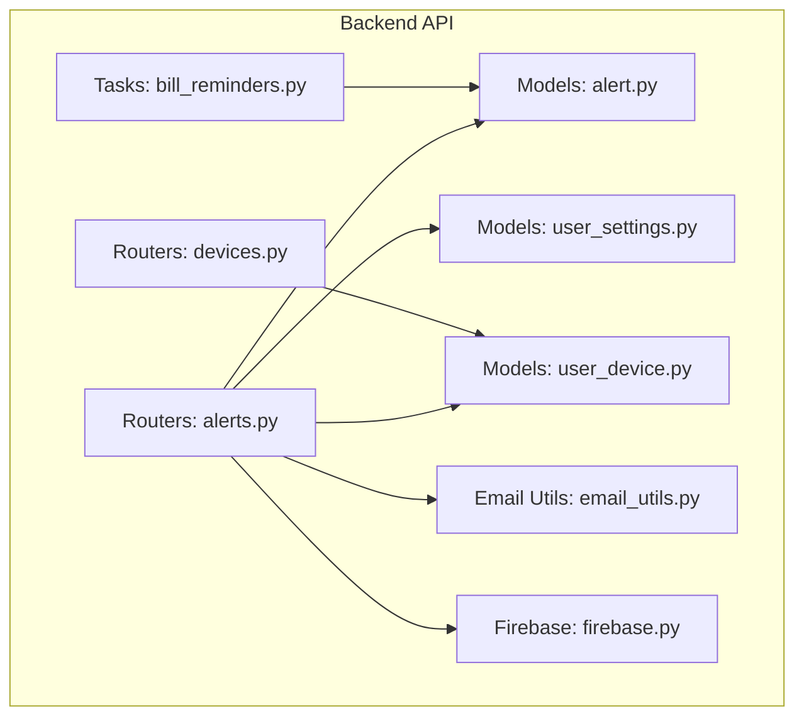
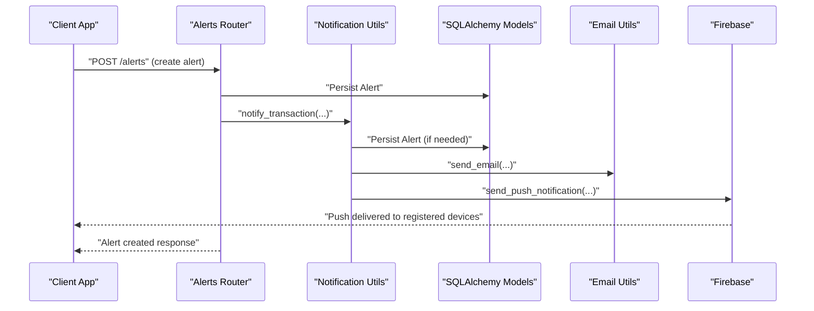
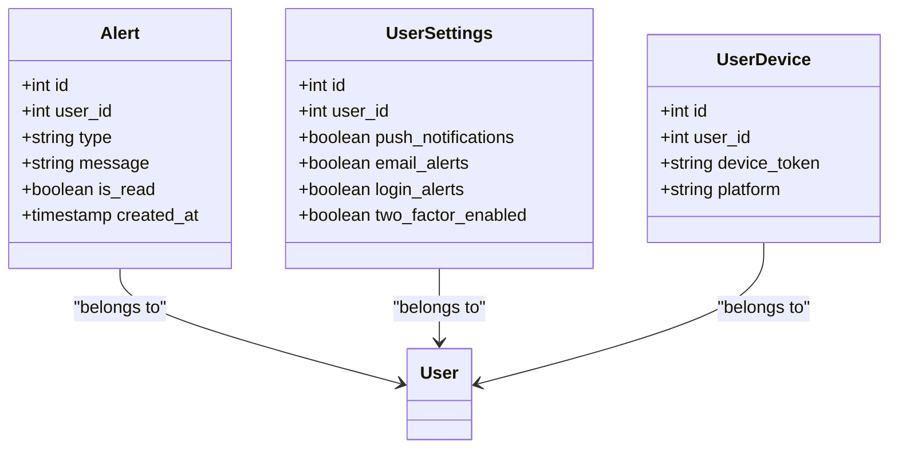

# Alerts & Notifications API

<cite>
**Referenced Files in This Document**
- [main.py](file://backend/app/main.py)
- [firebase.py](file://backend/app/firebase/firebase.py)
- [email_utils.py](file://backend/app/utils/email_utils.py)
- [alert.py](file://backend/app/models/alert.py)
- [user_settings.py](file://backend/app/models/user_settings.py)
- [user_device.py](file://backend/app/models/user_device.py)
- [routers/alerts.py](file://backend/app/routers/alerts.py)
- [routers/devices.py](file://backend/app/routers/devices.py)
- [tasks/bill_reminders.py](file://backend/app/tasks/bill_reminders.py)
- [alerts/service.py](file://backend/app/alerts/service.py)
- [alerts/utils.py](file://backend/app/alerts/utils.py)
- [schemas/admin_alerts.py](file://backend/app/schemas/admin_alerts.py)
</cite>

## Table of Contents
1. [Introduction](#introduction)
2. [Project Structure](#project-structure)
3. [Core Components](#core-components)
4. [Architecture Overview](#architecture-overview)
5. [Detailed Component Analysis](#detailed-component-analysis)
6. [Dependency Analysis](#dependency-analysis)
7. [Performance Considerations](#performance-considerations)
8. [Troubleshooting Guide](#troubleshooting-guide)
9. [Conclusion](#conclusion)
10. [Appendices](#appendices)

## Introduction
This document provides comprehensive API documentation for alerts and notifications in the Modern Digital Banking Dashboard. It covers:
- Alert configuration and lifecycle
- Notification preferences (email, push)
- Real-time messaging and Firebase integration
- Schemas for alert types, notification settings, and message delivery
- Examples for setting up alerts and managing notification preferences

The backend is a FastAPI application that persists alerts in a relational database, supports email and push notifications, and integrates with Firebase Cloud Messaging for cross-platform push delivery.

## Project Structure
Key modules involved in alerts and notifications:
- API routers for user-facing alerts and device registration
- Models for alerts, user settings, and user devices
- Firebase integration for push notifications
- Email utility for outbound emails
- Task module for bill reminders that create alerts
- Admin schemas for audit logs and alert listings

**Diagram sources**
- [routers/alerts.py:1-180](file://backend/app/routers/alerts.py#L1-L180)
- [routers/devices.py:1-42](file://backend/app/routers/devices.py#L1-L42)
- [models/alert.py:1-34](file://backend/app/models/alert.py#L1-L34)
- [models/user_settings.py:1-14](file://backend/app/models/user_settings.py#L1-L14)
- [models/user_device.py:1-12](file://backend/app/models/user_device.py#L1-L12)
- [firebase/firebase.py:1-29](file://backend/app/firebase/firebase.py#L1-L29)
- [utils/email_utils.py:1-34](file://backend/app/utils/email_utils.py#L1-L34)
- [tasks/bill_reminders.py:1-57](file://backend/app/tasks/bill_reminders.py#L1-L57)

**Section sources**
- [main.py:56-86](file://backend/app/main.py#L56-L86)
- [routers/alerts.py:1-180](file://backend/app/routers/alerts.py#L1-L180)
- [routers/devices.py:1-42](file://backend/app/routers/devices.py#L1-L42)
- [models/alert.py:1-34](file://backend/app/models/alert.py#L1-L34)
- [models/user_settings.py:1-14](file://backend/app/models/user_settings.py#L1-L14)
- [models/user_device.py:1-12](file://backend/app/models/user_device.py#L1-L12)
- [firebase/firebase.py:1-29](file://backend/app/firebase/firebase.py#L1-L29)
- [utils/email_utils.py:1-34](file://backend/app/utils/email_utils.py#L1-L34)
- [tasks/bill_reminders.py:1-57](file://backend/app/tasks/bill_reminders.py#L1-L57)

## Core Components
- Alerts API: CRUD operations for user alerts, read/unread management, and summary statistics
- Device Registration API: Register and manage client device tokens for push notifications
- Notification Engine: Centralized logic to persist alerts and deliver via email and/or push
- Firebase Integration: Initialize and send push notifications to registered devices
- Email Delivery: Send transaction and security alerts via SMTP
- Bill Reminders Task: Periodic job to create bill due alerts

**Section sources**
- [routers/alerts.py:26-180](file://backend/app/routers/alerts.py#L26-L180)
- [routers/devices.py:23-42](file://backend/app/routers/devices.py#L23-L42)
- [alerts/utils.py:8-39](file://backend/app/alerts/utils.py#L8-L39)
- [firebase/firebase.py:7-29](file://backend/app/firebase/firebase.py#L7-L29)
- [utils/email_utils.py:12-34](file://backend/app/utils/email_utils.py#L12-L34)
- [tasks/bill_reminders.py:24-57](file://backend/app/tasks/bill_reminders.py#L24-L57)

## Architecture Overview
The alerts and notifications system follows a layered architecture:
- API Layer: FastAPI routers expose endpoints for alerts and devices
- Domain Layer: Notification engine encapsulates alert creation and delivery logic
- Persistence Layer: SQLAlchemy models for alerts, user settings, and devices
- Integration Layer: Firebase Cloud Messaging and SMTP email delivery

**Diagram sources**
- [routers/alerts.py:58-87](file://backend/app/routers/alerts.py#L58-L87)
- [alerts/utils.py:8-39](file://backend/app/alerts/utils.py#L8-L39)
- [utils/email_utils.py:12-34](file://backend/app/utils/email_utils.py#L12-L34)
- [firebase/firebase.py:20-29](file://backend/app/firebase/firebase.py#L20-L29)

## Detailed Component Analysis

### Alerts API
Endpoints for managing user alerts:
- GET /alerts: List alerts for the authenticated user, ordered by creation time
- POST /alerts: Create an alert with a priority or explicit alert type
- PATCH /alerts/{alert_id}/read: Mark a single alert as read
- PUT /alerts/{alert_id}: Update alert type and message
- DELETE /alerts/{alert_id}: Remove an alert
- GET /alerts/summary: Get counts by alert type categories

Priority-to-type mapping:
- info → low_balance
- low → low_balance
- high → bill_due
- critical → budget_exceeded

Response shape for alerts:
- id: integer
- title: string (alias of message)
- message: string
- alert_type/type: string (internal alert type)
- is_read: boolean
- created_at: ISO timestamp

Validation and error handling:
- Invalid priority or alert type raises a 422 error
- Attempting to update/mark a non-existent alert returns 404

**Section sources**
- [routers/alerts.py:26-180](file://backend/app/routers/alerts.py#L26-L180)

### Device Registration API
Endpoints for managing client device tokens:
- POST /devices/register: Register a device token for the authenticated user
- Duplicate tokens are ignored; returns a success message

Device model fields:
- id: integer
- user_id: integer
- device_token: string (unique)
- platform: string (android/ios)

**Section sources**
- [routers/devices.py:23-42](file://backend/app/routers/devices.py#L23-L42)
- [models/user_device.py:5-12](file://backend/app/models/user_device.py#L5-L12)

### Notification Engine
Centralized logic to create alerts and deliver notifications:
- Persist alert to database
- Conditionally send email if email alerts are enabled
- Conditionally send push notifications to all registered devices if push notifications are enabled

Delivery channels:
- Email: Uses SMTP credentials; failures are logged and ignored
- Push: Iterates over user’s registered devices and sends to each token

**Section sources**
- [alerts/utils.py:8-39](file://backend/app/alerts/utils.py#L8-L39)
- [utils/email_utils.py:12-34](file://backend/app/utils/email_utils.py#L12-L34)
- [firebase/firebase.py:20-29](file://backend/app/firebase/firebase.py#L20-L29)

### Firebase Integration
Initialization and push delivery:
- Initialization: Loads Firebase credentials from environment and initializes the admin SDK
- Push delivery: Sends a message to a device token with title and body

Environment requirement:
- FIREBASE_CREDENTIALS_JSON: JSON string containing Firebase service account credentials

**Section sources**
- [firebase/firebase.py:7-29](file://backend/app/firebase/firebase.py#L7-L29)
- [main.py:59-62](file://backend/app/main.py#L59-L62)

### Email Delivery
SMTP-based email sending:
- Requires SMTP_EMAIL and SMTP_PASSWORD environment variables
- Sends plaintext emails with a fixed subject
- Gracefully handles missing credentials and network errors

**Section sources**
- [utils/email_utils.py:6-34](file://backend/app/utils/email_utils.py#L6-L34)

### Bill Reminders Task
Periodic task to create bill due alerts:
- Scans upcoming bills due within the next two days
- Prevents duplicate alerts by checking existing entries
- Creates alerts with type bill_due and a descriptive message

**Section sources**
- [tasks/bill_reminders.py:24-57](file://backend/app/tasks/bill_reminders.py#L24-L57)

### Alert Model and Types
Alert persistence and relationships:
- Fields: id, user_id, type, message, is_read, created_at
- Relationship: linked to User via foreign key
- Types: stored as strings (e.g., bill_due, low_balance, budget_exceeded)

Admin audit log schema:
- AdminAlertOut: created_at, user_name, type, message
- AdminLogOut: timestamp, admin_name, action, target_type, target_id, details

**Section sources**
- [models/alert.py:17-34](file://backend/app/models/alert.py#L17-L34)
- [schemas/admin_alerts.py:10-31](file://backend/app/schemas/admin_alerts.py#L10-L31)

## Dependency Analysis
Inter-module dependencies and relationships:

**Diagram sources**
- [models/alert.py:17-34](file://backend/app/models/alert.py#L17-L34)
- [models/user_settings.py:4-14](file://backend/app/models/user_settings.py#L4-L14)
- [models/user_device.py:5-12](file://backend/app/models/user_device.py#L5-L12)

Additional runtime dependencies:
- Firebase initialization is performed on startup
- Email delivery depends on environment variables
- Device registration requires a valid device token

**Section sources**
- [main.py:59-62](file://backend/app/main.py#L59-L62)
- [firebase/firebase.py:11-17](file://backend/app/firebase/firebase.py#L11-L17)
- [routers/devices.py:29-41](file://backend/app/routers/devices.py#L29-L41)

## Performance Considerations
- Push notifications: Sending per-device tokens scales linearly with the number of devices; consider batching or external queueing for high volume
- Email delivery: Network latency and retries; ensure timeouts and circuit-breaker behavior
- Database queries: Alerts listing and updates are simple; ensure indexes on user_id and is_read for optimal performance
- Task scheduling: Bill reminders scan upcoming bills daily; consider partitioning by user or due date range

## Troubleshooting Guide
Common issues and resolutions:
- Firebase initialization fails
  - Cause: FIREBASE_CREDENTIALS_JSON not set or invalid
  - Action: Set the environment variable with valid Firebase credentials
  - Evidence: [firebase/firebase.py:11-17](file://backend/app/firebase/firebase.py#L11-L17)
- Email not sent
  - Cause: Missing SMTP credentials or network error
  - Action: Configure SMTP_EMAIL and SMTP_PASSWORD; verify network connectivity
  - Evidence: [utils/email_utils.py:14-16](file://backend/app/utils/email_utils.py#L14-L16), [utils/email_utils.py:31-34](file://backend/app/utils/email_utils.py#L31-L34)
- Device registration duplicates
  - Behavior: Duplicate tokens are ignored
  - Evidence: [routers/devices.py:35-37](file://backend/app/routers/devices.py#L35-L37)
- Invalid alert priority/type
  - Behavior: 422 error returned
  - Evidence: [routers/alerts.py:63-69](file://backend/app/routers/alerts.py#L63-L69), [routers/alerts.py:114-119](file://backend/app/routers/alerts.py#L114-L119)
- Alert not found during update/read
  - Behavior: 404 error returned
  - Evidence: [routers/alerts.py:96-97](file://backend/app/routers/alerts.py#L96-L97), [routers/alerts.py:139-140](file://backend/app/routers/alerts.py#L139-L140)

**Section sources**
- [firebase/firebase.py:11-17](file://backend/app/firebase/firebase.py#L11-L17)
- [utils/email_utils.py:14-16](file://backend/app/utils/email_utils.py#L14-L16)
- [utils/email_utils.py:31-34](file://backend/app/utils/email_utils.py#L31-L34)
- [routers/devices.py:35-37](file://backend/app/routers/devices.py#L35-L37)
- [routers/alerts.py:63-69](file://backend/app/routers/alerts.py#L63-L69)
- [routers/alerts.py:114-119](file://backend/app/routers/alerts.py#L114-L119)
- [routers/alerts.py:96-97](file://backend/app/routers/alerts.py#L96-L97)
- [routers/alerts.py:139-140](file://backend/app/routers/alerts.py#L139-L140)

## Conclusion
The alerts and notifications system provides a robust foundation for user-centric alerting:
- Unified alert lifecycle with flexible prioritization
- Multi-channel delivery via email and push
- Device registration for targeted push notifications
- Extensible models supporting future enhancements (e.g., SMS, voice)

## Appendices

### API Reference

- GET /alerts
  - Description: Retrieve all alerts for the authenticated user
  - Response: Array of alert objects with fields id, title, message, alert_type, is_read, created_at

- POST /alerts
  - Request body: { title: string, message: string, priority: "info"|"low"|"high"|"critical"|"low_balance"|"bill_due"|"budget_exceeded" }
  - Response: Created alert object

- PATCH /alerts/{alert_id}/read
  - Path params: alert_id (integer)
  - Response: { message: "Alert marked as read" }

- PUT /alerts/{alert_id}
  - Path params: alert_id (integer)
  - Request body: { title: string, message: string, priority: "info"|"low"|"high"|"critical"|"low_balance"|"bill_due"|"budget_exceeded" }
  - Response: Updated alert object

- DELETE /alerts/{alert_id}
  - Path params: alert_id (integer)
  - Response: { message: "Alert deleted successfully" }

- GET /alerts/summary
  - Response: { total: integer, critical: integer, high: integer, medium: integer, recent: [] }

- POST /devices/register
  - Request body: { device_token: string, platform: "android"|"ios" }
  - Response: { message: "Device registered successfully" } or { message: "Device already registered" }

### Alert Types and Priority Mapping
- Priority to type mapping:
  - info → low_balance
  - low → low_balance
  - high → bill_due
  - critical → budget_exceeded

### Notification Preferences Schema
- UserSettings fields:
  - push_notifications: boolean
  - email_alerts: boolean
  - login_alerts: boolean
  - two_factor_enabled: boolean

### Example Workflows

- Setting up a transaction alert
  - Call POST /alerts with priority and message
  - Internally persisted; optionally email and/or push delivered based on user settings

- Managing notification preferences
  - Update UserSettings fields (push_notifications, email_alerts) to control delivery channels

- Registering a device for push notifications
  - Call POST /devices/register with device_token and platform
  - Subsequent push notifications will be sent to this device

**Section sources**
- [routers/alerts.py:26-180](file://backend/app/routers/alerts.py#L26-L180)
- [routers/devices.py:23-42](file://backend/app/routers/devices.py#L23-L42)
- [models/user_settings.py:4-14](file://backend/app/models/user_settings.py#L4-L14)