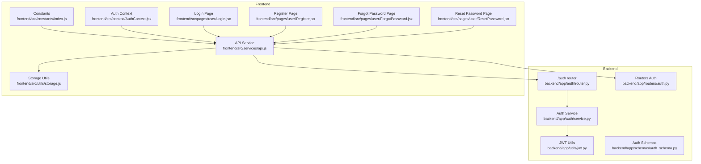
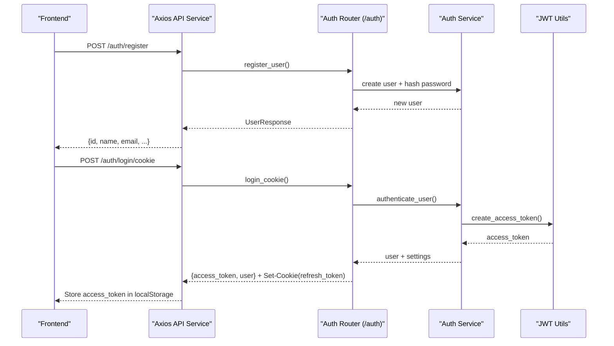
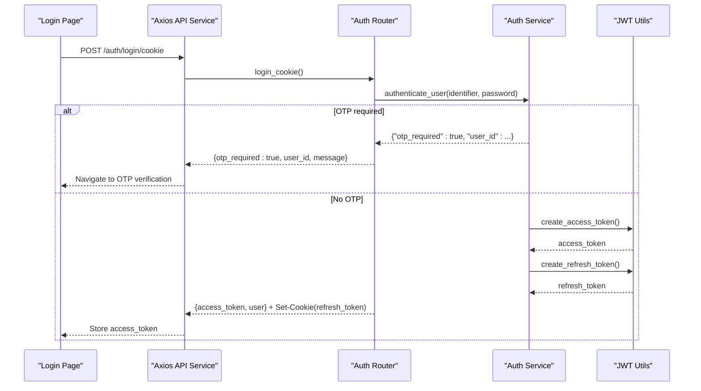
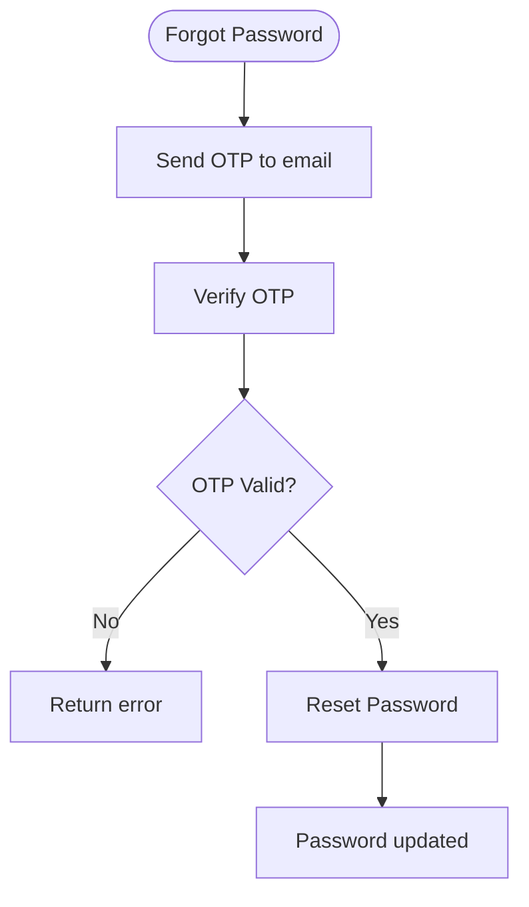
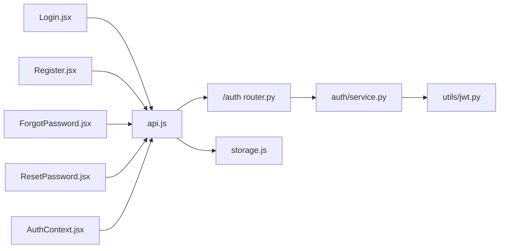

# Authentication API

<cite>
**Referenced Files in This Document**
- [backend/app/auth/router.py](file://backend/app/auth/router.py)
- [backend/app/auth/schemas.py](file://backend/app/auth/schemas.py)
- [backend/app/auth/service.py](file://backend/app/auth/service.py)
- [backend/app/utils/jwt.py](file://backend/app/utils/jwt.py)
- [backend/app/routers/auth.py](file://backend/app/routers/auth.py)
- [backend/app/schemas/auth_schema.py](file://backend/app/schemas/auth_schema.py)
- [frontend/src/constants/index.js](file://frontend/src/constants/index.js)
- [frontend/src/services/api.js](file://frontend/src/services/api.js)
- [frontend/src/pages/user/Login.jsx](file://frontend/src/pages/user/Login.jsx)
- [frontend/src/pages/user/Register.jsx](file://frontend/src/pages/user/Register.jsx)
- [frontend/src/pages/user/ForgotPassword.jsx](file://frontend/src/pages/user/ForgotPassword.jsx)
- [frontend/src/pages/user/ResetPassword.jsx](file://frontend/src/pages/user/ResetPassword.jsx)
- [frontend/src/context/AuthContext.jsx](file://frontend/src/context/AuthContext.jsx)
- [frontend/src/utils/storage.js](file://frontend/src/utils/storage.js)
</cite>

## Table of Contents
1. [Introduction](#introduction)
2. [Project Structure](#project-structure)
3. [Core Components](#core-components)
4. [Architecture Overview](#architecture-overview)
5. [Detailed Component Analysis](#detailed-component-analysis)
6. [Dependency Analysis](#dependency-analysis)
7. [Performance Considerations](#performance-considerations)
8. [Troubleshooting Guide](#troubleshooting-guide)
9. [Conclusion](#conclusion)
10. [Appendices](#appendices)

## Introduction
This document provides comprehensive API documentation for the authentication system. It covers registration, login, logout, password reset, and OTP verification endpoints. It also documents request/response schemas, JWT token handling, session management, security considerations, example requests/responses, error codes, and client implementation guidelines for robust authentication flows.

## Project Structure
The authentication system spans backend FastAPI routes and services, along with frontend pages and utilities that integrate with the backend.

**Diagram sources**
- [backend/app/auth/router.py:1-180](file://backend/app/auth/router.py#L1-L180)
- [backend/app/auth/service.py:1-225](file://backend/app/auth/service.py#L1-L225)
- [backend/app/utils/jwt.py:1-26](file://backend/app/utils/jwt.py#L1-L26)
- [backend/app/routers/auth.py:1-315](file://backend/app/routers/auth.py#L1-L315)
- [backend/app/schemas/auth_schema.py:1-23](file://backend/app/schemas/auth_schema.py#L1-L23)
- [frontend/src/constants/index.js:64-132](file://frontend/src/constants/index.js#L64-L132)
- [frontend/src/services/api.js:1-73](file://frontend/src/services/api.js#L1-L73)
- [frontend/src/pages/user/Login.jsx:1-369](file://frontend/src/pages/user/Login.jsx#L1-L369)
- [frontend/src/pages/user/Register.jsx:1-485](file://frontend/src/pages/user/Register.jsx#L1-L485)
- [frontend/src/pages/user/ForgotPassword.jsx:1-158](file://frontend/src/pages/user/ForgotPassword.jsx#L1-L158)
- [frontend/src/pages/user/ResetPassword.jsx:1-180](file://frontend/src/pages/user/ResetPassword.jsx#L1-L180)
- [frontend/src/context/AuthContext.jsx:1-47](file://frontend/src/context/AuthContext.jsx#L1-L47)
- [frontend/src/utils/storage.js:1-100](file://frontend/src/utils/storage.js#L1-L100)

**Section sources**
- [backend/app/auth/router.py:1-180](file://backend/app/auth/router.py#L1-L180)
- [backend/app/routers/auth.py:1-315](file://backend/app/routers/auth.py#L1-L315)
- [frontend/src/constants/index.js:64-132](file://frontend/src/constants/index.js#L64-L132)

## Core Components
- Authentication Router: Exposes endpoints for registration, login, OTP resend, and password reset.
- Auth Service: Implements user authentication, OTP generation, password reset, and JWT creation.
- JWT Utilities: Encodes/decodes access and refresh tokens with configurable expiration.
- Frontend API Layer: Centralized Axios service that attaches Authorization headers and exposes convenience methods.
- Frontend Pages: Implement user flows for registration, login, forgot password, and reset password.
- Storage Utilities: Persist tokens and user data in localStorage.

Key responsibilities:
- Registration: Creates user records with hashed passwords and optional profile fields.
- Login: Validates credentials and issues access tokens; supports cookie-based login with OTP gating.
- OTP Management: Generates and validates OTPs for password reset and login flows.
- Password Reset: Verifies OTP and updates user password with strong password policy.
- Token Handling: Access tokens for short-lived requests; refresh cookies for session renewal.

**Section sources**
- [backend/app/auth/router.py:75-180](file://backend/app/auth/router.py#L75-L180)
- [backend/app/auth/service.py:114-133](file://backend/app/auth/service.py#L114-L133)
- [backend/app/utils/jwt.py:11-25](file://backend/app/utils/jwt.py#L11-L25)
- [frontend/src/services/api.js:19-31](file://frontend/src/services/api.js#L19-L31)

## Architecture Overview
The authentication flow integrates frontend pages, API service, backend routers, and services. Tokens are stored in browser storage and attached automatically to requests.

**Diagram sources**
- [backend/app/auth/router.py:75-138](file://backend/app/auth/router.py#L75-L138)
- [backend/app/auth/service.py:205-224](file://backend/app/auth/service.py#L205-L224)
- [backend/app/utils/jwt.py:11-19](file://backend/app/utils/jwt.py#L11-L19)
- [frontend/src/services/api.js:19-31](file://frontend/src/services/api.js#L19-L31)

## Detailed Component Analysis

### Registration Endpoint
- Path: POST /auth/register
- Purpose: Create a new user account with hashed password and optional profile fields.
- Request Schema (UserCreate):
  - name: string
  - email: email
  - password: string
  - phone: optional string
  - dob: optional date string (yyyy-mm-dd)
  - pin_code: optional string
  - address: optional string
  - kyc_authorize: optional boolean
- Response Schema (UserResponse): Includes user id, name, email, phone, is_admin.
- Behavior:
  - Checks for existing email conflicts.
  - Hashes password before storing.
  - Returns newly created user object.
- Example Request:
  - POST /auth/register
  - Body: { "name": "...", "email": "...", "password": "...", "phone": "...", "dob": "yyyy-mm-dd", "pin_code": "...", "address": "...", "kyc_authorize": false }
- Example Response:
  - 201 Created
  - Body: { "id": 123, "name": "...", "email": "...", "phone": "...", "is_admin": false }

**Section sources**
- [backend/app/auth/router.py:75-102](file://backend/app/auth/router.py#L75-L102)
- [backend/app/auth/schemas.py:4-13](file://backend/app/auth/schemas.py#L4-L13)

### Login Endpoints
- Cookie-based Login: POST /auth/login/cookie
  - Request: { identifier, password }
  - Response:
    - If OTP required: { otp_required: true, user_id, message }
    - Else: { access_token, user } + Set-Cookie(refresh_token)
  - Behavior:
    - Validates credentials.
    - If two-factor enabled, sends OTP and returns OTP-required response.
    - Otherwise issues access and refresh tokens.
- OAuth2 Login: POST /auth/login
  - Request: OAuth2PasswordRequestForm (username, password)
  - Response: { access_token, token_type: "bearer", user }
- Frontend Integration:
  - Login page posts to /auth/login/cookie.
  - On otp_required, navigates to OTP verification route.
  - On success, stores access_token and user in localStorage.

**Diagram sources**
- [backend/app/auth/router.py:122-138](file://backend/app/auth/router.py#L122-L138)
- [backend/app/auth/service.py:205-224](file://backend/app/auth/service.py#L205-L224)
- [backend/app/utils/jwt.py:11-19](file://backend/app/utils/jwt.py#L11-L19)
- [frontend/src/pages/user/Login.jsx:89-129](file://frontend/src/pages/user/Login.jsx#L89-L129)

**Section sources**
- [backend/app/auth/router.py:122-138](file://backend/app/auth/router.py#L122-L138)
- [backend/app/auth/router.py:104-119](file://backend/app/auth/router.py#L104-L119)
- [frontend/src/pages/user/Login.jsx:89-129](file://frontend/src/pages/user/Login.jsx#L89-L129)

### Logout Endpoint
- Path: POST /auth/logout
- Purpose: Invalidate refresh token by clearing the refresh cookie.
- Implementation Notes:
  - Requires SameSite, Secure, and HttpOnly cookie attributes based on environment.
  - Clears refresh_token cookie to terminate session.
- Frontend Guidance:
  - Call POST /auth/logout and clear local storage tokens.

**Section sources**
- [backend/app/auth/router.py:24-31](file://backend/app/auth/router.py#L24-L31)

### Password Reset Endpoints
- Forgot Password: POST /auth/forgot-password
  - Request: { email }
  - Response: Generic message indicating OTP sent if email exists.
- Verify OTP: POST /auth/verify-otp
  - Request: { email, otp }
  - Response: Success message if OTP valid.
  - Behavior: Validates OTP presence and expiration; removes OTP on success.
- Resend OTP:
  - POST /auth/resend-login-otp
  - POST /auth/resend-pin-otp
- Reset Password: POST /auth/reset-password
  - Request: { email, new_password }
  - Behavior: Updates password after OTP verification; enforces strong password policy.

**Diagram sources**
- [backend/app/auth/router.py:141-179](file://backend/app/auth/router.py#L141-L179)
- [backend/app/auth/service.py:114-133](file://backend/app/auth/service.py#L114-L133)

**Section sources**
- [backend/app/auth/router.py:141-179](file://backend/app/auth/router.py#L141-L179)
- [backend/app/auth/service.py:114-133](file://backend/app/auth/service.py#L114-L133)

### Token Refresh Endpoint
- Path: POST /auth/refresh/cookie
- Purpose: Issue new access token using stored refresh cookie.
- Behavior:
  - Reads refresh cookie from request.
  - Issues new access token and renews refresh cookie.
- Frontend Integration:
  - Auth context attempts refresh on app load to restore session.

**Section sources**
- [frontend/src/constants/index.js:71](file://frontend/src/constants/index.js#L71)
- [frontend/src/context/AuthContext.jsx:26-42](file://frontend/src/context/AuthContext.jsx#L26-L42)

### Request/Response Schemas

#### Registration
- Request (UserCreate):
  - name: string
  - email: email
  - password: string
  - phone: optional string
  - dob: optional date string (yyyy-mm-dd)
  - pin_code: optional string
  - address: optional string
  - kyc_authorize: optional boolean
- Response (UserResponse):
  - id: integer
  - name: string
  - email: email
  - phone: optional string
  - is_admin: boolean

#### Login Credentials
- Request (Cookie Login):
  - identifier: string (email or phone)
  - password: string
- Response (Success):
  - access_token: string
  - user: { id, name, email, phone, is_admin }
  - Or otp_required: true with message

#### Token Refresh
- Request: Cookie refresh_token
- Response: { access_token, user }

#### Password Reset
- Request (Forgot Password): { email }
- Request (Verify OTP): { email, otp }
- Request (Reset Password): { email, new_password }
- Response (Verify OTP): { message: "OTP verified", valid: true }

**Section sources**
- [backend/app/auth/schemas.py:4-13](file://backend/app/auth/schemas.py#L4-L13)
- [backend/app/auth/router.py:122-138](file://backend/app/auth/router.py#L122-L138)
- [backend/app/auth/router.py:141-179](file://backend/app/auth/router.py#L141-L179)

## Dependency Analysis
- Backend:
  - Auth Router depends on Auth Service for business logic and JWT Utils for token creation.
  - Auth Service depends on models (User, OTP) and email utilities for notifications.
- Frontend:
  - API service centralizes base URL and Authorization header injection.
  - Pages depend on constants for endpoint URLs and navigation.
  - Storage utilities manage tokens and user data persistence.

**Diagram sources**
- [frontend/src/pages/user/Login.jsx:1-369](file://frontend/src/pages/user/Login.jsx#L1-L369)
- [frontend/src/pages/user/Register.jsx:1-485](file://frontend/src/pages/user/Register.jsx#L1-L485)
- [frontend/src/pages/user/ForgotPassword.jsx:1-158](file://frontend/src/pages/user/ForgotPassword.jsx#L1-L158)
- [frontend/src/pages/user/ResetPassword.jsx:1-180](file://frontend/src/pages/user/ResetPassword.jsx#L1-L180)
- [frontend/src/services/api.js:1-73](file://frontend/src/services/api.js#L1-L73)
- [backend/app/auth/router.py:1-180](file://backend/app/auth/router.py#L1-L180)
- [backend/app/auth/service.py:1-225](file://backend/app/auth/service.py#L1-L225)
- [backend/app/utils/jwt.py:1-26](file://backend/app/utils/jwt.py#L1-L26)
- [frontend/src/context/AuthContext.jsx:1-47](file://frontend/src/context/AuthContext.jsx#L1-L47)
- [frontend/src/utils/storage.js:1-100](file://frontend/src/utils/storage.js#L1-L100)

**Section sources**
- [backend/app/auth/router.py:1-180](file://backend/app/auth/router.py#L1-L180)
- [backend/app/auth/service.py:1-225](file://backend/app/auth/service.py#L1-L225)
- [frontend/src/services/api.js:19-31](file://frontend/src/services/api.js#L19-L31)

## Performance Considerations
- Token Expiration:
  - Access tokens: short-lived to minimize exposure.
  - Refresh tokens: long-lived but stored as HttpOnly cookies for protection.
- OTP Expiry:
  - OTP validity window should be short (e.g., minutes) to reduce risk.
- Network Efficiency:
  - Batch related operations (e.g., OTP send and verification) to reduce round trips.
- Database Indexes:
  - Ensure email indexing for efficient user lookup during authentication.

## Troubleshooting Guide
Common error codes and causes:
- 400 Bad Request:
  - Missing credentials or invalid OTP.
  - Email already registered during signup.
- 401 Unauthorized:
  - Invalid email or password.
  - OTP required for login.
- 404 Not Found:
  - User not found during OTP verification.
- 500 Internal Server Error:
  - Unexpected server errors during processing.

Client-side checks:
- Validate inputs before sending requests.
- Handle otp_required response by navigating to OTP verification.
- Clear sensitive data on logout and refresh failures.

**Section sources**
- [backend/app/auth/router.py:64-101](file://backend/app/auth/router.py#L64-L101)
- [backend/app/auth/router.py:141-179](file://backend/app/auth/router.py#L141-L179)
- [frontend/src/pages/user/Login.jsx:89-129](file://frontend/src/pages/user/Login.jsx#L89-L129)

## Conclusion
The authentication system provides secure, standardized endpoints for user lifecycle management. It leverages JWT for access tokens, cookie-based refresh tokens for session continuity, and OTP for enhanced security. The frontend integrates seamlessly via a centralized API service and storage utilities, ensuring consistent behavior across flows.

## Appendices

### Security Considerations
- Transport Security:
  - Enable HTTPS in production.
  - Configure SameSite and Secure flags for cookies.
- Token Handling:
  - Store refresh tokens as HttpOnly cookies.
  - Store access tokens in memory or secure storage.
- Input Validation:
  - Enforce strong password policies and validate OTPs.
- Rate Limiting:
  - Implement rate limiting on authentication endpoints to prevent brute force attacks.

### Client Implementation Guidelines
- Authorization Header:
  - Attach Authorization: Bearer <access_token> to protected requests.
- Session Restoration:
  - Attempt refresh on app load to restore sessions.
- Error Handling:
  - Redirect to login on 401/403.
  - Show user-friendly messages for validation errors.

**Section sources**
- [frontend/src/services/api.js:19-31](file://frontend/src/services/api.js#L19-L31)
- [frontend/src/context/AuthContext.jsx:26-42](file://frontend/src/context/AuthContext.jsx#L26-L42)
- [frontend/src/utils/storage.js:81-99](file://frontend/src/utils/storage.js#L81-L99)