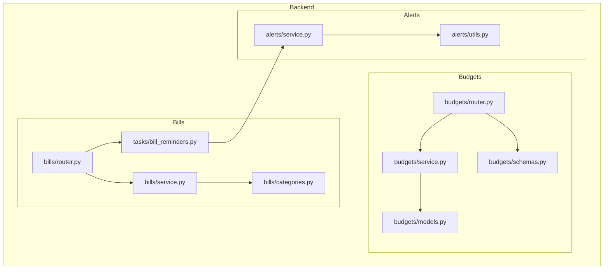
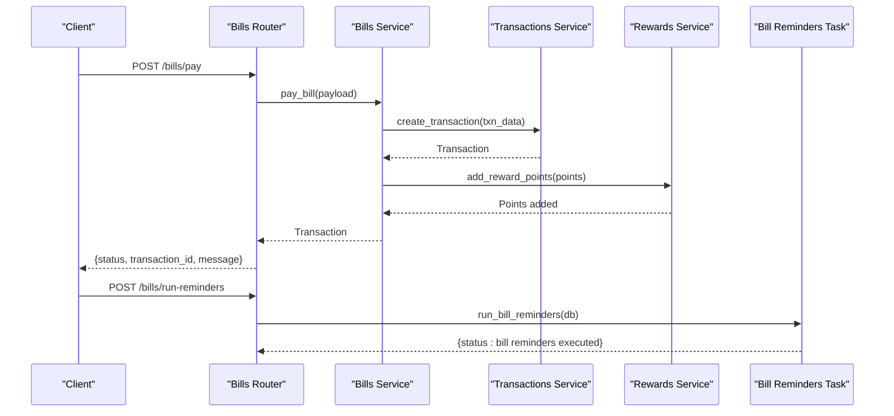
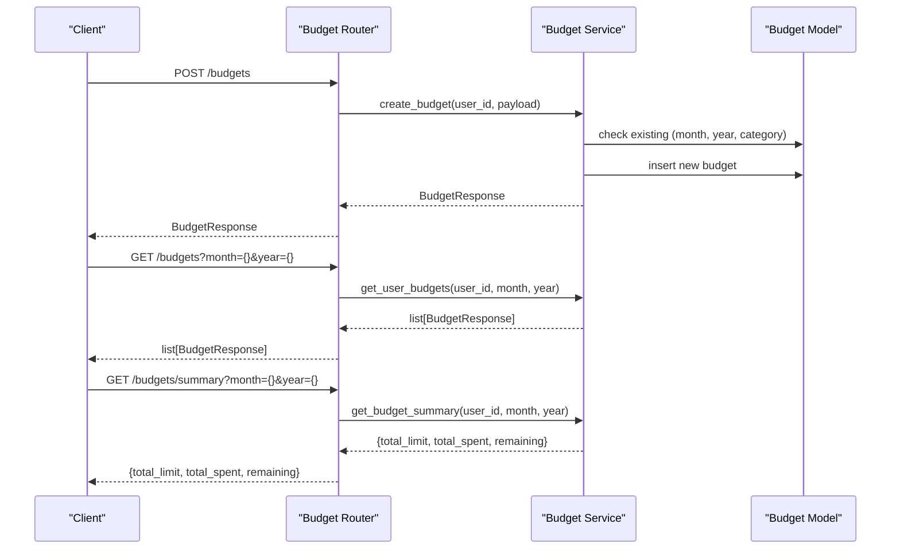
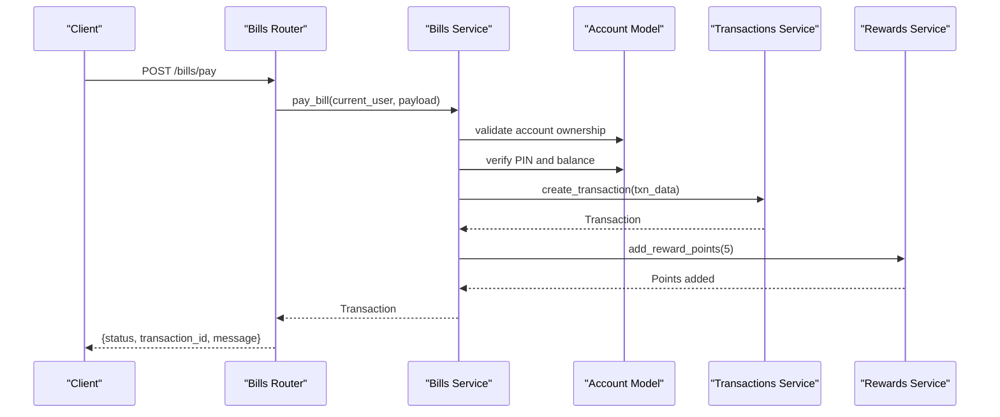
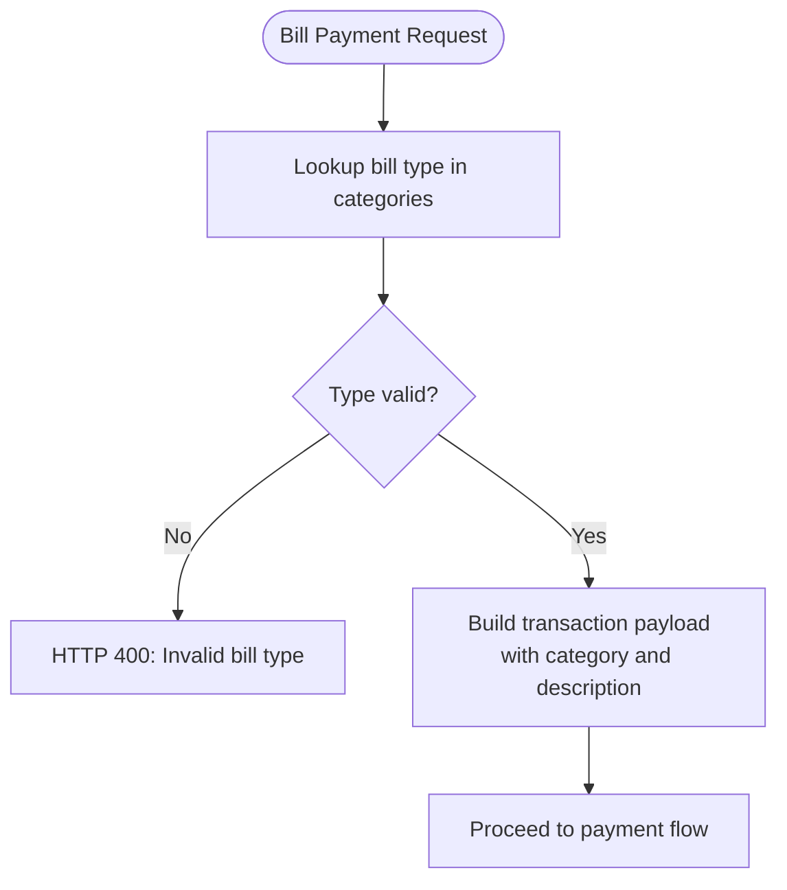
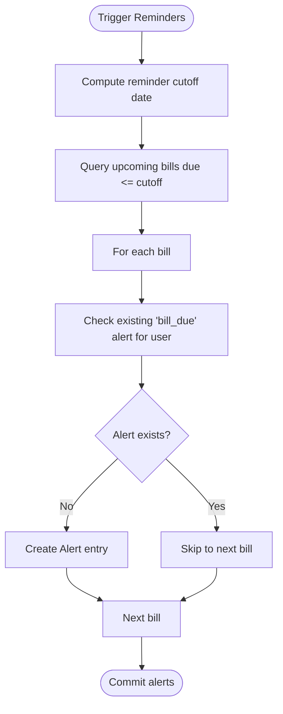
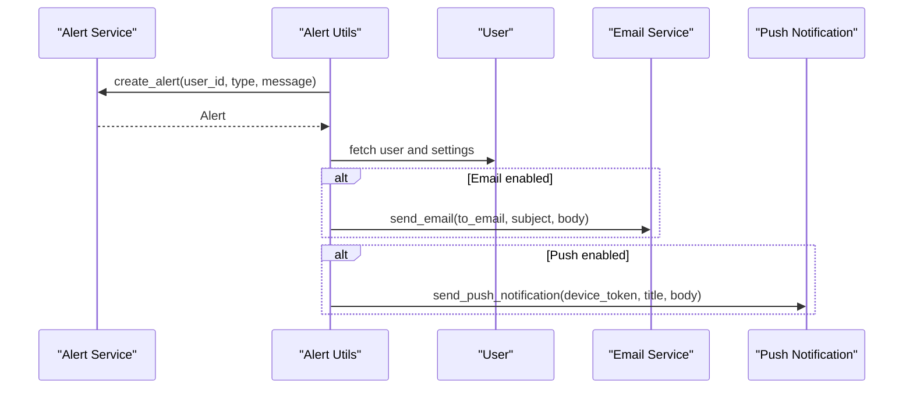
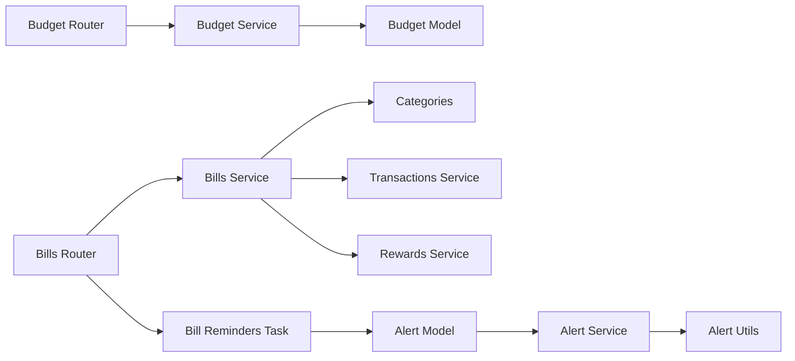

# Budget & Bill Management API

<cite>
**Referenced Files in This Document**
- [router.py](file://backend/app/budgets/router.py)
- [schemas.py](file://backend/app/budgets/schemas.py)
- [service.py](file://backend/app/budgets/service.py)
- [models.py](file://backend/app/budgets/models.py)
- [router.py](file://backend/app/bills/router.py)
- [schemas.py](file://backend/app/bills/schemas.py)
- [service.py](file://backend/app/bills/service.py)
- [categories.py](file://backend/app/bills/categories.py)
- [bill_reminders.py](file://backend/app/tasks/bill_reminders.py)
- [service.py](file://backend/app/alerts/service.py)
- [utils.py](file://backend/app/alerts/utils.py)
- [budget_schema.py](file://backend/app/schemas/budget_schema.py)
</cite>

## Table of Contents
1. [Introduction](#introduction)
2. [Project Structure](#project-structure)
3. [Core Components](#core-components)
4. [Architecture Overview](#architecture-overview)
5. [Detailed Component Analysis](#detailed-component-analysis)
6. [Dependency Analysis](#dependency-analysis)
7. [Performance Considerations](#performance-considerations)
8. [Troubleshooting Guide](#troubleshooting-guide)
9. [Conclusion](#conclusion)
10. [Appendices](#appendices)

## Introduction
This document provides comprehensive API documentation for budget and bill management endpoints. It covers budget creation, tracking, and limit management, as well as bill payment processing and reminder systems. The documentation includes endpoint definitions, request/response schemas, workflows, and operational guidance for monthly budget cycles, spending alerts, and automated bill payment workflows.

## Project Structure
The budget and bill management features are implemented as separate modules under the backend application:
- Budget module: endpoints for creating, listing, updating, deleting budgets, and retrieving summaries
- Bill module: endpoints for creating, listing, updating, deleting bills, paying bills, and triggering reminders
- Supporting components: bill categories mapping, reminder task execution, and alert utilities

**Diagram sources**
- [router.py:1-81](file://backend/app/budgets/router.py#L1-L81)
- [service.py:1-77](file://backend/app/budgets/service.py#L1-L77)
- [models.py:1-22](file://backend/app/budgets/models.py#L1-L22)
- [schemas.py:1-23](file://backend/app/budgets/schemas.py#L1-L23)
- [router.py:1-81](file://backend/app/bills/router.py#L1-L81)
- [service.py:1-166](file://backend/app/bills/service.py#L1-L166)
- [categories.py:1-35](file://backend/app/bills/categories.py#L1-L35)
- [bill_reminders.py:1-57](file://backend/app/tasks/bill_reminders.py#L1-L57)
- [service.py:1-24](file://backend/app/alerts/service.py#L1-L24)
- [utils.py:1-39](file://backend/app/alerts/utils.py#L1-L39)

**Section sources**
- [router.py:1-81](file://backend/app/budgets/router.py#L1-L81)
- [router.py:1-81](file://backend/app/bills/router.py#L1-L81)

## Core Components
- Budget endpoints: create, list, summary, update, delete budgets
- Bill endpoints: create, list, update, delete bills; pay bills; trigger reminders
- Bill categories: centralized mapping for bill types to transaction categories
- Reminder task: scheduled or manual execution to create bill due alerts
- Alert utilities: server-side alert creation and optional email/push notifications

**Section sources**
- [router.py:26-81](file://backend/app/budgets/router.py#L26-L81)
- [router.py:26-81](file://backend/app/bills/router.py#L26-L81)
- [categories.py:9-34](file://backend/app/bills/categories.py#L9-L34)
- [bill_reminders.py:24-57](file://backend/app/tasks/bill_reminders.py#L24-L57)
- [service.py:6-23](file://backend/app/alerts/service.py#L6-L23)
- [utils.py:8-39](file://backend/app/alerts/utils.py#L8-L39)

## Architecture Overview
The system follows a layered architecture:
- Routers define HTTP endpoints and bind request/response schemas
- Services encapsulate business logic, validation, and persistence
- Models represent database entities
- Tasks orchestrate periodic operations (e.g., reminders)
- Alerts integrate with notification channels

**Diagram sources**
- [router.py:26-43](file://backend/app/bills/router.py#L26-L43)
- [service.py:102-124](file://backend/app/bills/service.py#L102-L124)
- [bill_reminders.py:24-57](file://backend/app/tasks/bill_reminders.py#L24-L57)

## Detailed Component Analysis

### Budget Management Endpoints
- Purpose: Manage monthly budgets per category, track spending, and compute summaries
- Endpoints:
  - POST /budgets: Create a new budget for a given month/year/category
  - GET /budgets: List budgets for a user filtered by month and year
  - GET /budgets/summary: Compute total limit, total spent, and remaining for a month/year
  - PATCH /budgets/{budget_id}: Update budget limit
  - DELETE /budgets/{budget_id}: Soft-delete budget (set inactive)

**Diagram sources**
- [router.py:26-55](file://backend/app/budgets/router.py#L26-L55)
- [service.py:15-76](file://backend/app/budgets/service.py#L15-L76)
- [models.py:6-22](file://backend/app/budgets/models.py#L6-L22)

**Section sources**
- [router.py:26-81](file://backend/app/budgets/router.py#L26-L81)
- [schemas.py:4-23](file://backend/app/budgets/schemas.py#L4-L23)
- [service.py:15-76](file://backend/app/budgets/service.py#L15-L76)
- [models.py:6-22](file://backend/app/budgets/models.py#L6-L22)

### Bill Management Endpoints
- Purpose: Create and manage bills, process payments, and schedule reminders
- Endpoints:
  - POST /bills/pay: Process bill payment using account PIN and amount
  - POST /bills/run-reminders: Execute reminder generation for upcoming bills
  - POST /bills: Create a bill record (with optional autopay)
  - GET /bills: List user bills
  - PUT /bills/{bill_id}: Update bill attributes
  - DELETE /bills/{bill_id}: Delete a bill

**Diagram sources**
- [router.py:26-37](file://backend/app/bills/router.py#L26-L37)
- [service.py:102-124](file://backend/app/bills/service.py#L102-L124)

**Section sources**
- [router.py:26-81](file://backend/app/bills/router.py#L26-L81)
- [schemas.py:7-50](file://backend/app/bills/schemas.py#L7-L50)
- [service.py:102-166](file://backend/app/bills/service.py#L102-L166)

### Bill Categories and Transaction Mapping
- Centralized mapping defines bill types and their transaction categories and descriptions
- Validation ensures only supported bill types are accepted during payment processing

**Diagram sources**
- [categories.py:9-34](file://backend/app/bills/categories.py#L9-L34)
- [service.py:35-38](file://backend/app/bills/service.py#L35-L38)
- [service.py:68-80](file://backend/app/bills/service.py#L68-L80)

**Section sources**
- [categories.py:9-34](file://backend/app/bills/categories.py#L9-L34)
- [service.py:35-80](file://backend/app/bills/service.py#L35-L80)

### Bill Reminder System
- Purpose: Generate reminders for bills due within a defined window (default: next 2 days)
- Execution: Manual endpoint or scheduled task
- Behavior: Creates server-side alerts; avoids duplicates per bill and user

**Diagram sources**
- [bill_reminders.py:24-57](file://backend/app/tasks/bill_reminders.py#L24-L57)
- [service.py:6-23](file://backend/app/alerts/service.py#L6-L23)

**Section sources**
- [bill_reminders.py:24-57](file://backend/app/tasks/bill_reminders.py#L24-L57)
- [service.py:6-23](file://backend/app/alerts/service.py#L6-L23)

### Alert Utilities and Notifications
- Server-side alert creation for various event types
- Optional email and push notification delivery based on user settings

**Diagram sources**
- [service.py:6-23](file://backend/app/alerts/service.py#L6-L23)
- [utils.py:8-39](file://backend/app/alerts/utils.py#L8-L39)

**Section sources**
- [service.py:6-23](file://backend/app/alerts/service.py#L6-L23)
- [utils.py:8-39](file://backend/app/alerts/utils.py#L8-L39)

## Dependency Analysis
- Budget module depends on:
  - Router binding to service and schemas
  - Service using SQLAlchemy ORM queries and model persistence
- Bill module depends on:
  - Router binding to service and schemas
  - Service depending on categories, transactions, rewards, and alerts
  - Reminder task interacting with bills and alerts models
- Alerts utilities depend on alert service and external notification integrations

**Diagram sources**
- [router.py:1-16](file://backend/app/budgets/router.py#L1-L16)
- [service.py:1-77](file://backend/app/budgets/service.py#L1-L77)
- [models.py:1-22](file://backend/app/budgets/models.py#L1-L22)
- [router.py:1-19](file://backend/app/bills/router.py#L1-L19)
- [service.py:1-25](file://backend/app/bills/service.py#L1-L25)
- [categories.py:1-35](file://backend/app/bills/categories.py#L1-L35)
- [bill_reminders.py:1-57](file://backend/app/tasks/bill_reminders.py#L1-L57)
- [service.py:1-24](file://backend/app/alerts/service.py#L1-L24)
- [utils.py:1-39](file://backend/app/alerts/utils.py#L1-L39)

**Section sources**
- [router.py:1-16](file://backend/app/budgets/router.py#L1-L16)
- [router.py:1-19](file://backend/app/bills/router.py#L1-L19)
- [service.py:1-25](file://backend/app/bills/service.py#L1-L25)

## Performance Considerations
- Budget summary aggregation uses SQL aggregation to minimize memory overhead
- Bill reminders query filters by due date and status to reduce result set
- Avoid duplicate alerts by checking existing entries before insertion
- Consider indexing on frequently queried fields (e.g., user_id, month, year, due_date) for improved query performance

## Troubleshooting Guide
Common errors and resolutions:
- Budget creation conflicts:
  - Cause: Duplicate budget for the same category in the same month/year
  - Resolution: Modify category or month/year; the endpoint returns a 400 error
- Budget not found:
  - Cause: Non-existent budget ID or inactive budget
  - Resolution: Verify budget ID and ensure it belongs to the user
- Bill payment failures:
  - Invalid bill type: Ensure bill_type matches supported categories
  - Account not found: Confirm account ownership and existence
  - Invalid PIN: Verify 4-digit PIN against stored hash
  - Insufficient balance: Top up account or adjust payment amount
  - Transaction failure: Retry after verifying account status
- Bill reminders:
  - No reminders generated: Ensure bills have due dates within the reminder window and status is upcoming

**Section sources**
- [router.py:33-35](file://backend/app/budgets/router.py#L33-L35)
- [router.py:66-68](file://backend/app/budgets/router.py#L66-L68)
- [service.py:15-33](file://backend/app/budgets/service.py#L15-L33)
- [service.py:40-48](file://backend/app/budgets/service.py#L40-L48)
- [service.py:51-58](file://backend/app/budgets/service.py#L51-L58)
- [service.py:26-32](file://backend/app/bills/service.py#L26-L32)
- [service.py:102-124](file://backend/app/bills/service.py#L102-L124)
- [bill_reminders.py:32-35](file://backend/app/tasks/bill_reminders.py#L32-L35)

## Conclusion
The budget and bill management APIs provide robust capabilities for setting up monthly budgets, tracking spending, and automating bill payments with reminders. The modular design separates concerns across routers, services, models, and tasks, enabling maintainable and extensible functionality. Integrations with alerts and notifications enhance user awareness and engagement.

## Appendices

### API Definitions

- Budget Endpoints
  - POST /budgets
    - Request: BudgetCreate
    - Response: BudgetResponse
    - Notes: Prevents duplicate category/month/year combinations
  - GET /budgets?month={}&year={}
    - Response: list[BudgetResponse]
  - GET /budgets/summary?month={}&year={}
    - Response: {total_limit: number, total_spent: number, remaining: number}
  - PATCH /budgets/{budget_id}
    - Request: BudgetUpdate
    - Response: BudgetResponse
  - DELETE /budgets/{budget_id}
    - Response: {status: "success"}

- Bill Endpoints
  - POST /bills/pay
    - Request: BillPaymentCreate
    - Response: {status: "success", transaction_id: number, message: string}
  - POST /bills/run-reminders
    - Response: {status: "bill reminders executed"}
  - POST /bills
    - Request: BillCreate
    - Response: BillOut
  - GET /bills
    - Response: list[BillOut]
  - PUT /bills/{bill_id}
    - Request: BillUpdate
    - Response: BillOut
  - DELETE /bills/{bill_id}
    - Response: {status: "deleted"}

**Section sources**
- [router.py:26-81](file://backend/app/budgets/router.py#L26-L81)
- [router.py:26-81](file://backend/app/bills/router.py#L26-L81)

### Schemas

- BudgetCreate
  - Fields: month (integer), year (integer), category (string), limit_amount (decimal)
- BudgetResponse
  - Fields: id (integer), month (integer), year (integer), category (string), limit_amount (decimal), spent_amount (decimal)
- BudgetUpdate
  - Fields: limit_amount (decimal)

- BillPaymentCreate
  - Fields: bill_id (optional integer), account_id (integer), amount (decimal > 0), pin (string, length 4), bill_type (literal from supported list), reference_id (string), provider (optional string)
- BillCreate
  - Fields: biller_name (string), due_date (date), amount_due (decimal), account_id (integer), auto_pay (boolean)
- BillUpdate
  - Fields: biller_name (optional string), due_date (optional date), amount_due (optional decimal), auto_pay (optional boolean), status (optional string)
- BillOut
  - Fields: id (integer), biller_name (string), due_date (date), amount_due (decimal), status (string), auto_pay (boolean), account_id (integer)

**Section sources**
- [schemas.py:4-23](file://backend/app/budgets/schemas.py#L4-L23)
- [schemas.py:7-50](file://backend/app/bills/schemas.py#L7-L50)

### Monthly Budget Cycles and Spending Alerts
- Monthly cycle:
  - Budgets are scoped by month and year; summaries aggregate totals for the selected period
- Spending alerts:
  - Implemented via reminders for upcoming bills; future enhancements could include budget overspending notifications

**Section sources**
- [service.py:61-76](file://backend/app/budgets/service.py#L61-L76)
- [bill_reminders.py:24-57](file://backend/app/tasks/bill_reminders.py#L24-L57)

### Automated Bill Payment Workflows
- Payment flow:
  - Validate bill type, account ownership, PIN, and balance
  - Create transaction with mapped category and description
  - Award reward points
  - Optionally mark bill as paid if provided
- Reminder flow:
  - Query upcoming bills and create alerts for users without duplicates

**Section sources**
- [service.py:102-124](file://backend/app/bills/service.py#L102-L124)
- [bill_reminders.py:24-57](file://backend/app/tasks/bill_reminders.py#L24-L57)