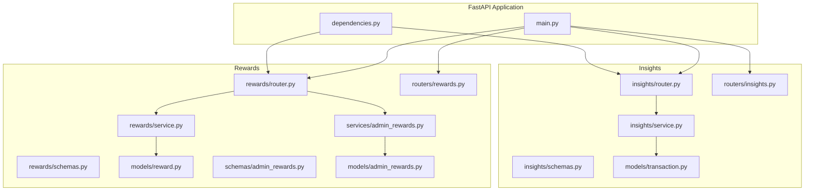
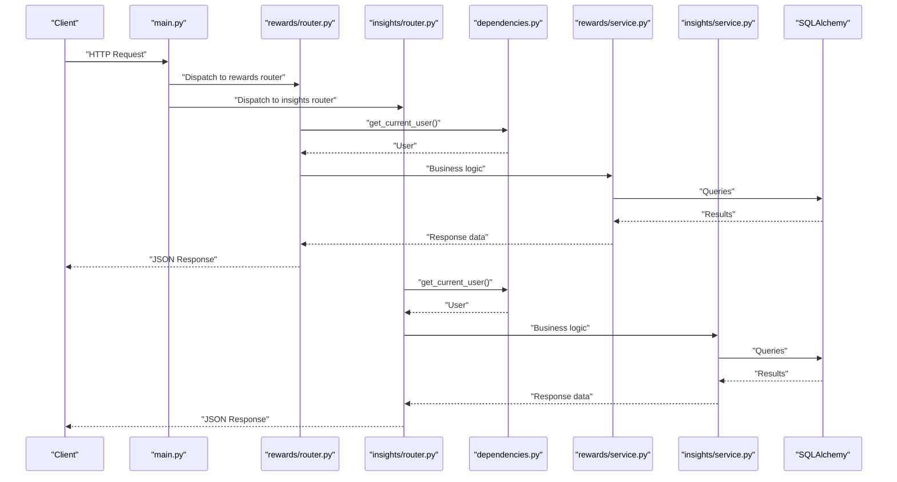
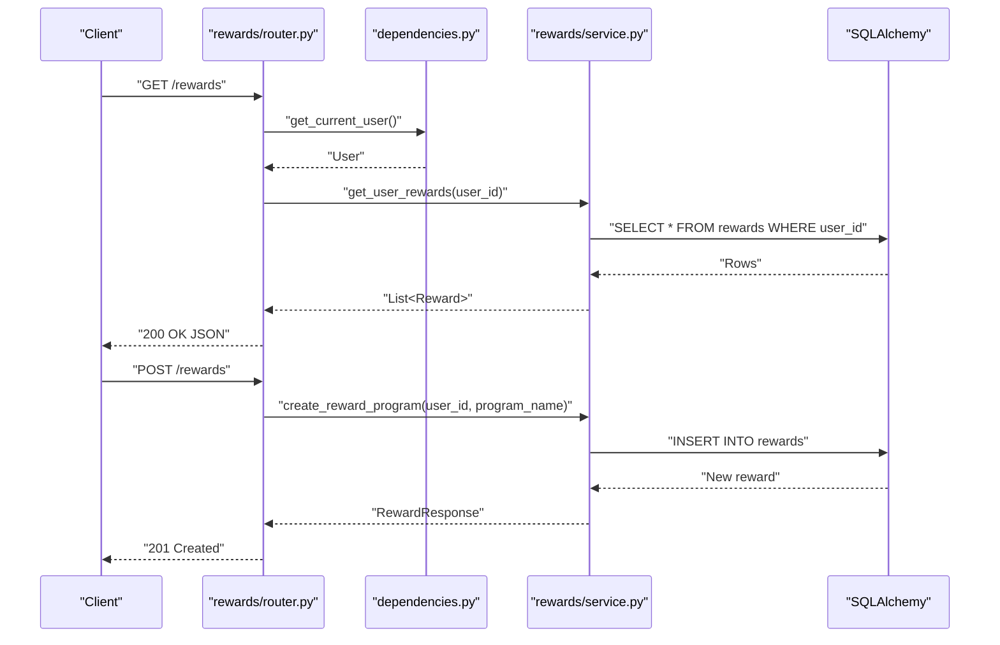
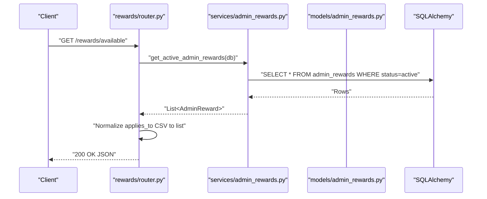
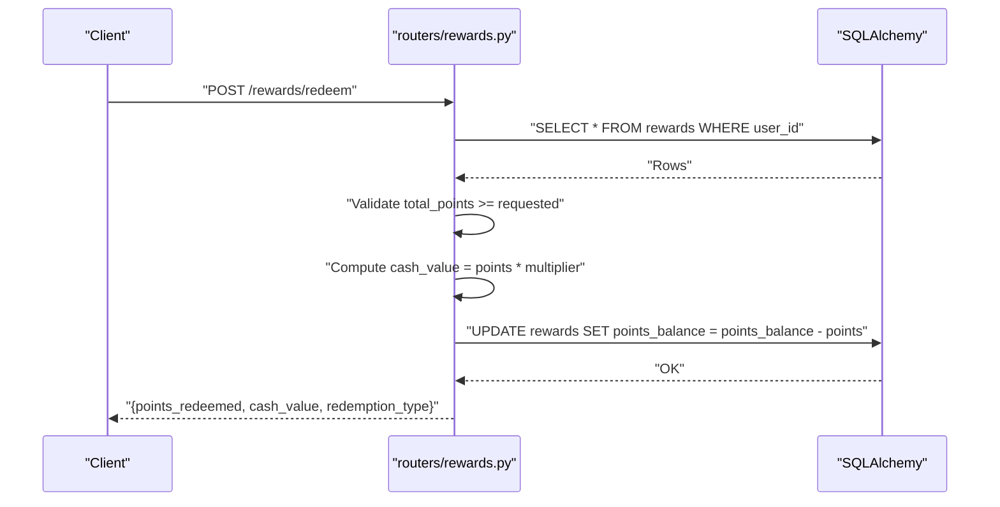
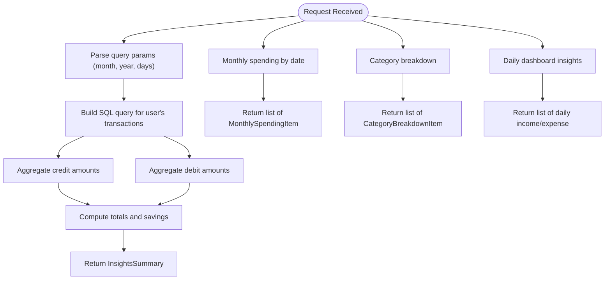
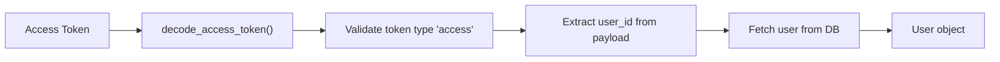
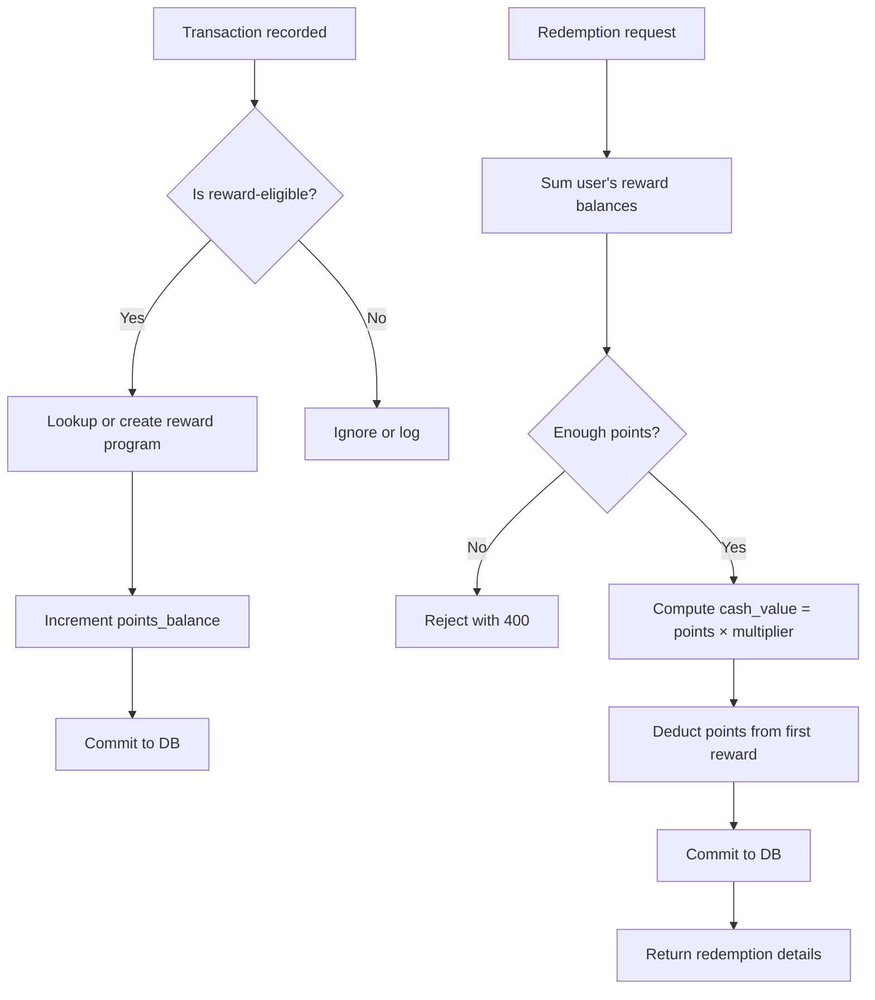

# Rewards & Insights API

<cite>
**Referenced Files in This Document**
- [main.py](file://backend/app/main.py)
- [dependencies.py](file://backend/app/dependencies.py)
- [rewards/router.py](file://backend/app/rewards/router.py)
- [rewards/schemas.py](file://backend/app/rewards/schemas.py)
- [rewards/service.py](file://backend/app/rewards/service.py)
- [insights/router.py](file://backend/app/insights/router.py)
- [insights/schemas.py](file://backend/app/insights/schemas.py)
- [insights/service.py](file://backend/app/insights/service.py)
- [routers/rewards.py](file://backend/app/routers/rewards.py)
- [routers/insights.py](file://backend/app/routers/insights.py)
- [models/reward.py](file://backend/app/models/reward.py)
- [models/admin_rewards.py](file://backend/app/models/admin_rewards.py)
- [models/transaction.py](file://backend/app/models/transaction.py)
- [schemas/admin_rewards.py](file://backend/app/schemas/admin_rewards.py)
- [services/admin_rewards.py](file://backend/app/services/admin_rewards.py)
</cite>

## Table of Contents
1. [Introduction](#introduction)
2. [Project Structure](#project-structure)
3. [Core Components](#core-components)
4. [Architecture Overview](#architecture-overview)
5. [Detailed Component Analysis](#detailed-component-analysis)
6. [Dependency Analysis](#dependency-analysis)
7. [Performance Considerations](#performance-considerations)
8. [Troubleshooting Guide](#troubleshooting-guide)
9. [Conclusion](#conclusion)
10. [Appendices](#appendices)

## Introduction
This document provides comprehensive API documentation for rewards and financial insights endpoints in the Modern Digital Banking Dashboard. It covers:
- Points accumulation and reward program mechanics
- Rewards redemption with cash value calculations
- Spending pattern analysis and financial analytics
- Schemas for reward calculations, redemption requests, and insights generation
- Examples for rewards tracking and spending behavior analysis

The APIs are built with FastAPI and SQLAlchemy, exposing both user-facing and administrative reward endpoints alongside financial insights.

## Project Structure
The backend organizes rewards and insights under dedicated routers, services, schemas, and models. The main application wires all routers and enforces authentication via shared dependencies.

**Diagram sources**
- [main.py:56-86](file://backend/app/main.py#L56-L86)
- [dependencies.py:51-57](file://backend/app/dependencies.py#L51-L57)
- [rewards/router.py:11-44](file://backend/app/rewards/router.py#L11-L44)
- [insights/router.py:10-51](file://backend/app/insights/router.py#L10-L51)
- [routers/rewards.py:8-162](file://backend/app/routers/rewards.py#L8-L162)
- [routers/insights.py:7-159](file://backend/app/routers/insights.py#L7-L159)

**Section sources**
- [main.py:56-86](file://backend/app/main.py#L56-L86)
- [dependencies.py:51-57](file://backend/app/dependencies.py#L51-L57)

## Core Components
- Rewards API (v1): Provides user reward programs, points balance, and available admin rewards.
- Insights API (v1): Offers summary, monthly spending, category breakdown, and dashboard daily insights.
- Legacy Rewards API: Supports creation, redemption, claims, and CRUD operations for user rewards.
- Legacy Insights API: Provides spending analysis, trends, budgets, and cash flow metrics.

Key capabilities:
- Points accumulation per reward program
- Redemption with configurable cash value multipliers
- Financial analytics including income, expenses, savings, and category breakdowns

**Section sources**
- [rewards/router.py:20-44](file://backend/app/rewards/router.py#L20-L44)
- [insights/router.py:17-51](file://backend/app/insights/router.py#L17-L51)
- [routers/rewards.py:19-162](file://backend/app/routers/rewards.py#L19-L162)
- [routers/insights.py:9-159](file://backend/app/routers/insights.py#L9-L159)

## Architecture Overview
The system follows a layered architecture:
- Routers handle HTTP endpoints and request/response schemas
- Services encapsulate business logic and database queries
- Models define persistence structures
- Dependencies enforce authentication and authorization

**Diagram sources**
- [main.py:56-86](file://backend/app/main.py#L56-L86)
- [dependencies.py:51-57](file://backend/app/dependencies.py#L51-L57)
- [rewards/router.py:20-44](file://backend/app/rewards/router.py#L20-L44)
- [insights/router.py:17-51](file://backend/app/insights/router.py#L17-L51)
- [rewards/service.py:14-53](file://backend/app/rewards/service.py#L14-L53)
- [insights/service.py:71-147](file://backend/app/insights/service.py#L71-L147)

## Detailed Component Analysis

### Rewards API v1
Endpoints:
- GET /rewards: List user reward programs
- POST /rewards: Create a new reward program for the user
- GET /rewards/available: List available admin rewards (normalized applies_to)

Schemas:
- RewardCreate: program_name, points_balance (default 0)
- RewardResponse: id, program_name, points_balance, last_updated

Business logic:
- User-specific reward programs are stored with a default zero balance
- Points can be added via internal service functions (add_reward_points)
- Available admin rewards are returned with applies_to normalized to a list

**Diagram sources**
- [rewards/router.py:20-34](file://backend/app/rewards/router.py#L20-L34)
- [rewards/service.py:14-31](file://backend/app/rewards/service.py#L14-L31)
- [dependencies.py:51-57](file://backend/app/dependencies.py#L51-L57)

**Section sources**
- [rewards/router.py:20-44](file://backend/app/rewards/router.py#L20-L44)
- [rewards/schemas.py:8-18](file://backend/app/rewards/schemas.py#L8-L18)
- [rewards/service.py:14-53](file://backend/app/rewards/service.py#L14-L53)
- [models/reward.py:5-13](file://backend/app/models/reward.py#L5-L13)

### Admin Rewards Integration
Available rewards endpoint returns admin-defined offers with:
- name, description, reward_type, applies_to (CSV), value, status, created_at
- applies_to is normalized to a list for client consumption

**Diagram sources**
- [rewards/router.py:37-44](file://backend/app/rewards/router.py#L37-L44)
- [services/admin_rewards.py:57-58](file://backend/app/services/admin_rewards.py#L57-L58)
- [models/admin_rewards.py:11-32](file://backend/app/models/admin_rewards.py#L11-L32)

**Section sources**
- [rewards/router.py:37-44](file://backend/app/rewards/router.py#L37-L44)
- [schemas/admin_rewards.py:6-25](file://backend/app/schemas/admin_rewards.py#L6-L25)
- [services/admin_rewards.py:57-58](file://backend/app/services/admin_rewards.py#L57-L58)
- [models/admin_rewards.py:11-32](file://backend/app/models/admin_rewards.py#L11-L32)

### Legacy Rewards API
Endpoints:
- GET /rewards: List user rewards with computed cash_value and metadata
- POST /rewards/redeem: Redeem points with type-based multipliers
- POST /rewards: Create a reward program
- GET /rewards/{id}, PUT /rewards/{id}, DELETE /rewards/{id}: CRUD
- POST /rewards/{id}/claim: Claim a reward
- GET /rewards/currency/rates: Public currency rates

Redemption logic:
- Multiplier per redemption_type: cash (0.01), gift_card (0.012), travel (0.015)
- Deducts points from the first reward program found

**Diagram sources**
- [routers/rewards.py:59-86](file://backend/app/routers/rewards.py#L59-L86)

**Section sources**
- [routers/rewards.py:19-162](file://backend/app/routers/rewards.py#L19-L162)

### Insights API v1
Endpoints:
- GET /insights/summary: Total income, total expense, savings
- GET /insights/monthly: Daily spending for a given month/year
- GET /insights/categories: Category-wise spending for a given month/year
- GET /insights/dashboard/daily: Daily income/expense over N days

Schemas:
- InsightsSummary: total_income, total_expense, savings
- MonthlySpendingItem: date, amount
- CategoryBreakdownItem: category, amount

**Diagram sources**
- [insights/router.py:17-51](file://backend/app/insights/router.py#L17-L51)
- [insights/service.py:71-147](file://backend/app/insights/service.py#L71-L147)
- [insights/schemas.py:4-17](file://backend/app/insights/schemas.py#L4-L17)

**Section sources**
- [insights/router.py:17-51](file://backend/app/insights/router.py#L17-L51)
- [insights/schemas.py:4-17](file://backend/app/insights/schemas.py#L4-L17)
- [insights/service.py:71-147](file://backend/app/insights/service.py#L71-L147)

### Legacy Insights API
Provides additional analytics:
- GET /insights/spending: Top merchants, daily burn rate, projected monthly spend
- GET /insights/trends, /insights/budgets, /insights/cash-flow, etc.

These endpoints return computed analytics and are useful for dashboards and reports.

**Section sources**
- [routers/insights.py:9-159](file://backend/app/routers/insights.py#L9-L159)

## Dependency Analysis
Authentication and authorization:
- get_current_user validates JWT access tokens and resolves the current user
- Admin endpoints require is_admin flag enforcement

**Diagram sources**
- [dependencies.py:21-48](file://backend/app/dependencies.py#L21-L48)

**Section sources**
- [dependencies.py:51-57](file://backend/app/dependencies.py#L51-L57)

## Performance Considerations
- Use pagination and filtering for large datasets (e.g., monthly and category endpoints)
- Indexes on user_id, txn_date, and category improve query performance
- Batch updates for points accumulation reduce round trips
- Cache frequently accessed admin rewards lists

## Troubleshooting Guide
Common issues and resolutions:
- Insufficient points during redemption: Ensure total points meet or exceed requested amount
- Unauthorized access: Verify valid access token and user authentication
- Missing user rewards: Confirm reward programs exist for the user
- Admin rewards not visible: Check status is active and applies_to matches user segment

**Section sources**
- [routers/rewards.py:65-66](file://backend/app/routers/rewards.py#L65-L66)
- [dependencies.py:17-48](file://backend/app/dependencies.py#L17-L48)

## Conclusion
The Rewards & Insights API suite provides a robust foundation for managing user reward programs and deriving actionable financial insights. The modular design supports both user-facing and administrative workflows, while the legacy endpoints offer extended functionality for advanced use cases.

## Appendices

### API Definitions

#### Rewards API v1
- GET /rewards
  - Description: List user reward programs
  - Authentication: Required
  - Response: Array of RewardResponse
- POST /rewards
  - Description: Create a new reward program for the user
  - Authentication: Required
  - Request: RewardCreate
  - Response: RewardResponse
- GET /rewards/available
  - Description: List available admin rewards
  - Authentication: Not required
  - Response: Array of AdminRewardResponse (applies_to normalized to list)

**Section sources**
- [rewards/router.py:20-44](file://backend/app/rewards/router.py#L20-L44)
- [rewards/schemas.py:8-18](file://backend/app/rewards/schemas.py#L8-L18)
- [schemas/admin_rewards.py:14-25](file://backend/app/schemas/admin_rewards.py#L14-L25)

#### Legacy Rewards API
- GET /rewards
  - Description: List user rewards with computed cash_value and metadata
  - Authentication: Required
  - Response: Array of reward objects
- POST /rewards/redeem
  - Description: Redeem points with type-based multipliers
  - Authentication: Required
  - Request: { points: number, redemption_type: "cash"|"gift_card"|"travel" }
  - Response: { points_redeemed, cash_value, redemption_type }
- POST /rewards
  - Description: Create a reward program
  - Authentication: Required
  - Request: { title, description, points }
  - Response: { id, title, points, message }
- GET /rewards/{id}
  - Description: Retrieve a reward by ID
  - Authentication: Required
  - Response: { id, title, points, cash_value, category, is_claimed }
- PUT /rewards/{id}
  - Description: Update a reward program
  - Authentication: Required
  - Request: { title, description, points }
  - Response: { id, title, points, message }
- DELETE /rewards/{id}
  - Description: Delete a reward program
  - Authentication: Required
  - Response: { message }
- POST /rewards/{id}/claim
  - Description: Claim a reward
  - Authentication: Required
  - Response: { message, reward_id, points_claimed }
- GET /rewards/currency/rates
  - Description: Public currency rates
  - Authentication: Not required
  - Response: { currency: rate }

**Section sources**
- [routers/rewards.py:19-162](file://backend/app/routers/rewards.py#L19-L162)

#### Insights API v1
- GET /insights/summary
  - Description: Financial summary (income, expense, savings)
  - Authentication: Required
  - Response: InsightsSummary
- GET /insights/monthly
  - Description: Daily spending for a given month/year
  - Authentication: Required
  - Query: month (number), year (number)
  - Response: Array of MonthlySpendingItem
- GET /insights/categories
  - Description: Category-wise spending for a given month/year
  - Authentication: Required
  - Query: month (number), year (number)
  - Response: Array of CategoryBreakdownItem
- GET /insights/dashboard/daily
  - Description: Daily income/expense over N days
  - Authentication: Required
  - Query: days (number, default 15)
  - Response: Array of { date, income, expense }

**Section sources**
- [insights/router.py:17-51](file://backend/app/insights/router.py#L17-L51)
- [insights/schemas.py:4-17](file://backend/app/insights/schemas.py#L4-L17)

#### Legacy Insights API
- GET /insights
  - Description: Basic financial summary and top category
  - Authentication: Required
  - Response: { income, expenses, net_flow, savings_rate, top_category, transactions_count }
- GET /insights/spending
  - Description: Spending analysis including top merchants and burn rate
  - Authentication: Required
  - Query: period ("month"|"week")
  - Response: { period, total_spent, daily_burn_rate, projected_monthly_spend, top_merchants }
- GET /insights/trends, /insights/budgets, /insights/cash-flow, etc.
  - Description: Additional analytics endpoints returning mock or computed data
  - Authentication: Optional (as applicable)

**Section sources**
- [routers/insights.py:9-159](file://backend/app/routers/insights.py#L9-L159)

### Schemas

#### Reward Schemas
- RewardCreate
  - program_name: string
  - points_balance: integer (default 0)
- RewardResponse
  - id: integer
  - program_name: string
  - points_balance: integer
  - last_updated: datetime

**Section sources**
- [rewards/schemas.py:8-18](file://backend/app/rewards/schemas.py#L8-L18)

#### Admin Reward Schemas
- AdminRewardCreate
  - name: string
  - description: string?
  - reward_type: string
  - applies_to: string[]
  - value: string
- AdminRewardResponse
  - id: integer
  - name: string
  - description: string?
  - reward_type: string
  - applies_to: string[]
  - value: string
  - status: string
  - created_at: datetime

**Section sources**
- [schemas/admin_rewards.py:6-25](file://backend/app/schemas/admin_rewards.py#L6-L25)

#### Insights Schemas
- InsightsSummary
  - total_income: number
  - total_expense: number
  - savings: number
- MonthlySpendingItem
  - date: string (ISO date)
  - amount: number
- CategoryBreakdownItem
  - category: string
  - amount: number

**Section sources**
- [insights/schemas.py:4-17](file://backend/app/insights/schemas.py#L4-L17)

### Reward Program Mechanics and Points Calculation
- Points accumulation: add_reward_points increments the balance for an existing program or creates a new one if not found
- Redemption: cash_value = points × multiplier; supported types include cash, gift_card, travel with distinct multipliers
- Insights generation: aggregates transactions by date, category, and user to compute summaries and trends

**Diagram sources**
- [rewards/service.py:34-53](file://backend/app/rewards/service.py#L34-L53)
- [routers/rewards.py:68-86](file://backend/app/routers/rewards.py#L68-L86)
- [insights/service.py:71-147](file://backend/app/insights/service.py#L71-L147)

### Examples

#### Rewards Tracking Example
- Request: GET /rewards
- Expected response: Array of reward objects with computed cash_value and metadata
- Use case: Display user’s reward portfolio and claimable value

**Section sources**
- [routers/rewards.py:20-45](file://backend/app/routers/rewards.py#L20-L45)

#### Spending Behavior Analysis Example
- Request: GET /insights/monthly?month=1&year=2025
- Expected response: Daily spending amounts grouped by date
- Use case: Visualize daily expenditure trends for a specific month

**Section sources**
- [insights/router.py:25-32](file://backend/app/insights/router.py#L25-L32)

#### Redemption Example
- Request: POST /rewards/redeem with { points: 500, redemption_type: "gift_card" }
- Expected response: { points_redeemed: 500, cash_value: 6.0, redemption_type: "gift_card" }
- Use case: Convert accumulated points to a gift card value

**Section sources**
- [routers/rewards.py:59-86](file://backend/app/routers/rewards.py#L59-L86)