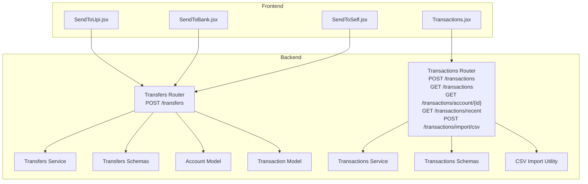
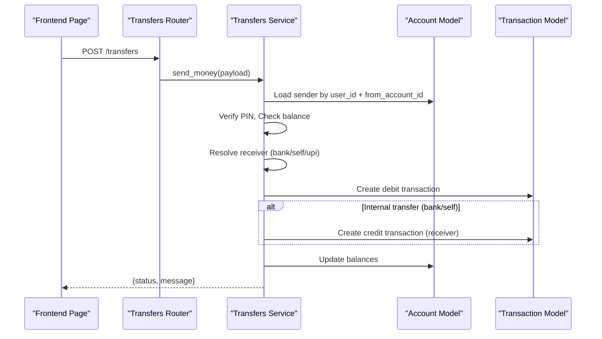
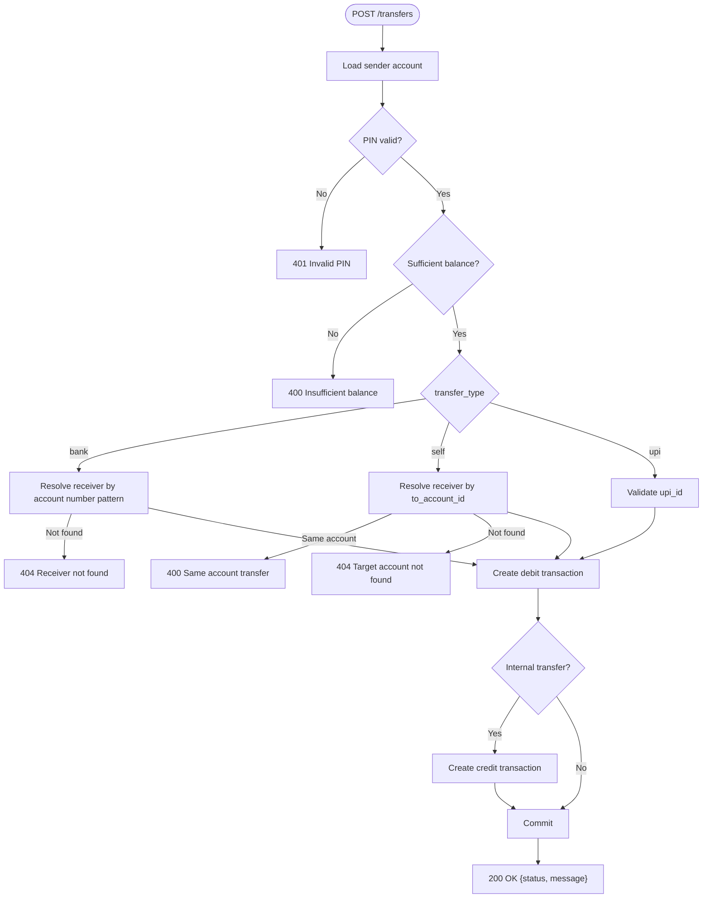
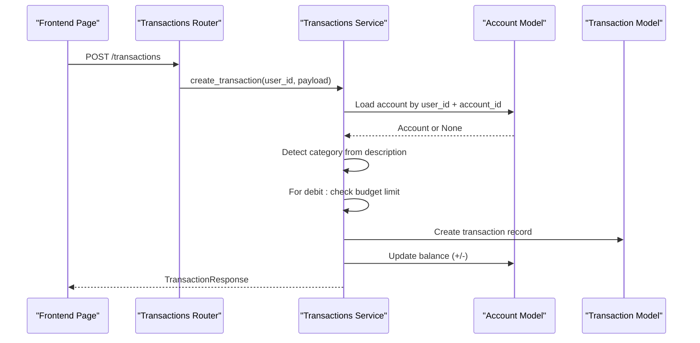
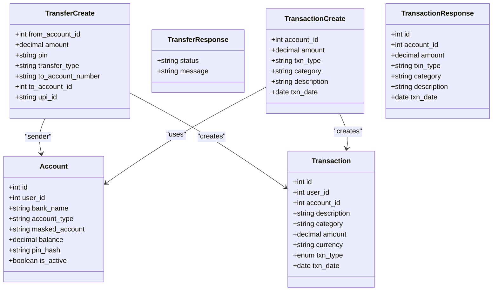

# Transaction & Transfer API

<cite>
**Referenced Files in This Document**
- [backend/app/transfers/router.py](file://backend/app/transfers/router.py)
- [backend/app/transfers/schemas.py](file://backend/app/transfers/schemas.py)
- [backend/app/transfers/service.py](file://backend/app/transfers/service.py)
- [backend/app/transactions/router.py](file://backend/app/transactions/router.py)
- [backend/app/transactions/schemas.py](file://backend/app/transactions/schemas.py)
- [backend/app/transactions/service.py](file://backend/app/transactions/service.py)
- [backend/app/transactions/csv_import.py](file://backend/app/transactions/csv_import.py)
- [backend/app/models/transaction.py](file://backend/app/models/transaction.py)
- [backend/app/models/account.py](file://backend/app/models/account.py)
- [backend/app/schemas/transaction.py](file://backend/app/schemas/transaction.py)
- [frontend/src/pages/user/SendToUpi.jsx](file://frontend/src/pages/user/SendToUpi.jsx)
- [frontend/src/pages/user/SendToBank.jsx](file://frontend/src/pages/user/SendToBank.jsx)
- [frontend/src/pages/user/SendToSelf.jsx](file://frontend/src/pages/user/SendToSelf.jsx)
- [frontend/src/pages/user/Transactions.jsx](file://frontend/src/pages/user/Transactions.jsx)
</cite>

## Table of Contents
1. [Introduction](#introduction)
2. [Project Structure](#project-structure)
3. [Core Components](#core-components)
4. [Architecture Overview](#architecture-overview)
5. [Detailed Component Analysis](#detailed-component-analysis)
6. [Dependency Analysis](#dependency-analysis)
7. [Performance Considerations](#performance-considerations)
8. [Troubleshooting Guide](#troubleshooting-guide)
9. [Conclusion](#conclusion)
10. [Appendices](#appendices)

## Introduction
This document provides comprehensive API documentation for transaction and transfer endpoints. It covers:
- UPI transfers, bank transfers, self-account transfers, and transaction history retrieval
- Detailed schemas for transfer requests, transaction queries, and balance operations
- PIN verification requirements, transaction validation rules, and error handling
- Examples for different transfer types, transaction filtering, and batch operations

## Project Structure
The backend exposes two primary API groups:
- Transfers: POST /transfers for initiating transfers
- Transactions: CRUD-like endpoints for adding and retrieving transactions, including CSV import

**Diagram sources**
- [backend/app/transfers/router.py:1-24](file://backend/app/transfers/router.py#L1-L24)
- [backend/app/transfers/service.py:1-198](file://backend/app/transfers/service.py#L1-L198)
- [backend/app/transfers/schemas.py:1-26](file://backend/app/transfers/schemas.py#L1-L26)
- [backend/app/models/account.py:1-57](file://backend/app/models/account.py#L1-L57)
- [backend/app/models/transaction.py:1-58](file://backend/app/models/transaction.py#L1-L58)
- [backend/app/transactions/router.py:1-129](file://backend/app/transactions/router.py#L1-L129)
- [backend/app/transactions/service.py:1-188](file://backend/app/transactions/service.py#L1-L188)
- [backend/app/transactions/schemas.py:1-34](file://backend/app/transactions/schemas.py#L1-L34)
- [backend/app/transactions/csv_import.py:1-69](file://backend/app/transactions/csv_import.py#L1-L69)
- [frontend/src/pages/user/SendToUpi.jsx:1-191](file://frontend/src/pages/user/SendToUpi.jsx#L1-L191)
- [frontend/src/pages/user/SendToBank.jsx:1-175](file://frontend/src/pages/user/SendToBank.jsx#L1-L175)
- [frontend/src/pages/user/SendToSelf.jsx:1-170](file://frontend/src/pages/user/SendToSelf.jsx#L1-L170)
- [frontend/src/pages/user/Transactions.jsx:1-242](file://frontend/src/pages/user/Transactions.jsx#L1-L242)

**Section sources**
- [backend/app/transfers/router.py:1-24](file://backend/app/transfers/router.py#L1-L24)
- [backend/app/transactions/router.py:1-129](file://backend/app/transactions/router.py#L1-L129)

## Core Components
- Transfers Router: Exposes POST /transfers with request schema TransferCreate and response TransferResponse
- Transfers Service: Implements PIN verification, balance checks, target resolution, and dual transaction creation for internal transfers
- Transactions Router: Exposes endpoints to add transactions, list all or account-specific transactions, fetch recent transactions, and import CSV
- Transactions Service: Validates account ownership, enforces budget limits, updates balances, and creates transaction records
- Models: Account and Transaction ORM models define persisted structures and relationships
- Frontend Pages: UPI, Bank, Self transfer pages and Transactions history page demonstrate usage

**Section sources**
- [backend/app/transfers/router.py:13-24](file://backend/app/transfers/router.py#L13-L24)
- [backend/app/transfers/schemas.py:6-26](file://backend/app/transfers/schemas.py#L6-L26)
- [backend/app/transfers/service.py:164-198](file://backend/app/transfers/service.py#L164-L198)
- [backend/app/transactions/router.py:65-129](file://backend/app/transactions/router.py#L65-L129)
- [backend/app/transactions/schemas.py:10-34](file://backend/app/transactions/schemas.py#L10-L34)
- [backend/app/transactions/service.py:105-188](file://backend/app/transactions/service.py#L105-L188)
- [backend/app/models/account.py:31-57](file://backend/app/models/account.py#L31-L57)
- [backend/app/models/transaction.py:32-58](file://backend/app/models/transaction.py#L32-L58)
- [frontend/src/pages/user/SendToUpi.jsx:99-121](file://frontend/src/pages/user/SendToUpi.jsx#L99-L121)
- [frontend/src/pages/user/SendToBank.jsx:79-102](file://frontend/src/pages/user/SendToBank.jsx#L79-L102)
- [frontend/src/pages/user/SendToSelf.jsx:76-99](file://frontend/src/pages/user/SendToSelf.jsx#L76-L99)
- [frontend/src/pages/user/Transactions.jsx:92-122](file://frontend/src/pages/user/Transactions.jsx#L92-L122)

## Architecture Overview
End-to-end flow for transfers and transactions:

**Diagram sources**
- [backend/app/transfers/router.py:13-24](file://backend/app/transfers/router.py#L13-L24)
- [backend/app/transfers/service.py:164-198](file://backend/app/transfers/service.py#L164-L198)
- [backend/app/models/account.py:31-57](file://backend/app/models/account.py#L31-L57)
- [backend/app/models/transaction.py:32-58](file://backend/app/models/transaction.py#L32-L58)

## Detailed Component Analysis

### Transfers API
Endpoints:
- POST /transfers
  - Request body: TransferCreate
  - Response: TransferResponse
  - Behavior: Validates PIN and balance, resolves target based on transfer_type, updates balances, and creates corresponding debit/credit transactions

Validation rules:
- Sender account must belong to the current user
- PIN must match the hashed PIN stored in the Account model
- Sufficient balance for the amount
- Target-specific validations:
  - bank: requires to_account_number; receiver resolved by last 4 digits pattern matching
  - self: requires to_account_id; receiver must belong to the same user and must not be the same account
  - upi: requires upi_id; validated to be either a UPI ID with "@" or a 10-digit mobile number
- transfer_type must be one of ["bank", "self", "upi"]

Error responses:
- 400: Insufficient balance, Amount must be greater than zero, Account number required, Target account required, Same account transfer, UPI ID required, Invalid UPI ID, Invalid transfer type
- 401: Invalid PIN
- 404: Sender account not found, Receiver account not found, Target account not found

Example request bodies:
- UPI transfer
  - transfer_type: "upi"
  - upi_id: "example@upi"
- Bank transfer
  - transfer_type: "bank"
  - to_account_number: "1234567890"
- Self transfer
  - transfer_type: "self"
  - to_account_id: 2

Response:
- status: "success"
- message: "Transfer completed successfully"

**Diagram sources**
- [backend/app/transfers/service.py:164-198](file://backend/app/transfers/service.py#L164-L198)
- [backend/app/transfers/schemas.py:6-26](file://backend/app/transfers/schemas.py#L6-L26)

**Section sources**
- [backend/app/transfers/router.py:13-24](file://backend/app/transfers/router.py#L13-L24)
- [backend/app/transfers/schemas.py:6-26](file://backend/app/transfers/schemas.py#L6-L26)
- [backend/app/transfers/service.py:13-26](file://backend/app/transfers/service.py#L13-L26)
- [backend/app/transfers/service.py:42-50](file://backend/app/transfers/service.py#L42-L50)
- [backend/app/transfers/service.py:52-69](file://backend/app/transfers/service.py#L52-L69)
- [backend/app/transfers/service.py:75-80](file://backend/app/transfers/service.py#L75-L80)
- [backend/app/transfers/service.py:88-105](file://backend/app/transfers/service.py#L88-L105)
- [backend/app/transfers/service.py:164-198](file://backend/app/transfers/service.py#L164-L198)
- [backend/app/models/account.py:49-50](file://backend/app/models/account.py#L49-L50)
- [backend/app/models/transaction.py:28-31](file://backend/app/models/transaction.py#L28-L31)

### Transactions API
Endpoints:
- POST /transactions
  - Request body: TransactionCreate
  - Response: TransactionResponse
  - Behavior: Validates account ownership, detects category from description, enforces budget limits for debits, updates account balance, and persists transaction
- GET /transactions
  - Query params: account_id, txn_type, from (alias for from_date), to (alias for to_date), search
  - Response: List of TransactionResponse
  - Behavior: Filters by user-bound accounts and optional criteria, ordered by date descending
- GET /transactions/account/{account_id}
  - Response: List of TransactionResponse
  - Behavior: Returns transactions for a specific account owned by the user
- GET /transactions/recent
  - Response: List of TransactionResponse (latest 5)
- POST /transactions/import/csv
  - Form field: file (CSV)
  - Response: {status: "success", imported_records: number}
  - Behavior: Imports transactions in batches and ignores invalid rows

Transaction schema:
- TransactionCreate: account_id, amount (> 0), txn_type ("debit" | "credit"), category (default "Uncategorized"), description (optional), txn_date (optional)
- TransactionResponse: includes id, account_id, amount, txn_type, category, description, txn_date

Validation rules:
- Account must belong to the current user
- Debits are checked against active monthly budgets for the detected category
- Amount must be positive
- Description-driven category detection supports "Food", "Travel", "Bills", and others

**Diagram sources**
- [backend/app/transactions/router.py:65-75](file://backend/app/transactions/router.py#L65-L75)
- [backend/app/transactions/service.py:105-149](file://backend/app/transactions/service.py#L105-L149)
- [backend/app/transactions/schemas.py:21-31](file://backend/app/transactions/schemas.py#L21-L31)

**Section sources**
- [backend/app/transactions/router.py:65-129](file://backend/app/transactions/router.py#L65-L129)
- [backend/app/transactions/schemas.py:10-34](file://backend/app/transactions/schemas.py#L10-L34)
- [backend/app/transactions/service.py:105-188](file://backend/app/transactions/service.py#L105-L188)
- [backend/app/transactions/csv_import.py:26-69](file://backend/app/transactions/csv_import.py#L26-L69)

### Transaction Filtering and Search
- Filtering parameters on GET /transactions:
  - account_id: filter by account
  - txn_type: "debit" or "credit"
  - from: inclusive start date
  - to: inclusive end date
  - search: case-insensitive substring match on description
- Ordering: most recent first by txn_date

Frontend usage:
- Transactions.jsx demonstrates fetching, filtering, and exporting transactions

**Section sources**
- [backend/app/transactions/router.py:77-96](file://backend/app/transactions/router.py#L77-L96)
- [frontend/src/pages/user/Transactions.jsx:72-122](file://frontend/src/pages/user/Transactions.jsx#L72-L122)

### Batch Operations
- CSV Import: POST /transactions/import/csv
  - Accepts multipart/form-data with a CSV file
  - Expected CSV columns: account_id, amount, txn_type, description, txn_date
  - Ignores invalid rows and returns the count of successfully imported records

**Section sources**
- [backend/app/transactions/router.py:121-129](file://backend/app/transactions/router.py#L121-L129)
- [backend/app/transactions/csv_import.py:26-69](file://backend/app/transactions/csv_import.py#L26-L69)

## Dependency Analysis
- Transfers depend on:
  - Account model for PIN verification and balance
  - Transaction model for creating debit/credit entries
  - Budget enforcement via transactions service
- Transactions depend on:
  - Account model for balance updates
  - Budget model for spending limits
  - UserSettings for optional notifications

**Diagram sources**
- [backend/app/models/account.py:31-57](file://backend/app/models/account.py#L31-L57)
- [backend/app/models/transaction.py:32-58](file://backend/app/models/transaction.py#L32-L58)
- [backend/app/transfers/schemas.py:6-26](file://backend/app/transfers/schemas.py#L6-L26)
- [backend/app/transfers/service.py:164-198](file://backend/app/transfers/service.py#L164-L198)
- [backend/app/transactions/schemas.py:21-31](file://backend/app/transactions/schemas.py#L21-L31)
- [backend/app/transactions/service.py:105-149](file://backend/app/transactions/service.py#L105-L149)

**Section sources**
- [backend/app/transfers/service.py:164-198](file://backend/app/transfers/service.py#L164-L198)
- [backend/app/transactions/service.py:105-149](file://backend/app/transactions/service.py#L105-L149)

## Performance Considerations
- Filtering on GET /transactions uses joins and multiple WHERE clauses; ensure appropriate indexing on user_id, account_id, txn_date, and description for optimal performance
- CSV import reads entire file into memory; consider streaming for very large files
- Budget checks occur per transaction; caching active budgets per user could reduce repeated lookups

## Troubleshooting Guide
Common errors and resolutions:
- 400 Invalid PIN
  - Cause: PIN mismatch
  - Resolution: Re-enter PIN; ensure numeric 4-digit PIN
- 400 Insufficient balance
  - Cause: Sender balance less than requested amount
  - Resolution: Fund account or reduce amount
- 400 Account number required / Receiver not found
  - Cause: Missing or invalid bank account number
  - Resolution: Provide a valid numeric account number; ensure receiver exists
- 400 Target account required / Target account not found / Same account transfer
  - Cause: Missing or invalid self-transfer target
  - Resolution: Select a valid destination account; avoid transferring to the same account
- 400 UPI ID required / Invalid UPI ID
  - Cause: Missing or malformed upi_id
  - Resolution: Provide a valid UPI ID (with "@") or a 10-digit mobile number
- 404 Sender account not found
  - Cause: Sender account does not belong to current user
  - Resolution: Select a valid account linked to the user
- Budget exceeded
  - Cause: Debit would exceed active monthly budget
  - Resolution: Adjust spending or increase budget limit

**Section sources**
- [backend/app/transfers/service.py:13-26](file://backend/app/transfers/service.py#L13-L26)
- [backend/app/transactions/service.py:29-30](file://backend/app/transactions/service.py#L29-L30)

## Conclusion
The Transaction & Transfer API provides robust endpoints for financial operations with strong validation, PIN protection, and comprehensive transaction history capabilities. The design separates concerns between transfers (PIN-protected, multi-type targets) and transactions (budget-aware, flexible filtering, and batch import), ensuring secure and auditable financial workflows.

## Appendices

### API Definitions

- POST /transfers
  - Request: TransferCreate
  - Response: TransferResponse
  - Notes: PIN verified; balance checked; target resolved by transfer_type

- GET /transactions
  - Query: account_id, txn_type, from, to, search
  - Response: List<TransactionResponse>

- GET /transactions/account/{account_id}
  - Response: List<TransactionResponse>

- GET /transactions/recent
  - Response: List<TransactionResponse>

- POST /transactions
  - Request: TransactionCreate
  - Response: TransactionResponse

- POST /transactions/import/csv
  - Form: file (CSV)
  - Response: {status, imported_records}

**Section sources**
- [backend/app/transfers/router.py:13-24](file://backend/app/transfers/router.py#L13-L24)
- [backend/app/transactions/router.py:77-129](file://backend/app/transactions/router.py#L77-L129)

### Schemas

- TransferCreate
  - Required: from_account_id, amount (> 0), pin (4 digits), transfer_type ∈ {"bank","self","upi"}
  - Conditional fields:
    - bank: to_account_number
    - self: to_account_id
    - upi: upi_id

- TransferResponse
  - status: "success"
  - message: "Transfer completed successfully"

- TransactionCreate
  - Required: account_id, amount (> 0), txn_type ∈ {"debit","credit"}
  - Optional: category, description, txn_date

- TransactionResponse
  - Includes id, account_id, amount, txn_type, category, description, txn_date

**Section sources**
- [backend/app/transfers/schemas.py:6-26](file://backend/app/transfers/schemas.py#L6-L26)
- [backend/app/transactions/schemas.py:10-34](file://backend/app/transactions/schemas.py#L10-L34)

### Frontend Usage Examples

- UPI Transfer
  - Endpoint: POST /transfers
  - Payload keys: from_account_id, amount, pin, transfer_type="upi", upi_id
  - UI: SendToUpi.jsx

- Bank Transfer
  - Endpoint: POST /transfers
  - Payload keys: from_account_id, amount, pin, transfer_type="bank", to_account_number
  - UI: SendToBank.jsx

- Self Transfer
  - Endpoint: POST /transfers
  - Payload keys: from_account_id, to_account_id, amount, pin, transfer_type="self"
  - UI: SendToSelf.jsx

- Transaction History
  - Endpoint: GET /transactions
  - Query: account_id, txn_type, from, to, search
  - UI: Transactions.jsx

**Section sources**
- [frontend/src/pages/user/SendToUpi.jsx:99-121](file://frontend/src/pages/user/SendToUpi.jsx#L99-L121)
- [frontend/src/pages/user/SendToBank.jsx:79-102](file://frontend/src/pages/user/SendToBank.jsx#L79-L102)
- [frontend/src/pages/user/SendToSelf.jsx:76-99](file://frontend/src/pages/user/SendToSelf.jsx#L76-L99)
- [frontend/src/pages/user/Transactions.jsx:92-122](file://frontend/src/pages/user/Transactions.jsx#L92-L122)