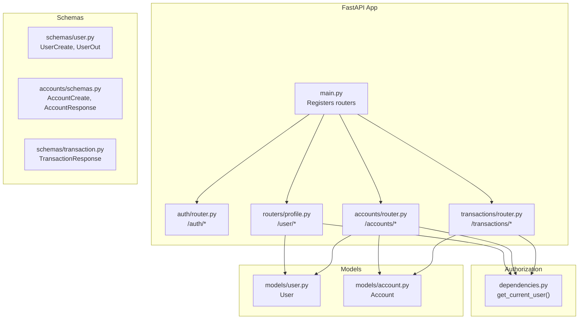
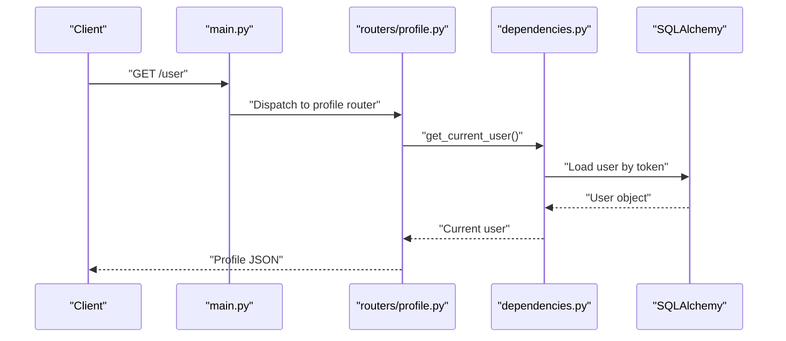
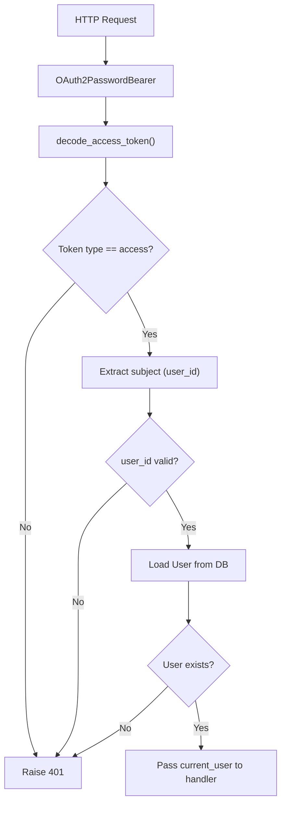

# User Management API

<cite>
**Referenced Files in This Document**
- [main.py](file://backend/app/main.py)
- [dependencies.py](file://backend/app/dependencies.py)
- [auth/router.py](file://backend/app/auth/router.py)
- [routers/profile.py](file://backend/app/routers/profile.py)
- [accounts/router.py](file://backend/app/accounts/router.py)
- [accounts/schemas.py](file://backend/app/accounts/schemas.py)
- [models/user.py](file://backend/app/models/user.py)
- [models/account.py](file://backend/app/models/account.py)
- [schemas/user.py](file://backend/app/schemas/user.py)
- [schemas/user_schema.py](file://backend/app/schemas/user_schema.py)
- [schemas/transaction.py](file://backend/app/schemas/transaction.py)
- [transactions/router.py](file://backend/app/transactions/router.py)
</cite>

## Table of Contents
1. [Introduction](#introduction)
2. [Project Structure](#project-structure)
3. [Core Components](#core-components)
4. [Architecture Overview](#architecture-overview)
5. [Detailed Component Analysis](#detailed-component-analysis)
6. [Dependency Analysis](#dependency-analysis)
7. [Performance Considerations](#performance-considerations)
8. [Troubleshooting Guide](#troubleshooting-guide)
9. [Conclusion](#conclusion)
10. [Appendices](#appendices)

## Introduction
This document provides comprehensive API documentation for user management endpoints in the Modern Digital Banking Dashboard. It covers profile management, account operations, KYC submission, and user settings. It also documents request/response schemas, validation rules, authorization requirements, and includes practical examples for common operations such as account creation, profile updates, and balance inquiries.

## Project Structure
The backend is a FastAPI application that organizes endpoints by feature. Authentication and user profile endpoints are exposed under shared routers, while account and transaction endpoints are grouped separately. Authorization is enforced via an OAuth2 bearer token dependency.

**Diagram sources**
- [main.py:28-85](file://backend/app/main.py#L28-L85)
- [dependencies.py:51-57](file://backend/app/dependencies.py#L51-L57)
- [auth/router.py:21-180](file://backend/app/auth/router.py#L21-L180)
- [routers/profile.py:7-106](file://backend/app/routers/profile.py#L7-L106)
- [accounts/router.py:36-109](file://backend/app/accounts/router.py#L36-L109)
- [transactions/router.py:35-129](file://backend/app/transactions/router.py#L35-L129)
- [models/user.py:37-65](file://backend/app/models/user.py#L37-L65)
- [models/account.py:31-57](file://backend/app/models/account.py#L31-L57)
- [schemas/user.py:7-55](file://backend/app/schemas/user.py#L7-L55)
- [accounts/schemas.py:29-60](file://backend/app/accounts/schemas.py#L29-L60)
- [schemas/transaction.py:5-20](file://backend/app/schemas/transaction.py#L5-L20)

**Section sources**
- [main.py:28-85](file://backend/app/main.py#L28-L85)

## Core Components
- Authentication and session management (/auth/*): Registration, login, OTP-based flows, and cookie-based login.
- User profile (/user/*): Retrieve profile, list accounts, set active account, KYC submission, KYC status, and update profile.
- Accounts (/accounts/*): Create, list, delete, and change PIN for user accounts.
- Transactions (/transactions/*): View transaction history and recent transactions.

Authorization:
- All user-facing endpoints require a valid access token via the OAuth2 bearer scheme.
- The dependency extracts the user ID from the token and loads the current user from the database.

Validation:
- Pydantic schemas define strict request/response formats and field-level validations.
- Password strength and phone normalization are enforced during registration.

**Section sources**
- [auth/router.py:75-102](file://backend/app/auth/router.py#L75-L102)
- [routers/profile.py:15-106](file://backend/app/routers/profile.py#L15-L106)
- [accounts/router.py:61-108](file://backend/app/accounts/router.py#L61-L108)
- [dependencies.py:51-57](file://backend/app/dependencies.py#L51-L57)
- [schemas/user.py:16-27](file://backend/app/schemas/user.py#L16-L27)

## Architecture Overview
The API follows a layered architecture:
- Routers handle HTTP requests and responses.
- Dependencies enforce authorization and load the current user.
- Services orchestrate business logic (not shown here).
- Schemas validate inputs and serialize outputs.
- Models define persistence and relationships.

**Diagram sources**
- [main.py:78](file://backend/app/main.py#L78)
- [routers/profile.py:15-25](file://backend/app/routers/profile.py#L15-L25)
- [dependencies.py:51-57](file://backend/app/dependencies.py#L51-L57)

## Detailed Component Analysis

### Authentication Endpoints
Purpose:
- Register new users with validated credentials.
- Authenticate users and issue tokens.
- Manage OTP-based flows for password reset and login.

Key endpoints:
- POST /auth/register
- POST /auth/login
- POST /auth/login/cookie
- POST /auth/forgot-password
- POST /auth/verify-otp
- POST /auth/resend-login-otp
- POST /auth/resend-pin-otp

Authorization:
- No authorization required for registration and login endpoints.

Validation and schemas:
- User registration uses UserCreate with password strength and phone normalization.
- Login accepts either OAuth2PasswordRequestForm or a JSON body with identifier and password.
- OTP verification validates expiry and existence.

Example request (registration):
- Endpoint: POST /auth/register
- Content-Type: application/json
- Body keys: name, email, password, phone, dob (optional), address (optional), pin_code (optional)

Example response (login):
- Status: 200 OK
- Body: { access_token, token_type: "bearer", user: { id, name, email, phone, is_admin } }

**Section sources**
- [auth/router.py:75-102](file://backend/app/auth/router.py#L75-L102)
- [auth/router.py:104-119](file://backend/app/auth/router.py#L104-L119)
- [auth/router.py:122-138](file://backend/app/auth/router.py#L122-L138)
- [auth/router.py:141-143](file://backend/app/auth/router.py#L141-L143)
- [auth/router.py:146-163](file://backend/app/auth/router.py#L146-L163)
- [auth/router.py:166-179](file://backend/app/auth/router.py#L166-L179)
- [schemas/user.py:16-27](file://backend/app/schemas/user.py#L16-L27)
- [schemas/user_schema.py:3-23](file://backend/app/schemas/user_schema.py#L3-L23)

### User Profile Endpoints
Endpoints:
- GET /user: Retrieve current user profile.
- GET /user/accounts: List all user accounts with balance and active status.
- POST /user/accounts/active: Set active account for the user.
- POST /user/kyc/submit: Submit KYC details and mark status as verified.
- GET /user/kyc/status: Get current KYC status.
- PUT /user: Partially update profile (e.g., name).

Authorization:
- Requires a valid access token (current user).

Response format (profile):
- Keys: id, name, email, phone (optional), kyc_status, active_account_id (optional), created_at (ISO format).

Response format (accounts list):
- Keys: accounts (array of objects with id, name, bank_name, account_type, masked_account, balance, is_active).

Validation:
- Setting active account requires ownership verification.
- KYC submission updates name and phone if provided and sets kyc_status to verified.

Example request (update profile):
- Method: PUT /user
- Body: { name: "Updated Name" }

Example response (accounts list):
- Body: { accounts: [ { id, name, bank_name, account_type, masked_account, balance, is_active }, ... ] }

**Section sources**
- [routers/profile.py:15-25](file://backend/app/routers/profile.py#L15-L25)
- [routers/profile.py:28-43](file://backend/app/routers/profile.py#L28-L43)
- [routers/profile.py:50-58](file://backend/app/routers/profile.py#L50-L58)
- [routers/profile.py:60-83](file://backend/app/routers/profile.py#L60-L83)
- [routers/profile.py:85-90](file://backend/app/routers/profile.py#L85-L90)
- [routers/profile.py:92-106](file://backend/app/routers/profile.py#L92-L106)

### Accounts Endpoints
Endpoints:
- POST /accounts: Create a new account for the current user.
- GET /accounts: List all accounts for the current user.
- DELETE /accounts/{account_id}: Delete an account after verifying PIN.
- POST /accounts/change-pin: Change the account PIN.

Authorization:
- Requires a valid access token (current user).

Request schemas:
- Create account: AccountCreate with bank_name, account_type, account_number, and pin.
- Delete account: AccountDelete with pin.
- Change PIN: ChangePinSchema with account_id and new_pin.

Validation:
- PIN must be numeric and exactly 4 digits for create and change PIN operations.
- Ownership verification is performed before deleting or changing PIN.

Response schemas:
- AccountResponse includes id, bank_name, account_type, masked_account, currency, balance.

Example request (create account):
- Endpoint: POST /accounts
- Body: { bank_name: "SBI", account_type: "savings", account_number: "1234567890", pin: "1234" }

Example response (list accounts):
- Body: { accounts: [ { id, bank_name, account_type, masked_account, currency, balance, is_active }, ... ] }

**Section sources**
- [accounts/router.py:61-76](file://backend/app/accounts/router.py#L61-L76)
- [accounts/router.py:79-93](file://backend/app/accounts/router.py#L79-L93)
- [accounts/router.py:95-108](file://backend/app/accounts/router.py#L95-L108)
- [accounts/schemas.py:29-60](file://backend/app/accounts/schemas.py#L29-L60)
- [models/account.py:31-57](file://backend/app/models/account.py#L31-L57)

### Transactions Endpoints (Related to Balance Checking)
Endpoints:
- GET /transactions: List transactions with optional filters (account_id, type, from, to, search).
- GET /transactions/recent: Get up to five most recent transactions for the user.
- GET /transactions/account/{account_id}: List transactions for a specific account.

Authorization:
- Requires a valid access token (current user).

Response schemas:
- TransactionResponse includes id, user_id, account_id, amount, type, timestamp.

Note:
- Balance is stored per account and returned in account listings. Use GET /user/accounts to retrieve balances.

**Section sources**
- [transactions/router.py:77-96](file://backend/app/transactions/router.py#L77-L96)
- [transactions/router.py:108-118](file://backend/app/transactions/router.py#L108-L118)
- [transactions/router.py:99-105](file://backend/app/transactions/router.py#L99-L105)
- [schemas/transaction.py:14-20](file://backend/app/schemas/transaction.py#L14-L20)

## Dependency Analysis
Authorization dependency chain:
- OAuth2PasswordBearer obtains the token from Authorization header.
- get_current_user decodes and validates the access token, extracts user_id, and loads the user from the database.

**Diagram sources**
- [dependencies.py:14](file://backend/app/dependencies.py#L14)
- [dependencies.py:21-48](file://backend/app/dependencies.py#L21-L48)

**Section sources**
- [dependencies.py:51-57](file://backend/app/dependencies.py#L51-L57)

## Performance Considerations
- Token decoding and database lookups are O(1) with proper indexing on users.id and tokens.
- Account and transaction queries filter by user_id to avoid cross-user data leakage.
- Consider adding pagination for transaction lists if datasets grow large.
- Use database indexes on frequently filtered columns (e.g., account_id, txn_date).

## Troubleshooting Guide
Common errors and resolutions:
- 401 Unauthorized:
  - Cause: Missing or invalid access token, wrong token type, or malformed token payload.
  - Resolution: Re-authenticate and ensure Authorization: Bearer <token> header is present.
- 403 Forbidden:
  - Cause: Non-admin user attempting admin-only operation.
  - Resolution: Ensure the user has is_admin=true.
- 400 Bad Request:
  - Cause: Invalid PIN (non-numeric or not 4 digits), invalid OTP, or validation failure.
  - Resolution: Ensure PIN contains exactly 4 digits and OTP matches and is not expired.
- 404 Not Found:
  - Cause: Account not found or belongs to another user.
  - Resolution: Verify account ownership and identifiers.
- Integrity Error:
  - Cause: Duplicate email during registration.
  - Resolution: Use a unique email address.

**Section sources**
- [accounts/router.py:43-50](file://backend/app/accounts/router.py#L43-L50)
- [accounts/router.py:101-104](file://backend/app/accounts/router.py#L101-L104)
- [auth/router.py:146-153](file://backend/app/auth/router.py#L146-L153)
- [routers/profile.py:53-55](file://backend/app/routers/profile.py#L53-L55)

## Conclusion
The User Management API provides secure, schema-driven endpoints for profile, account, and KYC operations. Authorization is enforced consistently via an OAuth2 bearer dependency, and Pydantic schemas ensure robust input validation. The design supports extensibility for future enhancements such as additional user settings and advanced KYC workflows.

## Appendices

### API Definitions and Examples

- GET /user
  - Description: Retrieve current user profile.
  - Authorization: Required (access token).
  - Response: { id, name, email, phone, kyc_status, active_account_id, created_at }

- GET /user/accounts
  - Description: List all accounts with balance and active status.
  - Authorization: Required (access token).
  - Response: { accounts: [ { id, name, bank_name, account_type, masked_account, balance, is_active }, ... ] }

- POST /user/accounts/active
  - Description: Set active account for the user.
  - Authorization: Required (access token).
  - Request: { account_id: integer }
  - Response: { message, active_account_id }

- POST /user/kyc/submit
  - Description: Submit KYC details and mark status as verified.
  - Authorization: Required (access token).
  - Request: { name?, phone?, document_type?, document_number? }
  - Response: { message, status, kyc_status }

- GET /user/kyc/status
  - Description: Get current KYC status.
  - Authorization: Required (access token).
  - Response: { kyc_status, is_verified }

- PUT /user
  - Description: Partially update profile (e.g., name).
  - Authorization: Required (access token).
  - Request: { name: string }
  - Response: Updated profile object.

- POST /accounts
  - Description: Create a new account for the current user.
  - Authorization: Required (access token).
  - Request: { bank_name, account_type, account_number, pin }
  - Response: AccountResponse

- GET /accounts
  - Description: List all accounts for the current user.
  - Authorization: Required (access token).
  - Response: Array of AccountResponse

- DELETE /accounts/{account_id}
  - Description: Delete an account after verifying PIN.
  - Authorization: Required (access token).
  - Request: { pin }
  - Response: 204 No Content

- POST /accounts/change-pin
  - Description: Change the account PIN.
  - Authorization: Required (access token).
  - Request: { account_id, new_pin }
  - Response: { message }

- GET /transactions
  - Description: List transactions with optional filters.
  - Authorization: Required (access token).
  - Query params: account_id (optional), type (optional), from (optional), to (optional), search (optional).
  - Response: Array of TransactionResponse

- GET /transactions/recent
  - Description: Get up to five most recent transactions.
  - Authorization: Required (access token).
  - Response: Array of TransactionResponse

- GET /transactions/account/{account_id}
  - Description: List transactions for a specific account.
  - Authorization: Required (access token).
  - Response: Array of TransactionResponse

**Section sources**
- [routers/profile.py:15-106](file://backend/app/routers/profile.py#L15-L106)
- [accounts/router.py:61-108](file://backend/app/accounts/router.py#L61-L108)
- [transactions/router.py:77-129](file://backend/app/transactions/router.py#L77-L129)

### Schemas Overview

- UserCreate (Registration)
  - Fields: name, email, password, phone, dob (optional), address (optional), pin_code (optional)
  - Validation: Password strength, phone normalization to 10 digits

- UserOut (Profile Response)
  - Fields: id, name, email, phone, dob, address, pin_code, kyc_status, is_admin, last_login

- AccountCreate
  - Fields: bank_name, account_type, account_number (min 8, max 18), pin (exactly 4 digits)

- AccountResponse
  - Fields: id, bank_name, account_type, masked_account, currency, balance

- TransactionResponse
  - Fields: id, user_id, account_id, amount, type, timestamp

**Section sources**
- [schemas/user.py:7-55](file://backend/app/schemas/user.py#L7-L55)
- [accounts/schemas.py:29-60](file://backend/app/accounts/schemas.py#L29-L60)
- [schemas/transaction.py:14-20](file://backend/app/schemas/transaction.py#L14-L20)