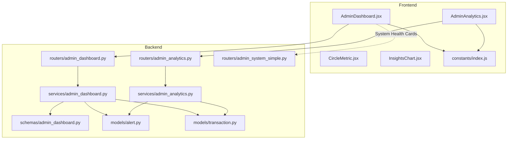
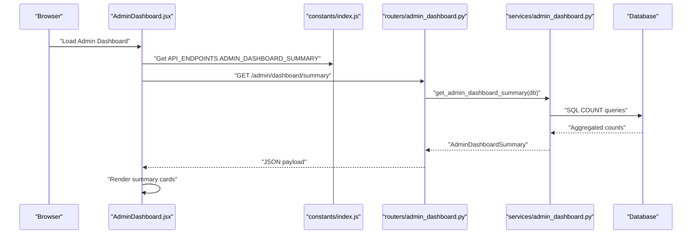
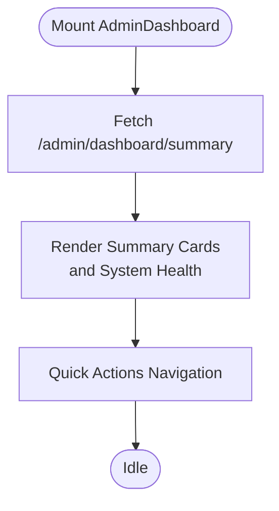
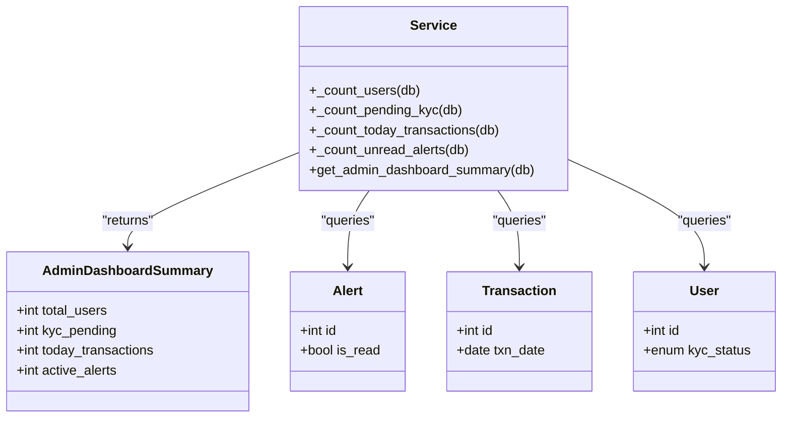
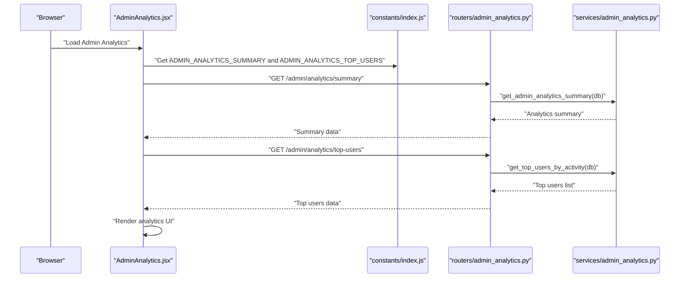
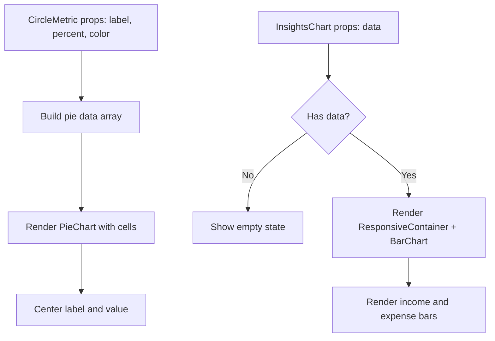
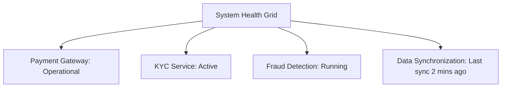
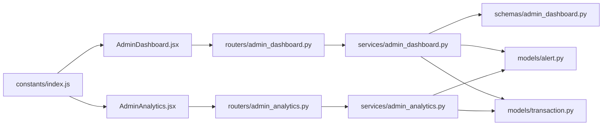

# Admin Dashboard

<cite>
**Referenced Files in This Document**
- [AdminDashboard.jsx](file://frontend/src/pages/admin/AdminDashboard.jsx)
- [admin_dashboard.py](file://backend/app/routers/admin_dashboard.py)
- [admin_dashboard.py](file://backend/app/services/admin_dashboard.py)
- [admin_dashboard.py](file://backend/app/schemas/admin_dashboard.py)
- [index.js](file://frontend/src/constants/index.js)
- [admin_analytics.py](file://backend/app/routers/admin_analytics.py)
- [admin_analytics.py](file://backend/app/services/admin_analytics.py)
- [AdminAnalytics.jsx](file://frontend/src/pages/admin/AdminAnalytics.jsx)
- [CircleMetric.jsx](file://frontend/src/components/user/dashboard/CircleMetric.jsx)
- [InsightsChart.jsx](file://frontend/src/components/user/dashboard/InsightsChart.jsx)
- [alert.py](file://backend/app/models/alert.py)
- [transaction.py](file://backend/app/models/transaction.py)
- [admin_system_simple.py](file://backend/app/routers/admin_system_simple.py)
</cite>

## Table of Contents
1. [Introduction](#introduction)
2. [Project Structure](#project-structure)
3. [Core Components](#core-components)
4. [Architecture Overview](#architecture-overview)
5. [Detailed Component Analysis](#detailed-component-analysis)
6. [Dependency Analysis](#dependency-analysis)
7. [Performance Considerations](#performance-considerations)
8. [Troubleshooting Guide](#troubleshooting-guide)
9. [Conclusion](#conclusion)

## Introduction
This document describes the admin dashboard functionality for the Modern Digital Banking Dashboard. It covers the overview screen that presents system metrics, user statistics, transaction volumes, and financial summaries. It also documents real-time monitoring capabilities, system health indicators, administrative quick actions, and the dashboard layout with metric cards, charts, and KPI displays. Configuration options for dashboard widgets, data refresh intervals, and customizations are explained, along with performance optimization and data visualization components.

## Project Structure
The admin dashboard spans frontend React components and backend FastAPI endpoints. The frontend renders the overview page, while the backend exposes endpoints to compute and return aggregated metrics. Additional analytics and visualization components exist for broader insights.

**Diagram sources**
- [AdminDashboard.jsx:19-173](file://frontend/src/pages/admin/AdminDashboard.jsx#L19-L173)
- [AdminAnalytics.jsx:13-368](file://frontend/src/pages/admin/AdminAnalytics.jsx#L13-L368)
- [admin_dashboard.py:1-14](file://backend/app/routers/admin_dashboard.py#L1-L14)
- [admin_dashboard.py:1-42](file://backend/app/services/admin_dashboard.py#L1-L42)
- [admin_dashboard.py:1-8](file://backend/app/schemas/admin_dashboard.py#L1-L8)
- [admin_analytics.py:1-21](file://backend/app/routers/admin_analytics.py#L1-L21)
- [admin_analytics.py:1-60](file://backend/app/services/admin_analytics.py#L1-L60)
- [index.js:64-132](file://frontend/src/constants/index.js#L64-L132)
- [alert.py:17-34](file://backend/app/models/alert.py#L17-L34)
- [transaction.py:32-58](file://backend/app/models/transaction.py#L32-L58)
- [admin_system_simple.py:1-48](file://backend/app/routers/admin_system_simple.py#L1-L48)

**Section sources**
- [AdminDashboard.jsx:19-173](file://frontend/src/pages/admin/AdminDashboard.jsx#L19-L173)
- [admin_dashboard.py:1-14](file://backend/app/routers/admin_dashboard.py#L1-L14)
- [admin_dashboard.py:1-42](file://backend/app/services/admin_dashboard.py#L1-L42)
- [index.js:64-132](file://frontend/src/constants/index.js#L64-L132)

## Core Components
- Admin Dashboard Overview Page: Renders summary cards for total users, pending KYC, today’s transactions, and active alerts. Includes quick action cards and system health indicators.
- Backend Summary Endpoint: Computes and returns the dashboard summary via SQL queries.
- Analytics Page: Provides expanded KPIs, KYC status overview, transaction overview, and top users by activity.
- Visualization Components: Recharts-based components for percentage-based metrics and income vs expense charts.
- System Health Indicators: Static health cards representing operational status of key systems.

**Section sources**
- [AdminDashboard.jsx:19-173](file://frontend/src/pages/admin/AdminDashboard.jsx#L19-L173)
- [admin_dashboard.py:35-42](file://backend/app/services/admin_dashboard.py#L35-L42)
- [AdminAnalytics.jsx:13-368](file://frontend/src/pages/admin/AdminAnalytics.jsx#L13-L368)
- [CircleMetric.jsx:9-53](file://frontend/src/components/user/dashboard/CircleMetric.jsx#L9-L53)
- [InsightsChart.jsx:10-47](file://frontend/src/components/user/dashboard/InsightsChart.jsx#L10-L47)

## Architecture Overview
The admin dashboard follows a client-server pattern:
- Frontend requests dashboard summary from the backend.
- Backend aggregates counts from the database using SQLAlchemy.
- Frontend renders summary cards and system health indicators.
- Additional analytics endpoints provide expanded insights.

**Diagram sources**
- [AdminDashboard.jsx:27-34](file://frontend/src/pages/admin/AdminDashboard.jsx#L27-L34)
- [index.js:120](file://frontend/src/constants/index.js#L120)
- [admin_dashboard.py:11-13](file://backend/app/routers/admin_dashboard.py#L11-L13)
- [admin_dashboard.py:35-42](file://backend/app/services/admin_dashboard.py#L35-L42)

## Detailed Component Analysis

### Admin Dashboard Overview Page
- Layout: Header, summary cards grid, quick actions grid, and system health grid.
- Summary Metrics:
  - Total Users: Count of all users.
  - KYC Pending: Count of users with unverified KYC.
  - Today’s Transactions: Count of transactions for the current date.
  - Active Alerts: Count of unread alerts.
- Quick Actions: Navigate to KYC review, users, transactions, and alerts.
- System Health: Operational status cards for payment gateway, KYC service, fraud detection, and data synchronization.

**Diagram sources**
- [AdminDashboard.jsx:23-34](file://frontend/src/pages/admin/AdminDashboard.jsx#L23-L34)
- [AdminDashboard.jsx:56-170](file://frontend/src/pages/admin/AdminDashboard.jsx#L56-L170)

**Section sources**
- [AdminDashboard.jsx:19-173](file://frontend/src/pages/admin/AdminDashboard.jsx#L19-L173)

### Backend Summary Service
- Counts are computed using SQLAlchemy functions:
  - Total users: COUNT of User ids.
  - KYC pending: COUNT of User ids where KYC status is unverified.
  - Today’s transactions: COUNT of Transaction ids where transaction date equals today.
  - Active alerts: COUNT of Alert ids where unread flag is false.
- Response model defines the shape of the summary payload.

**Diagram sources**
- [admin_dashboard.py:3-8](file://backend/app/schemas/admin_dashboard.py#L3-L8)
- [admin_dashboard.py:11-42](file://backend/app/services/admin_dashboard.py#L11-L42)
- [alert.py:17-34](file://backend/app/models/alert.py#L17-L34)
- [transaction.py:32-58](file://backend/app/models/transaction.py#L32-L58)

**Section sources**
- [admin_dashboard.py:35-42](file://backend/app/services/admin_dashboard.py#L35-L42)
- [admin_dashboard.py:11-42](file://backend/app/services/admin_dashboard.py#L11-L42)
- [admin_dashboard.py:3-8](file://backend/app/schemas/admin_dashboard.py#L3-L8)

### Admin Analytics Page
- Purpose: Expanded system-wide insights and compliance overview.
- KPI Cards: Total users, KYC approved/pending/rejected, total transactions, rewards issued.
- KYC Overview: Status rows for approved, pending, and rejected counts.
- Transaction Overview: Displays total transactions and average per user.
- Top Users Table: Lists top users by transaction count and total amount, with KYC status badges.
- Responsive Design: Adapts grid and typography based on screen width.

**Diagram sources**
- [AdminAnalytics.jsx:43-59](file://frontend/src/pages/admin/AdminAnalytics.jsx#L43-L59)
- [index.js:127-131](file://frontend/src/constants/index.js#L127-L131)
- [admin_analytics.py:13-20](file://backend/app/routers/admin_analytics.py#L13-L20)
- [admin_analytics.py:25-59](file://backend/app/services/admin_analytics.py#L25-L59)

**Section sources**
- [AdminAnalytics.jsx:13-368](file://frontend/src/pages/admin/AdminAnalytics.jsx#L13-L368)
- [admin_analytics.py:25-59](file://backend/app/services/admin_analytics.py#L25-L59)

### Data Visualization Components
- CircleMetric: Renders a percentage-based financial metric using a pie chart with animated hover effects.
- InsightsChart: Displays income vs expense over the last 15 days using Recharts bar charts with tooltips and responsive container.

**Diagram sources**
- [CircleMetric.jsx:9-53](file://frontend/src/components/user/dashboard/CircleMetric.jsx#L9-L53)
- [InsightsChart.jsx:10-47](file://frontend/src/components/user/dashboard/InsightsChart.jsx#L10-L47)

**Section sources**
- [CircleMetric.jsx:9-53](file://frontend/src/components/user/dashboard/CircleMetric.jsx#L9-L53)
- [InsightsChart.jsx:10-47](file://frontend/src/components/user/dashboard/InsightsChart.jsx#L10-L47)

### System Health Indicators
- The overview page includes four system health cards with status badges and colored dots indicating operational state.
- These cards present static status messages for payment gateway, KYC service, fraud detection, and data synchronization.

**Diagram sources**
- [AdminDashboard.jsx:141-170](file://frontend/src/pages/admin/AdminDashboard.jsx#L141-L170)

**Section sources**
- [AdminDashboard.jsx:141-170](file://frontend/src/pages/admin/AdminDashboard.jsx#L141-L170)

## Dependency Analysis
- Frontend depends on centralized constants for API endpoint definitions.
- Admin dashboard route depends on the summary service, which in turn depends on Alert and Transaction models for counts.
- Analytics route depends on analytics service, which also uses Alert and Transaction models.
- System health indicators are rendered statically in the overview page.

**Diagram sources**
- [index.js:120](file://frontend/src/constants/index.js#L120)
- [admin_dashboard.py:11-13](file://backend/app/routers/admin_dashboard.py#L11-L13)
- [admin_analytics.py:13-20](file://backend/app/routers/admin_analytics.py#L13-L20)
- [admin_dashboard.py:35-42](file://backend/app/services/admin_dashboard.py#L35-L42)
- [admin_analytics.py:25-59](file://backend/app/services/admin_analytics.py#L25-L59)
- [alert.py:17-34](file://backend/app/models/alert.py#L17-L34)
- [transaction.py:32-58](file://backend/app/models/transaction.py#L32-L58)

**Section sources**
- [index.js:64-132](file://frontend/src/constants/index.js#L64-L132)
- [admin_dashboard.py:11-42](file://backend/app/services/admin_dashboard.py#L11-L42)
- [admin_analytics.py:13-59](file://backend/app/services/admin_analytics.py#L13-L59)

## Performance Considerations
- Data Aggregation: The backend computes counts using single SQL queries per metric, minimizing joins and leveraging database indexing on date and boolean fields.
- Rendering: The overview page uses lightweight cards and static health indicators, reducing layout thrashing.
- Visualization: Recharts components are efficient for small datasets; avoid rendering large datasets in overview cards.
- Network Requests: The dashboard makes a single request for summary data; analytics page makes two requests for summary and top users.
- Caching: Consider adding caching for frequently accessed summary endpoints if traffic is high.
- Pagination: Top users lists should be paginated in future enhancements to reduce payload sizes.
- Lazy Loading: Defer heavy analytics charts until the analytics page is mounted.

## Troubleshooting Guide
- Dashboard Load Errors: The overview page logs errors during summary fetch; verify backend endpoint availability and network connectivity.
- Empty Analytics: Analytics page shows a loading state and handles empty top users lists gracefully.
- Database Connectivity: Ensure database is reachable and tables for users, transactions, and alerts exist.
- Timezone and Date Filtering: Transaction counts depend on accurate date filtering; confirm server timezone alignment.

**Section sources**
- [AdminDashboard.jsx:31-33](file://frontend/src/pages/admin/AdminDashboard.jsx#L31-L33)
- [AdminAnalytics.jsx:54-58](file://frontend/src/pages/admin/AdminAnalytics.jsx#L54-L58)

## Conclusion
The admin dashboard provides a concise overview of system health, user statistics, transaction volumes, and alert status. Its backend service efficiently aggregates metrics using focused SQL queries, while the frontend delivers a responsive, card-based interface with quick navigation and health indicators. The analytics page extends visibility with expanded KPIs and top users insights. Future enhancements can include configurable widget layouts, customizable refresh intervals, and deeper real-time monitoring integrations.