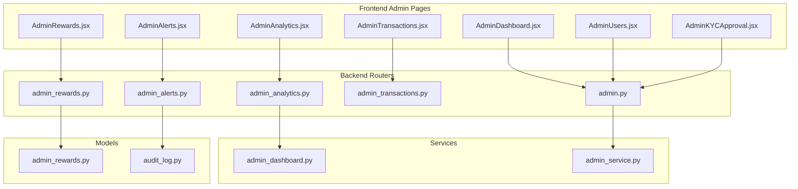
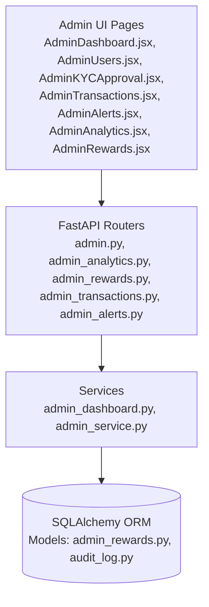
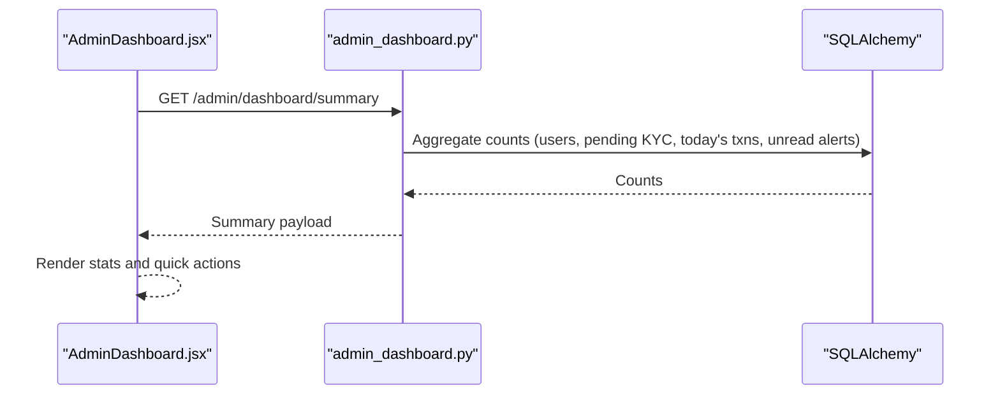
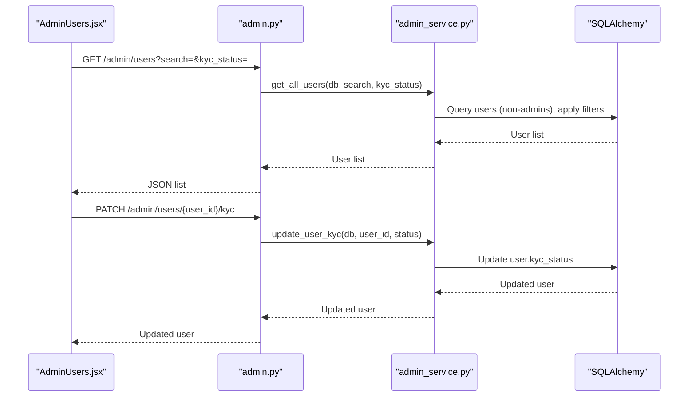
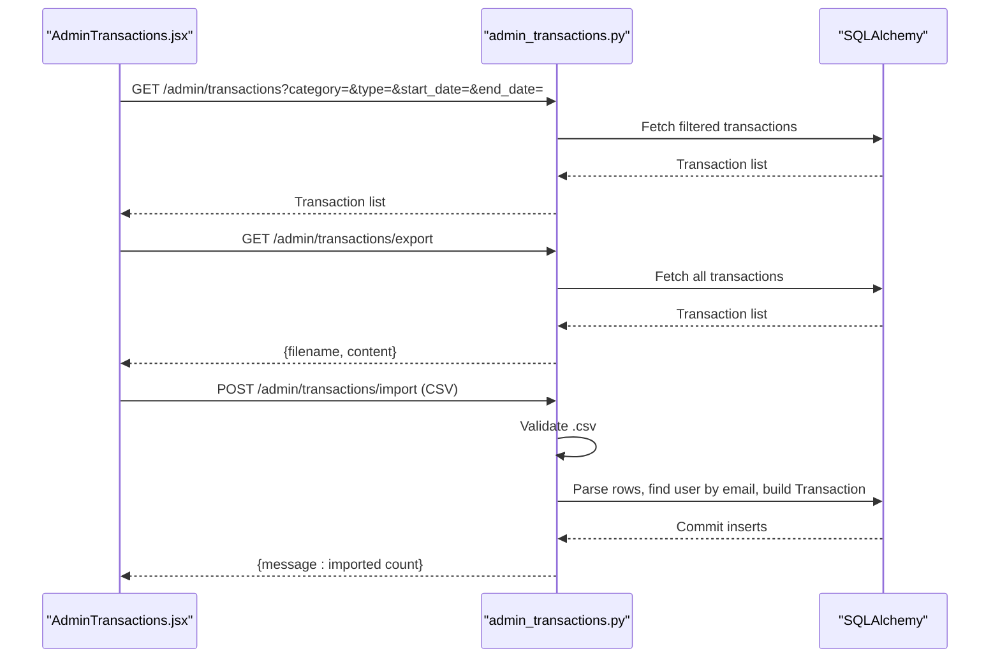
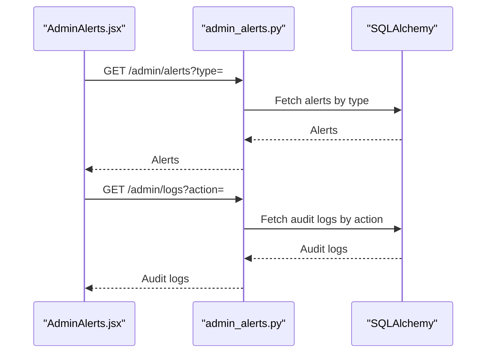
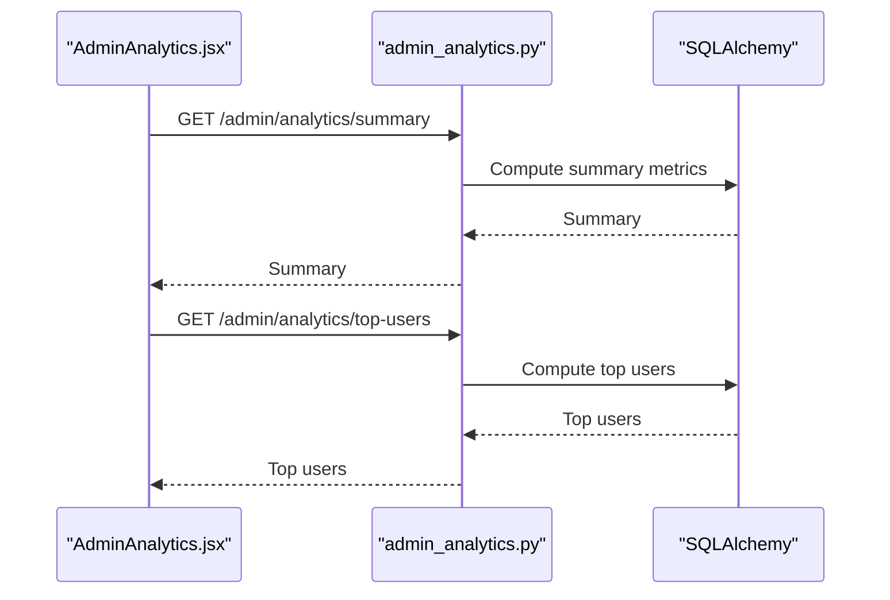
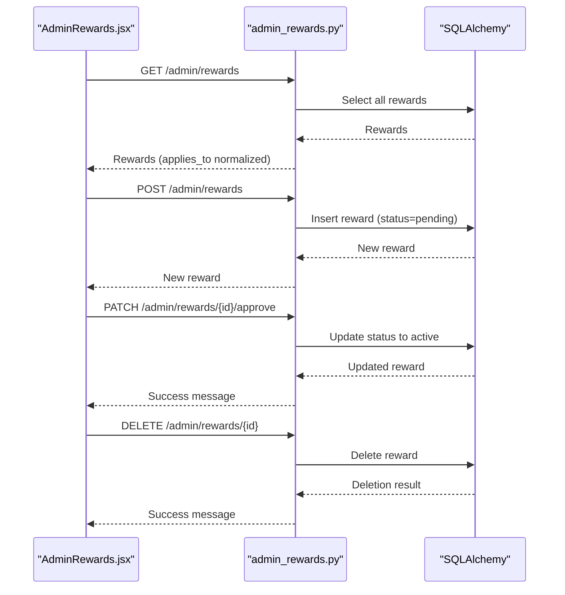
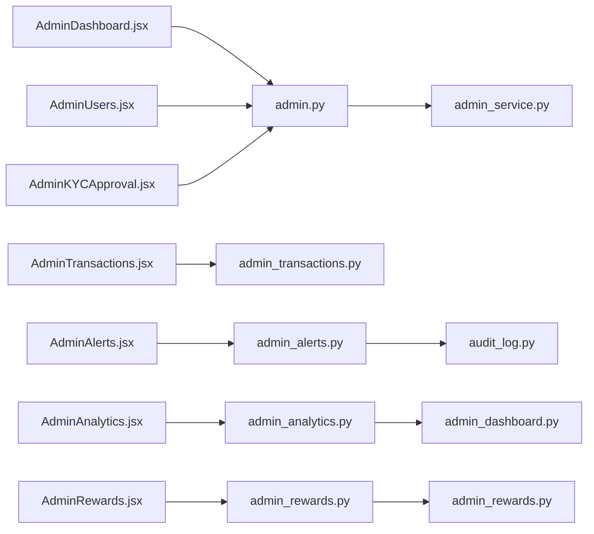

# Admin Features

<cite>
**Referenced Files in This Document**
- [backend/app/routers/admin.py](file://backend/app/routers/admin.py)
- [backend/app/schemas/admin.py](file://backend/app/schemas/admin.py)
- [backend/app/services/admin_service.py](file://backend/app/services/admin_service.py)
- [backend/app/routers/admin_analytics.py](file://backend/app/routers/admin_analytics.py)
- [backend/app/routers/admin_rewards.py](file://backend/app/routers/admin_rewards.py)
- [backend/app/routers/admin_transactions.py](file://backend/app/routers/admin_transactions.py)
- [backend/app/routers/admin_alerts.py](file://backend/app/routers/admin_alerts.py)
- [backend/app/models/admin_rewards.py](file://backend/app/models/admin_rewards.py)
- [backend/app/models/audit_log.py](file://backend/app/models/audit_log.py)
- [backend/app/services/admin_dashboard.py](file://backend/app/services/admin_dashboard.py)
- [backend/app/schemas/admin_rewards.py](file://backend/app/schemas/admin_rewards.py)
- [frontend/src/pages/admin/AdminDashboard.jsx](file://frontend/src/pages/admin/AdminDashboard.jsx)
- [frontend/src/pages/admin/AdminUsers.jsx](file://frontend/src/pages/admin/AdminUsers.jsx)
- [frontend/src/pages/admin/AdminKYCApproval.jsx](file://frontend/src/pages/admin/AdminKYCApproval.jsx)
- [frontend/src/pages/admin/AdminTransactions.jsx](file://frontend/src/pages/admin/AdminTransactions.jsx)
- [frontend/src/pages/admin/AdminAlerts.jsx](file://frontend/src/pages/admin/AdminAlerts.jsx)
- [frontend/src/pages/admin/AdminAnalytics.jsx](file://frontend/src/pages/admin/AdminAnalytics.jsx)
- [frontend/src/pages/admin/AdminRewards.jsx](file://frontend/src/pages/admin/AdminRewards.jsx)
</cite>

## Table of Contents
1. [Introduction](#introduction)
2. [Project Structure](#project-structure)
3. [Core Components](#core-components)
4. [Architecture Overview](#architecture-overview)
5. [Detailed Component Analysis](#detailed-component-analysis)
6. [Dependency Analysis](#dependency-analysis)
7. [Performance Considerations](#performance-considerations)
8. [Troubleshooting Guide](#troubleshooting-guide)
9. [Conclusion](#conclusion)
10. [Appendices](#appendices)

## Introduction
This document describes the administrative features of the banking dashboard, focusing on the admin portal’s capabilities for user management, KYC approvals, transaction monitoring, rewards administration, analytics reporting, and system controls. It also covers admin role permissions, audit logging, system monitoring tools, administrative workflows, interface components, data visualization, reporting capabilities, and security considerations.

## Project Structure
The admin functionality spans both frontend and backend:
- Frontend admin pages implement dashboards, user management, KYC review, transaction monitoring, alerts/logs, analytics, and rewards administration.
- Backend exposes REST endpoints via routers, enforces admin-only access, and implements services for data retrieval and mutations.

**Diagram sources**
- [frontend/src/pages/admin/AdminDashboard.jsx](file://frontend/src/pages/admin/AdminDashboard.jsx)
- [frontend/src/pages/admin/AdminUsers.jsx](file://frontend/src/pages/admin/AdminUsers.jsx)
- [frontend/src/pages/admin/AdminKYCApproval.jsx](file://frontend/src/pages/admin/AdminKYCApproval.jsx)
- [frontend/src/pages/admin/AdminTransactions.jsx](file://frontend/src/pages/admin/AdminTransactions.jsx)
- [frontend/src/pages/admin/AdminAlerts.jsx](file://frontend/src/pages/admin/AdminAlerts.jsx)
- [frontend/src/pages/admin/AdminAnalytics.jsx](file://frontend/src/pages/admin/AdminAnalytics.jsx)
- [frontend/src/pages/admin/AdminRewards.jsx](file://frontend/src/pages/admin/AdminRewards.jsx)
- [backend/app/routers/admin.py](file://backend/app/routers/admin.py)
- [backend/app/routers/admin_analytics.py](file://backend/app/routers/admin_analytics.py)
- [backend/app/routers/admin_rewards.py](file://backend/app/routers/admin_rewards.py)
- [backend/app/routers/admin_transactions.py](file://backend/app/routers/admin_transactions.py)
- [backend/app/routers/admin_alerts.py](file://backend/app/routers/admin_alerts.py)
- [backend/app/services/admin_dashboard.py](file://backend/app/services/admin_dashboard.py)
- [backend/app/services/admin_service.py](file://backend/app/services/admin_service.py)
- [backend/app/models/admin_rewards.py](file://backend/app/models/admin_rewards.py)
- [backend/app/models/audit_log.py](file://backend/app/models/audit_log.py)

**Section sources**
- [backend/app/routers/admin.py:1-45](file://backend/app/routers/admin.py#L1-L45)
- [backend/app/routers/admin_analytics.py:1-21](file://backend/app/routers/admin_analytics.py#L1-L21)
- [backend/app/routers/admin_rewards.py:1-68](file://backend/app/routers/admin_rewards.py#L1-L68)
- [backend/app/routers/admin_transactions.py:1-111](file://backend/app/routers/admin_transactions.py#L1-L111)
- [backend/app/routers/admin_alerts.py:1-24](file://backend/app/routers/admin_alerts.py#L1-L24)
- [frontend/src/pages/admin/AdminDashboard.jsx:1-259](file://frontend/src/pages/admin/AdminDashboard.jsx#L1-L259)
- [frontend/src/pages/admin/AdminUsers.jsx:1-256](file://frontend/src/pages/admin/AdminUsers.jsx#L1-L256)
- [frontend/src/pages/admin/AdminKYCApproval.jsx:1-657](file://frontend/src/pages/admin/AdminKYCApproval.jsx#L1-L657)
- [frontend/src/pages/admin/AdminTransactions.jsx:1-707](file://frontend/src/pages/admin/AdminTransactions.jsx#L1-L707)
- [frontend/src/pages/admin/AdminAlerts.jsx:1-610](file://frontend/src/pages/admin/AdminAlerts.jsx#L1-L610)
- [frontend/src/pages/admin/AdminAnalytics.jsx:1-429](file://frontend/src/pages/admin/AdminAnalytics.jsx#L1-L429)
- [frontend/src/pages/admin/AdminRewards.jsx:1-642](file://frontend/src/pages/admin/AdminRewards.jsx#L1-L642)

## Core Components
- Admin dashboard overview: renders summary metrics and quick actions.
- User management: list users, filter by search and KYC status, update KYC status.
- KYC approval: review and approve/reject user identity submissions.
- Transaction monitoring: view, filter, export/import transactions.
- Alerts and logs: view system alerts and audit logs with filters.
- Analytics: system-wide KPIs and top users by activity.
- Rewards administration: create, approve, and remove rewards with approval workflow.

**Section sources**
- [backend/app/services/admin_dashboard.py:1-42](file://backend/app/services/admin_dashboard.py#L1-L42)
- [backend/app/services/admin_service.py:1-63](file://backend/app/services/admin_service.py#L1-L63)
- [backend/app/routers/admin.py:1-45](file://backend/app/routers/admin.py#L1-L45)
- [frontend/src/pages/admin/AdminDashboard.jsx:1-259](file://frontend/src/pages/admin/AdminDashboard.jsx#L1-L259)
- [frontend/src/pages/admin/AdminUsers.jsx:1-256](file://frontend/src/pages/admin/AdminUsers.jsx#L1-L256)
- [frontend/src/pages/admin/AdminKYCApproval.jsx:1-657](file://frontend/src/pages/admin/AdminKYCApproval.jsx#L1-L657)
- [frontend/src/pages/admin/AdminTransactions.jsx:1-707](file://frontend/src/pages/admin/AdminTransactions.jsx#L1-L707)
- [frontend/src/pages/admin/AdminAlerts.jsx:1-610](file://frontend/src/pages/admin/AdminAlerts.jsx#L1-L610)
- [frontend/src/pages/admin/AdminAnalytics.jsx:1-429](file://frontend/src/pages/admin/AdminAnalytics.jsx#L1-L429)
- [frontend/src/pages/admin/AdminRewards.jsx:1-642](file://frontend/src/pages/admin/AdminRewards.jsx#L1-L642)

## Architecture Overview
The admin feature set follows a layered architecture:
- Frontend admin pages consume REST endpoints exposed by backend routers.
- Routers depend on services for business logic and SQLAlchemy sessions for persistence.
- Models define admin-specific entities (e.g., rewards, audit logs).

**Diagram sources**
- [frontend/src/pages/admin/AdminDashboard.jsx](file://frontend/src/pages/admin/AdminDashboard.jsx)
- [frontend/src/pages/admin/AdminUsers.jsx](file://frontend/src/pages/admin/AdminUsers.jsx)
- [frontend/src/pages/admin/AdminKYCApproval.jsx](file://frontend/src/pages/admin/AdminKYCApproval.jsx)
- [frontend/src/pages/admin/AdminTransactions.jsx](file://frontend/src/pages/admin/AdminTransactions.jsx)
- [frontend/src/pages/admin/AdminAlerts.jsx](file://frontend/src/pages/admin/AdminAlerts.jsx)
- [frontend/src/pages/admin/AdminAnalytics.jsx](file://frontend/src/pages/admin/AdminAnalytics.jsx)
- [frontend/src/pages/admin/AdminRewards.jsx](file://frontend/src/pages/admin/AdminRewards.jsx)
- [backend/app/routers/admin.py](file://backend/app/routers/admin.py)
- [backend/app/routers/admin_analytics.py](file://backend/app/routers/admin_analytics.py)
- [backend/app/routers/admin_rewards.py](file://backend/app/routers/admin_rewards.py)
- [backend/app/routers/admin_transactions.py](file://backend/app/routers/admin_transactions.py)
- [backend/app/routers/admin_alerts.py](file://backend/app/routers/admin_alerts.py)
- [backend/app/services/admin_dashboard.py](file://backend/app/services/admin_dashboard.py)
- [backend/app/services/admin_service.py](file://backend/app/services/admin_service.py)
- [backend/app/models/admin_rewards.py](file://backend/app/models/admin_rewards.py)
- [backend/app/models/audit_log.py](file://backend/app/models/audit_log.py)

## Detailed Component Analysis

### Admin Dashboard
- Loads summary metrics (total users, pending KYC, today’s transactions, active alerts).
- Provides quick navigation to KYC, users, transactions, and alerts.
- System health cards indicate operational status of key services.

**Diagram sources**
- [frontend/src/pages/admin/AdminDashboard.jsx:27-34](file://frontend/src/pages/admin/AdminDashboard.jsx#L27-L34)
- [backend/app/services/admin_dashboard.py:35-41](file://backend/app/services/admin_dashboard.py#L35-L41)

**Section sources**
- [frontend/src/pages/admin/AdminDashboard.jsx:1-259](file://frontend/src/pages/admin/AdminDashboard.jsx#L1-L259)
- [backend/app/services/admin_dashboard.py:1-42](file://backend/app/services/admin_dashboard.py#L1-L42)

### User Management and KYC
- Admins can list users with optional search and KYC status filtering.
- Retrieve single user details.
- Update a user’s KYC status via PATCH.

**Diagram sources**
- [backend/app/routers/admin.py:14-44](file://backend/app/routers/admin.py#L14-L44)
- [backend/app/services/admin_service.py:38-62](file://backend/app/services/admin_service.py#L38-L62)
- [backend/app/schemas/admin.py:13-41](file://backend/app/schemas/admin.py#L13-L41)
- [frontend/src/pages/admin/AdminUsers.jsx:29-55](file://frontend/src/pages/admin/AdminUsers.jsx#L29-L55)

**Section sources**
- [backend/app/routers/admin.py:1-45](file://backend/app/routers/admin.py#L1-L45)
- [backend/app/services/admin_service.py:1-63](file://backend/app/services/admin_service.py#L1-L63)
- [backend/app/schemas/admin.py:1-41](file://backend/app/schemas/admin.py#L1-L41)
- [frontend/src/pages/admin/AdminUsers.jsx:1-256](file://frontend/src/pages/admin/AdminUsers.jsx#L1-L256)
- [frontend/src/pages/admin/AdminKYCApproval.jsx:1-657](file://frontend/src/pages/admin/AdminKYCApproval.jsx#L1-L657)

### Transaction Monitoring
- Admins can filter transactions by category, type, and date range.
- Export transactions to CSV.
- Import transactions from CSV (validated and parsed row-by-row).

**Diagram sources**
- [frontend/src/pages/admin/AdminTransactions.jsx:22-80](file://frontend/src/pages/admin/AdminTransactions.jsx#L22-L80)
- [backend/app/routers/admin_transactions.py:63-111](file://backend/app/routers/admin_transactions.py#L63-L111)

**Section sources**
- [frontend/src/pages/admin/AdminTransactions.jsx:1-707](file://frontend/src/pages/admin/AdminTransactions.jsx#L1-L707)
- [backend/app/routers/admin_transactions.py:1-111](file://backend/app/routers/admin_transactions.py#L1-L111)

### Alerts and Audit Logs
- Alerts: filter by type and list recent system alerts.
- Audit logs: filter by action type and list admin actions with targets and timestamps.

**Diagram sources**
- [frontend/src/pages/admin/AdminAlerts.jsx:36-62](file://frontend/src/pages/admin/AdminAlerts.jsx#L36-L62)
- [backend/app/routers/admin_alerts.py:10-23](file://backend/app/routers/admin_alerts.py#L10-L23)
- [backend/app/models/audit_log.py:6-18](file://backend/app/models/audit_log.py#L6-L18)

**Section sources**
- [frontend/src/pages/admin/AdminAlerts.jsx:1-610](file://frontend/src/pages/admin/AdminAlerts.jsx#L1-L610)
- [backend/app/routers/admin_alerts.py:1-24](file://backend/app/routers/admin_alerts.py#L1-L24)
- [backend/app/models/audit_log.py:1-19](file://backend/app/models/audit_log.py#L1-L19)

### Analytics Reporting
- Summary KPIs: total users, KYC statuses, total transactions, rewards issued.
- Top users by activity: transaction count and total amount.

**Diagram sources**
- [frontend/src/pages/admin/AdminAnalytics.jsx:43-59](file://frontend/src/pages/admin/AdminAnalytics.jsx#L43-L59)
- [backend/app/routers/admin_analytics.py:13-20](file://backend/app/routers/admin_analytics.py#L13-L20)
- [backend/app/services/admin_dashboard.py:11-41](file://backend/app/services/admin_dashboard.py#L11-L41)

**Section sources**
- [frontend/src/pages/admin/AdminAnalytics.jsx:1-429](file://frontend/src/pages/admin/AdminAnalytics.jsx#L1-L429)
- [backend/app/routers/admin_analytics.py:1-21](file://backend/app/routers/admin_analytics.py#L1-L21)
- [backend/app/services/admin_dashboard.py:1-42](file://backend/app/services/admin_dashboard.py#L1-L42)

### Rewards Administration
- List rewards with normalization of “applies_to” field.
- Create new rewards (status defaults to pending).
- Approve rewards (transition to active).
- Remove rewards.

**Diagram sources**
- [frontend/src/pages/admin/AdminRewards.jsx:37-97](file://frontend/src/pages/admin/AdminRewards.jsx#L37-L97)
- [backend/app/routers/admin_rewards.py:28-67](file://backend/app/routers/admin_rewards.py#L28-L67)
- [backend/app/models/admin_rewards.py:11-33](file://backend/app/models/admin_rewards.py#L11-L33)
- [backend/app/schemas/admin_rewards.py:6-26](file://backend/app/schemas/admin_rewards.py#L6-L26)

**Section sources**
- [frontend/src/pages/admin/AdminRewards.jsx:1-642](file://frontend/src/pages/admin/AdminRewards.jsx#L1-L642)
- [backend/app/routers/admin_rewards.py:1-68](file://backend/app/routers/admin_rewards.py#L1-L68)
- [backend/app/models/admin_rewards.py:1-33](file://backend/app/models/admin_rewards.py#L1-L33)
- [backend/app/schemas/admin_rewards.py:1-26](file://backend/app/schemas/admin_rewards.py#L1-L26)

## Dependency Analysis
- Frontend admin pages depend on shared API endpoints defined in backend routers.
- Routers depend on services for query/filter logic and mutation operations.
- Services depend on SQLAlchemy models and database sessions.
- Models encapsulate admin-specific entities (rewards, audit logs).

**Diagram sources**
- [frontend/src/pages/admin/AdminDashboard.jsx](file://frontend/src/pages/admin/AdminDashboard.jsx)
- [frontend/src/pages/admin/AdminUsers.jsx](file://frontend/src/pages/admin/AdminUsers.jsx)
- [frontend/src/pages/admin/AdminKYCApproval.jsx](file://frontend/src/pages/admin/AdminKYCApproval.jsx)
- [frontend/src/pages/admin/AdminTransactions.jsx](file://frontend/src/pages/admin/AdminTransactions.jsx)
- [frontend/src/pages/admin/AdminAlerts.jsx](file://frontend/src/pages/admin/AdminAlerts.jsx)
- [frontend/src/pages/admin/AdminAnalytics.jsx](file://frontend/src/pages/admin/AdminAnalytics.jsx)
- [frontend/src/pages/admin/AdminRewards.jsx](file://frontend/src/pages/admin/AdminRewards.jsx)
- [backend/app/routers/admin.py](file://backend/app/routers/admin.py)
- [backend/app/routers/admin_analytics.py](file://backend/app/routers/admin_analytics.py)
- [backend/app/routers/admin_rewards.py](file://backend/app/routers/admin_rewards.py)
- [backend/app/routers/admin_transactions.py](file://backend/app/routers/admin_transactions.py)
- [backend/app/routers/admin_alerts.py](file://backend/app/routers/admin_alerts.py)
- [backend/app/services/admin_service.py](file://backend/app/services/admin_service.py)
- [backend/app/services/admin_dashboard.py](file://backend/app/services/admin_dashboard.py)
- [backend/app/models/admin_rewards.py](file://backend/app/models/admin_rewards.py)
- [backend/app/models/audit_log.py](file://backend/app/models/audit_log.py)

**Section sources**
- [backend/app/routers/admin.py:1-45](file://backend/app/routers/admin.py#L1-L45)
- [backend/app/routers/admin_analytics.py:1-21](file://backend/app/routers/admin_analytics.py#L1-L21)
- [backend/app/routers/admin_rewards.py:1-68](file://backend/app/routers/admin_rewards.py#L1-L68)
- [backend/app/routers/admin_transactions.py:1-111](file://backend/app/routers/admin_transactions.py#L1-L111)
- [backend/app/routers/admin_alerts.py:1-24](file://backend/app/routers/admin_alerts.py#L1-L24)
- [backend/app/services/admin_service.py:1-63](file://backend/app/services/admin_service.py#L1-L63)
- [backend/app/services/admin_dashboard.py:1-42](file://backend/app/services/admin_dashboard.py#L1-L42)
- [backend/app/models/admin_rewards.py:1-33](file://backend/app/models/admin_rewards.py#L1-L33)
- [backend/app/models/audit_log.py:1-19](file://backend/app/models/audit_log.py#L1-L19)

## Performance Considerations
- Filtering and pagination: Prefer server-side filtering (already present) and consider adding pagination for large datasets (users, transactions, logs).
- Aggregation queries: Dashboard summaries rely on COUNT queries; ensure appropriate indexing on frequently filtered columns (e.g., KYC status, creation date).
- CSV import/export: Batch commits and streaming for large files to reduce memory usage.
- Caching: Cache static dashboards metrics periodically to reduce repeated aggregation workloads.

## Troubleshooting Guide
- User not found errors: The admin service raises explicit 404 when a user does not exist; ensure user IDs are valid before updates.
- CSV import validation: Only .csv files are accepted; malformed rows are skipped to avoid partial failures.
- KYC status updates: Ensure the status values match expected enums on the backend; frontend maps UI statuses to backend values.

**Section sources**
- [backend/app/services/admin_service.py:31-35](file://backend/app/services/admin_service.py#L31-L35)
- [backend/app/routers/admin_transactions.py:20-22](file://backend/app/routers/admin_transactions.py#L20-L22)
- [frontend/src/pages/admin/AdminKYCApproval.jsx:52-63](file://frontend/src/pages/admin/AdminKYCApproval.jsx#L52-L63)

## Conclusion
The admin features provide a comprehensive toolkit for monitoring and governing the banking platform. The frontend offers intuitive dashboards and filtering, while the backend enforces admin-only access and implements robust services for user management, KYC approvals, transaction oversight, alerts/logs, analytics, and rewards administration. Security and auditability are addressed through explicit admin routing and audit log models.

## Appendices

### Admin Role Permissions and Access Control
- Admin-only routes: Routers in the backend enforce admin access for all admin endpoints.
- Example enforcement: The admin router depends on a current admin user dependency for all endpoints.

**Section sources**
- [backend/app/routers/admin.py:7-19](file://backend/app/routers/admin.py#L7-L19)
- [backend/app/routers/admin_analytics.py:1-10](file://backend/app/routers/admin_analytics.py#L1-L10)
- [backend/app/routers/admin_rewards.py:1-13](file://backend/app/routers/admin_rewards.py#L1-L13)
- [backend/app/routers/admin_transactions.py:1-14](file://backend/app/routers/admin_transactions.py#L1-L14)
- [backend/app/routers/admin_alerts.py:1-7](file://backend/app/routers/admin_alerts.py#L1-L7)

### Audit Logging Model
- Tracks admin actions with target type/id and details, timestamped.

**Section sources**
- [backend/app/models/audit_log.py:1-19](file://backend/app/models/audit_log.py#L1-L19)

### Data Models for Admin Entities
- Admin rewards model defines reward metadata, type, applicability, and status.
- Admin analytics service aggregates system KPIs.

**Section sources**
- [backend/app/models/admin_rewards.py:1-33](file://backend/app/models/admin_rewards.py#L1-L33)
- [backend/app/services/admin_dashboard.py:1-42](file://backend/app/services/admin_dashboard.py#L1-L42)