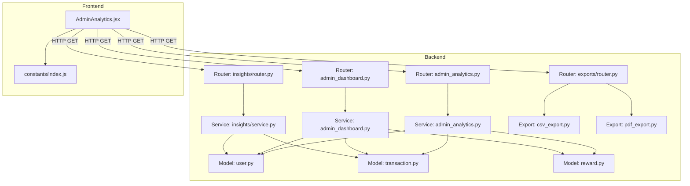
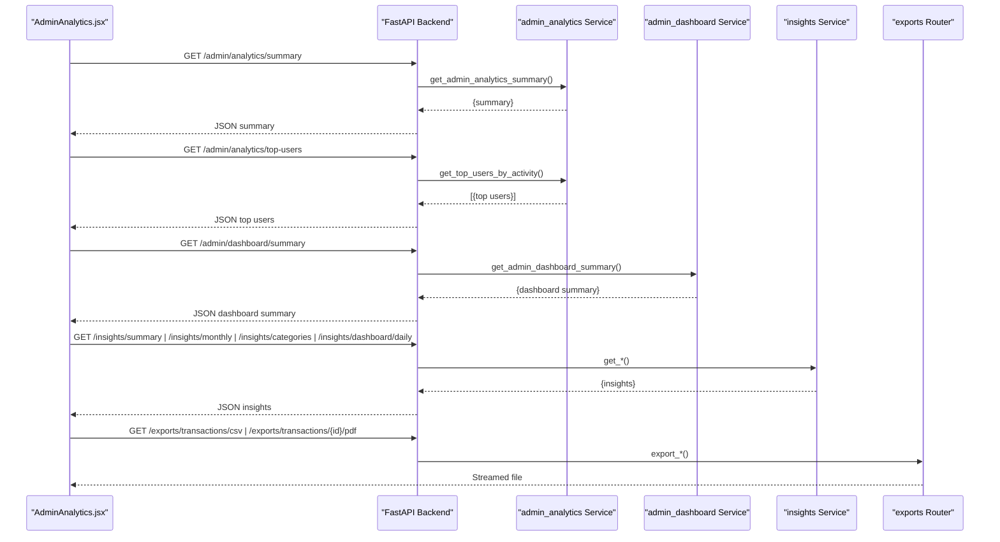
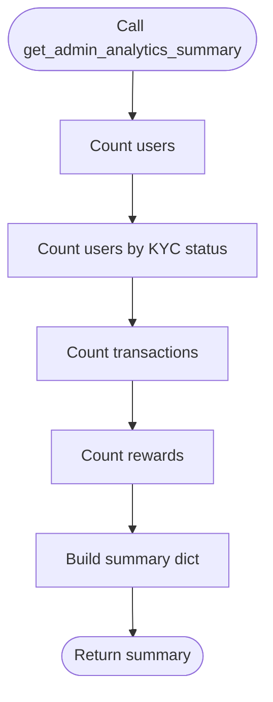
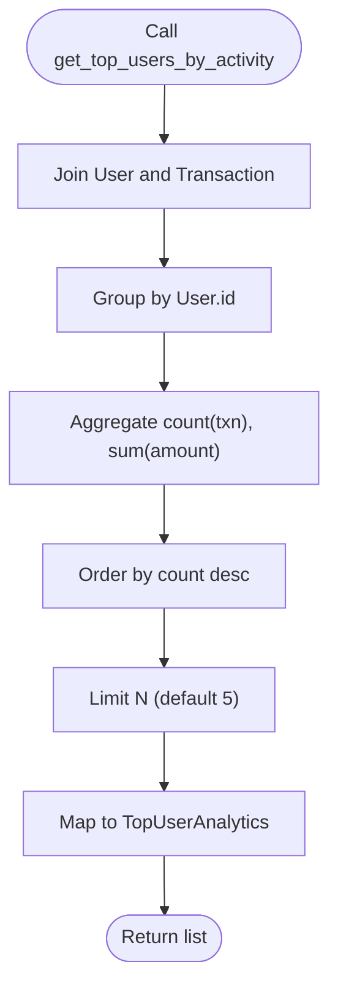
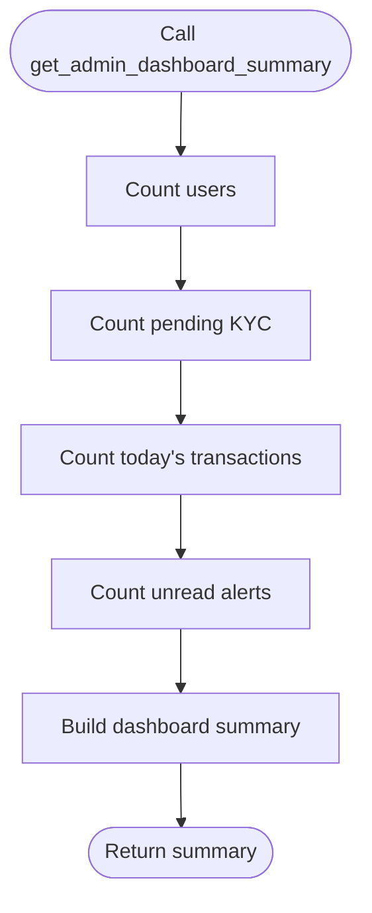
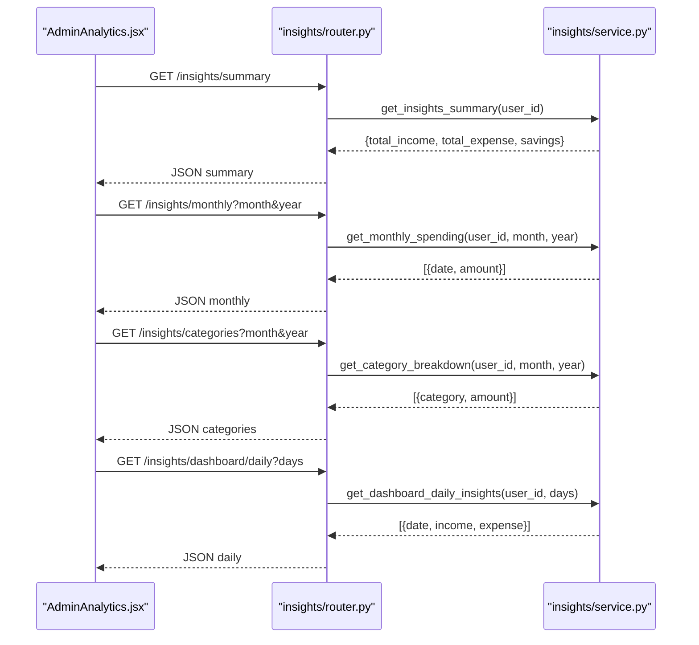
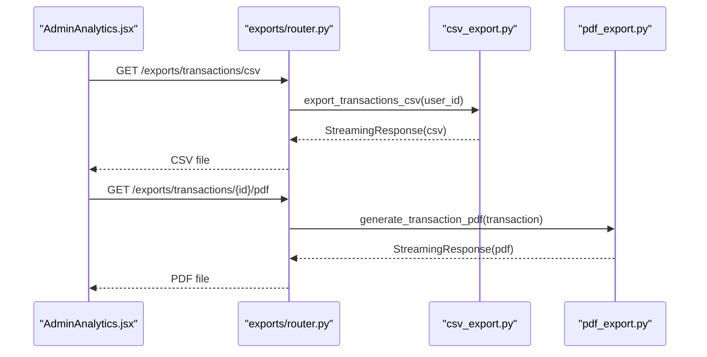
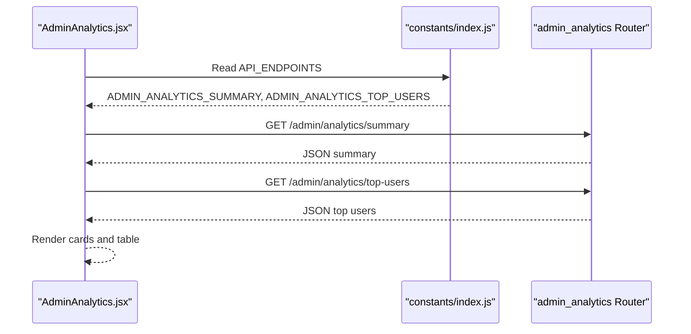
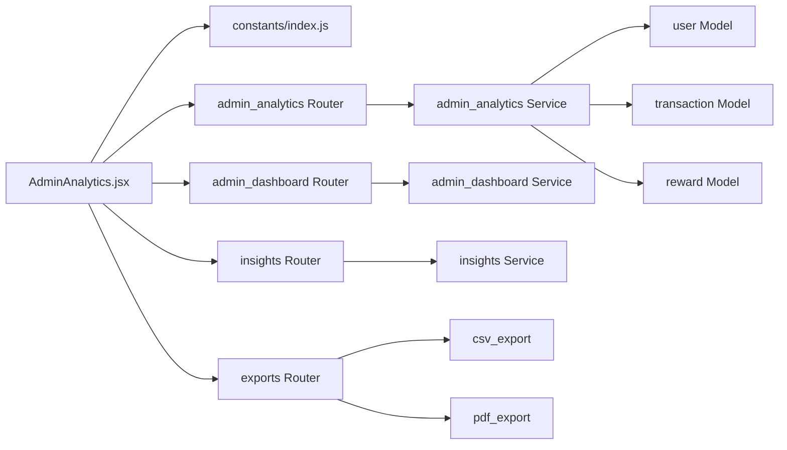

# Analytics & Reporting

<cite>
**Referenced Files in This Document**
- [backend/app/routers/admin_analytics.py](file://backend/app/routers/admin_analytics.py)
- [backend/app/services/admin_analytics.py](file://backend/app/services/admin_analytics.py)
- [backend/app/schemas/admin_analytics.py](file://backend/app/schemas/admin_analytics.py)
- [backend/app/models/user.py](file://backend/app/models/user.py)
- [backend/app/models/transaction.py](file://backend/app/models/transaction.py)
- [backend/app/models/reward.py](file://backend/app/models/reward.py)
- [backend/app/routers/admin_dashboard.py](file://backend/app/routers/admin_dashboard.py)
- [backend/app/services/admin_dashboard.py](file://backend/app/services/admin_dashboard.py)
- [backend/app/insights/router.py](file://backend/app/insights/router.py)
- [backend/app/insights/service.py](file://backend/app/insights/service.py)
- [backend/app/insights/schemas.py](file://backend/app/insights/schemas.py)
- [backend/app/exports/router.py](file://backend/app/exports/router.py)
- [backend/app/exports/csv_export.py](file://backend/app/exports/csv_export.py)
- [backend/app/exports/pdf_export.py](file://backend/app/exports/pdf_export.py)
- [frontend/src/pages/admin/AdminAnalytics.jsx](file://frontend/src/pages/admin/AdminAnalytics.jsx)
- [frontend/src/constants/index.js](file://frontend/src/constants/index.js)
</cite>

## Table of Contents
1. [Introduction](#introduction)
2. [Project Structure](#project-structure)
3. [Core Components](#core-components)
4. [Architecture Overview](#architecture-overview)
5. [Detailed Component Analysis](#detailed-component-analysis)
6. [Dependency Analysis](#dependency-analysis)
7. [Performance Considerations](#performance-considerations)
8. [Troubleshooting Guide](#troubleshooting-guide)
9. [Conclusion](#conclusion)
10. [Appendices](#appendices)

## Introduction
This document explains the admin analytics and reporting capabilities of the Modern Digital Banking Dashboard. It covers usage statistics, financial metrics, user engagement reports, and system performance analytics. It documents report generation, data export options, and the current state of customizable dashboard widgets. It also explains analytics data sources, aggregation methods, reporting frequency, and how to leverage trend analysis and comparative reporting for administrative decision-making.

## Project Structure
The analytics and reporting features span backend routers and services, data models, and frontend pages. The backend exposes admin analytics endpoints and integrates with user, transaction, and reward models. The frontend renders summaries, top-user activity, and provides export capabilities.

**Diagram sources**
- [backend/app/routers/admin_analytics.py:1-21](file://backend/app/routers/admin_analytics.py#L1-L21)
- [backend/app/services/admin_analytics.py:1-60](file://backend/app/services/admin_analytics.py#L1-L60)
- [backend/app/routers/admin_dashboard.py:1-14](file://backend/app/routers/admin_dashboard.py#L1-L14)
- [backend/app/services/admin_dashboard.py:1-42](file://backend/app/services/admin_dashboard.py#L1-L42)
- [backend/app/insights/router.py:1-52](file://backend/app/insights/router.py#L1-L52)
- [backend/app/insights/service.py:1-148](file://backend/app/insights/service.py#L1-L148)
- [backend/app/exports/router.py:1-51](file://backend/app/exports/router.py#L1-L51)
- [backend/app/exports/csv_export.py:1-65](file://backend/app/exports/csv_export.py#L1-L65)
- [backend/app/exports/pdf_export.py:1-72](file://backend/app/exports/pdf_export.py#L1-L72)
- [frontend/src/pages/admin/AdminAnalytics.jsx:1-429](file://frontend/src/pages/admin/AdminAnalytics.jsx#L1-L429)
- [frontend/src/constants/index.js:127-128](file://frontend/src/constants/index.js#L127-L128)

**Section sources**
- [backend/app/routers/admin_analytics.py:1-21](file://backend/app/routers/admin_analytics.py#L1-L21)
- [backend/app/services/admin_analytics.py:1-60](file://backend/app/services/admin_analytics.py#L1-L60)
- [frontend/src/pages/admin/AdminAnalytics.jsx:1-429](file://frontend/src/pages/admin/AdminAnalytics.jsx#L1-L429)

## Core Components
- Admin Analytics Summary: Provides system-wide counts for total users, KYC statuses, total transactions, and rewards issued.
- Top Users by Activity: Returns top users ranked by transaction count and total transaction amount.
- Admin Dashboard Summary: Provides daily operational KPIs such as pending KYC, today’s transactions, and unread alerts.
- User Insights: Per-user financial summaries, monthly spending, category breakdowns, and daily dashboard insights.
- Data Exports: CSV export of user transactions and PDF receipts for individual transactions.

**Section sources**
- [backend/app/services/admin_analytics.py:25-33](file://backend/app/services/admin_analytics.py#L25-L33)
- [backend/app/services/admin_analytics.py:36-59](file://backend/app/services/admin_analytics.py#L36-L59)
- [backend/app/services/admin_dashboard.py:35-41](file://backend/app/services/admin_dashboard.py#L35-L41)
- [backend/app/insights/service.py:71-94](file://backend/app/insights/service.py#L71-L94)
- [backend/app/insights/service.py:97-109](file://backend/app/insights/service.py#L97-L109)
- [backend/app/insights/service.py:112-129](file://backend/app/insights/service.py#L112-L129)
- [backend/app/insights/service.py:132-147](file://backend/app/insights/service.py#L132-L147)
- [backend/app/exports/csv_export.py:22-64](file://backend/app/exports/csv_export.py#L22-L64)
- [backend/app/exports/pdf_export.py:24-71](file://backend/app/exports/pdf_export.py#L24-L71)

## Architecture Overview
The admin analytics feature set is composed of:
- Backend routers exposing REST endpoints for analytics and exports.
- Services implementing SQL queries and aggregations over user, transaction, and reward models.
- Frontend pages consuming these endpoints and rendering KPI cards, tables, and insights.
- Optional export utilities for CSV and PDF.

**Diagram sources**
- [frontend/src/pages/admin/AdminAnalytics.jsx:43-59](file://frontend/src/pages/admin/AdminAnalytics.jsx#L43-L59)
- [backend/app/routers/admin_analytics.py:13-20](file://backend/app/routers/admin_analytics.py#L13-L20)
- [backend/app/services/admin_analytics.py:25-59](file://backend/app/services/admin_analytics.py#L25-L59)
- [backend/app/routers/admin_dashboard.py:11-13](file://backend/app/routers/admin_dashboard.py#L11-L13)
- [backend/app/services/admin_dashboard.py:35-41](file://backend/app/services/admin_dashboard.py#L35-L41)
- [backend/app/insights/router.py:17-51](file://backend/app/insights/router.py#L17-L51)
- [backend/app/insights/service.py:71-147](file://backend/app/insights/service.py#L71-L147)
- [backend/app/exports/router.py:33-50](file://backend/app/exports/router.py#L33-L50)

## Detailed Component Analysis

### Admin Analytics Summary
- Purpose: Provide a high-level overview of system usage and compliance.
- Data sources: users, transactions, rewards.
- Aggregation methods:
  - Count of users.
  - Count of users grouped by KYC status.
  - Count of transactions.
  - Count of rewards.
- Output model: AdminAnalyticsSummary.

**Diagram sources**
- [backend/app/services/admin_analytics.py:25-33](file://backend/app/services/admin_analytics.py#L25-L33)
- [backend/app/models/user.py:31-34](file://backend/app/models/user.py#L31-L34)
- [backend/app/models/transaction.py:32-58](file://backend/app/models/transaction.py#L32-L58)
- [backend/app/models/reward.py:5-13](file://backend/app/models/reward.py#L5-L13)

**Section sources**
- [backend/app/services/admin_analytics.py:25-33](file://backend/app/services/admin_analytics.py#L25-L33)
- [backend/app/schemas/admin_analytics.py:4-10](file://backend/app/schemas/admin_analytics.py#L4-L10)

### Top Users by Activity
- Purpose: Identify most active users by transaction volume and spend.
- Data sources: users joined with transactions.
- Aggregation methods:
  - Group by user.
  - Count transactions and sum amounts.
  - Order by transaction count descending.
- Output model: TopUserAnalytics.

**Diagram sources**
- [backend/app/services/admin_analytics.py:36-59](file://backend/app/services/admin_analytics.py#L36-L59)
- [backend/app/models/user.py:37-64](file://backend/app/models/user.py#L37-L64)
- [backend/app/models/transaction.py:32-58](file://backend/app/models/transaction.py#L32-L58)

**Section sources**
- [backend/app/services/admin_analytics.py:36-59](file://backend/app/services/admin_analytics.py#L36-L59)
- [backend/app/schemas/admin_analytics.py:13-17](file://backend/app/schemas/admin_analytics.py#L13-L17)

### Admin Dashboard Summary
- Purpose: Daily operational snapshot for admin dashboard.
- Data sources: users, transactions, alerts.
- Aggregation methods:
  - Total users.
  - Pending KYC users.
  - Transactions for today.
  - Unread alerts.

**Diagram sources**
- [backend/app/services/admin_dashboard.py:35-41](file://backend/app/services/admin_dashboard.py#L35-L41)
- [backend/app/models/user.py:31-34](file://backend/app/models/user.py#L31-L34)
- [backend/app/models/transaction.py:32-58](file://backend/app/models/transaction.py#L32-L58)
- [backend/app/models/alert.py](file://backend/app/models/alert.py)

**Section sources**
- [backend/app/services/admin_dashboard.py:35-41](file://backend/app/services/admin_dashboard.py#L35-L41)
- [backend/app/routers/admin_dashboard.py:11-13](file://backend/app/routers/admin_dashboard.py#L11-L13)

### User Insights (Per-User)
- Purpose: Provide personal finance insights for users.
- Endpoints:
  - Summary: total income, total expense, savings.
  - Monthly spending: daily aggregated amounts for a given month/year.
  - Category breakdown: spending by category for a given month/year.
  - Dashboard daily insights: income/expense over a recent number of days.
- Data sources: transactions, accounts.
- Aggregation methods:
  - Sum amounts by type (credit/debit).
  - Group by date or category.
  - Fill missing dates with zeros for consistent series.

**Diagram sources**
- [backend/app/insights/router.py:17-51](file://backend/app/insights/router.py#L17-L51)
- [backend/app/insights/service.py:71-147](file://backend/app/insights/service.py#L71-L147)
- [backend/app/insights/schemas.py:4-17](file://backend/app/insights/schemas.py#L4-L17)

**Section sources**
- [backend/app/insights/service.py:71-94](file://backend/app/insights/service.py#L71-L94)
- [backend/app/insights/service.py:97-109](file://backend/app/insights/service.py#L97-L109)
- [backend/app/insights/service.py:112-129](file://backend/app/insights/service.py#L112-L129)
- [backend/app/insights/service.py:132-147](file://backend/app/insights/service.py#L132-L147)

### Data Exports
- CSV Export: Streams a CSV of all user transactions with headers for ID, account, date, type, category, description, amount, and currency.
- PDF Receipt: Generates a PDF receipt for a single transaction with labeled fields.

**Diagram sources**
- [backend/app/exports/router.py:33-50](file://backend/app/exports/router.py#L33-L50)
- [backend/app/exports/csv_export.py:22-64](file://backend/app/exports/csv_export.py#L22-L64)
- [backend/app/exports/pdf_export.py:24-71](file://backend/app/exports/pdf_export.py#L24-L71)

**Section sources**
- [backend/app/exports/csv_export.py:22-64](file://backend/app/exports/csv_export.py#L22-L64)
- [backend/app/exports/pdf_export.py:24-71](file://backend/app/exports/pdf_export.py#L24-L71)

### Frontend Integration and Rendering
- The Admin Analytics page fetches:
  - Admin analytics summary.
  - Top users by activity.
  - Renders KPI cards, KYC overview, transaction overview, and a top users table.
- API endpoints used:
  - /admin/analytics/summary
  - /admin/analytics/top-users

**Diagram sources**
- [frontend/src/pages/admin/AdminAnalytics.jsx:43-59](file://frontend/src/pages/admin/AdminAnalytics.jsx#L43-L59)
- [frontend/src/constants/index.js:127-128](file://frontend/src/constants/index.js#L127-L128)

**Section sources**
- [frontend/src/pages/admin/AdminAnalytics.jsx:28-59](file://frontend/src/pages/admin/AdminAnalytics.jsx#L28-L59)
- [frontend/src/constants/index.js:127-128](file://frontend/src/constants/index.js#L127-L128)

## Dependency Analysis
- Backend routers depend on services for computation and SQLAlchemy sessions for persistence.
- Services depend on models for schema definitions and query constructs.
- Frontend depends on centralized constants for endpoint URLs and consumes backend JSON responses.
- Exports depend on streaming responses to deliver downloadable content.

**Diagram sources**
- [frontend/src/pages/admin/AdminAnalytics.jsx:1-429](file://frontend/src/pages/admin/AdminAnalytics.jsx#L1-L429)
- [frontend/src/constants/index.js:127-128](file://frontend/src/constants/index.js#L127-L128)
- [backend/app/routers/admin_analytics.py:1-21](file://backend/app/routers/admin_analytics.py#L1-L21)
- [backend/app/services/admin_analytics.py:1-60](file://backend/app/services/admin_analytics.py#L1-L60)
- [backend/app/routers/admin_dashboard.py:1-14](file://backend/app/routers/admin_dashboard.py#L1-L14)
- [backend/app/services/admin_dashboard.py:1-42](file://backend/app/services/admin_dashboard.py#L1-L42)
- [backend/app/insights/router.py:1-52](file://backend/app/insights/router.py#L1-L52)
- [backend/app/insights/service.py:1-148](file://backend/app/insights/service.py#L1-L148)
- [backend/app/exports/router.py:1-51](file://backend/app/exports/router.py#L1-L51)
- [backend/app/exports/csv_export.py:1-65](file://backend/app/exports/csv_export.py#L1-L65)
- [backend/app/exports/pdf_export.py:1-72](file://backend/app/exports/pdf_export.py#L1-L72)

**Section sources**
- [backend/app/services/admin_analytics.py:1-60](file://backend/app/services/admin_analytics.py#L1-L60)
- [backend/app/services/admin_dashboard.py:1-42](file://backend/app/services/admin_dashboard.py#L1-L42)
- [backend/app/insights/service.py:1-148](file://backend/app/insights/service.py#L1-L148)
- [backend/app/exports/csv_export.py:1-65](file://backend/app/exports/csv_export.py#L1-L65)
- [backend/app/exports/pdf_export.py:1-72](file://backend/app/exports/pdf_export.py#L1-L72)

## Performance Considerations
- Aggregation queries:
  - Use indexed columns (user_id, txn_date) to optimize joins and filters.
  - Prefer scalar counts and coalesced sums to minimize Python-side computation.
- Pagination and limits:
  - Top users query applies a limit to avoid large result sets.
- Streaming exports:
  - CSV and PDF exports stream responses to reduce memory overhead.
- Frequency:
  - Admin dashboard summary computes daily counts; consider caching for repeated reads during a single session.

[No sources needed since this section provides general guidance]

## Troubleshooting Guide
- Admin analytics summary returns zeros:
  - Verify user and transaction data exists; confirm KYC status enum values match expectations.
- Top users list empty:
  - Confirm users have associated transactions; check join conditions and grouping.
- Export endpoints fail:
  - Ensure user is authenticated; verify transaction ownership checks for PDF receipts.
- Insight endpoints return unexpected totals:
  - Confirm month and year parameters; verify date extraction and grouping logic.

**Section sources**
- [backend/app/services/admin_analytics.py:36-59](file://backend/app/services/admin_analytics.py#L36-L59)
- [backend/app/exports/router.py:25-50](file://backend/app/exports/router.py#L25-L50)
- [backend/app/insights/service.py:97-147](file://backend/app/insights/service.py#L97-L147)

## Conclusion
The admin analytics and reporting subsystem delivers essential usage statistics, financial metrics, and user engagement insights. It aggregates data from users, transactions, and rewards, and surfaces them via dedicated endpoints. The frontend renders actionable summaries and top-user rankings, while export utilities enable CSV and PDF downloads. Extending the system with scheduled reporting, trend analysis, and customizable dashboard widgets would further enhance administrative decision-making.

[No sources needed since this section summarizes without analyzing specific files]

## Appendices

### API Definitions
- Admin Analytics Summary
  - Method: GET
  - Path: /admin/analytics/summary
  - Response: AdminAnalyticsSummary
- Top Users by Activity
  - Method: GET
  - Path: /admin/analytics/top-users
  - Response: List[TopUserAnalytics]
- Admin Dashboard Summary
  - Method: GET
  - Path: /admin/dashboard/summary
  - Response: AdminDashboardSummary
- User Insights
  - Summary: GET /insights/summary → InsightsSummary
  - Monthly Spending: GET /insights/monthly?month={int}&year={int} → List[MonthlySpendingItem]
  - Category Breakdown: GET /insights/categories?month={int}&year={int} → List[CategoryBreakdownItem]
  - Dashboard Daily: GET /insights/dashboard/daily?days={int} → List[DailyInsightItem]
- Exports
  - CSV: GET /exports/transactions/csv → text/csv
  - PDF Receipt: GET /exports/transactions/{id}/pdf → application/pdf

**Section sources**
- [backend/app/routers/admin_analytics.py:13-20](file://backend/app/routers/admin_analytics.py#L13-L20)
- [backend/app/routers/admin_dashboard.py:11-13](file://backend/app/routers/admin_dashboard.py#L11-L13)
- [backend/app/insights/router.py:17-51](file://backend/app/insights/router.py#L17-L51)
- [backend/app/exports/router.py:33-50](file://backend/app/exports/router.py#L33-L50)
- [frontend/src/constants/index.js:127-128](file://frontend/src/constants/index.js#L127-L128)