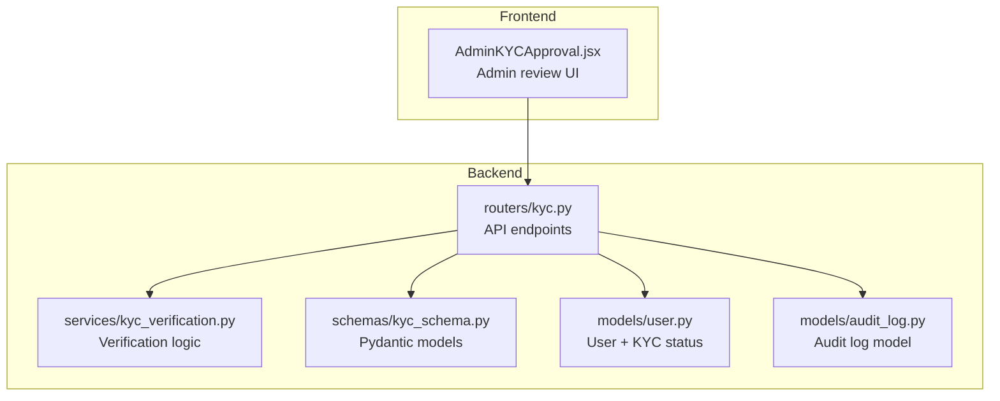
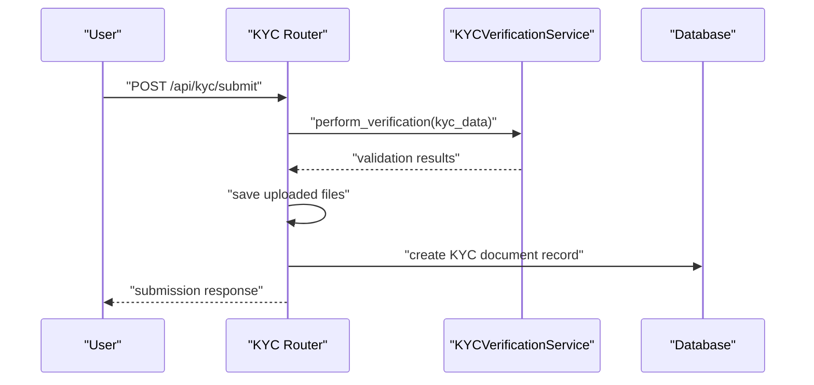
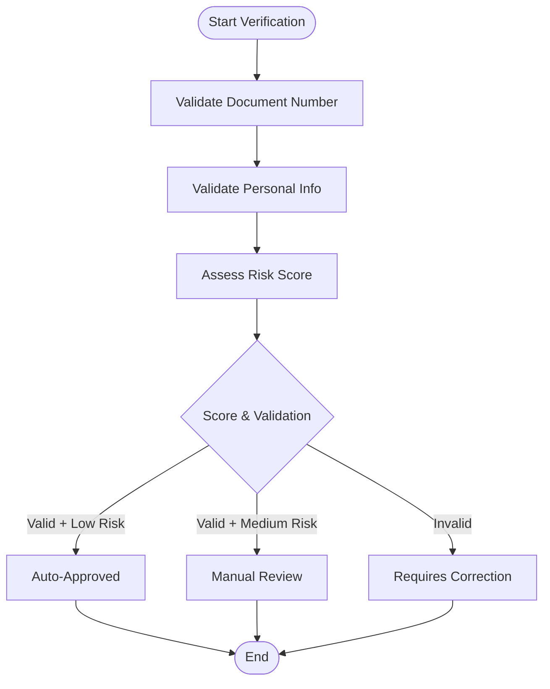
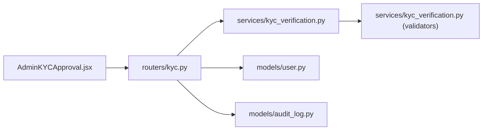

# KYC Verification

<cite>
**Referenced Files in This Document**
- [backend/app/routers/kyc.py](file://backend/app/routers/kyc.py)
- [backend/app/schemas/kyc_schema.py](file://backend/app/schemas/kyc_schema.py)
- [backend/app/services/kyc_verification.py](file://backend/app/services/kyc_verification.py)
- [backend/app/models/user.py](file://backend/app/models/user.py)
- [backend/app/models/audit_log.py](file://backend/app/models/audit_log.py)
- [backend/docs/database-schema.md](file://backend/docs/database-schema.md)
- [backend/alembic/versions/f3c553c21ca8_initial_schema.py](file://backend/alembic/versions/f3c553c21ca8_initial_schema.py)
- [backend/alembic/versions/e4b6b665cae9_add_is_admin_to_users.py](file://backend/alembic/versions/e4b6b665cae9_add_is_admin_to_users.py)
- [frontend/src/pages/admin/AdminKYCApproval.jsx](file://frontend/src/pages/admin/AdminKYCApproval.jsx)
</cite>

## Table of Contents
1. [Introduction](#introduction)
2. [Project Structure](#project-structure)
3. [Core Components](#core-components)
4. [Architecture Overview](#architecture-overview)
5. [Detailed Component Analysis](#detailed-component-analysis)
6. [Dependency Analysis](#dependency-analysis)
7. [Performance Considerations](#performance-considerations)
8. [Troubleshooting Guide](#troubleshooting-guide)
9. [Conclusion](#conclusion)
10. [Appendices](#appendices)

## Introduction
This document explains the Know Your Customer (KYC) verification system implemented in the Modern Digital Banking Dashboard. It covers the identity document upload and verification process, automated document analysis, manual review workflows, and approval/rejection procedures. It also documents KYC status tracking, validation rules, compliance requirements, the admin interface for reviewing submissions, and security measures including privacy protection and audit trails.

## Project Structure
The KYC system spans backend API routes, services, schemas, and models, plus a dedicated admin page for reviewing and approving KYC submissions.

**Diagram sources**
- [backend/app/routers/kyc.py:14-308](file://backend/app/routers/kyc.py#L14-L308)
- [backend/app/services/kyc_verification.py:65-149](file://backend/app/services/kyc_verification.py#L65-L149)
- [backend/app/schemas/kyc_schema.py:1-71](file://backend/app/schemas/kyc_schema.py#L1-L71)
- [backend/app/models/user.py:31-65](file://backend/app/models/user.py#L31-L65)
- [backend/app/models/audit_log.py:6-19](file://backend/app/models/audit_log.py#L6-L19)
- [frontend/src/pages/admin/AdminKYCApproval.jsx:18-657](file://frontend/src/pages/admin/AdminKYCApproval.jsx#L18-L657)

**Section sources**
- [backend/app/routers/kyc.py:14-308](file://backend/app/routers/kyc.py#L14-L308)
- [frontend/src/pages/admin/AdminKYCApproval.jsx:18-657](file://frontend/src/pages/admin/AdminKYCApproval.jsx#L18-L657)

## Core Components
- API Router: Provides endpoints for submitting KYC documents, checking status, listing documents, and admin review and statistics.
- Verification Service: Performs document number validation, personal info checks, risk assessment, and determines auto-approval vs manual review.
- Schemas: Define request/response models and validation rules for KYC submissions.
- Models: Represent user KYC status and related audit logging.
- Admin UI: Allows auditors and support agents to review, approve, or reject KYC submissions.

Key capabilities:
- Document upload and persistence
- Automated validation for Indian IDs (Aadhaar, PAN)
- Risk scoring and status routing
- Admin queue management and verification logs
- Audit trail generation

**Section sources**
- [backend/app/routers/kyc.py:54-147](file://backend/app/routers/kyc.py#L54-L147)
- [backend/app/services/kyc_verification.py:65-149](file://backend/app/services/kyc_verification.py#L65-L149)
- [backend/app/schemas/kyc_schema.py:19-71](file://backend/app/schemas/kyc_schema.py#L19-L71)
- [backend/app/models/user.py:31-65](file://backend/app/models/user.py#L31-L65)
- [backend/app/models/audit_log.py:6-19](file://backend/app/models/audit_log.py#L6-L19)

## Architecture Overview
The system follows a layered architecture:
- Presentation Layer: Admin UI renders pending users and triggers approvals.
- API Layer: FastAPI router handles uploads, validations, and admin actions.
- Service Layer: Verification service encapsulates validation and risk logic.
- Persistence Layer: SQLAlchemy models and Alembic migrations define schema and audit logs.

**Diagram sources**
- [backend/app/routers/kyc.py:54-147](file://backend/app/routers/kyc.py#L54-L147)
- [backend/app/services/kyc_verification.py:88-116](file://backend/app/services/kyc_verification.py#L88-L116)

## Detailed Component Analysis

### API Router: KYC Endpoints
Responsibilities:
- Accept multipart form data for identity documents
- Validate submission against existing KYC records
- Run automated verification and decide initial status
- Persist documents and update user KYC status
- Provide status queries and admin queues
- Log admin verification actions

Notable behaviors:
- Prevents duplicate submissions for pending/verified records
- Auto-approves when document and personal info are valid and risk is low
- Supports manual review for medium risk or discrepancies
- Enforces role-based access for admin endpoints

**Section sources**
- [backend/app/routers/kyc.py:54-147](file://backend/app/routers/kyc.py#L54-L147)
- [backend/app/routers/kyc.py:149-172](file://backend/app/routers/kyc.py#L149-L172)
- [backend/app/routers/kyc.py:174-199](file://backend/app/routers/kyc.py#L174-L199)
- [backend/app/routers/kyc.py:202-232](file://backend/app/routers/kyc.py#L202-L232)
- [backend/app/routers/kyc.py:234-283](file://backend/app/routers/kyc.py#L234-L283)
- [backend/app/routers/kyc.py:285-308](file://backend/app/routers/kyc.py#L285-L308)

### Verification Service: Automated Validation and Risk Assessment
Responsibilities:
- Validate document numbers (Aadhaar PAN checksum, PAN format)
- Validate personal information (name, phone)
- Assess risk based on document type and address keywords
- Determine overall status: auto-approved, manual review, requires correction

**Diagram sources**
- [backend/app/services/kyc_verification.py:88-116](file://backend/app/services/kyc_verification.py#L88-L116)
- [backend/app/services/kyc_verification.py:118-149](file://backend/app/services/kyc_verification.py#L118-L149)

**Section sources**
- [backend/app/services/kyc_verification.py:65-149](file://backend/app/services/kyc_verification.py#L65-L149)

### Schemas: Validation Rules and Responses
Responsibilities:
- Define allowed document types and statuses
- Enforce field-level validations (phone length, document number lengths)
- Validate action values for admin verification

Validation highlights:
- Aadhaar: exactly 12 digits, passes checksum
- PAN: 10-character format with category check
- Phone: 10 digits, starts with 6-9
- Action: approved, rejected, requested_changes

**Section sources**
- [backend/app/schemas/kyc_schema.py:6-41](file://backend/app/schemas/kyc_schema.py#L6-L41)
- [backend/app/schemas/kyc_schema.py:55-63](file://backend/app/schemas/kyc_schema.py#L55-L63)

### Models: User KYC Status and Audit Logging
Responsibilities:
- Track user KYC status at the user level
- Provide audit log entries for admin actions

Notes:
- User KYC status is an enum with values unverified, verified, rejected
- Audit log captures admin actions for compliance and traceability

**Section sources**
- [backend/app/models/user.py:31-65](file://backend/app/models/user.py#L31-L65)
- [backend/app/models/audit_log.py:6-19](file://backend/app/models/audit_log.py#L6-L19)

### Admin Interface: Review and Approval
Responsibilities:
- List users filtered by KYC status
- Search by name/email
- Approve or reject submissions
- Display user details for review

Integration:
- Calls admin user endpoint to fetch users with KYC status
- Sends PATCH to update user KYC status
- Uses status badges and modal for review actions

**Section sources**
- [frontend/src/pages/admin/AdminKYCApproval.jsx:18-657](file://frontend/src/pages/admin/AdminKYCApproval.jsx#L18-L657)

## Dependency Analysis
The system exhibits clear separation of concerns:
- Router depends on service for verification logic
- Service depends on validator helpers for document checks
- Router persists data via SQLAlchemy models
- Admin UI communicates with backend APIs

**Diagram sources**
- [frontend/src/pages/admin/AdminKYCApproval.jsx:18-657](file://frontend/src/pages/admin/AdminKYCApproval.jsx#L18-L657)
- [backend/app/routers/kyc.py:54-147](file://backend/app/routers/kyc.py#L54-L147)
- [backend/app/services/kyc_verification.py:65-149](file://backend/app/services/kyc_verification.py#L65-L149)
- [backend/app/models/user.py:31-65](file://backend/app/models/user.py#L31-L65)
- [backend/app/models/audit_log.py:6-19](file://backend/app/models/audit_log.py#L6-L19)

**Section sources**
- [backend/app/routers/kyc.py:54-147](file://backend/app/routers/kyc.py#L54-L147)
- [backend/app/services/kyc_verification.py:65-149](file://backend/app/services/kyc_verification.py#L65-L149)

## Performance Considerations
- File I/O: Uploaded documents are saved synchronously to disk; consider asynchronous processing and cloud storage for scalability.
- Database queries: Current queries are simple; ensure indexing on user_id and status for performance as volume grows.
- Validation: Regex-based checks are efficient; checksum computation is lightweight.
- Admin queue: Pagination or server-side filtering recommended for large user bases.

## Troubleshooting Guide
Common issues and resolutions:
- Duplicate KYC submission: Router prevents multiple pending/verified submissions; advise users to wait or contact support.
- Validation failures: Document number or personal info errors are returned; guide users to correct inputs.
- Permission errors: Admin endpoints require admin/support roles; ensure proper authentication.
- Missing documents: Ensure both front and back uploads are included when applicable.

Operational checks:
- Verify audit logs for admin actions
- Confirm user KYC status updates after approvals
- Validate risk scoring and status routing

**Section sources**
- [backend/app/routers/kyc.py:72-82](file://backend/app/routers/kyc.py#L72-L82)
- [backend/app/routers/kyc.py:209-210](file://backend/app/routers/kyc.py#L209-L210)
- [backend/app/models/audit_log.py:6-19](file://backend/app/models/audit_log.py#L6-L19)

## Conclusion
The KYC system provides a robust foundation for identity verification with automated checks, risk-aware routing, and an admin review workflow. It enforces validation rules, tracks status at both document and user levels, and maintains audit trails. Future enhancements could include asynchronous document processing, cloud storage, and expanded document types.

## Appendices

### Compliance and Security Measures
- Data validation: Strict field-level validation for document numbers and personal info.
- Access control: Admin-only endpoints restrict sensitive operations.
- Audit trails: Admin actions are logged for compliance and traceability.
- Privacy: Documents are stored locally; consider encryption at rest and secure deletion policies.

**Section sources**
- [backend/app/schemas/kyc_schema.py:27-40](file://backend/app/schemas/kyc_schema.py#L27-L40)
- [backend/app/routers/kyc.py:209-210](file://backend/app/routers/kyc.py#L209-L210)
- [backend/app/models/audit_log.py:6-19](file://backend/app/models/audit_log.py#L6-L19)

### Database Schema Notes
- User table includes kyc_status enum.
- Audit logs table exists for admin actions.
- Additional KYC tables are referenced by router but not shown in provided schema; ensure migrations reflect full KYC schema.

**Section sources**
- [backend/docs/database-schema.md:11-25](file://backend/docs/database-schema.md#L11-L25)
- [backend/alembic/versions/f3c553c21ca8_initial_schema.py:18-36](file://backend/alembic/versions/f3c553c21ca8_initial_schema.py#L18-L36)
- [backend/alembic/versions/e4b6b665cae9_add_is_admin_to_users.py:32-41](file://backend/alembic/versions/e4b6b665cae9_add_is_admin_to_users.py#L32-L41)