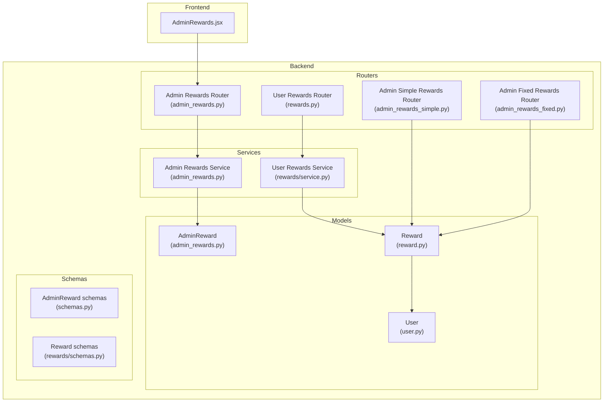
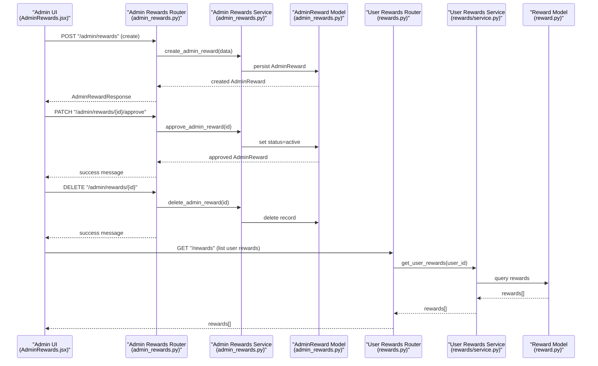
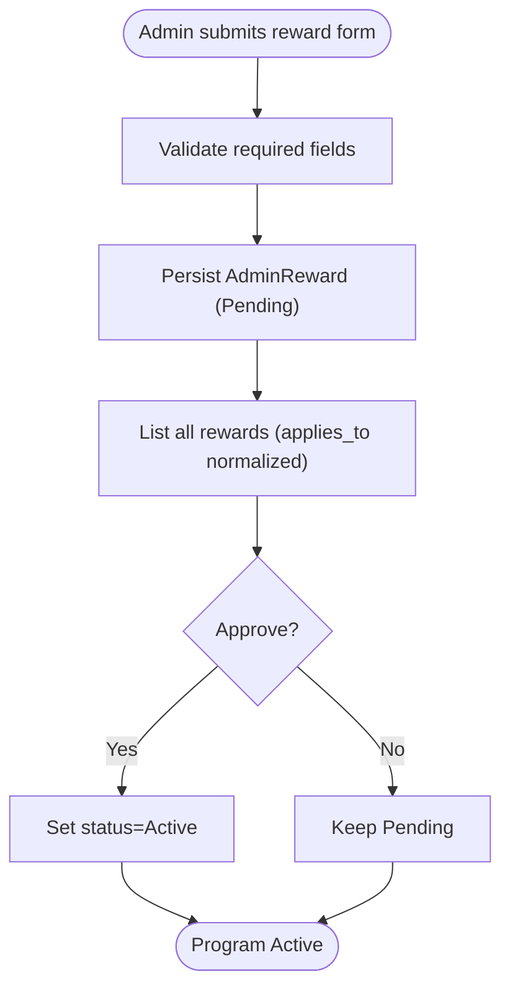
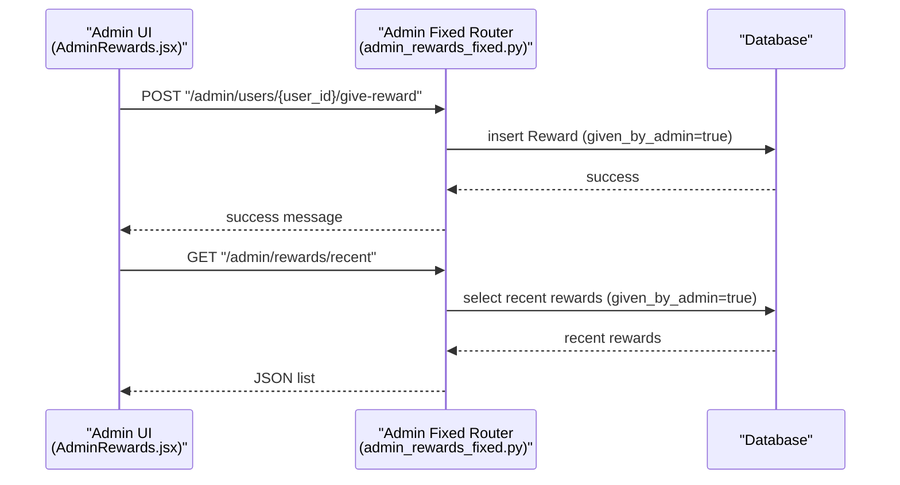
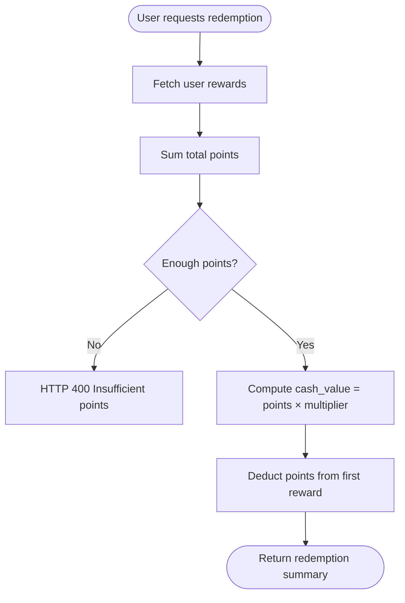
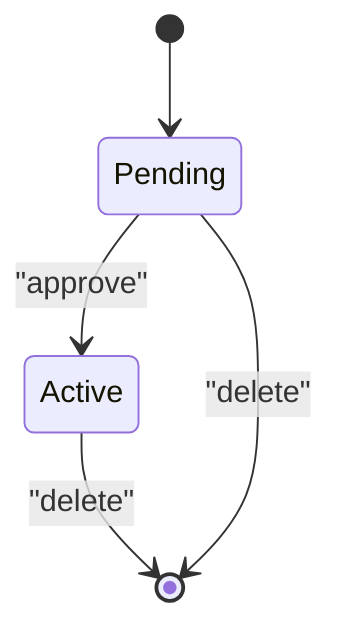
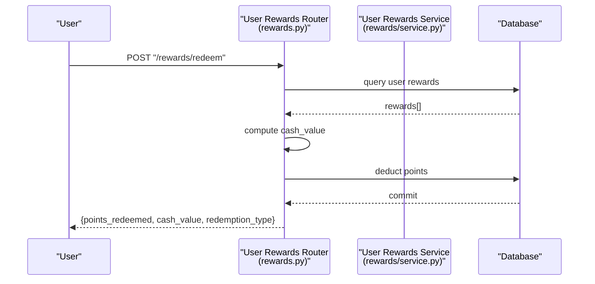
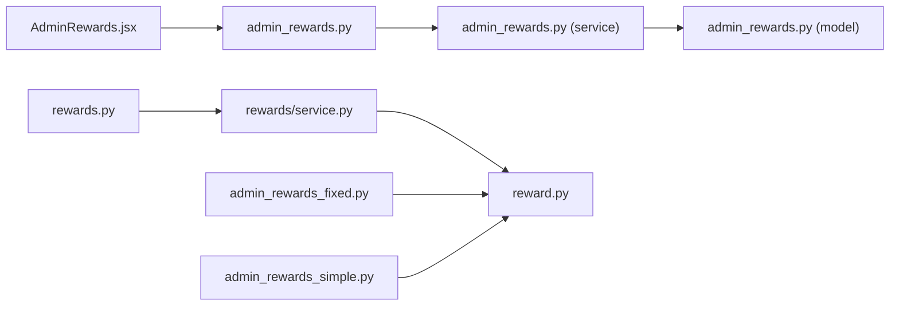

# Rewards Administration

<cite>
**Referenced Files in This Document**
- [admin_rewards.py](file://backend/app/models/admin_rewards.py)
- [schemas.py](file://backend/app/schemas/admin_rewards.py)
- [admin_rewards.py](file://backend/app/routers/admin_rewards.py)
- [admin_rewards.py](file://backend/app/services/admin_rewards.py)
- [rewards.py](file://backend/app/routers/rewards.py)
- [reward.py](file://backend/app/models/reward.py)
- [schemas.py](file://backend/app/rewards/schemas.py)
- [service.py](file://backend/app/rewards/service.py)
- [admin_rewards_fixed.py](file://backend/app/routers/admin_rewards_fixed.py)
- [admin_rewards_simple.py](file://backend/app/routers/admin_rewards_simple.py)
- [AdminRewards.jsx](file://frontend/src/pages/admin/AdminRewards.jsx)
- [user.py](file://backend/app/models/user.py)
- [database-schema.md](file://docs/database-schema.md)
</cite>

## Table of Contents
1. [Introduction](#introduction)
2. [Project Structure](#project-structure)
3. [Core Components](#core-components)
4. [Architecture Overview](#architecture-overview)
5. [Detailed Component Analysis](#detailed-component-analysis)
6. [Dependency Analysis](#dependency-analysis)
7. [Performance Considerations](#performance-considerations)
8. [Troubleshooting Guide](#troubleshooting-guide)
9. [Conclusion](#conclusion)

## Introduction
This document describes the Rewards Administration system for managing customer loyalty programs within the banking platform. It covers:
- Creation, modification, and deletion of reward programs by administrators
- Fixed rewards configuration and distribution via admin endpoints
- Simple reward calculation and redemption mechanics for users
- Approval workflows for reward programs
- Budget allocation and reward distribution mechanisms
- Analytics and redemption tracking
- Administrative controls for managing customer loyalty programs

The system separates administrative reward management from user-facing reward programs, enabling controlled rollout of promotions and direct admin-given points.

## Project Structure
The Rewards Administration feature spans backend models, schemas, routers, services, and frontend admin UI, plus user-facing reward endpoints.

**Diagram sources**
- [admin_rewards.py:11-32](file://backend/app/models/admin_rewards.py#L11-L32)
- [reward.py:5-13](file://backend/app/models/reward.py#L5-L13)
- [user.py:37-64](file://backend/app/models/user.py#L37-L64)
- [schemas.py:6-25](file://backend/app/schemas/admin_rewards.py#L6-L25)
- [schemas.py:4-18](file://backend/app/rewards/schemas.py#L4-L18)
- [admin_rewards.py:1-68](file://backend/app/routers/admin_rewards.py#L1-L68)
- [admin_rewards_fixed.py:1-63](file://backend/app/routers/admin_rewards_fixed.py#L1-L63)
- [admin_rewards_simple.py:1-19](file://backend/app/routers/admin_rewards_simple.py#L1-L19)
- [rewards.py:1-162](file://backend/app/routers/rewards.py#L1-L162)
- [admin_rewards.py:1-59](file://backend/app/services/admin_rewards.py#L1-L59)
- [service.py:1-54](file://backend/app/rewards/service.py#L1-L54)
- [AdminRewards.jsx:1-642](file://frontend/src/pages/admin/AdminRewards.jsx#L1-L642)

**Section sources**
- [admin_rewards.py:1-33](file://backend/app/models/admin_rewards.py#L1-L33)
- [schemas.py:1-26](file://backend/app/schemas/admin_rewards.py#L1-L26)
- [admin_rewards.py:1-68](file://backend/app/routers/admin_rewards.py#L1-L68)
- [admin_rewards.py:1-59](file://backend/app/services/admin_rewards.py#L1-L59)
- [rewards.py:1-162](file://backend/app/routers/rewards.py#L1-L162)
- [reward.py:1-14](file://backend/app/models/reward.py#L1-L14)
- [schemas.py:1-19](file://backend/app/rewards/schemas.py#L1-L19)
- [service.py:1-54](file://backend/app/rewards/service.py#L1-L54)
- [admin_rewards_fixed.py:1-63](file://backend/app/routers/admin_rewards_fixed.py#L1-L63)
- [admin_rewards_simple.py:1-19](file://backend/app/routers/admin_rewards_simple.py#L1-L19)
- [AdminRewards.jsx:1-642](file://frontend/src/pages/admin/AdminRewards.jsx#L1-L642)
- [database-schema.md:98-108](file://docs/database-schema.md#L98-L108)

## Core Components
- AdminReward model and service: Define and manage reward programs with approval lifecycle.
- Admin Rewards Router: Exposes endpoints for listing, creating, approving, and deleting reward programs.
- User Rewards Router and Service: Manage user-facing reward programs, points, and redemptions.
- Admin Fixed Rewards Router: Provides endpoints to distribute fixed points to users and list recent admin-given rewards.
- Admin Simple Rewards Router: Placeholder/simple implementation for admin reward distribution.
- Admin UI (AdminRewards.jsx): Admin interface to create, approve, and delete reward programs.

Key data structures:
- AdminReward: Stores program metadata, type, applicability, value, and status.
- Reward: Tracks user-specific points and program association.
- User: Supports admin flag and relationships to accounts and rewards.

**Section sources**
- [admin_rewards.py:11-32](file://backend/app/models/admin_rewards.py#L11-L32)
- [schemas.py:6-25](file://backend/app/schemas/admin_rewards.py#L6-L25)
- [admin_rewards.py:1-68](file://backend/app/routers/admin_rewards.py#L1-L68)
- [admin_rewards.py:1-59](file://backend/app/services/admin_rewards.py#L1-L59)
- [rewards.py:1-162](file://backend/app/routers/rewards.py#L1-L162)
- [reward.py:5-13](file://backend/app/models/reward.py#L5-L13)
- [schemas.py:4-18](file://backend/app/rewards/schemas.py#L4-L18)
- [service.py:1-54](file://backend/app/rewards/service.py#L1-L54)
- [admin_rewards_fixed.py:1-63](file://backend/app/routers/admin_rewards_fixed.py#L1-L63)
- [admin_rewards_simple.py:1-19](file://backend/app/routers/admin_rewards_simple.py#L1-L19)
- [user.py:37-64](file://backend/app/models/user.py#L37-L64)

## Architecture Overview
The system comprises two reward pathways:
- Admin-managed rewards: Programs created by admins, require approval, and define promotional offers/cashback/referrals.
- User-managed rewards: Points-based programs created and managed by users themselves.

**Diagram sources**
- [admin_rewards.py:38-67](file://backend/app/routers/admin_rewards.py#L38-L67)
- [admin_rewards.py:18-54](file://backend/app/services/admin_rewards.py#L18-L54)
- [admin_rewards.py:11-32](file://backend/app/models/admin_rewards.py#L11-L32)
- [rewards.py:19-45](file://backend/app/routers/rewards.py#L19-L45)
- [service.py:14-53](file://backend/app/rewards/service.py#L14-L53)
- [reward.py:5-13](file://backend/app/models/reward.py#L5-L13)

## Detailed Component Analysis

### Admin Reward Program Management
Administrators create reward programs with name, description, type (Cashback/Offer/Referral), applicability (CSV list), and value. Programs are stored with Pending status until approved. Approved programs become Active and eligible for promotion.

**Diagram sources**
- [admin_rewards.py:38-56](file://backend/app/routers/admin_rewards.py#L38-L56)
- [admin_rewards.py:18-44](file://backend/app/services/admin_rewards.py#L18-L44)
- [admin_rewards.py:11-32](file://backend/app/models/admin_rewards.py#L11-L32)

**Section sources**
- [admin_rewards.py:18-56](file://backend/app/routers/admin_rewards.py#L18-L56)
- [admin_rewards.py:18-44](file://backend/app/services/admin_rewards.py#L18-L44)
- [schemas.py:6-25](file://backend/app/schemas/admin_rewards.py#L6-L25)
- [admin_rewards.py:6-27](file://backend/app/models/admin_rewards.py#L6-L27)
- [AdminRewards.jsx:37-97](file://frontend/src/pages/admin/AdminRewards.jsx#L37-L97)

### Fixed Rewards Distribution
Admins can distribute fixed points to users via dedicated endpoints. Recent admin-given rewards are retrievable for monitoring. The endpoint supports adding a title, points, optional admin message, and title.

**Diagram sources**
- [admin_rewards_fixed.py:35-62](file://backend/app/routers/admin_rewards_fixed.py#L35-L62)
- [reward.py:5-13](file://backend/app/models/reward.py#L5-L13)

**Section sources**
- [admin_rewards_fixed.py:9-62](file://backend/app/routers/admin_rewards_fixed.py#L9-L62)
- [reward.py:5-13](file://backend/app/models/reward.py#L5-L13)

### Simple Reward Calculation and Redemption
Users can view their reward programs, create new ones, and redeem points. Redemption converts points to cash value based on redemption type with a fixed multiplier. The system checks sufficient points and deducts from the first reward record.

**Diagram sources**
- [rewards.py:59-86](file://backend/app/routers/rewards.py#L59-L86)

**Section sources**
- [rewards.py:19-162](file://backend/app/routers/rewards.py#L19-L162)
- [schemas.py:4-18](file://backend/app/rewards/schemas.py#L4-L18)
- [service.py:14-53](file://backend/app/rewards/service.py#L14-L53)

### Dynamic Reward Systems
Dynamic reward systems are not implemented in the current codebase. The existing reward model supports fixed points per program. Future enhancements could include:
- Rule-based triggers (spending thresholds, account tenure)
- Tiered point multipliers
- Campaign-based expiration and caps
- Integration with transaction events

[No sources needed since this section provides conceptual guidance]

### Budget Allocation and Distribution
- Budget allocation: Not implemented in the current codebase. Administrators can create reward programs, but there is no centralized budget cap or allocation mechanism.
- Distribution: Admin-given rewards bypass program budgets. User-created rewards rely on points accumulation and redemption rules.

[No sources needed since this section provides conceptual guidance]

### Rewards Approval Workflows
- Creation: Admin submits a reward program; stored as Pending.
- Approval: Admin approves to set status to Active.
- Deletion: Admin can delete Pending or Active programs.

**Diagram sources**
- [admin_rewards.py:6-9](file://backend/app/models/admin_rewards.py#L6-L9)
- [admin_rewards.py:36-44](file://backend/app/services/admin_rewards.py#L36-L44)

**Section sources**
- [admin_rewards.py:48-67](file://backend/app/routers/admin_rewards.py#L48-L67)
- [admin_rewards.py:36-54](file://backend/app/services/admin_rewards.py#L36-L54)

### Reward Analytics and Redemption Tracking
- Redemption tracking: The redemption endpoint returns points redeemed, calculated cash value, and redemption type.
- Analytics: No built-in analytics endpoints exist. The admin UI lists programs and allows approvals/deletions. User rewards listing includes metadata suitable for basic analytics.

**Diagram sources**
- [rewards.py:59-86](file://backend/app/routers/rewards.py#L59-L86)
- [service.py:14-53](file://backend/app/rewards/service.py#L14-L53)

**Section sources**
- [rewards.py:59-86](file://backend/app/routers/rewards.py#L59-L86)

### Administrative Controls for Managing Customer Loyalty Programs
- Admin UI: Create, approve, and delete reward programs; filter/search capabilities; responsive design.
- Program metadata: Name, description, type, applies_to (CSV), value, status, created_at.
- User-facing controls: View, create, update, delete, and claim rewards; redeem points.

**Section sources**
- [AdminRewards.jsx:37-97](file://frontend/src/pages/admin/AdminRewards.jsx#L37-L97)
- [schemas.py:14-25](file://backend/app/schemas/admin_rewards.py#L14-L25)
- [rewards.py:88-149](file://backend/app/routers/rewards.py#L88-L149)

## Dependency Analysis
- Admin reward program lifecycle depends on AdminReward model and service.
- Admin UI interacts with Admin Rewards Router and Service.
- User reward endpoints depend on Reward model and User service utilities.
- Admin-given rewards depend on Reward model with additional fields (admin message, title, admin flag).

**Diagram sources**
- [admin_rewards.py:1-68](file://backend/app/routers/admin_rewards.py#L1-L68)
- [admin_rewards.py:1-59](file://backend/app/services/admin_rewards.py#L1-L59)
- [admin_rewards.py:11-32](file://backend/app/models/admin_rewards.py#L11-L32)
- [rewards.py:1-162](file://backend/app/routers/rewards.py#L1-L162)
- [service.py:1-54](file://backend/app/rewards/service.py#L1-L54)
- [reward.py:5-13](file://backend/app/models/reward.py#L5-L13)
- [admin_rewards_fixed.py:1-63](file://backend/app/routers/admin_rewards_fixed.py#L1-L63)
- [admin_rewards_simple.py:1-19](file://backend/app/routers/admin_rewards_simple.py#L1-L19)

**Section sources**
- [admin_rewards.py:1-68](file://backend/app/routers/admin_rewards.py#L1-L68)
- [admin_rewards.py:1-59](file://backend/app/services/admin_rewards.py#L1-L59)
- [rewards.py:1-162](file://backend/app/routers/rewards.py#L1-L162)
- [service.py:1-54](file://backend/app/rewards/service.py#L1-L54)
- [admin_rewards_fixed.py:1-63](file://backend/app/routers/admin_rewards_fixed.py#L1-L63)
- [admin_rewards_simple.py:1-19](file://backend/app/routers/admin_rewards_simple.py#L1-L19)

## Performance Considerations
- Normalize CSV fields: The Admin Rewards Router normalizes applies_to for display, avoiding repeated parsing.
- Efficient queries: Services use filtered queries for single records and bulk retrieval ordered by creation time.
- Minimal overhead: Redemption logic sums points and performs a single deduction operation.

[No sources needed since this section provides general guidance]

## Troubleshooting Guide
Common issues and resolutions:
- Reward not found during approval/delete: Ensure the ID exists and belongs to a valid program.
- Insufficient points during redemption: Verify user has accumulated sufficient points across reward programs.
- Admin-given reward errors: Confirm user exists and payload includes required fields (e.g., points).

**Section sources**
- [admin_rewards.py:53-66](file://backend/app/routers/admin_rewards.py#L53-L66)
- [rewards.py:65-66](file://backend/app/routers/rewards.py#L65-L66)
- [admin_rewards_fixed.py:40-44](file://backend/app/routers/admin_rewards_fixed.py#L40-L44)

## Conclusion
The Rewards Administration system provides a robust foundation for managing promotional reward programs with approval workflows and admin-given distributions. While user-facing reward programs and redemptions are supported, advanced features such as dynamic reward rules, centralized budget allocation, and comprehensive analytics are not implemented and represent opportunities for future enhancement.