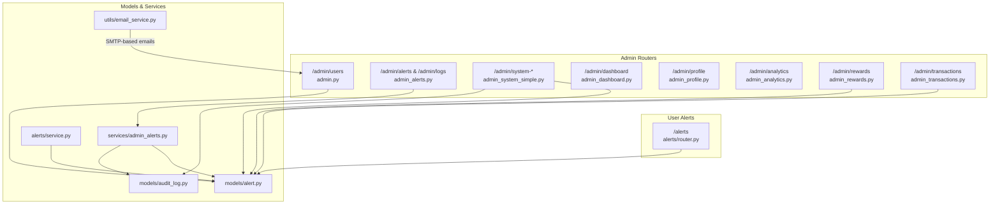
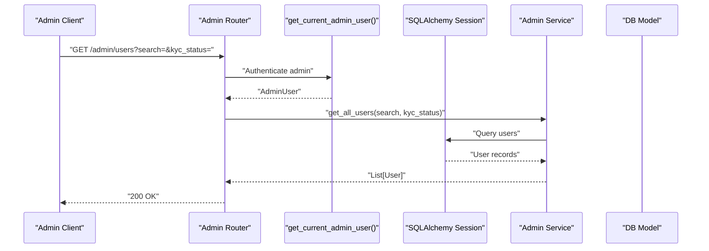
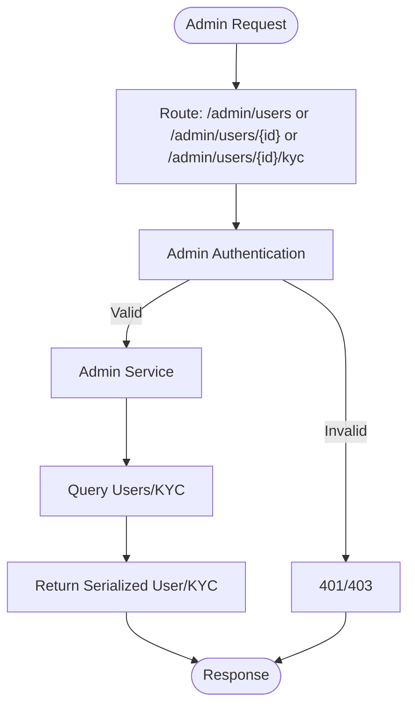
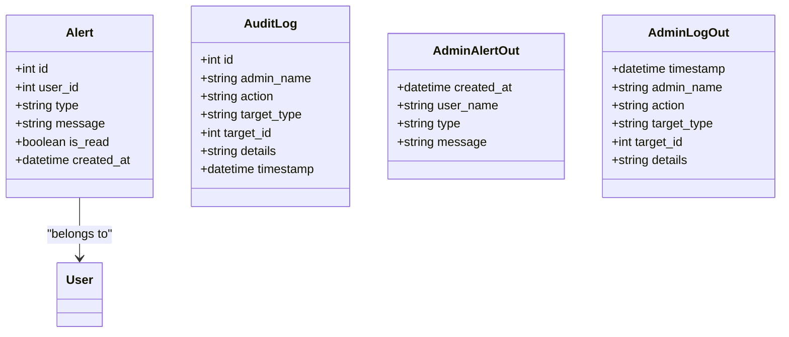
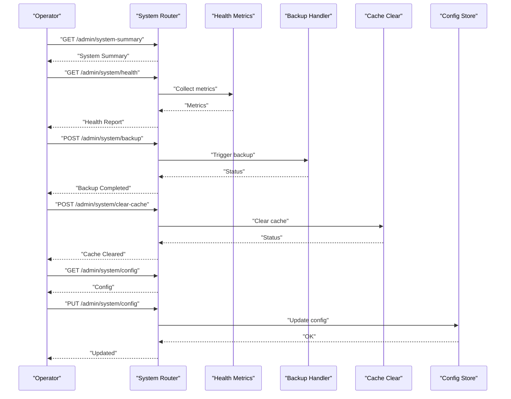
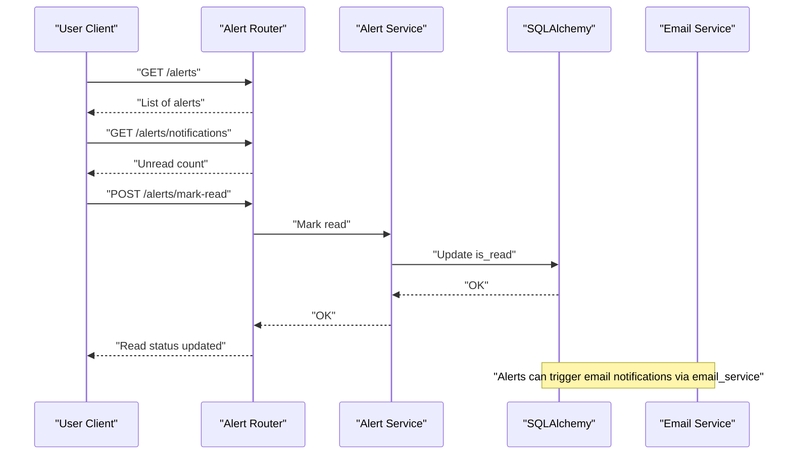
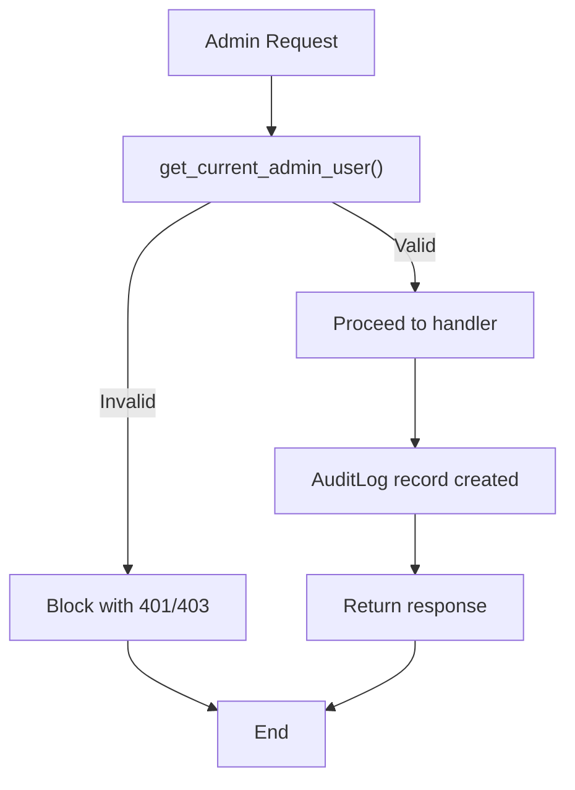
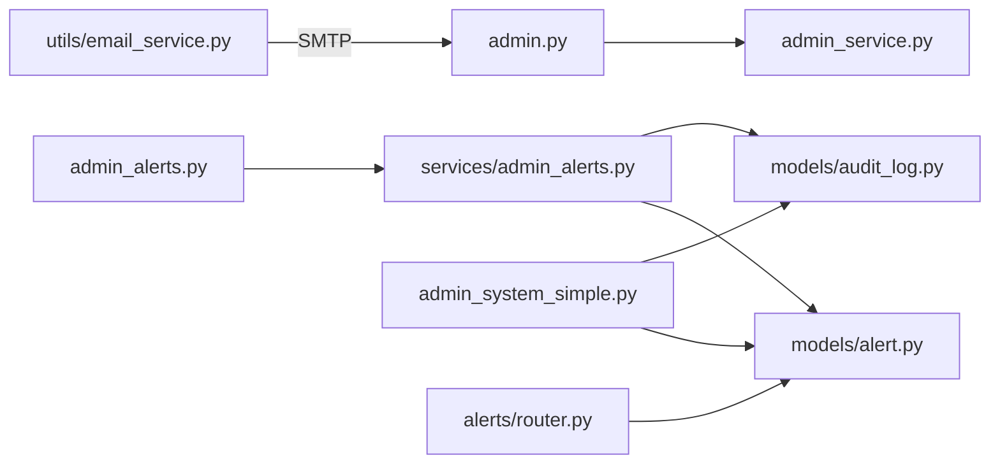

# System Controls

<cite>
**Referenced Files in This Document**
- [backend/app/routers/admin.py](file://backend/app/routers/admin.py)
- [backend/app/routers/admin_alerts.py](file://backend/app/routers/admin_alerts.py)
- [backend/app/routers/admin_system_simple.py](file://backend/app/routers/admin_system_simple.py)
- [backend/app/routers/alerts/router.py](file://backend/app/alerts/router.py)
- [backend/app/alerts/service.py](file://backend/app/alerts/service.py)
- [backend/app/models/alert.py](file://backend/app/models/alert.py)
- [backend/app/services/admin_alerts.py](file://backend/app/services/admin_alerts.py)
- [backend/app/schemas/admin_alerts.py](file://backend/app/schemas/admin_alerts.py)
- [backend/app/models/audit_log.py](file://backend/app/models/audit_log.py)
- [backend/app/utils/email_service.py](file://backend/app/utils/email_service.py)
- [backend/app/routers/admin_dashboard.py](file://backend/app/routers/admin_dashboard.py)
- [backend/app/routers/admin_profile.py](file://backend/app/routers/admin_profile.py)
- [backend/app/routers/admin_analytics.py](file://backend/app/routers/admin_analytics.py)
- [backend/app/routers/admin_rewards.py](file://backend/app/routers/admin_rewards.py)
- [backend/app/routers/admin_transactions.py](file://backend/app/routers/admin_transactions.py)
</cite>

## Table of Contents
1. [Introduction](#introduction)
2. [Project Structure](#project-structure)
3. [Core Components](#core-components)
4. [Architecture Overview](#architecture-overview)
5. [Detailed Component Analysis](#detailed-component-analysis)
6. [Dependency Analysis](#dependency-analysis)
7. [Performance Considerations](#performance-considerations)
8. [Troubleshooting Guide](#troubleshooting-guide)
9. [Conclusion](#conclusion)
10. [Appendices](#appendices)

## Introduction
This document describes the administrative controls and configuration management capabilities exposed by the backend. It focuses on:
- System-wide settings and monitoring endpoints
- Alert management and notification configuration
- Administrative controls for users, KYC, rewards, transactions, and analytics
- Operational controls such as backup, cache clearing, and system health
- Administrative access controls and audit logging

Where applicable, the document maps features to concrete routers, services, models, and schemas to help operators configure, monitor, and manage the system effectively.

## Project Structure
The admin-related backend functionality is organized around dedicated routers grouped by domain:
- Admin user management and KYC
- Admin alerts and audit logs
- System summary, health, backup, and configuration
- Dashboard, profile, analytics, rewards, and transactions
- User-facing alerts and notifications

**Diagram sources**
- [backend/app/routers/admin.py:1-45](file://backend/app/routers/admin.py#L1-L45)
- [backend/app/routers/admin_alerts.py:1-24](file://backend/app/routers/admin_alerts.py#L1-L24)
- [backend/app/routers/admin_system_simple.py:1-84](file://backend/app/routers/admin_system_simple.py#L1-L84)
- [backend/app/routers/admin_dashboard.py:1-14](file://backend/app/routers/admin_dashboard.py#L1-L14)
- [backend/app/routers/admin_profile.py:1-46](file://backend/app/routers/admin_profile.py#L1-L46)
- [backend/app/routers/admin_analytics.py:1-21](file://backend/app/routers/admin_analytics.py#L1-L21)
- [backend/app/routers/admin_rewards.py:1-68](file://backend/app/routers/admin_rewards.py#L1-L68)
- [backend/app/routers/admin_transactions.py:1-111](file://backend/app/routers/admin_transactions.py#L1-L111)
- [backend/app/alerts/router.py:1-44](file://backend/app/alerts/router.py#L1-L44)
- [backend/app/models/alert.py:1-34](file://backend/app/models/alert.py#L1-L34)
- [backend/app/models/audit_log.py:1-19](file://backend/app/models/audit_log.py#L1-L19)
- [backend/app/services/admin_alerts.py:1-58](file://backend/app/services/admin_alerts.py#L1-L58)
- [backend/app/alerts/service.py:1-24](file://backend/app/alerts/service.py#L1-L24)
- [backend/app/utils/email_service.py:1-88](file://backend/app/utils/email_service.py#L1-L88)

**Section sources**
- [backend/app/routers/admin.py:1-45](file://backend/app/routers/admin.py#L1-L45)
- [backend/app/routers/admin_alerts.py:1-24](file://backend/app/routers/admin_alerts.py#L1-L24)
- [backend/app/routers/admin_system_simple.py:1-84](file://backend/app/routers/admin_system_simple.py#L1-L84)
- [backend/app/alerts/router.py:1-44](file://backend/app/alerts/router.py#L1-L44)
- [backend/app/models/alert.py:1-34](file://backend/app/models/alert.py#L1-L34)
- [backend/app/services/admin_alerts.py:1-58](file://backend/app/services/admin_alerts.py#L1-L58)
- [backend/app/models/audit_log.py:1-19](file://backend/app/models/audit_log.py#L1-L19)
- [backend/app/utils/email_service.py:1-88](file://backend/app/utils/email_service.py#L1-L88)

## Core Components
- Admin user management and KYC: list users, get user details, update KYC status.
- Admin alerts and audit logs: fetch alerts and logs with optional filters.
- System monitoring and controls: system summary, health metrics, suspicious activity, backup, cache clear, and configuration get/update.
- User alerts and notifications: list alerts, unread count, and mark as read.
- Alert creation service: centralized method to create alerts for users.
- Email service: SMTP-based OTP and payment link notifications.
- Admin dashboards, profile, analytics, rewards, and transactions: administrative views and operations.

**Section sources**
- [backend/app/routers/admin.py:14-44](file://backend/app/routers/admin.py#L14-L44)
- [backend/app/routers/admin_alerts.py:10-23](file://backend/app/routers/admin_alerts.py#L10-L23)
- [backend/app/routers/admin_system_simple.py:7-84](file://backend/app/routers/admin_system_simple.py#L7-L84)
- [backend/app/alerts/router.py:20-43](file://backend/app/alerts/router.py#L20-L43)
- [backend/app/alerts/service.py:6-23](file://backend/app/alerts/service.py#L6-L23)
- [backend/app/utils/email_service.py:14-88](file://backend/app/utils/email_service.py#L14-L88)

## Architecture Overview
The admin system is built around FastAPI routers that depend on SQLAlchemy sessions and shared dependencies. Admin endpoints enforce admin authentication and authorization. Data access is performed via services that query models. Notifications leverage an alert model and an email utility.

**Diagram sources**
- [backend/app/routers/admin.py:14-21](file://backend/app/routers/admin.py#L14-L21)
- [backend/app/services/admin_alerts.py:8-17](file://backend/app/services/admin_alerts.py#L8-L17)

## Detailed Component Analysis

### Admin User Management and KYC
- Endpoint: GET /admin/users with optional query params for search and KYC status.
- Endpoint: GET /admin/users/{user_id} for detailed user info.
- Endpoint: PATCH /admin/users/{user_id}/kyc to update KYC status.
- Dependencies: database session and admin authentication.
- Behavior: Admin-only routes; returns serialized user data.

**Diagram sources**
- [backend/app/routers/admin.py:14-44](file://backend/app/routers/admin.py#L14-L44)

**Section sources**
- [backend/app/routers/admin.py:14-44](file://backend/app/routers/admin.py#L14-L44)

### Admin Alerts and Audit Logs
- Endpoint: GET /admin/alerts with optional alert type filter.
- Endpoint: GET /admin/logs with optional action filter.
- Data model: Alert and AuditLog.
- Serialization: AdminAlertOut and AdminLogOut schemas.
- Behavior: Joins alerts with user info for readable admin reports; logs actions with metadata.

**Diagram sources**
- [backend/app/models/alert.py:17-34](file://backend/app/models/alert.py#L17-L34)
- [backend/app/models/audit_log.py:6-19](file://backend/app/models/audit_log.py#L6-L19)
- [backend/app/schemas/admin_alerts.py:10-31](file://backend/app/schemas/admin_alerts.py#L10-L31)

**Section sources**
- [backend/app/routers/admin_alerts.py:10-23](file://backend/app/routers/admin_alerts.py#L10-L23)
- [backend/app/services/admin_alerts.py:40-57](file://backend/app/services/admin_alerts.py#L40-L57)
- [backend/app/models/alert.py:17-34](file://backend/app/models/alert.py#L17-L34)
- [backend/app/models/audit_log.py:6-19](file://backend/app/models/audit_log.py#L6-L19)
- [backend/app/schemas/admin_alerts.py:10-31](file://backend/app/schemas/admin_alerts.py#L10-L31)

### System Monitoring and Operational Controls
- System summary: total users, active users, accounts, transactions, health, DB status, last backup.
- System alerts: static informational alerts.
- Suspicious activity: empty list endpoint.
- Health metrics: uptime, response time, CPU/memory/disk usage.
- Backup and cache: manual triggers for backup completion and cache clearing.
- Configuration: get and update system configuration (e.g., maintenance mode, backup enabled).

**Diagram sources**
- [backend/app/routers/admin_system_simple.py:7-84](file://backend/app/routers/admin_system_simple.py#L7-L84)

**Section sources**
- [backend/app/routers/admin_system_simple.py:7-84](file://backend/app/routers/admin_system_simple.py#L7-L84)

### User Alerts and Notification Configuration
- Endpoint: GET /alerts for current user’s alerts ordered by creation time.
- Endpoint: GET /alerts/notifications for unread alert count.
- Endpoint: POST /alerts/mark-read to mark unread alerts as read.
- Alert creation service: centralized method to create alerts with type and message.
- Email service: SMTP-based OTP and payment link notifications.

**Diagram sources**
- [backend/app/alerts/router.py:20-43](file://backend/app/alerts/router.py#L20-L43)
- [backend/app/alerts/service.py:6-23](file://backend/app/alerts/service.py#L6-L23)
- [backend/app/utils/email_service.py:14-88](file://backend/app/utils/email_service.py#L14-L88)

**Section sources**
- [backend/app/alerts/router.py:20-43](file://backend/app/alerts/router.py#L20-L43)
- [backend/app/alerts/service.py:6-23](file://backend/app/alerts/service.py#L6-L23)
- [backend/app/utils/email_service.py:14-88](file://backend/app/utils/email_service.py#L14-L88)

### Administrative Access Controls and Audit Logging
- Admin-only routes enforced via dependency that validates admin identity.
- Audit logs capture admin actions with target type/id and details.
- Admin profile endpoints allow updating contact info and changing password with verification.

**Diagram sources**
- [backend/app/routers/admin.py:7-8](file://backend/app/routers/admin.py#L7-L8)
- [backend/app/models/audit_log.py:6-19](file://backend/app/models/audit_log.py#L6-L19)
- [backend/app/routers/admin_profile.py:34-45](file://backend/app/routers/admin_profile.py#L34-L45)

**Section sources**
- [backend/app/routers/admin.py:7-8](file://backend/app/routers/admin.py#L7-L8)
- [backend/app/models/audit_log.py:6-19](file://backend/app/models/audit_log.py#L6-L19)
- [backend/app/routers/admin_profile.py:34-45](file://backend/app/routers/admin_profile.py#L34-L45)

### Additional Admin Capabilities
- Dashboard summary: aggregated KPIs for admin review.
- Profile management: update admin profile and change password with current password verification.
- Analytics: summary and top users by activity.
- Rewards: CRUD operations for rewards with approval and normalization of applies-to lists.
- Transactions: list, export to CSV, and import from CSV with validation and user mapping.

**Section sources**
- [backend/app/routers/admin_dashboard.py:11-13](file://backend/app/routers/admin_dashboard.py#L11-L13)
- [backend/app/routers/admin_profile.py:15-45](file://backend/app/routers/admin_profile.py#L15-L45)
- [backend/app/routers/admin_analytics.py:13-20](file://backend/app/routers/admin_analytics.py#L13-L20)
- [backend/app/routers/admin_rewards.py:28-67](file://backend/app/routers/admin_rewards.py#L28-L67)
- [backend/app/routers/admin_transactions.py:63-110](file://backend/app/routers/admin_transactions.py#L63-L110)

## Dependency Analysis
- Routers depend on database sessions and admin authentication dependencies.
- Services encapsulate queries and joins for admin-specific data.
- Models define alert and audit log structures.
- Utilities provide email delivery for notifications.

**Diagram sources**
- [backend/app/routers/admin.py:1-45](file://backend/app/routers/admin.py#L1-L45)
- [backend/app/routers/admin_alerts.py:1-24](file://backend/app/routers/admin_alerts.py#L1-L24)
- [backend/app/routers/admin_system_simple.py:1-84](file://backend/app/routers/admin_system_simple.py#L1-L84)
- [backend/app/alerts/router.py:1-44](file://backend/app/alerts/router.py#L1-L44)
- [backend/app/services/admin_alerts.py:1-58](file://backend/app/services/admin_alerts.py#L1-L58)
- [backend/app/models/alert.py:1-34](file://backend/app/models/alert.py#L1-L34)
- [backend/app/models/audit_log.py:1-19](file://backend/app/models/audit_log.py#L1-L19)
- [backend/app/utils/email_service.py:1-88](file://backend/app/utils/email_service.py#L1-L88)

**Section sources**
- [backend/app/routers/admin.py:1-45](file://backend/app/routers/admin.py#L1-L45)
- [backend/app/routers/admin_alerts.py:1-24](file://backend/app/routers/admin_alerts.py#L1-L24)
- [backend/app/routers/admin_system_simple.py:1-84](file://backend/app/routers/admin_system_simple.py#L1-L84)
- [backend/app/alerts/router.py:1-44](file://backend/app/alerts/router.py#L1-L44)
- [backend/app/services/admin_alerts.py:1-58](file://backend/app/services/admin_alerts.py#L1-L58)
- [backend/app/models/alert.py:1-34](file://backend/app/models/alert.py#L1-L34)
- [backend/app/models/audit_log.py:1-19](file://backend/app/models/audit_log.py#L1-L19)
- [backend/app/utils/email_service.py:1-88](file://backend/app/utils/email_service.py#L1-L88)

## Performance Considerations
- Filtering and ordering: Admin alert and log endpoints order by time and optionally filter by type/action; ensure appropriate indexing on timestamp/type fields.
- Bulk operations: CSV import/export for transactions should handle large datasets efficiently; consider streaming and batch commits.
- Caching: Use cache clear endpoint to refresh caches after configuration changes.
- Email throughput: SMTP operations are synchronous; consider queuing for high-volume notifications.

[No sources needed since this section provides general guidance]

## Troubleshooting Guide
- Missing email credentials: Email service falls back to mock behavior when sender credentials are not configured; verify SMTP settings and test delivery.
- Admin authentication failures: Ensure the admin dependency resolves a valid admin user; check JWT or session-based admin validation.
- Alert persistence: If alerts are not appearing, confirm alert creation service is invoked and the database commit succeeds.
- CSV import errors: Validate CSV headers and types; the import routine skips invalid rows and continues processing.

**Section sources**
- [backend/app/utils/email_service.py:18-20](file://backend/app/utils/email_service.py#L18-L20)
- [backend/app/alerts/service.py:20-23](file://backend/app/alerts/service.py#L20-L23)
- [backend/app/routers/admin_transactions.py:90-110](file://backend/app/routers/admin_transactions.py#L90-L110)

## Conclusion
The admin system provides comprehensive controls for managing users, monitoring system health, configuring operational settings, and maintaining auditability. Admin endpoints are protected and backed by robust models and services. Alerts and notifications are centralized for reliability, while email utilities enable secure communication. Operators should use the documented endpoints to perform backups, clear caches, adjust configurations, and oversee system activity.

[No sources needed since this section summarizes without analyzing specific files]

## Appendices

### Endpoint Reference Summary
- Admin user management
  - GET /admin/users
  - GET /admin/users/{user_id}
  - PATCH /admin/users/{user_id}/kyc
- Admin alerts and logs
  - GET /admin/alerts?type=...
  - GET /admin/logs?action=...
- System monitoring and controls
  - GET /admin/system-summary
  - GET /admin/alerts
  - GET /admin/suspicious-activity
  - GET /admin/system/health
  - POST /admin/system/backup
  - POST /admin/system/clear-cache
  - GET /admin/system/config
  - PUT /admin/system/config
- User alerts and notifications
  - GET /alerts
  - GET /alerts/notifications
  - POST /alerts/mark-read
- Admin dashboards, profile, analytics, rewards, transactions
  - GET /admin/dashboard/summary
  - GET /admin/profile
  - PUT /admin/profile
  - PUT /admin/change-password
  - GET /admin/analytics/summary
  - GET /admin/analytics/top-users
  - GET /admin/rewards/
  - POST /admin/rewards/
  - PATCH /admin/rewards/{reward_id}/approve
  - DELETE /admin/rewards/{reward_id}
  - GET /admin/transactions/
  - GET /admin/transactions/export
  - POST /admin/transactions/import

[No sources needed since this section aggregates previously cited endpoints]