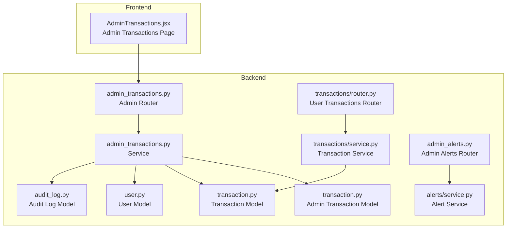
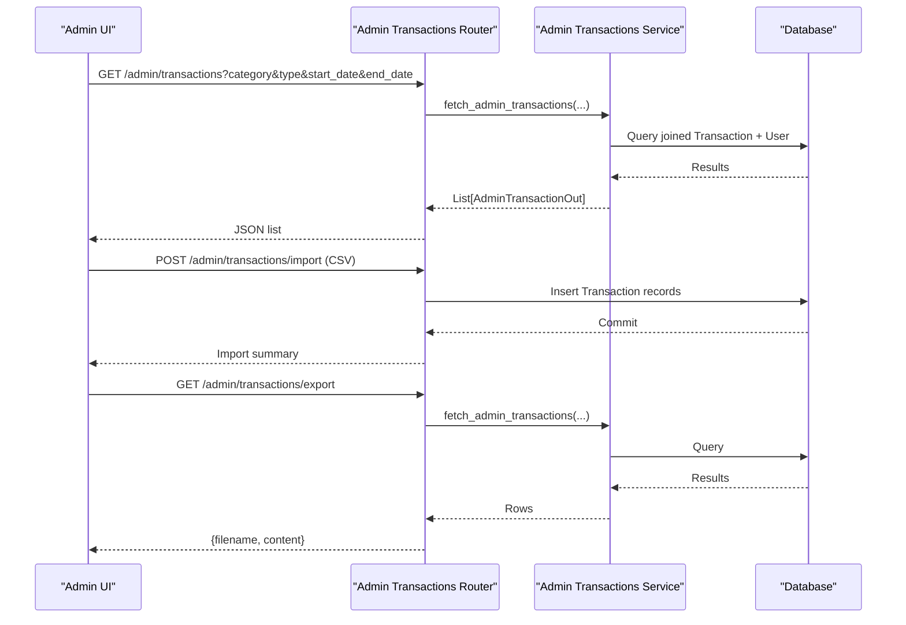
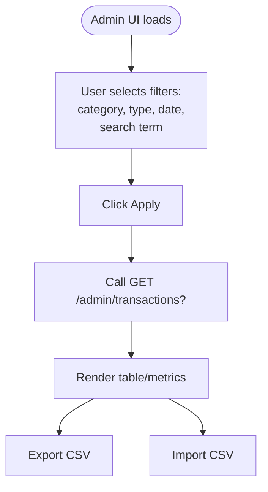
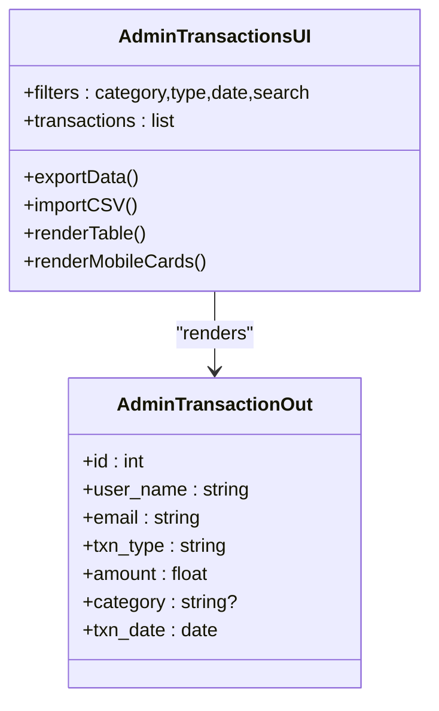
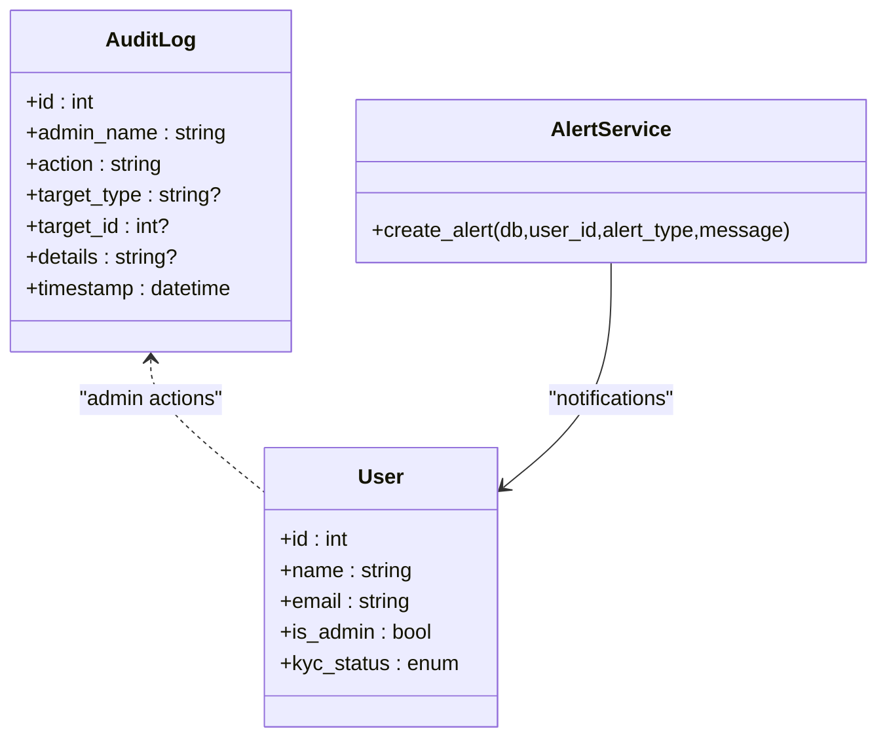
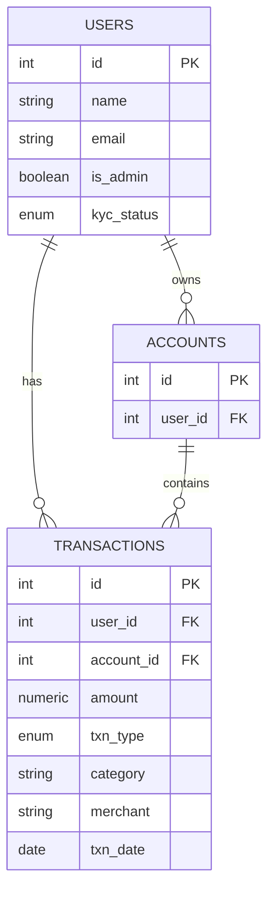
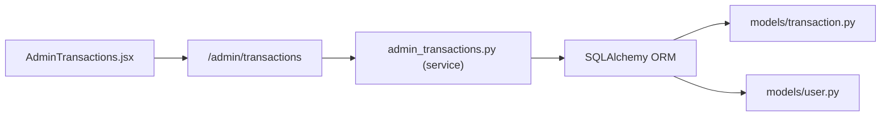

# Transaction Monitoring

<cite>
**Referenced Files in This Document**
- [admin_transactions.py](file://backend/app/routers/admin_transactions.py)
- [admin_transaction.py](file://backend/app/schemas/admin_transaction.py)
- [admin_transactions.py](file://backend/app/services/admin_transactions.py)
- [transaction.py](file://backend/app/models/transaction.py)
- [transaction.py](file://backend/app/transactions/router.py)
- [transaction.py](file://backend/app/transactions/service.py)
- [csv_import.py](file://backend/app/transactions/csv_import.py)
- [audit_log.py](file://backend/app/models/audit_log.py)
- [admin_alerts.py](file://backend/app/routers/admin_alerts.py)
- [service.py](file://backend/app/alerts/service.py)
- [user.py](file://backend/app/models/user.py)
- [AdminTransactions.jsx](file://frontend/src/pages/admin/AdminTransactions.jsx)
</cite>

## Table of Contents
1. [Introduction](#introduction)
2. [Project Structure](#project-structure)
3. [Core Components](#core-components)
4. [Architecture Overview](#architecture-overview)
5. [Detailed Component Analysis](#detailed-component-analysis)
6. [Dependency Analysis](#dependency-analysis)
7. [Performance Considerations](#performance-considerations)
8. [Troubleshooting Guide](#troubleshooting-guide)
9. [Conclusion](#conclusion)

## Introduction
This document describes the admin transaction monitoring and review capabilities of the banking dashboard. It covers transaction listing, filtering, suspicious detection, manual review workflows, blocking procedures, the review interface, risk assessment tools, compliance monitoring, audit trails, fraud detection indicators, and administrative decision-making for flagged transactions. The backend provides admin endpoints for listing, exporting, and importing transactions, while the frontend exposes a transaction review interface with filters and actions.

## Project Structure
The transaction monitoring feature spans backend routers, services, models, and frontend pages:
- Backend admin transaction endpoints: listing, export, import
- Backend transaction service and router for user-facing transactions
- Audit logging model for compliance and change tracking
- Alerts infrastructure for security and compliance notifications
- Frontend admin page for transaction review and filtering

**Diagram sources**
- [admin_transactions.py:1-111](file://backend/app/routers/admin_transactions.py#L1-L111)
- [admin_transactions.py:1-60](file://backend/app/services/admin_transactions.py#L1-L60)
- [transaction.py:1-58](file://backend/app/models/transaction.py#L1-L58)
- [transaction.py:1-129](file://backend/app/transactions/router.py#L1-L129)
- [transaction.py:1-188](file://backend/app/transactions/service.py#L1-L188)
- [audit_log.py:1-19](file://backend/app/models/audit_log.py#L1-L19)
- [admin_alerts.py:1-24](file://backend/app/routers/admin_alerts.py#L1-L24)
- [service.py:1-24](file://backend/app/alerts/service.py#L1-L24)
- [user.py:1-65](file://backend/app/models/user.py#L1-L65)
- [AdminTransactions.jsx:1-707](file://frontend/src/pages/admin/AdminTransactions.jsx#L1-L707)

**Section sources**
- [admin_transactions.py:1-111](file://backend/app/routers/admin_transactions.py#L1-L111)
- [admin_transactions.py:1-60](file://backend/app/services/admin_transactions.py#L1-L60)
- [transaction.py:1-58](file://backend/app/models/transaction.py#L1-L58)
- [transaction.py:1-129](file://backend/app/transactions/router.py#L1-L129)
- [transaction.py:1-188](file://backend/app/transactions/service.py#L1-L188)
- [audit_log.py:1-19](file://backend/app/models/audit_log.py#L1-L19)
- [admin_alerts.py:1-24](file://backend/app/routers/admin_alerts.py#L1-L24)
- [service.py:1-24](file://backend/app/alerts/service.py#L1-L24)
- [user.py:1-65](file://backend/app/models/user.py#L1-L65)
- [AdminTransactions.jsx:1-707](file://frontend/src/pages/admin/AdminTransactions.jsx#L1-L707)

## Core Components
- Admin transaction listing with filters:
  - Backend endpoint supports category, type, and date range queries.
  - Frontend provides category/type dropdowns and a date filter, plus a free-text search across user name and email.
- Export and import:
  - Export CSV of all transactions.
  - Import CSV for adding transactions via admin.
- Risk and compliance:
  - Audit logs capture administrative actions.
  - Alerts service supports security and compliance notifications.
- User and transaction models:
  - Transaction model defines amount, type, category, merchant, date, and relationships.
  - User model includes admin flag and KYC status.

**Section sources**
- [admin_transactions.py:63-86](file://backend/app/routers/admin_transactions.py#L63-L86)
- [admin_transactions.py:25-59](file://backend/app/services/admin_transactions.py#L25-L59)
- [admin_transaction.py:1-17](file://backend/app/schemas/admin_transaction.py#L1-L17)
- [AdminTransactions.jsx:22-90](file://frontend/src/pages/admin/AdminTransactions.jsx#L22-L90)
- [audit_log.py:1-19](file://backend/app/models/audit_log.py#L1-L19)
- [service.py:1-24](file://backend/app/alerts/service.py#L1-L24)
- [transaction.py:28-58](file://backend/app/models/transaction.py#L28-L58)
- [user.py:37-65](file://backend/app/models/user.py#L37-L65)

## Architecture Overview
The admin transaction monitoring architecture connects the frontend UI to backend endpoints, which query transaction and user data, and optionally write audit logs and alerts.

**Diagram sources**
- [admin_transactions.py:63-111](file://backend/app/routers/admin_transactions.py#L63-L111)
- [admin_transactions.py:44-59](file://backend/app/services/admin_transactions.py#L44-L59)
- [transaction.py:32-58](file://backend/app/models/transaction.py#L32-L58)
- [user.py:37-65](file://backend/app/models/user.py#L37-L65)

## Detailed Component Analysis

### Admin Transaction Listing and Filtering
- Backend:
  - Endpoint accepts category, type, start_date, end_date.
  - Service composes a base query joining Transaction with User and applies filters.
  - Returns a typed list using AdminTransactionOut schema.
- Frontend:
  - Filters include category, type, date, and a free-text search across user name and email.
  - On apply, sends query parameters to backend and renders results.

**Diagram sources**
- [AdminTransactions.jsx:22-90](file://frontend/src/pages/admin/AdminTransactions.jsx#L22-L90)
- [admin_transactions.py:63-77](file://backend/app/routers/admin_transactions.py#L63-L77)
- [admin_transactions.py:25-59](file://backend/app/services/admin_transactions.py#L25-L59)
- [admin_transaction.py:6-16](file://backend/app/schemas/admin_transaction.py#L6-L16)

**Section sources**
- [admin_transactions.py:63-77](file://backend/app/routers/admin_transactions.py#L63-L77)
- [admin_transactions.py:25-59](file://backend/app/services/admin_transactions.py#L25-L59)
- [admin_transaction.py:6-16](file://backend/app/schemas/admin_transaction.py#L6-L16)
- [AdminTransactions.jsx:22-90](file://frontend/src/pages/admin/AdminTransactions.jsx#L22-L90)

### Transaction Review Interface
- The admin page displays a table with user, email, type, amount, status badge, and date.
- Mobile-friendly card layout complements the desktop table.
- Actions include import/export buttons.

**Diagram sources**
- [AdminTransactions.jsx:14-707](file://frontend/src/pages/admin/AdminTransactions.jsx#L14-L707)
- [admin_transaction.py:6-16](file://backend/app/schemas/admin_transaction.py#L6-L16)

**Section sources**
- [AdminTransactions.jsx:95-264](file://frontend/src/pages/admin/AdminTransactions.jsx#L95-L264)

### Suspicious Transaction Detection and Manual Review
- Current implementation does not include built-in suspicious detection logic in the provided files.
- Recommended approach:
  - Integrate anomaly detection rules (e.g., unusual amounts, frequency thresholds, geolocation mismatches) in the service layer before returning results.
  - Add a “flagged” status to transactions and a dedicated admin review queue.
  - Provide manual actions: approve, block, request info, escalate.
  - Record administrative decisions in audit logs.

[No sources needed since this section provides recommended enhancements]

### Transaction Blocking Procedures
- No explicit blocking endpoints are present in the provided files.
- Suggested implementation:
  - Add a transaction status field and a block endpoint in the admin router.
  - On block, prevent future debits and notify affected users.
  - Log each administrative block action in audit logs.

[No sources needed since this section provides recommended enhancements]

### Risk Assessment Tools and Compliance Monitoring
- Audit logs:
  - Capture admin actions with target type/id and details.
  - Timestamped entries support compliance audits.
- Alerts:
  - Alert creation service supports security and compliance notifications.
- KYC and admin flags:
  - User model includes KYC status and admin flag to assist risk profiling.

**Diagram sources**
- [audit_log.py:6-18](file://backend/app/models/audit_log.py#L6-L18)
- [service.py:6-23](file://backend/app/alerts/service.py#L6-L23)
- [user.py:37-65](file://backend/app/models/user.py#L37-L65)

**Section sources**
- [audit_log.py:1-19](file://backend/app/models/audit_log.py#L1-L19)
- [service.py:1-24](file://backend/app/alerts/service.py#L1-L24)
- [user.py:1-65](file://backend/app/models/user.py#L1-L65)

### Transaction Audit Trails
- Admin actions (e.g., blocking, reviewing) should populate audit logs with:
  - Admin name
  - Action performed
  - Target type and ID
  - Details of the decision
- This ensures compliance monitoring and traceability.

[No sources needed since this section provides recommended enhancements]

### Fraud Detection Indicators
- Current code does not include fraud detection logic.
- Recommended indicators:
  - Amount thresholds
  - Rapid successive transactions
  - Merchant anomalies
  - Geographic mismatch with user profile
- Integrate detection in the service layer and surface flagged transactions in the admin UI.

[No sources needed since this section provides recommended enhancements]

### Administrative Decision-Making Processes
- Proposed workflow:
  - Flagged transactions appear in a dedicated queue.
  - Admin reviews details and decides approve/block/request info.
  - Each decision writes an audit log entry and updates transaction status.
  - Users receive notifications via alerts when appropriate.

[No sources needed since this section provides recommended enhancements]

### Data Models and Relationships

**Diagram sources**
- [transaction.py:32-58](file://backend/app/models/transaction.py#L32-L58)
- [user.py:37-65](file://backend/app/models/user.py#L37-L65)

**Section sources**
- [transaction.py:1-58](file://backend/app/models/transaction.py#L1-L58)
- [user.py:1-65](file://backend/app/models/user.py#L1-L65)

## Dependency Analysis
- Admin transaction router depends on:
  - Database session
  - Admin transactions service
  - Admin transaction schema
- Admin transactions service depends on:
  - Transaction and User models
  - SQLAlchemy ORM for queries
- Frontend admin page depends on:
  - API endpoints for listing, export, and import
  - Local filtering logic

**Diagram sources**
- [AdminTransactions.jsx:22-90](file://frontend/src/pages/admin/AdminTransactions.jsx#L22-L90)
- [admin_transactions.py:63-111](file://backend/app/routers/admin_transactions.py#L63-L111)
- [admin_transactions.py:9-22](file://backend/app/services/admin_transactions.py#L9-L22)
- [transaction.py:32-58](file://backend/app/models/transaction.py#L32-L58)
- [user.py:37-65](file://backend/app/models/user.py#L37-L65)

**Section sources**
- [admin_transactions.py:1-111](file://backend/app/routers/admin_transactions.py#L1-L111)
- [admin_transactions.py:1-60](file://backend/app/services/admin_transactions.py#L1-L60)
- [AdminTransactions.jsx:1-707](file://frontend/src/pages/admin/AdminTransactions.jsx#L1-L707)

## Performance Considerations
- Pagination and indexing:
  - Add pagination to the admin listing endpoint to avoid large result sets.
  - Index transaction date, user_id, and category for efficient filtering.
- Caching:
  - Cache frequently accessed aggregates (e.g., top users) to reduce DB load.
- Batch operations:
  - For CSV import, batch inserts and commit once per chunk to improve throughput.

[No sources needed since this section provides general guidance]

## Troubleshooting Guide
- CSV import errors:
  - Ensure CSV file extension is validated and rows are parsed safely.
  - Handle missing or malformed fields gracefully and skip invalid rows.
- Export issues:
  - Confirm export endpoint returns the expected filename and content.
- Filter discrepancies:
  - Verify frontend query parameters match backend expectations.
- Audit logging:
  - Confirm audit log entries are written for administrative actions.

**Section sources**
- [admin_transactions.py:20-27](file://backend/app/routers/admin_transactions.py#L20-L27)
- [admin_transactions.py:89-111](file://backend/app/routers/admin_transactions.py#L89-L111)
- [AdminTransactions.jsx:45-79](file://frontend/src/pages/admin/AdminTransactions.jsx#L45-L79)

## Conclusion
The admin transaction monitoring system currently supports listing, filtering, export, and import of transactions. To enable robust fraud detection, manual review, blocking, and compliance monitoring, integrate anomaly detection, a transaction status queue, administrative decision logging, and enhanced alerting. These additions will strengthen risk assessment and ensure regulatory compliance.