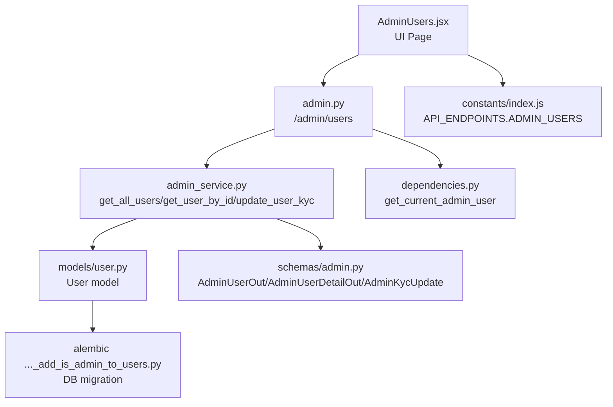
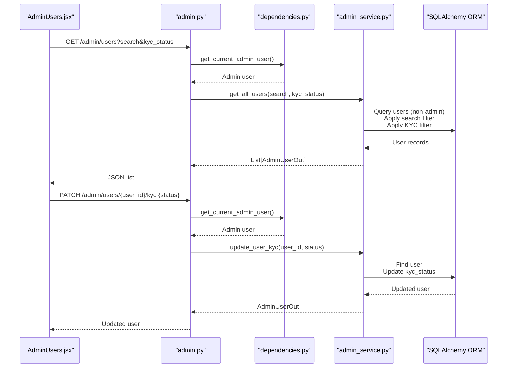
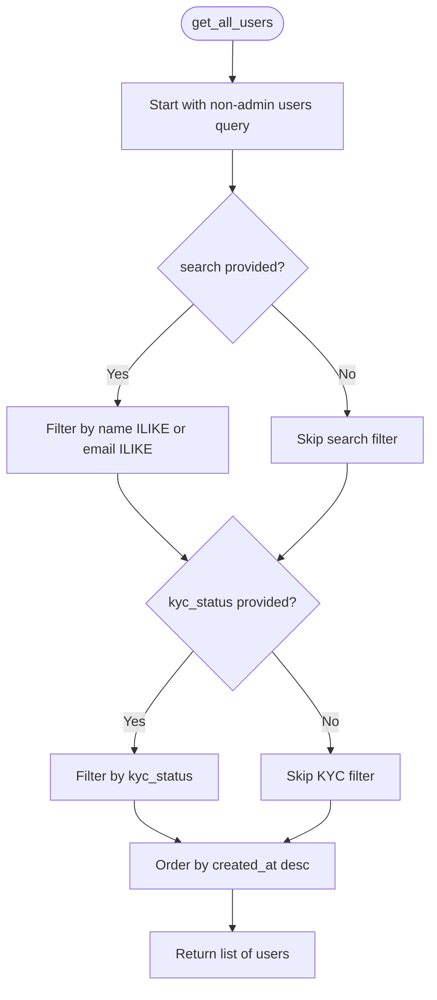
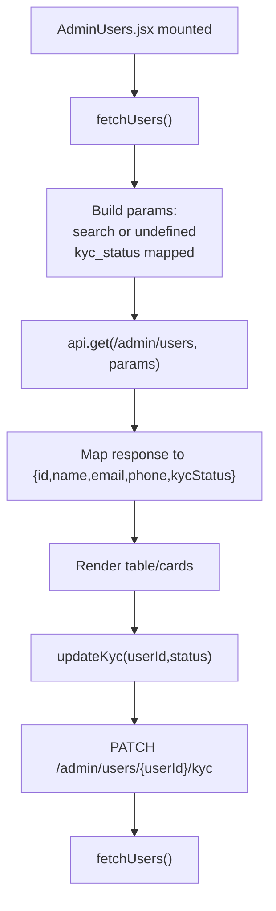
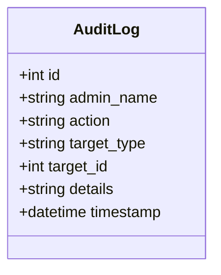
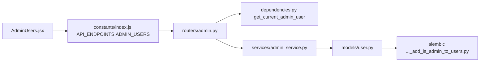

# User Management

<cite>
**Referenced Files in This Document**
- [backend/app/routers/admin.py](file://backend/app/routers/admin.py)
- [backend/app/services/admin_service.py](file://backend/app/services/admin_service.py)
- [backend/app/models/user.py](file://backend/app/models/user.py)
- [backend/app/schemas/admin.py](file://backend/app/schemas/admin.py)
- [backend/app/schemas/kyc_schema.py](file://backend/app/schemas/kyc_schema.py)
- [backend/app/dependencies.py](file://backend/app/dependencies.py)
- [backend/app/models/audit_log.py](file://backend/app/models/audit_log.py)
- [backend/alembic/versions/e4b6b665cae9_add_is_admin_to_users.py](file://backend/alembic/versions/e4b6b665cae9_add_is_admin_to_users.py)
- [frontend/src/pages/admin/AdminUsers.jsx](file://frontend/src/pages/admin/AdminUsers.jsx)
- [frontend/src/constants/index.js](file://frontend/src/constants/index.js)
</cite>

## Table of Contents
1. [Introduction](#introduction)
2. [Project Structure](#project-structure)
3. [Core Components](#core-components)
4. [Architecture Overview](#architecture-overview)
5. [Detailed Component Analysis](#detailed-component-analysis)
6. [Dependency Analysis](#dependency-analysis)
7. [Performance Considerations](#performance-considerations)
8. [Troubleshooting Guide](#troubleshooting-guide)
9. [Conclusion](#conclusion)
10. [Appendices](#appendices)

## Introduction
This document describes the admin user management capabilities of the Modern Digital Banking Dashboard. It covers user listing with search and filtering, user profile viewing, KYC status updates, and administrative controls. It also outlines account lifecycle operations (activation, suspension, deletion), user activity monitoring, and privacy/compliance considerations for administrative actions.

## Project Structure
The user management feature spans backend API routes, services, models, and schemas, and a React-based admin UI page. The backend enforces admin-only access and applies filters for search and KYC status. The frontend provides a responsive table and mobile card views with live updates after KYC changes.



**Diagram sources**
- [frontend/src/pages/admin/AdminUsers.jsx:1-256](file://frontend/src/pages/admin/AdminUsers.jsx#L1-L256)
- [backend/app/routers/admin.py:1-45](file://backend/app/routers/admin.py#L1-L45)
- [backend/app/services/admin_service.py:1-63](file://backend/app/services/admin_service.py#L1-L63)
- [backend/app/models/user.py:1-65](file://backend/app/models/user.py#L1-L65)
- [backend/app/schemas/admin.py:1-41](file://backend/app/schemas/admin.py#L1-L41)
- [backend/app/dependencies.py:1-69](file://backend/app/dependencies.py#L1-L69)
- [backend/alembic/versions/e4b6b665cae9_add_is_admin_to_users.py:1-151](file://backend/alembic/versions/e4b6b665cae9_add_is_admin_to_users.py#L1-L151)
- [frontend/src/constants/index.js:119-132](file://frontend/src/constants/index.js#L119-L132)

**Section sources**
- [backend/app/routers/admin.py:1-45](file://backend/app/routers/admin.py#L1-L45)
- [frontend/src/pages/admin/AdminUsers.jsx:1-256](file://frontend/src/pages/admin/AdminUsers.jsx#L1-L256)
- [frontend/src/constants/index.js:119-132](file://frontend/src/constants/index.js#L119-L132)

## Core Components
- Admin user listing endpoint with optional search and KYC status filtering.
- Single user retrieval endpoint for detailed profile view.
- KYC status update endpoint for administrators.
- Admin-only access enforcement via dependency checks.
- Frontend UI with search bar, KYC filter dropdown, and tabular/mobile views.

Key implementation references:
- Backend routes: [backend/app/routers/admin.py:14-44](file://backend/app/routers/admin.py#L14-L44)
- Service logic: [backend/app/services/admin_service.py:38-62](file://backend/app/services/admin_service.py#L38-L62)
- Admin-only dependency: [backend/app/dependencies.py:60-68](file://backend/app/dependencies.py#L60-L68)
- Frontend listing page: [frontend/src/pages/admin/AdminUsers.jsx:29-59](file://frontend/src/pages/admin/AdminUsers.jsx#L29-L59)

**Section sources**
- [backend/app/routers/admin.py:14-44](file://backend/app/routers/admin.py#L14-L44)
- [backend/app/services/admin_service.py:38-62](file://backend/app/services/admin_service.py#L38-L62)
- [backend/app/dependencies.py:60-68](file://backend/app/dependencies.py#L60-L68)
- [frontend/src/pages/admin/AdminUsers.jsx:29-59](file://frontend/src/pages/admin/AdminUsers.jsx#L29-L59)

## Architecture Overview
The admin user management flow is centered around an admin-only API surface. Requests are validated for admin privileges, then filtered and queried against the User model. Responses are serialized via Pydantic schemas. The frontend triggers requests with search and KYC filter parameters and renders the results.



**Diagram sources**
- [frontend/src/pages/admin/AdminUsers.jsx:29-59](file://frontend/src/pages/admin/AdminUsers.jsx#L29-L59)
- [backend/app/routers/admin.py:14-44](file://backend/app/routers/admin.py#L14-L44)
- [backend/app/dependencies.py:60-68](file://backend/app/dependencies.py#L60-L68)
- [backend/app/services/admin_service.py:38-62](file://backend/app/services/admin_service.py#L38-L62)

## Detailed Component Analysis

### Backend Routes: Admin User Management
- GET /admin/users
  - Query parameters: search (optional), kyc_status (optional)
  - Returns: List of AdminUserOut
  - Filters: applied via service layer
- GET /admin/users/{user_id}
  - Returns: AdminUserDetailOut
- PATCH /admin/users/{user_id}/kyc
  - Request body: AdminKycUpdate
  - Returns: AdminUserOut

Operational notes:
- Admin-only access enforced by dependency.
- Non-admin users are excluded from listings.
- Sorting by creation date descending.

**Section sources**
- [backend/app/routers/admin.py:14-44](file://backend/app/routers/admin.py#L14-L44)
- [backend/app/schemas/admin.py:13-41](file://backend/app/schemas/admin.py#L13-L41)
- [backend/app/dependencies.py:60-68](file://backend/app/dependencies.py#L60-L68)

### Service Layer: Filtering and Updates
- get_all_users
  - Builds base query excluding admin users
  - Applies ILIKE search on name or email
  - Applies exact match on KYC status
  - Orders by created_at desc
- get_user_by_id
  - Returns user or raises 404
- update_user_kyc
  - Finds user by ID, updates KYC status, commits and refreshes



**Diagram sources**
- [backend/app/services/admin_service.py:38-46](file://backend/app/services/admin_service.py#L38-L46)

**Section sources**
- [backend/app/services/admin_service.py:10-62](file://backend/app/services/admin_service.py#L10-L62)

### Data Model: User and KYC Status
- User model includes:
  - Identity fields: id, name, email, phone
  - Security fields: password, reset_token, reset_token_expiry
  - KYC status enum: unverified, verified, rejected
  - Administrative flag: is_admin
  - Metadata: created_at, last_login
- KYCStatus enum used in models aligns with service logic.

```mermaid
classDiagram
class User {
+int id
+string name
+string email
+string phone
+boolean is_admin
+date dob
+string address
+string pin_code
+KYCStatus kyc_status
+datetime created_at
+datetime last_login
}
class KYCStatus {
<<enum>>
"unverified"
"verified"
"rejected"
}
User --> KYCStatus : "has"
```

**Diagram sources**
- [backend/app/models/user.py:31-58](file://backend/app/models/user.py#L31-L58)

**Section sources**
- [backend/app/models/user.py:31-58](file://backend/app/models/user.py#L31-L58)

### Frontend: Admin Users Page
- Provides:
  - Search input for name/email
  - KYC status filter dropdown (All, Pending, Approved, Rejected)
  - Tabular desktop view and mobile card view
  - Live refresh after updating KYC status
- Maps backend kyc_status values to uppercase badges.



**Diagram sources**
- [frontend/src/pages/admin/AdminUsers.jsx:29-59](file://frontend/src/pages/admin/AdminUsers.jsx#L29-L59)
- [frontend/src/pages/admin/AdminUsers.jsx:18-27](file://frontend/src/pages/admin/AdminUsers.jsx#L18-L27)

**Section sources**
- [frontend/src/pages/admin/AdminUsers.jsx:12-59](file://frontend/src/pages/admin/AdminUsers.jsx#L12-L59)

### Administrative Controls and Access
- Admin-only access enforced by dependency that validates JWT and checks is_admin.
- On failure, returns 403 Forbidden.

**Section sources**
- [backend/app/dependencies.py:60-68](file://backend/app/dependencies.py#L60-L68)

### Audit Logging and Compliance
- Audit log model captures admin actions with target type/id and details.
- Recommended practice: record user KYC updates with admin name, action, target user id, and new status for compliance.



**Diagram sources**
- [backend/app/models/audit_log.py:6-18](file://backend/app/models/audit_log.py#L6-L18)

**Section sources**
- [backend/app/models/audit_log.py:1-19](file://backend/app/models/audit_log.py#L1-L19)

## Dependency Analysis
- Frontend depends on centralized API endpoints constant for /admin/users.
- Backend routes depend on admin-only dependency and admin service.
- Admin service depends on SQLAlchemy ORM and User model.
- Database migration adds is_admin and last_login columns to users table.



**Diagram sources**
- [frontend/src/pages/admin/AdminUsers.jsx:3-4](file://frontend/src/pages/admin/AdminUsers.jsx#L3-L4)
- [frontend/src/constants/index.js](file://frontend/src/constants/index.js#L121)
- [backend/app/routers/admin.py:1-45](file://backend/app/routers/admin.py#L1-L45)
- [backend/app/dependencies.py:1-69](file://backend/app/dependencies.py#L1-L69)
- [backend/app/services/admin_service.py:1-63](file://backend/app/services/admin_service.py#L1-L63)
- [backend/app/models/user.py:1-65](file://backend/app/models/user.py#L1-L65)
- [backend/alembic/versions/e4b6b665cae9_add_is_admin_to_users.py:124-126](file://backend/alembic/versions/e4b6b665cae9_add_is_admin_to_users.py#L124-L126)

**Section sources**
- [frontend/src/constants/index.js:119-132](file://frontend/src/constants/index.js#L119-L132)
- [backend/app/routers/admin.py:1-45](file://backend/app/routers/admin.py#L1-L45)
- [backend/app/dependencies.py:1-69](file://backend/app/dependencies.py#L1-L69)
- [backend/app/services/admin_service.py:1-63](file://backend/app/services/admin_service.py#L1-L63)
- [backend/app/models/user.py:1-65](file://backend/app/models/user.py#L1-L65)
- [backend/alembic/versions/e4b6b665cae9_add_is_admin_to_users.py:124-126](file://backend/alembic/versions/e4b6b665cae9_add_is_admin_to_users.py#L124-L126)

## Performance Considerations
- Search uses ILIKE on name and email; consider indexing name and email for large datasets.
- KYC filtering uses exact equality; ensure kyc_status is indexed for efficient filtering.
- Ordering by created_at desc is straightforward; ensure appropriate index coverage.
- Pagination is not implemented in current listing; consider adding limit/offset for large user bases.

## Troubleshooting Guide
- 403 Forbidden when accessing admin endpoints:
  - Cause: Non-admin user or invalid/missing admin token.
  - Resolution: Authenticate as admin; verify token type and claims.
  - Reference: [backend/app/dependencies.py:60-68](file://backend/app/dependencies.py#L60-L68)
- 404 Not Found when retrieving a user:
  - Cause: User does not exist or is admin (excluded from listings).
  - Resolution: Confirm user exists and is not admin; check user_id.
  - Reference: [backend/app/services/admin_service.py:31-35](file://backend/app/services/admin_service.py#L31-L35)
- KYC update fails silently:
  - Cause: Network error or invalid status value.
  - Resolution: Check network tab; ensure status matches backend enum; confirm admin access.
  - References: [frontend/src/pages/admin/AdminUsers.jsx:18-27](file://frontend/src/pages/admin/AdminUsers.jsx#L18-L27), [backend/app/schemas/admin.py:40-41](file://backend/app/schemas/admin.py#L40-L41)

**Section sources**
- [backend/app/dependencies.py:60-68](file://backend/app/dependencies.py#L60-L68)
- [backend/app/services/admin_service.py:31-35](file://backend/app/services/admin_service.py#L31-L35)
- [frontend/src/pages/admin/AdminUsers.jsx:18-27](file://frontend/src/pages/admin/AdminUsers.jsx#L18-L27)
- [backend/app/schemas/admin.py:40-41](file://backend/app/schemas/admin.py#L40-L41)

## Conclusion
The admin user management feature provides secure, filtered listing of non-admin users, detailed profile access, and KYC status updates. The frontend offers intuitive search and filtering, while the backend enforces admin-only access and applies robust filters. For production hardening, consider audit logging for all admin actions, pagination for large datasets, and stricter validation for sensitive operations.

## Appendices

### User Search Criteria
- search: Filters users by name or email using case-insensitive pattern matching.
- kyc_status: Filters by exact KYC status value.

**Section sources**
- [backend/app/services/admin_service.py:14-22](file://backend/app/services/admin_service.py#L14-L22)
- [backend/app/services/admin_service.py:25-28](file://backend/app/services/admin_service.py#L25-L28)
- [frontend/src/pages/admin/AdminUsers.jsx:33-38](file://frontend/src/pages/admin/AdminUsers.jsx#L33-L38)

### KYC Status Filtering
- Frontend maps UI statuses to backend values before sending requests.
- Backend applies exact match filtering on kyc_status.

**Section sources**
- [frontend/src/pages/admin/AdminUsers.jsx:6-10](file://frontend/src/pages/admin/AdminUsers.jsx#L6-L10)
- [frontend/src/pages/admin/AdminUsers.jsx:33-38](file://frontend/src/pages/admin/AdminUsers.jsx#L33-L38)
- [backend/app/services/admin_service.py:25-28](file://backend/app/services/admin_service.py#L25-L28)

### User Activity Monitoring
- created_at is exposed in user detail schema for sorting and monitoring.
- last_login is stored in the User model; can be used for activity insights.

**Section sources**
- [backend/app/schemas/admin.py:28-37](file://backend/app/schemas/admin.py#L28-L37)
- [backend/app/models/user.py:53-58](file://backend/app/models/user.py#L53-L58)

### Administrative Controls and Bulk Operations
- Current endpoints support per-user KYC updates.
- Bulk operations (e.g., batch KYC updates) are not present in the current codebase.

**Section sources**
- [backend/app/routers/admin.py:33-44](file://backend/app/routers/admin.py#L33-L44)

### Account Lifecycle Operations
- Activation/Suspension/Delete:
  - Not implemented in the current codebase.
  - Recommended approach: Add endpoints for update_user_status and delete_user, enforce admin-only access, and log all actions via AuditLog.

[No sources needed since this section provides general guidance]

### Privacy and Compliance Considerations
- Log all admin actions (e.g., KYC updates) with target type/id and details.
- Limit exposure of sensitive fields in admin responses.
- Enforce strict admin-only access for all user-related admin endpoints.

**Section sources**
- [backend/app/models/audit_log.py:6-18](file://backend/app/models/audit_log.py#L6-L18)
- [backend/app/dependencies.py:60-68](file://backend/app/dependencies.py#L60-L68)