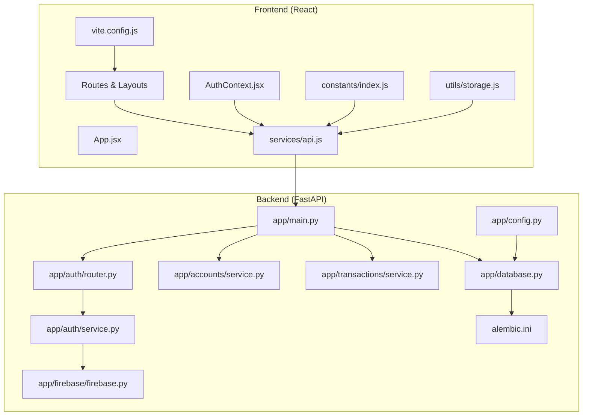
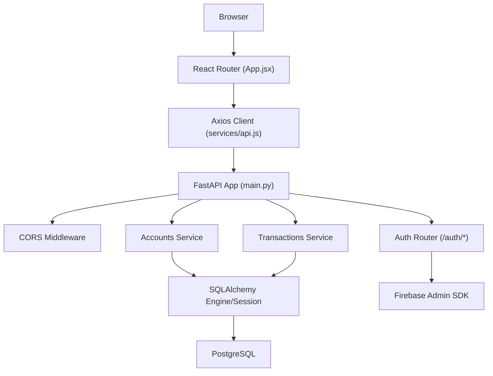
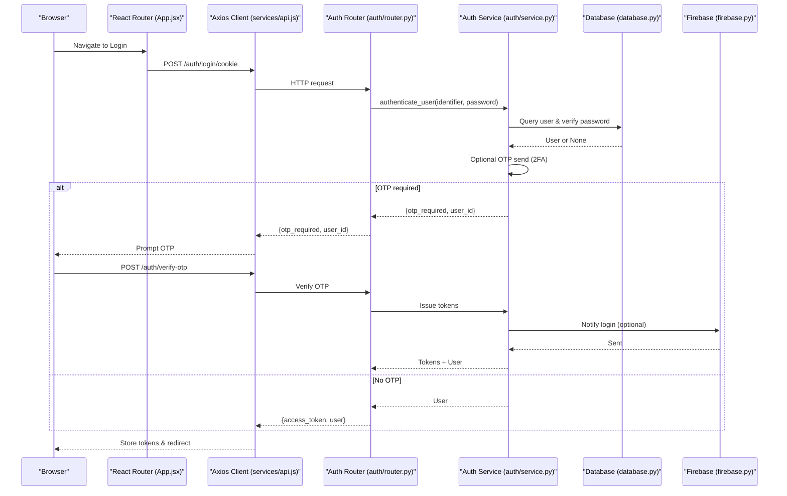
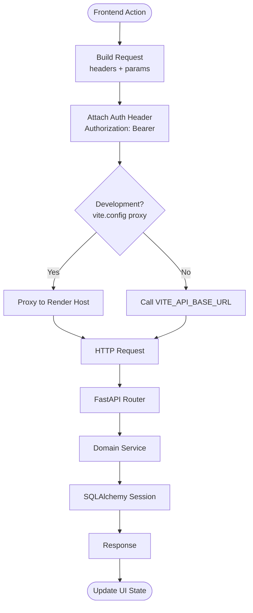
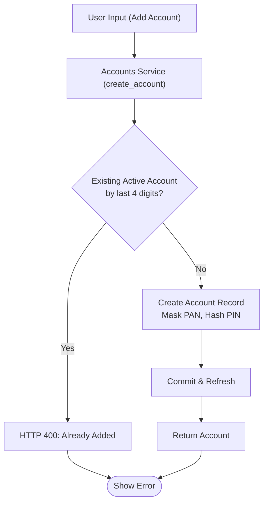
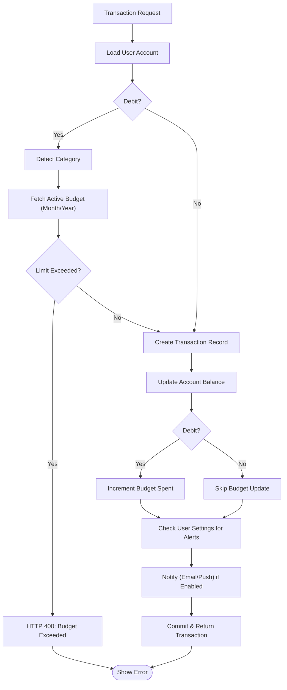
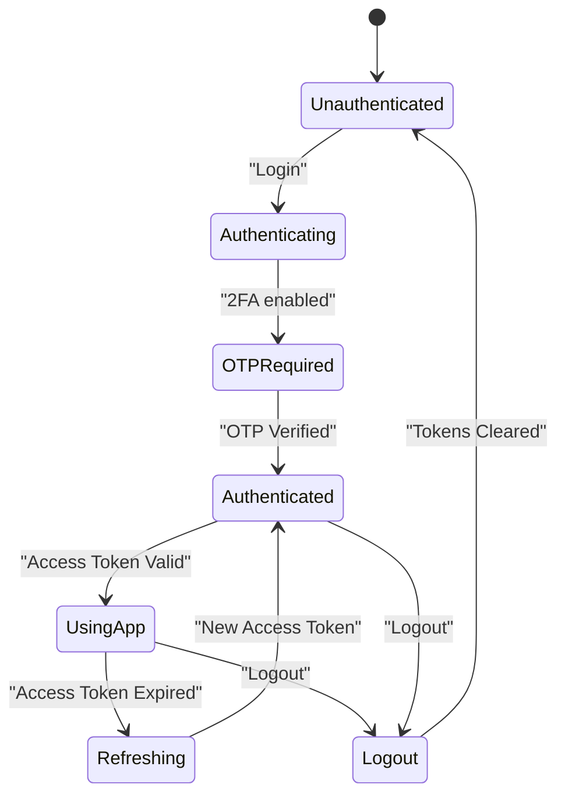
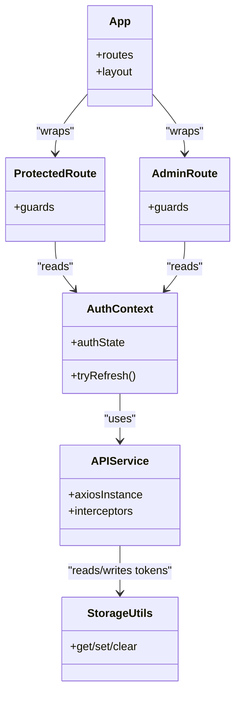
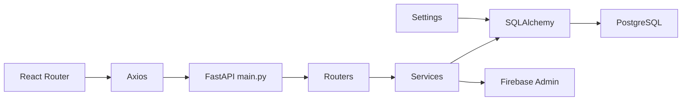

# Architecture Overview

<cite>
**Referenced Files in This Document**
- [README.md](file://README.md)
- [backend/app/main.py](file://backend/app/main.py)
- [backend/app/config.py](file://backend/app/config.py)
- [backend/app/database.py](file://backend/app/database.py)
- [backend/app/auth/router.py](file://backend/app/auth/router.py)
- [backend/app/auth/service.py](file://backend/app/auth/service.py)
- [backend/app/accounts/service.py](file://backend/app/accounts/service.py)
- [backend/app/transactions/service.py](file://backend/app/transactions/service.py)
- [backend/app/firebase/firebase.py](file://backend/app/firebase/firebase.py)
- [frontend/src/App.jsx](file://frontend/src/App.jsx)
- [frontend/src/services/api.js](file://frontend/src/services/api.js)
- [frontend/src/constants/index.js](file://frontend/src/constants/index.js)
- [frontend/src/context/AuthContext.jsx](file://frontend/src/context/AuthContext.jsx)
- [frontend/src/utils/storage.js](file://frontend/src/utils/storage.js)
- [frontend/vite.config.js](file://frontend/vite.config.js)
- [backend/alembic.ini](file://backend/alembic.ini)
</cite>

## Table of Contents
1. [Introduction](#introduction)
2. [Project Structure](#project-structure)
3. [Core Components](#core-components)
4. [Architecture Overview](#architecture-overview)
5. [Detailed Component Analysis](#detailed-component-analysis)
6. [Dependency Analysis](#dependency-analysis)
7. [Performance Considerations](#performance-considerations)
8. [Troubleshooting Guide](#troubleshooting-guide)
9. [Conclusion](#conclusion)
10. [Appendices](#appendices)

## Introduction
This document presents the architecture of the Modern Digital Banking Dashboard, a full-stack banking application with a React frontend and a FastAPI backend. The system integrates user authentication, account and transaction management, budgeting, bill payments, rewards, financial insights, alerts, and push notifications. It follows a layered architecture with clear separation of concerns across frontend routing, API orchestration, business logic services, and persistent data storage. Cross-cutting concerns include security (JWT, OTP, PIN verification), observability, and operational scalability.

## Project Structure
The repository is organized into two primary directories:
- frontend: React application with Vite, routing, context providers, and API service layer
- backend: FastAPI application with routers, services, models, utilities, and Alembic migrations

**Diagram sources**
- [frontend/src/App.jsx:78-168](file://frontend/src/App.jsx#L78-L168)
- [frontend/src/services/api.js:19-31](file://frontend/src/services/api.js#L19-L31)
- [frontend/src/constants/index.js:64-132](file://frontend/src/constants/index.js#L64-L132)
- [frontend/src/context/AuthContext.jsx:23-46](file://frontend/src/context/AuthContext.jsx#L23-L46)
- [frontend/src/utils/storage.js:81-92](file://frontend/src/utils/storage.js#L81-L92)
- [frontend/vite.config.js:22-29](file://frontend/vite.config.js#L22-L29)
- [backend/app/main.py:56-89](file://backend/app/main.py#L56-L89)
- [backend/app/config.py:57-72](file://backend/app/config.py#L57-L72)
- [backend/app/database.py:29-50](file://backend/app/database.py#L29-L50)
- [backend/app/auth/router.py:21-26](file://backend/app/auth/router.py#L21-L26)
- [backend/app/auth/service.py:43-54](file://backend/app/auth/service.py#L43-L54)
- [backend/app/accounts/service.py:55-75](file://backend/app/accounts/service.py#L55-L75)
- [backend/app/transactions/service.py:105-149](file://backend/app/transactions/service.py#L105-L149)
- [backend/app/firebase/firebase.py:7-17](file://backend/app/firebase/firebase.py#L7-L17)
- [backend/alembic.ini:1-37](file://backend/alembic.ini#L1-L37)

**Section sources**
- [README.md:24-73](file://README.md#L24-L73)
- [backend/app/main.py:56-89](file://backend/app/main.py#L56-L89)
- [frontend/src/App.jsx:78-168](file://frontend/src/App.jsx#L78-L168)

## Core Components
- Frontend
  - Routing and layout: centralized in the main application component with protected and admin routes
  - API service: Axios-based client with automatic bearer token injection
  - Context: global authentication state management
  - Utilities: storage abstraction for tokens and user data
  - Constants: route and endpoint definitions
- Backend
  - Application entry: FastAPI app registration and CORS configuration
  - Configuration: environment-driven settings for database and JWT
  - Database: SQLAlchemy engine/session and declarative base
  - Authentication: login, registration, OTP, and token issuance
  - Services: business logic for accounts, transactions, and related workflows
  - Integrations: Firebase for push notifications

**Section sources**
- [frontend/src/App.jsx:78-168](file://frontend/src/App.jsx#L78-L168)
- [frontend/src/services/api.js:19-31](file://frontend/src/services/api.js#L19-L31)
- [frontend/src/context/AuthContext.jsx:23-46](file://frontend/src/context/AuthContext.jsx#L23-L46)
- [frontend/src/utils/storage.js:81-92](file://frontend/src/utils/storage.js#L81-L92)
- [frontend/src/constants/index.js:64-132](file://frontend/src/constants/index.js#L64-L132)
- [backend/app/main.py:56-89](file://backend/app/main.py#L56-L89)
- [backend/app/config.py:57-72](file://backend/app/config.py#L57-L72)
- [backend/app/database.py:29-50](file://backend/app/database.py#L29-L50)
- [backend/app/auth/router.py:21-26](file://backend/app/auth/router.py#L21-L26)
- [backend/app/auth/service.py:43-54](file://backend/app/auth/service.py#L43-L54)
- [backend/app/accounts/service.py:55-75](file://backend/app/accounts/service.py#L55-L75)
- [backend/app/transactions/service.py:105-149](file://backend/app/transactions/service.py#L105-L149)
- [backend/app/firebase/firebase.py:7-17](file://backend/app/firebase/firebase.py#L7-L17)

## Architecture Overview
The system follows a classic layered architecture:
- Presentation Layer (React): handles UI, routing, state, and API communication
- API Gateway/Entry (FastAPI): central endpoint registration, middleware, and CORS
- Domain Services (FastAPI): business logic encapsulated per domain (accounts, transactions, auth)
- Persistence (PostgreSQL): data stored with SQLAlchemy ORM and managed via Alembic migrations
- Integrations: Firebase for push notifications; SMTP for OTP emails

**Diagram sources**
- [frontend/src/App.jsx:78-168](file://frontend/src/App.jsx#L78-L168)
- [frontend/src/services/api.js:19-31](file://frontend/src/services/api.js#L19-L31)
- [backend/app/main.py:56-89](file://backend/app/main.py#L56-L89)
- [backend/app/auth/router.py:21-26](file://backend/app/auth/router.py#L21-L26)
- [backend/app/accounts/service.py:55-75](file://backend/app/accounts/service.py#L55-L75)
- [backend/app/transactions/service.py:105-149](file://backend/app/transactions/service.py#L105-L149)
- [backend/app/database.py:29-50](file://backend/app/database.py#L29-L50)
- [backend/app/firebase/firebase.py:7-17](file://backend/app/firebase/firebase.py#L7-L17)

## Detailed Component Analysis

### Authentication Flow
The authentication flow supports cookie-based login, OTP verification, and JWT issuance. The frontend stores tokens and attaches Authorization headers automatically.

**Diagram sources**
- [frontend/src/App.jsx:78-168](file://frontend/src/App.jsx#L78-L168)
- [frontend/src/services/api.js:19-31](file://frontend/src/services/api.js#L19-L31)
- [backend/app/auth/router.py:104-139](file://backend/app/auth/router.py#L104-L139)
- [backend/app/auth/service.py:205-224](file://backend/app/auth/service.py#L205-L224)
- [backend/app/database.py:45-50](file://backend/app/database.py#L45-L50)
- [backend/app/firebase/firebase.py:20-28](file://backend/app/firebase/firebase.py#L20-L28)

**Section sources**
- [backend/app/auth/router.py:104-139](file://backend/app/auth/router.py#L104-L139)
- [backend/app/auth/service.py:205-224](file://backend/app/auth/service.py#L205-L224)
- [frontend/src/services/api.js:19-31](file://frontend/src/services/api.js#L19-L31)
- [frontend/src/context/AuthContext.jsx:26-42](file://frontend/src/context/AuthContext.jsx#L26-L42)

### API Communication Protocol
- Base URL: configured in the frontend and proxied during development
- Token handling: Authorization header with Bearer token injected by the Axios interceptor
- Endpoint definitions: centralized constants for routes and API endpoints
- CORS: configured in the backend with environment override

**Diagram sources**
- [frontend/vite.config.js:22-29](file://frontend/vite.config.js#L22-L29)
- [frontend/src/services/api.js:19-31](file://frontend/src/services/api.js#L19-L31)
- [frontend/src/constants/index.js:64-132](file://frontend/src/constants/index.js#L64-L132)
- [backend/app/main.py:91-109](file://backend/app/main.py#L91-L109)

**Section sources**
- [frontend/vite.config.js:22-29](file://frontend/vite.config.js#L22-L29)
- [frontend/src/services/api.js:19-31](file://frontend/src/services/api.js#L19-L31)
- [frontend/src/constants/index.js:64-132](file://frontend/src/constants/index.js#L64-L132)
- [backend/app/main.py:91-109](file://backend/app/main.py#L91-L109)

### Data Flow: Account Creation and PIN Verification
The accounts service enforces uniqueness by last digits, masks PAN-like numbers, and requires PIN verification for sensitive operations.

**Diagram sources**
- [backend/app/accounts/service.py:55-75](file://backend/app/accounts/service.py#L55-L75)

**Section sources**
- [backend/app/accounts/service.py:55-75](file://backend/app/accounts/service.py#L55-L75)

### Data Flow: Transaction Processing and Budget Validation
The transactions service validates budgets, updates balances, and notifies users based on settings.

**Diagram sources**
- [backend/app/transactions/service.py:105-149](file://backend/app/transactions/service.py#L105-L149)

**Section sources**
- [backend/app/transactions/service.py:105-149](file://backend/app/transactions/service.py#L105-L149)

### State Management Across the Full-Stack Application
- Frontend state: React Context manages user and access token; local storage persists tokens and user data
- Backend state: FastAPI app lifecycle initializes integrations; database sessions scoped per request
- Token lifecycle: Access tokens are short-lived; refresh token handling occurs via a dedicated endpoint

**Diagram sources**
- [frontend/src/context/AuthContext.jsx:26-42](file://frontend/src/context/AuthContext.jsx#L26-L42)
- [frontend/src/utils/storage.js:94-99](file://frontend/src/utils/storage.js#L94-L99)
- [backend/app/auth/router.py:122-139](file://backend/app/auth/router.py#L122-L139)

**Section sources**
- [frontend/src/context/AuthContext.jsx:26-42](file://frontend/src/context/AuthContext.jsx#L26-L42)
- [frontend/src/utils/storage.js:94-99](file://frontend/src/utils/storage.js#L94-L99)
- [backend/app/auth/router.py:122-139](file://backend/app/auth/router.py#L122-L139)

### Component Interactions
- Routing and guards: ProtectedRoute and AdminRoute wrap page components
- API layer: services/api.js centralizes HTTP calls and interceptors
- Context: AuthContext coordinates token refresh and exposes user state
- Constants: centralized route and endpoint definitions

**Diagram sources**
- [frontend/src/App.jsx:78-168](file://frontend/src/App.jsx#L78-L168)
- [frontend/src/context/AuthContext.jsx:23-46](file://frontend/src/context/AuthContext.jsx#L23-L46)
- [frontend/src/services/api.js:19-31](file://frontend/src/services/api.js#L19-L31)
- [frontend/src/utils/storage.js:81-92](file://frontend/src/utils/storage.js#L81-L92)

**Section sources**
- [frontend/src/App.jsx:78-168](file://frontend/src/App.jsx#L78-L168)
- [frontend/src/context/AuthContext.jsx:23-46](file://frontend/src/context/AuthContext.jsx#L23-L46)
- [frontend/src/services/api.js:19-31](file://frontend/src/services/api.js#L19-L31)
- [frontend/src/utils/storage.js:81-92](file://frontend/src/utils/storage.js#L81-L92)

## Dependency Analysis
- Frontend depends on:
  - React Router for navigation
  - Axios for HTTP requests
  - Local storage for persistence
  - Firebase for push notifications (configured in the app)
- Backend depends on:
  - FastAPI for routing and ASGI server
  - SQLAlchemy for ORM and sessions
  - Pydantic settings for environment configuration
  - Alembic for migrations
  - Firebase Admin SDK for push notifications

**Diagram sources**
- [frontend/src/App.jsx:78-168](file://frontend/src/App.jsx#L78-L168)
- [frontend/src/services/api.js:19-31](file://frontend/src/services/api.js#L19-L31)
- [backend/app/main.py:56-89](file://backend/app/main.py#L56-L89)
- [backend/app/database.py:29-50](file://backend/app/database.py#L29-L50)
- [backend/app/config.py:57-72](file://backend/app/config.py#L57-L72)
- [backend/app/firebase/firebase.py:7-17](file://backend/app/firebase/firebase.py#L7-L17)

**Section sources**
- [backend/app/main.py:56-89](file://backend/app/main.py#L56-L89)
- [backend/app/database.py:29-50](file://backend/app/database.py#L29-L50)
- [backend/app/config.py:57-72](file://backend/app/config.py#L57-L72)
- [backend/alembic.ini:1-37](file://backend/alembic.ini#L1-L37)

## Performance Considerations
- Database pooling and pre-ping: configured in the database layer to improve connection reliability
- Request-scoped sessions: ensures proper resource cleanup and isolation
- Lightweight interceptors: minimal overhead for token injection
- Environment-driven CORS: flexible origins configuration for production deployments
- Recommendations:
  - Enable connection pooling and monitor pool exhaustion
  - Use pagination for large datasets (transactions, admin analytics)
  - Cache non-sensitive data (e.g., static lists) on the frontend
  - Offload heavy computations to background tasks if needed

[No sources needed since this section provides general guidance]

## Troubleshooting Guide
- Authentication failures:
  - Verify environment variables for JWT secrets and database URL
  - Confirm OTP delivery via SMTP and Firebase credentials
- CORS errors:
  - Ensure allowed origins include frontend host and Vercel domains
- Database connectivity:
  - Check DATABASE_URL and network access to the hosted PostgreSQL instance
- Token issues:
  - Confirm token storage keys and interceptor usage
  - Validate token expiration and refresh flow

**Section sources**
- [backend/app/config.py:57-72](file://backend/app/config.py#L57-L72)
- [backend/app/auth/router.py:24-31](file://backend/app/auth/router.py#L24-L31)
- [backend/app/database.py:29-50](file://backend/app/database.py#L29-L50)
- [frontend/src/utils/storage.js:81-92](file://frontend/src/utils/storage.js#L81-L92)
- [frontend/src/services/api.js:19-31](file://frontend/src/services/api.js#L19-L31)

## Conclusion
The Modern Digital Banking Dashboard employs a clean separation of concerns with a React frontend and a FastAPI backend. The architecture emphasizes security (JWT, OTP, PIN verification), maintainability (layered services, centralized configuration), and scalability (SQLAlchemy, Alembic, and cloud-hosted PostgreSQL). With robust authentication, state management, and integration points, the system provides a solid foundation for further enhancements and production deployment.

[No sources needed since this section summarizes without analyzing specific files]

## Appendices

### System Boundaries and Integration Points
- Internal boundaries:
  - Frontend: UI, routing, context, and API layer
  - Backend: routers, services, models, and utilities
- External integrations:
  - PostgreSQL (Neon cloud)
  - Firebase Admin SDK (push notifications)
  - SMTP (OTP delivery)

**Section sources**
- [README.md:112-141](file://README.md#L112-L141)
- [backend/app/firebase/firebase.py:7-17](file://backend/app/firebase/firebase.py#L7-L17)
- [backend/app/config.py:57-72](file://backend/app/config.py#L57-L72)

### Infrastructure Requirements and Deployment Topology
- Frontend: Vercel deployment with SPA routing support
- Backend: Render hosting with PostgreSQL on Neon cloud
- Environment variables: database credentials, JWT secrets, SMTP, and Firebase credentials

**Section sources**
- [README.md:317-333](file://README.md#L317-L333)
- [README.md:278-314](file://README.md#L278-L314)