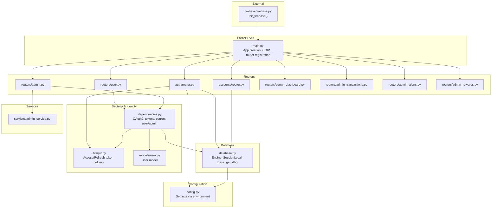
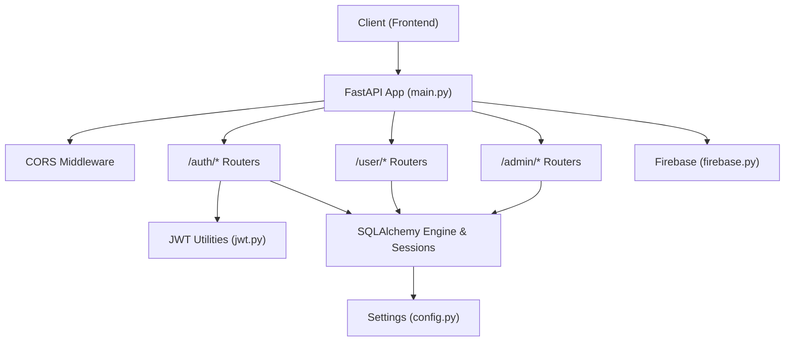
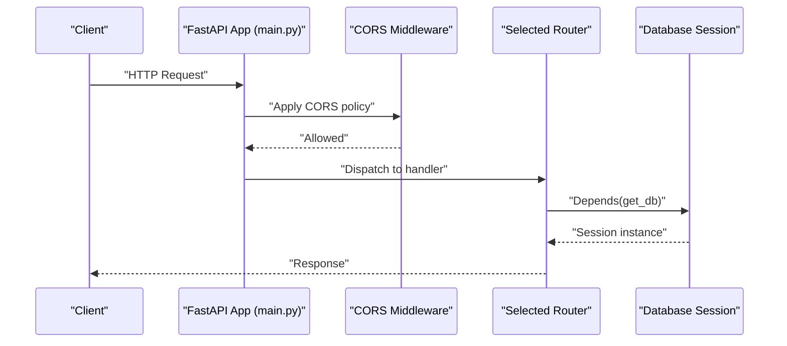
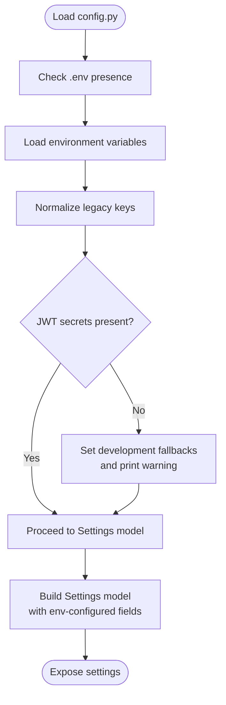
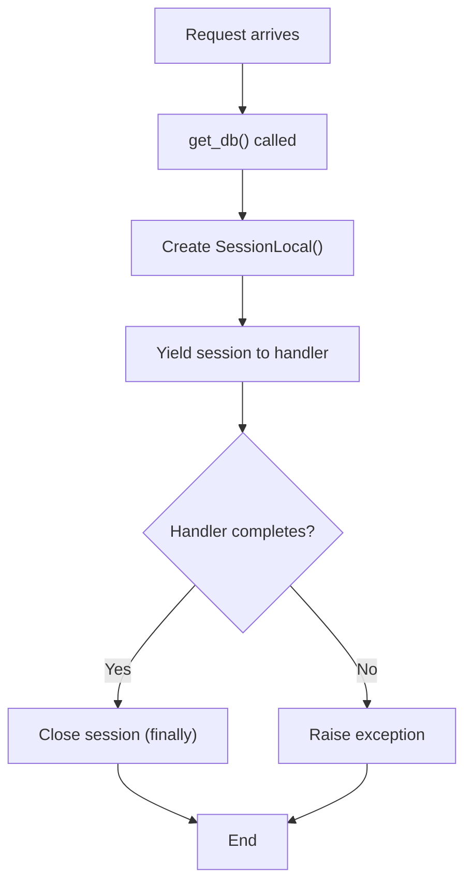
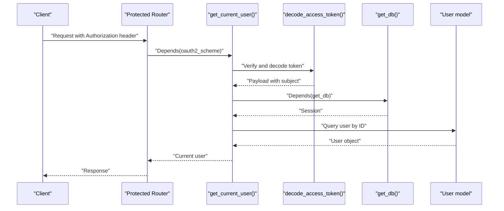
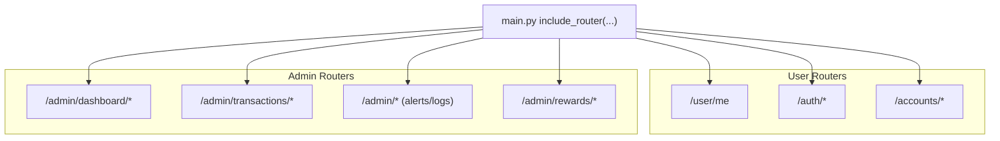
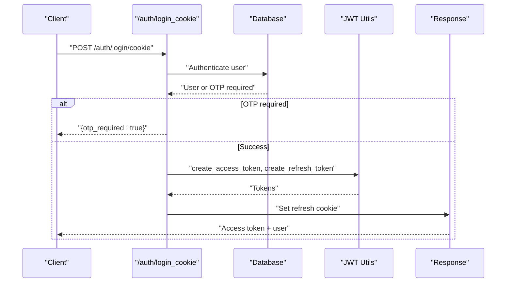
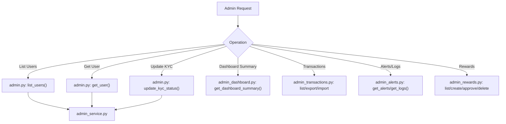
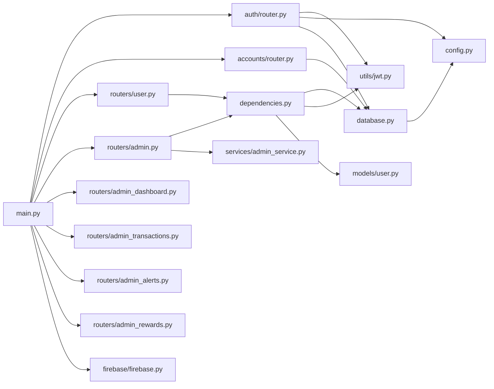

# Application Structure

<cite>
**Referenced Files in This Document**
- [main.py](file://backend/app/main.py)
- [config.py](file://backend/app/config.py)
- [database.py](file://backend/app/database.py)
- [dependencies.py](file://backend/app/dependencies.py)
- [user.py](file://backend/app/routers/user.py)
- [admin.py](file://backend/app/routers/admin.py)
- [router.py](file://backend/app/auth/router.py)
- [router.py](file://backend/app/accounts/router.py)
- [jwt.py](file://backend/app/utils/jwt.py)
- [user.py](file://backend/app/models/user.py)
- [admin_service.py](file://backend/app/services/admin_service.py)
- [firebase.py](file://backend/app/firebase/firebase.py)
- [admin_dashboard.py](file://backend/app/routers/admin_dashboard.py)
- [admin_transactions.py](file://backend/app/routers/admin_transactions.py)
- [admin_alerts.py](file://backend/app/routers/admin_alerts.py)
- [admin_rewards.py](file://backend/app/routers/admin_rewards.py)
</cite>

## Table of Contents
1. [Introduction](#introduction)
2. [Project Structure](#project-structure)
3. [Core Components](#core-components)
4. [Architecture Overview](#architecture-overview)
5. [Detailed Component Analysis](#detailed-component-analysis)
6. [Dependency Analysis](#dependency-analysis)
7. [Performance Considerations](#performance-considerations)
8. [Troubleshooting Guide](#troubleshooting-guide)
9. [Conclusion](#conclusion)

## Introduction
This document explains the FastAPI application structure and initialization for the Modern Digital Banking Dashboard backend. It covers the application entry point, router registration, middleware configuration (including CORS), dependency injection, database session management, startup/shutdown procedures, modular router organization (user-facing and administrative endpoints), configuration management via environment variables, and operational aspects such as logging and performance monitoring.

## Project Structure
The backend is organized around a FastAPI application that aggregates modular routers grouped by domain (authentication, accounts, transactions, transfers, budgets, bills, alerts, rewards, insights, exports, settings, devices, and administrative dashboards). Configuration and database layers are centralized and consumed by routers and services.

**Diagram sources**
- [main.py](file://backend/app/main.py)
- [config.py](file://backend/app/config.py)
- [database.py](file://backend/app/database.py)
- [dependencies.py](file://backend/app/dependencies.py)
- [jwt.py](file://backend/app/utils/jwt.py)
- [user.py](file://backend/app/models/user.py)
- [admin_service.py](file://backend/app/services/admin_service.py)
- [firebase.py](file://backend/app/firebase/firebase.py)
- [router.py](file://backend/app/auth/router.py)
- [router.py](file://backend/app/accounts/router.py)
- [user.py](file://backend/app/routers/user.py)
- [admin.py](file://backend/app/routers/admin.py)
- [admin_dashboard.py](file://backend/app/routers/admin_dashboard.py)
- [admin_transactions.py](file://backend/app/routers/admin_transactions.py)
- [admin_alerts.py](file://backend/app/routers/admin_alerts.py)
- [admin_rewards.py](file://backend/app/routers/admin_rewards.py)

**Section sources**
- [main.py](file://backend/app/main.py)
- [config.py](file://backend/app/config.py)
- [database.py](file://backend/app/database.py)
- [dependencies.py](file://backend/app/dependencies.py)

## Core Components
- Application entry point and middleware:
  - FastAPI app instantiation with a descriptive title.
  - Startup event initializes Firebase.
  - CORS middleware configured with default origins and environment override.
  - Router registration for all user-facing and administrative endpoints.
- Configuration management:
  - Centralized settings loaded from environment variables (.env) with safe development fallbacks and normalization.
  - Settings include database URL, JWT secrets, algorithms, and token expiration values.
- Database session management:
  - SQLAlchemy engine and session factory created from settings.
  - Dependency provider yields a scoped database session per request and ensures closure.
- Dependency injection:
  - Shared OAuth2 scheme and token decoding utilities.
  - Current user and admin user dependencies enforce authentication and authorization.
- Modular routers:
  - Authentication, accounts, transfers, transactions, budgets, bills, exports, alerts, rewards, insights, settings, devices.
  - Administrative routers for dashboard, transactions, alerts/logs, and rewards management.

**Section sources**
- [main.py](file://backend/app/main.py)
- [config.py](file://backend/app/config.py)
- [database.py](file://backend/app/database.py)
- [dependencies.py](file://backend/app/dependencies.py)

## Architecture Overview
The application follows a layered architecture:
- Presentation layer: FastAPI routers define endpoints and responses.
- Domain services: Business logic for admin operations and other features.
- Persistence: SQLAlchemy ORM models and sessions.
- Infrastructure: Configuration, JWT utilities, and external integrations (Firebase).

**Diagram sources**
- [main.py](file://backend/app/main.py)
- [config.py](file://backend/app/config.py)
- [database.py](file://backend/app/database.py)
- [jwt.py](file://backend/app/utils/jwt.py)
- [firebase.py](file://backend/app/firebase/firebase.py)
- [router.py](file://backend/app/auth/router.py)
- [user.py](file://backend/app/routers/user.py)
- [admin.py](file://backend/app/routers/admin.py)

## Detailed Component Analysis

### Application Entry Point and Startup
- App creation and metadata:
  - Instantiates FastAPI with a descriptive title.
  - Defines a root endpoint returning a health message.
- Startup event:
  - Initializes Firebase SDK during application startup.
- Router registration:
  - Includes all user-facing routers (auth, accounts, transfers, transactions, budgets, bills, exports, alerts, rewards, insights, devices, settings).
  - Includes administrative routers (admin, admin dashboard, admin transactions, admin alerts, admin rewards).
- CORS configuration:
  - Default allowed origins for local and Vercel-hosted environments.
  - Environment variable override for origins; otherwise falls back to defaults.
  - Allows credentials, all methods, and all headers.

**Diagram sources**
- [main.py](file://backend/app/main.py)
- [database.py](file://backend/app/database.py)

**Section sources**
- [main.py](file://backend/app/main.py)

### Configuration Management
- Environment loading:
  - Loads .env from the backend root early in the process.
  - Normalizes legacy lowercase keys to canonical uppercase keys.
- Defaults and warnings:
  - Provides safe development defaults for JWT secrets and prints warnings when missing.
- Settings model:
  - Strongly typed settings for database URL, JWT secrets, algorithm, access/refresh token expiry.
  - Configures environment file location and allows extra fields.

**Diagram sources**
- [config.py](file://backend/app/config.py)

**Section sources**
- [config.py](file://backend/app/config.py)

### Database Session Management
- Engine and session factory:
  - Creates SQLAlchemy engine using DATABASE_URL from settings.
  - Enables pre-ping for connection health checks.
- Base model:
  - Declarative base for ORM models.
- Dependency provider:
  - get_db() yields a scoped session per request and ensures closure.

**Diagram sources**
- [database.py](file://backend/app/database.py)

**Section sources**
- [database.py](file://backend/app/database.py)

### Dependency Injection and Security
- OAuth2 bearer scheme:
  - Token URL points to the auth login endpoint.
- Token decoding and validation:
  - Decodes access tokens using the configured JWT secret and algorithm.
  - Validates token type and extracts subject (user ID).
- Current user resolution:
  - Resolves the current authenticated user from the database using the validated subject.
- Admin guard:
  - Enforces admin-only access by checking the is_admin flag.

**Diagram sources**
- [dependencies.py](file://backend/app/dependencies.py)
- [jwt.py](file://backend/app/utils/jwt.py)
- [database.py](file://backend/app/database.py)
- [user.py](file://backend/app/models/user.py)

**Section sources**
- [dependencies.py](file://backend/app/dependencies.py)
- [jwt.py](file://backend/app/utils/jwt.py)
- [user.py](file://backend/app/models/user.py)

### Modular Router Organization
- User-facing endpoints:
  - Authentication router (/auth): registration, login, OTP handling.
  - Accounts router (/accounts): CRUD for user accounts, PIN management.
  - Other user routers: transfers, transactions, budgets, bills, exports, alerts, rewards, insights, devices, settings.
  - User profile endpoint (/user/me) protected by current user dependency.
- Administrative endpoints:
  - Admin dashboard summary (/admin/dashboard/summary).
  - Admin transactions: listing, CSV export, CSV import.
  - Admin alerts and logs retrieval.
  - Admin rewards: listing, creation, approval, deletion.

**Diagram sources**
- [main.py](file://backend/app/main.py)
- [user.py](file://backend/app/routers/user.py)
- [admin.py](file://backend/app/routers/admin.py)
- [router.py](file://backend/app/auth/router.py)
- [router.py](file://backend/app/accounts/router.py)
- [admin_dashboard.py](file://backend/app/routers/admin_dashboard.py)
- [admin_transactions.py](file://backend/app/routers/admin_transactions.py)
- [admin_alerts.py](file://backend/app/routers/admin_alerts.py)
- [admin_rewards.py](file://backend/app/routers/admin_rewards.py)

**Section sources**
- [user.py](file://backend/app/routers/user.py)
- [admin.py](file://backend/app/routers/admin.py)
- [router.py](file://backend/app/auth/router.py)
- [router.py](file://backend/app/accounts/router.py)
- [admin_dashboard.py](file://backend/app/routers/admin_dashboard.py)
- [admin_transactions.py](file://backend/app/routers/admin_transactions.py)
- [admin_alerts.py](file://backend/app/routers/admin_alerts.py)
- [admin_rewards.py](file://backend/app/routers/admin_rewards.py)

### Authentication Flow (Cookies and Tokens)
- Cookie-based login:
  - Accepts identifier and password, optionally requiring OTP.
  - Issues access token and sets refresh cookie with secure and samesite attributes derived from environment.
- OTP handling:
  - Sends OTP for password reset and PIN change scenarios.
  - Verifies OTP validity and expiry, then issues token pair.
- Token issuance:
  - Access and refresh tokens generated using configured secrets and algorithm.

**Diagram sources**
- [router.py](file://backend/app/auth/router.py)
- [jwt.py](file://backend/app/utils/jwt.py)

**Section sources**
- [router.py](file://backend/app/auth/router.py)
- [jwt.py](file://backend/app/utils/jwt.py)

### Administrative Operations
- User listing and KYC updates:
  - Admin router supports listing users with optional search and KYC filters, and updating KYC status.
- Dashboard summary:
  - Admin dashboard router returns summary metrics.
- Transactions administration:
  - Fetch filtered transactions, export to CSV, import from CSV.
- Alerts and logs:
  - Retrieve alerts and audit logs with optional filtering.
- Rewards administration:
  - List, create, approve, and delete rewards; normalizes applies_to field.

**Diagram sources**
- [admin.py](file://backend/app/routers/admin.py)
- [admin_dashboard.py](file://backend/app/routers/admin_dashboard.py)
- [admin_transactions.py](file://backend/app/routers/admin_transactions.py)
- [admin_alerts.py](file://backend/app/routers/admin_alerts.py)
- [admin_rewards.py](file://backend/app/routers/admin_rewards.py)
- [admin_service.py](file://backend/app/services/admin_service.py)

**Section sources**
- [admin.py](file://backend/app/routers/admin.py)
- [admin_dashboard.py](file://backend/app/routers/admin_dashboard.py)
- [admin_transactions.py](file://backend/app/routers/admin_transactions.py)
- [admin_alerts.py](file://backend/app/routers/admin_alerts.py)
- [admin_rewards.py](file://backend/app/routers/admin_rewards.py)
- [admin_service.py](file://backend/app/services/admin_service.py)

## Dependency Analysis
- Coupling and cohesion:
  - Routers depend on shared dependencies (current user, admin guard) and database sessions.
  - Services encapsulate business logic and are invoked by routers.
  - Configuration and database layers are consumed by routers and services.
- External dependencies:
  - Firebase initialization is gated by environment configuration.
  - JWT utilities depend on settings for secrets and algorithm.
- Potential circular dependencies:
  - No apparent circular imports among main, config, database, and dependencies modules.

**Diagram sources**
- [main.py](file://backend/app/main.py)
- [config.py](file://backend/app/config.py)
- [database.py](file://backend/app/database.py)
- [dependencies.py](file://backend/app/dependencies.py)
- [jwt.py](file://backend/app/utils/jwt.py)
- [user.py](file://backend/app/models/user.py)
- [admin_service.py](file://backend/app/services/admin_service.py)
- [firebase.py](file://backend/app/firebase/firebase.py)
- [router.py](file://backend/app/auth/router.py)
- [router.py](file://backend/app/accounts/router.py)
- [user.py](file://backend/app/routers/user.py)
- [admin.py](file://backend/app/routers/admin.py)
- [admin_dashboard.py](file://backend/app/routers/admin_dashboard.py)
- [admin_transactions.py](file://backend/app/routers/admin_transactions.py)
- [admin_alerts.py](file://backend/app/routers/admin_alerts.py)
- [admin_rewards.py](file://backend/app/routers/admin_rewards.py)

**Section sources**
- [main.py](file://backend/app/main.py)
- [dependencies.py](file://backend/app/dependencies.py)
- [database.py](file://backend/app/database.py)
- [config.py](file://backend/app/config.py)

## Performance Considerations
- Connection pooling and health checks:
  - Engine uses pre-ping to validate connections before use, reducing stale connection errors.
- Token generation overhead:
  - JWT encoding/decoding is lightweight; avoid excessive token refresh cycles.
- CORS configuration:
  - Allow-all headers/methods simplifies cross-origin requests but consider narrowing origins and headers in production.
- Logging:
  - Authentication router logs errors with stack traces; consider structured logging and sampling for high-volume endpoints.
- Monitoring:
  - Integrate application metrics and tracing (e.g., OpenTelemetry) to track latency and error rates across routers and services.

[No sources needed since this section provides general guidance]

## Troubleshooting Guide
- Missing environment variables:
  - JWT secrets fall back to development values and print warnings; configure production secrets to avoid security risks.
- CORS issues:
  - Ensure the environment variable for allowed origins is set correctly; otherwise, default origins apply.
- Firebase initialization:
  - Requires FIREBASE_CREDENTIALS_JSON; misconfiguration raises a runtime error during startup.
- Authentication failures:
  - Missing or invalid credentials result in explicit HTTP exceptions; verify token type and subject extraction.
- Database connectivity:
  - Connection errors often relate to DATABASE_URL; verify the URL and network access.

**Section sources**
- [config.py](file://backend/app/config.py)
- [main.py](file://backend/app/main.py)
- [firebase.py](file://backend/app/firebase/firebase.py)
- [dependencies.py](file://backend/app/dependencies.py)

## Conclusion
The backend employs a clean, modular FastAPI architecture with centralized configuration and database management, robust dependency injection for authentication and authorization, and comprehensive router coverage for user and administrative workflows. Startup and shutdown procedures are minimal and focused, while CORS and environment-driven settings enable flexible deployment. Extending the system involves adding routers and services following existing patterns and leveraging shared dependencies and configuration.