# Backend Architecture

<cite>
**Referenced Files in This Document**
- [backend/README.md](file://backend/README.md)
- [backend/app/main.py](file://backend/app/main.py)
- [backend/app/config.py](file://backend/app/config.py)
- [backend/app/database.py](file://backend/app/database.py)
- [backend/app/dependencies.py](file://backend/app/dependencies.py)
- [backend/app/routers/auth.py](file://backend/app/routers/auth.py)
- [backend/app/auth/router.py](file://backend/app/auth/router.py)
- [backend/app/accounts/router.py](file://backend/app/accounts/router.py)
- [backend/app/accounts/service.py](file://backend/app/accounts/service.py)
- [backend/app/models/account.py](file://backend/app/models/account.py)
- [backend/app/models/user.py](file://backend/app/models/user.py)
- [backend/app/utils/jwt.py](file://backend/app/utils/jwt.py)
- [backend/app/utils/hash_password.py](file://backend/app/utils/hash_password.py)
- [backend/app/services/auth_service.py](file://backend/app/services/auth_service.py)
- [backend/alembic/env.py](file://backend/alembic/env.py)
</cite>

## Table of Contents
1. [Introduction](#introduction)
2. [Project Structure](#project-structure)
3. [Core Components](#core-components)
4. [Architecture Overview](#architecture-overview)
5. [Detailed Component Analysis](#detailed-component-analysis)
6. [Dependency Analysis](#dependency-analysis)
7. [Performance Considerations](#performance-considerations)
8. [Troubleshooting Guide](#troubleshooting-guide)
9. [Conclusion](#conclusion)

## Introduction
This document describes the backend architecture of a FastAPI-based banking system. It explains the layered architecture separating presentation (routers), business logic (services), and data access (models), documents the MVC-like flow, dependency injection system, modular router organization, database abstraction via SQLAlchemy ORM, session management, transaction handling, and configuration management. It also covers authentication services, account management, transaction processing, administrative functions, error handling, logging, and middleware integration.

## Project Structure
The backend follows a modular FastAPI structure:
- Entry point initializes the application, registers routers, sets CORS, and performs startup tasks.
- Configuration centralizes environment variables and settings.
- Database module defines the engine, session factory, and dependency provider.
- Shared dependencies define reusable authentication and authorization helpers.
- Feature modules (auth, accounts, transactions, etc.) organize routers, services, schemas, and models.
- Alembic manages database migrations.

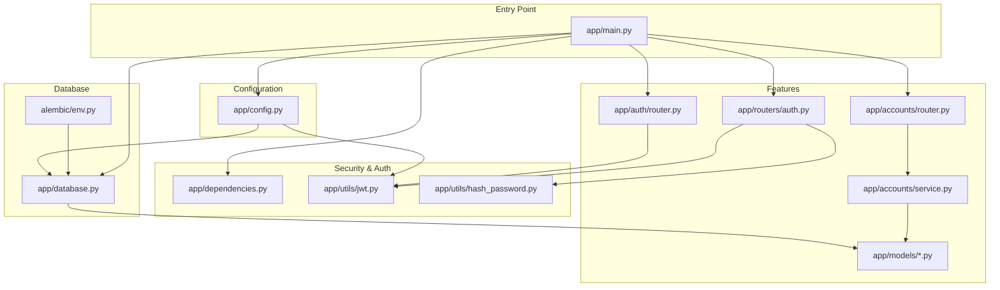

**Diagram sources**
- [backend/app/main.py:56-85](file://backend/app/main.py#L56-L85)
- [backend/app/config.py:57-72](file://backend/app/config.py#L57-L72)
- [backend/app/database.py:24-51](file://backend/app/database.py#L24-L51)
- [backend/app/dependencies.py:14-69](file://backend/app/dependencies.py#L14-L69)
- [backend/app/routers/auth.py:16-315](file://backend/app/routers/auth.py#L16-L315)
- [backend/app/auth/router.py:21-180](file://backend/app/auth/router.py#L21-L180)
- [backend/app/accounts/router.py:36-109](file://backend/app/accounts/router.py#L36-L109)
- [backend/app/accounts/service.py:55-111](file://backend/app/accounts/service.py#L55-L111)
- [backend/alembic/env.py:40-58](file://backend/alembic/env.py#L40-L58)

**Section sources**
- [backend/README.md:27-44](file://backend/README.md#L27-L44)
- [backend/app/main.py:56-85](file://backend/app/main.py#L56-L85)

## Core Components
- Application entry point: Initializes FastAPI, registers routers, sets CORS, and runs startup tasks.
- Configuration: Centralized settings loaded from environment variables with safe defaults.
- Database: Engine and session factory with dependency provider for route handlers.
- Shared dependencies: OAuth2 bearer scheme, token decoding, and current user/admin resolution.
- Feature routers: Modular API endpoints under feature-specific namespaces.
- Services: Encapsulate business logic and coordinate with models and database sessions.
- Models: SQLAlchemy ORM entities representing domain objects.
- Utilities: JWT encoding/decoding and password hashing utilities.

**Section sources**
- [backend/app/main.py:56-109](file://backend/app/main.py#L56-L109)
- [backend/app/config.py:57-72](file://backend/app/config.py#L57-L72)
- [backend/app/database.py:24-51](file://backend/app/database.py#L24-L51)
- [backend/app/dependencies.py:14-69](file://backend/app/dependencies.py#L14-L69)
- [backend/app/routers/auth.py:16-315](file://backend/app/routers/auth.py#L16-L315)
- [backend/app/accounts/service.py:55-111](file://backend/app/accounts/service.py#L55-L111)
- [backend/app/models/account.py:31-57](file://backend/app/models/account.py#L31-L57)
- [backend/app/models/user.py:37-65](file://backend/app/models/user.py#L37-L65)
- [backend/app/utils/jwt.py:11-26](file://backend/app/utils/jwt.py#L11-L26)
- [backend/app/utils/hash_password.py:5-10](file://backend/app/utils/hash_password.py#L5-L10)

## Architecture Overview
The system follows a layered architecture:
- Presentation layer: FastAPI routers expose endpoints grouped by feature.
- Business logic layer: Services encapsulate domain rules and orchestrate data access.
- Data access layer: SQLAlchemy ORM models and session dependency provide persistence.

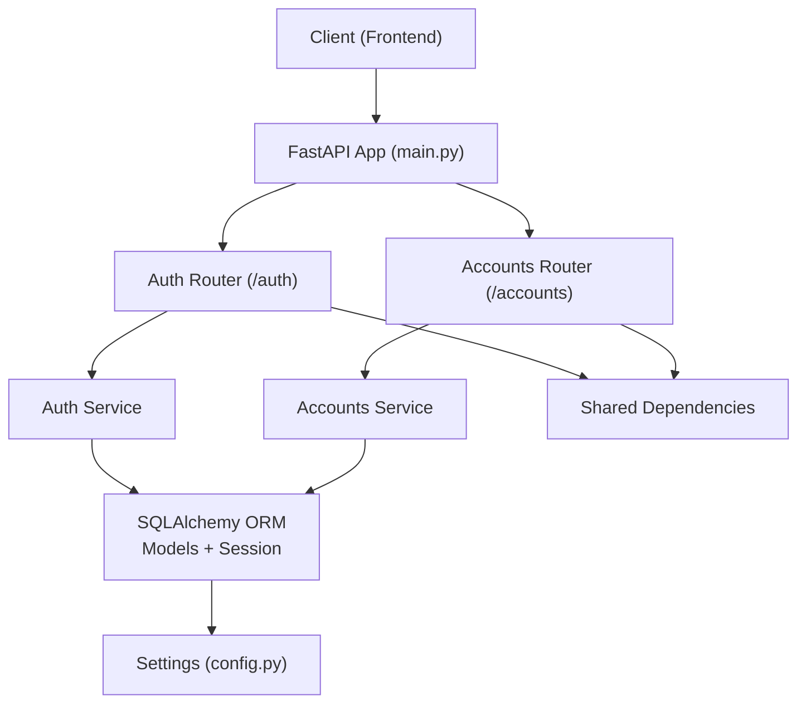

**Diagram sources**
- [backend/app/main.py:56-85](file://backend/app/main.py#L56-L85)
- [backend/app/routers/auth.py:16-315](file://backend/app/routers/auth.py#L16-L315)
- [backend/app/accounts/router.py:36-109](file://backend/app/accounts/router.py#L36-L109)
- [backend/app/accounts/service.py:55-111](file://backend/app/accounts/service.py#L55-L111)
- [backend/app/database.py:24-51](file://backend/app/database.py#L24-L51)
- [backend/app/config.py:57-72](file://backend/app/config.py#L57-L72)
- [backend/app/dependencies.py:14-69](file://backend/app/dependencies.py#L14-L69)

## Detailed Component Analysis

### Application Entry Point and Middleware
- Initializes FastAPI app with metadata.
- Registers modular routers for user and admin features.
- Adds CORS middleware with environment-driven origins.
- Startup event initializes Firebase integration.

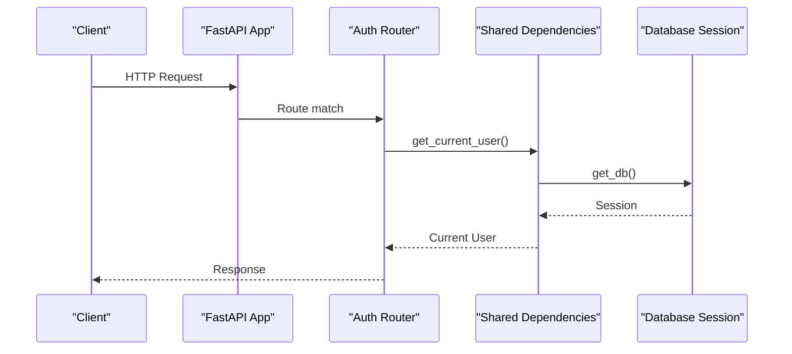

**Diagram sources**
- [backend/app/main.py:56-109](file://backend/app/main.py#L56-L109)
- [backend/app/dependencies.py:51-69](file://backend/app/dependencies.py#L51-L69)
- [backend/app/database.py:45-51](file://backend/app/database.py#L45-L51)

**Section sources**
- [backend/app/main.py:56-109](file://backend/app/main.py#L56-L109)

### Configuration Management
- Loads environment variables from a dedicated .env file.
- Normalizes legacy keys to canonical names.
- Provides typed settings for database URL, JWT secrets, algorithms, and token expirations.
- Supplies defaults for development with warnings.

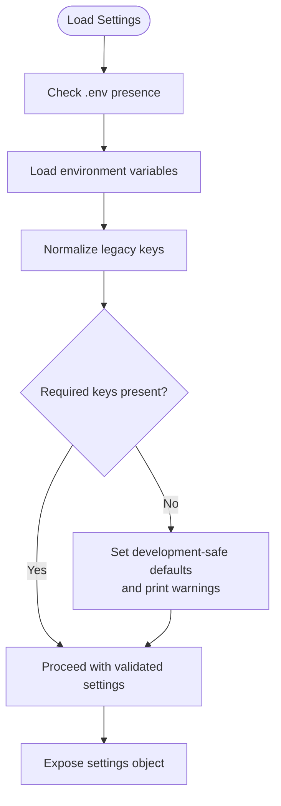

**Diagram sources**
- [backend/app/config.py:32-56](file://backend/app/config.py#L32-L56)
- [backend/app/config.py:57-72](file://backend/app/config.py#L57-L72)

**Section sources**
- [backend/app/config.py:32-72](file://backend/app/config.py#L32-L72)

### Database Abstraction and Session Management
- Creates SQLAlchemy engine with pre-ping.
- Defines scoped session factory and declarative base.
- Provides dependency to supply a database session per request.
- Alembic integration uses the same Base and settings for migrations.

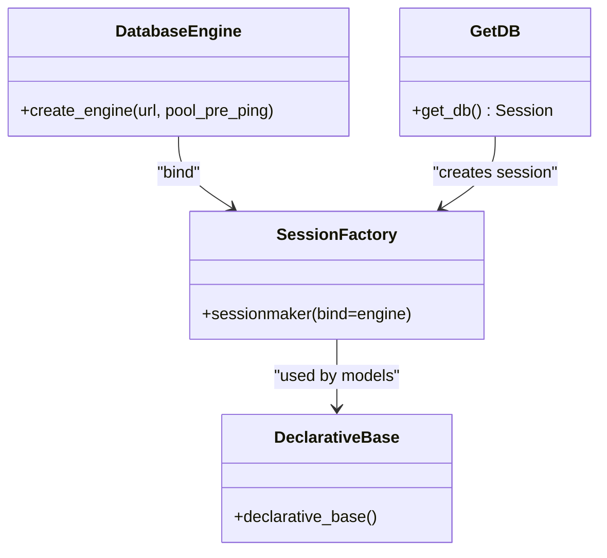

**Diagram sources**
- [backend/app/database.py:24-51](file://backend/app/database.py#L24-L51)
- [backend/alembic/env.py:40-58](file://backend/alembic/env.py#L40-L58)

**Section sources**
- [backend/app/database.py:24-51](file://backend/app/database.py#L24-L51)
- [backend/alembic/env.py:40-58](file://backend/alembic/env.py#L40-L58)

### Shared Dependencies and Authorization
- OAuth2 password bearer scheme for token-based authentication.
- Decodes and validates access tokens, extracts subject, and loads user.
- Enforces admin-only access via a dedicated dependency.
- Raises standardized HTTP exceptions for invalid credentials.

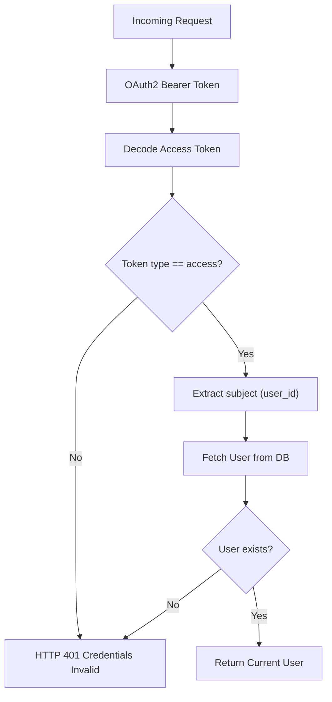

**Diagram sources**
- [backend/app/dependencies.py:17-58](file://backend/app/dependencies.py#L17-L58)

**Section sources**
- [backend/app/dependencies.py:14-69](file://backend/app/dependencies.py#L14-L69)

### Authentication Router (Feature Router)
- Provides registration, login, OTP-based flows, and protected profile retrieval.
- Issues access tokens and refresh cookies with secure attributes controlled by environment.
- Handles integrity errors and logs unexpected exceptions.

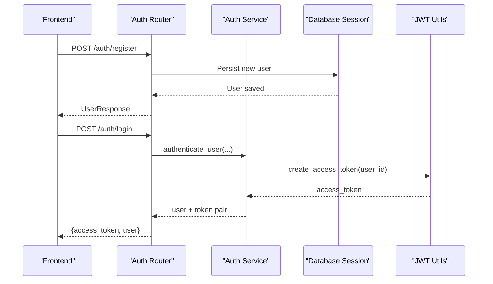

**Diagram sources**
- [backend/app/auth/router.py:75-120](file://backend/app/auth/router.py#L75-L120)
- [backend/app/services/auth_service.py:15-29](file://backend/app/services/auth_service.py#L15-L29)
- [backend/app/utils/jwt.py:11-26](file://backend/app/utils/jwt.py#L11-L26)

**Section sources**
- [backend/app/auth/router.py:75-120](file://backend/app/auth/router.py#L75-L120)
- [backend/app/services/auth_service.py:15-29](file://backend/app/services/auth_service.py#L15-L29)
- [backend/app/utils/jwt.py:11-26](file://backend/app/utils/jwt.py#L11-L26)

### Accounts Router and Service
- Router enforces PIN validation and delegates to service for business logic.
- Service ensures uniqueness by masked last-4 digits, hashes PIN, and manages account lifecycle.
- Models define account entity with foreign key to user and PIN hash.

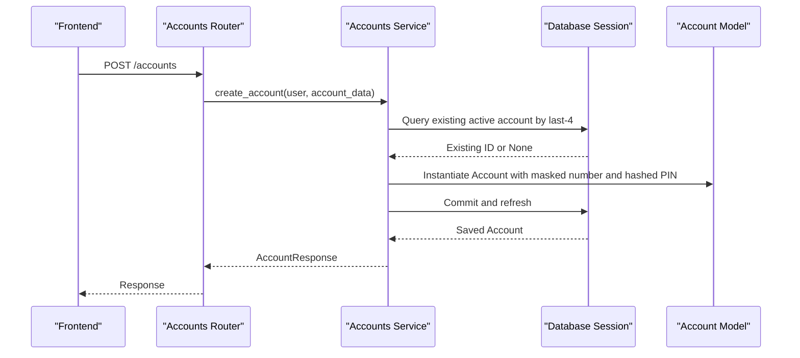

**Diagram sources**
- [backend/app/accounts/router.py:61-69](file://backend/app/accounts/router.py#L61-L69)
- [backend/app/accounts/service.py:55-76](file://backend/app/accounts/service.py#L55-L76)
- [backend/app/models/account.py:31-57](file://backend/app/models/account.py#L31-L57)

**Section sources**
- [backend/app/accounts/router.py:61-69](file://backend/app/accounts/router.py#L61-L69)
- [backend/app/accounts/service.py:55-111](file://backend/app/accounts/service.py#L55-L111)
- [backend/app/models/account.py:31-57](file://backend/app/models/account.py#L31-L57)

### User Model and Relationships
- Represents users with identity, credentials, roles, KYC status, and timestamps.
- Establishes a cascading relationship to accounts.

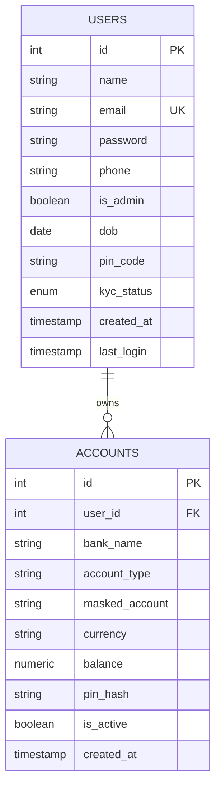

**Diagram sources**
- [backend/app/models/user.py:37-65](file://backend/app/models/user.py#L37-L65)
- [backend/app/models/account.py:31-57](file://backend/app/models/account.py#L31-L57)

**Section sources**
- [backend/app/models/user.py:37-65](file://backend/app/models/user.py#L37-L65)
- [backend/app/models/account.py:31-57](file://backend/app/models/account.py#L31-L57)

### JWT and Password Utilities
- JWT utilities encode/decode tokens with configurable algorithm and expiry.
- Password utilities provide bcrypt-based hashing and verification.

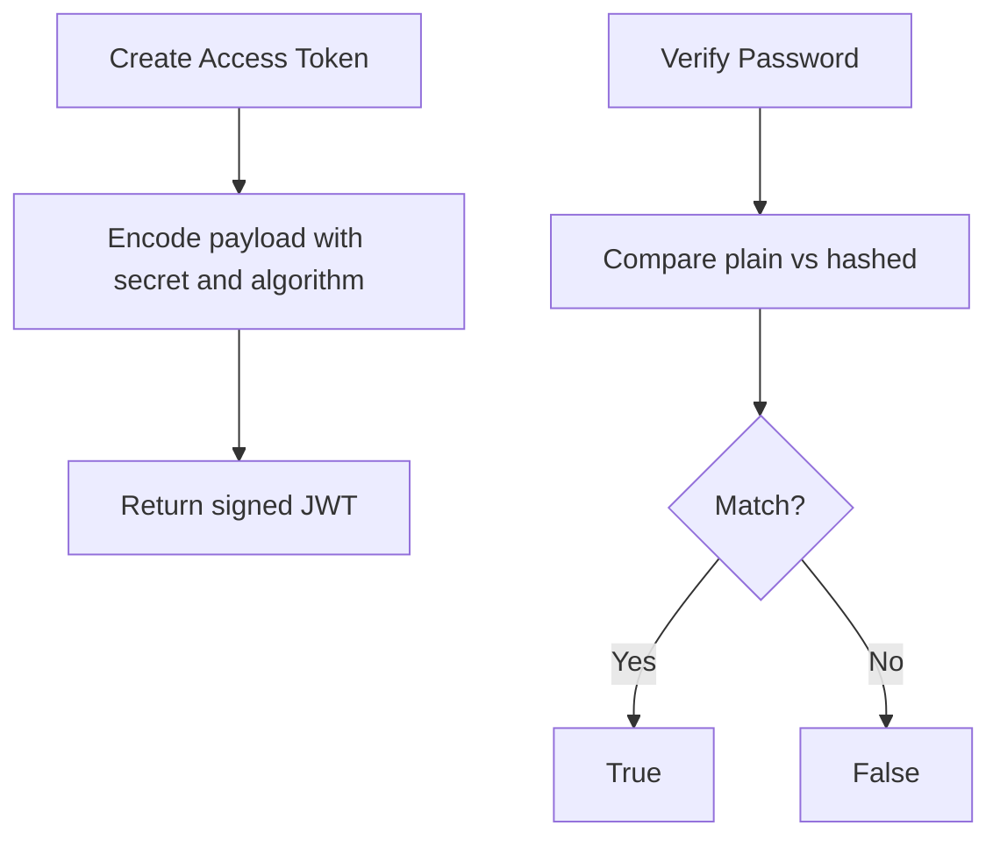

**Diagram sources**
- [backend/app/utils/jwt.py:11-26](file://backend/app/utils/jwt.py#L11-L26)
- [backend/app/utils/hash_password.py:5-10](file://backend/app/utils/hash_password.py#L5-L10)

**Section sources**
- [backend/app/utils/jwt.py:11-26](file://backend/app/utils/jwt.py#L11-L26)
- [backend/app/utils/hash_password.py:5-10](file://backend/app/utils/hash_password.py#L5-L10)

### Transaction Processing and Additional Modules
- Transactions module organizes endpoints and services for transfer and transaction history.
- Modular routers under app/routers group endpoints by functional area (user, admin, analytics, etc.).
- Administrative functions leverage shared dependencies to enforce role-based access.

[No sources needed since this section provides a conceptual overview of additional modules]

## Dependency Analysis
- Coupling: Routers depend on shared dependencies and services; services depend on models and database sessions; models depend on the declarative base.
- Cohesion: Each feature module encapsulates related routers, services, schemas, and models.
- External dependencies: SQLAlchemy ORM, Alembic migrations, Pydantic settings, JWT library, and environment variable loading.

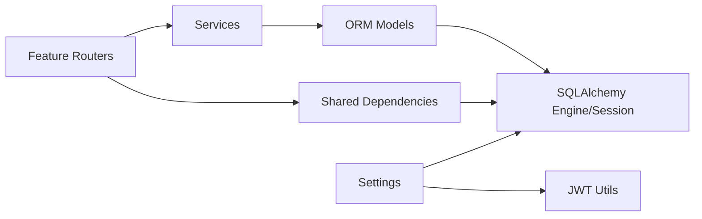

**Diagram sources**
- [backend/app/accounts/router.py:25-35](file://backend/app/accounts/router.py#L25-L35)
- [backend/app/accounts/service.py:17-24](file://backend/app/accounts/service.py#L17-L24)
- [backend/app/models/account.py:24-28](file://backend/app/models/account.py#L24-L28)
- [backend/app/database.py:24-51](file://backend/app/database.py#L24-L51)
- [backend/app/dependencies.py:5-12](file://backend/app/dependencies.py#L5-L12)
- [backend/app/config.py:57-72](file://backend/app/config.py#L57-L72)
- [backend/app/utils/jwt.py:6-7](file://backend/app/utils/jwt.py#L6-L7)

**Section sources**
- [backend/app/accounts/router.py:25-35](file://backend/app/accounts/router.py#L25-L35)
- [backend/app/accounts/service.py:17-24](file://backend/app/accounts/service.py#L17-L24)
- [backend/app/models/account.py:24-28](file://backend/app/models/account.py#L24-L28)
- [backend/app/database.py:24-51](file://backend/app/database.py#L24-L51)
- [backend/app/dependencies.py:5-12](file://backend/app/dependencies.py#L5-L12)
- [backend/app/config.py:57-72](file://backend/app/config.py#L57-L72)
- [backend/app/utils/jwt.py:6-7](file://backend/app/utils/jwt.py#L6-L7)

## Performance Considerations
- Use database pre-ping to handle stale connections.
- Keep business logic in services to minimize ORM overhead in routers.
- Prefer bulk operations and pagination for list endpoints.
- Cache infrequent reads and avoid heavy computations in request handlers.
- Use appropriate indexes on frequently filtered columns (e.g., user_id, email).

[No sources needed since this section provides general guidance]

## Troubleshooting Guide
- CORS issues: Verify allowed origins environment variable and middleware configuration.
- Authentication failures: Confirm JWT secrets, token type validation, and user existence checks.
- Database connectivity: Check DATABASE_URL and ensure migrations are applied.
- Session leaks: Ensure sessions are closed after yielding in dependencies.
- Logging: Use structured logging and capture stack traces for unhandled exceptions.

**Section sources**
- [backend/app/main.py:91-109](file://backend/app/main.py#L91-L109)
- [backend/app/dependencies.py:17-58](file://backend/app/dependencies.py#L17-L58)
- [backend/app/database.py:45-51](file://backend/app/database.py#L45-L51)
- [backend/app/config.py:42-56](file://backend/app/config.py#L42-L56)

## Conclusion
The backend employs a clean, layered architecture with strong separation of concerns. Routers handle presentation, services encapsulate business logic, and models provide data access via SQLAlchemy. Dependency injection simplifies authentication and session management. Configuration is centralized and environment-aware. The modular router organization and shared dependencies enable scalable growth across user and admin features. Alembic ensures consistent database evolution. Together, these patterns deliver a maintainable, testable, and secure foundation for the banking platform.