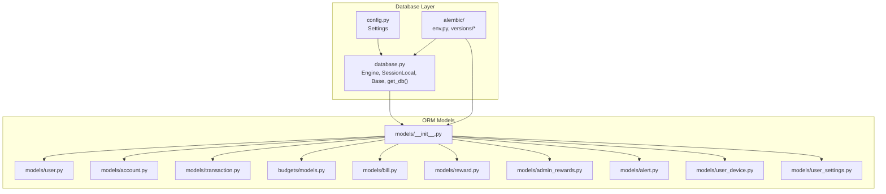
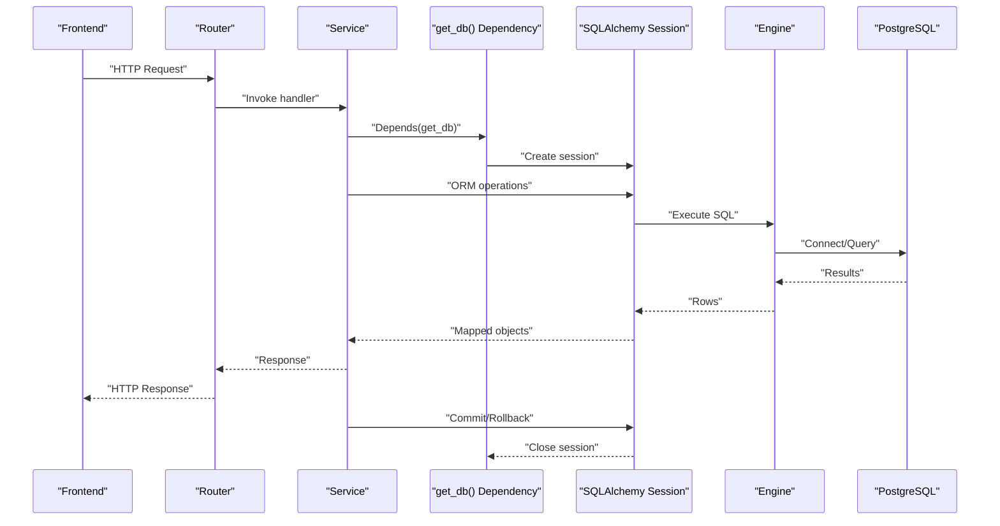
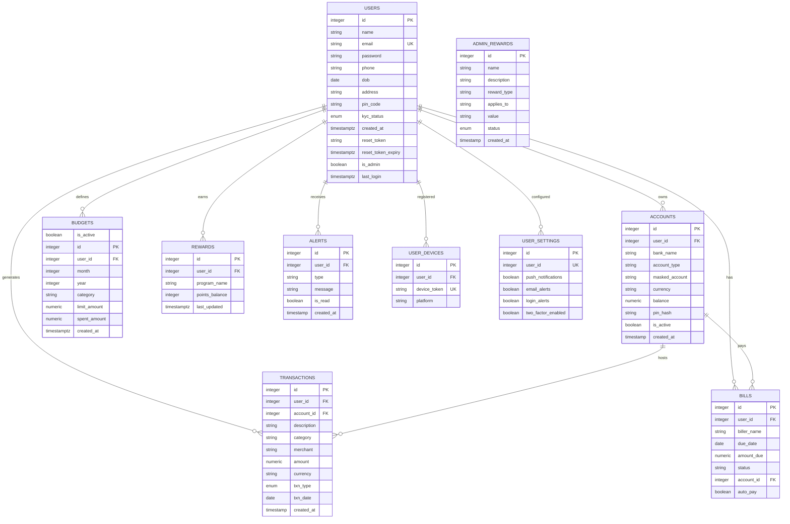
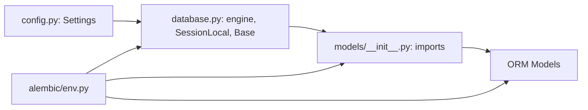
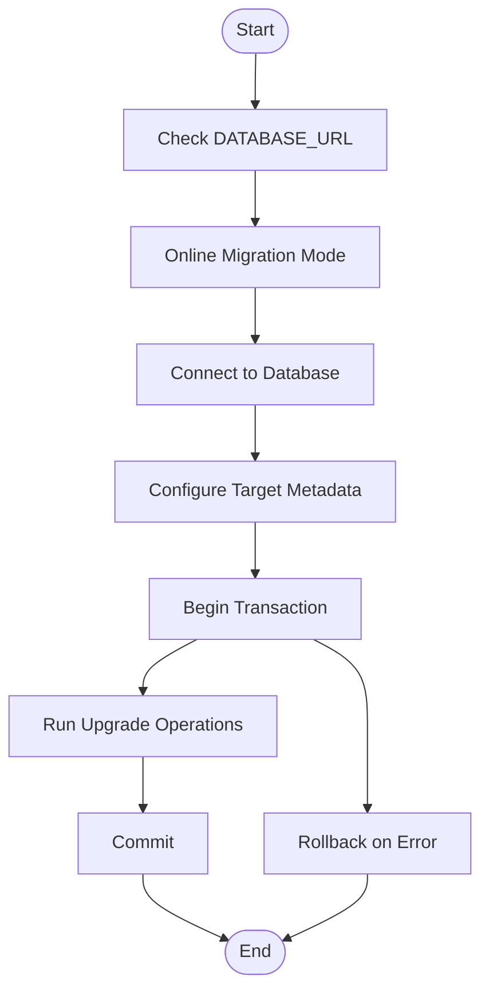

# Database Layer

<cite>
**Referenced Files in This Document**
- [database.py](file://backend/app/database.py)
- [config.py](file://backend/app/config.py)
- [models/__init__.py](file://backend/app/models/__init__.py)
- [user.py](file://backend/app/models/user.py)
- [account.py](file://backend/app/models/account.py)
- [transaction.py](file://backend/app/models/transaction.py)
- [budgets/models.py](file://backend/app/budgets/models.py)
- [bill.py](file://backend/app/models/bill.py)
- [reward.py](file://backend/app/models/reward.py)
- [admin_rewards.py](file://backend/app/models/admin_rewards.py)
- [alert.py](file://backend/app/models/alert.py)
- [user_device.py](file://backend/app/models/user_device.py)
- [user_settings.py](file://backend/app/models/user_settings.py)
- [env.py](file://backend/alembic/env.py)
- [alembic.ini](file://backend/alembic.ini)
- [f3c553c21ca8_initial_schema.py](file://backend/alembic/versions/f3c553c21ca8_initial_schema.py)
- [e4b6b665cae9_add_is_admin_to_users.py](file://backend/alembic/versions/e4b6b665cae9_add_is_admin_to_users.py)
</cite>

## Table of Contents
1. [Introduction](#introduction)
2. [Project Structure](#project-structure)
3. [Core Components](#core-components)
4. [Architecture Overview](#architecture-overview)
5. [Detailed Component Analysis](#detailed-component-analysis)
6. [Dependency Analysis](#dependency-analysis)
7. [Performance Considerations](#performance-considerations)
8. [Troubleshooting Guide](#troubleshooting-guide)
9. [Conclusion](#conclusion)
10. [Appendices](#appendices)

## Introduction
This document describes the database layer built with SQLAlchemy ORM for the Modern Digital Banking Dashboard. It covers the entity models, relationships, session management, connection configuration, Alembic migrations, and operational guidance for financial data workloads. The focus is on the core entities: User, Account, Transaction, Budget, Bill, and Reward, along with supporting entities used for alerts, rewards administration, and user preferences.

## Project Structure
The database layer is organized around:
- Central engine and session factory creation
- Declarative base for ORM models
- Environment-driven configuration
- Alembic migrations for schema evolution
- Model registry for automatic discovery

**Diagram sources**
- [database.py:1-51](file://backend/app/database.py#L1-L51)
- [config.py:1-72](file://backend/app/config.py#L1-L72)
- [models/__init__.py:1-13](file://backend/app/models/__init__.py#L1-L13)
- [user.py:1-65](file://backend/app/models/user.py#L1-L65)
- [account.py:1-57](file://backend/app/models/account.py#L1-L57)
- [transaction.py:1-58](file://backend/app/models/transaction.py#L1-L58)
- [budgets/models.py:1-22](file://backend/app/budgets/models.py#L1-L22)
- [bill.py:1-45](file://backend/app/models/bill.py#L1-L45)
- [reward.py:1-14](file://backend/app/models/reward.py#L1-L14)
- [admin_rewards.py:1-33](file://backend/app/models/admin_rewards.py#L1-L33)
- [alert.py:1-34](file://backend/app/models/alert.py#L1-L34)
- [user_device.py:1-12](file://backend/app/models/user_device.py#L1-L12)
- [user_settings.py:1-14](file://backend/app/models/user_settings.py#L1-L14)
- [env.py:1-59](file://backend/alembic/env.py#L1-L59)

**Section sources**
- [database.py:1-51](file://backend/app/database.py#L1-L51)
- [config.py:1-72](file://backend/app/config.py#L1-L72)
- [models/__init__.py:1-13](file://backend/app/models/__init__.py#L1-L13)
- [env.py:1-59](file://backend/alembic/env.py#L1-L59)

## Core Components
- Engine and Session Factory
  - The engine is created from the configured database URL with pre-ping enabled for robust connection health checks.
  - A local sessionmaker produces per-request sessions bound to the engine.
  - A global declarative base is provided for all ORM models.
  - A dependency generator yields a session to route handlers and services, ensuring it is closed after use.

- Configuration
  - Settings loads environment variables from a .env file located at the backend root.
  - Required settings include the database URL and JWT secrets; missing values fall back to development-safe defaults with warnings.

- Model Registry
  - The models package initializer imports all ORM models so Alembic and SQLAlchemy can discover them automatically.

**Section sources**
- [database.py:24-51](file://backend/app/database.py#L24-L51)
- [config.py:26-72](file://backend/app/config.py#L26-L72)
- [models/__init__.py:1-13](file://backend/app/models/__init__.py#L1-L13)

## Architecture Overview
The database architecture follows a clean separation of concerns:
- Application code requests a database session via dependency injection.
- Services operate within the session lifecycle, performing ORM operations.
- Alembic manages schema evolution independently of runtime code.

**Diagram sources**
- [database.py:45-51](file://backend/app/database.py#L45-L51)
- [config.py:57-72](file://backend/app/config.py#L57-L72)

## Detailed Component Analysis

### Entity Relationship Models
The following entities represent the core financial domain:
- User: Identity, authentication, KYC, admin flag, timestamps.
- Account: Bank account details, currency, balance, PIN hash, and ownership linkage to User.
- Transaction: Financial movement with type, amount, date, and links to User and Account.
- Budget: Spending limits per category per month/year linked to User.
- Bill: Recurring or one-time bill entries linked to User and Account.
- Reward: Loyalty points per user linked to User.

Supporting entities:
- Alert: User notifications with read status.
- AdminReward: Administrative reward programs.
- UserDevice/UserSettings: Device tokens and user preferences.

**Diagram sources**
- [user.py:37-65](file://backend/app/models/user.py#L37-L65)
- [account.py:31-57](file://backend/app/models/account.py#L31-L57)
- [transaction.py:32-58](file://backend/app/models/transaction.py#L32-L58)
- [budgets/models.py:6-22](file://backend/app/budgets/models.py#L6-L22)
- [bill.py:18-45](file://backend/app/models/bill.py#L18-L45)
- [reward.py:5-14](file://backend/app/models/reward.py#L5-L14)
- [alert.py:17-34](file://backend/app/models/alert.py#L17-L34)
- [admin_rewards.py:11-33](file://backend/app/models/admin_rewards.py#L11-L33)
- [user_device.py:5-12](file://backend/app/models/user_device.py#L5-L12)
- [user_settings.py:4-14](file://backend/app/models/user_settings.py#L4-L14)

**Section sources**
- [user.py:37-65](file://backend/app/models/user.py#L37-L65)
- [account.py:31-57](file://backend/app/models/account.py#L31-L57)
- [transaction.py:32-58](file://backend/app/models/transaction.py#L32-L58)
- [budgets/models.py:6-22](file://backend/app/budgets/models.py#L6-L22)
- [bill.py:18-45](file://backend/app/models/bill.py#L18-L45)
- [reward.py:5-14](file://backend/app/models/reward.py#L5-L14)
- [alert.py:17-34](file://backend/app/models/alert.py#L17-L34)
- [admin_rewards.py:11-33](file://backend/app/models/admin_rewards.py#L11-L33)
- [user_device.py:5-12](file://backend/app/models/user_device.py#L5-L12)
- [user_settings.py:4-14](file://backend/app/models/user_settings.py#L4-L14)

### Relationship Mappings and Referential Integrity
- User to Account: One-to-many; deletion of a user cascades to child accounts.
- User to Transaction: One-to-many; transactions belong to a user.
- Account to Transaction: One-to-many; transactions occur on an account.
- User to Budget: One-to-many; budgets are scoped to a user.
- User to Bill: One-to-many; bills belong to a user.
- Account to Bill: One-to-many; bills are paid from an account.
- User to Reward: One-to-many; rewards are tracked per user.
- User to Alert: One-to-many; alerts belong to a user.
- User to UserDevice: One-to-many; devices registered by a user.
- User to UserSettings: One-to-one via unique constraint on user_id.

Foreign keys and constraints:
- Users.email is unique.
- Accounts.user_id references users.id with cascade delete.
- Transactions.user_id and account_id reference users.id and accounts.id respectively.
- Budgets.user_id references users.id.
- Bills.user_id and account_id reference users.id and accounts.id respectively.
- Rewards.user_id references users.id.
- Alerts.user_id references users.id.
- UserDevices.user_id references users.id with unique device_token.
- UserSettings.user_id is unique and references users.id.

**Section sources**
- [account.py:36-40](file://backend/app/models/account.py#L36-L40)
- [transaction.py:37-38](file://backend/app/models/transaction.py#L37-L38)
- [budgets/models.py:12](file://backend/app/budgets/models.py#L12)
- [bill.py:23-38](file://backend/app/models/bill.py#L23-L38)
- [reward.py:9](file://backend/app/models/reward.py#L9)
- [alert.py:21](file://backend/app/models/alert.py#L21)
- [user_device.py:9-10](file://backend/app/models/user_device.py#L9-L10)
- [user_settings.py:8](file://backend/app/models/user_settings.py#L8)

### Database Session Management and Transaction Handling
- Session lifecycle:
  - A dependency function creates a session per request and ensures closure in a finally block.
  - Services should commit successful operations and rollback on exceptions.
  - Sessions are lightweight and short-lived; avoid keeping them open across unrelated operations.

- Transaction handling patterns:
  - Use explicit transaction blocks for multi-step operations to maintain atomicity.
  - Prefer read-only sessions for queries that do not modify data.
  - For bulk writes, consider batching to reduce round-trips.

- Concurrency and isolation:
  - The engine’s default isolation level is used; adjust per requirement if needed.
  - Use refresh_on_merge and proper flush ordering to handle concurrent updates.

**Section sources**
- [database.py:45-51](file://backend/app/database.py#L45-L51)

### Connection Pooling and Engine Configuration
- Engine creation:
  - Built from the configured DATABASE_URL.
  - pool_pre_ping enabled to validate connections before use and reconnect if needed.
- Pool tuning:
  - Adjust pool_size and max_overflow according to workload characteristics.
  - Enable echo only for debugging; keep off in production.

**Section sources**
- [database.py:29-34](file://backend/app/database.py#L29-L34)

### Alembic Migration System
- Online-only migrations:
  - Alembic runs in online mode, connecting directly to the configured database URL.
  - The target metadata is derived from the shared declarative base.

- Initial schema:
  - Creates users, accounts, and budgets tables with appropriate columns, constraints, and indexes.
  - Adds unique index on users.email and indexes on primary keys.

- Subsequent enhancements:
  - Adds admin privileges to users and introduces auxiliary tables: admin_rewards, audit_logs, otps, alerts, rewards, user_devices, user_settings, bills, and transactions.
  - Includes indexes on new tables’ primary keys and otps identifier.

- Migration execution:
  - Run migrations via Alembic CLI; ensure DATABASE_URL is set in the environment.
  - Use compare_type=True to detect type changes during migrations.

**Section sources**
- [env.py:40-58](file://backend/alembic/env.py#L40-L58)
- [f3c553c21ca8_initial_schema.py:18-66](file://backend/alembic/versions/f3c553c21ca8_initial_schema.py#L18-L66)
- [e4b6b665cae9_add_is_admin_to_users.py:18-126](file://backend/alembic/versions/e4b6b665cae9_add_is_admin_to_users.py#L18-L126)

### Database Initialization and Environment-Specific Settings
- Environment loading:
  - The settings module loads .env from the backend root and normalizes legacy keys to canonical names.
  - Missing secrets fall back to development-safe defaults with warnings.

- Initialization steps:
  - Set DATABASE_URL to point to your PostgreSQL instance.
  - Apply migrations to create and evolve the schema.
  - Seed administrative users if required by your deployment process.

**Section sources**
- [config.py:26-56](file://backend/app/config.py#L26-L56)
- [alembic.ini:1-37](file://backend/alembic.ini#L1-L37)

## Dependency Analysis
The database layer exhibits clear separation:
- database.py depends on config.settings for the database URL.
- models/__init__.py imports all ORM models to enable discovery by Alembic and SQLAlchemy.
- Alembic env.py imports Base and all models to generate and apply migrations.

**Diagram sources**
- [database.py:24-42](file://backend/app/database.py#L24-L42)
- [models/__init__.py:1-13](file://backend/app/models/__init__.py#L1-L13)
- [env.py:11-26](file://backend/alembic/env.py#L11-L26)

**Section sources**
- [database.py:24-42](file://backend/app/database.py#L24-L42)
- [models/__init__.py:1-13](file://backend/app/models/__init__.py#L1-L13)
- [env.py:11-26](file://backend/alembic/env.py#L11-L26)

## Performance Considerations
- Indexing strategy
  - Primary keys are indexed by default; ensure frequently filtered/sorted columns are indexed (e.g., users.email, accounts.user_id, transactions.user_id, transactions.account_id, bills.user_id, bills.account_id).
  - Consider composite indexes for common query patterns (e.g., user_id + txn_date on transactions).

- Query optimization
  - Use joined eager loading for relationships accessed together (e.g., transactions with user and account).
  - Paginate large result sets and avoid N+1 selects by prefetching related rows.
  - Prefer bulk operations for inserts/updates when applicable.

- Data types and precision
  - Use numeric with fixed scale for monetary amounts to avoid floating-point errors.
  - Use timezone-aware timestamps for temporal fields to prevent ambiguity.

- Connection and pool tuning
  - Match pool_size to concurrent workload; monitor connection usage metrics.
  - Enable pool_recycle and pool_pre_ping to manage stale connections.

- Financial data specifics
  - Partition large transaction tables by date range if query volume grows significantly.
  - Denormalize aggregates (e.g., monthly totals) sparingly and refresh periodically to accelerate reporting.

[No sources needed since this section provides general guidance]

## Troubleshooting Guide
- Connection failures
  - Verify DATABASE_URL correctness and network accessibility.
  - Ensure pool_pre_ping is enabled to detect dead connections promptly.

- Migration issues
  - Confirm Alembic is executed in online mode and targets the correct database URL.
  - Re-run migrations after correcting schema discrepancies; use downgrade followed by upgrade if necessary.

- Session leaks
  - Ensure get_db() dependency is invoked via Depends and that sessions are closed after use.
  - Avoid holding sessions across asynchronous tasks or long-running operations.

- Integrity errors
  - Foreign key violations often arise from missing parent records or incorrect IDs; validate referential integrity before inserts/updates.
  - Unique constraint violations (e.g., users.email, user_devices.device_token) require deduplication or conflict resolution.

**Section sources**
- [database.py:45-51](file://backend/app/database.py#L45-L51)
- [env.py:40-58](file://backend/alembic/env.py#L40-L58)

## Conclusion
The database layer leverages SQLAlchemy ORM with a clean separation between configuration, session management, and schema evolution via Alembic. The entity model aligns closely with the financial domain, emphasizing referential integrity and clear ownership semantics. By following the recommended session lifecycle, indexing, and optimization practices, the system supports reliable and performant financial data operations.

[No sources needed since this section summarizes without analyzing specific files]

## Appendices

### Appendix A: Migration Flow

**Diagram sources**
- [env.py:40-58](file://backend/alembic/env.py#L40-L58)