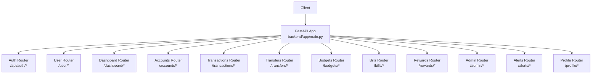
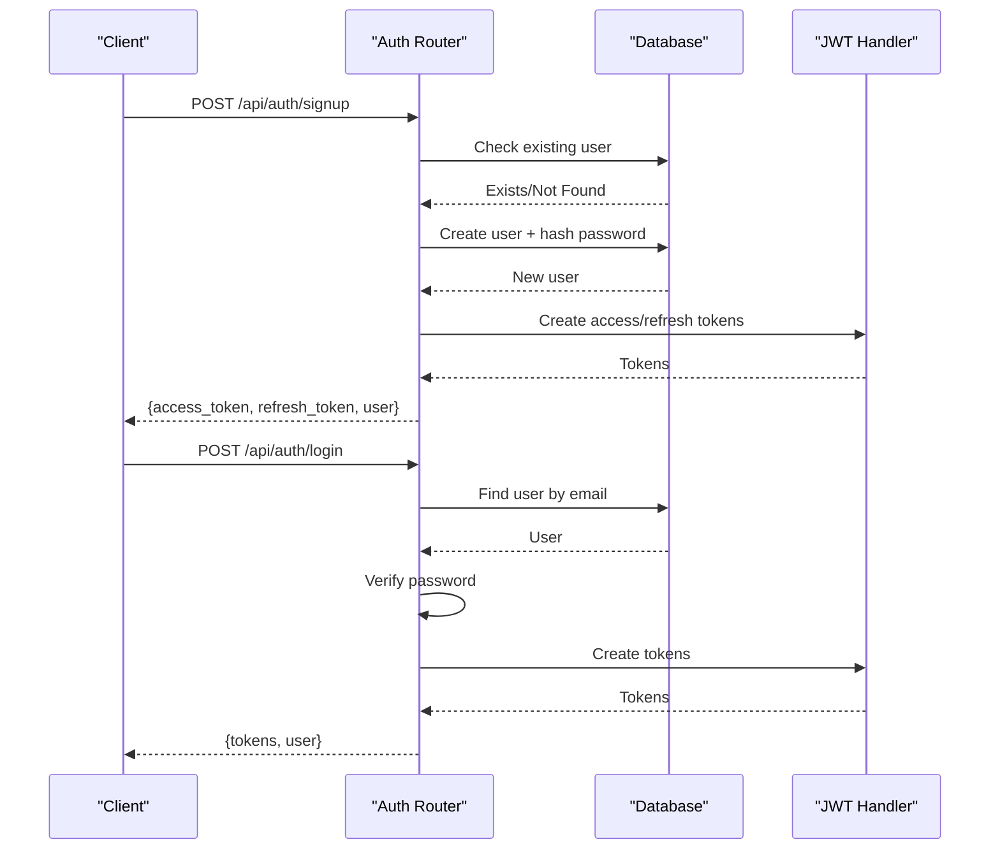
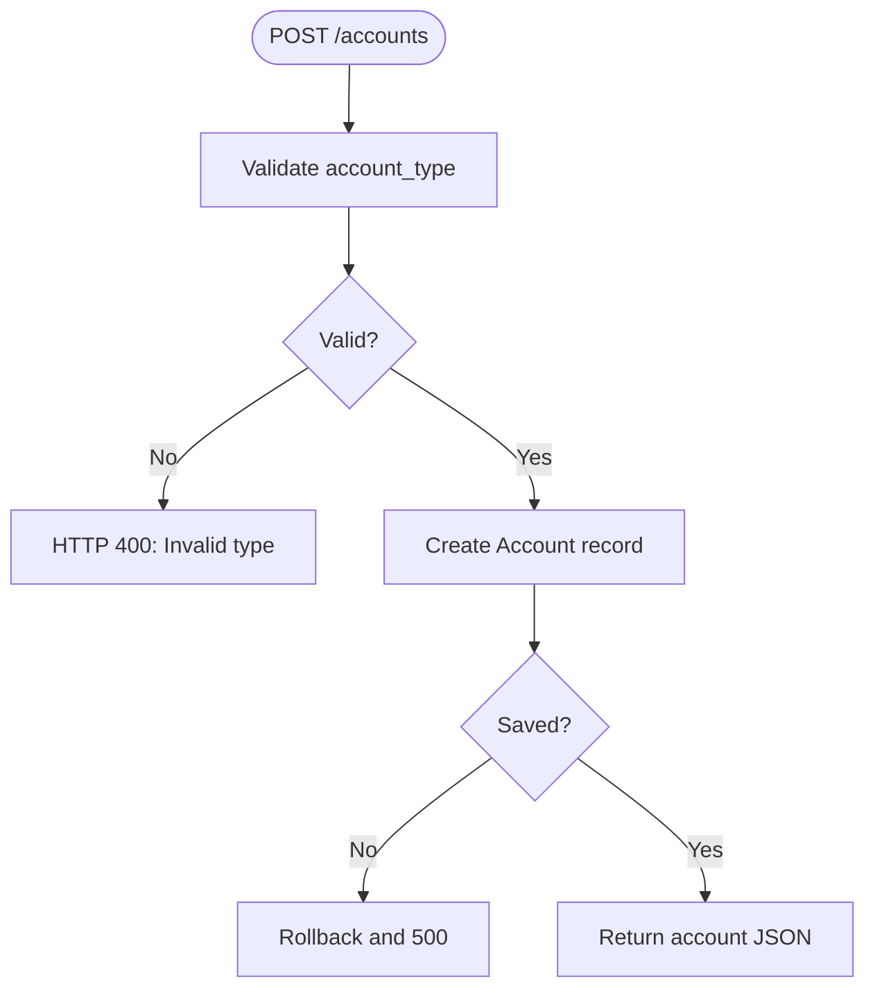
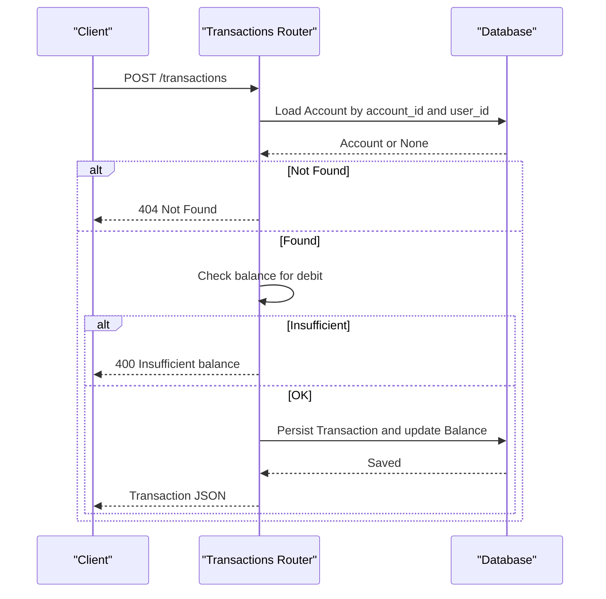
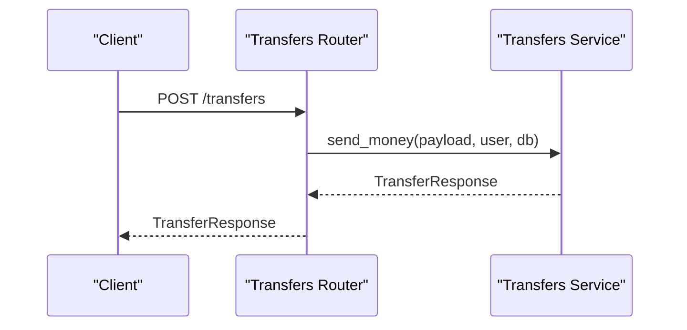
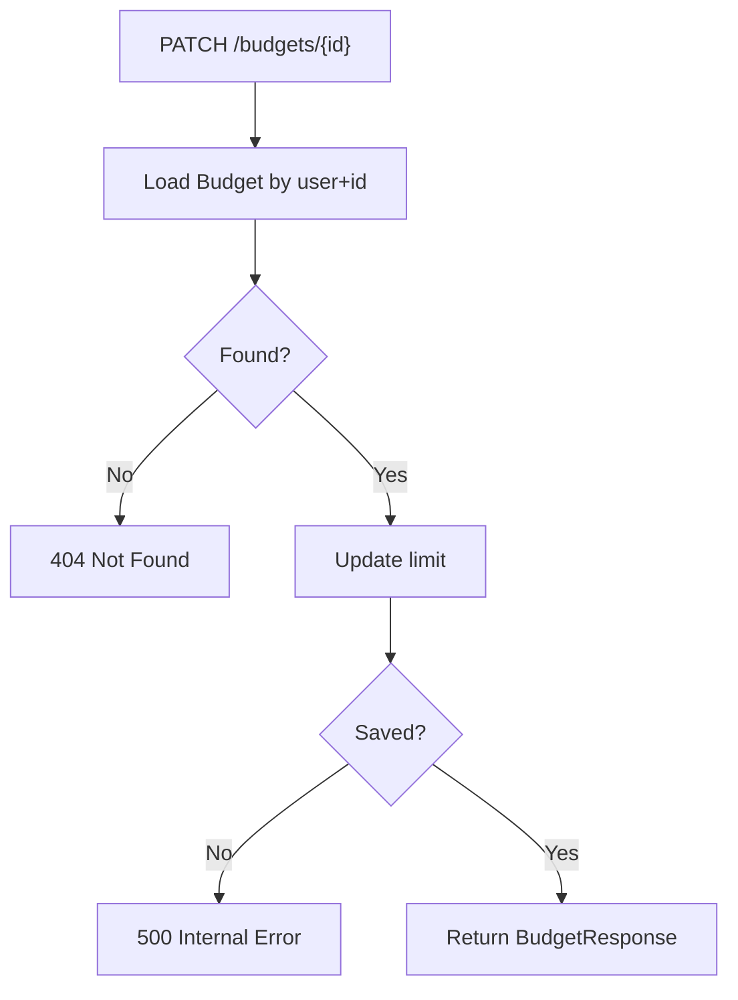
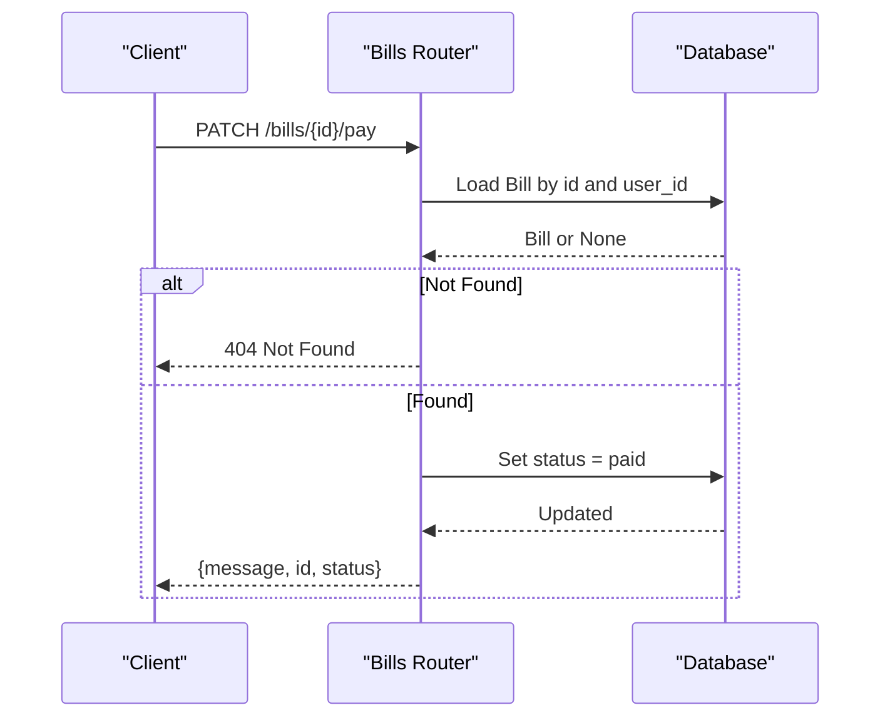
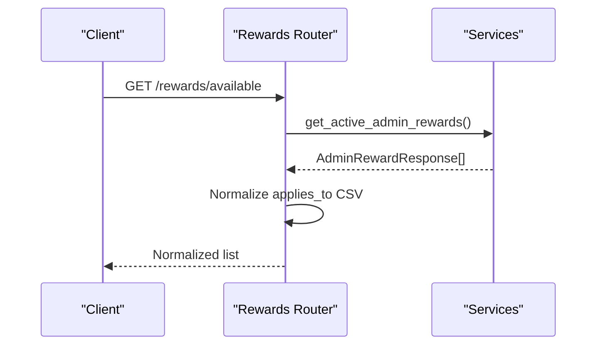
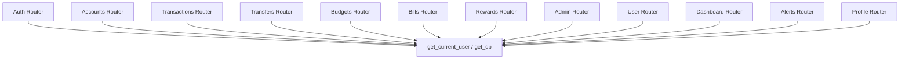

# Router Endpoints

<cite>
**Referenced Files in This Document**
- [main.py](file://backend/app/main.py)
- [auth.py](file://backend/app/routers/auth.py)
- [accounts.py](file://backend/app/routers/accounts.py)
- [transactions.py](file://backend/app/routers/transactions.py)
- [transfers/router.py](file://backend/app/transfers/router.py)
- [budgets/router.py](file://backend/app/budgets/router.py)
- [bills/router.py](file://backend/app/routers/bills.py)
- [rewards/router.py](file://backend/app/rewards/router.py)
- [admin/router.py](file://backend/app/routers/admin.py)
- [user/router.py](file://backend/app/routers/user.py)
- [dashboard/router.py](file://backend/app/routers/dashboard.py)
- [alerts/router.py](file://backend/app/routers/alerts.py)
- [profile/router.py](file://backend/app/routers/profile.py)
</cite>

## Table of Contents
1. [Introduction](#introduction)
2. [Project Structure](#project-structure)
3. [Core Components](#core-components)
4. [Architecture Overview](#architecture-overview)
5. [Detailed Component Analysis](#detailed-component-analysis)
6. [Dependency Analysis](#dependency-analysis)
7. [Performance Considerations](#performance-considerations)
8. [Troubleshooting Guide](#troubleshooting-guide)
9. [Conclusion](#conclusion)

## Introduction
This document describes the FastAPI router organization and endpoint definitions for the Modern Digital Banking Dashboard. It explains the modular router structure, separating user-facing and administrative endpoints, and documents the authentication, account management, transaction, transfer, budget, bill payment, and rewards routers. It also covers route parameter validation, request/response schemas, and error handling patterns, along with access control and authorization requirements.

## Project Structure
The application entry point registers all routers under a single FastAPI app. Routers are grouped by domain and responsibility, with separate namespaces for user and admin routes. Authentication endpoints are exposed under a dedicated namespace, while user and admin routers provide role-specific capabilities.

```mermaid
graph TB
A["FastAPI App<br/>backend/app/main.py"] --> B["Auth Router<br/>backend/app/routers/auth.py"]
A --> C["Accounts Router<br/>backend/app/routers/accounts.py"]
A --> D["Transactions Router<br/>backend/app/routers/transactions.py"]
A --> E["Transfers Router<br/>backend/app/transfers/router.py"]
A --> F["Budgets Router<br/>backend/app/budgets/router.py"]
A --> G["Bills Router<br/>backend/app/routers/bills.py"]
A --> H["Rewards Router<br/>backend/app/rewards/router.py"]
A --> I["Admin Router<br/>backend/app/routers/admin.py"]
A --> J["User Router<br/>backend/app/routers/user.py"]
A --> K["Dashboard Router<br/>backend/app/routers/dashboard.py"]
A --> L["Alerts Router<br/>backend/app/routers/alerts.py"]
A --> M["Profile Router<br/>backend/app/routers/profile.py"]
```

**Diagram sources**
- [main.py](file://backend/app/main.py)
- [auth.py](file://backend/app/routers/auth.py)
- [accounts.py](file://backend/app/routers/accounts.py)
- [transactions.py](file://backend/app/routers/transactions.py)
- [transfers/router.py](file://backend/app/transfers/router.py)
- [budgets/router.py](file://backend/app/budgets/router.py)
- [bills/router.py](file://backend/app/routers/bills/router.py)
- [rewards/router.py](file://backend/app/rewards/router.py)
- [admin/router.py](file://backend/app/routers/admin.py)
- [user/router.py](file://backend/app/routers/user.py)
- [dashboard/router.py](file://backend/app/routers/dashboard.py)
- [alerts/router.py](file://backend/app/routers/alerts.py)
- [profile/router.py](file://backend/app/routers/profile.py)

**Section sources**
- [main.py](file://backend/app/main.py)

## Core Components
- Authentication router: Registration, login, logout simulation, password reset via OTP, and profile retrieval.
- Accounts router: Listing, creation, and deletion of user accounts with type validation and masking.
- Transactions router: Retrieval of transaction history and creation of debit/credit entries with balance checks.
- Transfers router: Money transfer initiation with typed response schema.
- Budgets router: Creation, listing, editing, and deletion of budgets with monthly summaries.
- Bills router: CRUD for bills, payment marking, autopay toggling, and exchange rates endpoint.
- Rewards router: Listing user rewards, creating reward programs, and listing available admin rewards.
- Admin router: User listing/searching, KYC updates, and admin-only user management.
- User router: Self-profile retrieval.
- Dashboard router: User stats and admin/special role endpoints.
- Alerts router: CRUD for alerts and summary endpoints.
- Profile router: Profile read/update, account listing, setting active account, KYC submission, and status.

**Section sources**
- [auth.py](file://backend/app/routers/auth.py)
- [accounts.py](file://backend/app/routers/accounts.py)
- [transactions.py](file://backend/app/routers/transactions.py)
- [transfers/router.py](file://backend/app/transfers/router.py)
- [budgets/router.py](file://backend/app/budgets/router.py)
- [bills/router.py](file://backend/app/routers/bills/router.py)
- [rewards/router.py](file://backend/app/rewards/router.py)
- [admin/router.py](file://backend/app/routers/admin.py)
- [user/router.py](file://backend/app/routers/user.py)
- [dashboard/router.py](file://backend/app/routers/dashboard.py)
- [alerts/router.py](file://backend/app/routers/alerts.py)
- [profile/router.py](file://backend/app/routers/profile.py)

## Architecture Overview
The API follows a layered architecture:
- Entry point registers routers and middleware.
- Routers define endpoints and depend on dependency injectors for current user/admin and database sessions.
- Services encapsulate business logic; models define persistence.
- Schemas define request/response contracts.

**Diagram sources**
- [main.py](file://backend/app/main.py)
- [auth.py](file://backend/app/routers/auth.py)
- [user/router.py](file://backend/app/routers/user.py)
- [dashboard/router.py](file://backend/app/routers/dashboard.py)
- [accounts.py](file://backend/app/routers/accounts.py)
- [transactions.py](file://backend/app/routers/transactions.py)
- [transfers/router.py](file://backend/app/transfers/router.py)
- [budgets/router.py](file://backend/app/budgets/router.py)
- [bills/router.py](file://backend/app/routers/bills/router.py)
- [rewards/router.py](file://backend/app/rewards/router.py)
- [admin/router.py](file://backend/app/routers/admin.py)
- [alerts/router.py](file://backend/app/routers/alerts.py)
- [profile/router.py](file://backend/app/routers/profile.py)

## Detailed Component Analysis

### Authentication Router
Endpoints:
- POST /api/auth/signup: Registers a new user and returns tokens and user info.
- POST /api/auth/login: Authenticates a user and returns tokens and user info.
- POST /api/auth/forgot-password: Sends OTP for password reset.
- POST /api/auth/verify-otp: Verifies OTP for reset eligibility.
- POST /api/auth/reset-password: Resets password after OTP validation.
- GET /api/auth/me: Returns current user profile.

Validation and error handling:
- Uses Pydantic models for request schemas.
- Throws HTTP exceptions with specific details for invalid credentials, signup failures, OTP issues, and reset errors.
- Token extraction and verification via dependency.

**Diagram sources**
- [auth.py](file://backend/app/routers/auth.py)

**Section sources**
- [auth.py](file://backend/app/routers/auth.py)

### Accounts Router
Endpoints:
- GET /accounts: Lists user accounts; auto-creates a default account if none exist.
- POST /accounts: Creates a new account with type validation and masked number generation.
- DELETE /accounts/{account_id}: Deletes an account owned by the user; cascades transactions.

Validation and error handling:
- Validates account type against enum with alias normalization.
- Returns 404 for not found and 500 for database errors.
- Ensures ownership via current user dependency.

**Diagram sources**
- [accounts.py](file://backend/app/routers/accounts.py)

**Section sources**
- [accounts.py](file://backend/app/routers/accounts.py)

### Transactions Router
Endpoints:
- GET /transactions: Lists user transactions ordered by date.
- POST /transactions: Creates a transaction and updates account balance; enforces sufficient funds for debits.

Validation and error handling:
- Requires account ownership and performs balance check before debit.
- Returns 404 for missing account and 400 for insufficient balance.
- Returns created transaction with normalized fields.

**Diagram sources**
- [transactions.py](file://backend/app/routers/transactions.py)

**Section sources**
- [transactions.py](file://backend/app/routers/transactions.py)

### Transfers Router
Endpoints:
- POST /transfers: Initiates money transfer with typed response.

Validation and error handling:
- Uses typed schemas for payload and response.
- Delegates business logic to service; returns structured response.

**Diagram sources**
- [transfers/router.py](file://backend/app/transfers/router.py)

**Section sources**
- [transfers/router.py](file://backend/app/transfers/router.py)

### Budgets Router
Endpoints:
- POST /budgets: Creates a budget; prevents duplicates per category/month.
- GET /budgets: Lists budgets for a given month/year.
- GET /budgets/summary: Provides monthly budget summary.
- PATCH /budgets/{budget_id}: Updates budget limit.
- DELETE /budgets/{budget_id}: Removes a budget.

Validation and error handling:
- Enforces uniqueness and returns 400 on duplication.
- Returns 404 when budget not found for update/delete.

**Diagram sources**
- [budgets/router.py](file://backend/app/budgets/router.py)

**Section sources**
- [budgets/router.py](file://backend/app/budgets/router.py)

### Bills Router
Endpoints:
- GET /bills: Lists user bills; seeds sample bills if none exist.
- POST /bills: Creates a bill.
- GET /bills/exchange-rates: Public endpoint returning mock rates.
- GET /bills/{bill_id}: Retrieves a specific bill.
- PUT /bills/{bill_id}: Updates a bill.
- DELETE /bills/{bill_id}: Deletes a bill.
- PATCH /bills/{bill_id}/pay: Marks bill as paid.
- PATCH /bills/{bill_id}/autopay: Toggles autopay.

Validation and error handling:
- Enforces ownership and returns 404 for not found.
- Autopay toggling handles missing field gracefully.

**Diagram sources**
- [bills/router.py](file://backend/app/routers/bills/router.py)

**Section sources**
- [bills/router.py](file://backend/app/routers/bills/router.py)

### Rewards Router
Endpoints:
- GET /rewards: Lists user rewards.
- POST /rewards: Creates a reward program for the user.
- GET /rewards/available: Lists available admin rewards, normalizing applies_to to CSV.

Validation and error handling:
- Uses typed schemas for requests/responses.
- Admin-available list normalizes comma-separated applies_to values.

**Diagram sources**
- [rewards/router.py](file://backend/app/rewards/router.py)

**Section sources**
- [rewards/router.py](file://backend/app/rewards/router.py)

### Admin Router
Endpoints:
- GET /admin/users: Lists users with optional filters.
- GET /admin/users/{user_id}: Retrieves a user by ID.
- PATCH /admin/users/{user_id}/kyc: Updates user KYC status.

Access control:
- Requires admin role via dependency.

**Section sources**
- [admin/router.py](file://backend/app/routers/admin.py)

### User Router
Endpoints:
- GET /user/me: Returns current user profile.

**Section sources**
- [user/router.py](file://backend/app/routers/user.py)

### Dashboard Router
Endpoints:
- GET /dashboard/dashboard-stats: Aggregates user financial stats.
- GET /dashboard/admin/users: Lists all users (admin-only).
- PUT /dashboard/admin/users/{user_id}/activate: Activates a user (admin-only).
- PUT /dashboard/admin/users/{user_id}/deactivate: Deactivates a user (admin-only).
- GET /dashboard/auditor/users: Lists users (auditor/special role).
- GET /dashboard/auditor/accounts: Lists accounts (auditor/special role).
- GET /dashboard/auditor/transactions: Lists transactions (auditor/special role).
- GET /dashboard/support/users/{user_id}: Retrieves user profile (support/special role).
- GET /dashboard/support/users/{user_id}/accounts: Lists user accounts (support/special role).
- GET /dashboard/support/users/{user_id}/transactions: Lists user transactions (support/special role).

Access control:
- Admin-only endpoints enforce admin role.
- Auditor and support endpoints use centralized role-check dependencies.

**Section sources**
- [dashboard/router.py](file://backend/app/routers/dashboard.py)

### Alerts Router
Endpoints:
- GET /alerts: Lists user alerts; seeds a welcome alert if none exist.
- POST /alerts: Creates an alert with priority-to-type mapping.
- PATCH /alerts/{alert_id}/read: Marks an alert as read.
- PUT /alerts/{alert_id}: Updates an alert.
- DELETE /alerts/{alert_id}: Deletes an alert.
- GET /alerts/check-reminders: Placeholder endpoint.
- POST /alerts/bill-reminders: Placeholder endpoint.
- GET /alerts/summary: Summarizes alerts by type.

Validation and error handling:
- Maps generic priorities to internal alert types; rejects invalid inputs with 422.
- Enforces ownership and returns 404 for not found.

**Section sources**
- [alerts/router.py](file://backend/app/routers/alerts.py)

### Profile Router
Endpoints:
- GET /profile: Returns current user profile details.
- GET /profile/accounts: Lists user accounts and marks active account.
- POST /profile/accounts/active: Sets active account with ownership verification.
- POST /profile/kyc/submit: Submits KYC updates and sets status.
- GET /profile/kyc/status: Returns current KYC status.
- PUT /profile: Updates profile fields.

Validation and error handling:
- Enforces ownership for active account selection.
- Commits changes and returns refreshed profile data.

**Section sources**
- [profile/router.py](file://backend/app/routers/profile.py)

## Dependency Analysis
Routers depend on:
- Database session injection for persistence.
- Current user/admin dependencies for authorization.
- Centralized dependency functions for role checks.
- Services for business logic.

**Diagram sources**
- [auth.py](file://backend/app/routers/auth.py)
- [accounts.py](file://backend/app/routers/accounts.py)
- [transactions.py](file://backend/app/routers/transactions.py)
- [transfers/router.py](file://backend/app/transfers/router.py)
- [budgets/router.py](file://backend/app/budgets/router.py)
- [bills/router.py](file://backend/app/routers/bills/router.py)
- [rewards/router.py](file://backend/app/rewards/router.py)
- [admin/router.py](file://backend/app/routers/admin.py)
- [user/router.py](file://backend/app/routers/user.py)
- [dashboard/router.py](file://backend/app/routers/dashboard.py)
- [alerts/router.py](file://backend/app/routers/alerts.py)
- [profile/router.py](file://backend/app/routers/profile.py)

**Section sources**
- [auth.py](file://backend/app/routers/auth.py)
- [accounts.py](file://backend/app/routers/accounts.py)
- [transactions.py](file://backend/app/routers/transactions.py)
- [transfers/router.py](file://backend/app/transfers/router.py)
- [budgets/router.py](file://backend/app/budgets/router.py)
- [bills/router.py](file://backend/app/routers/bills/router.py)
- [rewards/router.py](file://backend/app/rewards/router.py)
- [admin/router.py](file://backend/app/routers/admin.py)
- [user/router.py](file://backend/app/routers/user.py)
- [dashboard/router.py](file://backend/app/routers/dashboard.py)
- [alerts/router.py](file://backend/app/routers/alerts.py)
- [profile/router.py](file://backend/app/routers/profile.py)

## Performance Considerations
- Prefer pagination for lists where applicable (e.g., transactions, alerts).
- Use database indexes on frequently filtered fields (user_id, dates).
- Batch operations for bulk updates where feasible.
- Cache read-heavy public data (e.g., exchange rates) with TTL.

## Troubleshooting Guide
Common issues and resolutions:
- Authentication failures: Verify credentials and token validity; check hashed passwords and token claims.
- Authorization errors: Ensure current user/admin dependency resolves; confirm role checks for admin/special routes.
- Validation errors: Confirm request payloads match Pydantic schemas; review enum normalization and field presence.
- Integrity errors: Handle duplicate budget creation and database rollbacks; inspect foreign key constraints.
- Insufficient funds: Validate account balances before debit transactions; surface clear error messages.

**Section sources**
- [auth.py](file://backend/app/routers/auth.py)
- [accounts.py](file://backend/app/routers/accounts.py)
- [transactions.py](file://backend/app/routers/transactions.py)
- [budgets/router.py](file://backend/app/budgets/router.py)
- [dashboard/router.py](file://backend/app/routers/dashboard.py)

## Conclusion
The router organization cleanly separates user and admin concerns, with strong validation and error handling patterns. Authentication, accounts, transactions, transfers, budgets, bills, and rewards are modular and maintainable. Access control is enforced consistently via dependency-injected current user/admin checks, ensuring secure operation across roles.