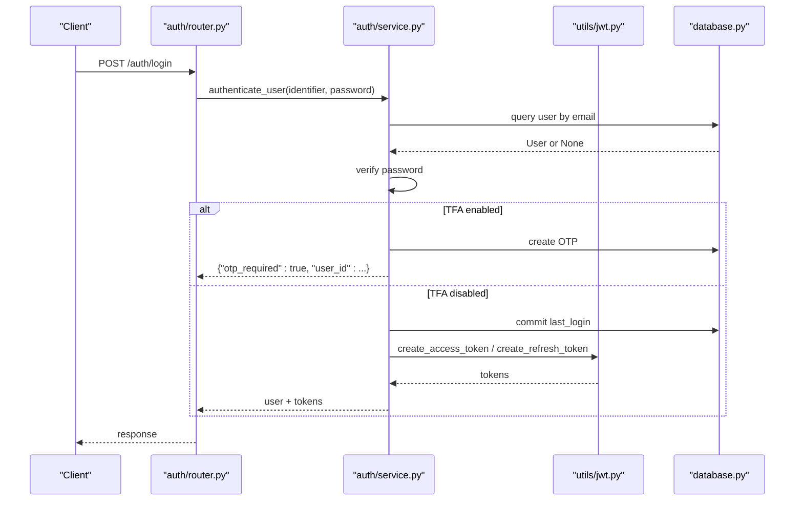
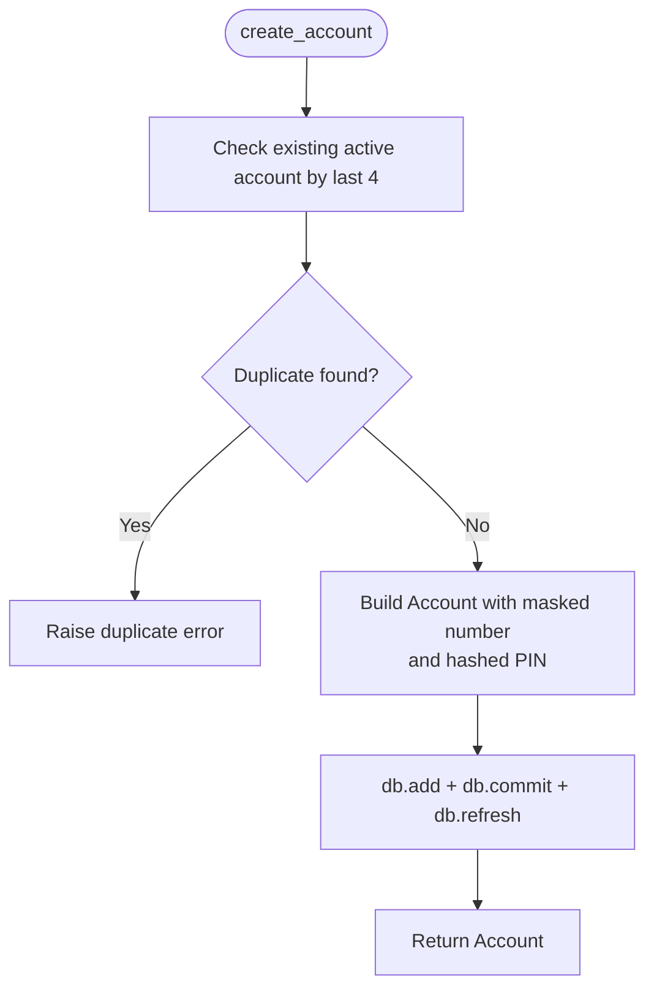
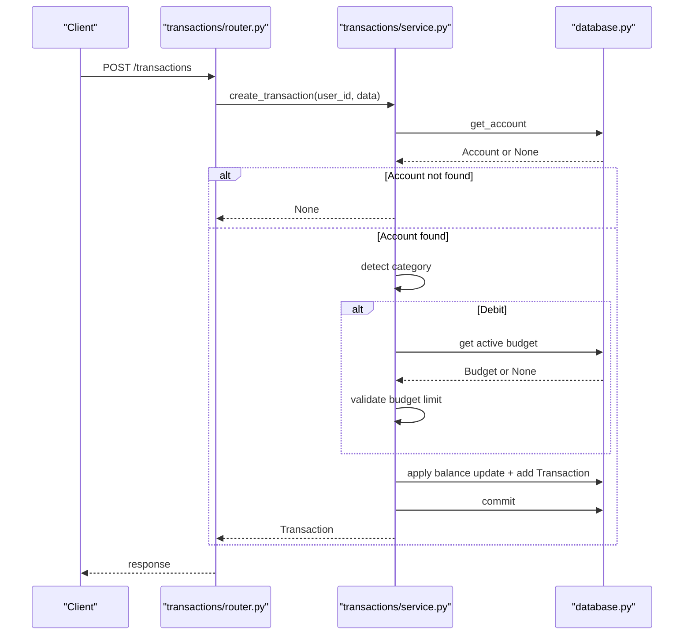
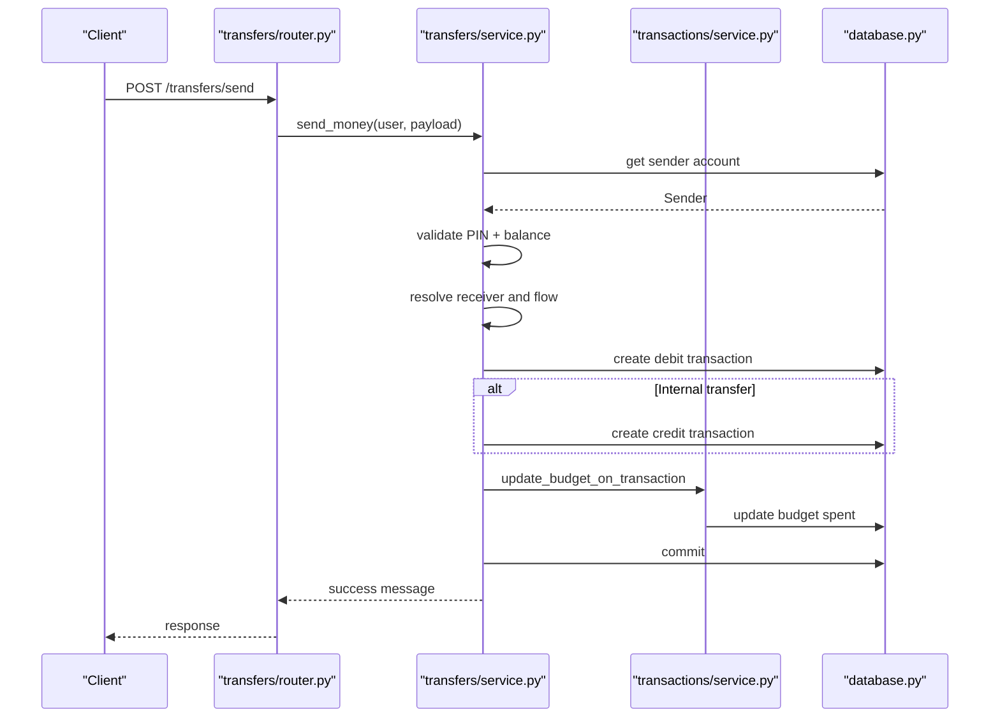
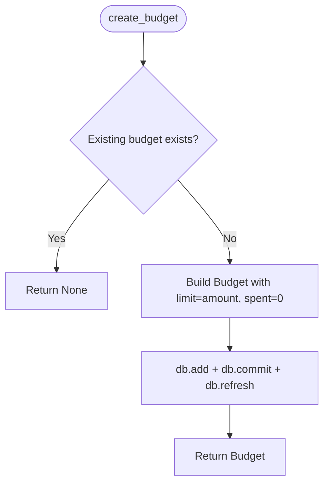
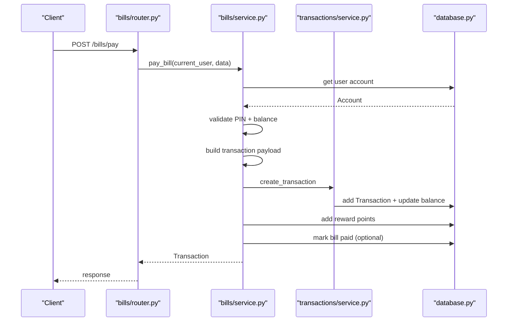
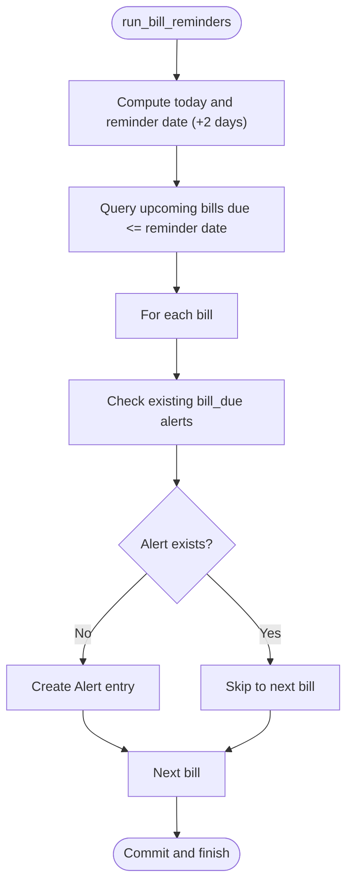
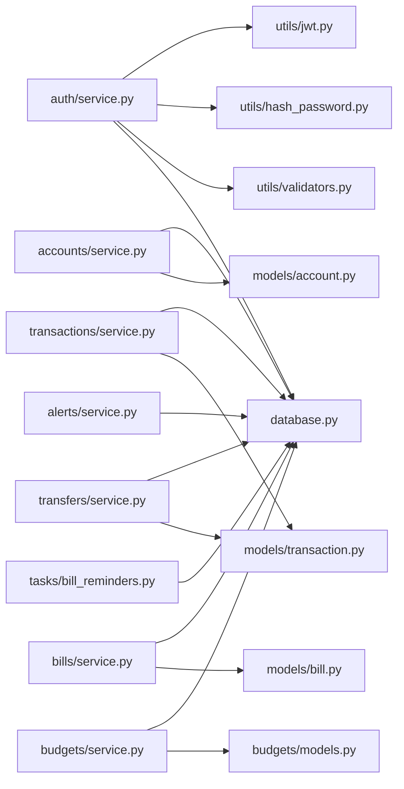

# Service Layer

<cite>
**Referenced Files in This Document**
- [auth_service.py](file://backend/app/services/auth_service.py)
- [auth.py](file://backend/app/auth/service.py)
- [accounts_service.py](file://backend/app/accounts/service.py)
- [transactions_service.py](file://backend/app/transactions/service.py)
- [transfers_service.py](file://backend/app/transfers/service.py)
- [budgets_service.py](file://backend/app/budgets/service.py)
- [bills_service.py](file://backend/app/bills/service.py)
- [alerts_service.py](file://backend/app/alerts/service.py)
- [bill_reminders.py](file://backend/app/tasks/bill_reminders.py)
- [account_model.py](file://backend/app/models/account.py)
- [transaction_model.py](file://backend/app/models/transaction.py)
- [bill_model.py](file://backend/app/models/bill.py)
- [budget_model.py](file://backend/app/budgets/models.py)
- [jwt.py](file://backend/app/utils/jwt.py)
- [hash_password.py](file://backend/app/utils/hash_password.py)
- [validators.py](file://backend/app/utils/validators.py)
- [database.py](file://backend/app/database.py)
</cite>

## Table of Contents
1. [Introduction](#introduction)
2. [Project Structure](#project-structure)
3. [Core Components](#core-components)
4. [Architecture Overview](#architecture-overview)
5. [Detailed Component Analysis](#detailed-component-analysis)
6. [Dependency Analysis](#dependency-analysis)
7. [Performance Considerations](#performance-considerations)
8. [Troubleshooting Guide](#troubleshooting-guide)
9. [Conclusion](#conclusion)

## Introduction
This document describes the service layer architecture that encapsulates business logic and implements the Repository pattern. It covers the authentication service for JWT token management, password validation, and user session handling; the account management service for account creation, PIN handling, and balance operations; the transaction processing service for transfer operations, validation rules, and balance updates; the budget service for spending limits, category tracking, and alert generation; and the bill payment service for automated payments, reminder scheduling, and category management. It also documents error handling, transaction rollback, and consistency guarantees across service operations.

## Project Structure
The service layer follows a feature-based organization under backend/app. Each feature module contains:
- service.py: Business logic and orchestration
- models.py/schemas.py/router.py: Data models, request/response schemas, and HTTP endpoints
- utils.py: Shared utilities (e.g., alerts, reminders)

```mermaid
graph TB
subgraph "Auth"
AUTH_SVC["auth/service.py"]
AUTH_UTILS["auth/schemas.py"]
AUTH_ROUTER["auth/router.py"]
end
subgraph "Accounts"
ACC_SVC["accounts/service.py"]
ACC_MODELS["models/account.py"]
ACC_ROUTER["accounts/router.py"]
end
subgraph "Transactions"
TXN_SVC["transactions/service.py"]
TXN_MODELS["models/transaction.py"]
TXN_ROUTER["transactions/router.py"]
end
subgraph "Transfers"
TRF_SVC["transfers/service.py"]
TRF_ROUTER["transfers/router.py"]
end
subgraph "Budgets"
BGT_SVC["budgets/service.py"]
BGT_MODELS["budgets/models.py"]
BGT_ROUTER["budgets/router.py"]
end
subgraph "Bills"
BIL_SVC["bills/service.py"]
BIL_MODELS["models/bill.py"]
BIL_ROUTER["bills/router.py"]
end
subgraph "Alerts"
ALR_SVC["alerts/service.py"]
ALR_ROUTER["alerts/router.py"]
end
subgraph "Tasks"
REM_SVC["tasks/bill_reminders.py"]
end
subgraph "Utils"
JWT["utils/jwt.py"]
HASH["utils/hash_password.py"]
VALID["utils/validators.py"]
end
DB["database.py"]
AUTH_SVC --> DB
ACC_SVC --> DB
TXN_SVC --> DB
TRF_SVC --> DB
BGT_SVC --> DB
BIL_SVC --> DB
ALR_SVC --> DB
REM_SVC --> DB
AUTH_SVC --> JWT
AUTH_SVC --> HASH
AUTH_SVC --> VALID
ACC_SVC --> ACC_MODELS
TXN_SVC --> TXN_MODELS
TRF_SVC --> TXN_MODELS
BIL_SVC --> BIL_MODELS
BGT_SVC --> BGT_MODELS
```

**Diagram sources**
- [auth.py:1-225](file://backend/app/auth/service.py#L1-L225)
- [accounts_service.py:1-111](file://backend/app/accounts/service.py#L1-L111)
- [transactions_service.py:1-188](file://backend/app/transactions/service.py#L1-L188)
- [transfers_service.py:1-198](file://backend/app/transfers/service.py#L1-L198)
- [budgets_service.py:1-77](file://backend/app/budgets/service.py#L1-L77)
- [bills_service.py:1-166](file://backend/app/bills/service.py#L1-L166)
- [alerts_service.py:1-24](file://backend/app/alerts/service.py#L1-L24)
- [bill_reminders.py:1-57](file://backend/app/tasks/bill_reminders.py#L1-L57)
- [account_model.py:1-57](file://backend/app/models/account.py#L1-L57)
- [transaction_model.py:1-58](file://backend/app/models/transaction.py#L1-L58)
- [bill_model.py:1-45](file://backend/app/models/bill.py#L1-L45)
- [budget_model.py:1-22](file://backend/app/budgets/models.py#L1-L22)
- [jwt.py:1-26](file://backend/app/utils/jwt.py#L1-L26)
- [hash_password.py:1-10](file://backend/app/utils/hash_password.py#L1-L10)
- [validators.py:1-47](file://backend/app/utils/validators.py#L1-L47)
- [database.py:1-51](file://backend/app/database.py#L1-L51)

**Section sources**
- [database.py:1-51](file://backend/app/database.py#L1-L51)

## Core Components
- Authentication service: User registration, password hashing, JWT issuance, OTP delivery, login alerts, and two-factor authentication gating.
- Account management service: Account creation, PIN hashing, masking, retrieval, deletion, and PIN verification.
- Transaction processing service: Transaction creation, budget validation, balance updates, category detection, and notifications.
- Transfer processing service: Inter-account and external transfers, UPI validation, PIN verification, balance updates, and transaction logging.
- Budget service: Monthly budget creation, updates, deletions, and summary computation.
- Bill payment service: Bill creation, payment execution, category mapping, reward points, and optional bill marking as paid.
- Alerts service: Persistent alert creation for login events and bill reminders.
- Task scheduler: Periodic bill reminders for upcoming due dates.

**Section sources**
- [auth.py:1-225](file://backend/app/auth/service.py#L1-L225)
- [accounts_service.py:1-111](file://backend/app/accounts/service.py#L1-L111)
- [transactions_service.py:1-188](file://backend/app/transactions/service.py#L1-L188)
- [transfers_service.py:1-198](file://backend/app/transfers/service.py#L1-L198)
- [budgets_service.py:1-77](file://backend/app/budgets/service.py#L1-L77)
- [bills_service.py:1-166](file://backend/app/bills/service.py#L1-L166)
- [alerts_service.py:1-24](file://backend/app/alerts/service.py#L1-L24)
- [bill_reminders.py:1-57](file://backend/app/tasks/bill_reminders.py#L1-L57)

## Architecture Overview
The service layer enforces a clean separation between HTTP routers and persistence. Each service orchestrates domain operations, validates inputs, updates models, and persists changes. Consistency is maintained through SQLAlchemy sessions and explicit commit boundaries. Utilities provide cross-cutting concerns such as JWT handling, password hashing, and strong password validation.

```mermaid
graph TB
CLIENT["Client"]
ROUTER_AUTH["auth/router.py"]
ROUTER_ACCOUNTS["accounts/router.py"]
ROUTER_TRANSACTIONS["transactions/router.py"]
ROUTER_TRANSFERS["transfers/router.py"]
ROUTER_BUDGETS["budgets/router.py"]
ROUTER_BILLS["bills/router.py"]
ROUTER_ALERTS["alerts/router.py"]
SVC_AUTH["auth/service.py"]
SVC_ACCOUNTS["accounts/service.py"]
SVC_TRANSACTIONS["transactions/service.py"]
SVC_TRANSFERS["transfers/service.py"]
SVC_BUDGETS["budgets/service.py"]
SVC_BILLS["bills/service.py"]
SVC_ALERTS["alerts/service.py"]
TASK_REMINDERS["tasks/bill_reminders.py"]
UTIL_JWT["utils/jwt.py"]
UTIL_HASH["utils/hash_password.py"]
UTIL_VALID["utils/validators.py"]
MODELS_ACC["models/account.py"]
MODELS_TXN["models/transaction.py"]
MODELS_BILL["models/bill.py"]
MODELS_BUDGET["budgets/models.py"]
DB["database.py"]
CLIENT --> ROUTER_AUTH
CLIENT --> ROUTER_ACCOUNTS
CLIENT --> ROUTER_TRANSACTIONS
CLIENT --> ROUTER_TRANSFERS
CLIENT --> ROUTER_BUDGETS
CLIENT --> ROUTER_BILLS
CLIENT --> ROUTER_ALERTS
ROUTER_AUTH --> SVC_AUTH
ROUTER_ACCOUNTS --> SVC_ACCOUNTS
ROUTER_TRANSACTIONS --> SVC_TRANSACTIONS
ROUTER_TRANSFERS --> SVC_TRANSFERS
ROUTER_BUDGETS --> SVC_BUDGETS
ROUTER_BILLS --> SVC_BILLS
ROUTER_ALERTS --> SVC_ALERTS
SVC_AUTH --> UTIL_JWT
SVC_AUTH --> UTIL_HASH
SVC_AUTH --> UTIL_VALID
SVC_ACCOUNTS --> MODELS_ACC
SVC_TRANSACTIONS --> MODELS_TXN
SVC_TRANSFERS --> MODELS_TXN
SVC_BILLS --> MODELS_BILL
SVC_BUDGETS --> MODELS_BUDGET
SVC_AUTH --> DB
SVC_ACCOUNTS --> DB
SVC_TRANSACTIONS --> DB
SVC_TRANSFERS --> DB
SVC_BUDGETS --> DB
SVC_BILLS --> DB
SVC_ALERTS --> DB
TASK_REMINDERS --> DB
```

**Diagram sources**
- [auth.py:1-225](file://backend/app/auth/service.py#L1-L225)
- [accounts_service.py:1-111](file://backend/app/accounts/service.py#L1-L111)
- [transactions_service.py:1-188](file://backend/app/transactions/service.py#L1-L188)
- [transfers_service.py:1-198](file://backend/app/transfers/service.py#L1-L198)
- [budgets_service.py:1-77](file://backend/app/budgets/service.py#L1-L77)
- [bills_service.py:1-166](file://backend/app/bills/service.py#L1-L166)
- [alerts_service.py:1-24](file://backend/app/alerts/service.py#L1-L24)
- [bill_reminders.py:1-57](file://backend/app/tasks/bill_reminders.py#L1-L57)
- [account_model.py:1-57](file://backend/app/models/account.py#L1-L57)
- [transaction_model.py:1-58](file://backend/app/models/transaction.py#L1-L58)
- [bill_model.py:1-45](file://backend/app/models/bill.py#L1-L45)
- [budget_model.py:1-22](file://backend/app/budgets/models.py#L1-L22)
- [jwt.py:1-26](file://backend/app/utils/jwt.py#L1-L26)
- [hash_password.py:1-10](file://backend/app/utils/hash_password.py#L1-L10)
- [validators.py:1-47](file://backend/app/utils/validators.py#L1-L47)
- [database.py:1-51](file://backend/app/database.py#L1-L51)

## Detailed Component Analysis

### Authentication Service
- Responsibilities:
  - Hash passwords using bcrypt.
  - Issue access and refresh tokens with configurable expiry.
  - Authenticate users and enforce two-factor authentication when enabled.
  - Send OTPs and handle login alerts (email, push notifications).
  - Reset passwords with strong password validation.
- Key methods and signatures:
  - hash_password(password): returns hashed password string.
  - verify_password(plain, hashed): returns boolean.
  - create_access_token(data, expires_delta): returns JWT string.
  - create_refresh_token(data, expires_delta): returns JWT string.
  - authenticate_user(db, identifier, password): returns user or OTP gating info.
  - reset_password(db, email, new_password): returns boolean.
  - send_otp(db, identifier): triggers OTP creation and optional email.
- Business rules:
  - New password must differ from previous and meet strength criteria.
  - Two-factor auth triggers OTP issuance when enabled.
  - Login alerts are created and optionally emailed/pushed.
- Error handling:
  - Integrity errors on user creation are caught and re-raised after rollback.
  - Validation errors raise ValueError with descriptive messages.

**Diagram sources**
- [auth.py:205-225](file://backend/app/auth/service.py#L205-L225)
- [jwt.py:11-19](file://backend/app/utils/jwt.py#L11-L19)
- [database.py:45-51](file://backend/app/database.py#L45-L51)

**Section sources**
- [auth.py:1-225](file://backend/app/auth/service.py#L1-L225)
- [jwt.py:1-26](file://backend/app/utils/jwt.py#L1-L26)
- [validators.py:27-36](file://backend/app/utils/validators.py#L27-L36)

### Account Management Service
- Responsibilities:
  - Create user accounts with masked account numbers and hashed PIN.
  - Retrieve user accounts and resolve by ID.
  - Delete accounts with PIN verification.
  - Enforce uniqueness of active accounts by last four digits.
- Key methods and signatures:
  - create_account(db, user, account_data): returns Account.
  - get_user_accounts(db, user): returns list of accounts.
  - get_account_by_id(db, user, account_id): returns Account or None.
  - delete_account(db, user, account_id): returns boolean.
  - delete_account_with_pin(db, user, account_id, pin): returns success message or raises.
- Business rules:
  - PIN is hashed using bcrypt before storage.
  - Masked account number displays last four digits only.
  - Duplicate active accounts by last four digits are rejected.
- Error handling:
  - HTTP exceptions raised for invalid PIN, not found, and duplicates.

**Diagram sources**
- [accounts_service.py:55-75](file://backend/app/accounts/service.py#L55-L75)

**Section sources**
- [accounts_service.py:1-111](file://backend/app/accounts/service.py#L1-L111)
- [account_model.py:31-57](file://backend/app/models/account.py#L31-L57)

### Transaction Processing Service
- Responsibilities:
  - Create transactions, validate budgets, update balances, and track spent amounts.
  - Detect categories from descriptions.
  - Notify users based on preferences.
- Key methods and signatures:
  - create_transaction(db, user_id, data): returns Transaction or None.
  - update_budget_on_transaction(db, user_id, category, amount): updates spent amount.
  - get_account_transactions(db, user_id, account_id): returns list of transactions.
  - detect_transaction_category(description): returns category string.
- Business rules:
  - Debits are validated against monthly budget limits.
  - Balance is updated atomically with transaction creation.
  - Category defaults to Others if not recognized.
- Error handling:
  - Budget exceeded raises HTTP 400.
  - Account not found returns None from creation.

**Diagram sources**
- [transactions_service.py:105-149](file://backend/app/transactions/service.py#L105-L149)
- [transaction_model.py:32-58](file://backend/app/models/transaction.py#L32-L58)

**Section sources**
- [transactions_service.py:1-188](file://backend/app/transactions/service.py#L1-L188)
- [transaction_model.py:1-58](file://backend/app/models/transaction.py#L1-L58)

### Transfer Processing Service
- Responsibilities:
  - Execute transfers between internal accounts, self-accounts, and UPI targets.
  - Validate PIN, sufficient funds, and target accounts.
  - Create corresponding debit/credit transactions and update budgets.
- Key methods and signatures:
  - send_money(db, user, payload): returns success message.
  - get_transfer_category(transfer_type): returns category string.
- Business rules:
  - PIN verified against stored hash.
  - Bank/self transfers update both sender and receiver balances.
  - UPI transfers debit sender only.
  - Category mapped per transfer type.
- Error handling:
  - Raises HTTP exceptions for missing sender/receiver, invalid PIN, insufficient balance, invalid UPI, and invalid transfer type.

**Diagram sources**
- [transfers_service.py:164-197](file://backend/app/transfers/service.py#L164-L197)
- [transactions_service.py:152-162](file://backend/app/transactions/service.py#L152-L162)

**Section sources**
- [transfers_service.py:1-198](file://backend/app/transfers/service.py#L1-L198)
- [transactions_service.py:152-162](file://backend/app/transactions/service.py#L152-L162)

### Budget Service
- Responsibilities:
  - Manage monthly budgets per category.
  - Prevent duplicate monthly budgets for the same category.
  - Summarize totals and remaining amounts.
- Key methods and signatures:
  - create_budget(db, user_id, data): returns Budget or None.
  - get_user_budgets(db, user_id, month, year): returns list.
  - update_budget(db, user_id, budget_id, limit_amount): returns Budget or None.
  - delete_budget(db, user_id, budget_id): returns boolean.
  - get_budget_summary(db, user_id, month, year): returns totals.
- Business rules:
  - Active budgets only considered for queries.
  - Spent amount updated via transaction service.
- Error handling:
  - Returns None for not-found operations; boolean for deletion.

**Diagram sources**
- [budgets_service.py:15-33](file://backend/app/budgets/service.py#L15-L33)
- [budget_model.py:6-22](file://backend/app/budgets/models.py#L6-L22)

**Section sources**
- [budgets_service.py:1-77](file://backend/app/budgets/service.py#L1-L77)
- [budget_model.py:1-22](file://backend/app/budgets/models.py#L1-L22)

### Bill Payment Service
- Responsibilities:
  - Validate account PIN and sufficient balance.
  - Map bill types to categories and build transaction descriptions.
  - Create transactions, optionally mark bills as paid, and award reward points.
- Key methods and signatures:
  - pay_bill(db, current_user, data): returns Transaction.
  - create_bill(db, user_id, data): returns Bill.
  - get_user_bills(db, user_id): returns list.
  - update_bill(db, bill_id, user_id, data): returns Bill.
  - delete_bill(db, bill_id, user_id): returns None.
- Business rules:
  - Bill type must be supported; otherwise invalid.
  - PIN verified against stored hash.
  - Transaction category derived from bill metadata.
  - Optional auto-pay flag stored on bill.
- Error handling:
  - Raises HTTP exceptions for invalid bill type, account not found, invalid PIN, insufficient balance, and transaction failure.

**Diagram sources**
- [bills_service.py:102-124](file://backend/app/bills/service.py#L102-L124)
- [transactions_service.py:105-149](file://backend/app/transactions/service.py#L105-L149)

**Section sources**
- [bills_service.py:1-166](file://backend/app/bills/service.py#L1-L166)
- [bill_model.py:18-45](file://backend/app/models/bill.py#L18-L45)

### Alerts and Reminders
- Alerts service:
  - Creates persistent alerts for login events and other notifications.
- Bill reminders task:
  - Periodically scans upcoming bills and creates bill-due alerts, avoiding duplicates.

**Diagram sources**
- [bill_reminders.py:24-57](file://backend/app/tasks/bill_reminders.py#L24-L57)
- [alerts_service.py:6-23](file://backend/app/alerts/service.py#L6-L23)

**Section sources**
- [alerts_service.py:1-24](file://backend/app/alerts/service.py#L1-L24)
- [bill_reminders.py:1-57](file://backend/app/tasks/bill_reminders.py#L1-L57)

## Dependency Analysis
- Cohesion:
  - Each service encapsulates a single domain concern with focused responsibilities.
- Coupling:
  - Services depend on SQLAlchemy sessions and shared models.
  - Cross-cutting utilities (JWT, hashing, validators) are reused across services.
- External integrations:
  - Email sending and push notifications are invoked from authentication and alerts services.
- Persistence:
  - All services operate within a single database session lifecycle managed by dependency injection.

**Diagram sources**
- [auth.py:1-225](file://backend/app/auth/service.py#L1-L225)
- [accounts_service.py:1-111](file://backend/app/accounts/service.py#L1-L111)
- [transactions_service.py:1-188](file://backend/app/transactions/service.py#L1-L188)
- [transfers_service.py:1-198](file://backend/app/transfers/service.py#L1-L198)
- [budgets_service.py:1-77](file://backend/app/budgets/service.py#L1-L77)
- [bills_service.py:1-166](file://backend/app/bills/service.py#L1-L166)
- [alerts_service.py:1-24](file://backend/app/alerts/service.py#L1-L24)
- [bill_reminders.py:1-57](file://backend/app/tasks/bill_reminders.py#L1-L57)
- [account_model.py:1-57](file://backend/app/models/account.py#L1-L57)
- [transaction_model.py:1-58](file://backend/app/models/transaction.py#L1-L58)
- [bill_model.py:1-45](file://backend/app/models/bill.py#L1-L45)
- [budget_model.py:1-22](file://backend/app/budgets/models.py#L1-L22)
- [jwt.py:1-26](file://backend/app/utils/jwt.py#L1-L26)
- [hash_password.py:1-10](file://backend/app/utils/hash_password.py#L1-L10)
- [validators.py:1-47](file://backend/app/utils/validators.py#L1-L47)
- [database.py:1-51](file://backend/app/database.py#L1-L51)

**Section sources**
- [database.py:1-51](file://backend/app/database.py#L1-L51)

## Performance Considerations
- Session management:
  - Use short-lived sessions and avoid long-running transactions to reduce contention.
- Batch operations:
  - Group related writes (e.g., transfer debit/credit) within a single commit to minimize round-trips.
- Indexing:
  - Ensure database indexes exist on frequently filtered columns (user_id, account_id, due_date, status).
- Caching:
  - Cache user settings and budget summaries where appropriate to reduce repeated queries.
- Asynchronous tasks:
  - Offload reminders and notifications to background tasks to keep request latency low.

## Troubleshooting Guide
- Authentication
  - Symptom: Login fails with invalid credentials.
    - Action: Verify password hashing and credential lookup; check two-factor settings.
  - Symptom: OTP not received.
    - Action: Confirm email delivery and OTP expiry; inspect email logs.
- Accounts
  - Symptom: Cannot add duplicate account.
    - Action: Ensure uniqueness by last four digits is enforced; mask account numbers properly.
  - Symptom: PIN verification fails.
    - Action: Confirm bcrypt verification and correct PIN input.
- Transactions and Transfers
  - Symptom: Budget exceeded error.
    - Action: Review monthly budget limits and category mapping.
  - Symptom: Insufficient balance during transfer.
    - Action: Validate sender balance and transfer amount.
- Budgets
  - Symptom: Budget not updating.
    - Action: Confirm transaction service updates spent amount after debits.
- Bills
  - Symptom: Bill payment fails.
    - Action: Check account PIN and balance; confirm bill type validity; verify transaction creation.
- Alerts and Reminders
  - Symptom: Duplicate alerts.
    - Action: Ensure deduplication logic checks existing alerts before insertion.

**Section sources**
- [auth.py:205-225](file://backend/app/auth/service.py#L205-L225)
- [accounts_service.py:55-75](file://backend/app/accounts/service.py#L55-L75)
- [transactions_service.py:61-63](file://backend/app/transactions/service.py#L61-L63)
- [transfers_service.py:42-50](file://backend/app/transfers/service.py#L42-L50)
- [budgets_service.py:15-33](file://backend/app/budgets/service.py#L15-L33)
- [bills_service.py:102-124](file://backend/app/bills/service.py#L102-L124)
- [bill_reminders.py:38-46](file://backend/app/tasks/bill_reminders.py#L38-L46)

## Conclusion
The service layer cleanly separates business logic from HTTP concerns, implements robust validation and error handling, and maintains consistency through explicit session commits. By leveraging shared utilities and models, it achieves high cohesion and manageable coupling. Extending services should preserve these patterns: validate early, update models atomically, and centralize cross-cutting concerns in utilities.