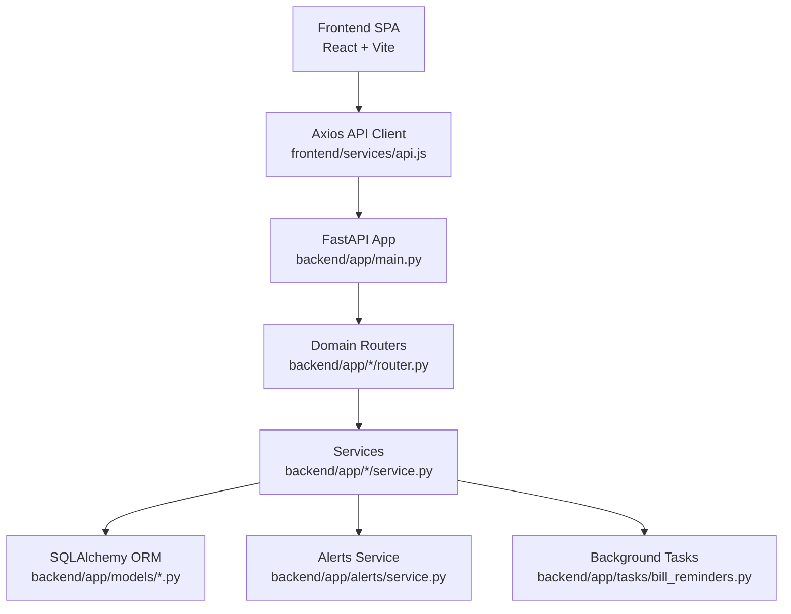
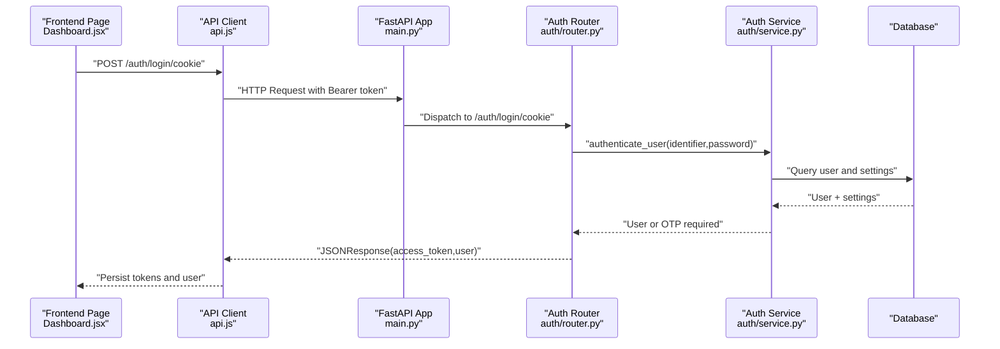
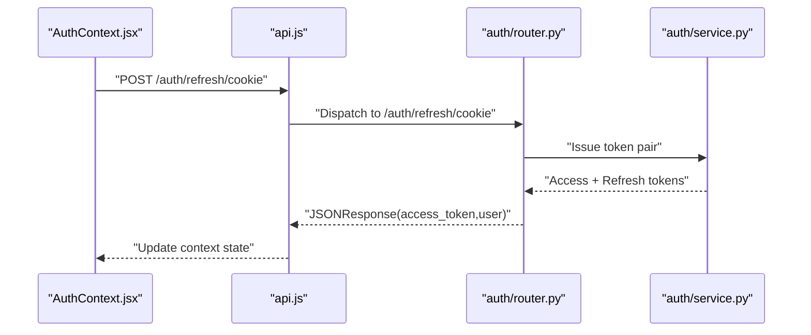
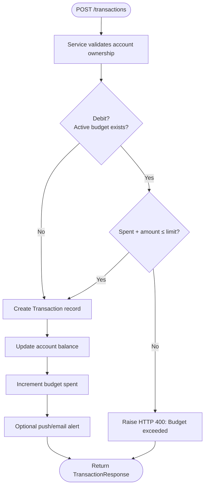
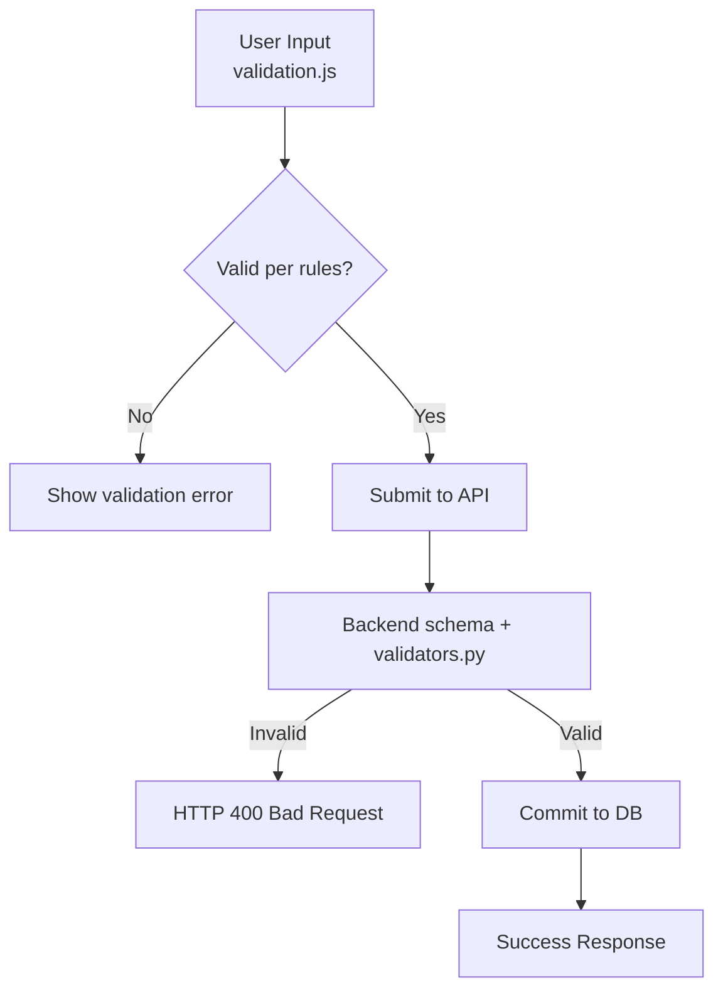
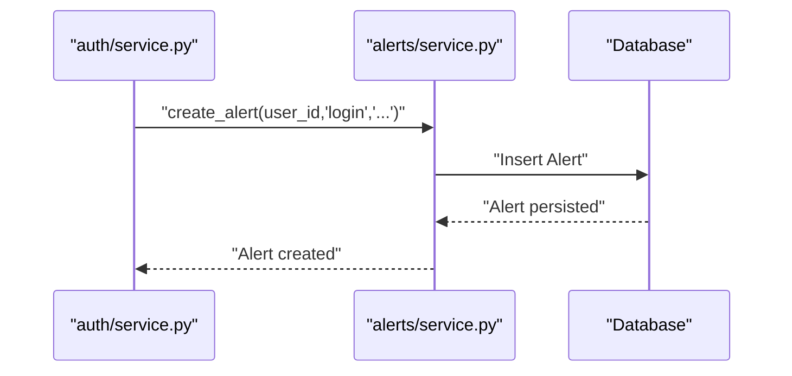
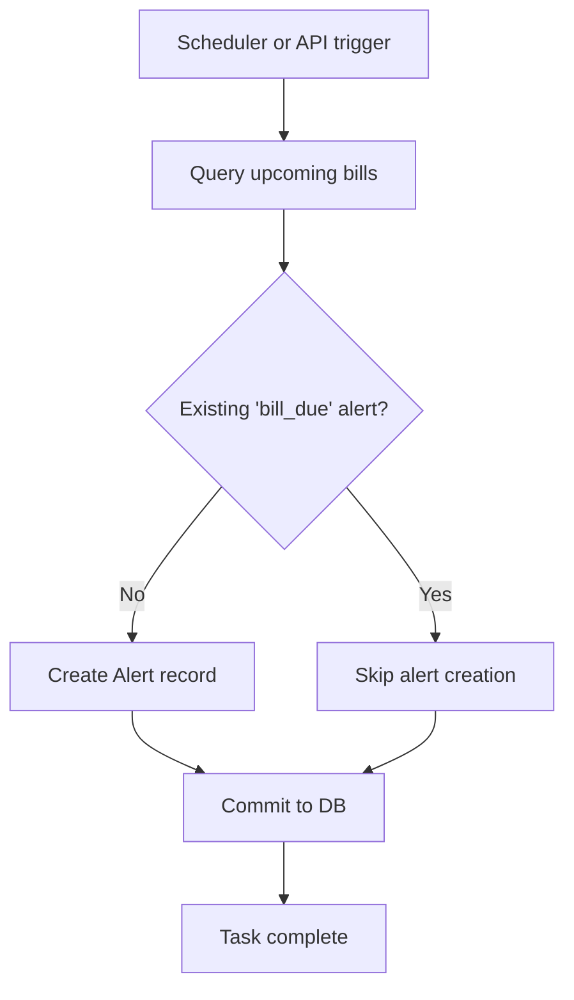
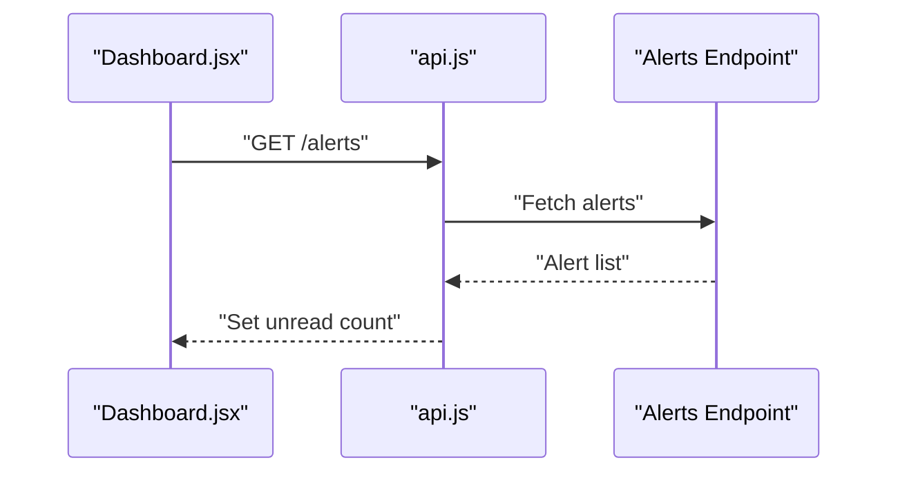
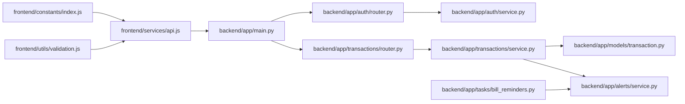

# Data Flow Patterns

<cite>
**Referenced Files in This Document**
- [backend/main.py](file://backend/app/main.py)
- [backend/auth/router.py](file://backend/app/auth/router.py)
- [backend/auth/service.py](file://backend/app/auth/service.py)
- [backend/transactions/router.py](file://backend/app/transactions/router.py)
- [backend/transactions/service.py](file://backend/app/transactions/service.py)
- [backend/models/transaction.py](file://backend/app/models/transaction.py)
- [backend/alerts/service.py](file://backend/app/alerts/service.py)
- [backend/tasks/bill_reminders.py](file://backend/app/tasks/bill_reminders.py)
- [backend/utils/validators.py](file://backend/app/utils/validators.py)
- [frontend/services/api.js](file://frontend/src/services/api.js)
- [frontend/context/AuthContext.jsx](file://frontend/src/context/AuthContext.jsx)
- [frontend/hooks/useAuth.js](file://frontend/src/hooks/useAuth.js)
- [frontend/pages/user/Dashboard.jsx](file://frontend/src/pages/user/Dashboard.jsx)
- [frontend/utils/validation.js](file://frontend/src/utils/validation.js)
- [frontend/constants/index.js](file://frontend/src/constants/index.js)
</cite>

## Table of Contents
1. [Introduction](#introduction)
2. [Project Structure](#project-structure)
3. [Core Components](#core-components)
4. [Architecture Overview](#architecture-overview)
5. [Detailed Component Analysis](#detailed-component-analysis)
6. [Dependency Analysis](#dependency-analysis)
7. [Performance Considerations](#performance-considerations)
8. [Troubleshooting Guide](#troubleshooting-guide)
9. [Conclusion](#conclusion)

## Introduction
This document describes the end-to-end data flow patterns across the full-stack banking application. It covers the request-response lifecycle from frontend components to backend APIs, authentication token handling, error propagation, response transformation, state synchronization, real-time-like updates, validation flows, transaction processing, audit and notification triggers, and asynchronous background tasks. The goal is to help both technical and non-technical readers understand how data moves, transforms, and is validated across layers.

## Project Structure
The application follows a layered architecture:
- Frontend: React SPA with centralized API client, authentication context, and page components.
- Backend: FastAPI application exposing REST endpoints grouped by domain (auth, accounts, transactions, transfers, budgets, bills, insights, alerts, rewards, exports, settings).
- Shared concerns: Constants, validation utilities, and models define cross-cutting behaviors.

**Diagram sources**
- [backend/main.py:56-89](file://backend/app/main.py#L56-L89)
- [frontend/services/api.js:19-46](file://frontend/src/services/api.js#L19-L46)

**Section sources**
- [backend/main.py:56-89](file://backend/app/main.py#L56-L89)
- [frontend/services/api.js:19-46](file://frontend/src/services/api.js#L19-L46)

## Core Components
- Frontend API client attaches Authorization headers automatically and exposes convenience methods for all endpoints.
- Backend FastAPI app wires routers and middleware; CORS is configured for development and production domains.
- Authentication router handles registration, cookie-based login, OTP-based flows, and token issuance.
- Transactions router and service encapsulate creation, filtering, and categorization with budget checks and balance updates.
- Alerts service centralizes alert creation for notifications.
- Background tasks generate bill reminders and persist alerts.
- Frontend context and hooks manage authentication state and local storage.

**Section sources**
- [frontend/services/api.js:19-46](file://frontend/src/services/api.js#L19-L46)
- [backend/main.py:59-109](file://backend/app/main.py#L59-L109)
- [backend/auth/router.py:104-179](file://backend/app/auth/router.py#L104-L179)
- [backend/transactions/router.py:65-128](file://backend/app/transactions/router.py#L65-L128)
- [backend/transactions/service.py:105-149](file://backend/app/transactions/service.py#L105-L149)
- [backend/alerts/service.py:6-23](file://backend/app/alerts/service.py#L6-L23)
- [backend/tasks/bill_reminders.py:24-56](file://backend/app/tasks/bill_reminders.py#L24-L56)
- [frontend/context/AuthContext.jsx:26-42](file://frontend/src/context/AuthContext.jsx#L26-L42)
- [frontend/hooks/useAuth.js:29-46](file://frontend/src/hooks/useAuth.js#L29-L46)

## Architecture Overview
The request-response cycle begins in the frontend, traverses the API client, reaches FastAPI, and flows through routers and services to the database. Responses are transformed and returned to the UI, while alerts and background tasks keep the system synchronized and proactive.

**Diagram sources**
- [frontend/pages/user/Dashboard.jsx:119-131](file://frontend/src/pages/user/Dashboard.jsx#L119-L131)
- [frontend/services/api.js:33-46](file://frontend/src/services/api.js#L33-L46)
- [backend/main.py:56-89](file://backend/app/main.py#L56-L89)
- [backend/auth/router.py:122-138](file://backend/app/auth/router.py#L122-L138)
- [backend/auth/service.py:205-224](file://backend/app/auth/service.py#L205-L224)

## Detailed Component Analysis

### Authentication Token Handling and Refresh
- The frontend API client attaches an Authorization header derived from stored access tokens.
- The authentication router supports cookie-based login and OTP verification, issuing access and refresh tokens.
- The AuthContext attempts a refresh on mount to restore sessions silently.
- The useAuth hook persists tokens and user metadata in local storage and exposes login/logout/update utilities.

**Diagram sources**
- [frontend/context/AuthContext.jsx:26-42](file://frontend/src/context/AuthContext.jsx#L26-L42)
- [frontend/services/api.js:23-31](file://frontend/src/services/api.js#L23-L31)
- [backend/auth/router.py:122-138](file://backend/app/auth/router.py#L122-L138)
- [backend/auth/service.py:43-54](file://backend/app/auth/service.py#L43-L54)

**Section sources**
- [frontend/services/api.js:23-31](file://frontend/src/services/api.js#L23-L31)
- [frontend/context/AuthContext.jsx:26-42](file://frontend/src/context/AuthContext.jsx#L26-L42)
- [frontend/hooks/useAuth.js:29-46](file://frontend/src/hooks/useAuth.js#L29-L46)
- [backend/auth/router.py:122-138](file://backend/app/auth/router.py#L122-L138)
- [backend/auth/service.py:43-54](file://backend/app/auth/service.py#L43-L54)

### Transaction Creation and Validation Flow
- The transactions router validates filters and delegates creation to the service.
- The service enforces budget limits, detects categories, updates balances, and optionally notifies users.
- The model defines transaction attributes and relationships.

**Diagram sources**
- [backend/transactions/router.py:65-74](file://backend/app/transactions/router.py#L65-L74)
- [backend/transactions/service.py:105-149](file://backend/app/transactions/service.py#L105-L149)
- [backend/models/transaction.py:32-58](file://backend/app/models/transaction.py#L32-L58)

**Section sources**
- [backend/transactions/router.py:65-128](file://backend/app/transactions/router.py#L65-L128)
- [backend/transactions/service.py:105-149](file://backend/app/transactions/service.py#L105-L149)
- [backend/models/transaction.py:32-58](file://backend/app/models/transaction.py#L32-L58)

### Data Validation Flow (Frontend to Backend)
- Frontend validation utilities enforce field-level constraints (email, phone, password, PIN, amount).
- Backend validators enforce strong password policies and normalization.
- Database constraints and service-level checks prevent invalid states.

**Diagram sources**
- [frontend/utils/validation.js:11-176](file://frontend/src/utils/validation.js#L11-L176)
- [backend/utils/validators.py:27-36](file://backend/app/utils/validators.py#L27-L36)
- [backend/auth/service.py:114-133](file://backend/app/auth/service.py#L114-L133)

**Section sources**
- [frontend/utils/validation.js:11-176](file://frontend/src/utils/validation.js#L11-L176)
- [backend/utils/validators.py:27-36](file://backend/app/utils/validators.py#L27-L36)
- [backend/auth/service.py:114-133](file://backend/app/auth/service.py#L114-L133)

### Alerts and Notification Triggers
- On login, alerts are created, emails may be sent, and push notifications are dispatched to registered devices.
- Transaction service optionally notifies users about credits/debits based on user settings.

**Diagram sources**
- [backend/auth/service.py:181-196](file://backend/app/auth/service.py#L181-L196)
- [backend/alerts/service.py:6-23](file://backend/app/alerts/service.py#L6-L23)

**Section sources**
- [backend/auth/service.py:181-196](file://backend/app/auth/service.py#L181-L196)
- [backend/alerts/service.py:6-23](file://backend/app/alerts/service.py#L6-L23)

### Asynchronous Data Patterns (Scheduled Tasks)
- Bill reminders are generated periodically to create alerts for upcoming bills, preventing duplicates.

**Diagram sources**
- [backend/tasks/bill_reminders.py:24-56](file://backend/app/tasks/bill_reminders.py#L24-L56)

**Section sources**
- [backend/tasks/bill_reminders.py:24-56](file://backend/app/tasks/bill_reminders.py#L24-L56)

### State Synchronization and Real-Time Updates
- The dashboard fetches unread alerts on load to reflect real-time-like state without polling.
- Authentication state is restored on mount via refresh, keeping the UI consistent across reloads.
- Transaction creation updates the UI optimistically (balance and recent transactions) after successful backend responses.

**Diagram sources**
- [frontend/pages/user/Dashboard.jsx:119-131](file://frontend/src/pages/user/Dashboard.jsx#L119-L131)

**Section sources**
- [frontend/pages/user/Dashboard.jsx:119-131](file://frontend/src/pages/user/Dashboard.jsx#L119-L131)
- [frontend/context/AuthContext.jsx:26-42](file://frontend/src/context/AuthContext.jsx#L26-L42)

## Dependency Analysis
The following diagram highlights key dependencies among major components:

**Diagram sources**
- [frontend/services/api.js:19-46](file://frontend/src/services/api.js#L19-L46)
- [backend/app/main.py:56-89](file://backend/app/main.py#L56-L89)
- [backend/app/auth/router.py:104-179](file://backend/app/auth/router.py#L104-L179)
- [backend/app/transactions/router.py:65-128](file://backend/app/transactions/router.py#L65-L128)
- [backend/app/transactions/service.py:105-149](file://backend/app/transactions/service.py#L105-L149)
- [backend/app/models/transaction.py:32-58](file://backend/app/models/transaction.py#L32-L58)
- [backend/app/alerts/service.py:6-23](file://backend/app/alerts/service.py#L6-L23)
- [backend/app/tasks/bill_reminders.py:24-56](file://backend/app/tasks/bill_reminders.py#L24-L56)
- [frontend/constants/index.js:65-132](file://frontend/src/constants/index.js#L65-L132)
- [frontend/utils/validation.js:11-176](file://frontend/src/utils/validation.js#L11-L176)

**Section sources**
- [frontend/services/api.js:19-46](file://frontend/src/services/api.js#L19-L46)
- [backend/app/main.py:56-89](file://backend/app/main.py#L56-L89)
- [backend/app/auth/router.py:104-179](file://backend/app/auth/router.py#L104-L179)
- [backend/app/transactions/router.py:65-128](file://backend/app/transactions/router.py#L65-L128)
- [backend/app/transactions/service.py:105-149](file://backend/app/transactions/service.py#L105-L149)
- [backend/app/models/transaction.py:32-58](file://backend/app/models/transaction.py#L32-L58)
- [backend/app/alerts/service.py:6-23](file://backend/app/alerts/service.py#L6-L23)
- [backend/app/tasks/bill_reminders.py:24-56](file://backend/app/tasks/bill_reminders.py#L24-L56)
- [frontend/constants/index.js:65-132](file://frontend/src/constants/index.js#L65-L132)
- [frontend/utils/validation.js:11-176](file://frontend/src/utils/validation.js#L11-L176)

## Performance Considerations
- Prefer lightweight DTOs and pagination for transaction lists to reduce payload sizes.
- Cache frequently accessed summaries (monthly spending, category breakdown) on the frontend to minimize redundant requests.
- Use database indexes on transaction date, account ID, and user ID to optimize queries.
- Batch alert creation in tasks to avoid N+1 inserts.
- Keep JWT expiration short-lived and rely on refresh tokens to reduce token validity windows.

## Troubleshooting Guide
- Authentication failures: Verify Authorization header presence and token validity; ensure refresh endpoint succeeds.
- Budget exceeded errors: Confirm active budgets and spent amounts; adjust limits or categories.
- Transaction not found: Check account ownership and filters; confirm user context binding.
- Network errors: Inspect CORS origins and environment overrides; validate base URL configuration.
- OTP issues: Confirm email delivery and expiry; handle resend flows gracefully.
- Alerts not appearing: Verify alert creation and deduplication logic; check user settings for notifications.

**Section sources**
- [frontend/services/api.js:23-31](file://frontend/src/services/api.js#L23-L31)
- [backend/auth/router.py:141-179](file://backend/app/auth/router.py#L141-L179)
- [backend/transactions/service.py:61-63](file://backend/app/transactions/service.py#L61-L63)
- [backend/transactions/router.py:77-96](file://backend/app/transactions/router.py#L77-L96)
- [backend/main.py:91-108](file://backend/app/main.py#L91-L108)
- [backend/auth/service.py:140-158](file://backend/app/auth/service.py#L140-L158)
- [backend/alerts/service.py:6-23](file://backend/app/alerts/service.py#L6-L23)

## Conclusion
The application implements a clean separation of concerns with robust data flow patterns spanning frontend, backend, and persistence layers. Authentication tokens are managed centrally, validation is enforced at both ends, and services encapsulate business logic with explicit error propagation. Asynchronous tasks and alerting keep users informed, while frontend state synchronization ensures a responsive user experience. Extending the system should preserve these patterns to maintain consistency and reliability.