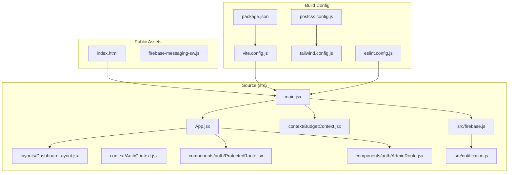
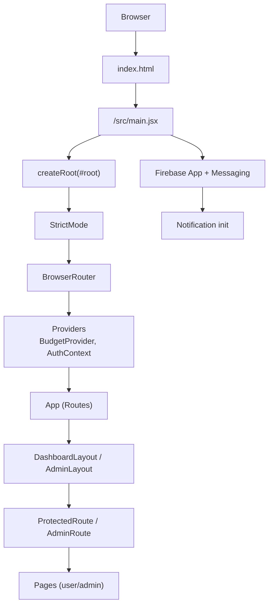
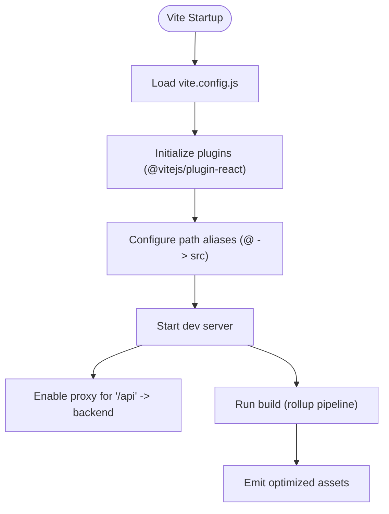
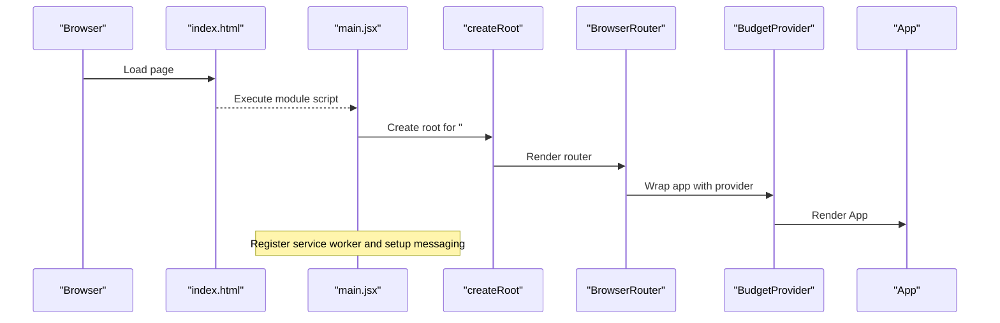
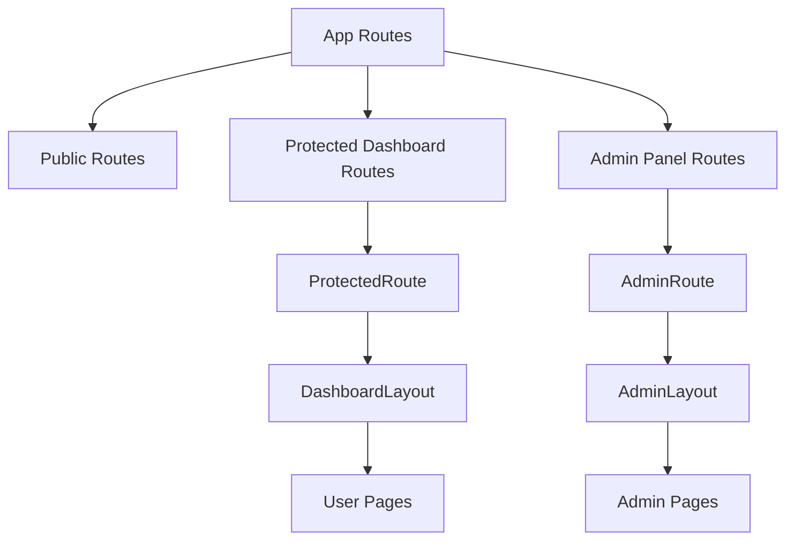
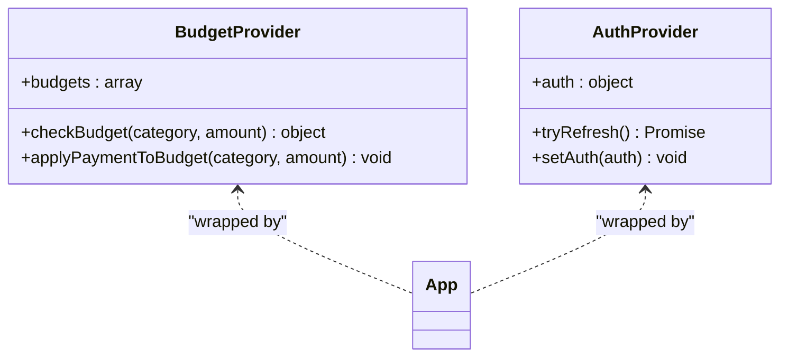
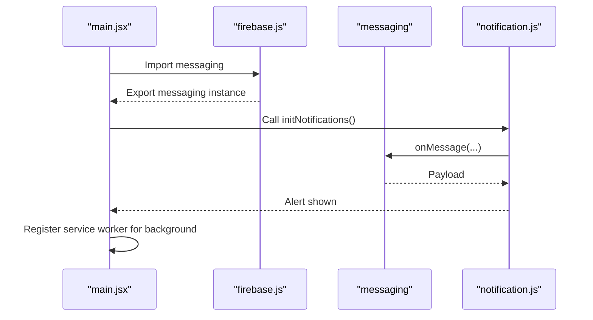
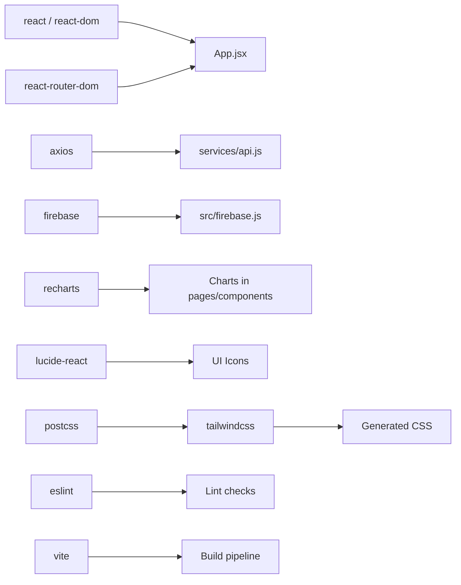

# Application Structure

<cite>
**Referenced Files in This Document**
- [vite.config.js](file://frontend/vite.config.js)
- [package.json](file://frontend/package.json)
- [index.html](file://frontend/index.html)
- [main.jsx](file://frontend/src/main.jsx)
- [App.jsx](file://frontend/src/App.jsx)
- [postcss.config.js](file://frontend/postcss.config.js)
- [tailwind.config.js](file://frontend/tailwind.config.js)
- [eslint.config.js](file://frontend/eslint.config.js)
- [firebase.js](file://frontend/src/firebase.js)
- [notification.js](file://frontend/src/notification.js)
- [AuthContext.jsx](file://frontend/src/context/AuthContext.jsx)
- [BudgetContext.jsx](file://frontend/src/context/BudgetContext.jsx)
- [ProtectedRoute.jsx](file://frontend/src/components/auth/ProtectedRoute.jsx)
- [AdminRoute.jsx](file://frontend/src/components/auth/AdminRoute.jsx)
- [DashboardLayout.jsx](file://frontend/src/layouts/DashboardLayout.jsx)
</cite>

## Table of Contents
1. [Introduction](#introduction)
2. [Project Structure](#project-structure)
3. [Core Components](#core-components)
4. [Architecture Overview](#architecture-overview)
5. [Detailed Component Analysis](#detailed-component-analysis)
6. [Dependency Analysis](#dependency-analysis)
7. [Performance Considerations](#performance-considerations)
8. [Troubleshooting Guide](#troubleshooting-guide)
9. [Conclusion](#conclusion)
10. [Appendices](#appendices)

## Introduction
This document explains the React application structure and initialization for the frontend. It covers the Vite-based build system configuration, the HTML template, the application entry point, and the React bootstrap process. It also documents routing, layout composition, context providers, authentication and admin guards, development and production configurations, module resolution, asset handling, environment considerations, and integration with Firebase for notifications. The goal is to provide a clear understanding of how the application initializes, how components mount, and how the build pipeline is configured.

## Project Structure
The frontend is organized into a conventional React + Vite structure under the frontend directory. Key areas include:
- Public assets and service worker under public
- Source code under src organized by feature and concern (components, pages, context, hooks, services, utils, layouts)
- Build and tooling configuration files at the project root (vite.config.js, package.json, postcss.config.js, tailwind.config.js, eslint.config.js)
- An HTML template that defines the DOM container and script entry point

**Diagram sources**
- [index.html](file://frontend/index.html)
- [main.jsx](file://frontend/src/main.jsx)
- [App.jsx](file://frontend/src/App.jsx)
- [DashboardLayout.jsx](file://frontend/src/layouts/DashboardLayout.jsx)
- [AuthContext.jsx](file://frontend/src/context/AuthContext.jsx)
- [BudgetContext.jsx](file://frontend/src/context/BudgetContext.jsx)
- [ProtectedRoute.jsx](file://frontend/src/components/auth/ProtectedRoute.jsx)
- [AdminRoute.jsx](file://frontend/src/components/auth/AdminRoute.jsx)
- [firebase.js](file://frontend/src/firebase.js)
- [notification.js](file://frontend/src/notification.js)
- [vite.config.js](file://frontend/vite.config.js)
- [postcss.config.js](file://frontend/postcss.config.js)
- [tailwind.config.js](file://frontend/tailwind.config.js)
- [eslint.config.js](file://frontend/eslint.config.js)
- [package.json](file://frontend/package.json)

**Section sources**
- [index.html](file://frontend/index.html)
- [main.jsx](file://frontend/src/main.jsx)
- [App.jsx](file://frontend/src/App.jsx)
- [vite.config.js](file://frontend/vite.config.js)
- [package.json](file://frontend/package.json)
- [postcss.config.js](file://frontend/postcss.config.js)
- [tailwind.config.js](file://frontend/tailwind.config.js)
- [eslint.config.js](file://frontend/eslint.config.js)

## Core Components
This section outlines the core building blocks of the application initialization and runtime composition.

- Application entry point and bootstrap
  - The HTML template defines the root containers and loads the module script for the React entry point.
  - The entry point creates the root, wraps the app in strict mode, router, and providers, and mounts the application tree.
  - It also registers a service worker for Firebase messaging and sets up foreground message handling.

- Routing and layout
  - The main App component defines public, user dashboard, transfers, payment results, budgets, transactions, bills, rewards, insights, alerts, notifications, and admin routes.
  - Layout-based routing is used with a dashboard layout wrapper and admin layout wrapper.
  - Route guards enforce authentication and admin-only access.

- Context providers
  - Budget provider supplies budget data and helpers to the application.
  - Authentication provider manages token refresh and exposes current auth state.

- Firebase integration
  - Firebase app is initialized and messaging is exported.
  - Foreground message handling is wired via a dedicated notification initializer.

**Section sources**
- [index.html](file://frontend/index.html)
- [main.jsx](file://frontend/src/main.jsx)
- [App.jsx](file://frontend/src/App.jsx)
- [DashboardLayout.jsx](file://frontend/src/layouts/DashboardLayout.jsx)
- [BudgetContext.jsx](file://frontend/src/context/BudgetContext.jsx)
- [AuthContext.jsx](file://frontend/src/context/AuthContext.jsx)
- [ProtectedRoute.jsx](file://frontend/src/components/auth/ProtectedRoute.jsx)
- [AdminRoute.jsx](file://frontend/src/components/auth/AdminRoute.jsx)
- [firebase.js](file://frontend/src/firebase.js)
- [notification.js](file://frontend/src/notification.js)

## Architecture Overview
The application follows a layered architecture:
- Presentation layer: React components, layouts, and pages
- Routing and navigation: React Router with protected routes and admin routes
- State management: Context providers for budget and auth
- Infrastructure: Vite build toolchain, PostCSS/Tailwind for styling, ESLint for linting, Firebase for notifications

**Diagram sources**
- [index.html](file://frontend/index.html)
- [main.jsx](file://frontend/src/main.jsx)
- [App.jsx](file://frontend/src/App.jsx)
- [DashboardLayout.jsx](file://frontend/src/layouts/DashboardLayout.jsx)
- [ProtectedRoute.jsx](file://frontend/src/components/auth/ProtectedRoute.jsx)
- [AdminRoute.jsx](file://frontend/src/components/auth/AdminRoute.jsx)
- [firebase.js](file://frontend/src/firebase.js)
- [notification.js](file://frontend/src/notification.js)

## Detailed Component Analysis

### Vite Configuration and Build Pipeline
- Plugins and resolver
  - React Fast Refresh plugin is enabled.
  - Path alias @ resolves to src for concise imports.
- Dev server and proxy
  - A proxy is configured for /api requests to a remote backend endpoint.
- Scripts
  - Standard dev/build/preview/lint scripts are defined.

**Diagram sources**
- [vite.config.js](file://frontend/vite.config.js)
- [package.json](file://frontend/package.json)

**Section sources**
- [vite.config.js](file://frontend/vite.config.js)
- [package.json](file://frontend/package.json)

### HTML Template and Entry Point
- Template
  - Declares viewport, title, icons, and two DOM containers: root and modal-root.
  - Loads the module script pointing to the React entry point.
- Entry point
  - Imports StrictMode, createRoot, BrowserRouter, BudgetProvider, App, and global styles.
  - Registers a service worker for Firebase messaging and logs registration status.
  - Subscribes to foreground messages and shows alerts.
  - Mounts the React tree inside the root container.

**Diagram sources**
- [index.html](file://frontend/index.html)
- [main.jsx](file://frontend/src/main.jsx)
- [App.jsx](file://frontend/src/App.jsx)

**Section sources**
- [index.html](file://frontend/index.html)
- [main.jsx](file://frontend/src/main.jsx)

### Routing, Guards, and Layouts
- App routes
  - Public routes for home, login, register, forgot/reset password, OTP verification.
  - User dashboard routes nested under a protected layout with sub-routes for accounts, transfers, payments, budgets, transactions, bills, rewards, insights, alerts, notifications, and settings.
  - Admin routes nested under an admin layout with sub-routes for users, KYC, transactions, rewards, analytics, alerts, and settings.
  - Fallback route navigates to home.
- Guards
  - ProtectedRoute enforces authentication and redirects unauthenticated users to login; admin users are redirected to admin.
  - AdminRoute enforces admin-only access and redirects accordingly.
- Layouts
  - DashboardLayout provides a responsive layout with outlet rendering for nested routes.

**Diagram sources**
- [App.jsx](file://frontend/src/App.jsx)
- [ProtectedRoute.jsx](file://frontend/src/components/auth/ProtectedRoute.jsx)
- [AdminRoute.jsx](file://frontend/src/components/auth/AdminRoute.jsx)
- [DashboardLayout.jsx](file://frontend/src/layouts/DashboardLayout.jsx)

**Section sources**
- [App.jsx](file://frontend/src/App.jsx)
- [ProtectedRoute.jsx](file://frontend/src/components/auth/ProtectedRoute.jsx)
- [AdminRoute.jsx](file://frontend/src/components/auth/AdminRoute.jsx)
- [DashboardLayout.jsx](file://frontend/src/layouts/DashboardLayout.jsx)

### Context Providers
- Budget provider
  - Supplies initial budgets and helpers to compute remaining amounts, check thresholds, and apply payments.
- Auth provider
  - Manages authentication state and performs token refresh on startup.

**Diagram sources**
- [BudgetContext.jsx](file://frontend/src/context/BudgetContext.jsx)
- [AuthContext.jsx](file://frontend/src/context/AuthContext.jsx)

**Section sources**
- [BudgetContext.jsx](file://frontend/src/context/BudgetContext.jsx)
- [AuthContext.jsx](file://frontend/src/context/AuthContext.jsx)

### Firebase Messaging Integration
- Initialization
  - Firebase app is initialized with configuration constants.
  - Messaging instance is exported for use across components.
- Foreground message handling
  - A notification initializer subscribes to foreground messages and displays alerts.
- Background message handling
  - The entry point registers a service worker for background messages.

**Diagram sources**
- [main.jsx](file://frontend/src/main.jsx)
- [firebase.js](file://frontend/src/firebase.js)
- [notification.js](file://frontend/src/notification.js)

**Section sources**
- [firebase.js](file://frontend/src/firebase.js)
- [notification.js](file://frontend/src/notification.js)
- [main.jsx](file://frontend/src/main.jsx)

## Dependency Analysis
- External dependencies
  - React and ReactDOM for UI rendering.
  - react-router-dom for routing and navigation.
  - axios for HTTP requests.
  - lucide-react and recharts for UI and charts.
  - firebase for notifications and messaging.
- Dev dependencies
  - Vite, @vitejs/plugin-react, Tailwind CSS, Autoprefixer, ESLint, PostCSS.
- Module resolution
  - Alias @ resolves to src for shorter imports across the codebase.

**Diagram sources**
- [package.json](file://frontend/package.json)
- [vite.config.js](file://frontend/vite.config.js)
- [tailwind.config.js](file://frontend/tailwind.config.js)
- [postcss.config.js](file://frontend/postcss.config.js)
- [eslint.config.js](file://frontend/eslint.config.js)

**Section sources**
- [package.json](file://frontend/package.json)
- [vite.config.js](file://frontend/vite.config.js)
- [tailwind.config.js](file://frontend/tailwind.config.js)
- [postcss.config.js](file://frontend/postcss.config.js)
- [eslint.config.js](file://frontend/eslint.config.js)

## Performance Considerations
- Build optimization
  - Vite’s dev server leverages native ES modules and fast refresh. Production builds use Rollup with minification and code splitting by default.
- Asset handling
  - Static assets under public are served as-is. Place images and service workers in public for optimal caching and availability.
- Styling pipeline
  - Tailwind scans templates and components to purge unused CSS in production builds.
- Network and proxy
  - The proxy reduces CORS concerns during development by forwarding API traffic to the backend origin.

[No sources needed since this section provides general guidance]

## Troubleshooting Guide
- Service worker registration
  - If the service worker fails to register, check browser console for errors and ensure the service worker file is present in the public directory.
- Foreground notifications
  - Ensure messaging is initialized and onMessage is subscribed. Confirm permissions are granted.
- Route guards
  - If protected routes redirect unexpectedly, verify token and user state in local storage and ensure AuthContext is properly wrapped.
- Proxy configuration
  - If API calls fail during development, confirm the proxy target matches the backend origin and credentials.

**Section sources**
- [main.jsx](file://frontend/src/main.jsx)
- [firebase.js](file://frontend/src/firebase.js)
- [notification.js](file://frontend/src/notification.js)
- [ProtectedRoute.jsx](file://frontend/src/components/auth/ProtectedRoute.jsx)
- [AdminRoute.jsx](file://frontend/src/components/auth/AdminRoute.jsx)
- [vite.config.js](file://frontend/vite.config.js)

## Conclusion
The application is structured around a clean React + Vite foundation with robust routing, guard-based access control, and integrated Firebase messaging. The build pipeline is streamlined with Tailwind CSS and ESLint, while the development server includes a proxy for seamless backend integration. The entry point orchestrates providers and routing, ensuring a scalable and maintainable architecture.

[No sources needed since this section summarizes without analyzing specific files]

## Appendices

### Development vs Production Configurations
- Development
  - Vite dev server with fast refresh and HMR.
  - Proxy for API endpoints.
  - ESLint configured for recommended rules and React hooks.
- Production
  - Vite build produces optimized static assets.
  - Tailwind purges unused styles.
  - No dev server; preview serves built assets locally.

**Section sources**
- [vite.config.js](file://frontend/vite.config.js)
- [package.json](file://frontend/package.json)
- [tailwind.config.js](file://frontend/tailwind.config.js)
- [eslint.config.js](file://frontend/eslint.config.js)

### Environment Variables Management
- The project does not define explicit environment variables in the provided configuration files. For environment-specific values, consider adding a .env file pattern and loading variables via Vite’s built-in environment variable exposure.

[No sources needed since this section provides general guidance]

### Module Resolution Patterns
- The @ alias resolves to src, enabling concise imports across the application. Maintain consistent naming and folder structure to leverage this convention effectively.

**Section sources**
- [vite.config.js](file://frontend/vite.config.js)