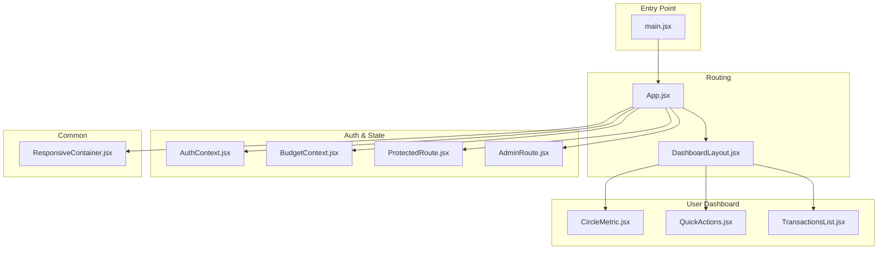
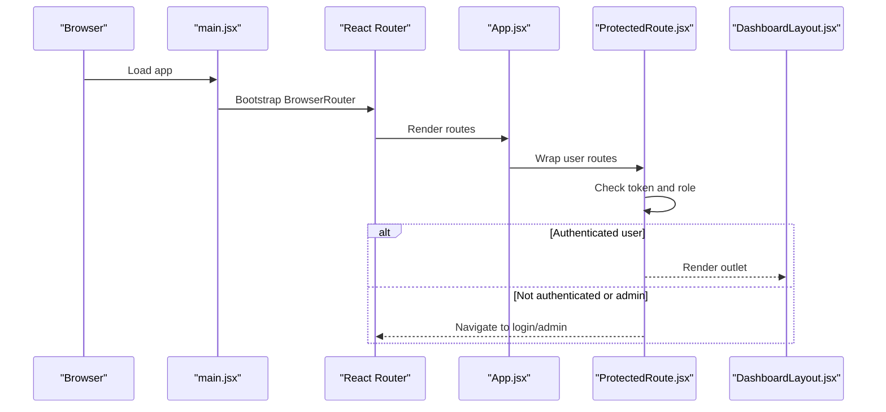
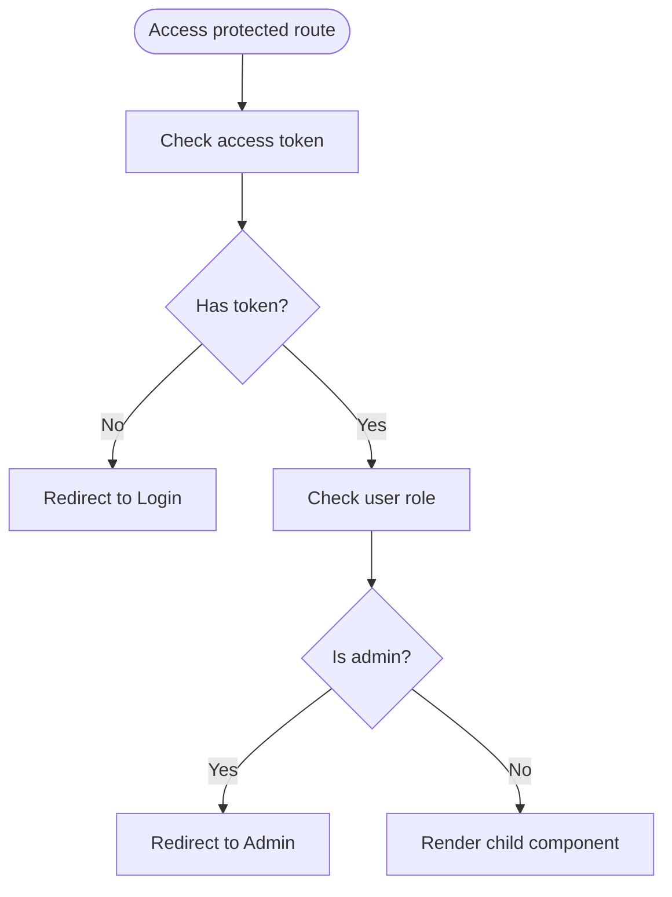
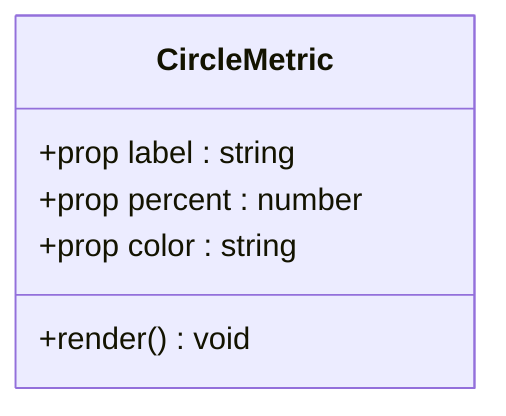
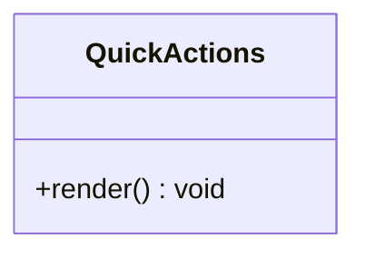
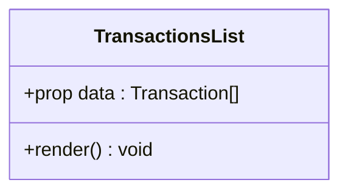
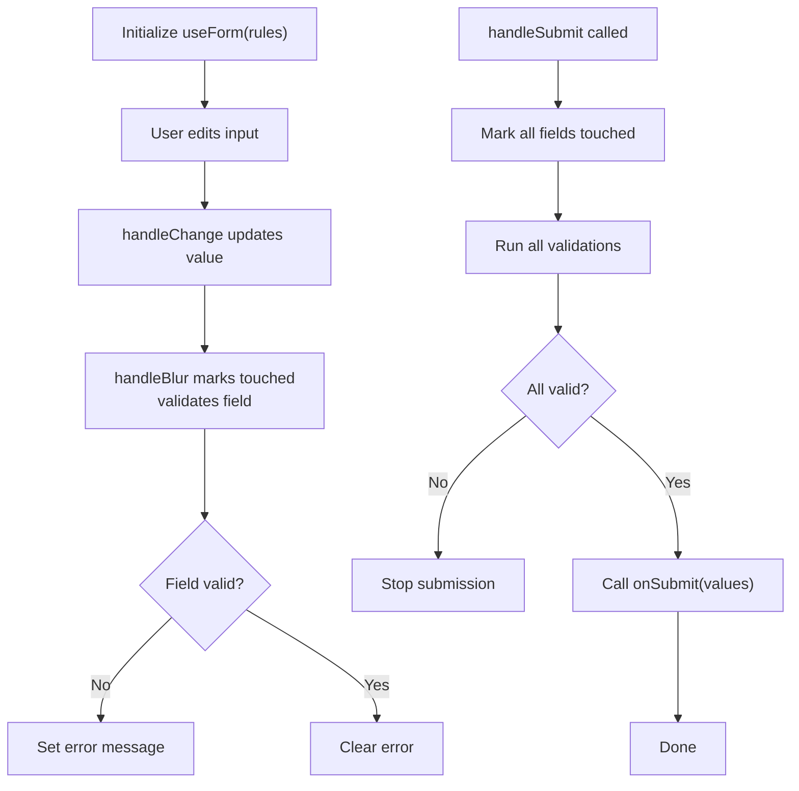
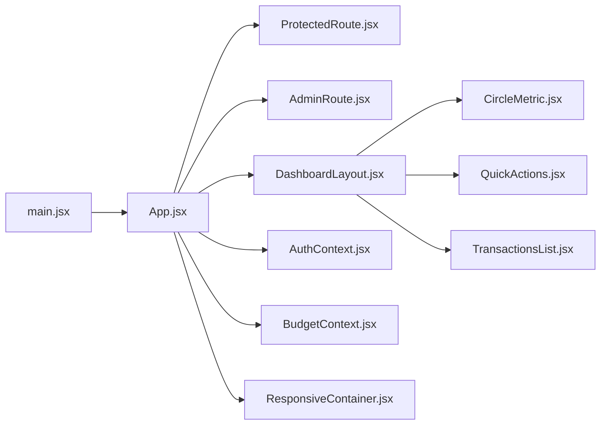

# Component Architecture

<cite>
**Referenced Files in This Document**
- [App.jsx](file://frontend/src/App.jsx)
- [main.jsx](file://frontend/src/main.jsx)
- [DashboardLayout.jsx](file://frontend/src/layouts/DashboardLayout.jsx)
- [AuthContext.jsx](file://frontend/src/context/AuthContext.jsx)
- [BudgetContext.jsx](file://frontend/src/context/BudgetContext.jsx)
- [ProtectedRoute.jsx](file://frontend/src/components/auth/ProtectedRoute.jsx)
- [AdminRoute.jsx](file://frontend/src/components/auth/AdminRoute.jsx)
- [ResponsiveContainer.jsx](file://frontend/src/components/common/ResponsiveContainer.jsx)
- [useForm.js](file://frontend/src/hooks/useForm.js)
- [CircleMetric.jsx](file://frontend/src/components/user/dashboard/CircleMetric.jsx)
- [QuickActions.jsx](file://frontend/src/components/user/dashboard/QuickActions.jsx)
- [TransactionsList.jsx](file://frontend/src/components/user/dashboard/TransactionsList.jsx)
</cite>

## Table of Contents
1. [Introduction](#introduction)
2. [Project Structure](#project-structure)
3. [Core Components](#core-components)
4. [Architecture Overview](#architecture-overview)
5. [Detailed Component Analysis](#detailed-component-analysis)
6. [Dependency Analysis](#dependency-analysis)
7. [Performance Considerations](#performance-considerations)
8. [Troubleshooting Guide](#troubleshooting-guide)
9. [Conclusion](#conclusion)
10. [Appendices](#appendices)

## Introduction
This document explains the component-based architecture and component hierarchy of the frontend. It covers how common components, user-specific components, and admin components are organized, how component composition prevents prop drilling, and how reusability is achieved. It also documents dashboard components for financial metrics, quick actions, and transaction lists, along with form components, validation patterns, and submission handling. Styling approaches, CSS-in-JS patterns, and responsive design are addressed, followed by testing strategies, Storybook integration, and documentation standards.

## Project Structure
The frontend is organized around a route-driven component architecture:
- Routing defines public, user dashboard, and admin panels.
- Layouts wrap page-level components to share common UI scaffolding.
- Context providers manage cross-cutting concerns like authentication and budgets.
- Components are grouped by domain: common, auth guards, user dashboard, and admin pages.

**Diagram sources**
- [main.jsx:1-46](file://frontend/src/main.jsx#L1-L46)
- [App.jsx:1-171](file://frontend/src/App.jsx#L1-L171)
- [DashboardLayout.jsx:1-50](file://frontend/src/layouts/DashboardLayout.jsx#L1-L50)
- [AuthContext.jsx:1-47](file://frontend/src/context/AuthContext.jsx#L1-L47)
- [BudgetContext.jsx:1-63](file://frontend/src/context/BudgetContext.jsx#L1-L63)
- [ProtectedRoute.jsx:1-40](file://frontend/src/components/auth/ProtectedRoute.jsx#L1-L40)
- [AdminRoute.jsx:1-25](file://frontend/src/components/auth/AdminRoute.jsx#L1-L25)
- [ResponsiveContainer.jsx:1-71](file://frontend/src/components/common/ResponsiveContainer.jsx#L1-L71)
- [CircleMetric.jsx:1-87](file://frontend/src/components/user/dashboard/CircleMetric.jsx#L1-L87)
- [QuickActions.jsx:1-113](file://frontend/src/components/user/dashboard/QuickActions.jsx#L1-L113)
- [TransactionsList.jsx:1-136](file://frontend/src/components/user/dashboard/TransactionsList.jsx#L1-L136)

**Section sources**
- [App.jsx:1-171](file://frontend/src/App.jsx#L1-L171)
- [main.jsx:1-46](file://frontend/src/main.jsx#L1-L46)

## Core Components
- Routing and layout: App.jsx defines routes and wraps user routes with ProtectedRoute and admin routes with AdminRoute. DashboardLayout.jsx provides a shared layout with responsive behavior.
- Authentication and state: AuthContext.jsx centralizes auth state and refresh logic; BudgetContext.jsx manages budget data and helpers for budget checks and updates.
- Guards: ProtectedRoute.jsx ensures only authenticated non-admin users can access user routes; AdminRoute.jsx restricts admin routes to admin users.
- Common utilities: ResponsiveContainer.jsx encapsulates responsive padding and max-width logic.
- Form management: useForm.js provides reusable form state, validation, and submission handling.

**Section sources**
- [App.jsx:78-168](file://frontend/src/App.jsx#L78-L168)
- [DashboardLayout.jsx:14-47](file://frontend/src/layouts/DashboardLayout.jsx#L14-L47)
- [AuthContext.jsx:23-46](file://frontend/src/context/AuthContext.jsx#L23-L46)
- [BudgetContext.jsx:22-62](file://frontend/src/context/BudgetContext.jsx#L22-L62)
- [ProtectedRoute.jsx:27-37](file://frontend/src/components/auth/ProtectedRoute.jsx#L27-L37)
- [AdminRoute.jsx:12-22](file://frontend/src/components/auth/AdminRoute.jsx#L12-L22)
- [ResponsiveContainer.jsx:11-69](file://frontend/src/components/common/ResponsiveContainer.jsx#L11-L69)
- [useForm.js:19-106](file://frontend/src/hooks/useForm.js#L19-L106)

## Architecture Overview
The architecture follows a layered pattern:
- Entry point initializes providers and router.
- App.jsx orchestrates routes, guards, and nested routes under user and admin contexts.
- DashboardLayout.jsx composes dashboard pages with consistent spacing and responsiveness.
- Contexts provide state to components without prop drilling.
- Components are small, focused, and reusable.

**Diagram sources**
- [main.jsx:37-45](file://frontend/src/main.jsx#L37-L45)
- [App.jsx:98-139](file://frontend/src/App.jsx#L98-L139)
- [ProtectedRoute.jsx:27-37](file://frontend/src/components/auth/ProtectedRoute.jsx#L27-L37)
- [DashboardLayout.jsx:10-46](file://frontend/src/layouts/DashboardLayout.jsx#L10-L46)

## Detailed Component Analysis

### Component Organization and Composition Patterns
- Public routes: Home, Login, Register, ForgotPassword, ResetPassword, VerifyOtp.
- User dashboard routes: Profile, Accounts, Balance, Transfers, Payments, Budgets, Transactions, Bills, Rewards, Insights, Alerts, Settings.
- Admin routes: AdminDashboard, AdminUsers, AdminKYCApproval, AdminTransactions, AdminRewards, AdminAnalytics, AdminAlerts, AdminSettings.
- Layout composition: User routes are nested under ProtectedRoute and DashboardLayout; admin routes are nested under AdminRoute and AdminLayout.
- Prop drilling prevention: AuthContext and BudgetContext provide state to deeply nested components without passing props down the tree.

**Section sources**
- [App.jsx:14-77](file://frontend/src/App.jsx#L14-L77)
- [App.jsx:98-160](file://frontend/src/App.jsx#L98-L160)

### Authentication and Authorization Guards
- ProtectedRoute.jsx checks for a valid access token and redirects unauthenticated users to the login route. It also redirects admin users to the admin panel to prevent overlap.
- AdminRoute.jsx verifies admin status and redirects unauthorized users accordingly.

**Diagram sources**
- [ProtectedRoute.jsx:27-37](file://frontend/src/components/auth/ProtectedRoute.jsx#L27-L37)
- [AdminRoute.jsx:12-22](file://frontend/src/components/auth/AdminRoute.jsx#L12-L22)

**Section sources**
- [ProtectedRoute.jsx:27-37](file://frontend/src/components/auth/ProtectedRoute.jsx#L27-L37)
- [AdminRoute.jsx:12-22](file://frontend/src/components/auth/AdminRoute.jsx#L12-L22)

### Dashboard Components

#### CircleMetric (Financial Metric)
- Purpose: Renders a percentage-based financial metric using a pie chart with hover effects.
- Props: label, percent, color.
- Styling: Inline styles define card, center, value, and label styles; hover transforms and shadows enhance interactivity.
- Reusability: Pure component with configurable label, percent, and color; suitable for multiple metrics.

**Diagram sources**
- [CircleMetric.jsx:9-51](file://frontend/src/components/user/dashboard/CircleMetric.jsx#L9-L51)

**Section sources**
- [CircleMetric.jsx:9-51](file://frontend/src/components/user/dashboard/CircleMetric.jsx#L9-L51)

#### QuickActions (User Dashboard)
- Purpose: Presents four primary actions as styled cards with icons and navigation.
- Props: None (uses local actions array and navigation).
- Styling: Grid layout with responsive minmax sizing; each action has gradient background and icon styling.
- Navigation: Clicking an action navigates to the associated route.

**Diagram sources**
- [QuickActions.jsx:13-71](file://frontend/src/components/user/dashboard/QuickActions.jsx#L13-L71)

**Section sources**
- [QuickActions.jsx:13-71](file://frontend/src/components/user/dashboard/QuickActions.jsx#L13-L71)

#### TransactionsList (Recent Transactions)
- Purpose: Displays recent transactions with debit/credit differentiation and responsive layout.
- Props: data (array of transactions).
- Styling: Inline styles adapt padding, font sizes, spacing, and layout based on screen width.
- Behavior: Shows empty state message when no transactions; otherwise renders rows with icons, descriptions, dates, and amounts.

**Diagram sources**
- [TransactionsList.jsx:13-67](file://frontend/src/components/user/dashboard/TransactionsList.jsx#L13-L67)

**Section sources**
- [TransactionsList.jsx:13-67](file://frontend/src/components/user/dashboard/TransactionsList.jsx#L13-L67)

### Form Components, Validation, and Submission
- Reusable hook: useForm.js manages form state (values, errors, touched), handles change and blur events, validates fields, and executes submit handlers.
- Validation pattern: Validation rules are passed as an object keyed by field name; each validator returns a result with validity and error message.
- Submission handling: handleSubmit triggers validation, sets all fields as touched, and calls onSubmit if valid; supports async submission and error logging.
- Reset and manual setters: Provides reset, setFieldValue, and setFieldError for programmatic control.

**Diagram sources**
- [useForm.js:19-106](file://frontend/src/hooks/useForm.js#L19-L106)

**Section sources**
- [useForm.js:19-106](file://frontend/src/hooks/useForm.js#L19-L106)

### Styling Approaches and Responsive Design
- CSS-in-JS: Dashboard components (CircleMetric, QuickActions, TransactionsList) use inline styles for simplicity and encapsulation.
- Responsive design: 
  - DashboardLayout.jsx uses a responsive hook to adjust layout direction and padding.
  - ResponsiveContainer.jsx computes padding and max-width based on breakpoints.
  - TransactionsList.jsx adapts styles (font sizes, spacing, layout direction) based on window width.
- Tailwind-based responsive utilities are available via the project’s build configuration.

**Section sources**
- [DashboardLayout.jsx:14-47](file://frontend/src/layouts/DashboardLayout.jsx#L14-L47)
- [ResponsiveContainer.jsx:18-59](file://frontend/src/components/common/ResponsiveContainer.jsx#L18-L59)
- [TransactionsList.jsx:71-136](file://frontend/src/components/user/dashboard/TransactionsList.jsx#L71-L136)

### Component Reusability Strategies
- Small, single-responsibility components: CircleMetric, QuickActions, TransactionsList focus on one UI concern.
- Props-driven customization: Components accept props for data and styling to increase reuse.
- Shared layout: DashboardLayout.jsx standardizes margins, paddings, and orientation across user pages.
- Context decoupling: AuthContext and BudgetContext eliminate prop drilling for auth and budget data.

**Section sources**
- [DashboardLayout.jsx:14-47](file://frontend/src/layouts/DashboardLayout.jsx#L14-L47)
- [AuthContext.jsx:23-46](file://frontend/src/context/AuthContext.jsx#L23-L46)
- [BudgetContext.jsx:22-62](file://frontend/src/context/BudgetContext.jsx#L22-L62)

## Dependency Analysis
- Entry point depends on router and providers; App.jsx depends on route guards and layouts.
- Route guards depend on storage utilities to check tokens and user roles.
- Dashboard components depend on external libraries for charts and icons.
- Contexts are consumed by components without tight coupling to routing.

**Diagram sources**
- [main.jsx:37-45](file://frontend/src/main.jsx#L37-L45)
- [App.jsx:98-160](file://frontend/src/App.jsx#L98-L160)
- [ProtectedRoute.jsx:27-37](file://frontend/src/components/auth/ProtectedRoute.jsx#L27-L37)
- [AdminRoute.jsx:12-22](file://frontend/src/components/auth/AdminRoute.jsx#L12-L22)
- [DashboardLayout.jsx:14-47](file://frontend/src/layouts/DashboardLayout.jsx#L14-L47)
- [CircleMetric.jsx:9-51](file://frontend/src/components/user/dashboard/CircleMetric.jsx#L9-L51)
- [QuickActions.jsx:13-71](file://frontend/src/components/user/dashboard/QuickActions.jsx#L13-L71)
- [TransactionsList.jsx:13-67](file://frontend/src/components/user/dashboard/TransactionsList.jsx#L13-L67)
- [AuthContext.jsx:23-46](file://frontend/src/context/AuthContext.jsx#L23-L46)
- [BudgetContext.jsx:22-62](file://frontend/src/context/BudgetContext.jsx#L22-L62)
- [ResponsiveContainer.jsx:11-69](file://frontend/src/components/common/ResponsiveContainer.jsx#L11-L69)

**Section sources**
- [App.jsx:98-160](file://frontend/src/App.jsx#L98-L160)

## Performance Considerations
- Minimize unnecessary re-renders: Memoize derived values in contexts and avoid passing new object references on every render.
- Lazy loading: Consider lazy-loading heavy dashboard components (e.g., charts) to reduce initial bundle size.
- Inline styles: Keep styles static or memoized to avoid expensive recalculations; consider CSS modules or styled-components for dynamic themes.
- Responsive logic: Debounce resize handlers if extending ResponsiveContainer to prevent frequent reflows.

## Troubleshooting Guide
- Authentication redirect loops:
  - Verify token presence and user role checks in route guards.
  - Ensure AuthContext refresh flow completes successfully.
- Budget-related issues:
  - Confirm budget thresholds and remaining calculations align with UI expectations.
- Form submission failures:
  - Check validation rules and error messages returned by the hook.
  - Ensure async submit handlers resolve properly and errors are handled gracefully.

**Section sources**
- [ProtectedRoute.jsx:27-37](file://frontend/src/components/auth/ProtectedRoute.jsx#L27-L37)
- [AdminRoute.jsx:12-22](file://frontend/src/components/auth/AdminRoute.jsx#L12-L22)
- [AuthContext.jsx:26-42](file://frontend/src/context/AuthContext.jsx#L26-L42)
- [BudgetContext.jsx:35-53](file://frontend/src/context/BudgetContext.jsx#L35-L53)
- [useForm.js:60-75](file://frontend/src/hooks/useForm.js#L60-L75)

## Conclusion
The component architecture emphasizes clear separation of concerns, route-driven composition, and context-based state management. Guards protect routes effectively, while reusable components and shared layouts promote consistency and maintainability. Inline styles and responsive utilities enable rapid prototyping, and the useForm hook standardizes form behavior across the application.

## Appendices

### Testing Strategies
- Unit tests for hooks and utilities: Test useForm behavior (change, blur, validation, submit) and budget helpers.
- Component snapshot tests: Capture rendered output of dashboard components under different props and screen sizes.
- Integration tests: Validate route guards and context providers in realistic flows.

### Storybook Integration
- Document each component with stories showcasing default, disabled, and variant states.
- Include controls for props (e.g., label, percent, color) and interactive knobs for hover/focus states.

### Documentation Standards
- Component READMEs: Describe purpose, props, usage examples, and related components.
- Style guide: Define naming conventions for inline styles and responsive adaptations.
- Accessibility: Ensure semantic HTML, ARIA attributes where needed, and keyboard navigation support.