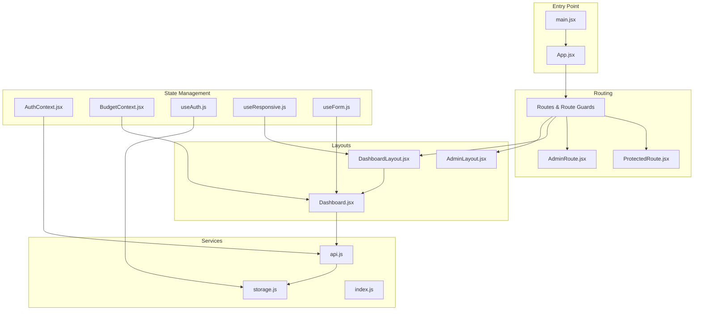
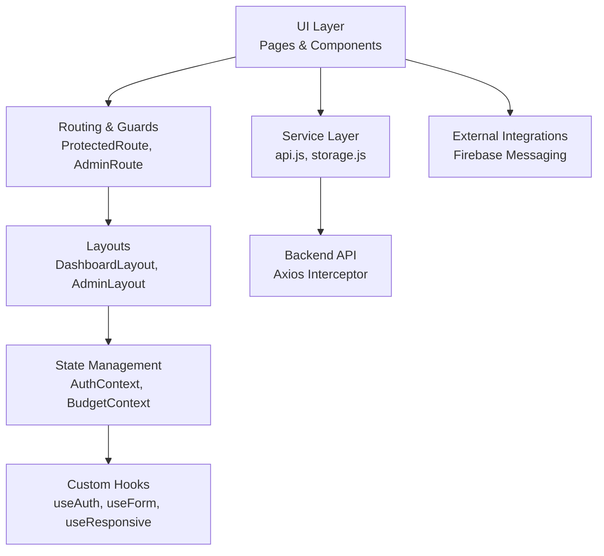
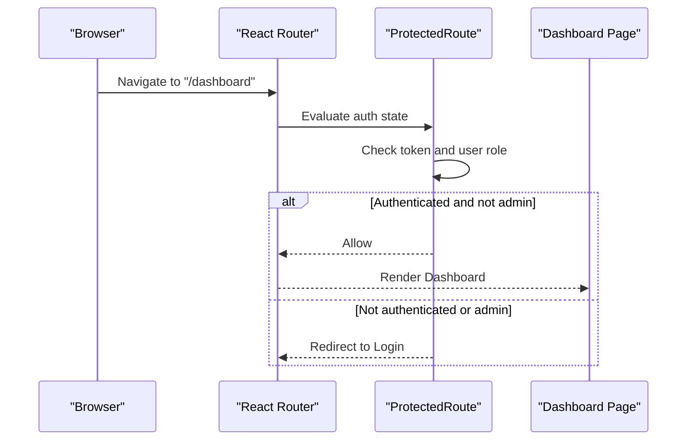
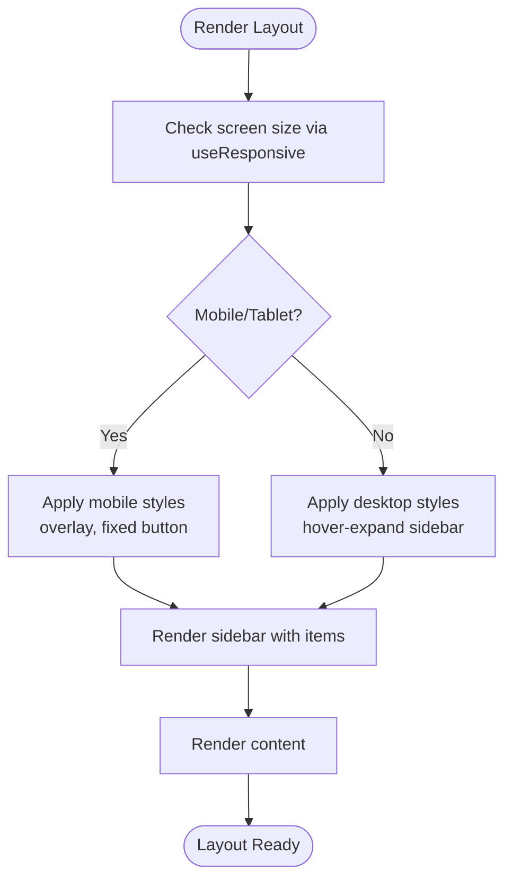
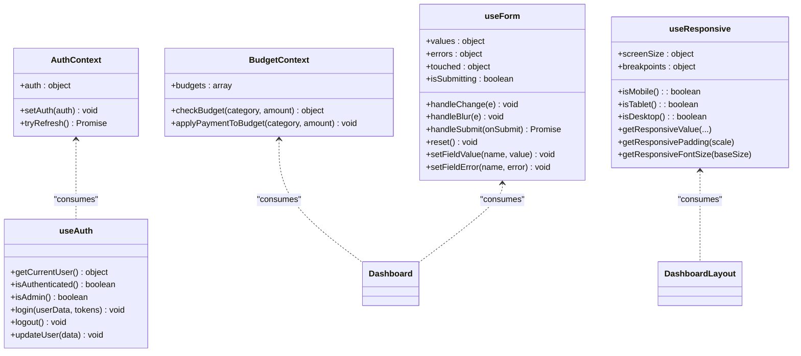
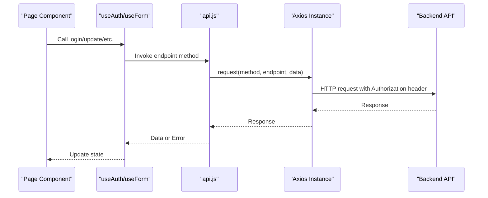
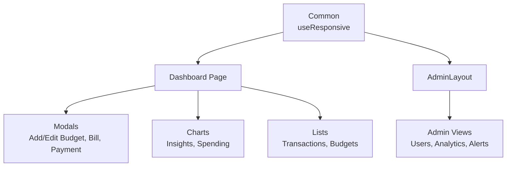
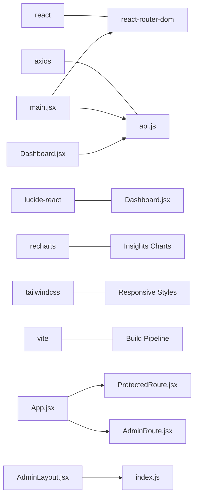

# Frontend Architecture

<cite>
**Referenced Files in This Document**
- [main.jsx](file://frontend/src/main.jsx)
- [App.jsx](file://frontend/src/App.jsx)
- [DashboardLayout.jsx](file://frontend/src/layouts/DashboardLayout.jsx)
- [AuthContext.jsx](file://frontend/src/context/AuthContext.jsx)
- [BudgetContext.jsx](file://frontend/src/context/BudgetContext.jsx)
- [ProtectedRoute.jsx](file://frontend/src/components/auth/ProtectedRoute.jsx)
- [AdminRoute.jsx](file://frontend/src/components/auth/AdminRoute.jsx)
- [useAuth.js](file://frontend/src/hooks/useAuth.js)
- [useForm.js](file://frontend/src/hooks/useForm.js)
- [useResponsive.js](file://frontend/src/hooks/useResponsive.js)
- [api.js](file://frontend/src/services/api.js)
- [storage.js](file://frontend/src/utils/storage.js)
- [index.js](file://frontend/src/constants/index.js)
- [Dashboard.jsx](file://frontend/src/pages/user/Dashboard.jsx)
- [AdminLayout.jsx](file://frontend/src/pages/admin/AdminLayout.jsx)
- [package.json](file://frontend/package.json)
</cite>

## Table of Contents
1. [Introduction](#introduction)
2. [Project Structure](#project-structure)
3. [Core Components](#core-components)
4. [Architecture Overview](#architecture-overview)
5. [Detailed Component Analysis](#detailed-component-analysis)
6. [Dependency Analysis](#dependency-analysis)
7. [Performance Considerations](#performance-considerations)
8. [Troubleshooting Guide](#troubleshooting-guide)
9. [Conclusion](#conclusion)
10. [Appendices](#appendices)

## Introduction
This document describes the frontend architecture of the React-based digital banking dashboard. It covers the component-based structure, layout systems, state management with React Context and custom hooks, routing with protected and role-gated routes, the service layer for API communication, styling and responsive design, and performance optimization strategies. The goal is to help both technical and non-technical readers understand how the frontend is organized and how to extend or maintain it effectively.

## Project Structure
The frontend is organized around a clear separation of concerns:
- Entry point initializes providers and routing.
- Routing defines public, user dashboard, and admin routes with layout wrappers.
- Layouts provide shared UI scaffolding for user and admin areas.
- Pages implement domain-specific views.
- Components encapsulate reusable UI elements and route guards.
- Contexts manage global state for authentication and budgets.
- Hooks encapsulate cross-cutting concerns like forms, auth, and responsiveness.
- Services abstract API communication.
- Utilities centralize storage and constants.

**Diagram sources**
- [main.jsx:37-45](file://frontend/src/main.jsx#L37-L45)
- [App.jsx:83-167](file://frontend/src/App.jsx#L83-L167)
- [ProtectedRoute.jsx:27-36](file://frontend/src/components/auth/ProtectedRoute.jsx#L27-L36)
- [AdminRoute.jsx:12-21](file://frontend/src/components/auth/AdminRoute.jsx#L12-L21)
- [DashboardLayout.jsx:14-46](file://frontend/src/layouts/DashboardLayout.jsx#L14-L46)
- [Dashboard.jsx:58-311](file://frontend/src/pages/user/Dashboard.jsx#L58-L311)
- [AdminLayout.jsx:20-142](file://frontend/src/pages/admin/AdminLayout.jsx#L20-L142)
- [AuthContext.jsx:23-45](file://frontend/src/context/AuthContext.jsx#L23-L45)
- [BudgetContext.jsx:22-59](file://frontend/src/context/BudgetContext.jsx#L22-L59)
- [useAuth.js:22-62](file://frontend/src/hooks/useAuth.js#L22-L62)
- [useResponsive.js:25-112](file://frontend/src/hooks/useResponsive.js#L25-L112)
- [useForm.js:19-105](file://frontend/src/hooks/useForm.js#L19-L105)
- [api.js:19-72](file://frontend/src/services/api.js#L19-L72)
- [storage.js:81-99](file://frontend/src/utils/storage.js#L81-L99)
- [index.js:6-62](file://frontend/src/constants/index.js#L6-L62)

**Section sources**
- [main.jsx:10-45](file://frontend/src/main.jsx#L10-L45)
- [App.jsx:83-167](file://frontend/src/App.jsx#L83-L167)
- [DashboardLayout.jsx:14-46](file://frontend/src/layouts/DashboardLayout.jsx#L14-L46)
- [Dashboard.jsx:58-311](file://frontend/src/pages/user/Dashboard.jsx#L58-L311)
- [AdminLayout.jsx:20-142](file://frontend/src/pages/admin/AdminLayout.jsx#L20-L142)

## Core Components
- Entry point and providers: Initializes routing, global providers, and notifications.
- Routing and guards: Public routes, user dashboard routes, admin routes, and route guards.
- Layouts: Shared dashboard and admin scaffolds with responsive behavior.
- Contexts: Global auth and budget state.
- Hooks: Form handling, auth operations, and responsive utilities.
- Services: Centralized API client and storage utilities.
- Constants: Routes, endpoints, storage keys, and UI constants.

Key implementation references:
- Providers and routing bootstrap: [main.jsx:37-45](file://frontend/src/main.jsx#L37-L45)
- Route definitions and guards: [App.jsx:83-167](file://frontend/src/App.jsx#L83-L167)
- Protected route guard: [ProtectedRoute.jsx:27-36](file://frontend/src/components/auth/ProtectedRoute.jsx#L27-L36)
- Admin route guard: [AdminRoute.jsx:12-21](file://frontend/src/components/auth/AdminRoute.jsx#L12-L21)
- Dashboard layout: [DashboardLayout.jsx:14-46](file://frontend/src/layouts/DashboardLayout.jsx#L14-L46)
- Dashboard page: [Dashboard.jsx:58-311](file://frontend/src/pages/user/Dashboard.jsx#L58-L311)
- Admin layout: [AdminLayout.jsx:20-142](file://frontend/src/pages/admin/AdminLayout.jsx#L20-L142)
- Auth context: [AuthContext.jsx:23-45](file://frontend/src/context/AuthContext.jsx#L23-L45)
- Budget context: [BudgetContext.jsx:22-59](file://frontend/src/context/BudgetContext.jsx#L22-L59)
- Auth hook: [useAuth.js:22-62](file://frontend/src/hooks/useAuth.js#L22-L62)
- Responsive hook: [useResponsive.js:25-112](file://frontend/src/hooks/useResponsive.js#L25-L112)
- Form hook: [useForm.js:19-105](file://frontend/src/hooks/useForm.js#L19-L105)
- API service: [api.js:19-72](file://frontend/src/services/api.js#L19-L72)
- Storage utilities: [storage.js:81-99](file://frontend/src/utils/storage.js#L81-L99)
- Constants: [index.js:6-62](file://frontend/src/constants/index.js#L6-L62)

**Section sources**
- [main.jsx:10-45](file://frontend/src/main.jsx#L10-L45)
- [App.jsx:83-167](file://frontend/src/App.jsx#L83-L167)
- [ProtectedRoute.jsx:27-36](file://frontend/src/components/auth/ProtectedRoute.jsx#L27-L36)
- [AdminRoute.jsx:12-21](file://frontend/src/components/auth/AdminRoute.jsx#L12-L21)
- [DashboardLayout.jsx:14-46](file://frontend/src/layouts/DashboardLayout.jsx#L14-L46)
- [Dashboard.jsx:58-311](file://frontend/src/pages/user/Dashboard.jsx#L58-L311)
- [AdminLayout.jsx:20-142](file://frontend/src/pages/admin/AdminLayout.jsx#L20-L142)
- [AuthContext.jsx:23-45](file://frontend/src/context/AuthContext.jsx#L23-L45)
- [BudgetContext.jsx:22-59](file://frontend/src/context/BudgetContext.jsx#L22-L59)
- [useAuth.js:22-62](file://frontend/src/hooks/useAuth.js#L22-L62)
- [useResponsive.js:25-112](file://frontend/src/hooks/useResponsive.js#L25-L112)
- [useForm.js:19-105](file://frontend/src/hooks/useForm.js#L19-L105)
- [api.js:19-72](file://frontend/src/services/api.js#L19-L72)
- [storage.js:81-99](file://frontend/src/utils/storage.js#L81-L99)
- [index.js:6-62](file://frontend/src/constants/index.js#L6-L62)

## Architecture Overview
The frontend follows a layered architecture:
- Presentation layer: Pages and components.
- Routing and navigation: React Router with layout-based routing and guards.
- State management: React Context for auth and budgets, plus custom hooks for forms and responsiveness.
- Service layer: Axios-based API client with interceptors and centralized endpoints.
- Infrastructure: Firebase messaging initialization and service worker registration.

**Diagram sources**
- [App.jsx:83-167](file://frontend/src/App.jsx#L83-L167)
- [ProtectedRoute.jsx:27-36](file://frontend/src/components/auth/ProtectedRoute.jsx#L27-L36)
- [AdminRoute.jsx:12-21](file://frontend/src/components/auth/AdminRoute.jsx#L12-L21)
- [DashboardLayout.jsx:14-46](file://frontend/src/layouts/DashboardLayout.jsx#L14-L46)
- [AdminLayout.jsx:20-142](file://frontend/src/pages/admin/AdminLayout.jsx#L20-L142)
- [AuthContext.jsx:23-45](file://frontend/src/context/AuthContext.jsx#L23-L45)
- [BudgetContext.jsx:22-59](file://frontend/src/context/BudgetContext.jsx#L22-L59)
- [useAuth.js:22-62](file://frontend/src/hooks/useAuth.js#L22-L62)
- [useForm.js:19-105](file://frontend/src/hooks/useForm.js#L19-L105)
- [useResponsive.js:25-112](file://frontend/src/hooks/useResponsive.js#L25-L112)
- [api.js:19-72](file://frontend/src/services/api.js#L19-L72)
- [storage.js:81-99](file://frontend/src/utils/storage.js#L81-L99)

## Detailed Component Analysis

### Routing and Navigation
- Public routes: Home, login, register, forgot password, reset password, OTP verification.
- User dashboard routes: Nested under a protected layout with sub-routes for accounts, transfers, transactions, budgets, bills, rewards, insights, alerts, settings.
- Admin routes: Protected under an admin layout with sub-routes for users, KYC, transactions, rewards, analytics, alerts, and settings.
- Route guards:
  - ProtectedRoute ensures authenticated, non-admin users can access dashboard routes.
  - AdminRoute ensures only admin users can access admin routes.

**Diagram sources**
- [App.jsx:98-139](file://frontend/src/App.jsx#L98-L139)
- [ProtectedRoute.jsx:27-36](file://frontend/src/components/auth/ProtectedRoute.jsx#L27-L36)

**Section sources**
- [App.jsx:83-167](file://frontend/src/App.jsx#L83-L167)
- [ProtectedRoute.jsx:27-36](file://frontend/src/components/auth/ProtectedRoute.jsx#L27-L36)
- [AdminRoute.jsx:12-21](file://frontend/src/components/auth/AdminRoute.jsx#L12-L21)

### Layout Systems
- DashboardLayout: Provides a responsive container with Outlet for nested routes and uses the responsive hook for layout adjustments.
- Dashboard: Implements a collapsible sidebar with icons, active state highlighting, notifications badge, and profile menu. Handles logout and responsive behavior.
- AdminLayout: Mirrors the dashboard layout with admin-specific navigation items and responsive sidebar behavior.

**Diagram sources**
- [DashboardLayout.jsx:14-46](file://frontend/src/layouts/DashboardLayout.jsx#L14-L46)
- [Dashboard.jsx:58-311](file://frontend/src/pages/user/Dashboard.jsx#L58-L311)
- [AdminLayout.jsx:20-142](file://frontend/src/pages/admin/AdminLayout.jsx#L20-L142)
- [useResponsive.js:25-112](file://frontend/src/hooks/useResponsive.js#L25-L112)

**Section sources**
- [DashboardLayout.jsx:14-46](file://frontend/src/layouts/DashboardLayout.jsx#L14-L46)
- [Dashboard.jsx:58-311](file://frontend/src/pages/user/Dashboard.jsx#L58-L311)
- [AdminLayout.jsx:20-142](file://frontend/src/pages/admin/AdminLayout.jsx#L20-L142)
- [useResponsive.js:25-112](file://frontend/src/hooks/useResponsive.js#L25-L112)

### State Management
- Authentication context: Holds user and access token, refreshes session on mount, and exposes provider/value.
- Budget context: Manages local budget data, provides budget checks, and applies payment impacts.
- Auth hook: Encapsulates login, logout, user update, and admin detection using storage utilities.
- Responsive hook: Computes viewport size, breakpoints, and responsive helpers.
- Form hook: Provides form state, validation, submission lifecycle, and reset utilities.

**Diagram sources**
- [AuthContext.jsx:23-45](file://frontend/src/context/AuthContext.jsx#L23-L45)
- [BudgetContext.jsx:22-59](file://frontend/src/context/BudgetContext.jsx#L22-L59)
- [useAuth.js:22-62](file://frontend/src/hooks/useAuth.js#L22-L62)
- [useResponsive.js:25-112](file://frontend/src/hooks/useResponsive.js#L25-L112)
- [useForm.js:19-105](file://frontend/src/hooks/useForm.js#L19-L105)
- [Dashboard.jsx:58-311](file://frontend/src/pages/user/Dashboard.jsx#L58-L311)
- [DashboardLayout.jsx:14-46](file://frontend/src/layouts/DashboardLayout.jsx#L14-L46)

**Section sources**
- [AuthContext.jsx:23-45](file://frontend/src/context/AuthContext.jsx#L23-L45)
- [BudgetContext.jsx:22-59](file://frontend/src/context/BudgetContext.jsx#L22-L59)
- [useAuth.js:22-62](file://frontend/src/hooks/useAuth.js#L22-L62)
- [useResponsive.js:25-112](file://frontend/src/hooks/useResponsive.js#L25-L112)
- [useForm.js:19-105](file://frontend/src/hooks/useForm.js#L19-L105)

### Service Layer and Data Fetching
- API client: Creates Axios instance with base URL from environment, attaches Authorization header automatically, and exposes convenience methods for endpoints.
- Storage utilities: Centralized localStorage operations with safe error handling and typed getters/setters for auth data.
- Constants: Centralized routes, API endpoints, storage keys, and UI constants.

**Diagram sources**
- [api.js:19-72](file://frontend/src/services/api.js#L19-L72)
- [storage.js:81-99](file://frontend/src/utils/storage.js#L81-L99)
- [useAuth.js:22-62](file://frontend/src/hooks/useAuth.js#L22-L62)
- [useForm.js:60-75](file://frontend/src/hooks/useForm.js#L60-L75)

**Section sources**
- [api.js:19-72](file://frontend/src/services/api.js#L19-L72)
- [storage.js:81-99](file://frontend/src/utils/storage.js#L81-L99)
- [index.js:64-132](file://frontend/src/constants/index.js#L64-L132)

### Component Hierarchy and Reusability
- Common components: ResponsiveContainer-like behavior via useResponsive hook.
- User-specific components: Dashboard, Accounts, Transactions, Budgets, Bills, Rewards, Insights, Alerts, Settings.
- Admin-specific components: AdminDashboard, AdminUsers, AdminTransactions, AdminRewards, AdminAnalytics, AdminAlerts, AdminSettings.
- Specialized UI elements: Modals for bills, budgets, payments; charts for insights; quick actions; filters and search.

**Diagram sources**
- [useResponsive.js:25-112](file://frontend/src/hooks/useResponsive.js#L25-L112)
- [Dashboard.jsx:58-311](file://frontend/src/pages/user/Dashboard.jsx#L58-L311)
- [AdminLayout.jsx:20-142](file://frontend/src/pages/admin/AdminLayout.jsx#L20-L142)

**Section sources**
- [Dashboard.jsx:58-311](file://frontend/src/pages/user/Dashboard.jsx#L58-L311)
- [AdminLayout.jsx:20-142](file://frontend/src/pages/admin/AdminLayout.jsx#L20-L142)
- [useResponsive.js:25-112](file://frontend/src/hooks/useResponsive.js#L25-L112)

## Dependency Analysis
- Dependencies: React, React Router, Axios, Lucide icons, Chart.js, Tailwind CSS, Vite.
- Internal dependencies:
  - App.jsx depends on route guards, layouts, and pages.
  - Layouts depend on responsive hook and constants.
  - Contexts depend on services and storage.
  - Hooks depend on storage and constants.

**Diagram sources**
- [package.json:12-36](file://frontend/package.json#L12-L36)
- [main.jsx:37-45](file://frontend/src/main.jsx#L37-L45)
- [App.jsx:83-167](file://frontend/src/App.jsx#L83-L167)
- [Dashboard.jsx:58-311](file://frontend/src/pages/user/Dashboard.jsx#L58-L311)
- [AdminLayout.jsx:20-142](file://frontend/src/pages/admin/AdminLayout.jsx#L20-L142)
- [index.js:6-62](file://frontend/src/constants/index.js#L6-L62)

**Section sources**
- [package.json:12-36](file://frontend/package.json#L12-L36)
- [main.jsx:37-45](file://frontend/src/main.jsx#L37-L45)
- [App.jsx:83-167](file://frontend/src/App.jsx#L83-L167)

## Performance Considerations
- Lazy loading and code splitting:
  - Split routes by feature (e.g., user vs admin) and load heavy pages on demand.
  - Use dynamic imports for charts and modals to reduce initial bundle size.
- Rendering optimizations:
  - Memoize derived values and callbacks in contexts and hooks.
  - Use responsive hook to avoid unnecessary re-renders on resize.
- Network optimizations:
  - Centralize API requests and reuse interceptors.
  - Debounce or throttle frequent network calls (e.g., resize handlers).
- Bundle size:
  - Keep icons and chart libraries tree-shaken by importing only used components.
  - Prefer lightweight alternatives where appropriate.

[No sources needed since this section provides general guidance]

## Troubleshooting Guide
- Authentication issues:
  - Ensure tokens are persisted and refreshed; verify interceptor attaches Authorization header.
  - Confirm ProtectedRoute and AdminRoute checks align with stored user role.
- API failures:
  - Check base URL environment variable and endpoint constants.
  - Inspect request interceptor and error handling in the API client.
- Storage errors:
  - Validate localStorage operations and fallback behavior.
- Responsive layout problems:
  - Verify breakpoint thresholds and responsive hook usage.
- Build/runtime errors:
  - Review Vite configuration and plugin versions.

**Section sources**
- [AuthContext.jsx:23-45](file://frontend/src/context/AuthContext.jsx#L23-L45)
- [ProtectedRoute.jsx:27-36](file://frontend/src/components/auth/ProtectedRoute.jsx#L27-L36)
- [AdminRoute.jsx:12-21](file://frontend/src/components/auth/AdminRoute.jsx#L12-L21)
- [api.js:19-72](file://frontend/src/services/api.js#L19-L72)
- [storage.js:8-72](file://frontend/src/utils/storage.js#L8-L72)
- [useResponsive.js:25-112](file://frontend/src/hooks/useResponsive.js#L25-L112)
- [package.json:12-36](file://frontend/package.json#L12-L36)

## Conclusion
The frontend employs a clean, modular architecture with strong separation of concerns. Routing is layout-driven with robust guards, state is centralized via Context and custom hooks, and the service layer abstracts API communication. The responsive design and component composition enable scalable UI development. Following the outlined patterns and best practices will help maintain performance, readability, and extensibility.

[No sources needed since this section summarizes without analyzing specific files]

## Appendices
- Styling and responsive design:
  - Tailwind CSS is configured for utility-first styling.
  - Responsive utilities are exposed via the responsive hook and inline styles in layouts.
- External integrations:
  - Firebase messaging is initialized at startup with service worker registration.

**Section sources**
- [Dashboard.jsx:58-311](file://frontend/src/pages/user/Dashboard.jsx#L58-L311)
- [AdminLayout.jsx:20-142](file://frontend/src/pages/admin/AdminLayout.jsx#L20-L142)
- [main.jsx:16-34](file://frontend/src/main.jsx#L16-L34)
- [package.json:32-34](file://frontend/package.json#L32-L34)