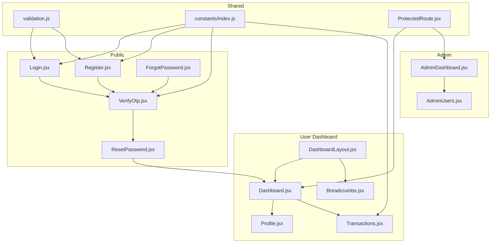
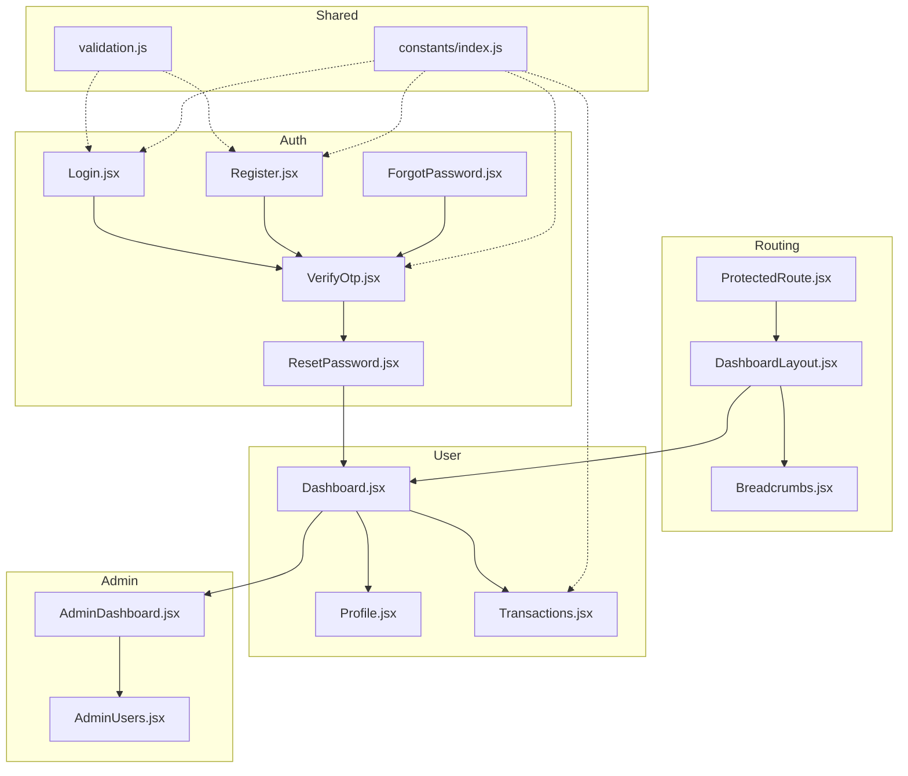
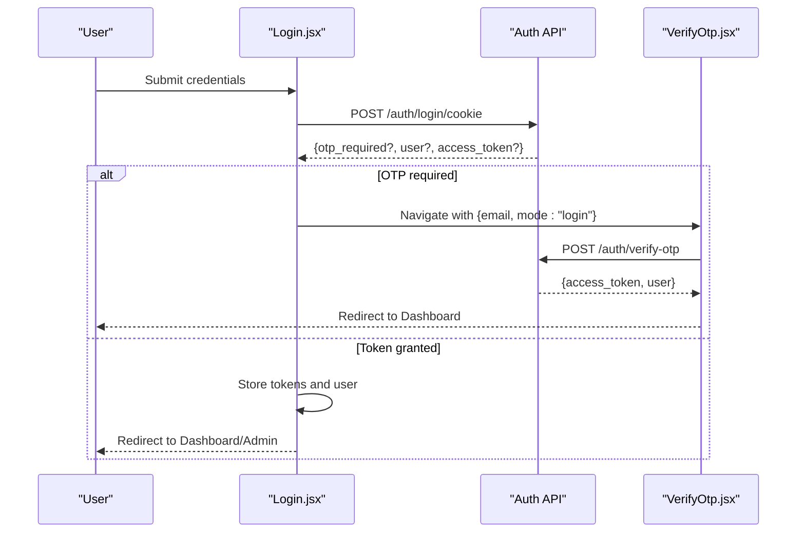
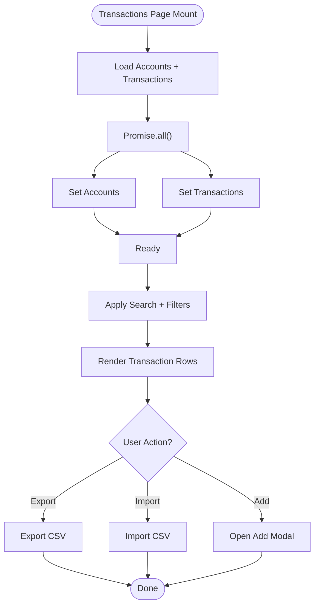
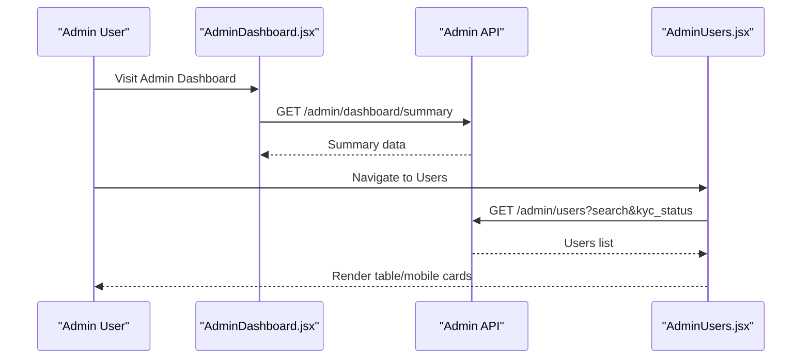
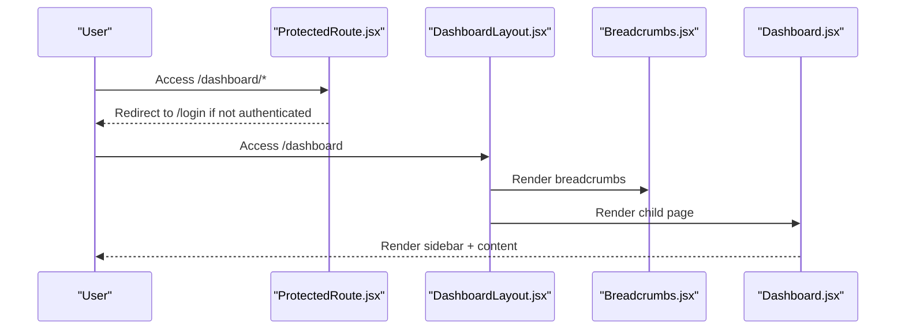
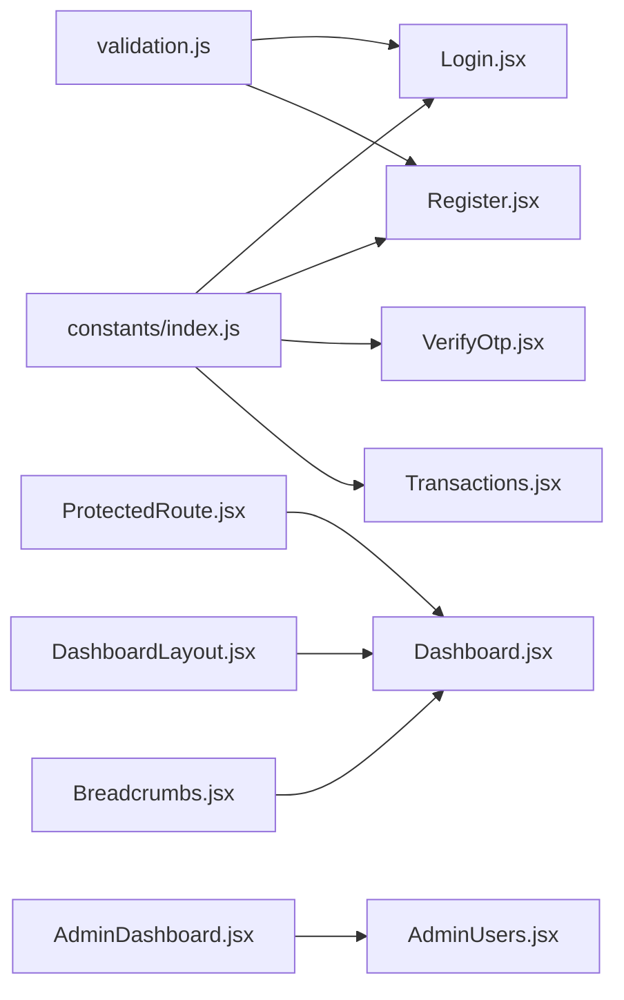

# Page Components

<cite>
**Referenced Files in This Document**
- [Dashboard.jsx](file://frontend/src/pages/user/Dashboard.jsx)
- [AdminDashboard.jsx](file://frontend/src/pages/admin/AdminDashboard.jsx)
- [Login.jsx](file://frontend/src/pages/user/Login.jsx)
- [Register.jsx](file://frontend/src/pages/user/Register.jsx)
- [VerifyOtp.jsx](file://frontend/src/pages/user/VerifyOtp.jsx)
- [ForgotPassword.jsx](file://frontend/src/pages/user/ForgotPassword.jsx)
- [ResetPassword.jsx](file://frontend/src/pages/user/ResetPassword.jsx)
- [Profile.jsx](file://frontend/src/pages/user/Profile.jsx)
- [Transactions.jsx](file://frontend/src/pages/user/Transactions.jsx)
- [AdminUsers.jsx](file://frontend/src/pages/admin/AdminUsers.jsx)
- [validation.js](file://frontend/src/utils/validation.js)
- [index.js](file://frontend/src/constants/index.js)
- [Breadcrumbs.jsx](file://frontend/src/components/user/dashboard/Breadcrumbs.jsx)
- [DashboardLayout.jsx](file://frontend/src/layouts/DashboardLayout.jsx)
- [ProtectedRoute.jsx](file://frontend/src/components/auth/ProtectedRoute.jsx)
</cite>

## Table of Contents
1. [Introduction](#introduction)
2. [Project Structure](#project-structure)
3. [Core Components](#core-components)
4. [Architecture Overview](#architecture-overview)
5. [Detailed Component Analysis](#detailed-component-analysis)
6. [Dependency Analysis](#dependency-analysis)
7. [Performance Considerations](#performance-considerations)
8. [Troubleshooting Guide](#troubleshooting-guide)
9. [Conclusion](#conclusion)
10. [Appendices](#appendices)

## Introduction
This document describes the page-level components organized by user roles and functionality. It covers:
- User-facing pages: dashboard, account management, transaction history, profile settings, and authentication flows
- Admin pages: system monitoring, user management, and analytics reporting
- Form validation patterns, error handling strategies, and user feedback mechanisms
- Data loading, caching strategies, and performance optimization
- Navigation, breadcrumbs, and user journey flows

## Project Structure
The frontend is organized by feature and role:
- Pages are grouped under user and admin namespaces
- Shared UI utilities and layouts are reused across pages
- Constants and validation utilities centralize configuration and rules

**Diagram sources**
- [Login.jsx:1-369](file://frontend/src/pages/user/Login.jsx#L1-L369)
- [Register.jsx:1-485](file://frontend/src/pages/user/Register.jsx#L1-L485)
- [ForgotPassword.jsx:1-158](file://frontend/src/pages/user/ForgotPassword.jsx#L1-L158)
- [ResetPassword.jsx:1-180](file://frontend/src/pages/user/ResetPassword.jsx#L1-L180)
- [VerifyOtp.jsx:1-244](file://frontend/src/pages/user/VerifyOtp.jsx#L1-L244)
- [DashboardLayout.jsx:1-50](file://frontend/src/layouts/DashboardLayout.jsx#L1-L50)
- [Dashboard.jsx:1-538](file://frontend/src/pages/user/Dashboard.jsx#L1-L538)
- [Profile.jsx:1-357](file://frontend/src/pages/user/Profile.jsx#L1-L357)
- [Transactions.jsx:1-242](file://frontend/src/pages/user/Transactions.jsx#L1-L242)
- [Breadcrumbs.jsx:1-85](file://frontend/src/components/user/dashboard/Breadcrumbs.jsx#L1-L85)
- [AdminDashboard.jsx:1-259](file://frontend/src/pages/admin/AdminDashboard.jsx#L1-L259)
- [AdminUsers.jsx:1-256](file://frontend/src/pages/admin/AdminUsers.jsx#L1-L256)
- [validation.js:1-177](file://frontend/src/utils/validation.js#L1-L177)
- [index.js:1-229](file://frontend/src/constants/index.js#L1-L229)
- [ProtectedRoute.jsx:1-40](file://frontend/src/components/auth/ProtectedRoute.jsx#L1-L40)

**Section sources**
- [Dashboard.jsx:1-538](file://frontend/src/pages/user/Dashboard.jsx#L1-L538)
- [AdminDashboard.jsx:1-259](file://frontend/src/pages/admin/AdminDashboard.jsx#L1-L259)
- [Login.jsx:1-369](file://frontend/src/pages/user/Login.jsx#L1-L369)
- [Register.jsx:1-485](file://frontend/src/pages/user/Register.jsx#L1-L485)
- [VerifyOtp.jsx:1-244](file://frontend/src/pages/user/VerifyOtp.jsx#L1-L244)
- [ForgotPassword.jsx:1-158](file://frontend/src/pages/user/ForgotPassword.jsx#L1-L158)
- [ResetPassword.jsx:1-180](file://frontend/src/pages/user/ResetPassword.jsx#L1-L180)
- [Profile.jsx:1-357](file://frontend/src/pages/user/Profile.jsx#L1-L357)
- [Transactions.jsx:1-242](file://frontend/src/pages/user/Transactions.jsx#L1-L242)
- [AdminUsers.jsx:1-256](file://frontend/src/pages/admin/AdminUsers.jsx#L1-L256)
- [validation.js:1-177](file://frontend/src/utils/validation.js#L1-L177)
- [index.js:1-229](file://frontend/src/constants/index.js#L1-L229)
- [Breadcrumbs.jsx:1-85](file://frontend/src/components/user/dashboard/Breadcrumbs.jsx#L1-L85)
- [DashboardLayout.jsx:1-50](file://frontend/src/layouts/DashboardLayout.jsx#L1-L50)
- [ProtectedRoute.jsx:1-40](file://frontend/src/components/auth/ProtectedRoute.jsx#L1-L40)

## Core Components
- Authentication pages: Login, Registration, Forgot Password, Reset Password, OTP Verification
- User dashboard pages: Dashboard, Profile, Transactions
- Admin pages: Admin Dashboard, Admin Users
- Shared utilities: Validation helpers, constants, breadcrumbs, protected routing

Key responsibilities:
- Authentication pages coordinate with backend endpoints and manage OTP lifecycle
- Dashboard pages orchestrate data fetching, filtering, and user actions
- Admin pages provide monitoring and user administration capabilities
- Shared utilities enforce consistent validation and navigation behavior

**Section sources**
- [Login.jsx:29-130](file://frontend/src/pages/user/Login.jsx#L29-L130)
- [Register.jsx:28-120](file://frontend/src/pages/user/Register.jsx#L28-L120)
- [VerifyOtp.jsx:11-147](file://frontend/src/pages/user/VerifyOtp.jsx#L11-L147)
- [ForgotPassword.jsx:17-44](file://frontend/src/pages/user/ForgotPassword.jsx#L17-L44)
- [ResetPassword.jsx:28-79](file://frontend/src/pages/user/ResetPassword.jsx#L28-L79)
- [Dashboard.jsx:58-131](file://frontend/src/pages/user/Dashboard.jsx#L58-L131)
- [Profile.jsx:16-49](file://frontend/src/pages/user/Profile.jsx#L16-L49)
- [Transactions.jsx:72-141](file://frontend/src/pages/user/Transactions.jsx#L72-L141)
- [AdminDashboard.jsx:19-34](file://frontend/src/pages/admin/AdminDashboard.jsx#L19-L34)
- [AdminUsers.jsx:12-59](file://frontend/src/pages/admin/AdminUsers.jsx#L12-L59)
- [validation.js:11-75](file://frontend/src/utils/validation.js#L11-L75)
- [index.js:6-62](file://frontend/src/constants/index.js#L6-L62)
- [Breadcrumbs.jsx:28-82](file://frontend/src/components/user/dashboard/Breadcrumbs.jsx#L28-L82)
- [DashboardLayout.jsx:14-47](file://frontend/src/layouts/DashboardLayout.jsx#L14-L47)
- [ProtectedRoute.jsx:27-37](file://frontend/src/components/auth/ProtectedRoute.jsx#L27-L37)

## Architecture Overview
The application enforces role-based access and separates concerns across user/admin domains. Authentication flows integrate with OTP verification and password reset. Dashboard pages share a common layout and breadcrumbs. Admin pages present monitoring and administrative controls.

**Diagram sources**
- [ProtectedRoute.jsx:27-37](file://frontend/src/components/auth/ProtectedRoute.jsx#L27-L37)
- [DashboardLayout.jsx:14-47](file://frontend/src/layouts/DashboardLayout.jsx#L14-L47)
- [Breadcrumbs.jsx:28-82](file://frontend/src/components/user/dashboard/Breadcrumbs.jsx#L28-L82)
- [Login.jsx:29-130](file://frontend/src/pages/user/Login.jsx#L29-L130)
- [Register.jsx:28-120](file://frontend/src/pages/user/Register.jsx#L28-L120)
- [ForgotPassword.jsx:17-44](file://frontend/src/pages/user/ForgotPassword.jsx#L17-L44)
- [VerifyOtp.jsx:11-147](file://frontend/src/pages/user/VerifyOtp.jsx#L11-L147)
- [ResetPassword.jsx:28-79](file://frontend/src/pages/user/ResetPassword.jsx#L28-L79)
- [Dashboard.jsx:58-131](file://frontend/src/pages/user/Dashboard.jsx#L58-L131)
- [Profile.jsx:16-49](file://frontend/src/pages/user/Profile.jsx#L16-L49)
- [Transactions.jsx:72-141](file://frontend/src/pages/user/Transactions.jsx#L72-L141)
- [AdminDashboard.jsx:19-34](file://frontend/src/pages/admin/AdminDashboard.jsx#L19-L34)
- [AdminUsers.jsx:12-59](file://frontend/src/pages/admin/AdminUsers.jsx#L12-L59)
- [validation.js:11-75](file://frontend/src/utils/validation.js#L11-L75)
- [index.js:6-62](file://frontend/src/constants/index.js#L6-L62)

## Detailed Component Analysis

### Authentication Pages
- Login: Validates identifier, handles OTP-required responses, sets tokens and user state, navigates by role
- Registration: Comprehensive client-side validation, controlled input sanitization, submission handling
- OTP Verification: Six-digit input with paste/backspace handling, resend timer, mode-aware navigation
- Forgot Password: Requests OTP via email, forwards to OTP verification
- Reset Password: Enforces strong password rules, updates password, clears reset state

**Diagram sources**
- [Login.jsx:67-129](file://frontend/src/pages/user/Login.jsx#L67-L129)
- [VerifyOtp.jsx:78-124](file://frontend/src/pages/user/VerifyOtp.jsx#L78-L124)
- [index.js:65-77](file://frontend/src/constants/index.js#L65-L77)

**Section sources**
- [Login.jsx:29-130](file://frontend/src/pages/user/Login.jsx#L29-L130)
- [Register.jsx:28-120](file://frontend/src/pages/user/Register.jsx#L28-L120)
- [VerifyOtp.jsx:11-147](file://frontend/src/pages/user/VerifyOtp.jsx#L11-L147)
- [ForgotPassword.jsx:17-44](file://frontend/src/pages/user/ForgotPassword.jsx#L17-L44)
- [ResetPassword.jsx:28-79](file://frontend/src/pages/user/ResetPassword.jsx#L28-L79)
- [index.js:65-77](file://frontend/src/constants/index.js#L65-L77)

### User Dashboard Pages
- Dashboard Layout: Shared container with sidebar, notifications, profile menu, and outlet rendering
- Profile: Displays user overview, security status, preferences; supports edit/save
- Transactions: Loads accounts and transactions, search/filter, export/import, modal interactions

**Diagram sources**
- [Transactions.jsx:124-141](file://frontend/src/pages/user/Transactions.jsx#L124-L141)
- [Transactions.jsx:52-60](file://frontend/src/pages/user/Transactions.jsx#L52-L60)

**Section sources**
- [Dashboard.jsx:58-131](file://frontend/src/pages/user/Dashboard.jsx#L58-L131)
- [Profile.jsx:16-49](file://frontend/src/pages/user/Profile.jsx#L16-L49)
- [Transactions.jsx:72-141](file://frontend/src/pages/user/Transactions.jsx#L72-L141)

### Admin Pages
- Admin Dashboard: Loads summary metrics, quick actions, system health cards
- Admin Users: Lists users with search and KYC filter, displays badges per status

**Diagram sources**
- [AdminDashboard.jsx:27-34](file://frontend/src/pages/admin/AdminDashboard.jsx#L27-L34)
- [AdminUsers.jsx:29-55](file://frontend/src/pages/admin/AdminUsers.jsx#L29-L55)
- [index.js:119-132](file://frontend/src/constants/index.js#L119-L132)

**Section sources**
- [AdminDashboard.jsx:19-34](file://frontend/src/pages/admin/AdminDashboard.jsx#L19-L34)
- [AdminUsers.jsx:12-59](file://frontend/src/pages/admin/AdminUsers.jsx#L12-L59)
- [index.js:119-132](file://frontend/src/constants/index.js#L119-L132)

### Navigation, Breadcrumbs, and User Journeys
- Breadcrumbs: Automatic generation from current route path
- ProtectedRoute: Guards dashboard routes and redirects unauthenticated users
- DashboardLayout: Consistent layout for dashboard pages

**Diagram sources**
- [ProtectedRoute.jsx:27-37](file://frontend/src/components/auth/ProtectedRoute.jsx#L27-L37)
- [DashboardLayout.jsx:14-47](file://frontend/src/layouts/DashboardLayout.jsx#L14-L47)
- [Breadcrumbs.jsx:28-82](file://frontend/src/components/user/dashboard/Breadcrumbs.jsx#L28-L82)
- [Dashboard.jsx:58-131](file://frontend/src/pages/user/Dashboard.jsx#L58-L131)

**Section sources**
- [Breadcrumbs.jsx:28-82](file://frontend/src/components/user/dashboard/Breadcrumbs.jsx#L28-L82)
- [ProtectedRoute.jsx:27-37](file://frontend/src/components/auth/ProtectedRoute.jsx#L27-L37)
- [DashboardLayout.jsx:14-47](file://frontend/src/layouts/DashboardLayout.jsx#L14-L47)
- [Dashboard.jsx:58-131](file://frontend/src/pages/user/Dashboard.jsx#L58-L131)

## Dependency Analysis
- Routes and API endpoints are centralized in constants
- Validation utilities are shared across forms
- ProtectedRoute ensures only authenticated users reach dashboard pages
- Dashboard pages depend on shared layout and breadcrumbs

**Diagram sources**
- [index.js:6-62](file://frontend/src/constants/index.js#L6-L62)
- [validation.js:11-75](file://frontend/src/utils/validation.js#L11-L75)
- [ProtectedRoute.jsx:27-37](file://frontend/src/components/auth/ProtectedRoute.jsx#L27-L37)
- [DashboardLayout.jsx:14-47](file://frontend/src/layouts/DashboardLayout.jsx#L14-L47)
- [Breadcrumbs.jsx:28-82](file://frontend/src/components/user/dashboard/Breadcrumbs.jsx#L28-L82)
- [Dashboard.jsx:58-131](file://frontend/src/pages/user/Dashboard.jsx#L58-L131)
- [AdminDashboard.jsx:19-34](file://frontend/src/pages/admin/AdminDashboard.jsx#L19-L34)
- [AdminUsers.jsx:12-59](file://frontend/src/pages/admin/AdminUsers.jsx#L12-L59)

**Section sources**
- [index.js:6-62](file://frontend/src/constants/index.js#L6-L62)
- [validation.js:11-75](file://frontend/src/utils/validation.js#L11-L75)
- [ProtectedRoute.jsx:27-37](file://frontend/src/components/auth/ProtectedRoute.jsx#L27-L37)
- [DashboardLayout.jsx:14-47](file://frontend/src/layouts/DashboardLayout.jsx#L14-L47)
- [Breadcrumbs.jsx:28-82](file://frontend/src/components/user/dashboard/Breadcrumbs.jsx#L28-L82)
- [Dashboard.jsx:58-131](file://frontend/src/pages/user/Dashboard.jsx#L58-L131)
- [AdminDashboard.jsx:19-34](file://frontend/src/pages/admin/AdminDashboard.jsx#L19-L34)
- [AdminUsers.jsx:12-59](file://frontend/src/pages/admin/AdminUsers.jsx#L12-L59)

## Performance Considerations
- Parallel data loading: Use Promise.all to fetch accounts and transactions concurrently
- Minimal re-renders: Keep state scoped to page components; avoid global state for transient UI state
- Debounced filters: For large datasets, consider debouncing search/filter updates
- Lazy modals: Portal-based modals reduce DOM tree depth and improve rendering locality
- Responsive thresholds: Use breakpoints to optimize layout and component rendering on smaller screens

[No sources needed since this section provides general guidance]

## Troubleshooting Guide
Common issues and strategies:
- Session expiration during transactions: Catch 401 responses and prompt re-authentication
- OTP verification failures: Clear input and focus first digit; surface precise error messages
- Validation feedback: Prefer inline validation messages and disabled submit states
- Network errors: Centralize error handling and show user-friendly messages

**Section sources**
- [Transactions.jsx:124-141](file://frontend/src/pages/user/Transactions.jsx#L124-L141)
- [VerifyOtp.jsx:117-124](file://frontend/src/pages/user/VerifyOtp.jsx#L117-L124)
- [validation.js:11-75](file://frontend/src/utils/validation.js#L11-L75)

## Conclusion
The page components are structured around role-based access, shared utilities, and consistent navigation. Authentication flows integrate tightly with OTP verification and password reset. Dashboard and admin pages leverage reusable layouts and breadcrumbs for coherent user experiences. Validation and error handling are centralized to ensure consistency and reliability.

[No sources needed since this section summarizes without analyzing specific files]

## Appendices

### Form Validation Patterns
- Identifier validation accepts email or 10-digit phone
- Password validation enforces length and character variety
- Phone and PIN validations constrain input formats
- Required field validation reports missing values

**Section sources**
- [validation.js:11-75](file://frontend/src/utils/validation.js#L11-L75)
- [index.js:191-202](file://frontend/src/constants/index.js#L191-L202)

### Error Handling Strategies
- Centralized API error messages with user-friendly fallbacks
- Loading states to prevent duplicate submissions
- Immediate feedback for invalid inputs
- Graceful degradation when network requests fail

**Section sources**
- [Login.jsx:124-129](file://frontend/src/pages/user/Login.jsx#L124-L129)
- [Register.jsx:114-119](file://frontend/src/pages/user/Register.jsx#L114-L119)
- [VerifyOtp.jsx:117-124](file://frontend/src/pages/user/VerifyOtp.jsx#L117-L124)
- [ForgotPassword.jsx:39-44](file://frontend/src/pages/user/ForgotPassword.jsx#L39-L44)
- [ResetPassword.jsx:71-79](file://frontend/src/pages/user/ResetPassword.jsx#L71-L79)

### User Feedback Mechanisms
- Inline validation messages
- Disabled buttons during async operations
- Toast-like alerts for success/error states
- Visual indicators for unread notifications

**Section sources**
- [Login.jsx:38-64](file://frontend/src/pages/user/Login.jsx#L38-L64)
- [Register.jsx:169-196](file://frontend/src/pages/user/Register.jsx#L169-L196)
- [Transactions.jsx:198-204](file://frontend/src/pages/user/Transactions.jsx#L198-L204)
- [Dashboard.jsx:120-131](file://frontend/src/pages/user/Dashboard.jsx#L120-L131)

### Data Loading and Caching
- Concurrent loads for related resources
- Local user cache synchronization on profile page
- Export/import endpoints for CSV operations
- No explicit client-side caching observed; rely on server responses

**Section sources**
- [Transactions.jsx:124-141](file://frontend/src/pages/user/Transactions.jsx#L124-L141)
- [Profile.jsx:37-49](file://frontend/src/pages/user/Profile.jsx#L37-L49)
- [index.js:84-86](file://frontend/src/constants/index.js#L84-L86)