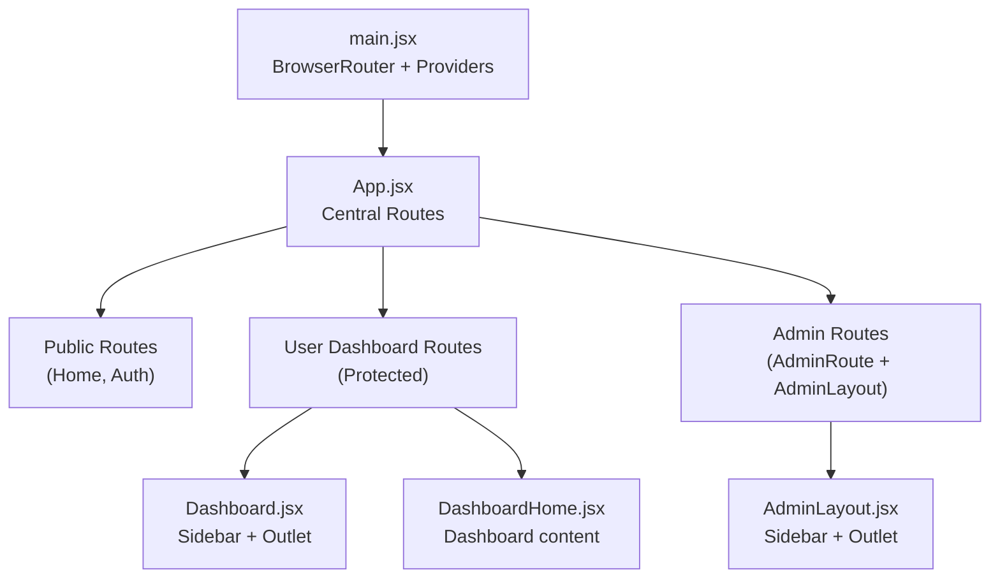
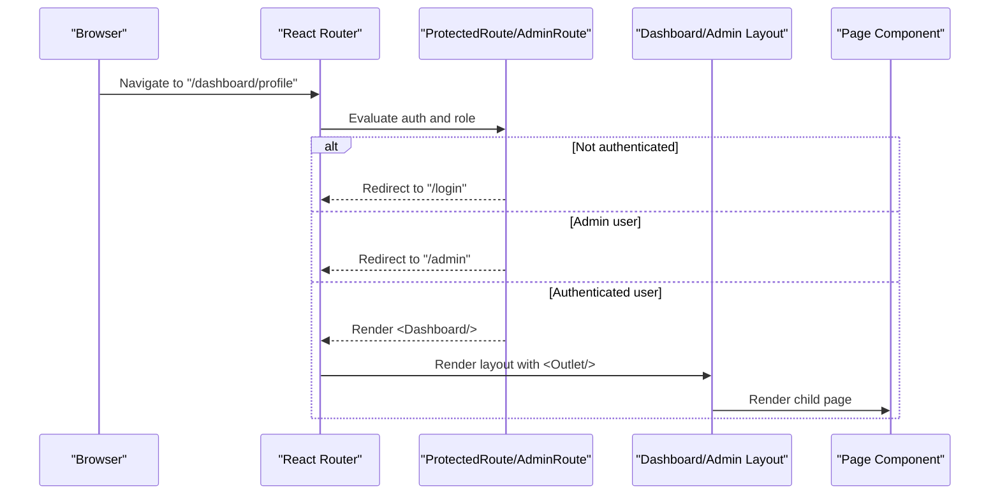
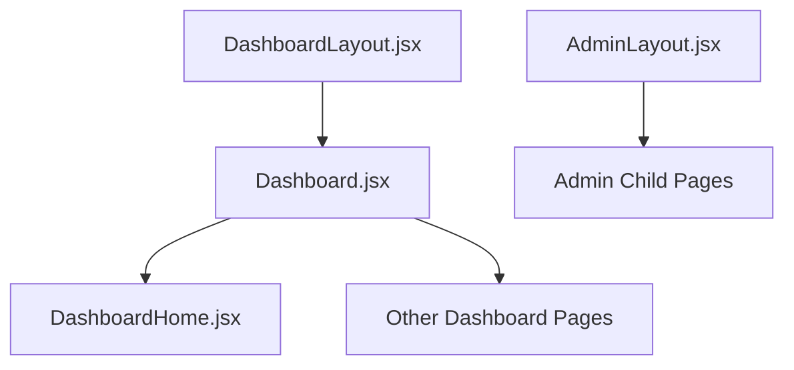
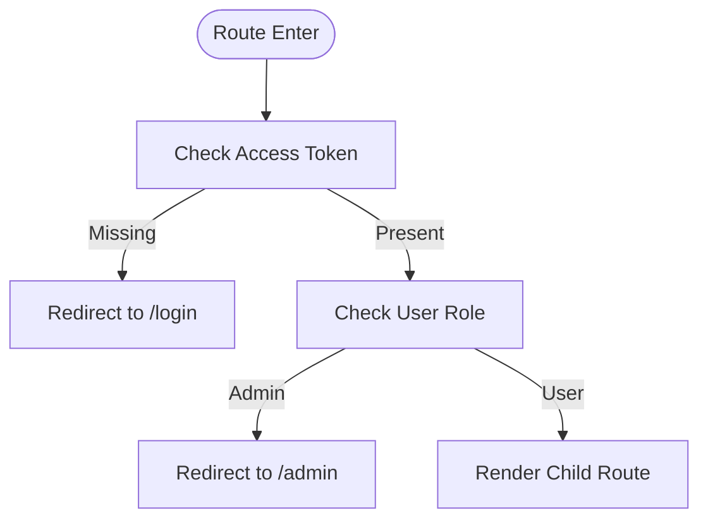
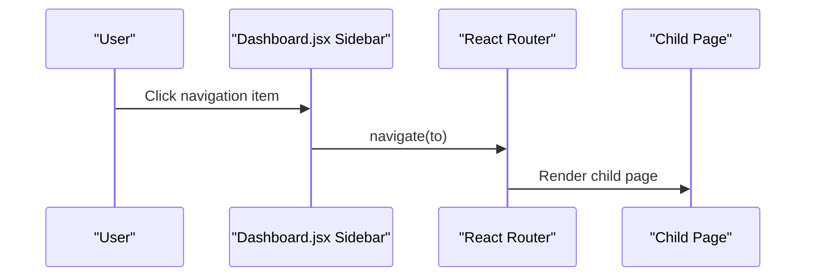
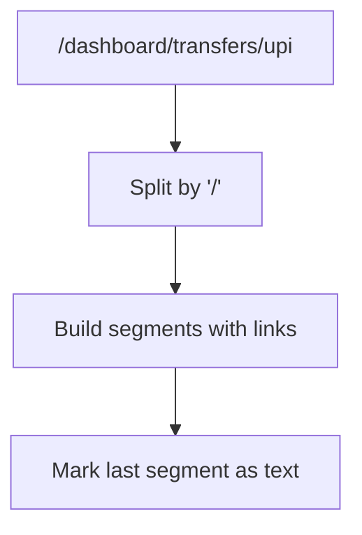
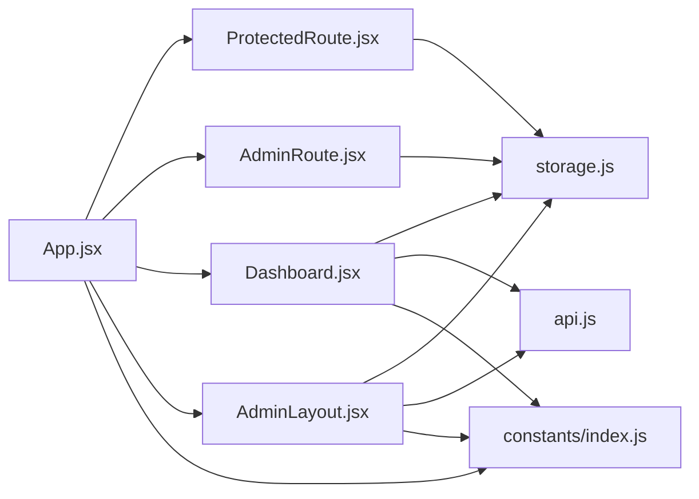

# Routing System

<cite>
**Referenced Files in This Document**
- [main.jsx](file://frontend/src/main.jsx)
- [App.jsx](file://frontend/src/App.jsx)
- [ProtectedRoute.jsx](file://frontend/src/components/auth/ProtectedRoute.jsx)
- [AdminRoute.jsx](file://frontend/src/components/auth/AdminRoute.jsx)
- [DashboardLayout.jsx](file://frontend/src/layouts/DashboardLayout.jsx)
- [Dashboard.jsx](file://frontend/src/pages/user/Dashboard.jsx)
- [AdminLayout.jsx](file://frontend/src/pages/admin/AdminLayout.jsx)
- [DashboardHome.jsx](file://frontend/src/pages/user/DashboardHome.jsx)
- [Breadcrumbs.jsx](file://frontend/src/components/user/dashboard/Breadcrumbs.jsx)
- [Accounts.jsx](file://frontend/src/pages/user/Accounts.jsx)
- [Transactions.jsx](file://frontend/src/pages/user/Transactions.jsx)
- [index.js](file://frontend/src/constants/index.js)
- [storage.js](file://frontend/src/utils/storage.js)
- [AuthContext.jsx](file://frontend/src/context/AuthContext.jsx)
- [useAuth.js](file://frontend/src/hooks/useAuth.js)
- [api.js](file://frontend/src/services/api.js)
- [vite.config.js](file://frontend/vite.config.js)
</cite>

## Table of Contents
1. [Introduction](#introduction)
2. [Project Structure](#project-structure)
3. [Core Components](#core-components)
4. [Architecture Overview](#architecture-overview)
5. [Detailed Component Analysis](#detailed-component-analysis)
6. [Dependency Analysis](#dependency-analysis)
7. [Performance Considerations](#performance-considerations)
8. [Troubleshooting Guide](#troubleshooting-guide)
9. [Conclusion](#conclusion)

## Introduction
This document explains the React Router-based navigation system used in the Modern Digital Banking Dashboard. It covers route configuration, nested routing patterns, layout composition, authentication and admin guards, redirects, navigation patterns for user and admin interfaces, breadcrumb generation, route-based component loading, parameter and query handling, programmatic navigation, and performance strategies such as code splitting and lazy loading.

## Project Structure
The routing system is defined centrally in the application shell and composed through layout-wrapped routes. The entry point initializes the routing provider and wraps the app with providers for context and budget data. Routes are grouped by public, user dashboard, and admin areas, with dedicated layout components for each.

**Diagram sources**
- [main.jsx:37-45](file://frontend/src/main.jsx#L37-L45)
- [App.jsx:83-167](file://frontend/src/App.jsx#L83-L167)
- [Dashboard.jsx:58-311](file://frontend/src/pages/user/Dashboard.jsx#L58-L311)
- [AdminLayout.jsx:20-142](file://frontend/src/pages/admin/AdminLayout.jsx#L20-L142)

**Section sources**
- [main.jsx:37-45](file://frontend/src/main.jsx#L37-L45)
- [App.jsx:83-167](file://frontend/src/App.jsx#L83-L167)

## Core Components
- Route definitions and nesting are declared in the central routing file.
- ProtectedRoute enforces authentication and role checks for user routes.
- AdminRoute enforces admin-only access for admin routes.
- DashboardLayout and AdminLayout provide shared UI scaffolding with outlets for child pages.
- Breadcrumb component generates navigable paths based on the current URL.
- Programmatic navigation is performed via React Router APIs and constants.

Key responsibilities:
- Centralized route configuration and guards
- Layout-based composition with nested routes
- Authentication and admin role enforcement
- Navigation UX via sidebars and breadcrumbs
- Programmatic navigation and redirects

**Section sources**
- [App.jsx:83-167](file://frontend/src/App.jsx#L83-L167)
- [ProtectedRoute.jsx:27-37](file://frontend/src/components/auth/ProtectedRoute.jsx#L27-L37)
- [AdminRoute.jsx:12-22](file://frontend/src/components/auth/AdminRoute.jsx#L12-L22)
- [Dashboard.jsx:58-311](file://frontend/src/pages/user/Dashboard.jsx#L58-L311)
- [AdminLayout.jsx:20-142](file://frontend/src/pages/admin/AdminLayout.jsx#L20-L142)
- [Breadcrumbs.jsx:28-82](file://frontend/src/components/user/dashboard/Breadcrumbs.jsx#L28-L82)

## Architecture Overview
The routing architecture separates concerns across three layers:
- Public routes: accessible without authentication
- User dashboard routes: protected and rendered within a shared dashboard layout
- Admin routes: admin-only, rendered within an admin layout

Guards enforce access control at two levels:
- ProtectedRoute for user dashboard routes
- AdminRoute for admin routes

**Diagram sources**
- [ProtectedRoute.jsx:27-37](file://frontend/src/components/auth/ProtectedRoute.jsx#L27-L37)
- [AdminRoute.jsx:12-22](file://frontend/src/components/auth/AdminRoute.jsx#L12-L22)
- [App.jsx:98-139](file://frontend/src/App.jsx#L98-L139)
- [Dashboard.jsx:58-311](file://frontend/src/pages/user/Dashboard.jsx#L58-L311)

## Detailed Component Analysis

### Route Configuration and Nested Routing
- Public routes include home, login, register, forgot password, reset password, and OTP verification.
- User dashboard routes are nested under a single parent route with an index route and multiple child routes for accounts, transfers, transactions, budgets, bills, rewards, insights, alerts, and settings.
- Admin routes are nested under a wildcard path with an index route and child routes for users, KYC, transactions, rewards, analytics, alerts, and settings.
- A fallback route redirects unmatched paths to the home page.

```mermaid
flowchart TD
Root["App.jsx Routes"] --> Public["Public Routes"]
Root --> UserDash["/dashboard/*"]
UserDash --> DashIndex["index -> DashboardHome"]
UserDash --> Profiles["/dashboard/profile"]
UserDash --> Accounts["/dashboard/accounts (+ nested)"]
UserDash --> Transfers["/dashboard/transfers (+ nested)"]
UserDash --> Payments["/dashboard/payment-success<br/>/dashboard/payment-failed"]
UserDash --> Budgets["/dashboard/budgets (+ summary)"]
UserDash --> Transactions["/dashboard/transactions"]
UserDash --> Bills["/dashboard/bills (+ processing)"]
UserDash --> Rewards["/dashboard/rewards (+ total-earned)"]
UserDash --> Insights["/dashboard/insights"]
UserDash --> Alerts["/dashboard/alerts"]
UserDash --> Settings["/dashboard/settings"]
Root --> Admin["/admin/*"]
Admin --> AdminIndex["index -> AdminDashboard"]
Admin --> AdminUsers["/admin/users"]
Admin --> AdminKYC["/admin/kyc"]
Admin --> AdminTxns["/admin/transactions"]
Admin --> AdminRewards["/admin/rewards"]
Admin --> AdminAnalytics["/admin/analytics"]
Admin --> AdminAlerts["/admin/alerts"]
Admin --> AdminSettings["/admin/settings"]
Root --> Fallback["* -> /"]
```

**Diagram sources**
- [App.jsx:88-165](file://frontend/src/App.jsx#L88-L165)

**Section sources**
- [App.jsx:88-165](file://frontend/src/App.jsx#L88-L165)

### Layout Composition
- DashboardLayout renders a responsive main content area with an outlet for nested routes.
- Dashboard.jsx composes a persistent sidebar, notifications badge, profile menu, and an outlet for child pages.
- AdminLayout.jsx composes a responsive sidebar with navigation items, active state highlighting, and an outlet for admin child pages.

**Diagram sources**
- [DashboardLayout.jsx:14-46](file://frontend/src/layouts/DashboardLayout.jsx#L14-L46)
- [Dashboard.jsx:58-311](file://frontend/src/pages/user/Dashboard.jsx#L58-L311)
- [AdminLayout.jsx:20-142](file://frontend/src/pages/admin/AdminLayout.jsx#L20-L142)

**Section sources**
- [DashboardLayout.jsx:14-46](file://frontend/src/layouts/DashboardLayout.jsx#L14-L46)
- [Dashboard.jsx:58-311](file://frontend/src/pages/user/Dashboard.jsx#L58-L311)
- [AdminLayout.jsx:20-142](file://frontend/src/pages/admin/AdminLayout.jsx#L20-L142)

### Authentication Guards and Redirects
- ProtectedRoute checks for a valid access token and user role. If missing or if the user is an admin, it redirects to appropriate destinations.
- AdminRoute checks for a valid session and ensures the user is an admin; otherwise, it redirects accordingly.

**Diagram sources**
- [ProtectedRoute.jsx:27-37](file://frontend/src/components/auth/ProtectedRoute.jsx#L27-L37)
- [AdminRoute.jsx:12-22](file://frontend/src/components/auth/AdminRoute.jsx#L12-L22)

**Section sources**
- [ProtectedRoute.jsx:27-37](file://frontend/src/components/auth/ProtectedRoute.jsx#L27-L37)
- [AdminRoute.jsx:12-22](file://frontend/src/components/auth/AdminRoute.jsx#L12-L22)
- [storage.js:81-92](file://frontend/src/utils/storage.js#L81-L92)
- [index.js:7-62](file://frontend/src/constants/index.js#L7-L62)

### Navigation Patterns: User and Admin Interfaces
- User interface navigation is driven by a persistent sidebar within the dashboard layout, with active state detection based on the current location.
- Admin interface navigation mirrors this pattern with its own sidebar and active highlighting.
- Both layouts support responsive behavior and mobile overlays.

**Diagram sources**
- [Dashboard.jsx:192-202](file://frontend/src/pages/user/Dashboard.jsx#L192-L202)
- [AdminLayout.jsx:110-120](file://frontend/src/pages/admin/AdminLayout.jsx#L110-L120)

**Section sources**
- [Dashboard.jsx:78-83](file://frontend/src/pages/user/Dashboard.jsx#L78-L83)
- [AdminLayout.jsx:47-50](file://frontend/src/pages/admin/AdminLayout.jsx#L47-L50)

### Breadcrumb Navigation
- Breadcrumbs.jsx builds a navigable trail from the root to the current page by splitting the pathname and rendering clickable segments except the last one.

**Diagram sources**
- [Breadcrumbs.jsx:32-79](file://frontend/src/components/user/dashboard/Breadcrumbs.jsx#L32-L79)

**Section sources**
- [Breadcrumbs.jsx:28-82](file://frontend/src/components/user/dashboard/Breadcrumbs.jsx#L28-L82)

### Route-Based Component Loading
- Components are imported at the top of the routing file and rendered as route elements.
- Some pages perform data fetching on mount to hydrate UIs with backend-provided data.

Examples:
- DashboardHome loads summaries, insights, and recent transactions concurrently.
- Transactions page fetches accounts and transactions, supports filtering and CSV export/import.

**Section sources**
- [DashboardHome.jsx:32-52](file://frontend/src/pages/user/DashboardHome.jsx#L32-L52)
- [Transactions.jsx:124-141](file://frontend/src/pages/user/Transactions.jsx#L124-L141)

### Route Parameters and Query Management
- The routing system does not define dynamic path parameters in the central route configuration.
- Query string management is handled via the centralized API service, which attaches Authorization headers and forwards GET parameters to endpoints.

Practical usage:
- Transactions page demonstrates query parameter passing for date ranges and limits.
- API service encapsulates request methods and parameter forwarding.

**Section sources**
- [api.js:33-47](file://frontend/src/services/api.js#L33-L47)
- [Transactions.jsx:97-104](file://frontend/src/pages/user/Transactions.jsx#L97-L104)

### Programmatic Navigation
- Programmatic navigation is used across pages for stateful navigation, redirects after actions, and navigation to related views.
- Examples include navigating to balance checks, identity verification, settings, and notifications.

**Section sources**
- [Accounts.jsx:67-71](file://frontend/src/pages/user/Accounts.jsx#L67-L71)
- [Accounts.jsx:258-262](file://frontend/src/pages/user/Accounts.jsx#L258-L262)
- [Dashboard.jsx:225-226](file://frontend/src/pages/user/Dashboard.jsx#L225-L226)
- [Dashboard.jsx:300-302](file://frontend/src/pages/user/Dashboard.jsx#L300-L302)

### Route-Level Code Splitting and Lazy Loading
- Current implementation imports all route components statically at the top of the routing file.
- Recommended strategy for production:
  - Replace static imports with React.lazy and Suspense around the routing configuration.
  - Group lazy-loaded routes by feature (e.g., user dashboard, admin) to optimize initial bundle size.
  - Ensure Suspense boundaries are configured to avoid layout shifts during hydration.

Note: The current Vite configuration enables React fast refresh and aliases but does not include dynamic import strategies for route-level code splitting.

**Section sources**
- [vite.config.js:15-31](file://frontend/vite.config.js#L15-L31)
- [App.jsx:16-56](file://frontend/src/App.jsx#L16-L56)

## Dependency Analysis
The routing system depends on:
- React Router for declarative routing and navigation
- Constants for route and API endpoint definitions
- Storage utilities for authentication state and user metadata
- AuthContext and useAuth hook for session management
- API service for backend integration

**Diagram sources**
- [App.jsx:75-76](file://frontend/src/App.jsx#L75-L76)
- [ProtectedRoute.jsx:21-22](file://frontend/src/components/auth/ProtectedRoute.jsx#L21-L22)
- [AdminRoute.jsx:3-4](file://frontend/src/components/auth/AdminRoute.jsx#L3-L4)
- [Dashboard.jsx:39-40](file://frontend/src/pages/user/Dashboard.jsx#L39-L40)
- [AdminLayout.jsx:17](file://frontend/src/pages/admin/AdminLayout.jsx#L17)
- [storage.js:81-89](file://frontend/src/utils/storage.js#L81-L89)
- [api.js:16-17](file://frontend/src/services/api.js#L16-L17)
- [index.js:7-62](file://frontend/src/constants/index.js#L7-L62)

**Section sources**
- [App.jsx:75-76](file://frontend/src/App.jsx#L75-L76)
- [ProtectedRoute.jsx:21-22](file://frontend/src/components/auth/ProtectedRoute.jsx#L21-L22)
- [AdminRoute.jsx:3-4](file://frontend/src/components/auth/AdminRoute.jsx#L3-L4)
- [Dashboard.jsx:39-40](file://frontend/src/pages/user/Dashboard.jsx#L39-L40)
- [AdminLayout.jsx:17](file://frontend/src/pages/admin/AdminLayout.jsx#L17)
- [storage.js:81-89](file://frontend/src/utils/storage.js#L81-L89)
- [api.js:16-17](file://frontend/src/services/api.js#L16-L17)
- [index.js:7-62](file://frontend/src/constants/index.js#L7-L62)

## Performance Considerations
- Static imports increase initial bundle size; adopt React.lazy with Suspense to defer loading of non-critical routes.
- Group lazy-loaded routes by feature to reduce initial payload and improve TTI.
- Keep guard components lightweight; cache token and user checks in memory to minimize repeated reads.
- Use efficient data fetching strategies (e.g., concurrent requests) as seen in dashboard home and transactions pages.
- Avoid unnecessary re-renders by memoizing derived values and using stable references for callbacks.

[No sources needed since this section provides general guidance]

## Troubleshooting Guide
Common issues and resolutions:
- Unauthorized access attempts: ProtectedRoute and AdminRoute redirect to login or admin dashboards; verify token presence and user role in storage.
- Incorrect redirects: Ensure constants for route paths are consistent across guards and navigation helpers.
- Session expiration: Use the centralized API service to attach Authorization headers; handle 401 responses gracefully and prompt re-authentication.
- Navigation not updating active state: Confirm active path detection logic matches route prefixes and index routes.

**Section sources**
- [ProtectedRoute.jsx:27-37](file://frontend/src/components/auth/ProtectedRoute.jsx#L27-L37)
- [AdminRoute.jsx:12-22](file://frontend/src/components/auth/AdminRoute.jsx#L12-L22)
- [storage.js:81-92](file://frontend/src/utils/storage.js#L81-L92)
- [api.js:23-29](file://frontend/src/services/api.js#L23-L29)
- [Dashboard.jsx:78-83](file://frontend/src/pages/user/Dashboard.jsx#L78-L83)
- [AdminLayout.jsx:47-50](file://frontend/src/pages/admin/AdminLayout.jsx#L47-L50)

## Conclusion
The routing system employs a clean separation of public, user, and admin routes with robust guards and shared layout components. It supports nested routing, programmatic navigation, and breadcrumb generation. For production readiness, introduce route-level code splitting and lazy loading to optimize performance while maintaining a consistent and secure navigation experience.