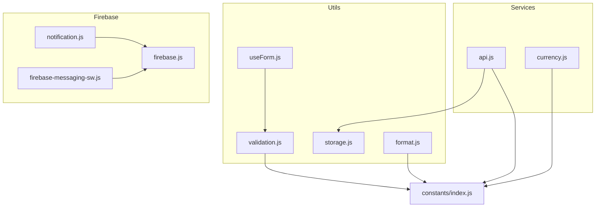
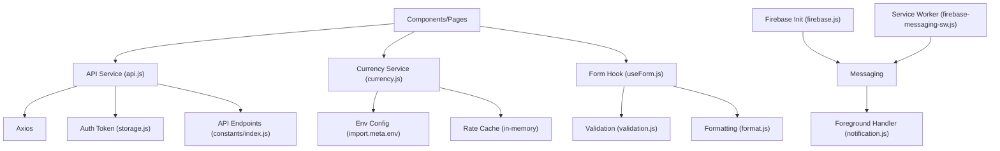
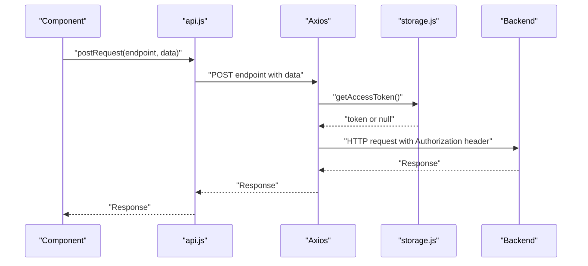
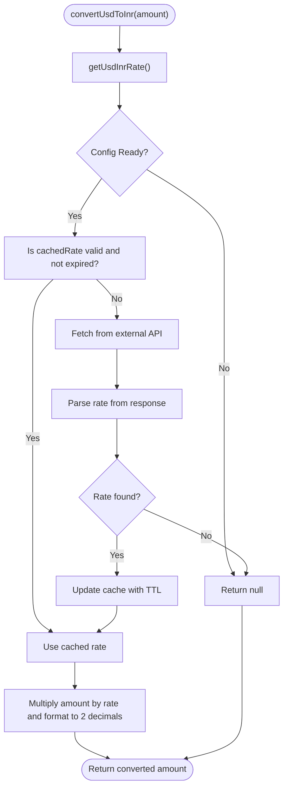
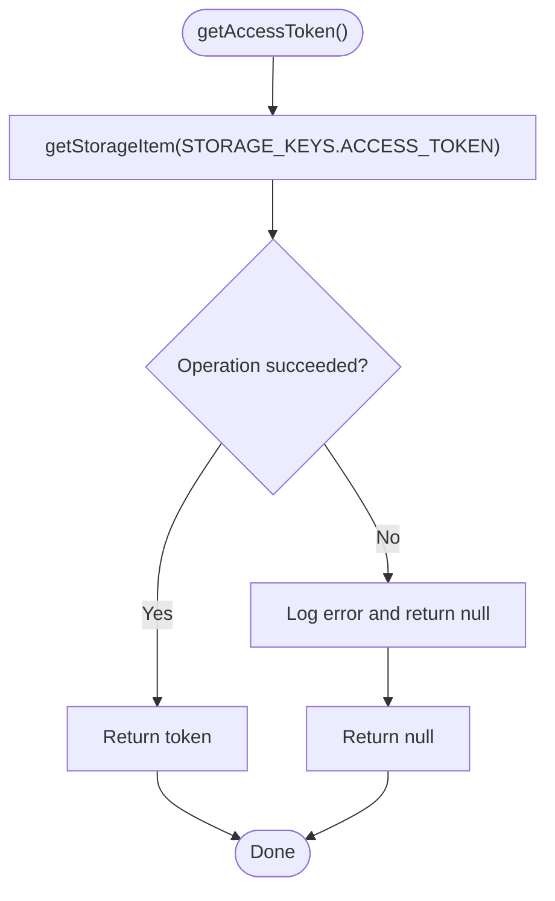
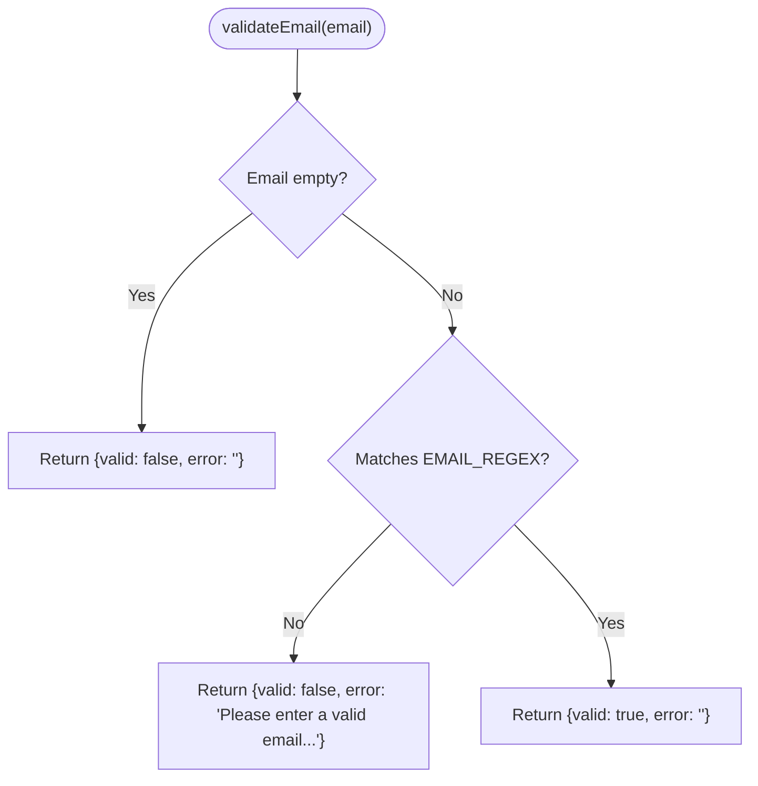
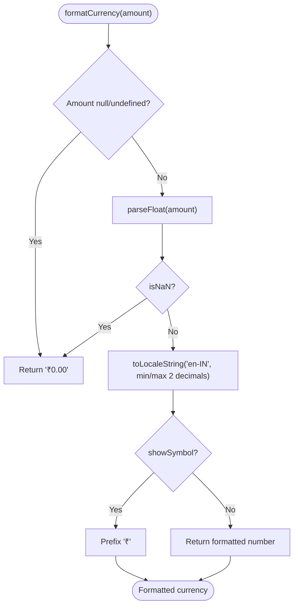
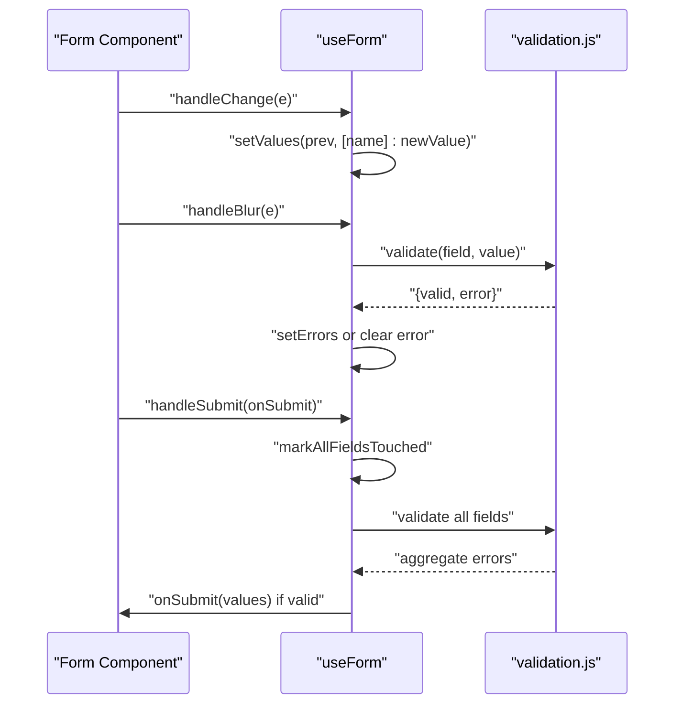
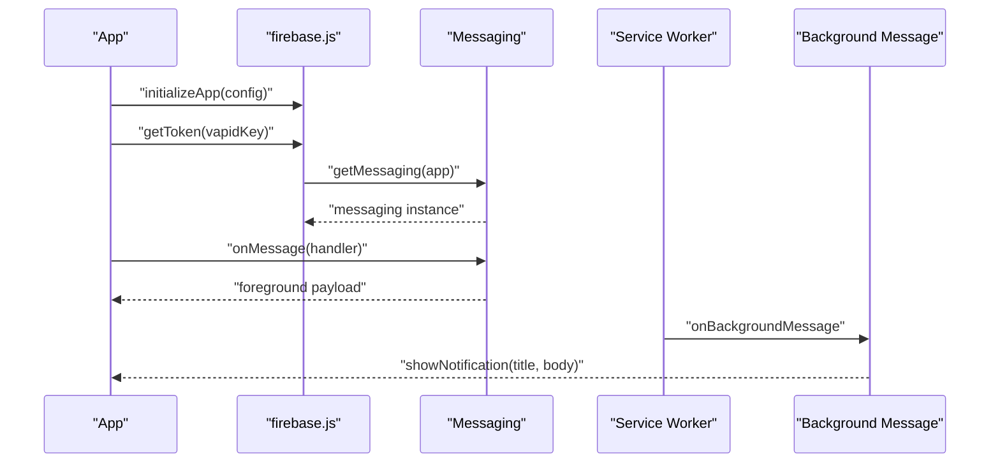
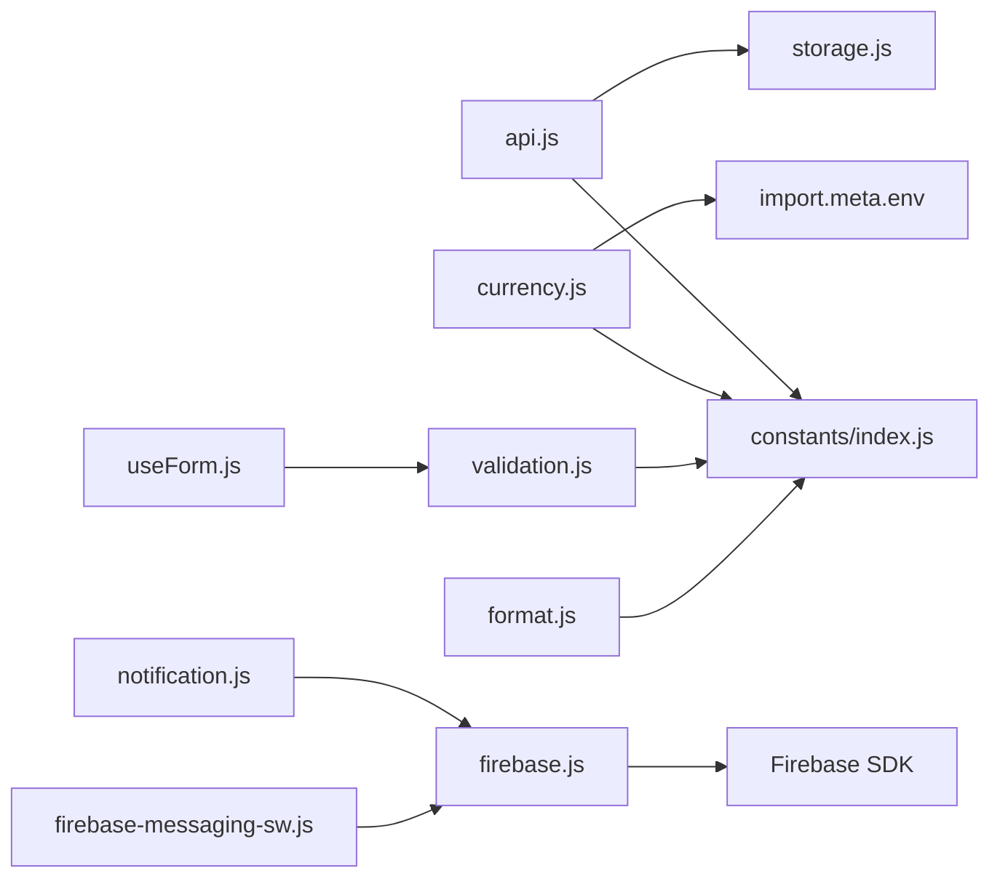

# Service Layer

<cite>
**Referenced Files in This Document**
- [api.js](file://frontend/src/services/api.js)
- [currency.js](file://frontend/src/services/currency.js)
- [storage.js](file://frontend/src/utils/storage.js)
- [validation.js](file://frontend/src/utils/validation.js)
- [format.js](file://frontend/src/utils/format.js)
- [index.js](file://frontend/src/constants/index.js)
- [useForm.js](file://frontend/src/hooks/useForm.js)
- [firebase.js](file://frontend/src/firebase.js)
- [notification.js](file://frontend/src/notification.js)
- [firebase-messaging-sw.js](file://frontend/public/firebase-messaging-sw.js)
- [DashboardHome.jsx](file://frontend/src/pages/user/DashboardHome.jsx)
</cite>

## Table of Contents
1. [Introduction](#introduction)
2. [Project Structure](#project-structure)
3. [Core Components](#core-components)
4. [Architecture Overview](#architecture-overview)
5. [Detailed Component Analysis](#detailed-component-analysis)
6. [Dependency Analysis](#dependency-analysis)
7. [Performance Considerations](#performance-considerations)
8. [Troubleshooting Guide](#troubleshooting-guide)
9. [Conclusion](#conclusion)

## Introduction
This document provides comprehensive documentation for the frontend service layer and utility functions. It covers:
- Centralized API service with request/response handling, authentication token integration, and convenience wrappers
- Currency conversion service with exchange rate caching and formatting utilities
- Local storage utilities for session management, data persistence, and offline capabilities
- Validation utilities for form inputs, data sanitization, and user input validation
- Service worker integration for push notifications and background message handling
- Error handling patterns, loading states, and retry strategies observed in the codebase

## Project Structure
The service layer and utilities are organized under the frontend/src directory:
- Services: centralized API client and currency conversion
- Utils: storage, validation, and formatting utilities
- Hooks: reusable form state and validation management
- Firebase integration: initialization and foreground/background notification handling
- Constants: API endpoints, storage keys, validation rules, and UI constants

**Diagram sources**
- [api.js:1-73](file://frontend/src/services/api.js#L1-L73)
- [currency.js:1-77](file://frontend/src/services/currency.js#L1-L77)
- [storage.js:1-100](file://frontend/src/utils/storage.js#L1-L100)
- [validation.js:1-177](file://frontend/src/utils/validation.js#L1-L177)
- [format.js:1-171](file://frontend/src/utils/format.js#L1-L171)
- [useForm.js:1-107](file://frontend/src/hooks/useForm.js#L1-L107)
- [firebase.js:1-24](file://frontend/src/firebase.js#L1-L24)
- [notification.js:1-14](file://frontend/src/notification.js#L1-L14)
- [firebase-messaging-sw.js:1-26](file://frontend/public/firebase-messaging-sw.js#L1-L26)
- [index.js:1-229](file://frontend/src/constants/index.js#L1-L229)

**Section sources**
- [api.js:1-73](file://frontend/src/services/api.js#L1-L73)
- [currency.js:1-77](file://frontend/src/services/currency.js#L1-L77)
- [storage.js:1-100](file://frontend/src/utils/storage.js#L1-L100)
- [validation.js:1-177](file://frontend/src/utils/validation.js#L1-L177)
- [format.js:1-171](file://frontend/src/utils/format.js#L1-L171)
- [index.js:1-229](file://frontend/src/constants/index.js#L1-L229)
- [useForm.js:1-107](file://frontend/src/hooks/useForm.js#L1-L107)
- [firebase.js:1-24](file://frontend/src/firebase.js#L1-L24)
- [notification.js:1-14](file://frontend/src/notification.js#L1-L14)
- [firebase-messaging-sw.js:1-26](file://frontend/public/firebase-messaging-sw.js#L1-L26)

## Core Components
- Centralized API service: Axios-based client configured with base URL, automatic Authorization header injection via access token, and convenience methods for GET, POST, PATCH, and DELETE requests. Exposes named endpoints for authentication, accounts, transactions, budgets, bills, rewards, insights, and alerts.
- Currency conversion service: Fetches exchange rates from a configurable external API, caches the rate with TTL, and converts amounts with fixed formatting.
- Storage utilities: Safe localStorage wrappers with JSON helpers, plus authentication-specific helpers for tokens, user data, and login status.
- Validation utilities: Email, phone, identifier, password, PIN, amount, and required-field validators with consistent return shape.
- Formatting utilities: Currency, date/time, phone masking, email masking, account number formatting, capitalization, truncation, file size, and percentage formatting.
- Form hook: Reusable form state, field-level validation, touch tracking, submit orchestration, and reset functionality.
- Firebase integration: App initialization, foreground message handling, and background message handling via a service worker.

**Section sources**
- [api.js:19-72](file://frontend/src/services/api.js#L19-L72)
- [currency.js:12-76](file://frontend/src/services/currency.js#L12-L76)
- [storage.js:8-99](file://frontend/src/utils/storage.js#L8-L99)
- [validation.js:11-176](file://frontend/src/utils/validation.js#L11-L176)
- [format.js:9-170](file://frontend/src/utils/format.js#L9-L170)
- [useForm.js:19-106](file://frontend/src/hooks/useForm.js#L19-L106)
- [firebase.js:4-23](file://frontend/src/firebase.js#L4-L23)
- [notification.js:4-13](file://frontend/src/notification.js#L4-L13)
- [firebase-messaging-sw.js:15-25](file://frontend/public/firebase-messaging-sw.js#L15-L25)

## Architecture Overview
The frontend service layer follows a modular architecture:
- Services encapsulate network concerns and expose domain-specific methods
- Utilities provide cross-cutting concerns (persistence, validation, formatting)
- Hooks manage form state and validation lifecycle
- Firebase integrates push notifications with both foreground and background handlers
- Constants centralize endpoints, keys, and validation rules

**Diagram sources**
- [api.js:14-72](file://frontend/src/services/api.js#L14-L72)
- [currency.js:3-22](file://frontend/src/services/currency.js#L3-L22)
- [storage.js:81-99](file://frontend/src/utils/storage.js#L81-L99)
- [index.js:64-132](file://frontend/src/constants/index.js#L64-L132)
- [useForm.js:19-106](file://frontend/src/hooks/useForm.js#L19-L106)
- [validation.js:11-176](file://frontend/src/utils/validation.js#L11-L176)
- [format.js:9-170](file://frontend/src/utils/format.js#L9-L170)
- [firebase.js:1-23](file://frontend/src/firebase.js#L1-L23)
- [notification.js:4-13](file://frontend/src/notification.js#L4-L13)
- [firebase-messaging-sw.js:15-25](file://frontend/public/firebase-messaging-sw.js#L15-L25)

## Detailed Component Analysis

### Centralized API Service
Purpose:
- Centralize Axios configuration and request/response handling
- Automatically attach Authorization header using stored access token
- Provide convenience wrappers for common HTTP verbs and named endpoints

Key behaviors:
- Creates Axios instance with base URL from environment
- Interceptor attaches Authorization header when token exists
- Generic request dispatcher supports get, delete, and other methods
- Named endpoints for auth, accounts, transactions, budgets, bills, rewards, insights, and alerts

**Diagram sources**
- [api.js:33-46](file://frontend/src/services/api.js#L33-L46)
- [api.js:31](file://frontend/src/services/api.js#L31)
- [storage.js:81](file://frontend/src/utils/storage.js#L81)

**Section sources**
- [api.js:19-72](file://frontend/src/services/api.js#L19-L72)
- [index.js:64-132](file://frontend/src/constants/index.js#L64-L132)
- [storage.js:81-82](file://frontend/src/utils/storage.js#L81-L82)

### Currency Conversion Service
Purpose:
- Fetch exchange rates from an external API
- Cache rates with TTL to reduce network calls
- Convert amounts and format to two decimal places

Key behaviors:
- Validates environment configuration readiness
- Checks cache expiration before fetching
- Parses response rate and updates cache
- Converts amounts using cached rate with fixed formatting

**Diagram sources**
- [currency.js:42-76](file://frontend/src/services/currency.js#L42-L76)

**Section sources**
- [currency.js:12-76](file://frontend/src/services/currency.js#L12-L76)

### Local Storage Utilities
Purpose:
- Provide safe localStorage operations with JSON helpers
- Manage authentication state and tokens
- Offer clear and consistent storage APIs

Key behaviors:
- Wraps localStorage operations in try/catch with fallbacks and logging
- Provides JSON serialization/deserialization helpers
- Authentication helpers for access token, refresh token, user data, and login status
- Clear auth data helper removes all authentication-related items

**Diagram sources**
- [storage.js:81-99](file://frontend/src/utils/storage.js#L81-L99)

**Section sources**
- [storage.js:8-99](file://frontend/src/utils/storage.js#L8-L99)
- [index.js:134-144](file://frontend/src/constants/index.js#L134-L144)

### Validation Utilities
Purpose:
- Provide reusable, consistent validation functions for forms
- Enforce length, format, and numeric constraints
- Return structured validation results

Key behaviors:
- Email validation using regex
- Phone validation for digit-only and exact length
- Identifier validation supporting email or phone
- Password validation for min/max length
- PIN validation for digit-only and length bounds
- Amount validation for numeric range
- Required field validation with customizable field name

**Diagram sources**
- [validation.js:11-22](file://frontend/src/utils/validation.js#L11-L22)

**Section sources**
- [validation.js:11-176](file://frontend/src/utils/validation.js#L11-L176)
- [index.js:191-202](file://frontend/src/constants/index.js#L191-L202)

### Formatting Utilities
Purpose:
- Provide consistent formatting for currency, dates, times, and identifiers
- Support localization and masking for privacy

Key behaviors:
- Currency formatting with Indian Rupee symbol and two decimals
- Date/time formatting with multiple presets
- Phone masking and email masking for privacy
- Account number masking and formatting
- Text capitalization, truncation, file size, and percentage formatting

**Diagram sources**
- [format.js:9-21](file://frontend/src/utils/format.js#L9-L21)

**Section sources**
- [format.js:9-170](file://frontend/src/utils/format.js#L9-L170)

### Form Hook (useForm)
Purpose:
- Provide reusable form state and validation lifecycle
- Manage field values, errors, and touched state
- Coordinate submission and reset

Key behaviors:
- Field change handler updates values and clears errors
- Blur handler marks field as touched and validates
- Submit handler triggers validation, sets touched, and invokes onSubmit
- Reset clears values, errors, touched, and submission state
- Exposes setters for fine-grained control

**Diagram sources**
- [useForm.js:25-75](file://frontend/src/hooks/useForm.js#L25-L75)
- [validation.js:11-176](file://frontend/src/utils/validation.js#L11-L176)

**Section sources**
- [useForm.js:19-106](file://frontend/src/hooks/useForm.js#L19-L106)
- [validation.js:11-176](file://frontend/src/utils/validation.js#L11-L176)

### Firebase Integration and Service Worker
Purpose:
- Initialize Firebase app and messaging
- Request notification permissions and retrieve FCM token
- Handle foreground messages in the browser
- Handle background messages via service worker

Key behaviors:
- Firebase initialization with production config
- Foreground message handler logs and alerts notification content
- Background message handler shows system notifications
- Service worker registers and handles background messages

**Diagram sources**
- [firebase.js:4-23](file://frontend/src/firebase.js#L4-L23)
- [notification.js:4-13](file://frontend/src/notification.js#L4-L13)
- [firebase-messaging-sw.js:15-25](file://frontend/public/firebase-messaging-sw.js#L15-L25)

**Section sources**
- [firebase.js:4-23](file://frontend/src/firebase.js#L4-L23)
- [notification.js:4-13](file://frontend/src/notification.js#L4-L13)
- [firebase-messaging-sw.js:15-25](file://frontend/public/firebase-messaging-sw.js#L15-L25)

## Dependency Analysis
- API service depends on:
  - Environment base URL
  - Storage utilities for access token retrieval
  - Constants for endpoint definitions
- Currency service depends on:
  - Environment variables for API URL, from/to currencies, and TTL
  - Axios for HTTP requests
- Storage utilities depend on:
  - Constants for storage keys
- Validation and formatting utilities depend on:
  - Constants for validation rules and locale formatting
- Form hook depends on:
  - Validation utilities for field-level checks
- Firebase integration depends on:
  - Firebase SDK
  - Service worker for background messages

**Diagram sources**
- [api.js:16-17](file://frontend/src/services/api.js#L16-L17)
- [storage.js:6](file://frontend/src/utils/storage.js#L6)
- [index.js:64-132](file://frontend/src/constants/index.js#L64-L132)
- [currency.js:3-8](file://frontend/src/services/currency.js#L3-L8)
- [validation.js:6](file://frontend/src/utils/validation.js#L6)
- [format.js:5](file://frontend/src/utils/format.js#L5)
- [useForm.js:6](file://frontend/src/hooks/useForm.js#L6)
- [firebase.js:1-2](file://frontend/src/firebase.js#L1-L2)
- [notification.js:1](file://frontend/src/notification.js#L1)
- [firebase-messaging-sw.js:1](file://frontend/public/firebase-messaging-sw.js#L1)

**Section sources**
- [api.js:16-17](file://frontend/src/services/api.js#L16-L17)
- [storage.js:6](file://frontend/src/utils/storage.js#L6)
- [index.js:64-132](file://frontend/src/constants/index.js#L64-L132)
- [currency.js:3-8](file://frontend/src/services/currency.js#L3-L8)
- [validation.js:6](file://frontend/src/utils/validation.js#L6)
- [format.js:5](file://frontend/src/utils/format.js#L5)
- [useForm.js:6](file://frontend/src/hooks/useForm.js#L6)
- [firebase.js:1-2](file://frontend/src/firebase.js#L1-L2)
- [notification.js:1](file://frontend/src/notification.js#L1)
- [firebase-messaging-sw.js:1](file://frontend/public/firebase-messaging-sw.js#L1)

## Performance Considerations
- API service
  - Centralized interceptor avoids manual header management
  - Convenience methods reduce duplication and improve maintainability
- Currency service
  - Rate caching with TTL minimizes network requests
  - Early return when configuration is invalid prevents unnecessary fetches
- Storage utilities
  - Safe wrappers prevent unhandled exceptions and degrade gracefully
  - JSON helpers avoid repeated parse/stringify logic
- Validation and formatting
  - Consistent return shapes enable predictable UI updates
  - Locale-aware formatting ensures correctness across regions
- Form hook
  - Field-level validation reduces unnecessary re-renders
  - Touched state prevents premature error display

[No sources needed since this section provides general guidance]

## Troubleshooting Guide
Common issues and resolutions:
- API requests fail with 401 Unauthorized
  - Ensure access token is present and valid in storage
  - Verify interceptor attaches Authorization header automatically
  - Confirm base URL environment variable is set correctly
- Currency conversion returns null
  - Check environment configuration for API URL, from/to currencies, and TTL
  - Verify external API availability and response format
  - Inspect cache expiration logic
- Storage operations fail silently
  - Review safe wrapper behavior and console logs
  - Confirm localStorage availability and quota limits
- Form validation not triggering
  - Ensure validation rules are passed to the hook
  - Check field names match between rules and form values
- Push notifications not received
  - Verify Firebase initialization and VAPID key
  - Confirm notification permission granted
  - Check service worker registration and background message handler

**Section sources**
- [storage.js:8-15](file://frontend/src/utils/storage.js#L8-L15)
- [currency.js:28-40](file://frontend/src/services/currency.js#L28-L40)
- [firebase.js:16-23](file://frontend/src/firebase.js#L16-L23)
- [notification.js:4-13](file://frontend/src/notification.js#L4-L13)
- [firebase-messaging-sw.js:15-25](file://frontend/public/firebase-messaging-sw.js#L15-L25)

## Conclusion
The frontend service layer provides a robust foundation for network operations, data persistence, validation, formatting, and notifications. The centralized API service simplifies backend integration with automatic authentication, while the currency service optimizes performance through caching. Storage utilities ensure reliable persistence, and validation/formatting utilities deliver consistent UX. The form hook streamlines form management, and Firebase integration enables real-time engagement through push notifications. Together, these components support scalable development and maintainable code.