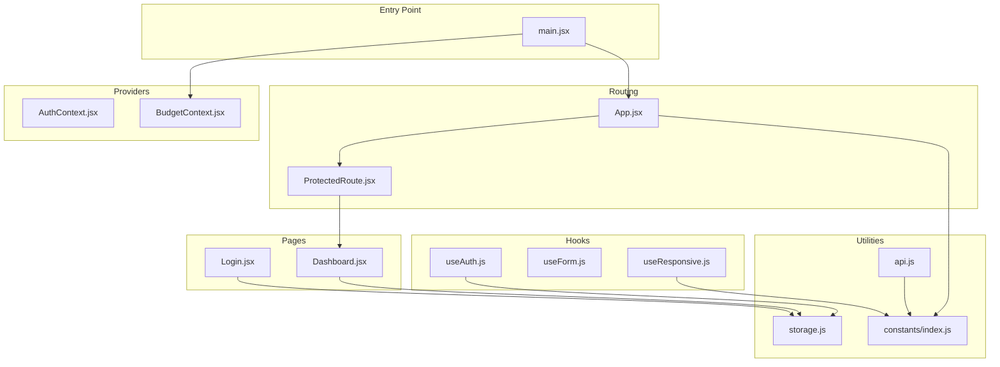
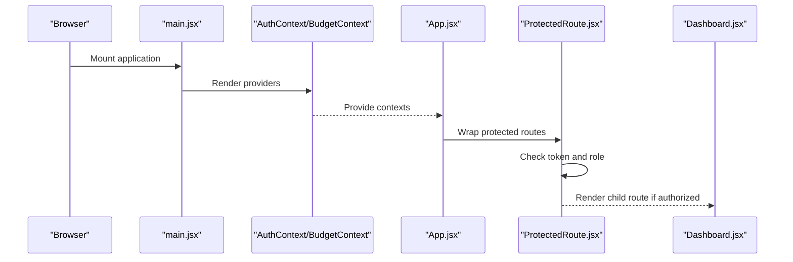
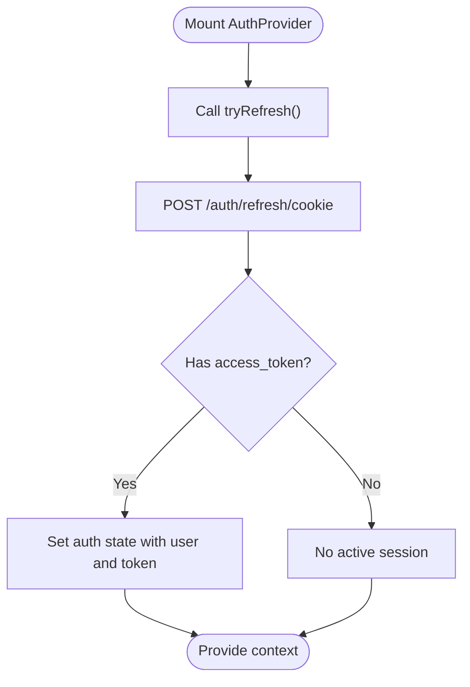
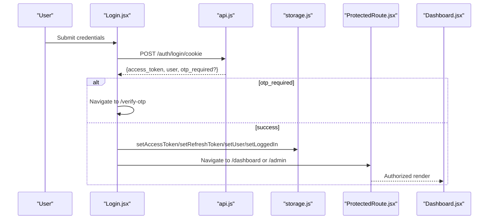
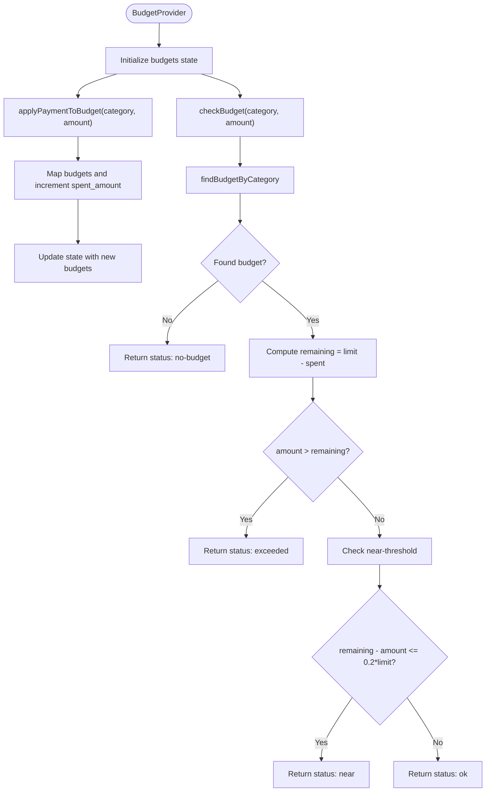
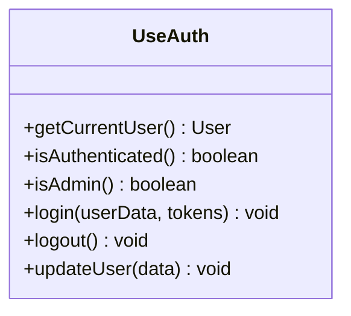
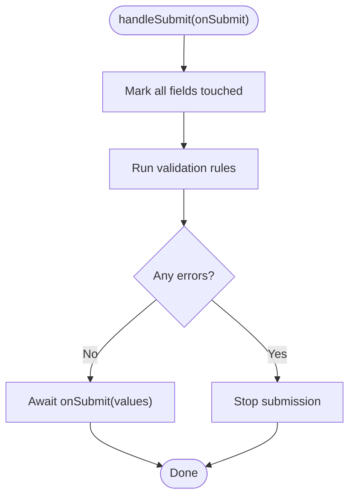
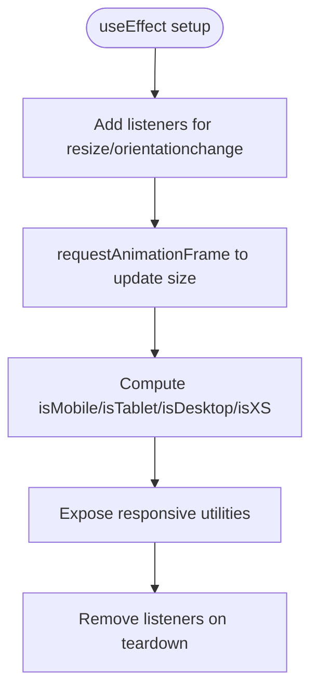
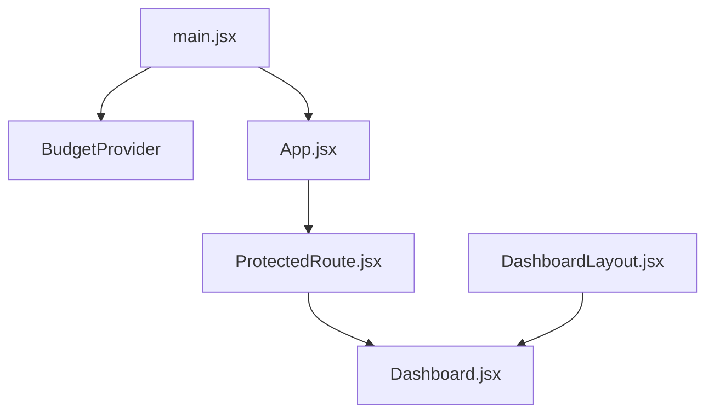
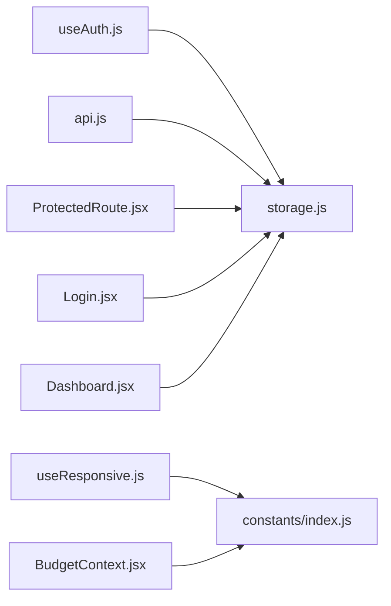

# State Management

<cite>
**Referenced Files in This Document**
- [AuthContext.jsx](file://frontend/src/context/AuthContext.jsx)
- [BudgetContext.jsx](file://frontend/src/context/BudgetContext.jsx)
- [useAuth.js](file://frontend/src/hooks/useAuth.js)
- [useForm.js](file://frontend/src/hooks/useForm.js)
- [useResponsive.js](file://frontend/src/hooks/useResponsive.js)
- [storage.js](file://frontend/src/utils/storage.js)
- [api.js](file://frontend/src/services/api.js)
- [main.jsx](file://frontend/src/main.jsx)
- [App.jsx](file://frontend/src/App.jsx)
- [ProtectedRoute.jsx](file://frontend/src/components/auth/ProtectedRoute.jsx)
- [Login.jsx](file://frontend/src/pages/user/Login.jsx)
- [Dashboard.jsx](file://frontend/src/pages/user/Dashboard.jsx)
- [ResponsiveContainer.jsx](file://frontend/src/components/common/ResponsiveContainer.jsx)
- [DashboardLayout.jsx](file://frontend/src/layouts/DashboardLayout.jsx)
- [index.js](file://frontend/src/constants/index.js)
</cite>

## Table of Contents
1. [Introduction](#introduction)
2. [Project Structure](#project-structure)
3. [Core Components](#core-components)
4. [Architecture Overview](#architecture-overview)
5. [Detailed Component Analysis](#detailed-component-analysis)
6. [Dependency Analysis](#dependency-analysis)
7. [Performance Considerations](#performance-considerations)
8. [Troubleshooting Guide](#troubleshooting-guide)
9. [Conclusion](#conclusion)
10. [Appendices](#appendices)

## Introduction
This document explains the React state management architecture using Context API and custom hooks in the Modern Digital Banking Dashboard. It covers:
- Authentication context and token lifecycle
- Budget context for financial data tracking
- Custom hooks for form handling, responsive design, and reusable state logic
- Provider composition, state synchronization, persistence, and performance strategies
- Integration patterns between contexts and state sharing across components

## Project Structure
The frontend composes providers at the root and exposes contexts and hooks consumed by pages and components:
- Root provider composition in the application entry
- Context providers for authentication and budgets
- Custom hooks encapsulating reusable logic
- Utility modules for storage and API integration

**Diagram sources**
- [main.jsx:37-45](file://frontend/src/main.jsx#L37-L45)
- [AuthContext.jsx:23-46](file://frontend/src/context/AuthContext.jsx#L23-L46)
- [BudgetContext.jsx:22-60](file://frontend/src/context/BudgetContext.jsx#L22-L60)
- [App.jsx:78-167](file://frontend/src/App.jsx#L78-L167)
- [ProtectedRoute.jsx:27-37](file://frontend/src/components/auth/ProtectedRoute.jsx#L27-L37)
- [Login.jsx:29-129](file://frontend/src/pages/user/Login.jsx#L29-L129)
- [Dashboard.jsx:58-89](file://frontend/src/pages/user/Dashboard.jsx#L58-L89)
- [useAuth.js:22-62](file://frontend/src/hooks/useAuth.js#L22-L62)
- [useForm.js:19-106](file://frontend/src/hooks/useForm.js#L19-L106)
- [useResponsive.js:25-113](file://frontend/src/hooks/useResponsive.js#L25-L113)
- [storage.js:81-99](file://frontend/src/utils/storage.js#L81-L99)
- [api.js:19-31](file://frontend/src/services/api.js#L19-L31)
- [index.js:64-132](file://frontend/src/constants/index.js#L64-L132)

**Section sources**
- [main.jsx:37-45](file://frontend/src/main.jsx#L37-L45)
- [App.jsx:78-167](file://frontend/src/App.jsx#L78-L167)

## Core Components
- Authentication Context: Manages user and access token state, refreshes tokens on mount, and exposes a memoized context value.
- Budget Context: Tracks budgets, computes remaining amounts, checks thresholds, and applies payment impacts.
- Custom Hooks:
  - useAuth: Encapsulates login, logout, user update, and derived flags (admin, authenticated).
  - useForm: Provides form state, validation, submission flow, and reset helpers.
  - useResponsive: Computes responsive booleans and responsive utilities for values, padding, and font size.
- Storage Utilities: Safe localStorage wrappers for tokens, user, and login status.
- API Service: Centralized Axios client with automatic Authorization header injection.

**Section sources**
- [AuthContext.jsx:23-46](file://frontend/src/context/AuthContext.jsx#L23-L46)
- [BudgetContext.jsx:22-60](file://frontend/src/context/BudgetContext.jsx#L22-L60)
- [useAuth.js:22-62](file://frontend/src/hooks/useAuth.js#L22-L62)
- [useForm.js:19-106](file://frontend/src/hooks/useForm.js#L19-L106)
- [useResponsive.js:25-113](file://frontend/src/hooks/useResponsive.js#L25-L113)
- [storage.js:81-99](file://frontend/src/utils/storage.js#L81-L99)
- [api.js:19-31](file://frontend/src/services/api.js#L19-L31)

## Architecture Overview
The application initializes providers at the root and uses route guards to protect authenticated areas. Authentication state is persisted in localStorage and synchronized via a refresh attempt on mount. Budget state is local to the BudgetProvider and can be extended to integrate with backend APIs.

**Diagram sources**
- [main.jsx:37-45](file://frontend/src/main.jsx#L37-L45)
- [App.jsx:98-139](file://frontend/src/App.jsx#L98-L139)
- [ProtectedRoute.jsx:27-37](file://frontend/src/components/auth/ProtectedRoute.jsx#L27-L37)
- [Dashboard.jsx:58-89](file://frontend/src/pages/user/Dashboard.jsx#L58-L89)

## Detailed Component Analysis

### Authentication Context and Token Lifecycle
- Initialization: Creates an initial auth state with user and access token.
- Refresh on mount: Attempts to refresh the token via a refresh endpoint and updates context state accordingly.
- Memoized context value: Ensures stable identity for consumers and avoids unnecessary re-renders.
- Integration with route guard: ProtectedRoute reads tokens from storage to decide navigation.

**Diagram sources**
- [AuthContext.jsx:26-42](file://frontend/src/context/AuthContext.jsx#L26-L42)
- [index.js:64-77](file://frontend/src/constants/index.js#L64-L77)

**Section sources**
- [AuthContext.jsx:23-46](file://frontend/src/context/AuthContext.jsx#L23-L46)
- [ProtectedRoute.jsx:24-36](file://frontend/src/components/auth/ProtectedRoute.jsx#L24-L36)

### Authentication Flow: Login to Dashboard
- Login page collects credentials, validates identifiers, and posts to the login endpoint.
- On success, stores tokens and user data in localStorage and navigates to the appropriate route.
- Route guard enforces token presence and redirects unauthorized users.

**Diagram sources**
- [Login.jsx:67-129](file://frontend/src/pages/user/Login.jsx#L67-L129)
- [api.js:19-31](file://frontend/src/services/api.js#L19-L31)
- [storage.js:81-99](file://frontend/src/utils/storage.js#L81-L99)
- [ProtectedRoute.jsx:27-37](file://frontend/src/components/auth/ProtectedRoute.jsx#L27-L37)
- [Dashboard.jsx:58-89](file://frontend/src/pages/user/Dashboard.jsx#L58-L89)
- [index.js:64-77](file://frontend/src/constants/index.js#L64-L77)

### Budget Context: Financial Data Tracking
- Initial state: Predefined budget entries with category, limits, and spent amounts.
- Computed helpers: Find budget by category, compute remaining, and threshold checks.
- Actions: Apply payment impact and check budget status for transactions.

**Diagram sources**
- [BudgetContext.jsx:22-60](file://frontend/src/context/BudgetContext.jsx#L22-L60)

**Section sources**
- [BudgetContext.jsx:22-60](file://frontend/src/context/BudgetContext.jsx#L22-L60)

### Custom Hook Patterns

#### useAuth Hook
- Responsibilities: Retrieve current user, check authentication and admin roles, login with token and user persistence, logout with navigation, and update user data.
- Derived flags: Computed from stored values to avoid redundant reads.
- Navigation: Uses react-router-dom to redirect after logout.

**Diagram sources**
- [useAuth.js:22-62](file://frontend/src/hooks/useAuth.js#L22-L62)

**Section sources**
- [useAuth.js:22-62](file://frontend/src/hooks/useAuth.js#L22-L62)

#### useForm Hook
- Responsibilities: Manage form values, errors, touched flags, and submission state; handle change and blur events; validate fields; submit with async callback; reset form; and programmatically set field values and errors.
- Validation: Applies per-field validators and marks fields as touched on blur.

**Diagram sources**
- [useForm.js:60-75](file://frontend/src/hooks/useForm.js#L60-L75)

**Section sources**
- [useForm.js:19-106](file://frontend/src/hooks/useForm.js#L19-L106)

#### useResponsive Hook
- Responsibilities: Track viewport size, debounce resize with requestAnimationFrame, derive responsive booleans, and provide responsive utilities for values, padding, and font size.
- Breakpoints: Centralized breakpoint constants for XS, SM, MD, LG, XL, 2XL.

**Diagram sources**
- [useResponsive.js:29-52](file://frontend/src/hooks/useResponsive.js#L29-L52)
- [useResponsive.js:90-112](file://frontend/src/hooks/useResponsive.js#L90-L112)

**Section sources**
- [useResponsive.js:25-113](file://frontend/src/hooks/useResponsive.js#L25-L113)

### Provider Composition and Context Sharing
- Root composition: BudgetProvider wraps the entire app; AuthContext is implemented but not rendered at root in the provided snippet; route protection relies on storage checks.
- Layout integration: DashboardLayout consumes useResponsive for responsive rendering.
- Component-level composition: Pages and modals can consume multiple contexts and hooks.

**Diagram sources**
- [main.jsx:37-45](file://frontend/src/main.jsx#L37-L45)
- [App.jsx:98-139](file://frontend/src/App.jsx#L98-L139)
- [ProtectedRoute.jsx:27-37](file://frontend/src/components/auth/ProtectedRoute.jsx#L27-L37)
- [DashboardLayout.jsx:14-46](file://frontend/src/layouts/DashboardLayout.jsx#L14-L46)
- [Dashboard.jsx:58-89](file://frontend/src/pages/user/Dashboard.jsx#L58-L89)

**Section sources**
- [main.jsx:37-45](file://frontend/src/main.jsx#L37-L45)
- [DashboardLayout.jsx:14-46](file://frontend/src/layouts/DashboardLayout.jsx#L14-L46)

## Dependency Analysis
- Context-to-hook coupling: useAuth depends on storage utilities; BudgetContext is self-contained for local state.
- Hook-to-utility coupling: useResponsive uses constants; useForm is framework-native.
- API-to-storage coupling: api injects Authorization header using stored tokens.
- Route-guard-to-storage coupling: ProtectedRoute reads tokens and user role from storage.

**Diagram sources**
- [useAuth.js:10-18](file://frontend/src/hooks/useAuth.js#L10-L18)
- [storage.js:81-99](file://frontend/src/utils/storage.js#L81-L99)
- [api.js:19-31](file://frontend/src/services/api.js#L19-L31)
- [ProtectedRoute.jsx:22-25](file://frontend/src/components/auth/ProtectedRoute.jsx#L22-L25)
- [useResponsive.js:11-18](file://frontend/src/hooks/useResponsive.js#L11-L18)
- [index.js:64-132](file://frontend/src/constants/index.js#L64-L132)
- [Login.jsx:24](file://frontend/src/pages/user/Login.jsx#L24)
- [Dashboard.jsx:41](file://frontend/src/pages/user/Dashboard.jsx#L41)

**Section sources**
- [api.js:19-31](file://frontend/src/services/api.js#L19-L31)
- [storage.js:81-99](file://frontend/src/utils/storage.js#L81-L99)
- [ProtectedRoute.jsx:22-25](file://frontend/src/components/auth/ProtectedRoute.jsx#L22-L25)
- [useResponsive.js:11-18](file://frontend/src/hooks/useResponsive.js#L11-L18)

## Performance Considerations
- Memoization:
  - AuthProvider memoizes context value to prevent re-renders for consumers.
  - useAuth memoizes returned object to avoid unnecessary prop updates.
- Debounced resizing:
  - useResponsive uses requestAnimationFrame to batch resize updates.
- Stable callbacks:
  - useCallback is used in useAuth and AuthProvider to keep event handlers stable.
- Local state vs. external sync:
  - BudgetContext maintains local state; consider caching and selective re-fetching for remote budgets.

[No sources needed since this section provides general guidance]

## Troubleshooting Guide
- Authentication issues:
  - Verify tokens are present in storage after login and that the Authorization header is attached to requests.
  - Ensure the refresh endpoint is reachable and returns a valid access token.
- Route protection failures:
  - Confirm ProtectedRoute checks for token presence and admin redirection logic.
- Form validation errors:
  - Inspect useForm validation rules and ensure fields are marked touched on blur.
- Responsive layout glitches:
  - Check useResponsive breakpoint thresholds and ensure RAF is preventing excessive reflows.
- Storage errors:
  - Confirm safeStorage wrappers handle exceptions and return fallbacks gracefully.

**Section sources**
- [storage.js:8-15](file://frontend/src/utils/storage.js#L8-L15)
- [api.js:23-29](file://frontend/src/services/api.js#L23-L29)
- [ProtectedRoute.jsx:24-36](file://frontend/src/components/auth/ProtectedRoute.jsx#L24-L36)
- [useForm.js:46-58](file://frontend/src/hooks/useForm.js#L46-L58)
- [useResponsive.js:29-52](file://frontend/src/hooks/useResponsive.js#L29-L52)

## Conclusion
The application employs a clean separation of concerns:
- Contexts manage global state (authentication and budgets).
- Custom hooks encapsulate reusable logic and side effects.
- Providers are composed at the root to enable cross-component sharing.
- Storage utilities centralize persistence and error handling.
Extending the architecture involves integrating BudgetContext with backend APIs, adding error boundaries, and leveraging memoization and debouncing for optimal performance.

[No sources needed since this section summarizes without analyzing specific files]

## Appendices

### State Persistence Across Reloads
- Tokens and user data are persisted in localStorage via storage utilities.
- On mount, AuthProvider attempts a token refresh to restore session state.
- API interceptor attaches Authorization header automatically for authenticated requests.

**Section sources**
- [storage.js:81-99](file://frontend/src/utils/storage.js#L81-L99)
- [AuthContext.jsx:26-42](file://frontend/src/context/AuthContext.jsx#L26-L42)
- [api.js:23-29](file://frontend/src/services/api.js#L23-L29)

### Integration Between Contexts and Components
- DashboardLayout consumes useResponsive to adapt layout and spacing.
- Dashboard reads user data from storage and handles logout.
- Login writes tokens and user data to storage upon success.

**Section sources**
- [DashboardLayout.jsx:14-46](file://frontend/src/layouts/DashboardLayout.jsx#L14-L46)
- [Dashboard.jsx:62-89](file://frontend/src/pages/user/Dashboard.jsx#L62-L89)
- [Login.jsx:107-118](file://frontend/src/pages/user/Login.jsx#L107-L118)