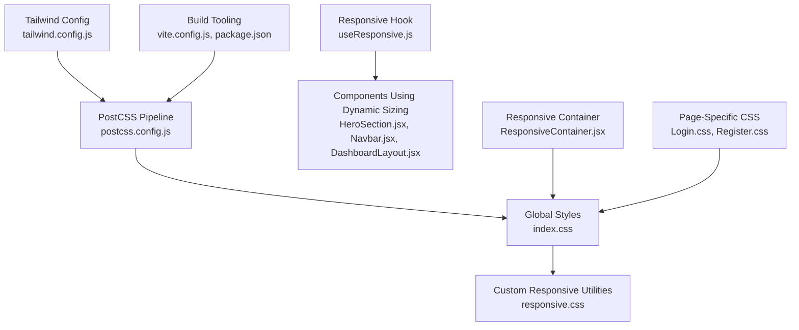
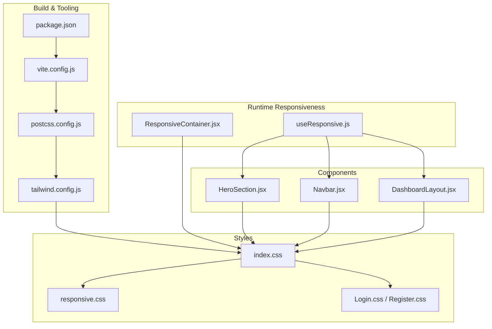
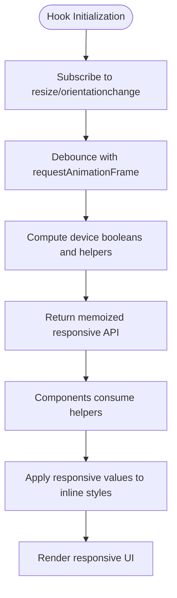
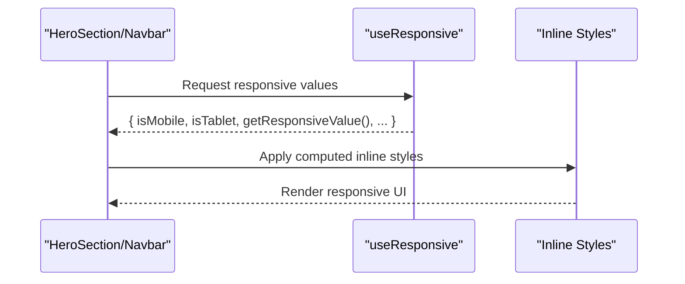
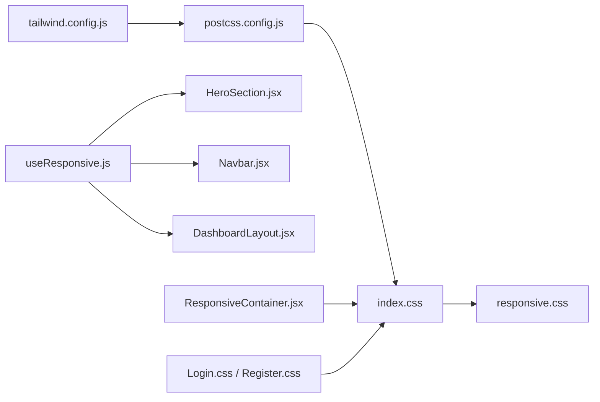

# Styling & Theming

<cite>
**Referenced Files in This Document**
- [tailwind.config.js](file://frontend/tailwind.config.js)
- [postcss.config.js](file://frontend/postcss.config.js)
- [index.css](file://frontend/src/index.css)
- [responsive.css](file://frontend/src/styles/responsive.css)
- [RESPONSIVE_DESIGN.md](file://frontend/RESPONSIVE_DESIGN.md)
- [useResponsive.js](file://frontend/src/hooks/useResponsive.js)
- [ResponsiveContainer.jsx](file://frontend/src/components/common/ResponsiveContainer.jsx)
- [DashboardLayout.jsx](file://frontend/src/layouts/DashboardLayout.jsx)
- [HeroSection.jsx](file://frontend/src/components/user/home/HeroSection.jsx)
- [Navbar.jsx](file://frontend/src/components/user/home/Navbar.jsx)
- [Login.css](file://frontend/src/pages/user/Login.css)
- [Register.css](file://frontend/src/pages/user/Register.css)
- [App.css](file://frontend/src/App.css)
- [vite.config.js](file://frontend/vite.config.js)
- [package.json](file://frontend/package.json)
</cite>

## Table of Contents
1. [Introduction](#introduction)
2. [Project Structure](#project-structure)
3. [Core Components](#core-components)
4. [Architecture Overview](#architecture-overview)
5. [Detailed Component Analysis](#detailed-component-analysis)
6. [Dependency Analysis](#dependency-analysis)
7. [Performance Considerations](#performance-considerations)
8. [Troubleshooting Guide](#troubleshooting-guide)
9. [Conclusion](#conclusion)
10. [Appendices](#appendices)

## Introduction
This document explains the styling architecture and theming system of the Modern Digital Banking Dashboard frontend. It covers Tailwind CSS configuration, PostCSS and autoprefixer setup, custom responsive utilities, breakpoint management, and mobile-first design patterns. It also documents how dynamic sizing is achieved via a responsive hook and container component, and how CSS-in-JS is used in key components. Accessibility and cross-browser compatibility strategies are included, along with guidance for maintaining and extending the design system.

## Project Structure
The styling system is organized around:
- Tailwind CSS for utility-first styling and automatic purging
- PostCSS pipeline with Tailwind and Autoprefixer
- A global stylesheet that layers Tailwind base/components/utilities and custom responsive utilities
- A dedicated responsive utilities sheet for additional patterns
- A responsive hook and container component for dynamic sizing and layout
- Component-level inline styles leveraging the responsive hook
- Page-specific media queries for device-specific adjustments

**Diagram sources**
- [tailwind.config.js:1-26](file://frontend/tailwind.config.js#L1-L26)
- [postcss.config.js:1-7](file://frontend/postcss.config.js#L1-L7)
- [index.css:1-146](file://frontend/src/index.css#L1-L146)
- [responsive.css:1-398](file://frontend/src/styles/responsive.css#L1-L398)
- [useResponsive.js:1-116](file://frontend/src/hooks/useResponsive.js#L1-L116)
- [HeroSection.jsx:1-359](file://frontend/src/components/user/home/HeroSection.jsx#L1-L359)
- [Navbar.jsx:1-151](file://frontend/src/components/user/home/Navbar.jsx#L1-L151)
- [DashboardLayout.jsx:1-50](file://frontend/src/layouts/DashboardLayout.jsx#L1-L50)
- [ResponsiveContainer.jsx:1-71](file://frontend/src/components/common/ResponsiveContainer.jsx#L1-L71)
- [Login.css:1-44](file://frontend/src/pages/user/Login.css#L1-L44)
- [Register.css:1-50](file://frontend/src/pages/user/Register.css#L1-L50)
- [vite.config.js:1-34](file://frontend/vite.config.js#L1-L34)
- [package.json:1-37](file://frontend/package.json#L1-L37)

**Section sources**
- [tailwind.config.js:1-26](file://frontend/tailwind.config.js#L1-L26)
- [postcss.config.js:1-7](file://frontend/postcss.config.js#L1-L7)
- [index.css:1-146](file://frontend/src/index.css#L1-L146)
- [responsive.css:1-398](file://frontend/src/styles/responsive.css#L1-L398)
- [RESPONSIVE_DESIGN.md:1-246](file://frontend/RESPONSIVE_DESIGN.md#L1-L246)
- [vite.config.js:1-34](file://frontend/vite.config.js#L1-L34)
- [package.json:1-37](file://frontend/package.json#L1-L37)

## Core Components
- Tailwind CSS configuration defines content paths, breakpoints, and extended spacing for safe areas.
- PostCSS pipeline enables Tailwind and autoprefixer for vendor prefixes and modern CSS support.
- Global stylesheet layers Tailwind base/components/utilities and adds mobile-first responsive utilities via @layer utilities.
- Custom responsive utilities provide containers, grids, flex layouts, text sizing, spacing, visibility helpers, forms, and image utilities.
- Responsive hook and container component enable dynamic sizing and layout decisions based on viewport.
- Components use inline styles with responsive values from the hook for typography, spacing, and layout.
- Page-level CSS overrides and device-specific adjustments complement the global system.

**Section sources**
- [tailwind.config.js:1-26](file://frontend/tailwind.config.js#L1-L26)
- [postcss.config.js:1-7](file://frontend/postcss.config.js#L1-L7)
- [index.css:1-146](file://frontend/src/index.css#L1-L146)
- [responsive.css:1-398](file://frontend/src/styles/responsive.css#L1-L398)
- [useResponsive.js:1-116](file://frontend/src/hooks/useResponsive.js#L1-L116)
- [ResponsiveContainer.jsx:1-71](file://frontend/src/components/common/ResponsiveContainer.jsx#L1-L71)
- [HeroSection.jsx:1-359](file://frontend/src/components/user/home/HeroSection.jsx#L1-L359)
- [Navbar.jsx:1-151](file://frontend/src/components/user/home/Navbar.jsx#L1-L151)
- [Login.css:1-44](file://frontend/src/pages/user/Login.css#L1-L44)
- [Register.css:1-50](file://frontend/src/pages/user/Register.css#L1-L50)

## Architecture Overview
The styling architecture follows a layered approach:
- Tailwind generates utility classes for consistent spacing, colors, and layout.
- PostCSS transforms and optimizes CSS, ensuring cross-browser compatibility.
- Global styles layer Tailwind utilities with custom responsive utilities for mobile-first enhancements.
- The responsive hook and container component provide runtime decisions for dynamic sizing.
- Components apply responsive values via inline styles for typography, spacing, and layout.
- Page-specific CSS handles device quirks and complex overrides.

**Diagram sources**
- [package.json:1-37](file://frontend/package.json#L1-L37)
- [vite.config.js:1-34](file://frontend/vite.config.js#L1-L34)
- [postcss.config.js:1-7](file://frontend/postcss.config.js#L1-L7)
- [tailwind.config.js:1-26](file://frontend/tailwind.config.js#L1-L26)
- [index.css:1-146](file://frontend/src/index.css#L1-L146)
- [responsive.css:1-398](file://frontend/src/styles/responsive.css#L1-L398)
- [Login.css:1-44](file://frontend/src/pages/user/Login.css#L1-L44)
- [Register.css:1-50](file://frontend/src/pages/user/Register.css#L1-L50)
- [useResponsive.js:1-116](file://frontend/src/hooks/useResponsive.js#L1-L116)
- [ResponsiveContainer.jsx:1-71](file://frontend/src/components/common/ResponsiveContainer.jsx#L1-L71)
- [HeroSection.jsx:1-359](file://frontend/src/components/user/home/HeroSection.jsx#L1-L359)
- [Navbar.jsx:1-151](file://frontend/src/components/user/home/Navbar.jsx#L1-L151)
- [DashboardLayout.jsx:1-50](file://frontend/src/layouts/DashboardLayout.jsx#L1-L50)

## Detailed Component Analysis

### Tailwind CSS Configuration
- Content scanning includes HTML and all JS/TSX/JS sources under src.
- Breakpoints align with the design system: xs, sm, md, lg, xl, 2xl.
- Extended spacing supports safe-area insets for modern devices.

**Section sources**
- [tailwind.config.js:1-26](file://frontend/tailwind.config.js#L1-L26)

### PostCSS and Autoprefixer Setup
- PostCSS pipeline enabled with Tailwind and Autoprefixer.
- Ensures vendor-prefixed properties and modern CSS features are supported across browsers.

**Section sources**
- [postcss.config.js:1-7](file://frontend/postcss.config.js#L1-L7)
- [package.json:22-34](file://frontend/package.json#L22-L34)

### Global Styles and Layered Utilities
- Tailwind base, components, and utilities are imported.
- @layer utilities define mobile-first responsive containers, text sizing, spacing, grid/flex utilities, and safe-area padding.
- These utilities complement Tailwind’s utility classes and fill gaps for responsive patterns.

**Section sources**
- [index.css:1-146](file://frontend/src/index.css#L1-L146)

### Custom Responsive Utilities Sheet
- Provides containers, grid/flex utilities, text sizing scales, spacing scales, visibility helpers, button/card/form utilities, image aspect ratios, and safe-area support.
- Includes media queries for xs/sm/md/lg/xl breakpoints and pointer/coarse device targeting for touch targets.

**Section sources**
- [responsive.css:1-398](file://frontend/src/styles/responsive.css#L1-L398)

### Responsive Hook: useResponsive
- Tracks viewport size with requestAnimationFrame debouncing to optimize performance.
- Exposes device booleans (isMobile, isTablet, isDesktop, isXS) and helpers:
  - getResponsiveValue for breakpoint-driven values
  - getResponsivePadding for scalable spacing
  - getResponsiveFontSize for scalable typography
- Aligns with Tailwind breakpoints and the documented responsive design guidelines.

**Diagram sources**
- [useResponsive.js:25-113](file://frontend/src/hooks/useResponsive.js#L25-L113)

**Section sources**
- [useResponsive.js:1-116](file://frontend/src/hooks/useResponsive.js#L1-L116)
- [RESPONSIVE_DESIGN.md:50-126](file://frontend/RESPONSIVE_DESIGN.md#L50-L126)

### Responsive Container Component
- Computes responsive padding and max-width based on viewport size.
- Provides a lightweight alternative to CSS-only containers for dynamic scenarios.
- Useful for content areas requiring flexible constraints.

**Section sources**
- [ResponsiveContainer.jsx:1-71](file://frontend/src/components/common/ResponsiveContainer.jsx#L1-L71)

### Component-Level Responsive Styling (CSS-in-JS)
- HeroSection and Navbar use inline styles driven by the responsive hook to adjust:
  - Typography scales (font sizes, line heights)
  - Spacing (padding, margins, gaps)
  - Layout (grid/flex directions, shadows, border radii)
  - Interactive states (hover transforms, transitions)
- This pattern ensures consistent responsive behavior while leveraging Tailwind utilities for base styles.

**Diagram sources**
- [HeroSection.jsx:256-356](file://frontend/src/components/user/home/HeroSection.jsx#L256-L356)
- [Navbar.jsx:23-149](file://frontend/src/components/user/home/Navbar.jsx#L23-L149)
- [useResponsive.js:90-112](file://frontend/src/hooks/useResponsive.js#L90-L112)

**Section sources**
- [HeroSection.jsx:1-359](file://frontend/src/components/user/home/HeroSection.jsx#L1-L359)
- [Navbar.jsx:1-151](file://frontend/src/components/user/home/Navbar.jsx#L1-L151)

### Layout Responsiveness
- DashboardLayout switches flex direction based on device type.
- HeroSection adapts grid layout and spacing for different breakpoints.
- Navbar adjusts paddings, font sizes, and element sizes for compact displays.

**Section sources**
- [DashboardLayout.jsx:14-47](file://frontend/src/layouts/DashboardLayout.jsx#L14-L47)
- [HeroSection.jsx:256-356](file://frontend/src/components/user/home/HeroSection.jsx#L256-L356)
- [Navbar.jsx:23-149](file://frontend/src/components/user/home/Navbar.jsx#L23-L149)

### Page-Specific CSS Overrides
- Login.css and Register.css override grid layouts, visibility, and input/button sizing for mobile and specific device widths.
- These files demonstrate targeted fixes for form usability on small screens and avoid zoom on iOS.

**Section sources**
- [Login.css:1-44](file://frontend/src/pages/user/Login.css#L1-L44)
- [Register.css:1-50](file://frontend/src/pages/user/Register.css#L1-L50)

### Global Base Styles and Animations
- App.css applies responsive padding and logo sizing, respects reduced-motion preferences, and sets base typography and layout constraints.

**Section sources**
- [App.css:1-75](file://frontend/src/App.css#L1-L75)

## Dependency Analysis
The styling stack integrates build-time and runtime dependencies:
- Tailwind scans configured content paths and purges unused styles.
- PostCSS runs Tailwind and autoprefixer to produce optimized CSS.
- The responsive hook and container component depend on window APIs and React lifecycle.
- Components depend on the hook for responsive values and Tailwind utilities for base styles.

**Diagram sources**
- [tailwind.config.js:1-26](file://frontend/tailwind.config.js#L1-L26)
- [postcss.config.js:1-7](file://frontend/postcss.config.js#L1-L7)
- [index.css:1-146](file://frontend/src/index.css#L1-L146)
- [responsive.css:1-398](file://frontend/src/styles/responsive.css#L1-L398)
- [useResponsive.js:1-116](file://frontend/src/hooks/useResponsive.js#L1-L116)
- [HeroSection.jsx:1-359](file://frontend/src/components/user/home/HeroSection.jsx#L1-L359)
- [Navbar.jsx:1-151](file://frontend/src/components/user/home/Navbar.jsx#L1-L151)
- [DashboardLayout.jsx:1-50](file://frontend/src/layouts/DashboardLayout.jsx#L1-L50)
- [ResponsiveContainer.jsx:1-71](file://frontend/src/components/common/ResponsiveContainer.jsx#L1-L71)
- [Login.css:1-44](file://frontend/src/pages/user/Login.css#L1-L44)
- [Register.css:1-50](file://frontend/src/pages/user/Register.css#L1-L50)

**Section sources**
- [tailwind.config.js:1-26](file://frontend/tailwind.config.js#L1-L26)
- [postcss.config.js:1-7](file://frontend/postcss.config.js#L1-L7)
- [index.css:1-146](file://frontend/src/index.css#L1-L146)
- [responsive.css:1-398](file://frontend/src/styles/responsive.css#L1-L398)
- [useResponsive.js:1-116](file://frontend/src/hooks/useResponsive.js#L1-L116)
- [HeroSection.jsx:1-359](file://frontend/src/components/user/home/HeroSection.jsx#L1-L359)
- [Navbar.jsx:1-151](file://frontend/src/components/user/home/Navbar.jsx#L1-L151)
- [DashboardLayout.jsx:1-50](file://frontend/src/layouts/DashboardLayout.jsx#L1-L50)
- [ResponsiveContainer.jsx:1-71](file://frontend/src/components/common/ResponsiveContainer.jsx#L1-L71)
- [Login.css:1-44](file://frontend/src/pages/user/Login.css#L1-L44)
- [Register.css:1-50](file://frontend/src/pages/user/Register.css#L1-L50)

## Performance Considerations
- Mobile-first approach minimizes CSS payload and improves render performance.
- Tailwind purges unused styles during build, reducing CSS size.
- The responsive hook uses requestAnimationFrame to debounce resize handling, preventing layout thrashing.
- Conditional rendering and simplified layouts on mobile reduce DOM complexity.
- CSS utilities avoid duplication and encourage reuse.

**Section sources**
- [RESPONSIVE_DESIGN.md:199-215](file://frontend/RESPONSIVE_DESIGN.md#L199-L215)
- [useResponsive.js:29-52](file://frontend/src/hooks/useResponsive.js#L29-L52)

## Troubleshooting Guide
- If responsive utilities appear missing, verify Tailwind content paths and ensure @tailwind directives are present in the global stylesheet.
- If animations cause motion sensitivity issues, confirm reduced-motion handling via prefers-reduced-motion.
- For touch target issues on mobile, ensure minimum 44px targets and adequate spacing; the responsive utilities sheet includes pointer/coarse device targeting.
- If styles are overridden unexpectedly, check page-specific CSS media queries and specificity; prefer component-level responsive values from the hook.
- For safe-area issues on modern devices, use safe-area padding utilities and Tailwind’s extended spacing.

**Section sources**
- [index.css:11-13](file://frontend/src/index.css#L11-L13)
- [responsive.css:384-398](file://frontend/src/styles/responsive.css#L384-L398)
- [RESPONSIVE_DESIGN.md:161-175](file://frontend/RESPONSIVE_DESIGN.md#L161-L175)
- [Login.css:23-44](file://frontend/src/pages/user/Login.css#L23-L44)
- [Register.css:29-50](file://frontend/src/pages/user/Register.css#L29-L50)

## Conclusion
The styling architecture combines Tailwind’s utility-first approach with a robust PostCSS pipeline, a comprehensive set of custom responsive utilities, and runtime responsiveness via a dedicated hook and container component. The mobile-first strategy, combined with CSS-in-JS in key components, ensures consistent, scalable, and accessible designs across devices. The system is optimized for performance and maintainability, with clear patterns for extending the design system.

## Appendices

### Breakpoint Reference
- xs: 320px
- sm: 640px
- md: 768px
- lg: 1024px
- xl: 1280px
- 2xl: 1536px

**Section sources**
- [tailwind.config.js:7-14](file://frontend/tailwind.config.js#L7-L14)
- [RESPONSIVE_DESIGN.md:13-24](file://frontend/RESPONSIVE_DESIGN.md#L13-L24)

### Color Scheme and Typography
- Font family is defined globally for consistent typography.
- Components apply brand colors and neutral tones via inline styles; no centralized theme provider is used in the styling layer.
- Extend the responsive utilities sheet or add Tailwind color extensions to formalize a shared palette.

**Section sources**
- [index.css:19-21](file://frontend/src/index.css#L19-L21)
- [HeroSection.jsx:263-281](file://frontend/src/components/user/home/HeroSection.jsx#L263-L281)
- [Navbar.jsx:52-58](file://frontend/src/components/user/home/Navbar.jsx#L52-L58)

### Dark Mode Strategy
- No explicit dark mode implementation was identified in the styling layer. To add dark mode:
  - Introduce a theme context/provider to toggle a dark class on the root element.
  - Extend Tailwind’s configuration to support a dark strategy or add dark: prefixed utilities.
  - Provide dark variants for components via conditional classes and maintain contrast ratios.

[No sources needed since this section proposes a strategy without analyzing specific files]