# UI Components

<cite>
**Referenced Files in This Document**
- [CircleMetric.jsx](file://frontend/src/components/user/dashboard/CircleMetric.jsx)
- [InsightsChart.jsx](file://frontend/src/components/user/dashboard/InsightsChart.jsx)
- [TransactionsList.jsx](file://frontend/src/components/user/dashboard/TransactionsList.jsx)
- [CategoryTag.jsx](file://frontend/src/components/user/transactions/CategoryTag.jsx)
- [TransactionRow.jsx](file://frontend/src/components/user/transactions/TransactionRow.jsx)
- [TransactionFilter.jsx](file://frontend/src/components/user/transactions/TransactionFilter.jsx)
- [TransactionSearch.jsx](file://frontend/src/components/user/transactions/TransactionSearch.jsx)
- [useForm.js](file://frontend/src/hooks/useForm.js)
- [validation.js](file://frontend/src/utils/validation.js)
- [index.js](file://frontend/src/constants/index.js)
- [AddBillModal.jsx](file://frontend/src/components/user/bills/AddBillModal.jsx)
- [AddBudgetModal.jsx](file://frontend/src/components/user/budgets/AddBudgetModal.jsx)
- [useResponsive.js](file://frontend/src/hooks/useResponsive.js)
- [ResponsiveContainer.jsx](file://frontend/src/components/common/ResponsiveContainer.jsx)
- [responsive.css](file://frontend/src/styles/responsive.css)
- [Transactions.jsx](file://frontend/src/pages/user/Transactions.jsx)
</cite>

## Table of Contents
1. [Introduction](#introduction)
2. [Project Structure](#project-structure)
3. [Core Components](#core-components)
4. [Architecture Overview](#architecture-overview)
5. [Detailed Component Analysis](#detailed-component-analysis)
6. [Dependency Analysis](#dependency-analysis)
7. [Performance Considerations](#performance-considerations)
8. [Troubleshooting Guide](#troubleshooting-guide)
9. [Conclusion](#conclusion)
10. [Appendices](#appendices)

## Introduction
This document describes the reusable UI component library and specialized components used in the Modern Digital Banking Dashboard. It focuses on:
- Dashboard metric components: Circle Metric, Insights Chart, and Transactions List
- Transaction-related components: Category Tag, Transaction Row, Transaction Filter, and Transaction Search
- Form components: Reusable form hook and validation utilities
- Modal components: Bill creation/editing and Budget creation
- Props, events, styling customization, accessibility, composition patterns, theme integration, and responsive behavior

## Project Structure
The UI components are organized by feature area under frontend/src/components/user. Shared utilities and responsive helpers live under frontend/src/hooks, frontend/src/utils, and frontend/src/styles.

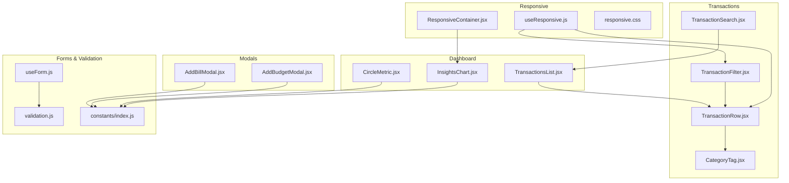

**Diagram sources**
- [CircleMetric.jsx:1-87](file://frontend/src/components/user/dashboard/CircleMetric.jsx#L1-L87)
- [InsightsChart.jsx:1-61](file://frontend/src/components/user/dashboard/InsightsChart.jsx#L1-L61)
- [TransactionsList.jsx:1-136](file://frontend/src/components/user/dashboard/TransactionsList.jsx#L1-L136)
- [CategoryTag.jsx:1-10](file://frontend/src/components/user/transactions/CategoryTag.jsx#L1-L10)
- [TransactionRow.jsx:1-96](file://frontend/src/components/user/transactions/TransactionRow.jsx#L1-L96)
- [TransactionFilter.jsx:1-126](file://frontend/src/components/user/transactions/TransactionFilter.jsx#L1-L126)
- [TransactionSearch.jsx:1-51](file://frontend/src/components/user/transactions/TransactionSearch.jsx#L1-L51)
- [useForm.js:1-107](file://frontend/src/hooks/useForm.js#L1-L107)
- [validation.js:1-177](file://frontend/src/utils/validation.js#L1-L177)
- [index.js:1-229](file://frontend/src/constants/index.js#L1-L229)
- [AddBillModal.jsx:1-174](file://frontend/src/components/user/bills/AddBillModal.jsx#L1-L174)
- [AddBudgetModal.jsx:1-273](file://frontend/src/components/user/budgets/AddBudgetModal.jsx#L1-L273)
- [useResponsive.js](file://frontend/src/hooks/useResponsive.js)
- [ResponsiveContainer.jsx](file://frontend/src/components/common/ResponsiveContainer.jsx)
- [responsive.css](file://frontend/src/styles/responsive.css)

**Section sources**
- [CircleMetric.jsx:1-87](file://frontend/src/components/user/dashboard/CircleMetric.jsx#L1-L87)
- [InsightsChart.jsx:1-61](file://frontend/src/components/user/dashboard/InsightsChart.jsx#L1-L61)
- [TransactionsList.jsx:1-136](file://frontend/src/components/user/dashboard/TransactionsList.jsx#L1-L136)
- [CategoryTag.jsx:1-10](file://frontend/src/components/user/transactions/CategoryTag.jsx#L1-L10)
- [TransactionRow.jsx:1-96](file://frontend/src/components/user/transactions/TransactionRow.jsx#L1-L96)
- [TransactionFilter.jsx:1-126](file://frontend/src/components/user/transactions/TransactionFilter.jsx#L1-L126)
- [TransactionSearch.jsx:1-51](file://frontend/src/components/user/transactions/TransactionSearch.jsx#L1-L51)
- [useForm.js:1-107](file://frontend/src/hooks/useForm.js#L1-L107)
- [validation.js:1-177](file://frontend/src/utils/validation.js#L1-L177)
- [index.js:1-229](file://frontend/src/constants/index.js#L1-L229)
- [AddBillModal.jsx:1-174](file://frontend/src/components/user/bills/AddBillModal.jsx#L1-L174)
- [AddBudgetModal.jsx:1-273](file://frontend/src/components/user/budgets/AddBudgetModal.jsx#L1-L273)
- [useResponsive.js](file://frontend/src/hooks/useResponsive.js)
- [ResponsiveContainer.jsx](file://frontend/src/components/common/ResponsiveContainer.jsx)
- [responsive.css](file://frontend/src/styles/responsive.css)

## Core Components
This section documents the primary reusable components and their responsibilities.

- CircleMetric: Renders a percentage-based financial metric using a pie chart with interactive hover effects.
- InsightsChart: Displays income vs expense over the last 15 days using bar charts with tooltips and responsive container.
- TransactionsList: Shows recent transactions with debit/credit indicators and responsive layout adjustments.
- CategoryTag: Lightweight tag for displaying transaction categories.
- TransactionRow: Individual transaction row with icons, amounts, and category display.
- TransactionFilter: Grid-based filter controls for account, type, and date range.
- TransactionSearch: Text input for keyword-based transaction filtering.
- useForm: Reusable form state and validation lifecycle.
- validation utilities: Email, phone, identifier, password, PIN, amount, and required-field validators.
- AddBillModal: Modal for adding or editing bills with account selection and auto-pay toggle.
- AddBudgetModal: Modal for adding budgets or setting monthly limits with category dropdown and duration controls.

**Section sources**
- [CircleMetric.jsx:1-87](file://frontend/src/components/user/dashboard/CircleMetric.jsx#L1-L87)
- [InsightsChart.jsx:1-61](file://frontend/src/components/user/dashboard/InsightsChart.jsx#L1-L61)
- [TransactionsList.jsx:1-136](file://frontend/src/components/user/dashboard/TransactionsList.jsx#L1-L136)
- [CategoryTag.jsx:1-10](file://frontend/src/components/user/transactions/CategoryTag.jsx#L1-L10)
- [TransactionRow.jsx:1-96](file://frontend/src/components/user/transactions/TransactionRow.jsx#L1-L96)
- [TransactionFilter.jsx:1-126](file://frontend/src/components/user/transactions/TransactionFilter.jsx#L1-L126)
- [TransactionSearch.jsx:1-51](file://frontend/src/components/user/transactions/TransactionSearch.jsx#L1-L51)
- [useForm.js:1-107](file://frontend/src/hooks/useForm.js#L1-L107)
- [validation.js:1-177](file://frontend/src/utils/validation.js#L1-L177)
- [AddBillModal.jsx:1-174](file://frontend/src/components/user/bills/AddBillModal.jsx#L1-L174)
- [AddBudgetModal.jsx:1-273](file://frontend/src/components/user/budgets/AddBudgetModal.jsx#L1-L273)

## Architecture Overview
The UI components follow a composition pattern:
- Presentational components (CircleMetric, InsightsChart, CategoryTag, TransactionRow, TransactionSearch, AddBillModal, AddBudgetModal) render visuals and user interactions.
- Container components (TransactionsList, TransactionFilter) orchestrate data and pass props/events to presentational components.
- Hooks encapsulate cross-cutting concerns (form state, responsive breakpoints).
- Constants and utilities centralize validation rules and UI thresholds.

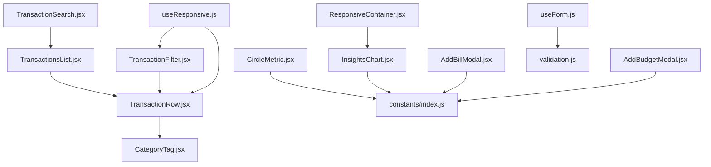

**Diagram sources**
- [TransactionsList.jsx:1-136](file://frontend/src/components/user/dashboard/TransactionsList.jsx#L1-L136)
- [TransactionRow.jsx:1-96](file://frontend/src/components/user/transactions/TransactionRow.jsx#L1-L96)
- [TransactionFilter.jsx:1-126](file://frontend/src/components/user/transactions/TransactionFilter.jsx#L1-L126)
- [TransactionSearch.jsx:1-51](file://frontend/src/components/user/transactions/TransactionSearch.jsx#L1-L51)
- [CategoryTag.jsx:1-10](file://frontend/src/components/user/transactions/CategoryTag.jsx#L1-L10)
- [CircleMetric.jsx:1-87](file://frontend/src/components/user/dashboard/CircleMetric.jsx#L1-L87)
- [InsightsChart.jsx:1-61](file://frontend/src/components/user/dashboard/InsightsChart.jsx#L1-L61)
- [AddBillModal.jsx:1-174](file://frontend/src/components/user/bills/AddBillModal.jsx#L1-L174)
- [AddBudgetModal.jsx:1-273](file://frontend/src/components/user/budgets/AddBudgetModal.jsx#L1-L273)
- [useForm.js:1-107](file://frontend/src/hooks/useForm.js#L1-L107)
- [validation.js:1-177](file://frontend/src/utils/validation.js#L1-L177)
- [index.js:1-229](file://frontend/src/constants/index.js#L1-L229)
- [useResponsive.js](file://frontend/src/hooks/useResponsive.js)
- [ResponsiveContainer.jsx](file://frontend/src/components/common/ResponsiveContainer.jsx)

## Detailed Component Analysis

### CircleMetric
- Purpose: Visualize a percentage-based financial metric with a premium card design and hover effects.
- Props:
  - label: string
  - percent: number (clamped to 0–100)
  - color: string (stroke/fill color)
- Events: None (presentational)
- Styling: Inline styles define card, center, value, and label styles; hover transforms and shadows applied via mouse handlers.
- Accessibility: Uses inline styles; consider adding aria-label for screen readers.
- Theme integration: Uses a predefined gradient and neutral palette; color prop allows customization.
- Responsive behavior: Hover effects apply regardless of viewport.

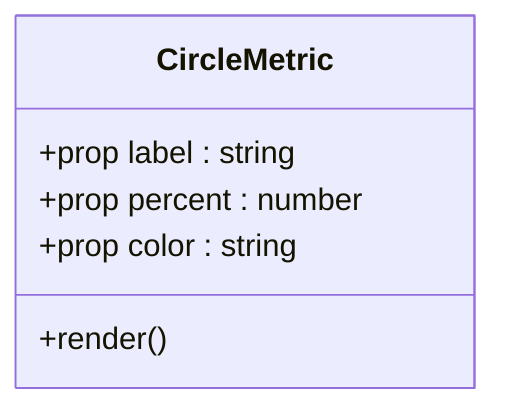

**Diagram sources**
- [CircleMetric.jsx:1-87](file://frontend/src/components/user/dashboard/CircleMetric.jsx#L1-L87)

**Section sources**
- [CircleMetric.jsx:1-87](file://frontend/src/components/user/dashboard/CircleMetric.jsx#L1-L87)

### InsightsChart
- Purpose: Render a bar chart comparing income and expenses over the last 15 days with tooltips and responsive container.
- Props:
  - data: array of objects with date, income, expense keys
- Events: None (presentational)
- Styling: Inline styles define card; uses recharts components with tooltip and responsive container.
- Accessibility: Recharts defaults; ensure data availability and consider ARIA labels.
- Theme integration: Uses green/red bars; configurable via props if extended.
- Responsive behavior: ResponsiveContainer adapts to container width.

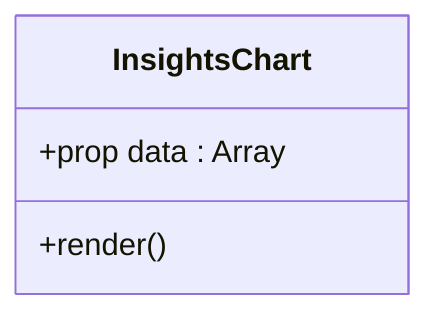

**Diagram sources**
- [InsightsChart.jsx:1-61](file://frontend/src/components/user/dashboard/InsightsChart.jsx#L1-L61)

**Section sources**
- [InsightsChart.jsx:1-61](file://frontend/src/components/user/dashboard/InsightsChart.jsx#L1-L61)

### TransactionsList
- Purpose: Display recent transactions with debits in red and credits in green, improved visual hierarchy.
- Props:
  - data: array of transaction objects with id, description, txn_date, txn_type, amount
- Events: None (presentational)
- Styling: Inline styles adjust padding, spacing, and typography based on window width; responsive layout stacks on small screens.
- Accessibility: Uses semantic headings and contrast; consider adding role="list" and proper contrast ratios.
- Theme integration: Uses neutral backgrounds and brand-safe colors.
- Responsive behavior: Dynamically adjusts styles based on window.innerWidth.

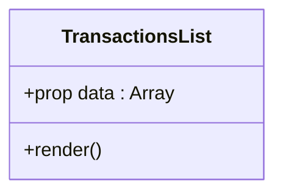

**Diagram sources**
- [TransactionsList.jsx:1-136](file://frontend/src/components/user/dashboard/TransactionsList.jsx#L1-L136)

**Section sources**
- [TransactionsList.jsx:1-136](file://frontend/src/components/user/dashboard/TransactionsList.jsx#L1-L136)

### CategoryTag
- Purpose: Lightweight tag to display a transaction category.
- Props:
  - category: string
- Events: None (presentational)
- Styling: Tailwind classes for padding, color, and rounded corners.
- Accessibility: Minimal; ensure sufficient color contrast.
- Theme integration: Uses gray-100 background; customize via className overrides.
- Responsive behavior: Static styling.

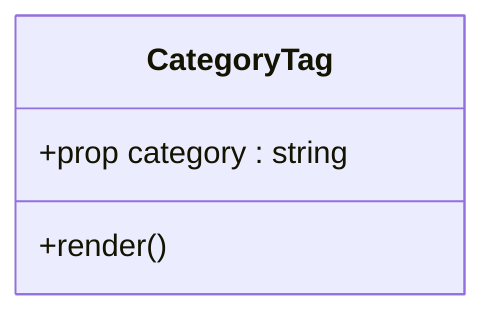

**Diagram sources**
- [CategoryTag.jsx:1-10](file://frontend/src/components/user/transactions/CategoryTag.jsx#L1-L10)

**Section sources**
- [CategoryTag.jsx:1-10](file://frontend/src/components/user/transactions/CategoryTag.jsx#L1-L10)

### TransactionRow
- Purpose: Individual transaction row with icon, description, metadata, amount, and category.
- Props:
  - txn: object with description, txn_date, txn_type, amount, category
- Events: None (presentational)
- Styling: Inline styles adapt to mobile/tablet/desktop via useResponsive hook; debits/credits use distinct colors.
- Accessibility: Uses semantic paragraphs and dates; improve with ARIA roles if used in lists.
- Theme integration: Uses brand-safe green/red and neutral backgrounds.
- Responsive behavior: Uses useResponsive hook to switch layout and typography.

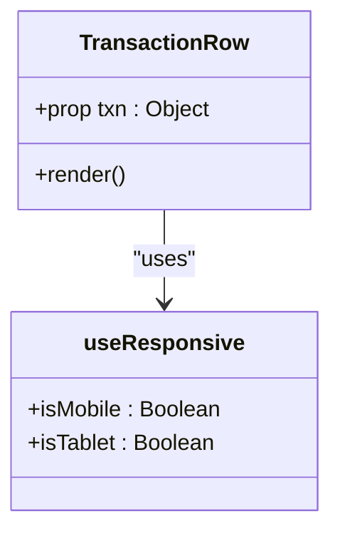

**Diagram sources**
- [TransactionRow.jsx:1-96](file://frontend/src/components/user/transactions/TransactionRow.jsx#L1-L96)
- [useResponsive.js](file://frontend/src/hooks/useResponsive.js)

**Section sources**
- [TransactionRow.jsx:1-96](file://frontend/src/components/user/transactions/TransactionRow.jsx#L1-L96)
- [useResponsive.js](file://frontend/src/hooks/useResponsive.js)

### TransactionFilter
- Purpose: Provide filtering controls for transactions (account, type, from/to date).
- Props:
  - accounts: array of account objects
  - filters: object with account_id, txn_type, from, to
  - onChange: function to update filters
- Events:
  - onChange callback invoked with updated filters
- Styling: Inline styles adapt to mobile/tablet/desktop using useResponsive; grid layout adjusts by breakpoint.
- Accessibility: Standard select/inputs; ensure labels and accessible names.
- Theme integration: Neutral borders and rounded inputs.
- Responsive behavior: Uses useResponsive to switch grid template columns.

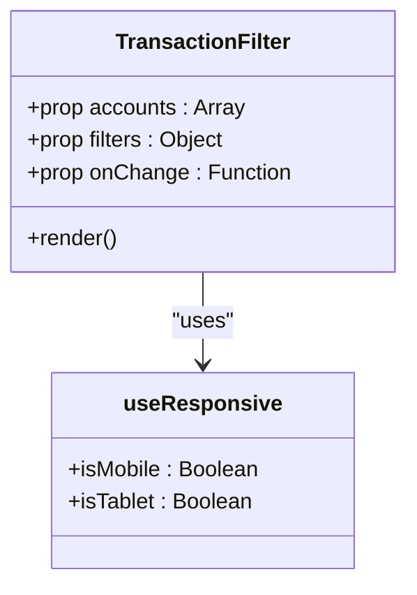

**Diagram sources**
- [TransactionFilter.jsx:1-126](file://frontend/src/components/user/transactions/TransactionFilter.jsx#L1-L126)
- [useResponsive.js](file://frontend/src/hooks/useResponsive.js)

**Section sources**
- [TransactionFilter.jsx:1-126](file://frontend/src/components/user/transactions/TransactionFilter.jsx#L1-L126)
- [useResponsive.js](file://frontend/src/hooks/useResponsive.js)

### TransactionSearch
- Purpose: Text input to search transactions by description or merchant.
- Props:
  - value: string
  - onChange: function to update search term
- Events:
  - onChange callback invoked with input value
- Styling: Inline styles for wrapper and input; minimal design.
- Accessibility: Standard input; ensure placeholder text is descriptive.
- Theme integration: Neutral border and focus styles.
- Responsive behavior: Static styling.

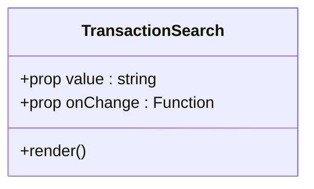

**Diagram sources**
- [TransactionSearch.jsx:1-51](file://frontend/src/components/user/transactions/TransactionSearch.jsx#L1-L51)

**Section sources**
- [TransactionSearch.jsx:1-51](file://frontend/src/components/user/transactions/TransactionSearch.jsx#L1-L51)

### useForm Hook
- Purpose: Manage form state, validation, and submission lifecycle.
- Exposed methods and state:
  - values, errors, touched, isSubmitting
  - handleChange, handleBlur, handleSubmit(onSubmit), reset, setFieldValue(name, value), setFieldError(name, error), setValues, setIsSubmitting
- Validation integration: Works with validation utilities to compute field-level errors.
- Submission handling: Marks all fields as touched on submit, validates, and calls onSubmit if valid.

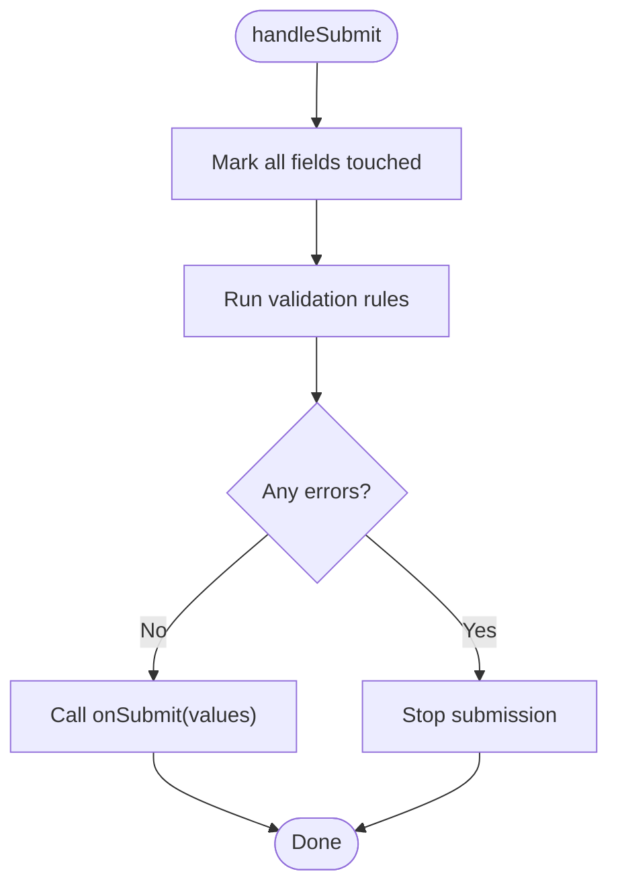

**Diagram sources**
- [useForm.js:1-107](file://frontend/src/hooks/useForm.js#L1-L107)

**Section sources**
- [useForm.js:1-107](file://frontend/src/hooks/useForm.js#L1-L107)

### Validation Utilities
- Functions:
  - validateEmail, validatePhone, validateIdentifier, validatePassword, validatePin, validateAmount, validateRequired
- Integration: Used with useForm to produce field-level errors.
- Constants: Validation thresholds and regex come from constants.

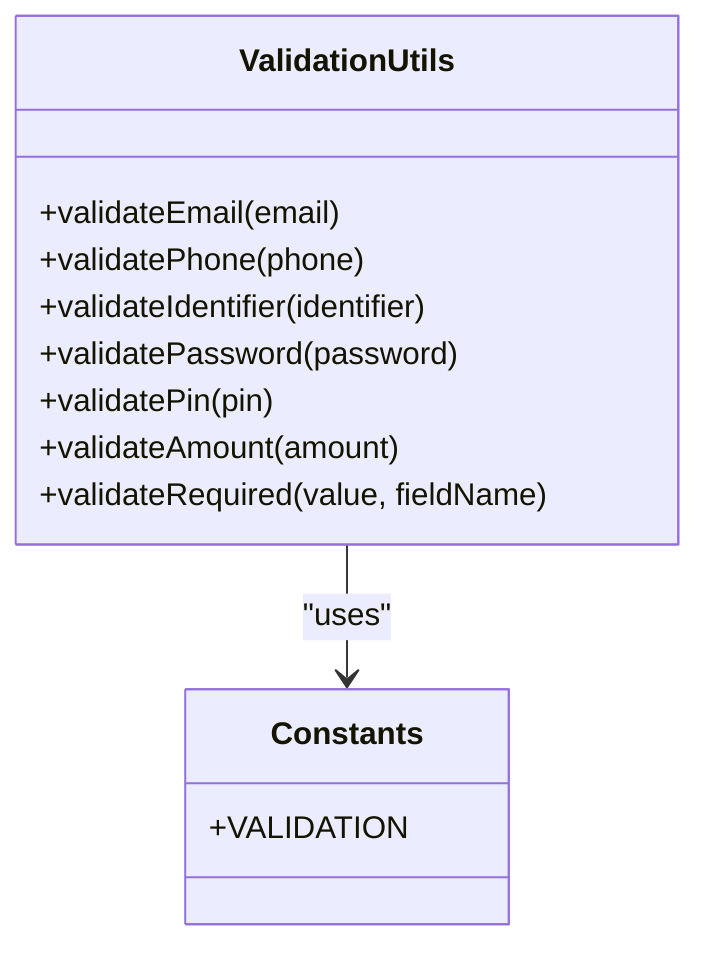

**Diagram sources**
- [validation.js:1-177](file://frontend/src/utils/validation.js#L1-L177)
- [index.js:191-202](file://frontend/src/constants/index.js#L191-L202)

**Section sources**
- [validation.js:1-177](file://frontend/src/utils/validation.js#L1-L177)
- [index.js:191-202](file://frontend/src/constants/index.js#L191-L202)

### AddBillModal
- Purpose: Modal for adding or editing bills with biller name, due date, amount, account, status, and auto-pay.
- Props:
  - onClose: function to close modal
  - onAdd: function to save bill
  - accounts: array of account objects
  - initialData: optional initial bill data
- Events:
  - onClose
  - onAdd(form)
- Styling: Tailwind classes for layout, spacing, and responsiveness; backdrop overlay.
- Accessibility: Uses labels and standard inputs; consider focus trapping and escape key handling.
- Theme integration: Orange primary button for action; neutral backgrounds.
- Responsive behavior: Adapts padding and typography for small screens.

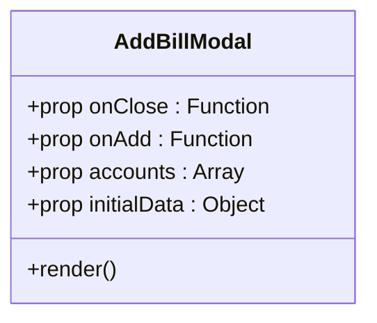

**Diagram sources**
- [AddBillModal.jsx:1-174](file://frontend/src/components/user/bills/AddBillModal.jsx#L1-L174)

**Section sources**
- [AddBillModal.jsx:1-174](file://frontend/src/components/user/bills/AddBillModal.jsx#L1-L174)

### AddBudgetModal
- Purpose: Modal for adding budgets or setting monthly limits with category dropdown and duration controls.
- Props:
  - onSave: optional callback after success
- Events:
  - Internal state updates; triggers onSave on completion
- Styling: Tailwind classes; success animation; backdrop blur.
- Accessibility: Dropdown with keyboard navigation; ensure focus management.
- Theme integration: Blue primary actions; white backgrounds.
- Responsive behavior: Adapts layout and typography for small screens.

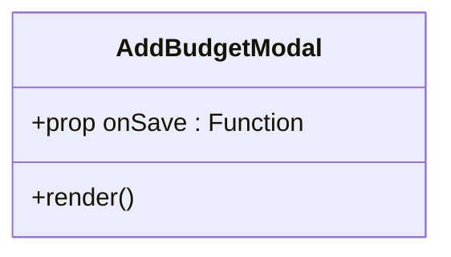

**Diagram sources**
- [AddBudgetModal.jsx:1-273](file://frontend/src/components/user/budgets/AddBudgetModal.jsx#L1-L273)

**Section sources**
- [AddBudgetModal.jsx:1-273](file://frontend/src/components/user/budgets/AddBudgetModal.jsx#L1-L273)

## Dependency Analysis
- Component coupling:
  - TransactionsList composes TransactionRow and TransactionSearch; TransactionFilter composes with TransactionRow.
  - useForm integrates with validation utilities.
  - Modals depend on constants for configuration and UI thresholds.
- Cohesion:
  - Each component encapsulates a single responsibility (rendering, filtering, validating, or managing state).
- External dependencies:
  - Recharts for charts (InsightsChart)
  - Lucide icons for visual cues (TransactionRow, AddBillModal)
  - Tailwind classes for styling (modals, tags)
- Responsive helpers:
  - useResponsive provides breakpoints for layout decisions.
  - ResponsiveContainer wraps charts for responsive sizing.

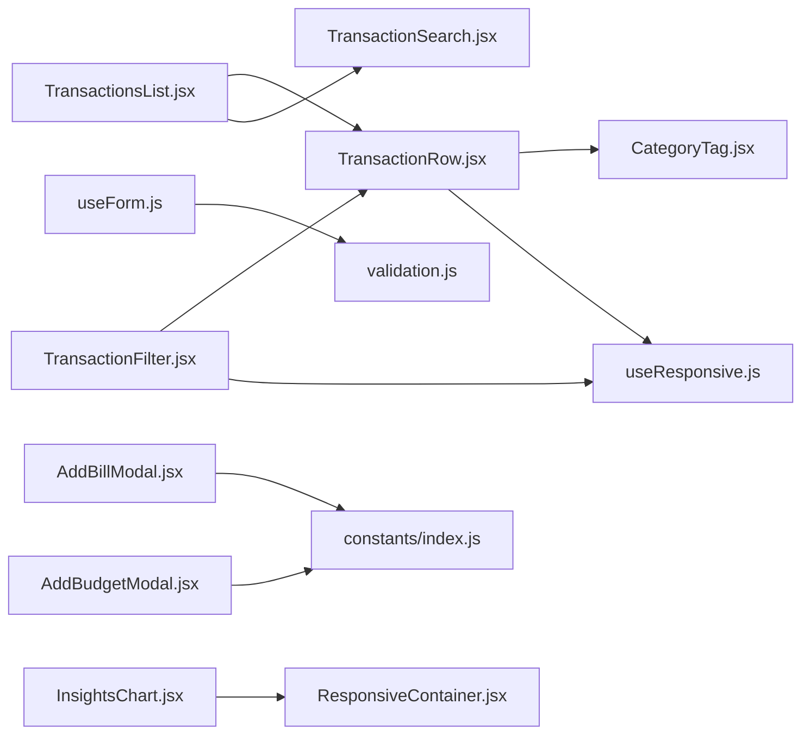

**Diagram sources**
- [TransactionsList.jsx:1-136](file://frontend/src/components/user/dashboard/TransactionsList.jsx#L1-L136)
- [TransactionRow.jsx:1-96](file://frontend/src/components/user/transactions/TransactionRow.jsx#L1-L96)
- [TransactionFilter.jsx:1-126](file://frontend/src/components/user/transactions/TransactionFilter.jsx#L1-L126)
- [TransactionSearch.jsx:1-51](file://frontend/src/components/user/transactions/TransactionSearch.jsx#L1-L51)
- [CategoryTag.jsx:1-10](file://frontend/src/components/user/transactions/CategoryTag.jsx#L1-L10)
- [useForm.js:1-107](file://frontend/src/hooks/useForm.js#L1-L107)
- [validation.js:1-177](file://frontend/src/utils/validation.js#L1-L177)
- [AddBillModal.jsx:1-174](file://frontend/src/components/user/bills/AddBillModal.jsx#L1-L174)
- [AddBudgetModal.jsx:1-273](file://frontend/src/components/user/budgets/AddBudgetModal.jsx#L1-L273)
- [index.js:1-229](file://frontend/src/constants/index.js#L1-L229)
- [ResponsiveContainer.jsx](file://frontend/src/components/common/ResponsiveContainer.jsx)
- [useResponsive.js](file://frontend/src/hooks/useResponsive.js)

**Section sources**
- [TransactionsList.jsx:1-136](file://frontend/src/components/user/dashboard/TransactionsList.jsx#L1-L136)
- [TransactionRow.jsx:1-96](file://frontend/src/components/user/transactions/TransactionRow.jsx#L1-L96)
- [TransactionFilter.jsx:1-126](file://frontend/src/components/user/transactions/TransactionFilter.jsx#L1-L126)
- [TransactionSearch.jsx:1-51](file://frontend/src/components/user/transactions/TransactionSearch.jsx#L1-L51)
- [CategoryTag.jsx:1-10](file://frontend/src/components/user/transactions/CategoryTag.jsx#L1-L10)
- [useForm.js:1-107](file://frontend/src/hooks/useForm.js#L1-L107)
- [validation.js:1-177](file://frontend/src/utils/validation.js#L1-L177)
- [AddBillModal.jsx:1-174](file://frontend/src/components/user/bills/AddBillModal.jsx#L1-L174)
- [AddBudgetModal.jsx:1-273](file://frontend/src/components/user/budgets/AddBudgetModal.jsx#L1-L273)
- [index.js:1-229](file://frontend/src/constants/index.js#L1-L229)
- [ResponsiveContainer.jsx](file://frontend/src/components/common/ResponsiveContainer.jsx)
- [useResponsive.js](file://frontend/src/hooks/useResponsive.js)

## Performance Considerations
- Prefer memoization for expensive computations in containers (e.g., derived data for charts).
- Lazy-load modals to reduce initial bundle size.
- Use CSS containment for lists to improve rendering performance.
- Debounce search inputs to avoid frequent re-renders.
- Optimize chart rendering by limiting data points and using ResponsiveContainer efficiently.

## Troubleshooting Guide
- Charts not resizing:
  - Ensure ResponsiveContainer wraps charts and that container has explicit dimensions.
- Validation not triggering:
  - Confirm useForm is called with correct initialValues and validationRules.
  - Ensure handleBlur and handleChange are wired to inputs.
- Modal not closing:
  - Verify onClose prop is passed and invoked on cancel/close actions.
- Responsive layout issues:
  - Check useResponsive hook and inline styles; confirm breakpoints align with constants.
- Accessible labels missing:
  - Add aria-labels and roles where appropriate for screen readers.

**Section sources**
- [InsightsChart.jsx:1-61](file://frontend/src/components/user/dashboard/InsightsChart.jsx#L1-L61)
- [useForm.js:1-107](file://frontend/src/hooks/useForm.js#L1-L107)
- [AddBillModal.jsx:1-174](file://frontend/src/components/user/bills/AddBillModal.jsx#L1-L174)
- [useResponsive.js](file://frontend/src/hooks/useResponsive.js)
- [responsive.css](file://frontend/src/styles/responsive.css)

## Conclusion
The UI component library emphasizes composability, reusability, and responsive behavior. Dashboard metrics, transaction displays, forms, and modals are built with clear separation of concerns and shared utilities. Extending components should preserve existing props/event contracts, maintain accessibility, and integrate with the responsive and theme systems.

## Appendices

### Props and Events Reference
- CircleMetric
  - Props: label, percent, color
- InsightsChart
  - Props: data
- TransactionsList
  - Props: data
- CategoryTag
  - Props: category
- TransactionRow
  - Props: txn
- TransactionFilter
  - Props: accounts, filters, onChange
  - Events: onChange(filters)
- TransactionSearch
  - Props: value, onChange
  - Events: onChange(term)
- useForm
  - Methods: handleChange, handleBlur, handleSubmit(onSubmit), reset, setFieldValue, setFieldError
  - State: values, errors, touched, isSubmitting
- AddBillModal
  - Props: onClose, onAdd, accounts, initialData
  - Events: onClose, onAdd(form)
- AddBudgetModal
  - Props: onSave
  - Events: onSave()

### Styling and Theming Notes
- Inline styles dominate presentational components; consider migrating to CSS modules or styled-components for scalability.
- Constants define breakpoints and colors; use them consistently across components.
- Tailwind utilities enable rapid prototyping; ensure consistent naming and spacing scales.

### Responsive Behavior Summary
- useResponsive provides isMobile/isTablet flags for layout decisions.
- TransactionsList and TransactionRow adapt spacing, typography, and layout direction based on viewport.
- TransactionFilter switches grid column count by breakpoint.
- InsightsChart uses ResponsiveContainer for adaptive sizing.

**Section sources**
- [useResponsive.js](file://frontend/src/hooks/useResponsive.js)
- [TransactionsList.jsx:1-136](file://frontend/src/components/user/dashboard/TransactionsList.jsx#L1-L136)
- [TransactionRow.jsx:1-96](file://frontend/src/components/user/transactions/TransactionRow.jsx#L1-L96)
- [TransactionFilter.jsx:1-126](file://frontend/src/components/user/transactions/TransactionFilter.jsx#L1-L126)
- [InsightsChart.jsx:1-61](file://frontend/src/components/user/dashboard/InsightsChart.jsx#L1-L61)
- [index.js:204-209](file://frontend/src/constants/index.js#L204-L209)