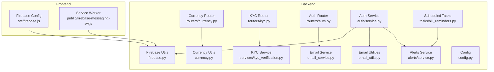
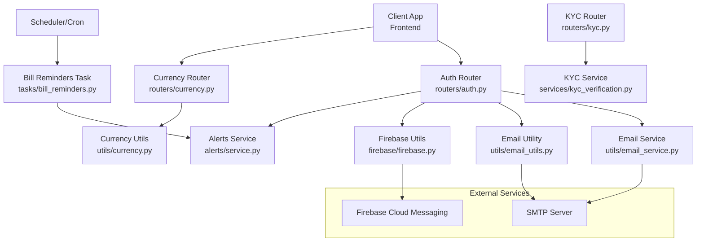
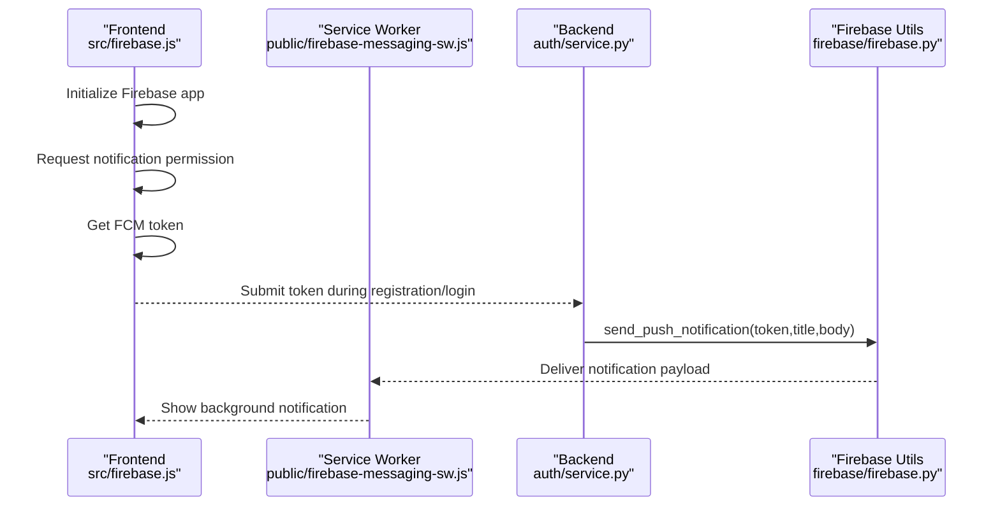
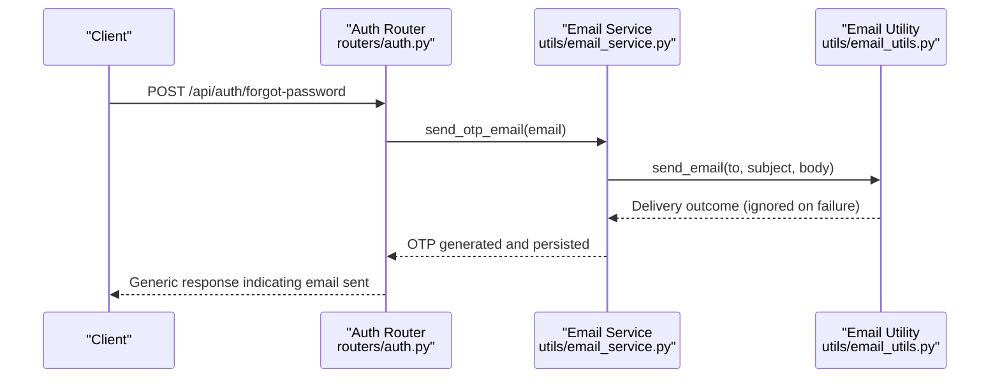
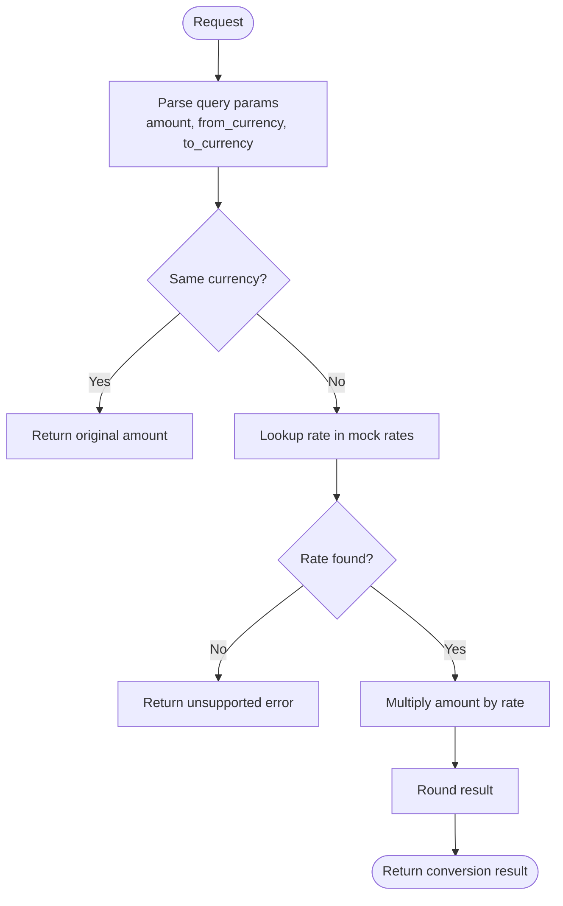
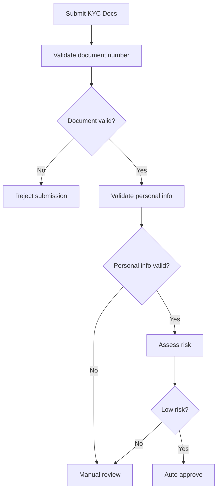
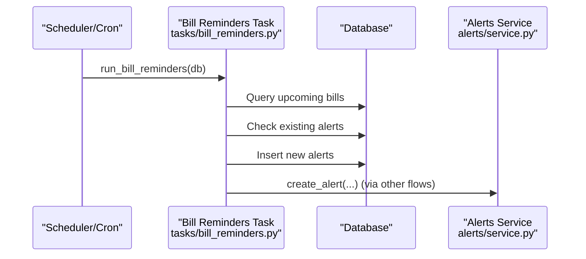
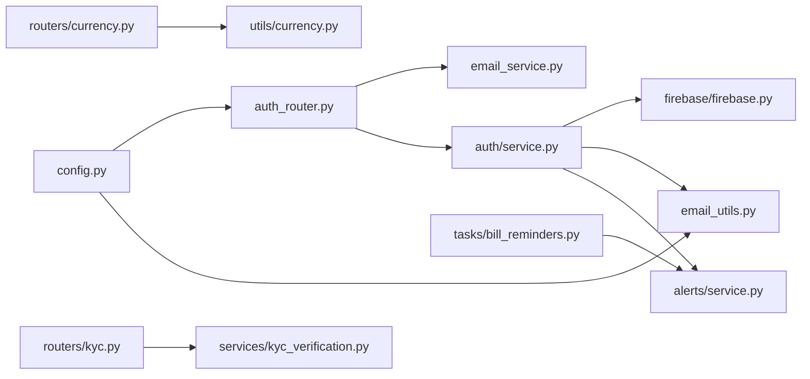

# Integration Patterns

<cite>
**Referenced Files in This Document**
- [firebase.py](file://backend/app/firebase/firebase.py)
- [email_service.py](file://backend/app/utils/email_service.py)
- [email_utils.py](file://backend/app/utils/email_utils.py)
- [currency.py](file://backend/app/utils/currency.py)
- [currency_router.py](file://backend/app/routers/currency.py)
- [kyc_verification.py](file://backend/app/services/kyc_verification.py)
- [kyc_router.py](file://backend/app/routers/kyc.py)
- [auth_router.py](file://backend/app/routers/auth.py)
- [auth_service.py](file://backend/app/auth/service.py)
- [alerts_service.py](file://backend/app/alerts/service.py)
- [firebase_config_js](file://frontend/src/firebase.js)
- [firebase_sw_js](file://frontend/public/firebase-messaging-sw.js)
- [config.py](file://backend/app/config.py)
- [bill_reminders.py](file://backend/app/tasks/bill_reminders.py)
</cite>

## Table of Contents
1. [Introduction](#introduction)
2. [Project Structure](#project-structure)
3. [Core Components](#core-components)
4. [Architecture Overview](#architecture-overview)
5. [Detailed Component Analysis](#detailed-component-analysis)
6. [Dependency Analysis](#dependency-analysis)
7. [Performance Considerations](#performance-considerations)
8. [Troubleshooting Guide](#troubleshooting-guide)
9. [Conclusion](#conclusion)

## Introduction
This document explains integration patterns connecting external services and internal systems in the banking platform. It covers:
- Firebase integration for real-time notifications, push messaging, and authentication services
- Email service integration for transaction confirmations, password resets, and account notifications
- Currency conversion service integration for multi-currency support and exchange rate calculations
- Third-party API integrations for payment processing, KYC verification, and financial data aggregation
- Webhook patterns for external service callbacks, event-driven architecture, and asynchronous processing
- Security considerations for external integrations, API key management, and rate limiting strategies
- Monitoring and logging for external service calls, error handling for service failures, and fallback mechanisms for critical integrations

## Project Structure
The integration surface spans backend services, utilities, routers, and frontend components:
- Backend: Firebase utilities, email utilities, currency utilities, KYC verification service, authentication router, alerts service, and scheduled tasks
- Frontend: Firebase initialization and service worker for push messaging

**Diagram sources**
- [firebase.py:1-29](file://backend/app/firebase/firebase.py#L1-L29)
- [email_utils.py:1-34](file://backend/app/utils/email_utils.py#L1-L34)
- [email_service.py:1-88](file://backend/app/utils/email_service.py#L1-L88)
- [currency.py:1-32](file://backend/app/utils/currency.py#L1-L32)
- [currency_router.py:1-100](file://backend/app/routers/currency.py#L1-L100)
- [kyc_verification.py:1-149](file://backend/app/services/kyc_verification.py#L1-L149)
- [kyc_router.py:1-308](file://backend/app/routers/kyc.py#L1-L308)
- [auth_router.py:1-315](file://backend/app/routers/auth.py#L1-L315)
- [auth_service.py:1-225](file://backend/app/auth/service.py#L1-L225)
- [alerts_service.py:1-24](file://backend/app/alerts/service.py#L1-L24)
- [firebase_config_js:1-24](file://frontend/src/firebase.js#L1-L24)
- [firebase_sw_js:1-26](file://frontend/public/firebase-messaging-sw.js#L1-L26)
- [config.py:1-72](file://backend/app/config.py#L1-L72)
- [bill_reminders.py:1-57](file://backend/app/tasks/bill_reminders.py#L1-L57)

**Section sources**
- [firebase.py:1-29](file://backend/app/firebase/firebase.py#L1-L29)
- [email_utils.py:1-34](file://backend/app/utils/email_utils.py#L1-L34)
- [email_service.py:1-88](file://backend/app/utils/email_service.py#L1-L88)
- [currency.py:1-32](file://backend/app/utils/currency.py#L1-L32)
- [currency_router.py:1-100](file://backend/app/routers/currency.py#L1-L100)
- [kyc_verification.py:1-149](file://backend/app/services/kyc_verification.py#L1-L149)
- [kyc_router.py:1-308](file://backend/app/routers/kyc.py#L1-L308)
- [auth_router.py:1-315](file://backend/app/routers/auth.py#L1-L315)
- [auth_service.py:1-225](file://backend/app/auth/service.py#L1-L225)
- [alerts_service.py:1-24](file://backend/app/alerts/service.py#L1-L24)
- [firebase_config_js:1-24](file://frontend/src/firebase.js#L1-L24)
- [firebase_sw_js:1-26](file://frontend/public/firebase-messaging-sw.js#L1-L26)
- [config.py:1-72](file://backend/app/config.py#L1-L72)
- [bill_reminders.py:1-57](file://backend/app/tasks/bill_reminders.py#L1-L57)

## Core Components
- Firebase integration: Initializes Firebase Admin SDK and sends push notifications to client FCM tokens
- Email integration: Provides OTP generation and delivery, plus generic email sending utilities
- Currency conversion: Offers mock exchange rates and conversion utilities with a public router exposing endpoints
- KYC verification: Validates identity documents and performs risk-based verification workflows
- Authentication and alerts: Orchestrates login alerts, push notifications, and email notifications
- Scheduled tasks: Generates bill due alerts server-side

**Section sources**
- [firebase.py:7-29](file://backend/app/firebase/firebase.py#L7-L29)
- [email_service.py:11-57](file://backend/app/utils/email_service.py#L11-L57)
- [email_utils.py:12-34](file://backend/app/utils/email_utils.py#L12-L34)
- [currency.py:11-32](file://backend/app/utils/currency.py#L11-L32)
- [currency_router.py:15-100](file://backend/app/routers/currency.py#L15-L100)
- [kyc_verification.py:65-149](file://backend/app/services/kyc_verification.py#L65-L149)
- [auth_service.py:160-225](file://backend/app/auth/service.py#L160-L225)
- [alerts_service.py:6-24](file://backend/app/alerts/service.py#L6-L24)
- [bill_reminders.py:24-57](file://backend/app/tasks/bill_reminders.py#L24-L57)

## Architecture Overview
The platform integrates external services through:
- Firebase Cloud Messaging for push notifications and background message handling
- SMTP-based email delivery for OTPs and alerts
- Internal APIs for currency conversion and KYC workflows
- Event-driven scheduling for recurring tasks

**Diagram sources**
- [auth_router.py:164-202](file://backend/app/routers/auth.py#L164-L202)
- [auth_service.py:160-197](file://backend/app/auth/service.py#L160-L197)
- [email_service.py:14-50](file://backend/app/utils/email_service.py#L14-L50)
- [email_utils.py:12-34](file://backend/app/utils/email_utils.py#L12-L34)
- [firebase.py:20-29](file://backend/app/firebase/firebase.py#L20-L29)
- [alerts_service.py:6-24](file://backend/app/alerts/service.py#L6-L24)
- [currency_router.py:15-100](file://backend/app/routers/currency.py#L15-L100)
- [currency.py:11-32](file://backend/app/utils/currency.py#L11-L32)
- [kyc_router.py:54-147](file://backend/app/routers/kyc.py#L54-L147)
- [kyc_verification.py:65-116](file://backend/app/services/kyc_verification.py#L65-L116)
- [bill_reminders.py:24-57](file://backend/app/tasks/bill_reminders.py#L24-L57)

## Detailed Component Analysis

### Firebase Integration for Push Notifications
Firebase is initialized from environment-backed credentials and used to send targeted push notifications to registered client device tokens. The frontend registers a service worker and obtains an FCM token for push delivery.

**Diagram sources**
- [firebase_config_js:1-24](file://frontend/src/firebase.js#L1-L24)
- [firebase_sw_js:15-25](file://frontend/public/firebase-messaging-sw.js#L15-L25)
- [auth_service.py:160-197](file://backend/app/auth/service.py#L160-L197)
- [firebase.py:20-29](file://backend/app/firebase/firebase.py#L20-L29)

**Section sources**
- [firebase.py:7-29](file://backend/app/firebase/firebase.py#L7-L29)
- [auth_service.py:160-197](file://backend/app/auth/service.py#L160-L197)
- [firebase_config_js:16-23](file://frontend/src/firebase.js#L16-L23)
- [firebase_sw_js:15-25](file://frontend/public/firebase-messaging-sw.js#L15-L25)

### Email Service Integration for OTPs and Alerts
The platform supports two email pathways:
- OTP emails for password reset workflows
- Generic email utility for alerts and login notifications

**Diagram sources**
- [auth_router.py:204-230](file://backend/app/routers/auth.py#L204-L230)
- [email_service.py:14-50](file://backend/app/utils/email_service.py#L14-L50)
- [email_utils.py:12-34](file://backend/app/utils/email_utils.py#L12-L34)

**Section sources**
- [auth_router.py:204-230](file://backend/app/routers/auth.py#L204-L230)
- [email_service.py:14-50](file://backend/app/utils/email_service.py#L14-L50)
- [email_utils.py:12-34](file://backend/app/utils/email_utils.py#L12-L34)

### Currency Conversion Service Integration
The currency module provides mock exchange rates and conversion utilities, exposed via a dedicated router. This enables multi-currency support and exchange rate calculations for the UI.

**Diagram sources**
- [currency_router.py:43-89](file://backend/app/routers/currency.py#L43-L89)
- [currency.py:11-21](file://backend/app/utils/currency.py#L11-L21)

**Section sources**
- [currency_router.py:15-100](file://backend/app/routers/currency.py#L15-L100)
- [currency.py:4-32](file://backend/app/utils/currency.py#L4-L32)

### KYC Verification Service Integration
The KYC service validates identity documents and assesses risk to determine auto-approval, manual review, or correction requests. The router handles document uploads, validation, and status updates.

**Diagram sources**
- [kyc_router.py:54-147](file://backend/app/routers/kyc.py#L54-L147)
- [kyc_verification.py:88-116](file://backend/app/services/kyc_verification.py#L88-L116)

**Section sources**
- [kyc_router.py:54-147](file://backend/app/routers/kyc.py#L54-L147)
- [kyc_verification.py:65-149](file://backend/app/services/kyc_verification.py#L65-L149)

### Webhook Patterns and Asynchronous Processing
- Background push notifications: Handled by the service worker receiving FCM messages
- Scheduled tasks: Bill reminders are generated server-side on demand or via scheduler
- Event-driven alerts: Login alerts and bill due alerts are persisted to the alerts table

**Diagram sources**
- [bill_reminders.py:24-57](file://backend/app/tasks/bill_reminders.py#L24-L57)
- [alerts_service.py:6-24](file://backend/app/alerts/service.py#L6-L24)

**Section sources**
- [bill_reminders.py:1-57](file://backend/app/tasks/bill_reminders.py#L1-L57)
- [firebase_sw_js:15-25](file://frontend/public/firebase-messaging-sw.js#L15-L25)

## Dependency Analysis
- Firebase initialization depends on environment variable containing Firebase credentials
- Email utilities depend on environment variables for SMTP credentials
- Authentication routes depend on email service and Firebase utilities for alerts
- Currency router depends on currency utilities for conversions
- KYC router depends on KYC verification service for validation logic
- Scheduled tasks depend on alerts service for persistence

**Diagram sources**
- [config.py:57-72](file://backend/app/config.py#L57-L72)
- [auth_router.py:1-315](file://backend/app/routers/auth.py#L1-L315)
- [email_utils.py:6-9](file://backend/app/utils/email_utils.py#L6-L9)
- [email_service.py:1-88](file://backend/app/utils/email_service.py#L1-L88)
- [auth_service.py:1-225](file://backend/app/auth/service.py#L1-L225)
- [firebase.py:1-29](file://backend/app/firebase/firebase.py#L1-L29)
- [alerts_service.py:1-24](file://backend/app/alerts/service.py#L1-L24)
- [currency_router.py:1-100](file://backend/app/routers/currency.py#L1-L100)
- [currency.py:1-32](file://backend/app/utils/currency.py#L1-L32)
- [kyc_router.py:1-308](file://backend/app/routers/kyc.py#L1-L308)
- [kyc_verification.py:1-149](file://backend/app/services/kyc_verification.py#L1-L149)
- [bill_reminders.py:1-57](file://backend/app/tasks/bill_reminders.py#L1-L57)

**Section sources**
- [config.py:57-72](file://backend/app/config.py#L57-L72)
- [auth_router.py:1-315](file://backend/app/routers/auth.py#L1-L315)
- [email_utils.py:6-9](file://backend/app/utils/email_utils.py#L6-L9)
- [auth_service.py:1-225](file://backend/app/auth/service.py#L1-L225)
- [firebase.py:1-29](file://backend/app/firebase/firebase.py#L1-L29)
- [alerts_service.py:1-24](file://backend/app/alerts/service.py#L1-L24)
- [currency_router.py:1-100](file://backend/app/routers/currency.py#L1-L100)
- [currency.py:1-32](file://backend/app/utils/currency.py#L1-L32)
- [kyc_router.py:1-308](file://backend/app/routers/kyc.py#L1-L308)
- [kyc_verification.py:1-149](file://backend/app/services/kyc_verification.py#L1-L149)
- [bill_reminders.py:1-57](file://backend/app/tasks/bill_reminders.py#L1-L57)

## Performance Considerations
- Firebase initialization: Ensure credentials are loaded once and avoid repeated initialization overhead
- Email delivery: Use connection pooling or async transports if scaling; currently synchronous and tolerant of failures
- Currency conversions: Cache rates locally and refresh periodically to reduce latency
- KYC processing: Offload heavy validations to background jobs if document verification becomes more complex
- Scheduled tasks: Run at off-peak hours and batch alert creation to minimize DB contention

## Troubleshooting Guide
- Firebase initialization fails: Verify the environment variable for Firebase credentials is present and valid
- Push notifications not received: Confirm client has granted notification permission and the FCM token is registered
- Email delivery errors: Check SMTP credentials; current implementation logs and ignores failures to avoid blocking auth flows
- Currency conversion errors: Ensure base and target currencies are supported by mock rates
- KYC validation failures: Review document format and checksum rules; check risk assessment thresholds
- Alert persistence issues: Confirm alerts service is invoked and database writes succeed

**Section sources**
- [firebase.py:11-17](file://backend/app/firebase/firebase.py#L11-L17)
- [auth_service.py:160-197](file://backend/app/auth/service.py#L160-L197)
- [email_utils.py:31-34](file://backend/app/utils/email_utils.py#L31-L34)
- [currency_router.py:36-41](file://backend/app/routers/currency.py#L36-L41)
- [kyc_verification.py:8-50](file://backend/app/services/kyc_verification.py#L8-L50)

## Conclusion
The platform integrates external services through a clean separation of concerns:
- Firebase for reliable push notifications with robust background handling
- SMTP-based email utilities for secure, resilient communication
- Internal APIs for currency conversion and KYC workflows
- Event-driven scheduling for recurring tasks

Security, monitoring, and resilience are addressed through environment-based configuration, tolerant email delivery, and modular services. Extending to production-grade integrations involves replacing mock implementations with real APIs, implementing strict rate limiting, and adding comprehensive observability and fallback strategies.