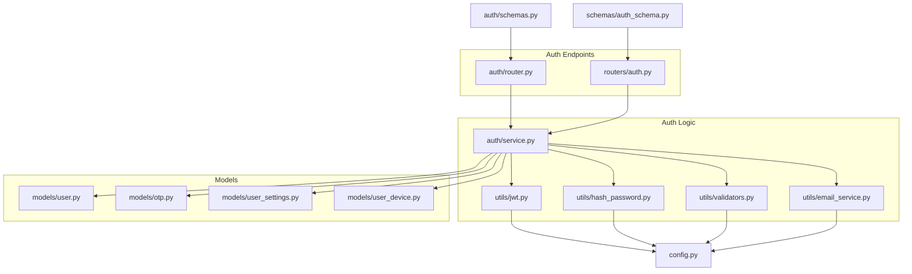
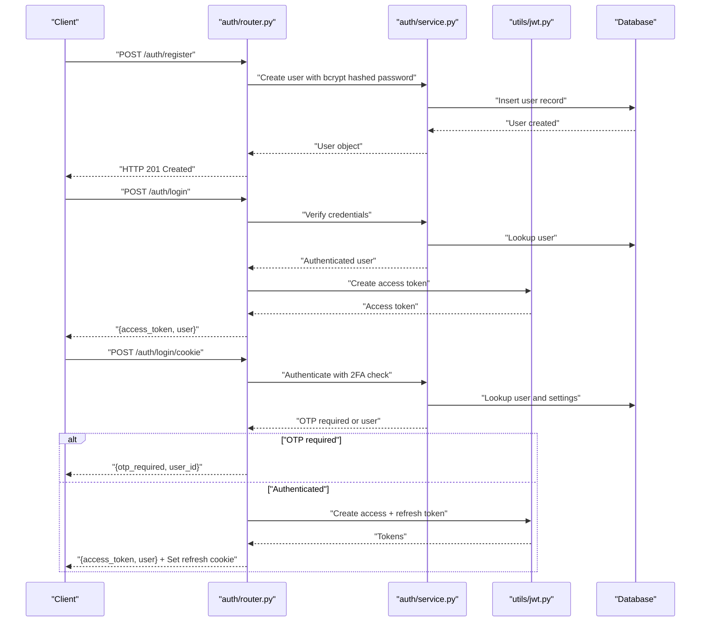
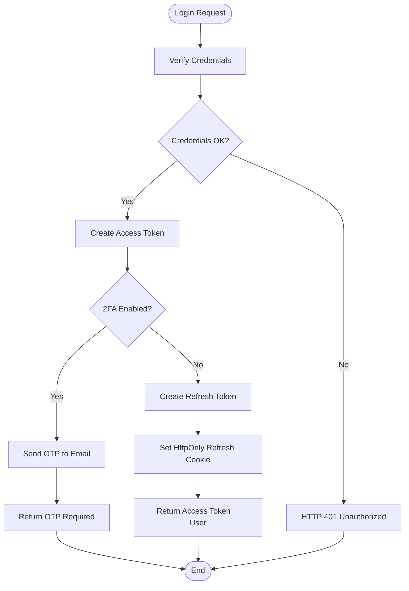
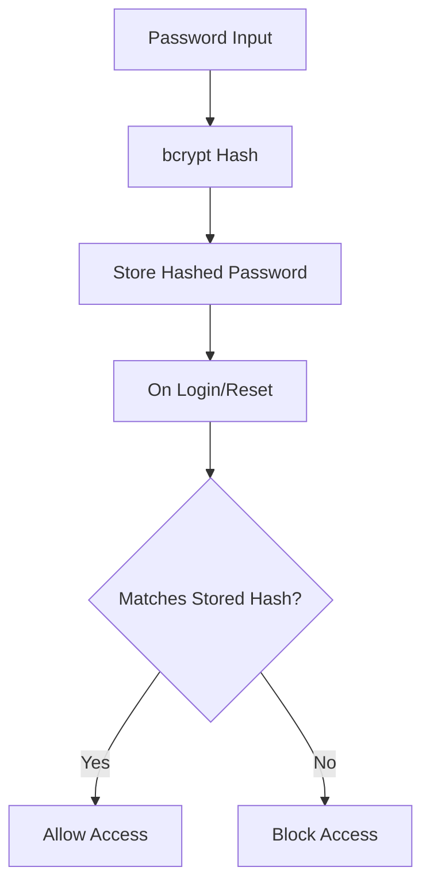
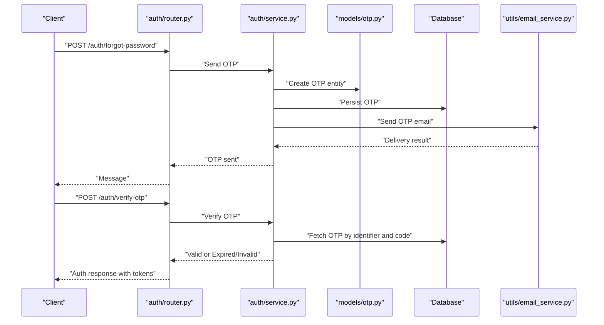
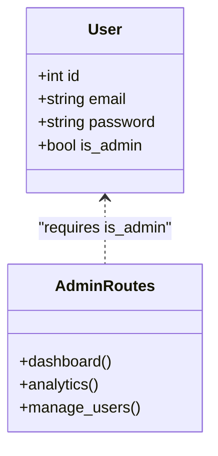
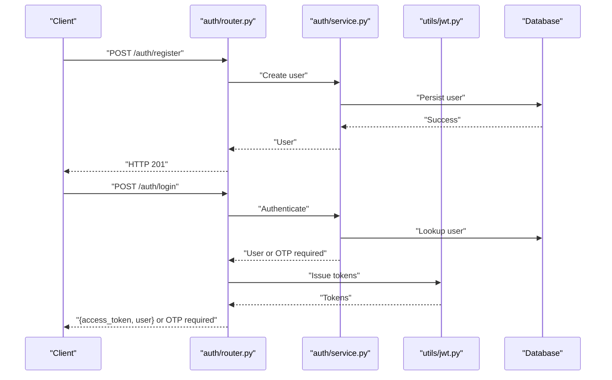
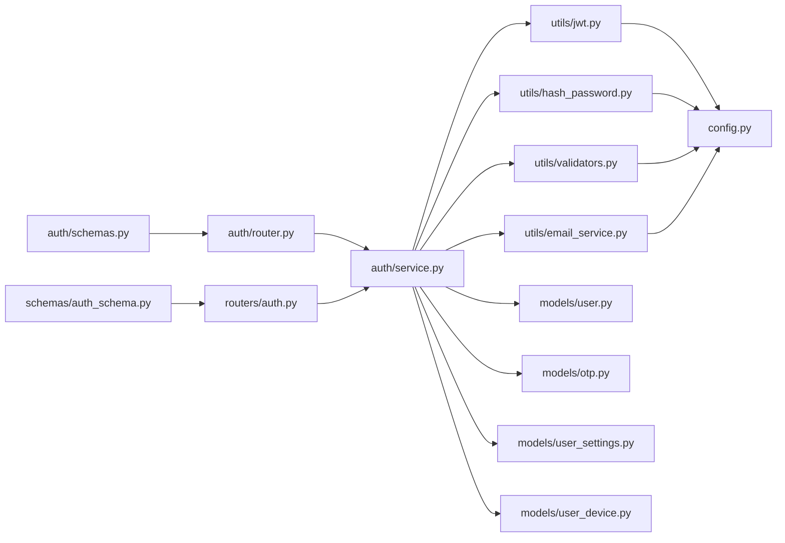

# Authentication & Security

<cite>
**Referenced Files in This Document**
- [backend/app/auth/router.py](file://backend/app/auth/router.py)
- [backend/app/auth/service.py](file://backend/app/auth/service.py)
- [backend/app/auth/schemas.py](file://backend/app/auth/schemas.py)
- [backend/app/utils/jwt.py](file://backend/app/utils/jwt.py)
- [backend/app/utils/hash_password.py](file://backend/app/utils/hash_password.py)
- [backend/app/utils/email_service.py](file://backend/app/utils/email_service.py)
- [backend/app/utils/validators.py](file://backend/app/utils/validators.py)
- [backend/app/models/otp.py](file://backend/app/models/otp.py)
- [backend/app/models/user.py](file://backend/app/models/user.py)
- [backend/app/models/user_settings.py](file://backend/app/models/user_settings.py)
- [backend/app/models/user_device.py](file://backend/app/models/user_device.py)
- [backend/app/routers/auth.py](file://backend/app/routers/auth.py)
- [backend/app/services/auth_service.py](file://backend/app/services/auth_service.py)
- [backend/app/schemas/auth_schema.py](file://backend/app/schemas/auth_schema.py)
- [backend/app/config.py](file://backend/app/config.py)
</cite>

## Table of Contents
1. [Introduction](#introduction)
2. [Project Structure](#project-structure)
3. [Core Components](#core-components)
4. [Architecture Overview](#architecture-overview)
5. [Detailed Component Analysis](#detailed-component-analysis)
6. [Dependency Analysis](#dependency-analysis)
7. [Performance Considerations](#performance-considerations)
8. [Security Best Practices and Compliance](#security-best-practices-and-compliance)
9. [Troubleshooting Guide](#troubleshooting-guide)
10. [Conclusion](#conclusion)

## Introduction
This document provides comprehensive authentication and security documentation for the banking application. It covers JWT-based authentication (access and refresh tokens), password hashing with bcrypt, OTP verification workflows, role-based access control, transaction PIN verification, email OTP delivery, admin role management, input validation, and end-to-end authentication flows. It also outlines threat mitigation strategies, security configurations, and compliance considerations tailored for financial applications.

## Project Structure
The authentication and security subsystem spans backend modules organized by concerns:
- Authentication endpoints and flows: [backend/app/auth/router.py](file://backend/app/auth/router.py), [backend/app/routers/auth.py](file://backend/app/routers/auth.py)
- Authentication logic and utilities: [backend/app/auth/service.py](file://backend/app/auth/service.py), [backend/app/utils/jwt.py](file://backend/app/utils/jwt.py), [backend/app/utils/hash_password.py](file://backend/app/utils/hash_password.py), [backend/app/utils/validators.py](file://backend/app/utils/validators.py)
- Models: user, OTP, user settings, user devices: [backend/app/models/user.py](file://backend/app/models/user.py), [backend/app/models/otp.py](file://backend/app/models/otp.py), [backend/app/models/user_settings.py](file://backend/app/models/user_settings.py), [backend/app/models/user_device.py](file://backend/app/models/user_device.py)
- Configuration: [backend/app/config.py](file://backend/app/config.py)
- Schemas: [backend/app/auth/schemas.py](file://backend/app/auth/schemas.py), [backend/app/schemas/auth_schema.py](file://backend/app/schemas/auth_schema.py)

**Diagram sources**
- [backend/app/auth/router.py](file://backend/app/auth/router.py)
- [backend/app/routers/auth.py](file://backend/app/routers/auth.py)
- [backend/app/auth/service.py](file://backend/app/auth/service.py)
- [backend/app/utils/jwt.py](file://backend/app/utils/jwt.py)
- [backend/app/utils/hash_password.py](file://backend/app/utils/hash_password.py)
- [backend/app/utils/validators.py](file://backend/app/utils/validators.py)
- [backend/app/utils/email_service.py](file://backend/app/utils/email_service.py)
- [backend/app/models/user.py](file://backend/app/models/user.py)
- [backend/app/models/otp.py](file://backend/app/models/otp.py)
- [backend/app/models/user_settings.py](file://backend/app/models/user_settings.py)
- [backend/app/models/user_device.py](file://backend/app/models/user_device.py)
- [backend/app/config.py](file://backend/app/config.py)
- [backend/app/auth/schemas.py](file://backend/app/auth/schemas.py)
- [backend/app/schemas/auth_schema.py](file://backend/app/schemas/auth_schema.py)

**Section sources**
- [backend/app/auth/router.py](file://backend/app/auth/router.py)
- [backend/app/routers/auth.py](file://backend/app/routers/auth.py)
- [backend/app/auth/service.py](file://backend/app/auth/service.py)
- [backend/app/utils/jwt.py](file://backend/app/utils/jwt.py)
- [backend/app/utils/hash_password.py](file://backend/app/utils/hash_password.py)
- [backend/app/utils/validators.py](file://backend/app/utils/validators.py)
- [backend/app/utils/email_service.py](file://backend/app/utils/email_service.py)
- [backend/app/models/user.py](file://backend/app/models/user.py)
- [backend/app/models/otp.py](file://backend/app/models/otp.py)
- [backend/app/models/user_settings.py](file://backend/app/models/user_settings.py)
- [backend/app/models/user_device.py](file://backend/app/models/user_device.py)
- [backend/app/config.py](file://backend/app/config.py)
- [backend/app/auth/schemas.py](file://backend/app/auth/schemas.py)
- [backend/app/schemas/auth_schema.py](file://backend/app/schemas/auth_schema.py)

## Core Components
- JWT utilities: Access and refresh token creation and decoding with configurable secrets and expiry windows.
- Password hashing: bcrypt-based hashing and verification.
- OTP management: Generation, persistence, expiry, and email delivery.
- Authentication service: User lookup, password verification, optional two-factor via OTP, login alerts, and last login updates.
- Models: User, OTP, UserSettings, UserDevice.
- Configuration: Centralized settings for JWT secrets, algorithms, and expiry durations.
- Schemas: Pydantic models for request/response validation.

Key implementation references:
- JWT creation and decoding: [backend/app/utils/jwt.py](file://backend/app/utils/jwt.py)
- Password hashing: [backend/app/utils/hash_password.py](file://backend/app/utils/hash_password.py)
- OTP generation and persistence: [backend/app/auth/service.py](file://backend/app/auth/service.py), [backend/app/models/otp.py](file://backend/app/models/otp.py)
- Authentication flow and 2FA: [backend/app/auth/service.py](file://backend/app/auth/service.py)
- User and admin roles: [backend/app/models/user.py](file://backend/app/models/user.py)
- Configuration: [backend/app/config.py](file://backend/app/config.py)
- Schemas: [backend/app/auth/schemas.py](file://backend/app/auth/schemas.py), [backend/app/schemas/auth_schema.py](file://backend/app/schemas/auth_schema.py)

**Section sources**
- [backend/app/utils/jwt.py](file://backend/app/utils/jwt.py)
- [backend/app/utils/hash_password.py](file://backend/app/utils/hash_password.py)
- [backend/app/auth/service.py](file://backend/app/auth/service.py)
- [backend/app/models/otp.py](file://backend/app/models/otp.py)
- [backend/app/models/user.py](file://backend/app/models/user.py)
- [backend/app/config.py](file://backend/app/config.py)
- [backend/app/auth/schemas.py](file://backend/app/auth/schemas.py)
- [backend/app/schemas/auth_schema.py](file://backend/app/schemas/auth_schema.py)

## Architecture Overview
The authentication system comprises:
- Endpoint routers for registration, login, OTP-based flows, and password reset.
- Service layer orchestrating password verification, OTP issuance, and optional two-factor enforcement.
- JWT utilities for secure token lifecycle management.
- Models representing users, OTPs, user preferences, and devices.
- Configuration module supplying secrets and expiry parameters.

**Diagram sources**
- [backend/app/auth/router.py](file://backend/app/auth/router.py)
- [backend/app/auth/service.py](file://backend/app/auth/service.py)
- [backend/app/utils/jwt.py](file://backend/app/utils/jwt.py)

## Detailed Component Analysis

### JWT-Based Authentication and Token Lifecycle
- Access tokens: Short-lived, used for protected routes.
- Refresh tokens: Longer-lived, returned as an HttpOnly cookie for secure storage.
- Token creation and decoding: Centralized in JWT utilities with configurable secrets and expiry.
- Cookie security: Controlled by environment variables for secure, same-site policies.

**Diagram sources**
- [backend/app/auth/router.py](file://backend/app/auth/router.py)
- [backend/app/auth/service.py](file://backend/app/auth/service.py)
- [backend/app/utils/jwt.py](file://backend/app/utils/jwt.py)

**Section sources**
- [backend/app/auth/router.py](file://backend/app/auth/router.py)
- [backend/app/auth/service.py](file://backend/app/auth/service.py)
- [backend/app/utils/jwt.py](file://backend/app/utils/jwt.py)
- [backend/app/config.py](file://backend/app/config.py)

### Password Hashing with bcrypt
- Passwords are hashed using bcrypt before storage.
- Verification compares plain text against stored hash.
- Strong password policy enforced during registration/reset flows.

**Diagram sources**
- [backend/app/utils/hash_password.py](file://backend/app/utils/hash_password.py)
- [backend/app/auth/service.py](file://backend/app/auth/service.py)
- [backend/app/utils/validators.py](file://backend/app/utils/validators.py)

**Section sources**
- [backend/app/utils/hash_password.py](file://backend/app/utils/hash_password.py)
- [backend/app/auth/service.py](file://backend/app/auth/service.py)
- [backend/app/utils/validators.py](file://backend/app/utils/validators.py)

### OTP Verification Workflow
- OTP generation: Random 6-digit code with 2-minute expiry.
- Storage: OTP persisted with identifier and expiry timestamp.
- Delivery: Email OTP sent for email-based identifiers.
- Verification: Validates OTP presence, expiry, and associated user.

**Diagram sources**
- [backend/app/auth/router.py](file://backend/app/auth/router.py)
- [backend/app/auth/service.py](file://backend/app/auth/service.py)
- [backend/app/models/otp.py](file://backend/app/models/otp.py)
- [backend/app/utils/email_service.py](file://backend/app/utils/email_service.py)

**Section sources**
- [backend/app/auth/router.py](file://backend/app/auth/router.py)
- [backend/app/auth/service.py](file://backend/app/auth/service.py)
- [backend/app/models/otp.py](file://backend/app/models/otp.py)
- [backend/app/utils/email_service.py](file://backend/app/utils/email_service.py)

### Role-Based Access Control (RBAC)
- Admin flag per user: Boolean indicator for administrative privileges.
- Admin endpoints: Separate routers and views exist for admin dashboards and analytics.
- Access patterns: Admin-only routes require authenticated admin users.

**Diagram sources**
- [backend/app/models/user.py](file://backend/app/models/user.py)
- [backend/app/routers/auth.py](file://backend/app/routers/auth.py)

**Section sources**
- [backend/app/models/user.py](file://backend/app/models/user.py)
- [backend/app/routers/auth.py](file://backend/app/routers/auth.py)

### Transaction PIN Verification
- PIN storage: Users have a PIN field in the user model.
- PIN change OTP: Dedicated endpoint to resend OTP for PIN change.
- PIN verification flow: Typically performed before sensitive operations (e.g., transfers). The frontend prompts for PIN, which is validated server-side before proceeding.

Note: The PIN verification logic is invoked in transaction flows. The OTP resend endpoint for PIN change is exposed for user convenience.

**Section sources**
- [backend/app/models/user.py](file://backend/app/models/user.py)
- [backend/app/auth/router.py](file://backend/app/auth/router.py)

### Email OTP Delivery
- OTP emails: Sent via SMTP using configured sender credentials.
- Fallback behavior: If credentials are missing, OTP is logged for testing and mock delivery is indicated.
- OTP storage: In-memory dictionary used temporarily for OTP verification.

**Section sources**
- [backend/app/utils/email_service.py](file://backend/app/utils/email_service.py)
- [backend/app/auth/service.py](file://backend/app/auth/service.py)

### Admin Role Management
- Admin flag: Managed per user in the database.
- Admin endpoints: Dedicated routers for admin functionalities (e.g., dashboard, analytics, user management).
- Access control: Admin-only routes enforce admin status for access.

**Section sources**
- [backend/app/models/user.py](file://backend/app/models/user.py)
- [backend/app/routers/auth.py](file://backend/app/routers/auth.py)

### Input Validation
- Pydantic schemas: Enforce request validation for registration, login, OTP, and password reset.
- Password strength: Regex-based validation ensuring minimum length and inclusion of uppercase, lowercase, digit, and special character.
- Phone normalization: Utility to strip non-digit characters for consistent storage.

**Section sources**
- [backend/app/auth/schemas.py](file://backend/app/auth/schemas.py)
- [backend/app/schemas/auth_schema.py](file://backend/app/schemas/auth_schema.py)
- [backend/app/utils/validators.py](file://backend/app/utils/validators.py)

### Complete Authentication Flow: Registration to Login
- Registration: Creates user with bcrypt-hashed password and optional profile fields.
- Login: Validates credentials and issues access token.
- Cookie login: Supports 2FA-aware login returning OTP requirement or issuing access and refresh tokens with secure cookie.

**Diagram sources**
- [backend/app/auth/router.py](file://backend/app/auth/router.py)
- [backend/app/auth/service.py](file://backend/app/auth/service.py)
- [backend/app/utils/jwt.py](file://backend/app/utils/jwt.py)

## Dependency Analysis
- Endpoints depend on service layer for business logic.
- Service layer depends on JWT utilities, hashing utilities, validators, email service, and models.
- Configuration supplies secrets and expiry parameters consumed by JWT utilities and services.
- Schemas validate requests and responses across endpoints.

**Diagram sources**
- [backend/app/auth/router.py](file://backend/app/auth/router.py)
- [backend/app/routers/auth.py](file://backend/app/routers/auth.py)
- [backend/app/auth/service.py](file://backend/app/auth/service.py)
- [backend/app/utils/jwt.py](file://backend/app/utils/jwt.py)
- [backend/app/utils/hash_password.py](file://backend/app/utils/hash_password.py)
- [backend/app/utils/validators.py](file://backend/app/utils/validators.py)
- [backend/app/utils/email_service.py](file://backend/app/utils/email_service.py)
- [backend/app/models/user.py](file://backend/app/models/user.py)
- [backend/app/models/otp.py](file://backend/app/models/otp.py)
- [backend/app/models/user_settings.py](file://backend/app/models/user_settings.py)
- [backend/app/models/user_device.py](file://backend/app/models/user_device.py)
- [backend/app/config.py](file://backend/app/config.py)
- [backend/app/auth/schemas.py](file://backend/app/auth/schemas.py)
- [backend/app/schemas/auth_schema.py](file://backend/app/schemas/auth_schema.py)

**Section sources**
- [backend/app/auth/router.py](file://backend/app/auth/router.py)
- [backend/app/routers/auth.py](file://backend/app/routers/auth.py)
- [backend/app/auth/service.py](file://backend/app/auth/service.py)
- [backend/app/utils/jwt.py](file://backend/app/utils/jwt.py)
- [backend/app/utils/hash_password.py](file://backend/app/utils/hash_password.py)
- [backend/app/utils/validators.py](file://backend/app/utils/validators.py)
- [backend/app/utils/email_service.py](file://backend/app/utils/email_service.py)
- [backend/app/models/user.py](file://backend/app/models/user.py)
- [backend/app/models/otp.py](file://backend/app/models/otp.py)
- [backend/app/models/user_settings.py](file://backend/app/models/user_settings.py)
- [backend/app/models/user_device.py](file://backend/app/models/user_device.py)
- [backend/app/config.py](file://backend/app/config.py)
- [backend/app/auth/schemas.py](file://backend/app/auth/schemas.py)
- [backend/app/schemas/auth_schema.py](file://backend/app/schemas/auth_schema.py)

## Performance Considerations
- Token expiry tuning: Adjust access and refresh token durations to balance security and UX.
- OTP expiry: Keep OTP validity short to minimize risk window.
- Database indexing: Ensure OTP and user tables are indexed on identifier/email for fast lookups.
- Asynchronous email delivery: Offload email sending to background tasks to avoid blocking requests.
- Caching: Cache frequently accessed user settings for 2FA and alerts to reduce DB queries.

## Security Best Practices and Compliance
- Secrets management:
  - Use environment variables for JWT secrets and SMTP credentials.
  - Rotate secrets periodically and invalidate refresh tokens after rotation.
- Transport security:
  - Enforce HTTPS in production.
  - Configure secure, same-site cookies for refresh tokens.
- Input sanitization and validation:
  - Validate and sanitize all inputs using Pydantic models.
  - Enforce strong password policies.
- Logging and monitoring:
  - Log failed login attempts and suspicious activities.
  - Alert on new device logins and OTP misuse.
- Data protection:
  - Encrypt sensitive fields at rest if required by compliance.
  - Minimize PII retention and provide user data deletion capabilities.
- Compliance considerations:
  - PCI DSS for payment-related flows.
  - GDPR for data privacy and user rights.
  - SOX for financial controls and audit trails.

## Troubleshooting Guide
- Invalid credentials:
  - Ensure correct email/password combination; verify hashing and verification logic.
- OTP issues:
  - Confirm OTP generation, persistence, and expiry logic.
  - Check email service configuration and fallback behavior.
- Token problems:
  - Verify JWT secrets, algorithm, and expiry settings.
  - Ensure cookie security flags align with deployment environment.
- 2FA not triggering:
  - Confirm user settings enable two-factor and that login alerts are configured.

**Section sources**
- [backend/app/auth/router.py](file://backend/app/auth/router.py)
- [backend/app/auth/service.py](file://backend/app/auth/service.py)
- [backend/app/utils/jwt.py](file://backend/app/utils/jwt.py)
- [backend/app/utils/email_service.py](file://backend/app/utils/email_service.py)
- [backend/app/config.py](file://backend/app/config.py)

## Conclusion
The banking application implements a robust authentication and security framework centered on JWT-based access/refresh tokens, bcrypt password hashing, and OTP-driven verification. It supports optional two-factor authentication, admin role management, and comprehensive input validation. By adhering to the recommended security configurations, threat mitigations, and compliance practices outlined here, the system can maintain strong security posture suitable for financial services.