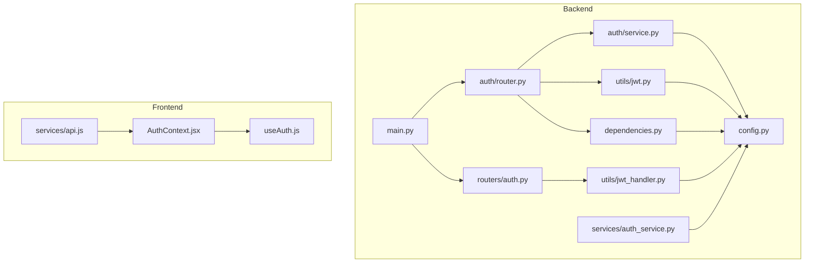
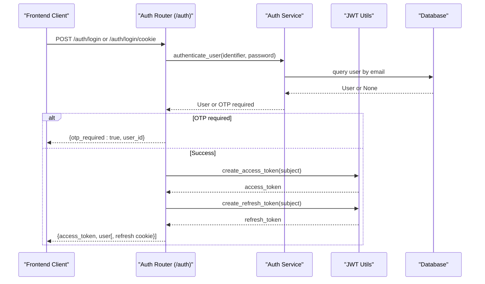
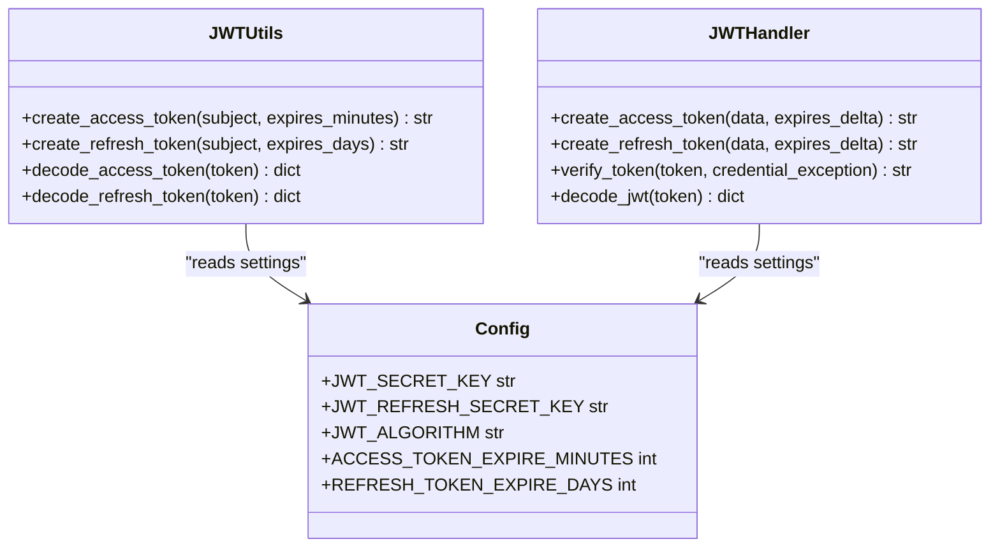
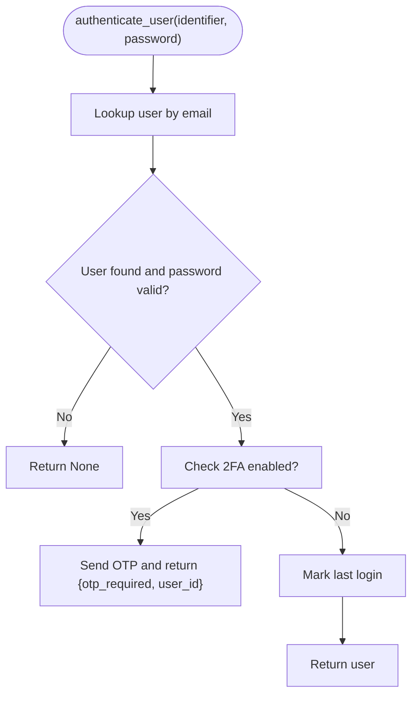
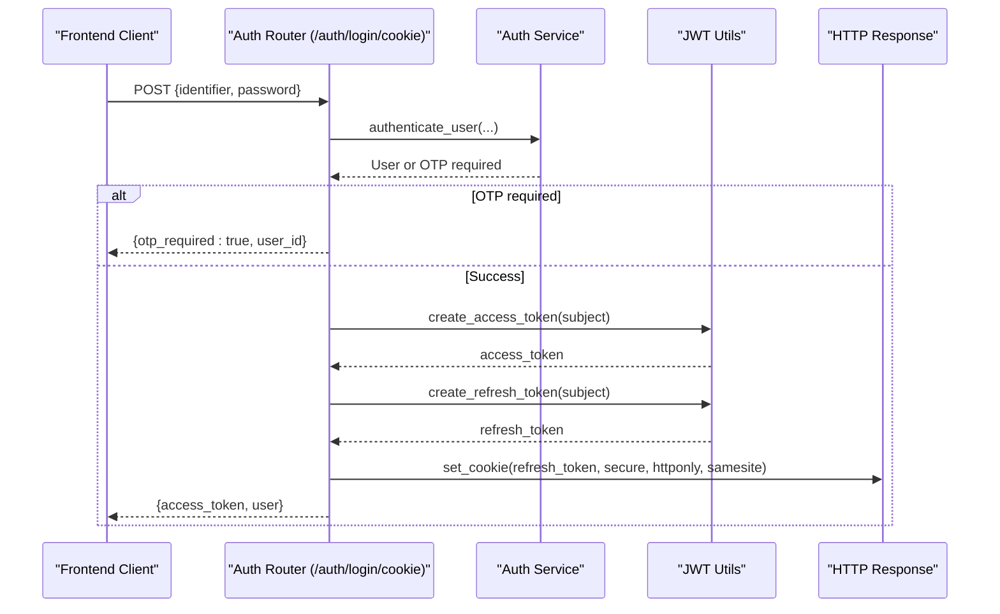
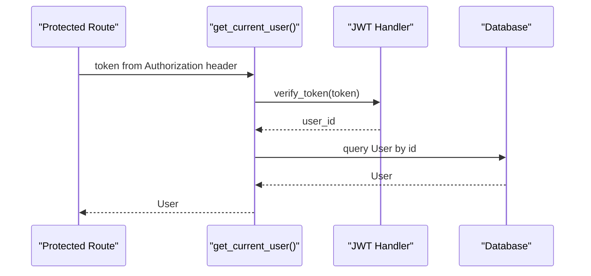
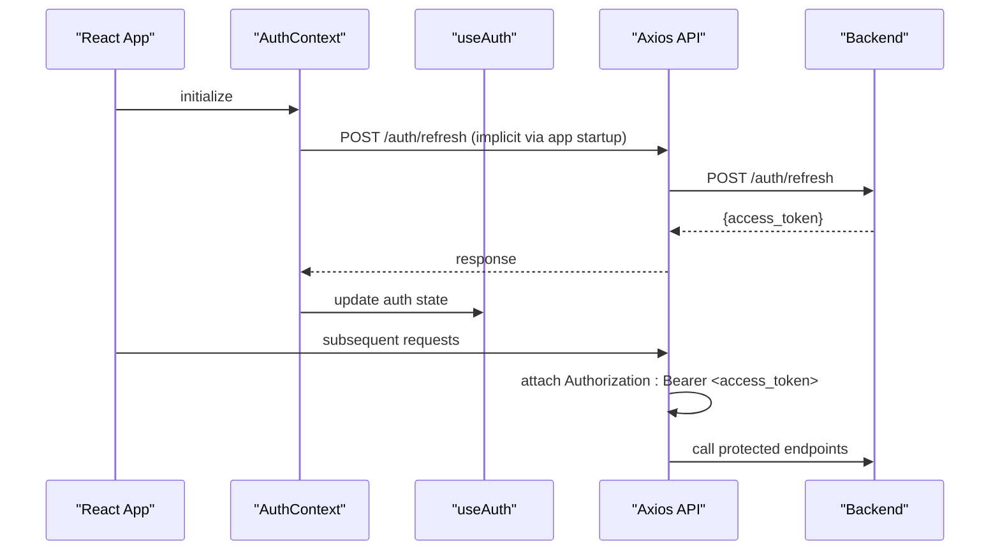
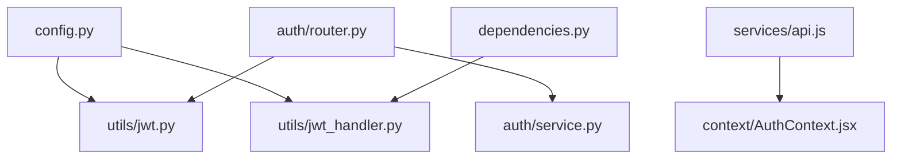

# JWT Authentication System

<cite>
**Referenced Files in This Document**
- [backend/app/auth/router.py](file://backend/app/auth/router.py)
- [backend/app/auth/service.py](file://backend/app/auth/service.py)
- [backend/app/auth/schemas.py](file://backend/app/auth/schemas.py)
- [backend/app/utils/jwt.py](file://backend/app/utils/jwt.py)
- [backend/app/utils/jwt_handler.py](file://backend/app/utils/jwt_handler.py)
- [backend/app/services/auth_service.py](file://backend/app/services/auth_service.py)
- [backend/app/routers/auth.py](file://backend/app/routers/auth.py)
- [backend/app/schemas/token.py](file://backend/app/schemas/token.py)
- [backend/app/config.py](file://backend/app/config.py)
- [backend/app/dependencies.py](file://backend/app/dependencies.py)
- [backend/app/main.py](file://backend/app/main.py)
- [frontend/src/context/AuthContext.jsx](file://frontend/src/context/AuthContext.jsx)
- [frontend/src/hooks/useAuth.js](file://frontend/src/hooks/useAuth.js)
- [frontend/src/services/api.js](file://frontend/src/services/api.js)
</cite>

## Table of Contents
1. [Introduction](#introduction)
2. [Project Structure](#project-structure)
3. [Core Components](#core-components)
4. [Architecture Overview](#architecture-overview)
5. [Detailed Component Analysis](#detailed-component-analysis)
6. [Dependency Analysis](#dependency-analysis)
7. [Performance Considerations](#performance-considerations)
8. [Troubleshooting Guide](#troubleshooting-guide)
9. [Conclusion](#conclusion)

## Introduction
This document provides comprehensive JWT authentication documentation for the Modern Digital Banking Dashboard. It covers token lifecycle management, access token creation and validation, refresh token handling, and cookie-based authentication. It also details JWT implementation including token expiration policies, secure cookie configuration, SameSite attribute settings, and HTTPS-only cookie handling. The complete authentication flow from initial login to token refresh is explained, including error handling for expired tokens and invalid credentials. Token security best practices, token rotation strategies, and integration with FastAPI dependency injection are included, along with practical examples of token usage in API requests and frontend integration patterns.

## Project Structure
The authentication system spans backend FastAPI routes, services, utilities, and frontend React components. Key areas include:
- Backend authentication routes and cookie handling
- JWT utilities and handlers for encoding/decoding tokens
- Configuration management for secrets and expiration
- Frontend authentication context and API client integration

**Diagram sources**
- [backend/app/main.py:28-85](file://backend/app/main.py#L28-L85)
- [backend/app/auth/router.py:21-31](file://backend/app/auth/router.py#L21-L31)
- [backend/app/routers/auth.py:16-17](file://backend/app/routers/auth.py#L16-L17)
- [backend/app/auth/service.py:22-25](file://backend/app/auth/service.py#L22-L25)
- [backend/app/utils/jwt.py:6-14](file://backend/app/utils/jwt.py#L6-L14)
- [backend/app/utils/jwt_handler.py:10-14](file://backend/app/utils/jwt_handler.py#L10-L14)
- [backend/app/services/auth_service.py:6-6](file://backend/app/services/auth_service.py#L6-L6)
- [backend/app/dependencies.py:14-14](file://backend/app/dependencies.py#L14-L14)
- [backend/app/config.py:57-71](file://backend/app/config.py#L57-L71)
- [frontend/src/context/AuthContext.jsx:23-46](file://frontend/src/context/AuthContext.jsx#L23-L46)
- [frontend/src/hooks/useAuth.js:22-63](file://frontend/src/hooks/useAuth.js#L22-L63)
- [frontend/src/services/api.js:19-31](file://frontend/src/services/api.js#L19-L31)

**Section sources**
- [backend/app/main.py:28-85](file://backend/app/main.py#L28-L85)
- [backend/app/config.py:57-71](file://backend/app/config.py#L57-L71)

## Core Components
- Access and refresh token creation utilities with configurable expiration
- Authentication service handling user lookup, password verification, and optional OTP flow
- Cookie-based authentication endpoints with secure cookie attributes
- FastAPI dependency injection for protected routes
- Frontend authentication context and API client for bearer token propagation

Key implementation references:
- Access token creation and decoding: [backend/app/utils/jwt.py:11-22](file://backend/app/utils/jwt.py#L11-L22)
- Refresh token creation and decoding: [backend/app/utils/jwt.py:16-25](file://backend/app/utils/jwt.py#L16-L25)
- Token expiration configuration: [backend/app/config.py:62-64](file://backend/app/config.py#L62-L64)
- Authentication flow and OTP handling: [backend/app/auth/service.py:205-224](file://backend/app/auth/service.py#L205-L224)
- Cookie-based login and refresh cookie setup: [backend/app/auth/router.py:122-138](file://backend/app/auth/router.py#L122-L138)
- Protected route dependency and token verification: [backend/app/dependencies.py:51-57](file://backend/app/dependencies.py#L51-L57)
- Frontend token propagation via Axios interceptor: [frontend/src/services/api.js:23-29](file://frontend/src/services/api.js#L23-L29)

**Section sources**
- [backend/app/utils/jwt.py:11-25](file://backend/app/utils/jwt.py#L11-L25)
- [backend/app/config.py:62-64](file://backend/app/config.py#L62-L64)
- [backend/app/auth/service.py:205-224](file://backend/app/auth/service.py#L205-L224)
- [backend/app/auth/router.py:122-138](file://backend/app/auth/router.py#L122-L138)
- [backend/app/dependencies.py:51-57](file://backend/app/dependencies.py#L51-L57)
- [frontend/src/services/api.js:23-29](file://frontend/src/services/api.js#L23-L29)

## Architecture Overview
The authentication system integrates backend JWT utilities, FastAPI dependency injection, and frontend token management. It supports two primary flows:
- Cookie-based authentication with refresh cookies
- Bearer token authentication via Authorization header

**Diagram sources**
- [backend/app/auth/router.py:104-138](file://backend/app/auth/router.py#L104-L138)
- [backend/app/auth/service.py:205-224](file://backend/app/auth/service.py#L205-L224)
- [backend/app/utils/jwt.py:11-19](file://backend/app/utils/jwt.py#L11-L19)
- [backend/app/models/user.py](file://backend/app/models/user.py)

## Detailed Component Analysis

### JWT Utilities and Handlers
The JWT utilities provide standardized token creation and decoding with configurable secrets and expiration. They enforce token type validation and extract user identity for dependency injection.

**Diagram sources**
- [backend/app/utils/jwt.py:11-25](file://backend/app/utils/jwt.py#L11-L25)
- [backend/app/utils/jwt_handler.py:45-78](file://backend/app/utils/jwt_handler.py#L45-L78)
- [backend/app/config.py:57-71](file://backend/app/config.py#L57-L71)

**Section sources**
- [backend/app/utils/jwt.py:11-25](file://backend/app/utils/jwt.py#L11-L25)
- [backend/app/utils/jwt_handler.py:45-78](file://backend/app/utils/jwt_handler.py#L45-L78)
- [backend/app/config.py:57-71](file://backend/app/config.py#L57-L71)

### Authentication Service
The authentication service handles user lookup, password verification, optional OTP flow, and login alerts. It centralizes the business logic for authentication decisions and integrates with external services for notifications.

**Diagram sources**
- [backend/app/auth/service.py:205-224](file://backend/app/auth/service.py#L205-L224)

**Section sources**
- [backend/app/auth/service.py:205-224](file://backend/app/auth/service.py#L205-L224)

### Cookie-Based Authentication
Cookie-based authentication endpoints issue both access tokens and refresh cookies with secure attributes. The refresh cookie is configured with HttpOnly, SameSite, and Secure flags based on environment variables.

**Diagram sources**
- [backend/app/auth/router.py:122-138](file://backend/app/auth/router.py#L122-L138)
- [backend/app/auth/service.py:205-224](file://backend/app/auth/service.py#L205-L224)
- [backend/app/utils/jwt.py:11-19](file://backend/app/utils/jwt.py#L11-L19)

**Section sources**
- [backend/app/auth/router.py:24-31](file://backend/app/auth/router.py#L24-L31)
- [backend/app/auth/router.py:122-138](file://backend/app/auth/router.py#L122-L138)

### FastAPI Dependency Injection and Protected Routes
FastAPI dependency injection enforces token validation and user resolution for protected endpoints. The dependency verifies token type and extracts the user ID from the payload.

**Diagram sources**
- [backend/app/dependencies.py:51-57](file://backend/app/dependencies.py#L51-L57)
- [backend/app/utils/jwt_handler.py:63-71](file://backend/app/utils/jwt_handler.py#L63-L71)
- [backend/app/models/user.py](file://backend/app/models/user.py)

**Section sources**
- [backend/app/dependencies.py:51-57](file://backend/app/dependencies.py#L51-L57)
- [backend/app/utils/jwt_handler.py:63-71](file://backend/app/utils/jwt_handler.py#L63-L71)

### Frontend Authentication Integration
The frontend manages authentication state, persists tokens, and attaches the Authorization header to all API requests. It attempts to refresh the access token on initialization.

**Diagram sources**
- [frontend/src/context/AuthContext.jsx:26-42](file://frontend/src/context/AuthContext.jsx#L26-L42)
- [frontend/src/hooks/useAuth.js:29-41](file://frontend/src/hooks/useAuth.js#L29-L41)
- [frontend/src/services/api.js:23-29](file://frontend/src/services/api.js#L23-L29)

**Section sources**
- [frontend/src/context/AuthContext.jsx:26-42](file://frontend/src/context/AuthContext.jsx#L26-L42)
- [frontend/src/hooks/useAuth.js:29-41](file://frontend/src/hooks/useAuth.js#L29-L41)
- [frontend/src/services/api.js:23-29](file://frontend/src/services/api.js#L23-L29)

## Dependency Analysis
The authentication system exhibits clear separation of concerns:
- Configuration drives token secrets and expiration policies
- Utilities encapsulate JWT operations
- Routers orchestrate authentication flows and response construction
- Dependencies enforce runtime token validation
- Frontend integrates tokens into API requests

**Diagram sources**
- [backend/app/config.py:57-71](file://backend/app/config.py#L57-L71)
- [backend/app/utils/jwt.py:6-14](file://backend/app/utils/jwt.py#L6-L14)
- [backend/app/utils/jwt_handler.py:10-14](file://backend/app/utils/jwt_handler.py#L10-L14)
- [backend/app/auth/router.py:19-20](file://backend/app/auth/router.py#L19-L20)
- [backend/app/auth/service.py:22-25](file://backend/app/auth/service.py#L22-L25)
- [backend/app/dependencies.py:14-14](file://backend/app/dependencies.py#L14-L14)
- [frontend/src/services/api.js:19-31](file://frontend/src/services/api.js#L19-L31)
- [frontend/src/context/AuthContext.jsx:23-46](file://frontend/src/context/AuthContext.jsx#L23-L46)

**Section sources**
- [backend/app/config.py:57-71](file://backend/app/config.py#L57-L71)
- [backend/app/utils/jwt.py:6-14](file://backend/app/utils/jwt.py#L6-L14)
- [backend/app/utils/jwt_handler.py:10-14](file://backend/app/utils/jwt_handler.py#L10-L14)
- [backend/app/auth/router.py:19-20](file://backend/app/auth/router.py#L19-L20)
- [backend/app/auth/service.py:22-25](file://backend/app/auth/service.py#L22-L25)
- [backend/app/dependencies.py:14-14](file://backend/app/dependencies.py#L14-L14)
- [frontend/src/services/api.js:19-31](file://frontend/src/services/api.js#L19-L31)
- [frontend/src/context/AuthContext.jsx:23-46](file://frontend/src/context/AuthContext.jsx#L23-L46)

## Performance Considerations
- Token expiration tuning: Adjust ACCESS_TOKEN_EXPIRE_MINUTES and REFRESH_TOKEN_EXPIRE_DAYS to balance security and UX.
- Database lookups: Minimize repeated user queries by caching validated identities per request lifecycle.
- Cookie attributes: Use HttpOnly and Secure flags to prevent XSS and ensure transport security.
- OTP validity: Configure OTP expiry appropriately to reduce database load and improve responsiveness.

## Troubleshooting Guide
Common issues and resolutions:
- Invalid or expired tokens: Ensure clients refresh tokens before expiration and handle 401 responses gracefully.
- Missing credentials: Validate that login requests include both identifier and password.
- Invalid credentials: Confirm password verification logic and user existence checks.
- Cookie configuration: Verify COOKIE_SECURE and COOKIE_SAMESITE environment variables align with deployment context.
- Frontend token propagation: Confirm Authorization header is attached and tokens are persisted correctly.

**Section sources**
- [backend/app/auth/router.py:64-67](file://backend/app/auth/router.py#L64-L67)
- [backend/app/auth/router.py:127-128](file://backend/app/auth/router.py#L127-L128)
- [backend/app/auth/router.py:25-31](file://backend/app/auth/router.py#L25-L31)
- [frontend/src/services/api.js:23-29](file://frontend/src/services/api.js#L23-L29)

## Conclusion
The JWT authentication system provides a robust foundation for secure user sessions, supporting both cookie-based and bearer token flows. By leveraging configurable secrets, strict token validation, and frontend integration patterns, it ensures secure and maintainable authentication across the platform. Proper environment configuration and adherence to security best practices are essential for production readiness.