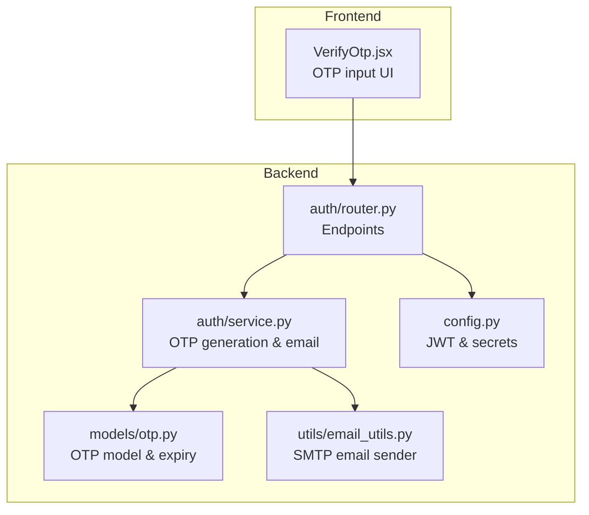
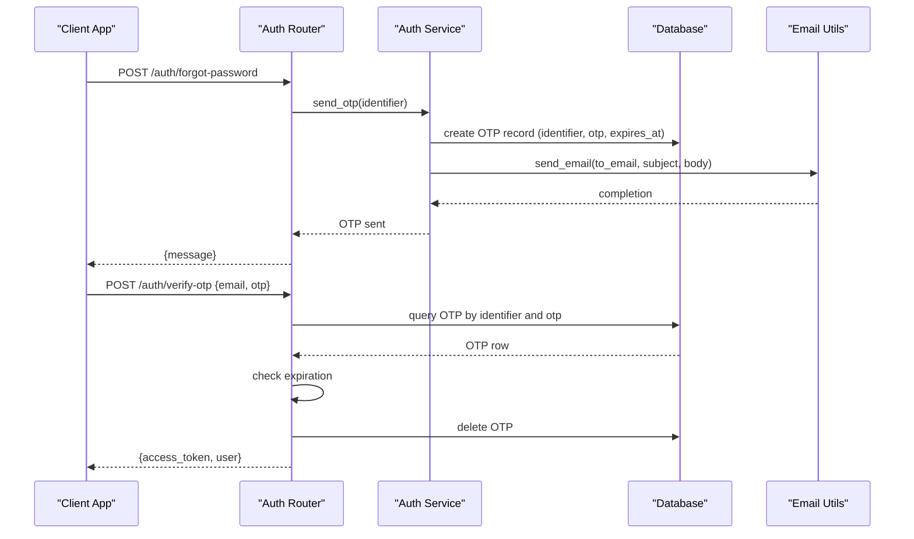
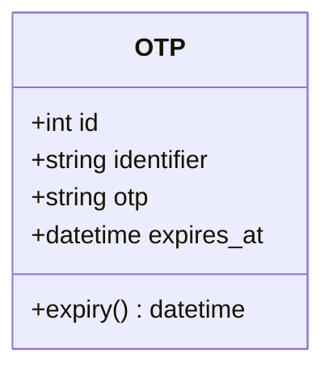
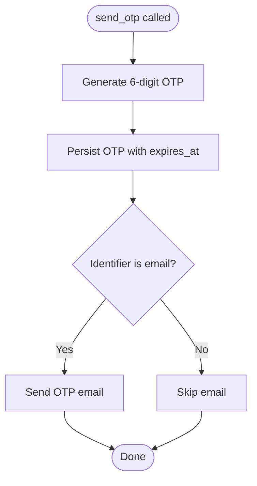
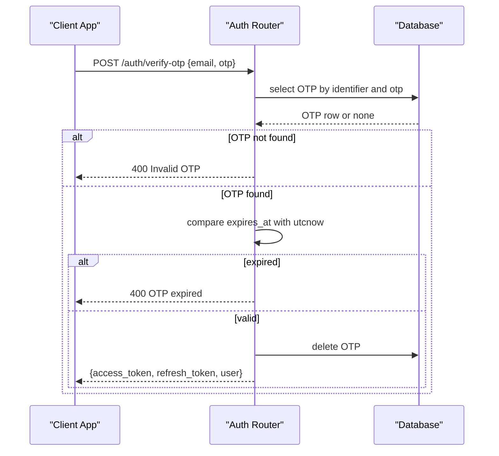
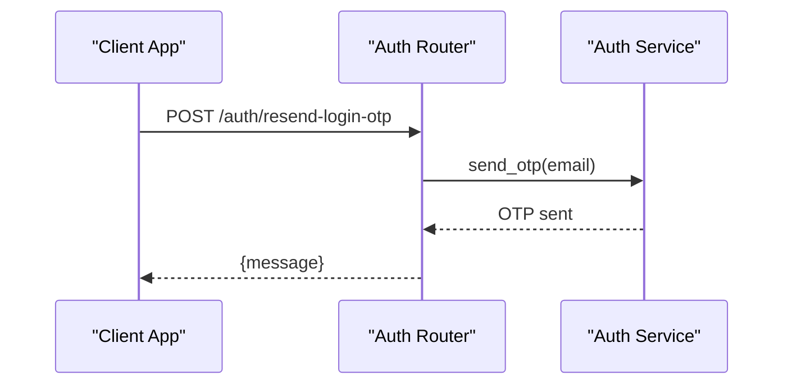
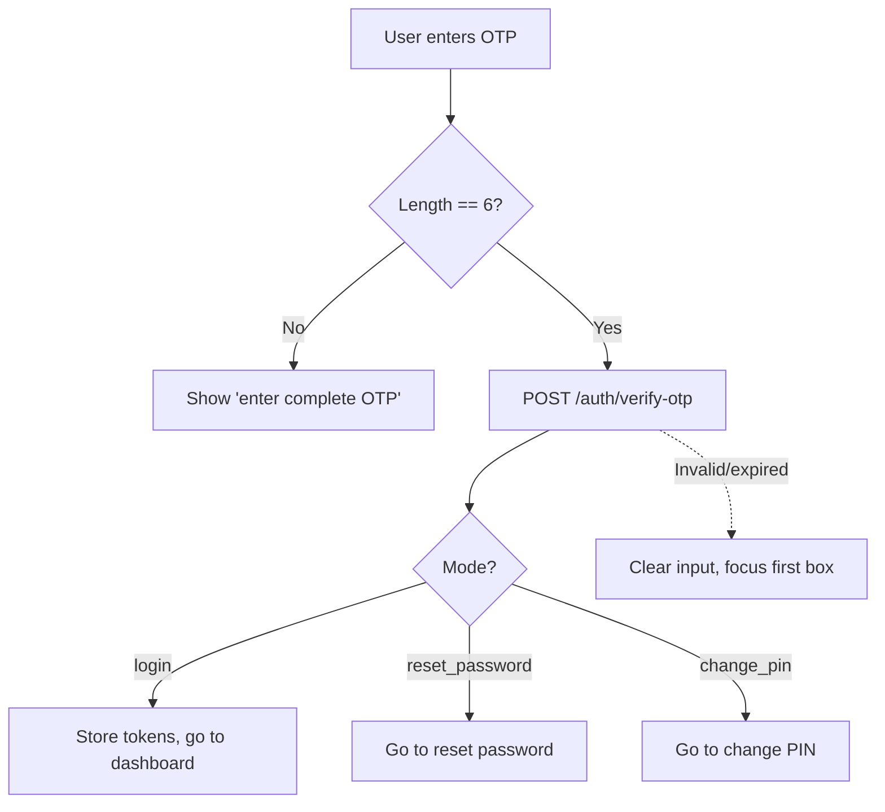
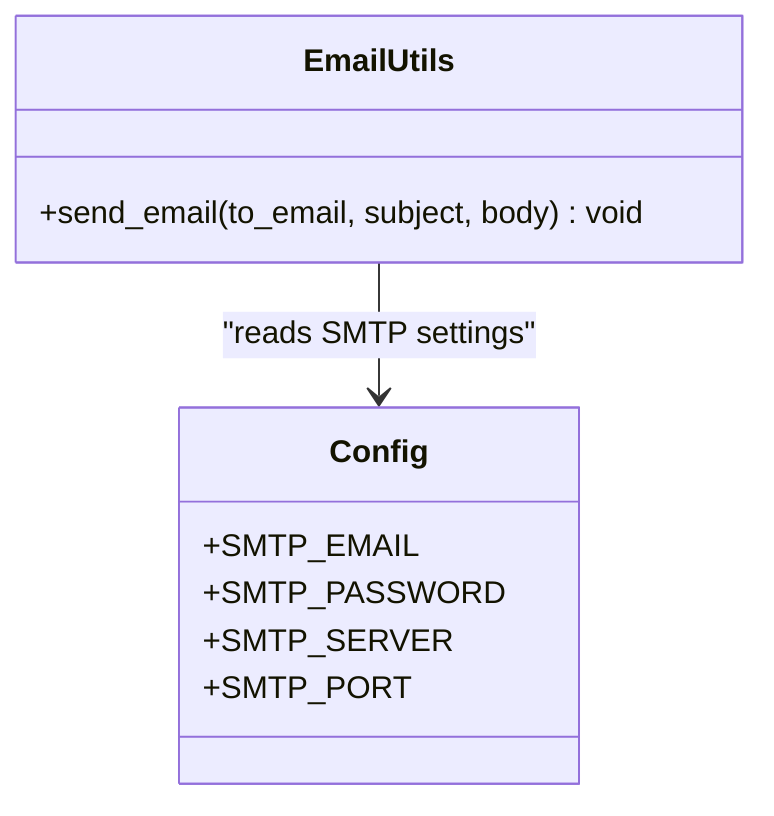
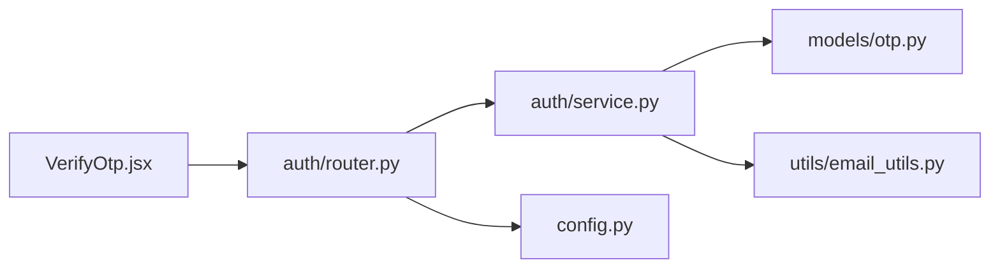

# OTP Verification System

<cite>
**Referenced Files in This Document**
- [otp.py](file://backend/app/models/otp.py)
- [service.py](file://backend/app/auth/service.py)
- [router.py](file://backend/app/auth/router.py)
- [email_utils.py](file://backend/app/utils/email_utils.py)
- [email_service.py](file://backend/app/utils/email_service.py)
- [VerifyOtp.jsx](file://frontend/src/pages/user/VerifyOtp.jsx)
- [auth_schema.py](file://backend/app/schemas/auth_schema.py)
- [config.py](file://backend/app/config.py)
- [database-schema.md](file://docs/database-schema.md)
</cite>

## Table of Contents
1. [Introduction](#introduction)
2. [Project Structure](#project-structure)
3. [Core Components](#core-components)
4. [Architecture Overview](#architecture-overview)
5. [Detailed Component Analysis](#detailed-component-analysis)
6. [Dependency Analysis](#dependency-analysis)
7. [Performance Considerations](#performance-considerations)
8. [Troubleshooting Guide](#troubleshooting-guide)
9. [Conclusion](#conclusion)

## Introduction
This document provides comprehensive documentation for the OTP (One-Time Password) verification system used in the Modern Digital Banking Dashboard. It covers OTP generation, email delivery, validation, lifecycle management, and security measures. It also explains integration with email services, OTP verification workflows for login, password reset, and PIN change scenarios, and outlines storage, retrieval, deletion, error handling, and user experience considerations.

## Project Structure
The OTP system spans backend Python services and frontend React components:
- Backend models define OTP persistence and expiration.
- Backend services generate OTPs, send emails, and coordinate verification.
- Backend routers expose endpoints for OTP generation, verification, and resend operations.
- Frontend components manage OTP input, validation, resend timers, and navigation after successful verification.
- Email utilities encapsulate SMTP transport and error handling.
- Configuration centralizes secrets and token lifetimes.

**Diagram sources**
- [router.py:1-180](file://backend/app/auth/router.py#L1-L180)
- [service.py:1-225](file://backend/app/auth/service.py#L1-L225)
- [otp.py:1-16](file://backend/app/models/otp.py#L1-L16)
- [email_utils.py:1-34](file://backend/app/utils/email_utils.py#L1-L34)
- [config.py:1-72](file://backend/app/config.py#L1-L72)

**Section sources**
- [router.py:1-180](file://backend/app/auth/router.py#L1-L180)
- [service.py:1-225](file://backend/app/auth/service.py#L1-L225)
- [otp.py:1-16](file://backend/app/models/otp.py#L1-L16)
- [email_utils.py:1-34](file://backend/app/utils/email_utils.py#L1-L34)
- [config.py:1-72](file://backend/app/config.py#L1-L72)

## Core Components
- OTP Model: Defines the OTP entity with identifier, OTP value, and expiration timestamp. Expiration is computed as two minutes from UTC now.
- OTP Generation Service: Generates a 6-digit numeric OTP, persists it, and sends an email when the identifier is an email address.
- Authentication Router: Provides endpoints for login, OTP verification, and resending OTPs for login and PIN change.
- Email Utilities: Sends HTML/plain emails via SMTP with graceful failure handling.
- Frontend OTP Verification Page: Handles user input, resend timer, and navigation based on verification mode.

Key implementation references:
- OTP model and expiry: [otp.py:5-15](file://backend/app/models/otp.py#L5-L15)
- OTP generation and email dispatch: [service.py:136-158](file://backend/app/auth/service.py#L136-L158)
- OTP verification endpoint: [router.py:146-164](file://backend/app/auth/router.py#L146-L164)
- Resend endpoints: [router.py:166-179](file://backend/app/auth/router.py#L166-L179)
- Email sending utility: [email_utils.py:12-34](file://backend/app/utils/email_utils.py#L12-L34)
- Frontend OTP page: [VerifyOtp.jsx:1-244](file://frontend/src/pages/user/VerifyOtp.jsx#L1-L244)

**Section sources**
- [otp.py:1-16](file://backend/app/models/otp.py#L1-L16)
- [service.py:136-158](file://backend/app/auth/service.py#L136-L158)
- [router.py:146-179](file://backend/app/auth/router.py#L146-L179)
- [email_utils.py:12-34](file://backend/app/utils/email_utils.py#L12-L34)
- [VerifyOtp.jsx:1-244](file://frontend/src/pages/user/VerifyOtp.jsx#L1-L244)

## Architecture Overview
The OTP system follows a request-response pattern:
- Client triggers OTP generation or verification via backend endpoints.
- Backend generates a cryptographically pseudo-random 6-digit OTP and stores it with an expiration timestamp.
- If the identifier is an email, an email is sent containing the OTP.
- Client verifies OTP via the verification endpoint, which validates OTP and expiration, deletes the OTP record, and issues JWT tokens.

**Diagram sources**
- [router.py:141-164](file://backend/app/auth/router.py#L141-L164)
- [service.py:140-158](file://backend/app/auth/service.py#L140-L158)
- [otp.py:13-15](file://backend/app/models/otp.py#L13-L15)
- [email_utils.py:12-34](file://backend/app/utils/email_utils.py#L12-L34)

## Detailed Component Analysis

### OTP Model and Lifecycle
- Persistence: OTP records are stored with identifier (email or phone), OTP value, and expiration timestamp.
- Expiration Policy: OTP expires two minutes after creation.
- Cleanup: On successful verification, the OTP record is deleted immediately.

**Diagram sources**
- [otp.py:5-15](file://backend/app/models/otp.py#L5-L15)

**Section sources**
- [otp.py:1-16](file://backend/app/models/otp.py#L1-L16)

### OTP Generation and Delivery
- Generation Algorithm: 6-digit numeric OTP generated using a pseudo-random integer within a fixed range.
- Storage: OTP saved to the database with an expiration timestamp.
- Delivery: When identifier is an email, an email is sent with the OTP and a validity notice.

**Diagram sources**
- [service.py:136-158](file://backend/app/auth/service.py#L136-L158)
- [otp.py:13-15](file://backend/app/models/otp.py#L13-L15)
- [email_utils.py:12-34](file://backend/app/utils/email_utils.py#L12-L34)

**Section sources**
- [service.py:136-158](file://backend/app/auth/service.py#L136-L158)
- [email_utils.py:12-34](file://backend/app/utils/email_utils.py#L12-L34)

### OTP Validation Workflow
- Endpoint: POST /auth/verify-otp validates OTP and checks expiration.
- Validation Steps:
  - Find OTP by identifier and OTP value.
  - Ensure OTP is not expired.
  - Retrieve associated user.
  - Delete OTP record.
  - Issue JWT access and refresh tokens.

**Diagram sources**
- [router.py:146-164](file://backend/app/auth/router.py#L146-L164)
- [otp.py:13-15](file://backend/app/models/otp.py#L13-L15)

**Section sources**
- [router.py:146-164](file://backend/app/auth/router.py#L146-L164)

### Resend OTP Mechanisms
- Endpoints:
  - POST /auth/resend-login-otp: Resends OTP for login.
  - POST /auth/resend-pin-otp: Resends OTP for PIN change.
- Behavior: Calls the OTP generation routine and returns a success message.

**Diagram sources**
- [router.py:166-179](file://backend/app/auth/router.py#L166-L179)
- [service.py:140-158](file://backend/app/auth/service.py#L140-L158)

**Section sources**
- [router.py:166-179](file://backend/app/auth/router.py#L166-L179)
- [service.py:140-158](file://backend/app/auth/service.py#L140-L158)

### Frontend OTP Verification Experience
- Input Handling: Six-digit OTP input with individual boxes, paste support, and backspace navigation.
- Timer: Resend timer with countdown.
- Modes: Supports login, password reset, and PIN change modes with appropriate navigation after verification.
- Error Handling: Displays invalid/expired OTP messages and resets input.

**Diagram sources**
- [VerifyOtp.jsx:77-124](file://frontend/src/pages/user/VerifyOtp.jsx#L77-L124)

**Section sources**
- [VerifyOtp.jsx:1-244](file://frontend/src/pages/user/VerifyOtp.jsx#L1-L244)

### Email Delivery Integration
- SMTP Transport: Uses TLS-enabled SMTP with environment-configured credentials.
- Graceful Failure: Missing credentials or transport errors do not break the auth flow; logs warnings.
- Templates: OTP emails include the OTP and validity notice.

**Diagram sources**
- [email_utils.py:12-34](file://backend/app/utils/email_utils.py#L12-L34)
- [config.py:57-72](file://backend/app/config.py#L57-L72)

**Section sources**
- [email_utils.py:1-34](file://backend/app/utils/email_utils.py#L1-L34)
- [config.py:1-72](file://backend/app/config.py#L1-L72)

### Security Measures
- OTP Entropy: 6-digit numeric OTP provides 10^6 possibilities; acceptable for low-to-medium risk scenarios.
- Expiration: OTPs expire after two minutes to minimize exposure windows.
- Token Issuance: Successful verification issues JWT access and refresh tokens; refresh cookie is configurable for secure attributes.
- Email Delivery Safety: Email failures are logged and ignored to avoid blocking authentication.
- Rate Limiting: No explicit backend rate limiting is present in the analyzed code; consider implementing rate limiting at the router level for OTP resend endpoints.

[No sources needed since this section provides general guidance]

## Dependency Analysis
- Backend dependencies:
  - Auth router depends on auth service for OTP generation and JWT utilities for token issuance.
  - Auth service depends on OTP model for persistence and email utilities for delivery.
  - Email utilities depend on configuration for SMTP credentials.
- Frontend dependencies:
  - OTP verification page depends on API endpoints and navigational routes.

**Diagram sources**
- [VerifyOtp.jsx:1-244](file://frontend/src/pages/user/VerifyOtp.jsx#L1-L244)
- [router.py:1-180](file://backend/app/auth/router.py#L1-L180)
- [service.py:1-225](file://backend/app/auth/service.py#L1-L225)
- [otp.py:1-16](file://backend/app/models/otp.py#L1-L16)
- [email_utils.py:1-34](file://backend/app/utils/email_utils.py#L1-L34)
- [config.py:1-72](file://backend/app/config.py#L1-L72)

**Section sources**
- [router.py:1-180](file://backend/app/auth/router.py#L1-L180)
- [service.py:1-225](file://backend/app/auth/service.py#L1-L225)
- [otp.py:1-16](file://backend/app/models/otp.py#L1-L16)
- [email_utils.py:1-34](file://backend/app/utils/email_utils.py#L1-L34)
- [config.py:1-72](file://backend/app/config.py#L1-L72)

## Performance Considerations
- Database Indexing: The OTP model defines an index on identifier, which helps speed up lookup by email/phone during verification.
- Email Delivery: SMTP operations are synchronous and may block briefly; consider offloading to a task queue for high throughput.
- Token Lifetimes: Access and refresh token durations are configured centrally; tune for security and UX balance.
- Frontend Responsiveness: OTP input handling and resend timers are client-side; ensure minimal re-renders and efficient state updates.

**Section sources**
- [otp.py:8-11](file://backend/app/models/otp.py#L8-L11)
- [config.py:57-72](file://backend/app/config.py#L57-L72)

## Troubleshooting Guide
Common issues and resolutions:
- Invalid OTP:
  - Cause: Incorrect OTP or mismatched identifier.
  - Resolution: Prompt user to re-enter OTP; optionally enable resend.
  - Reference: [router.py:149-150](file://backend/app/auth/router.py#L149-L150)
- Expired OTP:
  - Cause: OTP older than two minutes.
  - Resolution: Advise user to request a new OTP; resend endpoint available.
  - Reference: [router.py:152-153](file://backend/app/auth/router.py#L152-L153)
- Email Delivery Failures:
  - Cause: Missing SMTP credentials or network issues.
  - Resolution: Check environment variables; verify SMTP settings; failures are logged but ignored.
  - Reference: [email_utils.py:12-34](file://backend/app/utils/email_utils.py#L12-L34)
- Resend OTP Issues:
  - Cause: Network errors or backend exceptions.
  - Resolution: Show user-friendly error and allow retry; resend endpoints supported.
  - Reference: [router.py:166-179](file://backend/app/auth/router.py#L166-L179)
- Frontend Input Problems:
  - Cause: Partial OTP entry or paste errors.
  - Resolution: Validate length before submission; handle paste and backspace navigation.
  - Reference: [VerifyOtp.jsx:77-124](file://frontend/src/pages/user/VerifyOtp.jsx#L77-L124)

**Section sources**
- [router.py:146-179](file://backend/app/auth/router.py#L146-L179)
- [email_utils.py:12-34](file://backend/app/utils/email_utils.py#L12-L34)
- [VerifyOtp.jsx:77-124](file://frontend/src/pages/user/VerifyOtp.jsx#L77-L124)

## Conclusion
The OTP system provides a straightforward, two-minute TTL, 6-digit numeric OTP with email delivery for email identifiers. It integrates cleanly with JWT-based authentication, offers resend capabilities, and maintains a resilient email delivery mechanism. For production hardening, consider adding rate limiting, stronger OTP entropy, and robust audit logging around OTP generation and verification events.