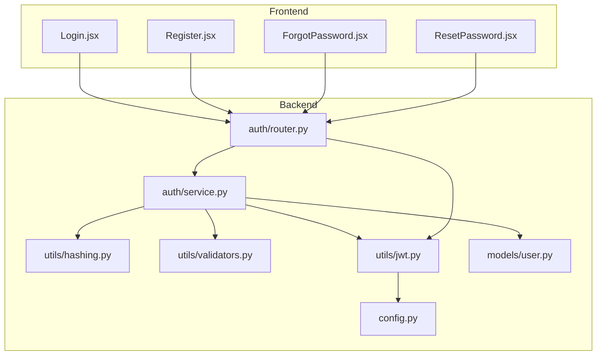
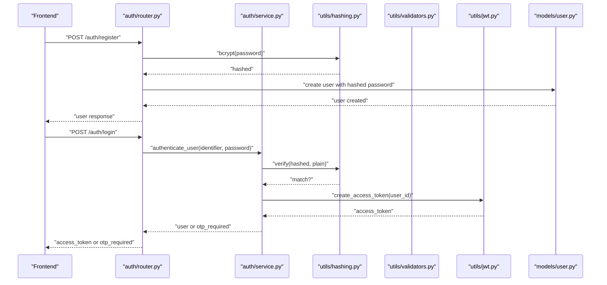
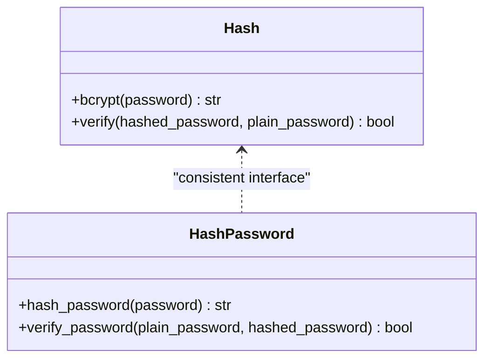
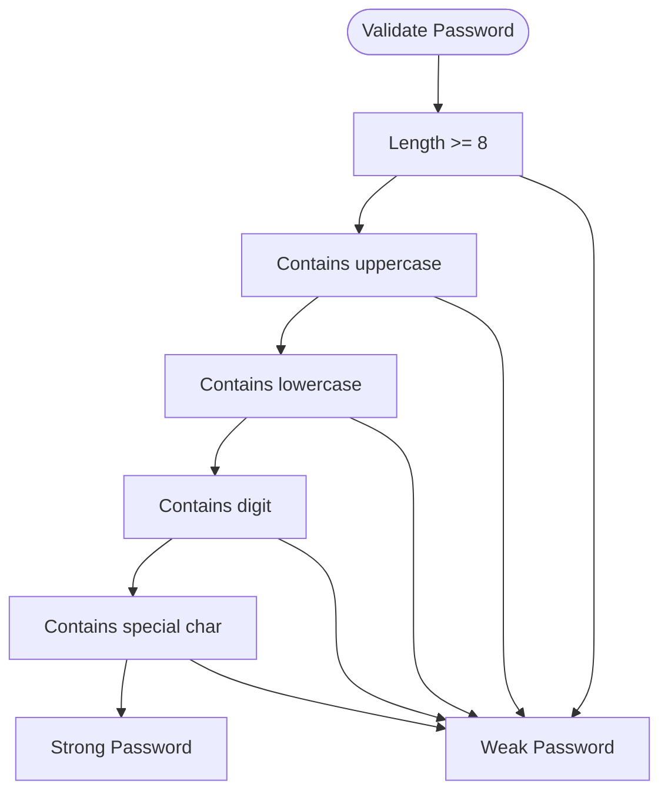
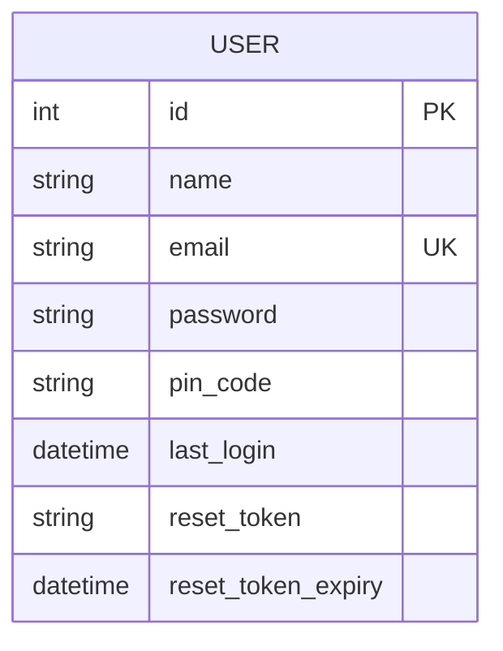
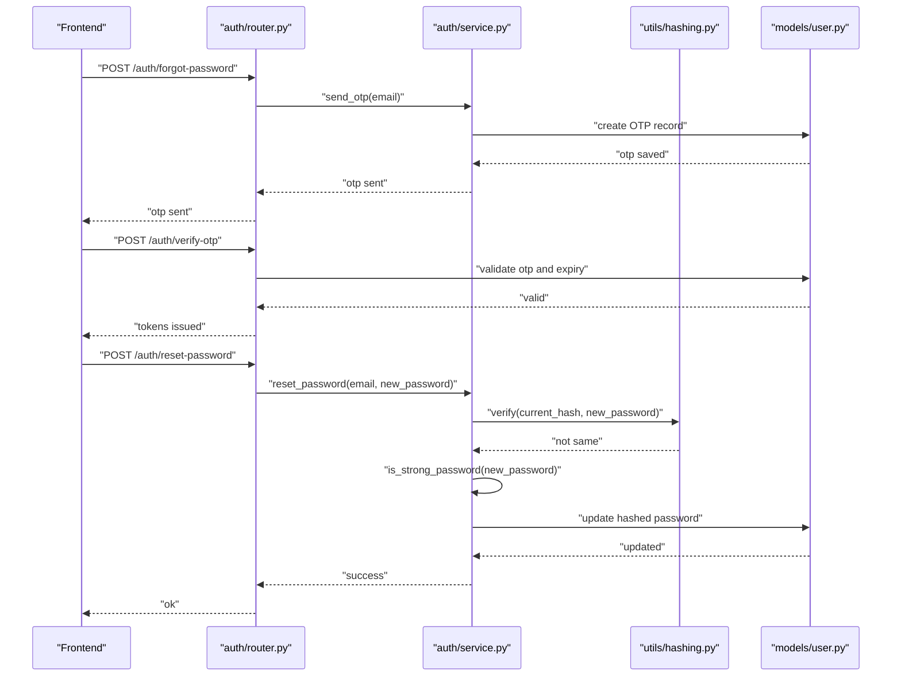
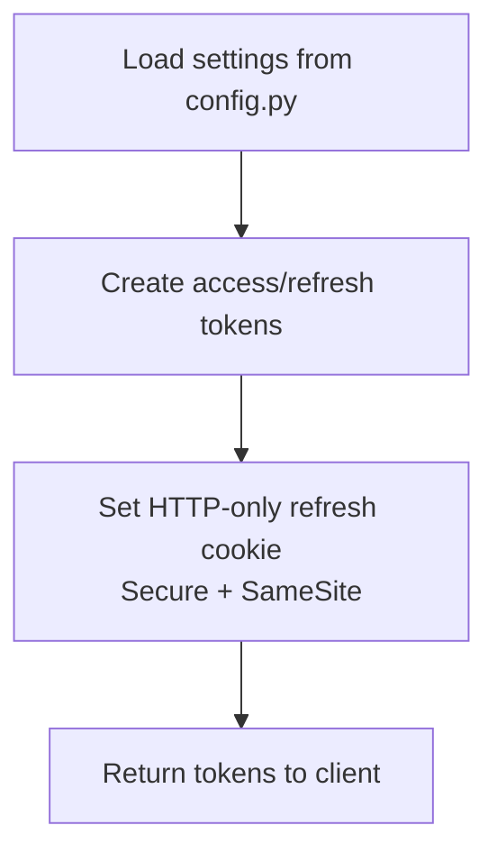
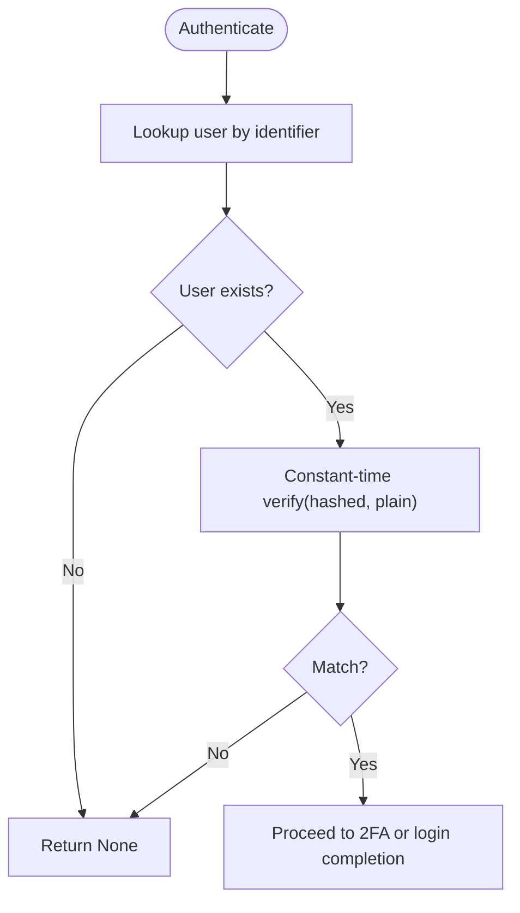
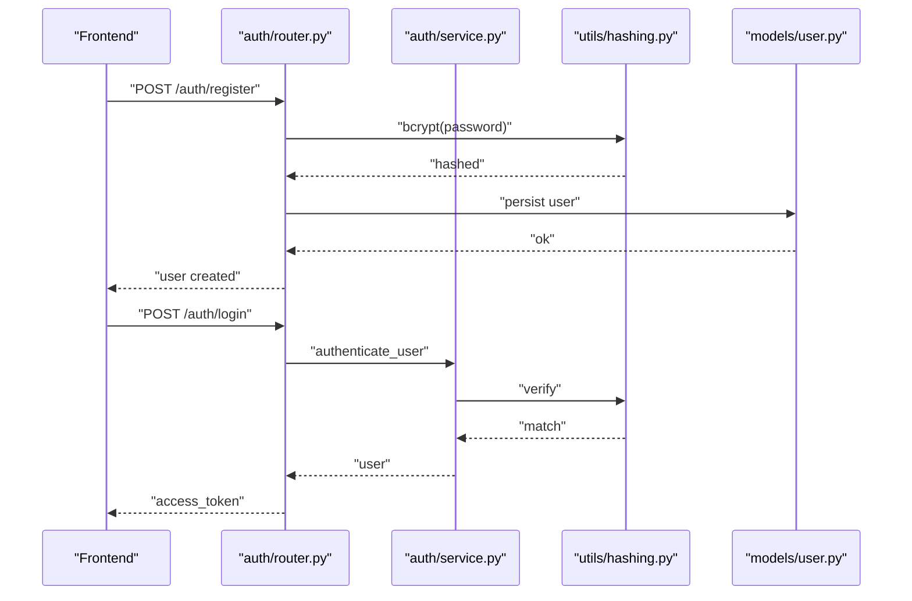
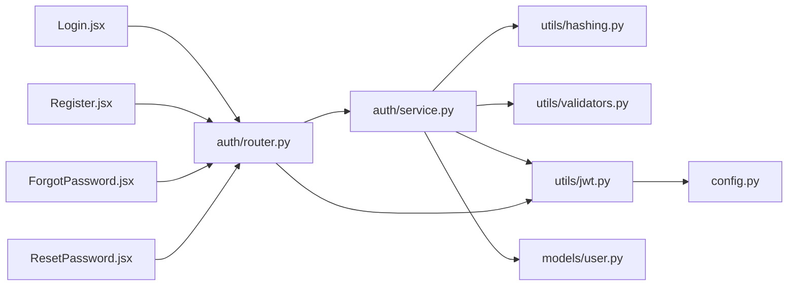

# Password Security & Hashing

<cite>
**Referenced Files in This Document**
- [hash_password.py](file://backend/app/utils/hash_password.py)
- [hashing.py](file://backend/app/utils/hashing.py)
- [validators.py](file://backend/app/utils/validators.py)
- [auth_service.py](file://backend/app/auth/service.py)
- [auth_router.py](file://backend/app/auth/router.py)
- [user_model.py](file://backend/app/models/user.py)
- [jwt.py](file://backend/app/utils/jwt.py)
- [jwt_handler.py](file://backend/app/utils/jwt_handler.py)
- [config.py](file://backend/app/config.py)
- [Login.jsx](file://frontend/src/pages/user/Login.jsx)
- [Register.jsx](file://frontend/src/pages/user/Register.jsx)
- [ForgotPassword.jsx](file://frontend/src/pages/user/ForgotPassword.jsx)
- [ResetPassword.jsx](file://frontend/src/pages/user/ResetPassword.jsx)
</cite>

## Table of Contents
1. [Introduction](#introduction)
2. [Project Structure](#project-structure)
3. [Core Components](#core-components)
4. [Architecture Overview](#architecture-overview)
5. [Detailed Component Analysis](#detailed-component-analysis)
6. [Dependency Analysis](#dependency-analysis)
7. [Performance Considerations](#performance-considerations)
8. [Troubleshooting Guide](#troubleshooting-guide)
9. [Conclusion](#conclusion)
10. [Appendices](#appendices)

## Introduction
This document provides comprehensive guidance on password security and hashing practices implemented in the Modern Digital Banking Dashboard. It covers bcrypt-based password hashing, password validation rules, secure storage, password reset workflows, secure transmission practices, timing attack protections, and best practices for policy enforcement, account lockout, and breach detection. The goal is to help developers and stakeholders understand how passwords are handled end-to-end and how to maintain robust security for financial applications.

## Project Structure
The password security implementation spans backend utilities, authentication services, routers, models, and frontend pages. The backend uses bcrypt via passlib for hashing and verification, enforces strong password policies, and integrates with JWT for session tokens. The frontend validates user inputs and communicates securely with backend endpoints.

**Diagram sources**
- [auth_router.py:1-180](file://backend/app/auth/router.py#L1-L180)
- [auth_service.py:1-225](file://backend/app/auth/service.py#L1-L225)
- [hashing.py:1-13](file://backend/app/utils/hashing.py#L1-L13)
- [validators.py:1-47](file://backend/app/utils/validators.py#L1-L47)
- [jwt.py:1-26](file://backend/app/utils/jwt.py#L1-L26)
- [config.py:1-72](file://backend/app/config.py#L1-L72)
- [user_model.py:1-65](file://backend/app/models/user.py#L1-L65)
- [Login.jsx:1-369](file://frontend/src/pages/user/Login.jsx#L1-L369)
- [Register.jsx:1-485](file://frontend/src/pages/user/Register.jsx#L1-L485)
- [ForgotPassword.jsx:1-179](file://frontend/src/pages/user/ForgotPassword.jsx#L1-L179)
- [ResetPassword.jsx:1-179](file://frontend/src/pages/user/ResetPassword.jsx#L1-L179)

**Section sources**
- [auth_router.py:1-180](file://backend/app/auth/router.py#L1-L180)
- [auth_service.py:1-225](file://backend/app/auth/service.py#L1-L225)
- [hashing.py:1-13](file://backend/app/utils/hashing.py#L1-L13)
- [validators.py:1-47](file://backend/app/utils/validators.py#L1-L47)
- [jwt.py:1-26](file://backend/app/utils/jwt.py#L1-L26)
- [config.py:1-72](file://backend/app/config.py#L1-L72)
- [user_model.py:1-65](file://backend/app/models/user.py#L1-L65)
- [Login.jsx:1-369](file://frontend/src/pages/user/Login.jsx#L1-L369)
- [Register.jsx:1-485](file://frontend/src/pages/user/Register.jsx#L1-L485)
- [ForgotPassword.jsx:1-179](file://frontend/src/pages/user/ForgotPassword.jsx#L1-L179)
- [ResetPassword.jsx:1-179](file://frontend/src/pages/user/ResetPassword.jsx#L1-L179)

## Core Components
- Password hashing and verification:
  - bcrypt hashing via passlib CryptContext.
  - Centralized hashing utilities for consistent hashing and verification.
- Password validation:
  - Regex-based strength checks enforcing minimum length and inclusion of uppercase, lowercase, digit, and special character.
- Authentication service:
  - User creation with hashed passwords.
  - Authentication with constant-time verification.
  - Password reset with policy enforcement and strong password validation.
- JWT tokenization:
  - Access and refresh tokens with configurable expiry and secure cookie settings.
- Frontend integration:
  - Real-time client-side validation aligned with backend rules.
  - Secure submission flows for registration, login, forgot password, and reset password.

**Section sources**
- [hash_password.py:1-10](file://backend/app/utils/hash_password.py#L1-L10)
- [hashing.py:1-13](file://backend/app/utils/hashing.py#L1-L13)
- [validators.py:23-36](file://backend/app/utils/validators.py#L23-L36)
- [auth_service.py:35-41](file://backend/app/auth/service.py#L35-L41)
- [auth_service.py:114-133](file://backend/app/auth/service.py#L114-L133)
- [jwt.py:6-19](file://backend/app/utils/jwt.py#L6-L19)
- [config.py:57-72](file://backend/app/config.py#L57-L72)
- [Register.jsx:67-87](file://frontend/src/pages/user/Register.jsx#L67-L87)
- [Login.jsx:67-129](file://frontend/src/pages/user/Login.jsx#L67-L129)

## Architecture Overview
The system follows a layered architecture:
- Frontend pages collect user input and submit requests to backend routers.
- Routers delegate to authentication services for business logic.
- Services use hashing utilities for password operations and validators for policy checks.
- JWT utilities manage token lifecycle and security.
- Models persist user data, including hashed passwords.

**Diagram sources**
- [auth_router.py:75-119](file://backend/app/auth/router.py#L75-L119)
- [auth_service.py:205-224](file://backend/app/auth/service.py#L205-L224)
- [hashing.py:5-12](file://backend/app/utils/hashing.py#L5-L12)
- [jwt.py:11-19](file://backend/app/utils/jwt.py#L11-L19)
- [user_model.py:37-65](file://backend/app/models/user.py#L37-L65)

## Detailed Component Analysis

### Password Hashing Implementation
- bcrypt scheme with passlib CryptContext ensures adaptive hashing and automatic salt handling.
- Hash utilities provide centralized hashing and verification methods used consistently across services and routers.
- Iteration counts are managed by passlib/bcrypt; salts are generated automatically per password.

**Diagram sources**
- [hashing.py:5-12](file://backend/app/utils/hashing.py#L5-L12)
- [hash_password.py:5-9](file://backend/app/utils/hash_password.py#L5-L9)

Security considerations:
- Automatic salt generation prevents rainbow table attacks.
- bcrypt’s computational cost is tuned by passlib; no manual iteration count configuration is exposed in code, reducing risk of weak configurations.

**Section sources**
- [hashing.py:1-13](file://backend/app/utils/hashing.py#L1-L13)
- [hash_password.py:1-10](file://backend/app/utils/hash_password.py#L1-L10)

### Password Validation Rules
- Backend enforces a strong password policy using a compiled regex requiring:
  - Minimum length of 8 characters.
  - At least one uppercase letter.
  - At least one lowercase letter.
  - At least one digit.
  - At least one special character.
- Frontend mirrors these rules for immediate feedback during registration.

**Diagram sources**
- [validators.py:23-36](file://backend/app/utils/validators.py#L23-L36)
- [Register.jsx:67-87](file://frontend/src/pages/user/Register.jsx#L67-L87)

**Section sources**
- [validators.py:23-36](file://backend/app/utils/validators.py#L23-L36)
- [Register.jsx:67-87](file://frontend/src/pages/user/Register.jsx#L67-L87)

### Secure Password Storage Practices
- Users’ passwords are stored as bcrypt hashes, never in plaintext.
- The user model defines the password field as a string suitable for bcrypt output.
- PINs are also hashed using bcrypt in related scripts, ensuring consistent protection.

**Diagram sources**
- [user_model.py:37-65](file://backend/app/models/user.py#L37-L65)

**Section sources**
- [user_model.py:37-65](file://backend/app/models/user.py#L37-L65)
- [hashing.py:7-8](file://backend/app/utils/hashing.py#L7-L8)

### Password Reset Workflow
- Forgot password triggers OTP generation and delivery.
- Verification endpoint checks OTP validity and expiration.
- Reset endpoint enforces:
  - New password must differ from the current hashed password.
  - New password must satisfy the strong password policy.
  - On success, updates the user’s password with a new bcrypt hash.

**Diagram sources**
- [auth_router.py:141-163](file://backend/app/auth/router.py#L141-L163)
- [auth_service.py:114-133](file://backend/app/auth/service.py#L114-L133)
- [hashing.py:11-12](file://backend/app/utils/hashing.py#L11-L12)
- [validators.py:27-36](file://backend/app/utils/validators.py#L27-L36)

**Section sources**
- [auth_router.py:141-163](file://backend/app/auth/router.py#L141-L163)
- [auth_service.py:114-133](file://backend/app/auth/service.py#L114-L133)
- [validators.py:27-36](file://backend/app/utils/validators.py#L27-L36)

### Secure Transmission Practices
- JWT access tokens are signed with HS256 using secrets from environment configuration.
- Refresh tokens are issued as HTTP-only cookies with configurable SameSite and Secure attributes based on environment variables.
- Cookie security is controlled via environment variables for production hardening.

**Diagram sources**
- [jwt.py:6-19](file://backend/app/utils/jwt.py#L6-L19)
- [auth_router.py:24-31](file://backend/app/auth/router.py#L24-L31)
- [config.py:57-72](file://backend/app/config.py#L57-L72)

**Section sources**
- [jwt.py:1-26](file://backend/app/utils/jwt.py#L1-L26)
- [auth_router.py:24-31](file://backend/app/auth/router.py#L24-L31)
- [config.py:57-72](file://backend/app/config.py#L57-L72)

### Timing Attack Protection
- Password verification uses a constant-time comparison via passlib’s verify method, mitigating timing attacks.
- Authentication flow short-circuits on missing credentials and invalid combinations to minimize observable differences.

**Diagram sources**
- [auth_service.py:205-224](file://backend/app/auth/service.py#L205-L224)
- [hashing.py:11-12](file://backend/app/utils/hashing.py#L11-L12)

**Section sources**
- [auth_service.py:205-224](file://backend/app/auth/service.py#L205-L224)
- [hashing.py:11-12](file://backend/app/utils/hashing.py#L11-L12)

### Best Practices for Policy Enforcement, Lockout, and Breach Detection
- Policy enforcement:
  - Enforce strong password policy at registration and reset.
  - Reject new passwords identical to the current hashed password.
- Account lockout:
  - Not implemented in the current codebase; consider adding login attempt limits and temporary lockout mechanisms at the router/service layer.
- Breach detection:
  - Not implemented in the current codebase; consider integrating with a breach-checking service and alerting mechanisms upon detection.

[No sources needed since this section provides general guidance]

### Examples: Secure Handling in Registration and Authentication Flows
- Registration:
  - Frontend validates password strength and matches.
  - Backend hashes the password and persists the user record.
- Authentication:
  - Frontend submits identifier and password.
  - Backend performs constant-time verification and issues tokens on success.

**Diagram sources**
- [auth_router.py:75-119](file://backend/app/auth/router.py#L75-L119)
- [auth_service.py:205-224](file://backend/app/auth/service.py#L205-L224)
- [hashing.py:7-12](file://backend/app/utils/hashing.py#L7-L12)

**Section sources**
- [auth_router.py:75-119](file://backend/app/auth/router.py#L75-L119)
- [auth_service.py:205-224](file://backend/app/auth/service.py#L205-L224)
- [hashing.py:7-12](file://backend/app/utils/hashing.py#L7-L12)

## Dependency Analysis
The authentication stack depends on hashing utilities, validators, JWT utilities, and configuration. The frontend depends on backend endpoints and routes.

**Diagram sources**
- [auth_router.py:1-180](file://backend/app/auth/router.py#L1-L180)
- [auth_service.py:1-225](file://backend/app/auth/service.py#L1-L225)
- [hashing.py:1-13](file://backend/app/utils/hashing.py#L1-L13)
- [validators.py:1-47](file://backend/app/utils/validators.py#L1-L47)
- [jwt.py:1-26](file://backend/app/utils/jwt.py#L1-L26)
- [config.py:1-72](file://backend/app/config.py#L1-L72)
- [user_model.py:1-65](file://backend/app/models/user.py#L1-L65)
- [Login.jsx:1-369](file://frontend/src/pages/user/Login.jsx#L1-L369)
- [Register.jsx:1-485](file://frontend/src/pages/user/Register.jsx#L1-L485)
- [ForgotPassword.jsx:1-179](file://frontend/src/pages/user/ForgotPassword.jsx#L1-L179)
- [ResetPassword.jsx:1-179](file://frontend/src/pages/user/ResetPassword.jsx#L1-L179)

**Section sources**
- [auth_router.py:1-180](file://backend/app/auth/router.py#L1-L180)
- [auth_service.py:1-225](file://backend/app/auth/service.py#L1-L225)
- [hashing.py:1-13](file://backend/app/utils/hashing.py#L1-L13)
- [validators.py:1-47](file://backend/app/utils/validators.py#L1-L47)
- [jwt.py:1-26](file://backend/app/utils/jwt.py#L1-L26)
- [config.py:1-72](file://backend/app/config.py#L1-L72)
- [user_model.py:1-65](file://backend/app/models/user.py#L1-L65)
- [Login.jsx:1-369](file://frontend/src/pages/user/Login.jsx#L1-L369)
- [Register.jsx:1-485](file://frontend/src/pages/user/Register.jsx#L1-L485)
- [ForgotPassword.jsx:1-179](file://frontend/src/pages/user/ForgotPassword.jsx#L1-L179)
- [ResetPassword.jsx:1-179](file://frontend/src/pages/user/ResetPassword.jsx#L1-L179)

## Performance Considerations
- bcrypt hashing costs are managed by passlib; avoid custom tuning unless necessary.
- Constant-time verification avoids branching on failure, minimizing timing variations.
- JWT signing is lightweight; keep token payloads minimal to reduce overhead.
- Consider rate-limiting OTP requests and login attempts to mitigate brute-force risks.

[No sources needed since this section provides general guidance]

## Troubleshooting Guide
Common issues and resolutions:
- Invalid credentials:
  - Ensure both identifier and password are provided; backend raises explicit errors for missing or invalid credentials.
- Password reset failures:
  - New password must differ from the current hashed password and satisfy the strong password policy.
- OTP verification errors:
  - Confirm OTP exists, is not expired, and matches the user’s email.
- Token issuance and cookies:
  - Verify environment variables for JWT secrets and cookie security flags; ensure HTTPS in production.

**Section sources**
- [auth_router.py:64-67](file://backend/app/auth/router.py#L64-L67)
- [auth_router.py:148-153](file://backend/app/auth/router.py#L148-L153)
- [auth_service.py:120-133](file://backend/app/auth/service.py#L120-L133)
- [config.py:41-55](file://backend/app/config.py#L41-L55)

## Conclusion
The system implements robust password security using bcrypt hashing, strong password policies, constant-time verification, and secure JWT tokenization. The frontend aligns with backend validation rules to provide immediate feedback. To further strengthen security, consider adding account lockout mechanisms, breach detection integrations, and rate-limiting for authentication and OTP endpoints.

[No sources needed since this section summarizes without analyzing specific files]

## Appendices
- Environment variables and secrets:
  - JWT_SECRET_KEY and JWT_REFRESH_SECRET_KEY are loaded from environment variables with safe development fallbacks.
  - ACCESS_TOKEN_EXPIRE_MINUTES and REFRESH_TOKEN_EXPIRE_DAYS are configurable.

**Section sources**
- [config.py:41-72](file://backend/app/config.py#L41-L72)