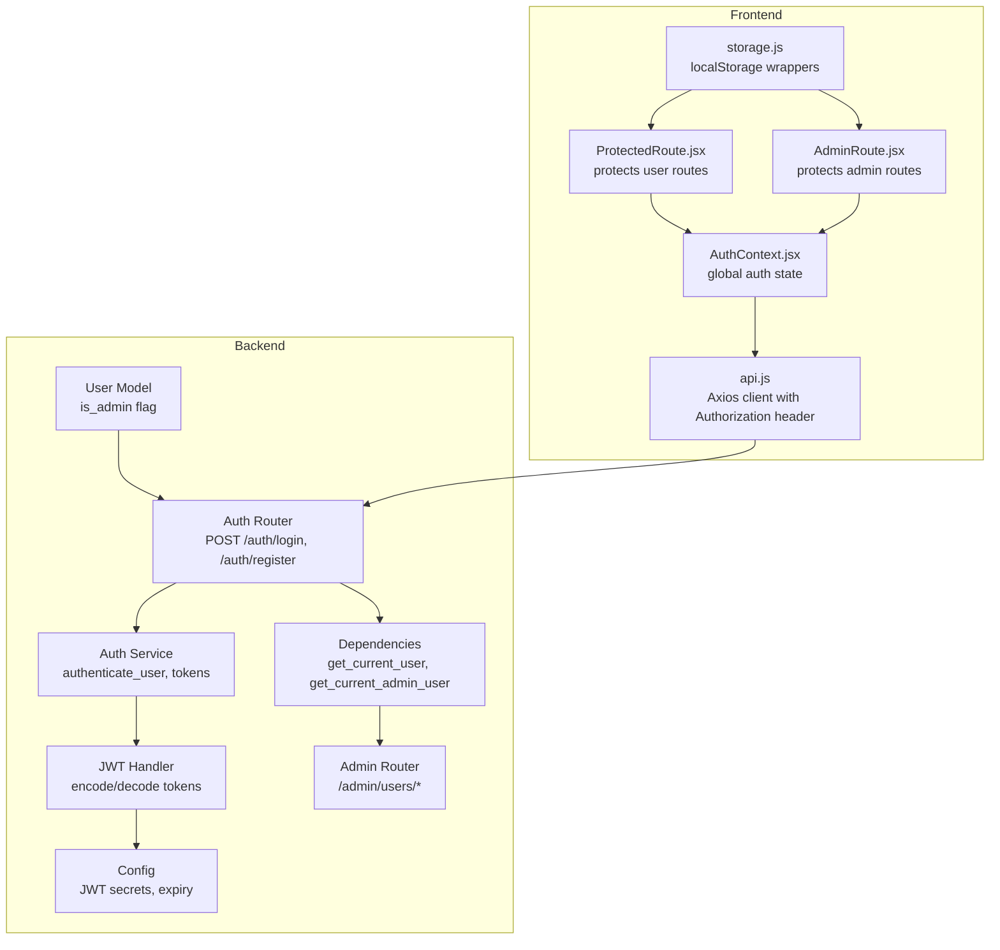
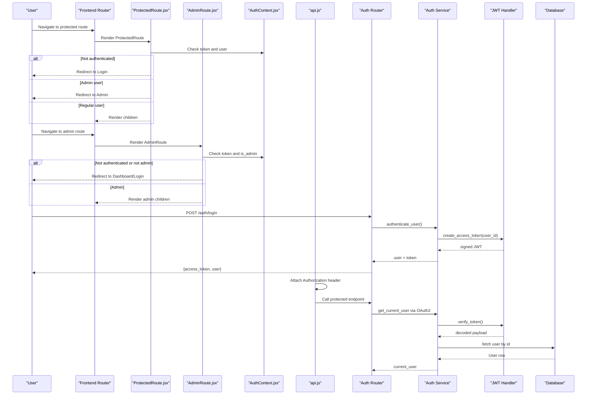
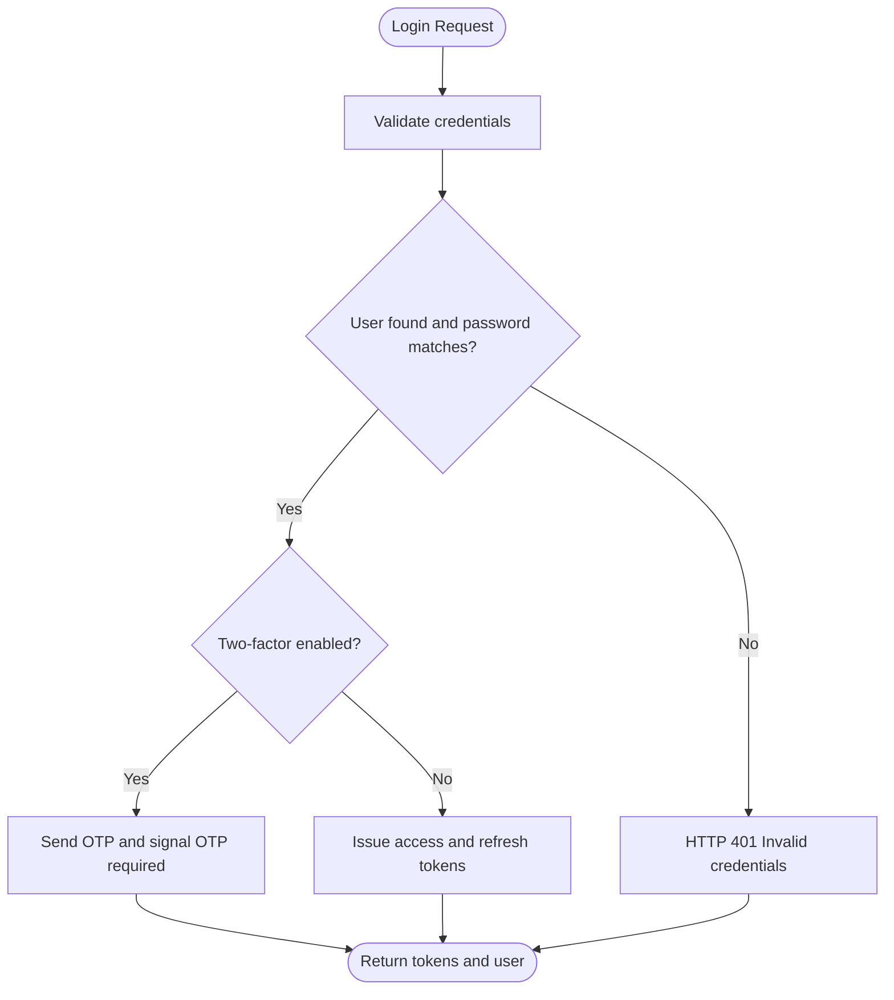
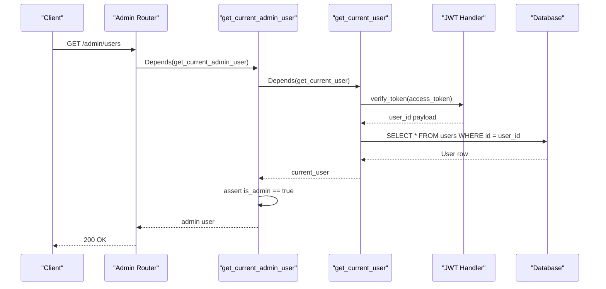
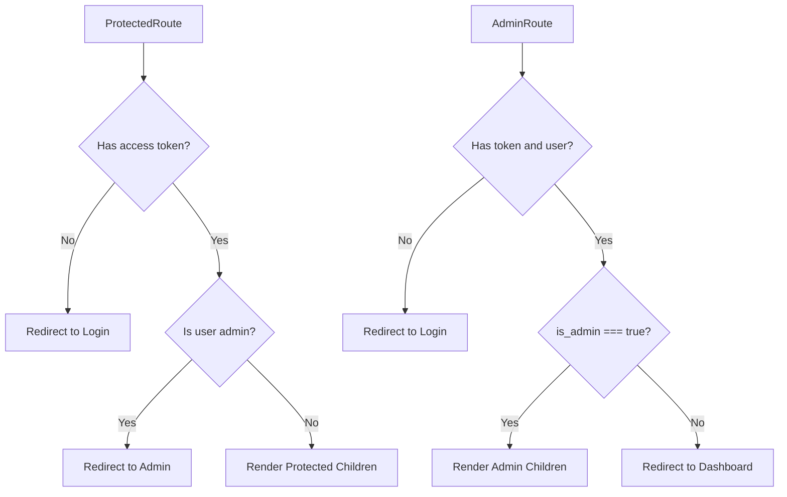
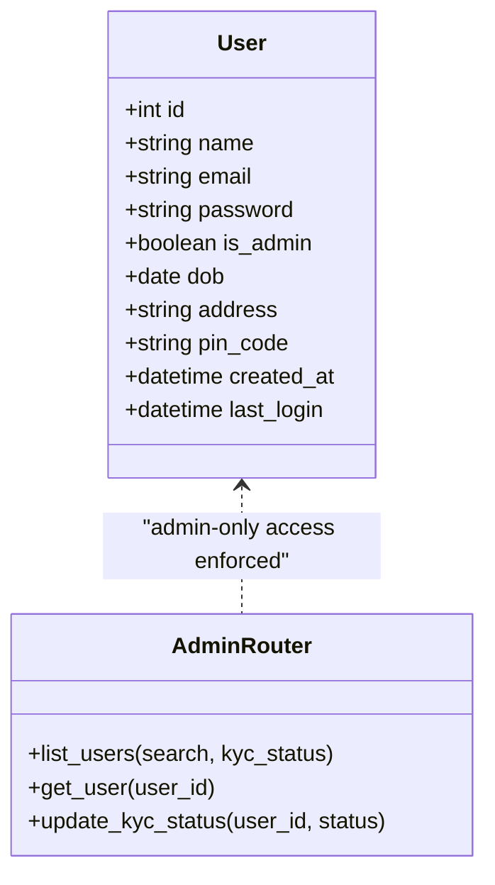
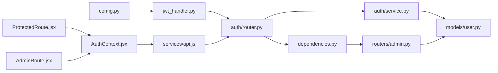

# Role-Based Access Control

<cite>
**Referenced Files in This Document**
- [backend/app/auth/service.py](file://backend/app/auth/service.py)
- [backend/app/auth/router.py](file://backend/app/auth/router.py)
- [backend/app/models/user.py](file://backend/app/models/user.py)
- [backend/app/utils/jwt_handler.py](file://backend/app/utils/jwt_handler.py)
- [backend/app/config.py](file://backend/app/config.py)
- [backend/app/dependencies.py](file://backend/app/dependencies.py)
- [backend/app/routers/admin.py](file://backend/app/routers/admin.py)
- [backend/app/utils/seed_admin.py](file://backend/app/utils/seed_admin.py)
- [backend/alembic/versions/e4b6b665cae9_add_is_admin_to_users.py](file://backend/alembic/versions/e4b6b665cae9_add_is_admin_to_users.py)
- [frontend/src/components/auth/ProtectedRoute.jsx](file://frontend/src/components/auth/ProtectedRoute.jsx)
- [frontend/src/components/auth/AdminRoute.jsx](file://frontend/src/components/auth/AdminRoute.jsx)
- [frontend/src/context/AuthContext.jsx](file://frontend/src/context/AuthContext.jsx)
- [frontend/src/services/api.js](file://frontend/src/services/api.js)
- [frontend/src/utils/storage.js](file://frontend/src/utils/storage.js)
</cite>

## Table of Contents
1. [Introduction](#introduction)
2. [Project Structure](#project-structure)
3. [Core Components](#core-components)
4. [Architecture Overview](#architecture-overview)
5. [Detailed Component Analysis](#detailed-component-analysis)
6. [Dependency Analysis](#dependency-analysis)
7. [Performance Considerations](#performance-considerations)
8. [Troubleshooting Guide](#troubleshooting-guide)
9. [Conclusion](#conclusion)

## Introduction
This document explains the role-based access control (RBAC) implementation across the Modern Digital Banking Dashboard. It covers user roles, admin privileges, authentication and authorization flows, route protection in the frontend, backend authorization middleware, and permission-based resource access. It also documents how the backend’s JWT-based authentication integrates with the frontend’s ProtectedRoute and AdminRoute components, and outlines security boundaries between user and admin functionality.

## Project Structure
Access control spans both backend and frontend:
- Backend: authentication, token generation/verification, user model with admin flag, dependency-based authorization, and admin-only routes.
- Frontend: route guards (ProtectedRoute, AdminRoute), authentication context, and API client that attaches tokens.

**Diagram sources**
- [backend/app/auth/router.py:104-119](file://backend/app/auth/router.py#L104-L119)
- [backend/app/auth/service.py:205-225](file://backend/app/auth/service.py#L205-L225)
- [backend/app/utils/jwt_handler.py:45-60](file://backend/app/utils/jwt_handler.py#L45-L60)
- [backend/app/config.py:57-72](file://backend/app/config.py#L57-L72)
- [backend/app/dependencies.py:51-68](file://backend/app/dependencies.py#L51-L68)
- [backend/app/routers/admin.py:14-44](file://backend/app/routers/admin.py#L14-L44)
- [backend/app/models/user.py:46-46](file://backend/app/models/user.py#L46-L46)
- [frontend/src/components/auth/ProtectedRoute.jsx:27-37](file://frontend/src/components/auth/ProtectedRoute.jsx#L27-L37)
- [frontend/src/components/auth/AdminRoute.jsx:12-22](file://frontend/src/components/auth/AdminRoute.jsx#L12-L22)
- [frontend/src/context/AuthContext.jsx:23-46](file://frontend/src/context/AuthContext.jsx#L23-L46)
- [frontend/src/services/api.js:19-31](file://frontend/src/services/api.js#L19-L31)
- [frontend/src/utils/storage.js:81-99](file://frontend/src/utils/storage.js#L81-L99)

**Section sources**
- [backend/app/auth/router.py:104-119](file://backend/app/auth/router.py#L104-L119)
- [backend/app/auth/service.py:205-225](file://backend/app/auth/service.py#L205-L225)
- [backend/app/utils/jwt_handler.py:45-60](file://backend/app/utils/jwt_handler.py#L45-L60)
- [backend/app/config.py:57-72](file://backend/app/config.py#L57-L72)
- [backend/app/dependencies.py:51-68](file://backend/app/dependencies.py#L51-L68)
- [backend/app/routers/admin.py:14-44](file://backend/app/routers/admin.py#L14-L44)
- [backend/app/models/user.py:46-46](file://backend/app/models/user.py#L46-L46)
- [frontend/src/components/auth/ProtectedRoute.jsx:27-37](file://frontend/src/components/auth/ProtectedRoute.jsx#L27-L37)
- [frontend/src/components/auth/AdminRoute.jsx:12-22](file://frontend/src/components/auth/AdminRoute.jsx#L12-L22)
- [frontend/src/context/AuthContext.jsx:23-46](file://frontend/src/context/AuthContext.jsx#L23-L46)
- [frontend/src/services/api.js:19-31](file://frontend/src/services/api.js#L19-L31)
- [frontend/src/utils/storage.js:81-99](file://frontend/src/utils/storage.js#L81-L99)

## Core Components
- User model with admin flag: the database stores a boolean field indicating admin privilege.
- Authentication service and router: handle registration, login, OTP flows, and token issuance.
- JWT utilities: encode/decode access and refresh tokens with configurable secrets and expiry.
- Authorization dependencies: extract and validate tokens, resolve current user, enforce admin-only access.
- Admin routes: endpoints under /admin gated by admin dependency.
- Frontend route guards: ProtectedRoute and AdminRoute enforce client-side access control.
- Auth context and API client: manage tokens and attach Authorization headers automatically.

**Section sources**
- [backend/app/models/user.py:46-46](file://backend/app/models/user.py#L46-L46)
- [backend/app/auth/router.py:75-119](file://backend/app/auth/router.py#L75-L119)
- [backend/app/auth/service.py:205-225](file://backend/app/auth/service.py#L205-L225)
- [backend/app/utils/jwt_handler.py:45-60](file://backend/app/utils/jwt_handler.py#L45-L60)
- [backend/app/dependencies.py:51-68](file://backend/app/dependencies.py#L51-L68)
- [backend/app/routers/admin.py:14-44](file://backend/app/routers/admin.py#L14-L44)
- [frontend/src/components/auth/ProtectedRoute.jsx:27-37](file://frontend/src/components/auth/ProtectedRoute.jsx#L27-L37)
- [frontend/src/components/auth/AdminRoute.jsx:12-22](file://frontend/src/components/auth/AdminRoute.jsx#L12-L22)
- [frontend/src/context/AuthContext.jsx:23-46](file://frontend/src/context/AuthContext.jsx#L23-L46)
- [frontend/src/services/api.js:19-31](file://frontend/src/services/api.js#L19-L31)

## Architecture Overview
The RBAC architecture combines backend JWT-based authentication with frontend route protection:

**Diagram sources**
- [frontend/src/components/auth/ProtectedRoute.jsx:27-37](file://frontend/src/components/auth/ProtectedRoute.jsx#L27-L37)
- [frontend/src/components/auth/AdminRoute.jsx:12-22](file://frontend/src/components/auth/AdminRoute.jsx#L12-L22)
- [frontend/src/context/AuthContext.jsx:23-46](file://frontend/src/context/AuthContext.jsx#L23-L46)
- [frontend/src/services/api.js:19-31](file://frontend/src/services/api.js#L19-L31)
- [backend/app/auth/router.py:104-119](file://backend/app/auth/router.py#L104-L119)
- [backend/app/auth/service.py:205-225](file://backend/app/auth/service.py#L205-L225)
- [backend/app/utils/jwt_handler.py:63-78](file://backend/app/utils/jwt_handler.py#L63-L78)
- [backend/app/dependencies.py:51-68](file://backend/app/dependencies.py#L51-L68)

## Detailed Component Analysis

### Backend Authentication and Token Management
- Registration and login endpoints issue access tokens and optionally refresh cookies.
- Authentication service handles password verification, optional OTP flow, and login alerts.
- JWT utilities encode/decode tokens with configurable secrets and expiry windows.
- Config centralizes JWT secrets and token lifetimes.

**Diagram sources**
- [backend/app/auth/router.py:104-119](file://backend/app/auth/router.py#L104-L119)
- [backend/app/auth/service.py:205-225](file://backend/app/auth/service.py#L205-L225)
- [backend/app/utils/jwt_handler.py:45-60](file://backend/app/utils/jwt_handler.py#L45-L60)
- [backend/app/config.py:57-72](file://backend/app/config.py#L57-L72)

**Section sources**
- [backend/app/auth/router.py:75-119](file://backend/app/auth/router.py#L75-L119)
- [backend/app/auth/service.py:205-225](file://backend/app/auth/service.py#L205-L225)
- [backend/app/utils/jwt_handler.py:45-60](file://backend/app/utils/jwt_handler.py#L45-L60)
- [backend/app/config.py:57-72](file://backend/app/config.py#L57-L72)

### Authorization Middleware and Admin Enforcement
- get_current_user validates the access token and resolves the current user.
- get_current_admin_user enforces admin-only access and raises HTTP 403 for non-admins.
- Admin routes depend on get_current_admin_user to protect endpoints.

**Diagram sources**
- [backend/app/dependencies.py:51-68](file://backend/app/dependencies.py#L51-L68)
- [backend/app/routers/admin.py:14-44](file://backend/app/routers/admin.py#L14-L44)
- [backend/app/utils/jwt_handler.py:63-78](file://backend/app/utils/jwt_handler.py#L63-L78)

**Section sources**
- [backend/app/dependencies.py:51-68](file://backend/app/dependencies.py#L51-L68)
- [backend/app/routers/admin.py:14-44](file://backend/app/routers/admin.py#L14-L44)

### Frontend Route Protection
- ProtectedRoute checks for a stored access token and user identity; redirects unauthenticated users to login and admin users to the admin area.
- AdminRoute ensures only admin users can access admin routes; otherwise redirects to dashboard or login.
- AuthContext attempts token refresh on mount and maintains auth state.
- API client attaches Authorization header automatically for all requests.

**Diagram sources**
- [frontend/src/components/auth/ProtectedRoute.jsx:27-37](file://frontend/src/components/auth/ProtectedRoute.jsx#L27-L37)
- [frontend/src/components/auth/AdminRoute.jsx:12-22](file://frontend/src/components/auth/AdminRoute.jsx#L12-L22)
- [frontend/src/context/AuthContext.jsx:23-46](file://frontend/src/context/AuthContext.jsx#L23-L46)
- [frontend/src/services/api.js:19-31](file://frontend/src/services/api.js#L19-L31)
- [frontend/src/utils/storage.js:81-99](file://frontend/src/utils/storage.js#L81-L99)

**Section sources**
- [frontend/src/components/auth/ProtectedRoute.jsx:27-37](file://frontend/src/components/auth/ProtectedRoute.jsx#L27-L37)
- [frontend/src/components/auth/AdminRoute.jsx:12-22](file://frontend/src/components/auth/AdminRoute.jsx#L12-L22)
- [frontend/src/context/AuthContext.jsx:23-46](file://frontend/src/context/AuthContext.jsx#L23-L46)
- [frontend/src/services/api.js:19-31](file://frontend/src/services/api.js#L19-L31)
- [frontend/src/utils/storage.js:81-99](file://frontend/src/utils/storage.js#L81-L99)

### Admin Role Implementation and Seed
- The User model includes an is_admin boolean flag persisted in the database.
- Admin routes are protected by get_current_admin_user.
- A seed utility creates an initial admin user from environment variables if not present.

**Diagram sources**
- [backend/app/models/user.py:37-65](file://backend/app/models/user.py#L37-L65)
- [backend/app/routers/admin.py:14-44](file://backend/app/routers/admin.py#L14-L44)
- [backend/app/dependencies.py:60-68](file://backend/app/dependencies.py#L60-L68)

**Section sources**
- [backend/app/models/user.py:46-46](file://backend/app/models/user.py#L46-L46)
- [backend/app/routers/admin.py:14-44](file://backend/app/routers/admin.py#L14-L44)
- [backend/app/dependencies.py:60-68](file://backend/app/dependencies.py#L60-L68)
- [backend/app/utils/seed_admin.py:15-45](file://backend/app/utils/seed_admin.py#L15-L45)
- [backend/alembic/versions/e4b6b665cae9_add_is_admin_to_users.py:124-126](file://backend/alembic/versions/e4b6b665cae9_add_is_admin_to_users.py#L124-L126)

### Permission-Based Resource Access
- Protected endpoints require a valid access token resolved to a user.
- Admin endpoints additionally require the user to have is_admin set to true.
- Frontend route guards prevent unauthorized navigation before requests are made.

Examples of protected endpoints:
- GET /admin/users
- GET /admin/users/{user_id}
- PATCH /admin/users/{user_id}/kyc

Role-based UI rendering:
- ProtectedRoute renders user dashboard pages only for authenticated non-admin users.
- AdminRoute renders admin pages only for admin users.

Authorization error handling:
- Backend returns HTTP 401 for invalid/missing credentials and HTTP 403 for insufficient privileges.
- Frontend redirects unauthenticated or unauthorized users to appropriate routes.

**Section sources**
- [backend/app/routers/admin.py:14-44](file://backend/app/routers/admin.py#L14-L44)
- [backend/app/dependencies.py:60-68](file://backend/app/dependencies.py#L60-L68)
- [frontend/src/components/auth/ProtectedRoute.jsx:27-37](file://frontend/src/components/auth/ProtectedRoute.jsx#L27-L37)
- [frontend/src/components/auth/AdminRoute.jsx:12-22](file://frontend/src/components/auth/AdminRoute.jsx#L12-L22)

## Dependency Analysis
The following diagram shows key dependencies among authorization components:

**Diagram sources**
- [backend/app/config.py:57-72](file://backend/app/config.py#L57-L72)
- [backend/app/utils/jwt_handler.py:45-60](file://backend/app/utils/jwt_handler.py#L45-L60)
- [backend/app/auth/router.py:104-119](file://backend/app/auth/router.py#L104-L119)
- [backend/app/auth/service.py:205-225](file://backend/app/auth/service.py#L205-L225)
- [backend/app/dependencies.py:51-68](file://backend/app/dependencies.py#L51-L68)
- [backend/app/routers/admin.py:14-44](file://backend/app/routers/admin.py#L14-L44)
- [backend/app/models/user.py:46-46](file://backend/app/models/user.py#L46-L46)
- [frontend/src/components/auth/ProtectedRoute.jsx:27-37](file://frontend/src/components/auth/ProtectedRoute.jsx#L27-L37)
- [frontend/src/components/auth/AdminRoute.jsx:12-22](file://frontend/src/components/auth/AdminRoute.jsx#L12-L22)
- [frontend/src/context/AuthContext.jsx:23-46](file://frontend/src/context/AuthContext.jsx#L23-L46)
- [frontend/src/services/api.js:19-31](file://frontend/src/services/api.js#L19-L31)

**Section sources**
- [backend/app/config.py:57-72](file://backend/app/config.py#L57-L72)
- [backend/app/utils/jwt_handler.py:45-60](file://backend/app/utils/jwt_handler.py#L45-L60)
- [backend/app/auth/router.py:104-119](file://backend/app/auth/router.py#L104-L119)
- [backend/app/auth/service.py:205-225](file://backend/app/auth/service.py#L205-L225)
- [backend/app/dependencies.py:51-68](file://backend/app/dependencies.py#L51-L68)
- [backend/app/routers/admin.py:14-44](file://backend/app/routers/admin.py#L14-L44)
- [backend/app/models/user.py:46-46](file://backend/app/models/user.py#L46-L46)
- [frontend/src/components/auth/ProtectedRoute.jsx:27-37](file://frontend/src/components/auth/ProtectedRoute.jsx#L27-L37)
- [frontend/src/components/auth/AdminRoute.jsx:12-22](file://frontend/src/components/auth/AdminRoute.jsx#L12-L22)
- [frontend/src/context/AuthContext.jsx:23-46](file://frontend/src/context/AuthContext.jsx#L23-L46)
- [frontend/src/services/api.js:19-31](file://frontend/src/services/api.js#L19-L31)

## Performance Considerations
- Token verification occurs on each protected request; keep token payload minimal and avoid heavy decoding work in hot paths.
- Frontend route guards short-circuit navigation before network calls, reducing unnecessary requests.
- Refresh token handling in AuthContext avoids repeated login prompts and improves UX.

## Troubleshooting Guide
Common issues and resolutions:
- Invalid or missing credentials: Backend responds with HTTP 401; ensure correct username/password and that the user exists.
- Admin access required: Backend responds with HTTP 403; verify the user’s is_admin flag is true.
- Frontend redirect loops: Check token presence and user.is_admin in local storage; confirm AuthContext refresh flow succeeds.
- Authorization header missing: Confirm api.js interceptor attaches Authorization header for protected endpoints.

**Section sources**
- [backend/app/auth/router.py:104-119](file://backend/app/auth/router.py#L104-L119)
- [backend/app/dependencies.py:60-68](file://backend/app/dependencies.py#L60-L68)
- [frontend/src/services/api.js:19-31](file://frontend/src/services/api.js#L19-L31)
- [frontend/src/context/AuthContext.jsx:23-46](file://frontend/src/context/AuthContext.jsx#L23-L46)

## Conclusion
The application implements a layered RBAC system:
- Backend: JWT-based authentication, strict admin enforcement via dependencies, and admin-only routes.
- Frontend: route guards that prevent unauthorized navigation and automatic token attachment for protected requests.
- Data model: admin flag on the User entity enables clear privilege separation.
Together, these components establish robust security boundaries between user and admin functionality, with clear authorization flows and error handling.