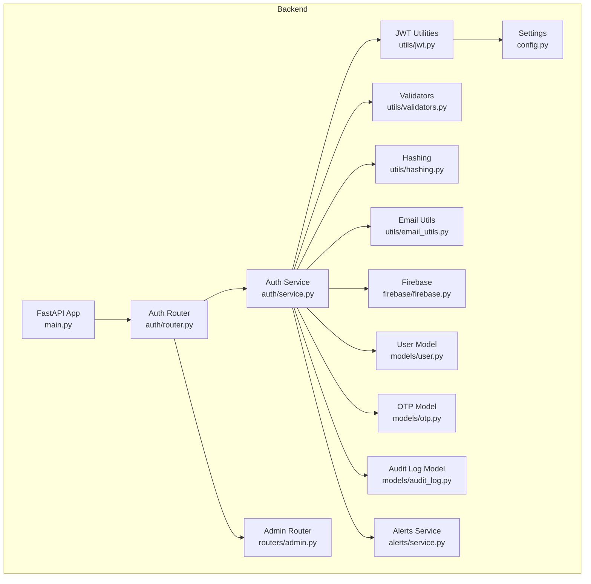
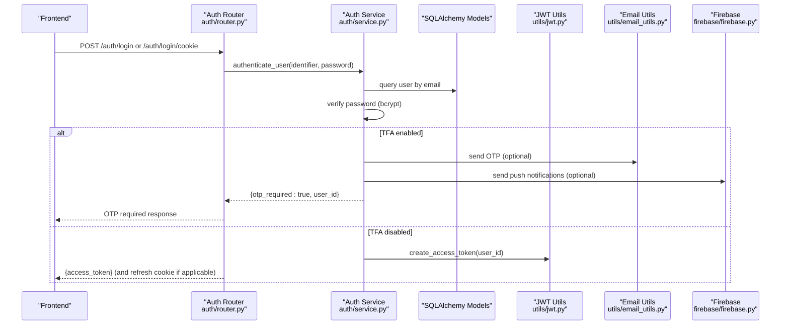
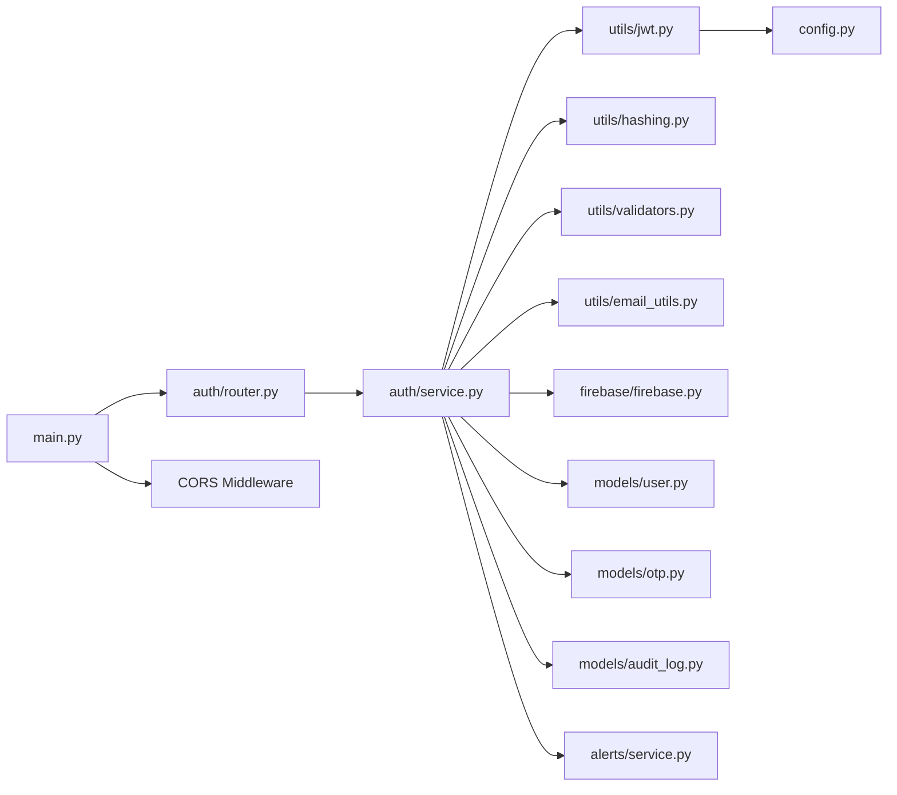

# Security Best Practices & Threat Mitigation

<cite>
**Referenced Files in This Document**
- [backend/app/main.py](file://backend/app/main.py)
- [backend/app/config.py](file://backend/app/config.py)
- [backend/app/utils/validators.py](file://backend/app/utils/validators.py)
- [backend/app/auth/router.py](file://backend/app/auth/router.py)
- [backend/app/auth/service.py](file://backend/app/auth/service.py)
- [backend/app/utils/jwt.py](file://backend/app/utils/jwt.py)
- [backend/app/utils/email_utils.py](file://backend/app/utils/email_utils.py)
- [backend/app/firebase/firebase.py](file://backend/app/firebase/firebase.py)
- [backend/app/models/user.py](file://backend/app/models/user.py)
- [backend/app/models/otp.py](file://backend/app/models/otp.py)
- [backend/app/models/audit_log.py](file://backend/app/models/audit_log.py)
- [backend/app/alerts/service.py](file://backend/app/alerts/service.py)
- [backend/app/routers/admin.py](file://backend/app/routers/admin.py)
</cite>

## Table of Contents
1. [Introduction](#introduction)
2. [Project Structure](#project-structure)
3. [Core Components](#core-components)
4. [Architecture Overview](#architecture-overview)
5. [Detailed Component Analysis](#detailed-component-analysis)
6. [Dependency Analysis](#dependency-analysis)
7. [Performance Considerations](#performance-considerations)
8. [Troubleshooting Guide](#troubleshooting-guide)
9. [Conclusion](#conclusion)
10. [Appendices](#appendices)

## Introduction
This document consolidates security best practices and threat mitigation strategies for the Modern Digital Banking Dashboard. It focuses on input validation, SQL injection prevention, XSS protection, CSRF mitigation, secure coding practices, security headers, CORS policies, content security, rate limiting, brute-force protection, session management, audit logging, compliance considerations for financial applications, encryption at rest and in transit, secure configuration management, security testing, vulnerability assessment, and incident response.

## Project Structure
The backend is a FastAPI application that orchestrates routers, services, and models. Authentication and session management are centralized under the auth module, with JWT tokens issued via a shared settings configuration. CORS is configured centrally, and security utilities provide hashing, validation, and email/push notification integrations.

**Diagram sources**
- [backend/app/main.py:56-109](file://backend/app/main.py#L56-L109)
- [backend/app/config.py:57-72](file://backend/app/config.py#L57-L72)
- [backend/app/utils/jwt.py:1-26](file://backend/app/utils/jwt.py#L1-L26)
- [backend/app/auth/router.py:1-180](file://backend/app/auth/router.py#L1-L180)
- [backend/app/auth/service.py:1-225](file://backend/app/auth/service.py#L1-L225)
- [backend/app/utils/validators.py:1-47](file://backend/app/utils/validators.py#L1-L47)
- [backend/app/utils/hashing.py:1-13](file://backend/app/utils/hash_password.py#L1-L13)
- [backend/app/utils/email_utils.py:1-34](file://backend/app/utils/email_utils.py#L1-L34)
- [backend/app/firebase/firebase.py:1-29](file://backend/app/firebase/firebase.py#L1-L29)
- [backend/app/models/user.py:1-65](file://backend/app/models/user.py#L1-L65)
- [backend/app/models/otp.py:1-16](file://backend/app/models/otp.py#L1-L16)
- [backend/app/models/audit_log.py:1-19](file://backend/app/models/audit_log.py#L1-L19)
- [backend/app/alerts/service.py:1-24](file://backend/app/alerts/service.py#L1-L24)
- [backend/app/routers/admin.py:1-45](file://backend/app/routers/admin.py#L1-L45)

**Section sources**
- [backend/app/main.py:56-109](file://backend/app/main.py#L56-L109)
- [backend/app/config.py:57-72](file://backend/app/config.py#L57-L72)

## Core Components
- Centralized settings and secrets management via environment variables and Pydantic settings.
- JWT-based authentication with configurable expiration and algorithm.
- Strong password validation and bcrypt-based hashing.
- OTP generation and delivery via email and push notifications.
- CORS middleware configured with environment-controlled origins.
- Audit logging and alerting for security-relevant events.

Key implementation references:
- Settings and secrets loading: [backend/app/config.py:57-72](file://backend/app/config.py#L57-L72)
- JWT token creation and decoding: [backend/app/utils/jwt.py:1-26](file://backend/app/utils/jwt.py#L1-L26)
- Authentication flow and OTP handling: [backend/app/auth/service.py:205-225](file://backend/app/auth/service.py#L205-L225), [backend/app/auth/router.py:104-139](file://backend/app/auth/router.py#L104-L139)
- Password validation and phone normalization: [backend/app/utils/validators.py:23-47](file://backend/app/utils/validators.py#L23-L47)
- Hashing utilities: [backend/app/utils/hashing.py:1-13](file://backend/app/utils/hash_password.py#L1-L13)
- Email and Firebase integrations: [backend/app/utils/email_utils.py:1-34](file://backend/app/utils/email_utils.py#L1-L34), [backend/app/firebase/firebase.py:1-29](file://backend/app/firebase/firebase.py#L1-L29)
- CORS configuration: [backend/app/main.py:91-109](file://backend/app/main.py#L91-L109)

**Section sources**
- [backend/app/config.py:57-72](file://backend/app/config.py#L57-L72)
- [backend/app/utils/jwt.py:1-26](file://backend/app/utils/jwt.py#L1-L26)
- [backend/app/auth/service.py:205-225](file://backend/app/auth/service.py#L205-L225)
- [backend/app/auth/router.py:104-139](file://backend/app/auth/router.py#L104-L139)
- [backend/app/utils/validators.py:23-47](file://backend/app/utils/validators.py#L23-L47)
- [backend/app/utils/hashing.py:1-13](file://backend/app/utils/hash_password.py#L1-L13)
- [backend/app/utils/email_utils.py:1-34](file://backend/app/utils/email_utils.py#L1-L34)
- [backend/app/firebase/firebase.py:1-29](file://backend/app/firebase/firebase.py#L1-L29)
- [backend/app/main.py:91-109](file://backend/app/main.py#L91-L109)

## Architecture Overview
The authentication flow integrates FastAPI routers, SQLAlchemy models, JWT utilities, and external services for alerts and notifications. CORS is applied globally to control cross-origin requests.

**Diagram sources**
- [backend/app/auth/router.py:104-139](file://backend/app/auth/router.py#L104-L139)
- [backend/app/auth/service.py:205-225](file://backend/app/auth/service.py#L205-L225)
- [backend/app/utils/jwt.py:11-19](file://backend/app/utils/jwt.py#L11-L19)
- [backend/app/utils/email_utils.py:12-34](file://backend/app/utils/email_utils.py#L12-L34)
- [backend/app/firebase/firebase.py:20-29](file://backend/app/firebase/firebase.py#L20-L29)

**Section sources**
- [backend/app/auth/router.py:104-139](file://backend/app/auth/router.py#L104-L139)
- [backend/app/auth/service.py:205-225](file://backend/app/auth/service.py#L205-L225)
- [backend/app/utils/jwt.py:11-19](file://backend/app/utils/jwt.py#L11-L19)
- [backend/app/utils/email_utils.py:12-34](file://backend/app/utils/email_utils.py#L12-L34)
- [backend/app/firebase/firebase.py:20-29](file://backend/app/firebase/firebase.py#L20-L29)

## Detailed Component Analysis

### Input Validation and Sanitization
- Password strength validation enforces complexity requirements.
- Phone normalization strips non-digit characters to ensure consistent numeric storage.
- Router-level checks enforce presence of credentials before authentication attempts.

Recommended improvements:
- Apply Pydantic models for request schemas to centralize validation and serialization.
- Enforce strict field types and lengths at the schema level.
- Sanitize and normalize inputs consistently across all routes.

Implementation references:
- Password validation: [backend/app/utils/validators.py:23-37](file://backend/app/utils/validators.py#L23-L37)
- Phone normalization: [backend/app/utils/validators.py:39-47](file://backend/app/utils/validators.py#L39-L47)
- Credential checks: [backend/app/auth/router.py:64-68](file://backend/app/auth/router.py#L64-L68)

**Section sources**
- [backend/app/utils/validators.py:23-47](file://backend/app/utils/validators.py#L23-L47)
- [backend/app/auth/router.py:64-68](file://backend/app/auth/router.py#L64-L68)

### SQL Injection Prevention
- SQLAlchemy ORM usage prevents raw SQL queries and mitigates injection risks.
- Parameterized queries through ORM filters and joins.
- OTP and user lookups use ORM constructs with validated identifiers.

Recommendations:
- Avoid dynamic SQL; always use ORM or parameterized statements.
- Review all database interactions for adherence to ORM patterns.

Implementation references:
- User lookup and OTP verification: [backend/app/auth/service.py:110-112](file://backend/app/auth/service.py#L110-L112), [backend/app/auth/router.py:147-153](file://backend/app/auth/router.py#L147-L153)
- OTP model definition: [backend/app/models/otp.py:1-16](file://backend/app/models/otp.py#L1-L16)

**Section sources**
- [backend/app/auth/service.py:110-112](file://backend/app/auth/service.py#L110-L112)
- [backend/app/auth/router.py:147-153](file://backend/app/auth/router.py#L147-L153)
- [backend/app/models/otp.py:1-16](file://backend/app/models/otp.py#L1-L16)

### XSS Protection
- No explicit HTML sanitization or Content-Security-Policy headers are configured in the backend.
- Recommendations:
  - Implement CSP headers to restrict script sources and inline content.
  - Sanitize user-generated content before rendering.
  - Use secure output encoding in templates or frontend rendering contexts.

Observation:
- Backend does not set CSP or similar headers; frontend should manage CSP via meta tags or server headers.

**Section sources**
- [backend/app/main.py:56-109](file://backend/app/main.py#L56-L109)

### CSRF Mitigation
- CSRF protection is not implemented in the backend.
- Recommendations:
  - Enable CSRF cookies with SameSite and Secure flags.
  - Use anti-CSRF tokens for state-changing operations.
  - Align SameSite policy with security posture (Strict/Lax/None).

Current cookie configuration:
- Refresh cookie flags are controlled by environment variables: [backend/app/auth/router.py:24-31](file://backend/app/auth/router.py#L24-L31)

**Section sources**
- [backend/app/auth/router.py:24-31](file://backend/app/auth/router.py#L24-L31)

### Secure Coding Practices
- Centralized secrets via environment variables and Pydantic settings.
- JWT secrets loaded from settings; avoid hardcoded keys.
- Password hashing with bcrypt; strong password validation.
- OTP generation with short expiry; email/push notifications for alerts.

Recommendations:
- Rotate secrets regularly and restrict access to environment files.
- Enforce HTTPS in production and configure secure cookies.
- Add input length limits and allowlists for sensitive fields.

Implementation references:
- Settings and secrets: [backend/app/config.py:57-72](file://backend/app/config.py#L57-L72)
- JWT utilities: [backend/app/utils/jwt.py:1-26](file://backend/app/utils/jwt.py#L1-L26)
- Hashing: [backend/app/utils/hashing.py:1-13](file://backend/app/utils/hash_password.py#L1-L13)
- OTP model and expiry: [backend/app/models/otp.py:13-16](file://backend/app/models/otp.py#L13-L16)

**Section sources**
- [backend/app/config.py:57-72](file://backend/app/config.py#L57-L72)
- [backend/app/utils/jwt.py:1-26](file://backend/app/utils/jwt.py#L1-L26)
- [backend/app/utils/hashing.py:1-13](file://backend/app/utils/hash_password.py#L1-L13)
- [backend/app/models/otp.py:13-16](file://backend/app/models/otp.py#L13-L16)

### Security Headers Configuration
- No explicit security headers are set in the backend.
- Recommendations:
  - Strict-Transport-Security (HSTS)
  - X-Content-Type-Options: nosniff
  - X-Frame-Options: DENY
  - Referrer-Policy: strict-origin-when-cross-origin
  - Content-Security-Policy (see XSS section)

**Section sources**
- [backend/app/main.py:56-109](file://backend/app/main.py#L56-L109)

### CORS Policies
- CORS middleware is configured with environment-controlled origins and credentials allowed.
- Recommendations:
  - Lock down allowed origins to minimal required domains.
  - Avoid wildcard origins in production.
  - Align allow-headers/methods to actual needs.

Implementation reference:
- CORS configuration: [backend/app/main.py:91-109](file://backend/app/main.py#L91-L109)

**Section sources**
- [backend/app/main.py:91-109](file://backend/app/main.py#L91-L109)

### Rate Limiting and Brute Force Protection
- No built-in rate limiting or brute-force protection mechanisms are present.
- Recommendations:
  - Implement rate limiting per IP/endpoint using middleware or external services.
  - Add account lockout after failed attempts.
  - Use sliding windows or token buckets for fairness.

Observation:
- Authentication flow does not include throttling or lockout logic.

**Section sources**
- [backend/app/auth/router.py:104-139](file://backend/app/auth/router.py#L104-L139)
- [backend/app/auth/service.py:205-225](file://backend/app/auth/service.py#L205-L225)

### Session Management
- Access tokens are short-lived; refresh tokens are stored in HttpOnly cookies with configurable SameSite/Secure flags.
- Recommendations:
  - Enforce Secure and SameSite=Strict for cross-site contexts.
  - Invalidate tokens on logout and implement refresh token rotation.
  - Store refresh tokens securely (hashed) and bound to devices.

Implementation references:
- Cookie flags and issuance: [backend/app/auth/router.py:24-61](file://backend/app/auth/router.py#L24-L61)
- Token creation: [backend/app/utils/jwt.py:11-19](file://backend/app/utils/jwt.py#L11-L19)

**Section sources**
- [backend/app/auth/router.py:24-61](file://backend/app/auth/router.py#L24-L61)
- [backend/app/utils/jwt.py:11-19](file://backend/app/utils/jwt.py#L11-L19)

### Audit Logging
- Audit log model captures admin actions with timestamps.
- Recommendations:
  - Record user sessions, sensitive operations, and configuration changes.
  - Ensure logs are immutable and retained per compliance.
  - Stream logs to SIEM for real-time monitoring.

Implementation reference:
- Audit log model: [backend/app/models/audit_log.py:1-19](file://backend/app/models/audit_log.py#L1-L19)

**Section sources**
- [backend/app/models/audit_log.py:1-19](file://backend/app/models/audit_log.py#L1-L19)

### Compliance Considerations for Financial Applications
- Data classification and encryption at rest:
  - Encrypt sensitive PII and financial data at rest.
  - Use managed encryption keys and rotate periodically.
- Encryption in transit:
  - Enforce TLS 1.2+ and modern cipher suites.
  - Disable legacy protocols and weak ciphers.
- Secure configuration management:
  - Secrets stored in environment variables or secret managers.
  - Principle of least privilege for service accounts.
- Data retention and deletion:
  - Define retention periods and secure deletion policies aligned with regulations.

[No sources needed since this section provides general guidance]

### Security Testing Practices
- Static Application Security Testing (SAST):
  - Integrate linters and type checkers in CI.
- Dynamic Application Security Testing (DAST):
  - Automated scans for OWASP Top 10 vulnerabilities.
- Penetration Testing:
  - Authorized manual penetration tests quarterly.
- Secret Scanning:
  - Scan repositories for exposed secrets.

[No sources needed since this section provides general guidance]

### Vulnerability Assessment Procedures
- Quarterly vulnerability assessments for dependencies.
- Dependency review using SBOM and SCA tools.
- Remediation timelines and rollback procedures.

[No sources needed since this section provides general guidance]

### Incident Response Protocols
- Immediate isolation of affected systems.
- Forensic analysis and evidence preservation.
- Communication plan for stakeholders and regulators.
- Post-incident review and remediation tracking.

[No sources needed since this section provides general guidance]

## Dependency Analysis
The authentication subsystem depends on settings, JWT utilities, hashing, validators, and external services for alerts. CORS is a global middleware dependency.

**Diagram sources**
- [backend/app/auth/router.py:1-180](file://backend/app/auth/router.py#L1-L180)
- [backend/app/auth/service.py:1-225](file://backend/app/auth/service.py#L1-L225)
- [backend/app/utils/jwt.py:1-26](file://backend/app/utils/jwt.py#L1-L26)
- [backend/app/utils/hashing.py:1-13](file://backend/app/utils/hash_password.py#L1-L13)
- [backend/app/utils/validators.py:1-47](file://backend/app/utils/validators.py#L1-L47)
- [backend/app/utils/email_utils.py:1-34](file://backend/app/utils/email_utils.py#L1-L34)
- [backend/app/firebase/firebase.py:1-29](file://backend/app/firebase/firebase.py#L1-L29)
- [backend/app/models/user.py:1-65](file://backend/app/models/user.py#L1-L65)
- [backend/app/models/otp.py:1-16](file://backend/app/models/otp.py#L1-L16)
- [backend/app/models/audit_log.py:1-19](file://backend/app/models/audit_log.py#L1-L19)
- [backend/app/alerts/service.py:1-24](file://backend/app/alerts/service.py#L1-L24)
- [backend/app/main.py:56-109](file://backend/app/main.py#L56-L109)
- [backend/app/config.py:57-72](file://backend/app/config.py#L57-L72)

**Section sources**
- [backend/app/auth/router.py:1-180](file://backend/app/auth/router.py#L1-L180)
- [backend/app/auth/service.py:1-225](file://backend/app/auth/service.py#L1-L225)
- [backend/app/utils/jwt.py:1-26](file://backend/app/utils/jwt.py#L1-L26)
- [backend/app/utils/hashing.py:1-13](file://backend/app/utils/hash_password.py#L1-L13)
- [backend/app/utils/validators.py:1-47](file://backend/app/utils/validators.py#L1-L47)
- [backend/app/utils/email_utils.py:1-34](file://backend/app/utils/email_utils.py#L1-L34)
- [backend/app/firebase/firebase.py:1-29](file://backend/app/firebase/firebase.py#L1-L29)
- [backend/app/models/user.py:1-65](file://backend/app/models/user.py#L1-L65)
- [backend/app/models/otp.py:1-16](file://backend/app/models/otp.py#L1-L16)
- [backend/app/models/audit_log.py:1-19](file://backend/app/models/audit_log.py#L1-L19)
- [backend/app/alerts/service.py:1-24](file://backend/app/alerts/service.py#L1-L24)
- [backend/app/main.py:56-109](file://backend/app/main.py#L56-L109)
- [backend/app/config.py:57-72](file://backend/app/config.py#L57-L72)

## Performance Considerations
- Keep JWT payloads minimal to reduce overhead.
- Use connection pooling and limit concurrent OTP sends.
- Cache non-sensitive data judiciously; avoid caching secrets.

[No sources needed since this section provides general guidance]

## Troubleshooting Guide
Common issues and mitigations:
- Missing SMTP credentials during email sending:
  - Behavior: Email sending is skipped with a warning; authentication flow continues unaffected.
  - Reference: [backend/app/utils/email_utils.py:12-34](file://backend/app/utils/email_utils.py#L12-L34)
- Firebase credentials not configured:
  - Behavior: Initialization fails early with a runtime error.
  - Reference: [backend/app/firebase/firebase.py:7-18](file://backend/app/firebase/firebase.py#L7-L18)
- Missing environment variables for JWT:
  - Behavior: Development fallback values are used with warnings; do not use in production.
  - Reference: [backend/app/config.py:42-56](file://backend/app/config.py#L42-L56)
- CORS misconfiguration:
  - Behavior: Cross-origin requests blocked unless origins are explicitly allowed.
  - Reference: [backend/app/main.py:91-109](file://backend/app/main.py#L91-L109)

**Section sources**
- [backend/app/utils/email_utils.py:12-34](file://backend/app/utils/email_utils.py#L12-L34)
- [backend/app/firebase/firebase.py:7-18](file://backend/app/firebase/firebase.py#L7-L18)
- [backend/app/config.py:42-56](file://backend/app/config.py#L42-L56)
- [backend/app/main.py:91-109](file://backend/app/main.py#L91-L109)

## Conclusion
The backend implements foundational security controls including JWT-based authentication, bcrypt hashing, OTP-based two-factor authentication, and CORS configuration. To achieve robust security for financial applications, integrate CSP headers, CSRF protections, rate limiting, comprehensive audit logging, and strict compliance controls. Adopt secure configuration management, continuous vulnerability assessment, and incident response procedures.

[No sources needed since this section summarizes without analyzing specific files]

## Appendices

### Security Headers Checklist
- HSTS: max-age, includeSubDomains, preload
- X-Content-Type-Options: nosniff
- X-Frame-Options: DENY
- Referrer-Policy: strict-origin-when-cross-origin
- Content-Security-Policy: restrict script and frame ancestors

[No sources needed since this section provides general guidance]

### CORS Configuration Checklist
- Origins: explicitly list allowed domains
- Credentials: enable only when necessary
- Methods/Headers: restrict to required values

[No sources needed since this section provides general guidance]