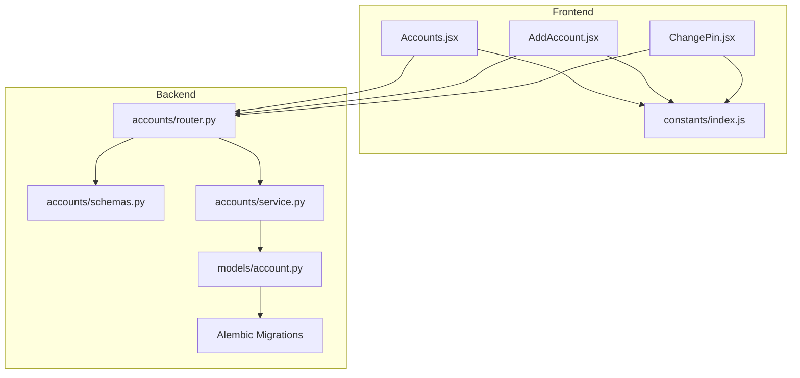
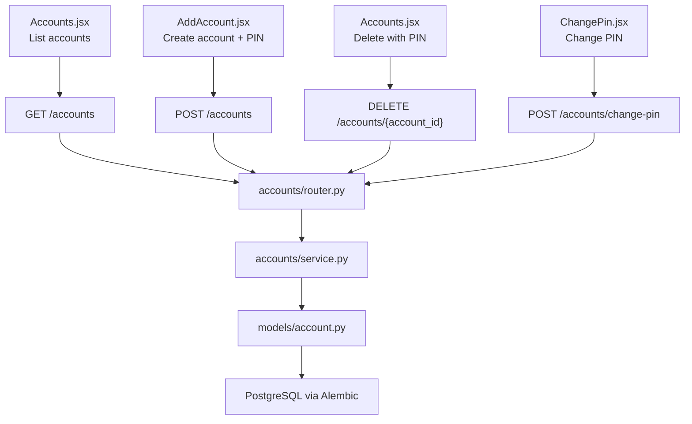
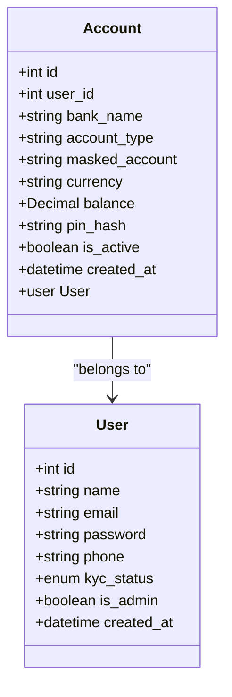
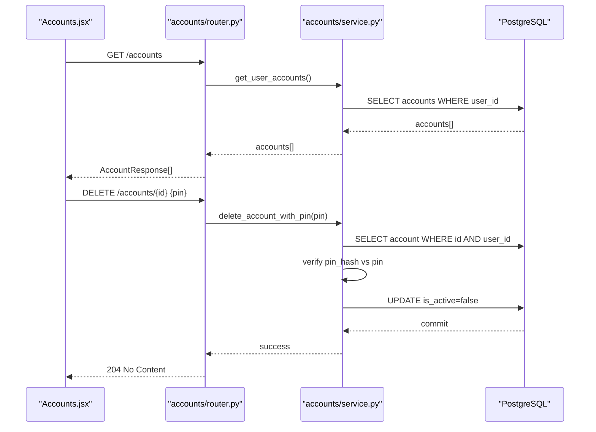
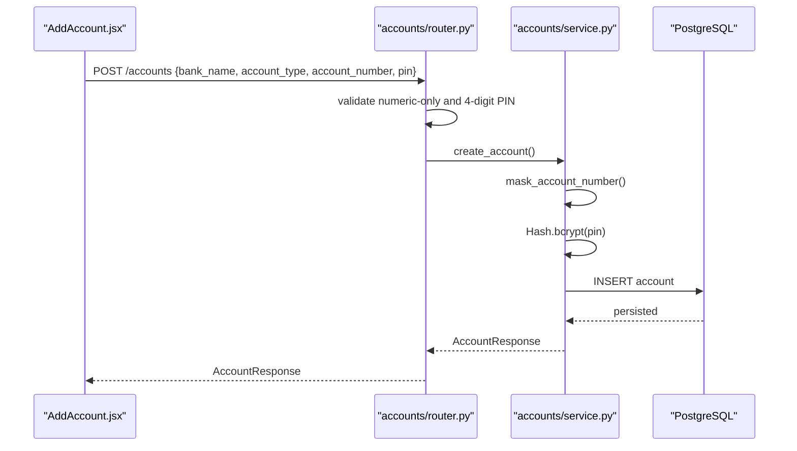
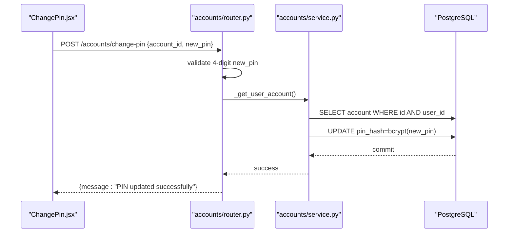
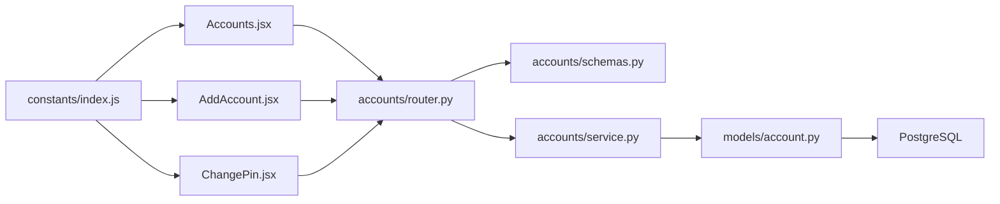

# Account Management

<cite>
**Referenced Files in This Document**
- [models.py](file://backend/app/models/account.py)
- [schemas.py](file://backend/app/accounts/schemas.py)
- [service.py](file://backend/app/accounts/service.py)
- [router.py](file://backend/app/accounts/router.py)
- [Accounts.jsx](file://frontend/src/pages/user/Accounts.jsx)
- [AddAccount.jsx](file://frontend/src/pages/user/AddAccount.jsx)
- [ChangePin.jsx](file://frontend/src/pages/user/ChangePin.jsx)
- [index.js](file://frontend/src/constants/index.js)
- [f3c553c21ca8_initial_schema.py](file://backend/alembic/versions/f3c553c21ca8_initial_schema.py)
- [e4b6b665cae9_add_is_admin_to_users.py](file://backend/alembic/versions/e4b6b665cae9_add_is_admin_to_users.py)
- [database-schema.md](file://docs/database-schema.md)
</cite>

## Table of Contents
1. [Introduction](#introduction)
2. [Project Structure](#project-structure)
3. [Core Components](#core-components)
4. [Architecture Overview](#architecture-overview)
5. [Detailed Component Analysis](#detailed-component-analysis)
6. [Dependency Analysis](#dependency-analysis)
7. [Performance Considerations](#performance-considerations)
8. [Troubleshooting Guide](#troubleshooting-guide)
9. [Conclusion](#conclusion)
10. [Appendices](#appendices)

## Introduction
This document provides comprehensive documentation for the Account Management feature. It covers account creation, account listing, account deletion, and PIN management. It explains the account model structure, validation rules, and security measures. It documents the complete workflow from account creation to PIN updates, including frontend components and backend API endpoints. Practical examples, error handling scenarios, and security best practices for PIN management are included.

## Project Structure
The Account Management feature spans both frontend and backend:
- Backend: FastAPI routes, Pydantic schemas, SQLAlchemy models, and business logic services.
- Frontend: React components for listing, adding, deleting, and changing account PINs.
- Database: Alembic migrations define the persistent schema for accounts and related entities.

**Diagram sources**
- [Accounts.jsx:1-419](file://frontend/src/pages/user/Accounts.jsx#L1-L419)
- [AddAccount.jsx:1-440](file://frontend/src/pages/user/AddAccount.jsx#L1-L440)
- [ChangePin.jsx:1-138](file://frontend/src/pages/user/ChangePin.jsx#L1-L138)
- [index.js:64-132](file://frontend/src/constants/index.js#L64-L132)
- [router.py:1-109](file://backend/app/accounts/router.py#L1-L109)
- [schemas.py:1-60](file://backend/app/accounts/schemas.py#L1-L60)
- [service.py:1-111](file://backend/app/accounts/service.py#L1-L111)
- [models.py:1-57](file://backend/app/models/account.py#L1-L57)
- [f3c553c21ca8_initial_schema.py:18-66](file://backend/alembic/versions/f3c553c21ca8_initial_schema.py#L18-L66)

**Section sources**
- [Accounts.jsx:1-419](file://frontend/src/pages/user/Accounts.jsx#L1-L419)
- [AddAccount.jsx:1-440](file://frontend/src/pages/user/AddAccount.jsx#L1-L440)
- [ChangePin.jsx:1-138](file://frontend/src/pages/user/ChangePin.jsx#L1-L138)
- [index.js:64-132](file://frontend/src/constants/index.js#L64-L132)
- [router.py:1-109](file://backend/app/accounts/router.py#L1-L109)
- [schemas.py:1-60](file://backend/app/accounts/schemas.py#L1-L60)
- [service.py:1-111](file://backend/app/accounts/service.py#L1-L111)
- [models.py:1-57](file://backend/app/models/account.py#L1-L57)
- [f3c553c21ca8_initial_schema.py:18-66](file://backend/alembic/versions/f3c553c21ca8_initial_schema.py#L18-L66)

## Core Components
- Account model: Defines persisted fields including user linkage, bank metadata, masked account number, currency, balance, PIN hash, activity flag, and timestamps.
- Account schemas: Pydantic models for request/response validation (creation, deletion, response, and PIN change).
- Account service: Implements business logic for account creation, retrieval, soft deletion via PIN verification, and PIN updates.
- Account router: Exposes REST endpoints for creating, listing, deleting, and changing PINs; applies validation and authorization.
- Frontend components: Pages for listing accounts, adding accounts (including PIN creation), and changing PINs; integrate with API endpoints.

Key responsibilities:
- Enforce numeric-only 4-digit PIN constraints during creation and updates.
- Mask account numbers for display.
- Securely hash PINs using bcrypt.
- Verify PIN for account deletion.
- Provide user-friendly feedback and error messages.

**Section sources**
- [models.py:31-57](file://backend/app/models/account.py#L31-L57)
- [schemas.py:29-60](file://backend/app/accounts/schemas.py#L29-L60)
- [service.py:55-111](file://backend/app/accounts/service.py#L55-L111)
- [router.py:61-108](file://backend/app/accounts/router.py#L61-L108)
- [Accounts.jsx:52-93](file://frontend/src/pages/user/Accounts.jsx#L52-L93)
- [AddAccount.jsx:80-105](file://frontend/src/pages/user/AddAccount.jsx#L80-L105)
- [ChangePin.jsx:22-57](file://frontend/src/pages/user/ChangePin.jsx#L22-L57)

## Architecture Overview
The Account Management feature follows a layered architecture:
- Presentation layer: React components render forms and lists, collect user input, and call API endpoints.
- API layer: FastAPI router validates requests, enforces business rules, and delegates to services.
- Business logic layer: Services encapsulate domain logic, including PIN hashing, masking, and validation.
- Persistence layer: SQLAlchemy ORM maps models to database tables; Alembic migrations define schema.

**Diagram sources**
- [Accounts.jsx:52-93](file://frontend/src/pages/user/Accounts.jsx#L52-L93)
- [AddAccount.jsx:80-105](file://frontend/src/pages/user/AddAccount.jsx#L80-L105)
- [ChangePin.jsx:22-57](file://frontend/src/pages/user/ChangePin.jsx#L22-L57)
- [router.py:61-108](file://backend/app/accounts/router.py#L61-L108)
- [service.py:55-111](file://backend/app/accounts/service.py#L55-L111)
- [models.py:31-57](file://backend/app/models/account.py#L31-L57)
- [f3c553c21ca8_initial_schema.py:37-50](file://backend/alembic/versions/f3c553c21ca8_initial_schema.py#L37-L50)

## Detailed Component Analysis

### Account Model
The Account model defines the persisted structure for bank accounts:
- Fields: identifiers, user linkage, bank name, account type, masked account number, currency, balance, PIN hash, activity flag, and timestamps.
- Relationships: back-populated relationship to User.
- Security: PIN stored as a bcrypt hash; sensitive fields are not exposed in responses.

**Diagram sources**
- [models.py:31-57](file://backend/app/models/account.py#L31-L57)

**Section sources**
- [models.py:31-57](file://backend/app/models/account.py#L31-L57)
- [f3c553c21ca8_initial_schema.py:37-50](file://backend/alembic/versions/f3c553c21ca8_initial_schema.py#L37-L50)

### Account Schemas
Pydantic schemas define request/response contracts:
- AccountCreate: Validates bank name, account type, account number length, and PIN constraints.
- AccountResponse: Normalizes response fields for frontend consumption.
- AccountDelete: Validates PIN for deletion.
- ChangePinSchema: Provides account_id and new_pin for PIN change.

Validation rules:
- Account number: minimum 8, maximum 18 digits.
- PIN: exactly 4 digits; numeric-only enforcement applied in router and frontend.
- Account type: constrained to acceptable values.

**Section sources**
- [schemas.py:29-60](file://backend/app/accounts/schemas.py#L29-L60)

### Account Service
Business logic implementation:
- mask_account_number: Masks all but the last four digits of the account number.
- create_account: Checks for duplicate active accounts by last four digits, hashes PIN, sets defaults, and persists.
- get_user_accounts: Retrieves active accounts for the current user.
- get_account_by_id: Fetches a specific account owned by the user.
- delete_account: Soft-deletes by marking inactive after verifying ownership.
- delete_account_with_pin: Verifies PIN against stored hash and deactivates account.

Security measures:
- PIN verification uses bcrypt comparison.
- Duplicate detection prevents re-addition of the same account.

**Section sources**
- [service.py:38-111](file://backend/app/accounts/service.py#L38-L111)

### Account Router
REST endpoints and validations:
- POST /accounts: Creates an account; enforces numeric-only PIN and 4-digit length.
- GET /accounts: Lists user accounts.
- DELETE /accounts/{account_id}: Deletes an account by PIN; enforces numeric-only PIN and 4-digit length.
- POST /accounts/change-pin: Changes PIN; enforces 4-digit requirement and verifies account ownership.

Authorization:
- Uses dependency to extract current user from the request context.

**Section sources**
- [router.py:61-108](file://backend/app/accounts/router.py#L61-L108)

### Frontend Components

#### Accounts Listing and Deletion
- Fetches accounts via GET /accounts.
- Renders account cards with bank name, masked account, and type.
- Initiates deletion with a 4-digit PIN modal; sends DELETE /accounts/{id} with payload containing the PIN.
- Displays errors when PIN verification fails.

**Diagram sources**
- [Accounts.jsx:52-93](file://frontend/src/pages/user/Accounts.jsx#L52-L93)
- [router.py:79-93](file://backend/app/accounts/router.py#L79-L93)
- [service.py:100-111](file://backend/app/accounts/service.py#L100-L111)

**Section sources**
- [Accounts.jsx:52-93](file://frontend/src/pages/user/Accounts.jsx#L52-L93)
- [router.py:79-93](file://backend/app/accounts/router.py#L79-L93)
- [service.py:100-111](file://backend/app/accounts/service.py#L100-L111)

#### Adding an Account (Including Initial PIN)
- Step 1: Validates bank name, account type, account number length, and consent; proceeds to PIN creation.
- Step 2: Collects 4-digit PIN with numeric-only input.
- Step 3: Confirms PIN; submits POST /accounts with bank_name, account_type, account_number, and pin.
- On success, refreshes account list; on failure, displays error returned from backend.

**Diagram sources**
- [AddAccount.jsx:58-105](file://frontend/src/pages/user/AddAccount.jsx#L58-L105)
- [router.py:61-68](file://backend/app/accounts/router.py#L61-L68)
- [service.py:55-75](file://backend/app/accounts/service.py#L55-L75)

**Section sources**
- [AddAccount.jsx:58-105](file://frontend/src/pages/user/AddAccount.jsx#L58-L105)
- [router.py:61-68](file://backend/app/accounts/router.py#L61-L68)
- [service.py:55-75](file://backend/app/accounts/service.py#L55-L75)

#### Changing PIN
- Collects new 4-digit PIN and confirmation; ensures both match.
- Submits POST /accounts/change-pin with account_id and new_pin.
- Displays success or error based on backend response.

**Diagram sources**
- [ChangePin.jsx:22-57](file://frontend/src/pages/user/ChangePin.jsx#L22-L57)
- [router.py:95-108](file://backend/app/accounts/router.py#L95-L108)
- [service.py:96-111](file://backend/app/accounts/service.py#L96-L111)

**Section sources**
- [ChangePin.jsx:22-57](file://frontend/src/pages/user/ChangePin.jsx#L22-L57)
- [router.py:95-108](file://backend/app/accounts/router.py#L95-L108)
- [service.py:96-111](file://backend/app/accounts/service.py#L96-L111)

### Validation Rules and Security Measures
- Validation rules:
  - Account number: 8 to 18 digits.
  - PIN: exactly 4 digits; numeric-only enforcement in frontend and backend.
  - Account type: constrained to acceptable values.
- Security measures:
  - PINs are hashed using bcrypt before storage.
  - PIN verification compares plaintext against stored hash.
  - Account deletion requires PIN verification.
  - Account listing is scoped to the authenticated user.

**Section sources**
- [schemas.py:30-33](file://backend/app/accounts/schemas.py#L30-L33)
- [router.py:43-50](file://backend/app/accounts/router.py#L43-L50)
- [service.py:100-111](file://backend/app/accounts/service.py#L100-L111)
- [models.py:49-51](file://backend/app/models/account.py#L49-L51)

### API Endpoints Summary
- POST /accounts: Create account with bank details and initial PIN.
- GET /accounts: List user accounts.
- DELETE /accounts/{account_id}: Delete account by PIN.
- POST /accounts/change-pin: Change account PIN.

**Section sources**
- [router.py:61-108](file://backend/app/accounts/router.py#L61-L108)
- [index.js:80-81](file://frontend/src/constants/index.js#L80-L81)

## Dependency Analysis
The Account Management feature exhibits clear separation of concerns:
- Router depends on schemas and service.
- Service depends on models and hashing utilities.
- Frontend components depend on constants for endpoint URLs and route navigation.

**Diagram sources**
- [index.js:64-132](file://frontend/src/constants/index.js#L64-L132)
- [Accounts.jsx:10-14](file://frontend/src/pages/user/Accounts.jsx#L10-L14)
- [AddAccount.jsx:26-27](file://frontend/src/pages/user/AddAccount.jsx#L26-L27)
- [ChangePin.jsx:3-4](file://frontend/src/pages/user/ChangePin.jsx#L3-L4)
- [router.py:25-34](file://backend/app/accounts/router.py#L25-L34)
- [schemas.py:23-24](file://backend/app/accounts/schemas.py#L23-L24)
- [service.py:20-23](file://backend/app/accounts/service.py#L20-L23)
- [models.py:24-26](file://backend/app/models/account.py#L24-L26)

**Section sources**
- [index.js:64-132](file://frontend/src/constants/index.js#L64-L132)
- [router.py:25-34](file://backend/app/accounts/router.py#L25-L34)
- [service.py:20-23](file://backend/app/accounts/service.py#L20-L23)
- [models.py:24-26](file://backend/app/models/account.py#L24-L26)

## Performance Considerations
- Indexing: Primary keys and foreign keys are indexed in migrations; consider adding indexes on frequently queried columns if needed.
- Query efficiency: Retrieval uses simple filters; ensure pagination or limits are considered for large datasets.
- Hashing cost: bcrypt is computationally intensive; batch operations should minimize repeated hashing.
- Network efficiency: Responses exclude sensitive fields; keep payloads minimal.

[No sources needed since this section provides general guidance]

## Troubleshooting Guide
Common issues and resolutions:
- Invalid PIN during deletion:
  - Symptom: Error indicating invalid PIN.
  - Cause: Incorrect 4-digit PIN or non-numeric input.
  - Resolution: Ensure numeric-only 4-digit input; retry with correct PIN.
- Account already added:
  - Symptom: Error stating account already added.
  - Cause: Attempting to add an account whose last four digits match an existing active account.
  - Resolution: Use a different account number or remove the existing account.
- Account not found:
  - Symptom: Error indicating account not found.
  - Cause: Nonexistent account_id or unauthorized access.
  - Resolution: Verify account ownership and existence.
- PIN mismatch during creation:
  - Symptom: Error indicating PIN does not match.
  - Cause: Mismatch between created PIN and confirmed PIN.
  - Resolution: Re-enter matching 4-digit PINs.

Security best practices:
- Never log or expose PINs.
- Enforce numeric-only 4-digit PINs on both frontend and backend.
- Use HTTPS to protect transmissions.
- Implement rate limiting for PIN-related endpoints.

**Section sources**
- [service.py:25-27](file://backend/app/accounts/service.py#L25-L27)
- [router.py:38-50](file://backend/app/accounts/router.py#L38-L50)
- [Accounts.jsx:80-90](file://frontend/src/pages/user/Accounts.jsx#L80-L90)
- [AddAccount.jsx:80-85](file://frontend/src/pages/user/AddAccount.jsx#L80-L85)

## Conclusion
The Account Management feature integrates frontend and backend components to provide secure account lifecycle management. It enforces strict validation, masks sensitive data, and protects PINs through hashing and verification. The documented workflows, endpoints, and security measures enable reliable and user-friendly account operations.

[No sources needed since this section summarizes without analyzing specific files]

## Appendices

### Database Schema Reference
- Accounts table includes user linkage, bank metadata, masked account, currency, balance, PIN hash, activity flag, and timestamps.

**Section sources**
- [database-schema.md:28-42](file://docs/database-schema.md#L28-L42)
- [f3c553c21ca8_initial_schema.py:37-50](file://backend/alembic/versions/f3c553c21ca8_initial_schema.py#L37-L50)

### Migration History
- Initial schema introduces users, accounts, budgets, and supporting tables.
- Subsequent migration adds admin-related tables and columns.

**Section sources**
- [f3c553c21ca8_initial_schema.py:18-79](file://backend/alembic/versions/f3c553c21ca8_initial_schema.py#L18-L79)
- [e4b6b665cae9_add_is_admin_to_users.py:18-151](file://backend/alembic/versions/e4b6b665cae9_add_is_admin_to_users.py#L18-L151)