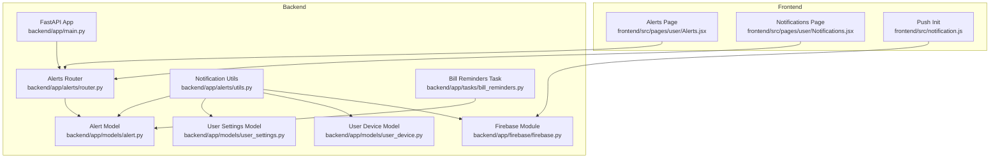
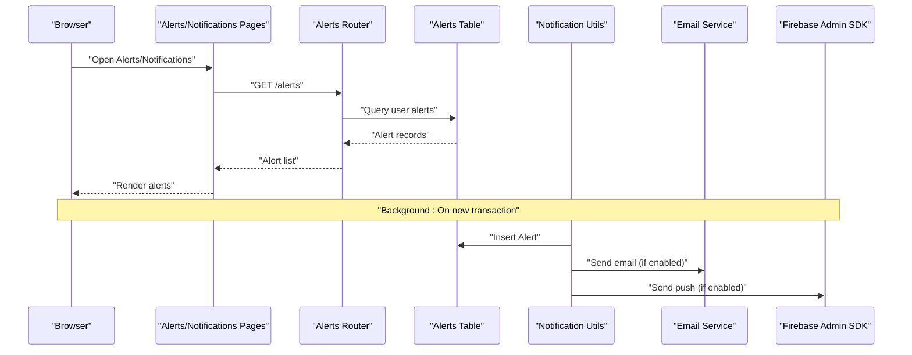
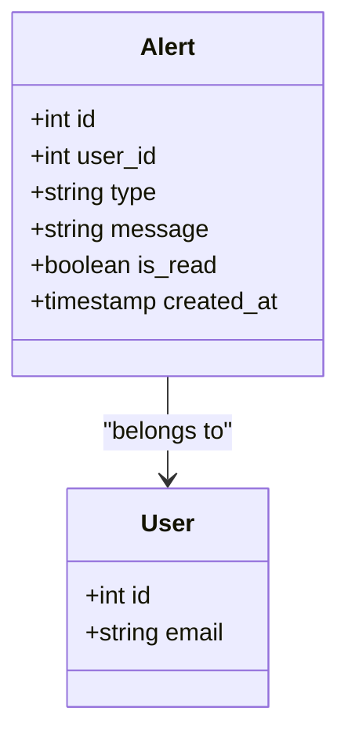
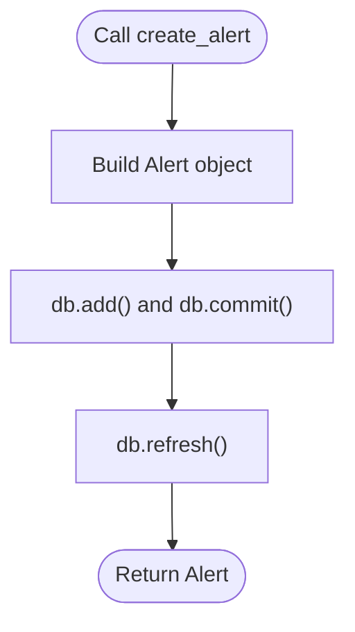
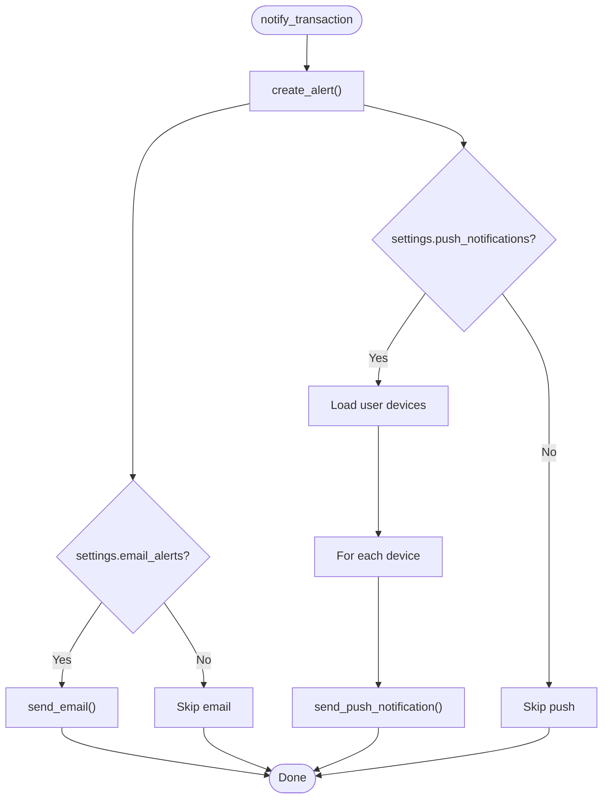
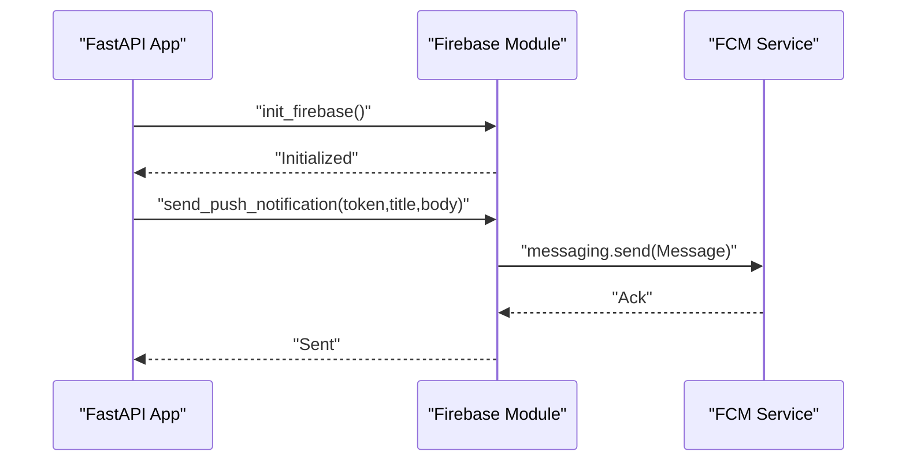
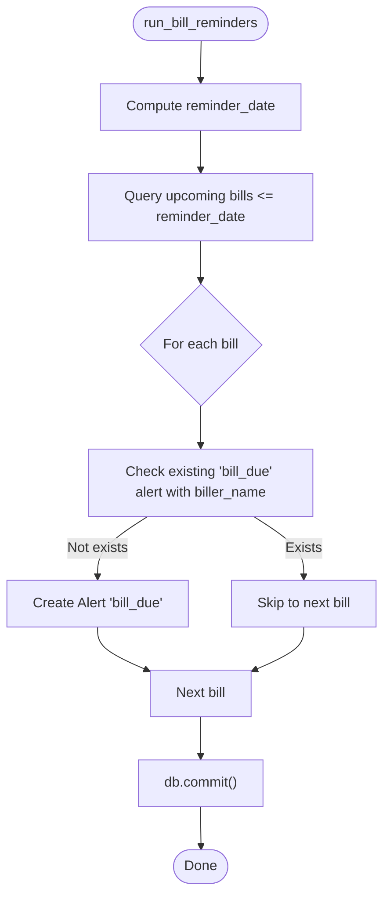
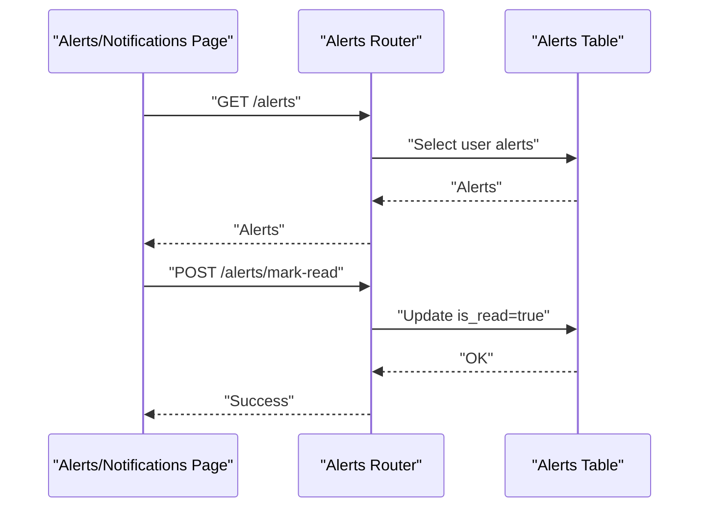
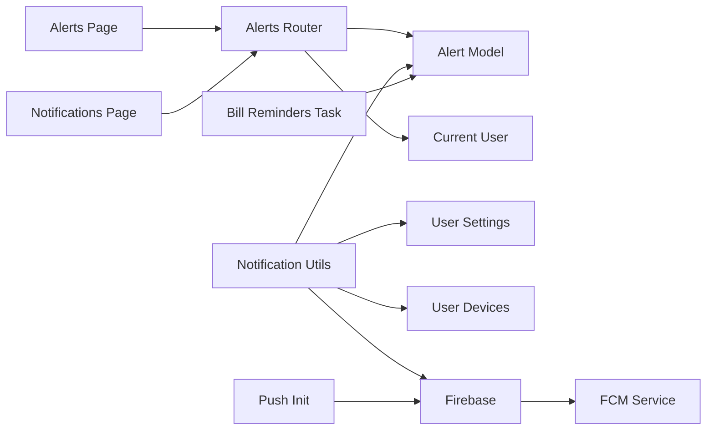

# Alerts & Notifications

<cite>
**Referenced Files in This Document**
- [backend\app\main.py](file://backend/app/main.py)
- [backend\app\firebase\firebase.py](file://backend/app/firebase/firebase.py)
- [backend\app\alerts\service.py](file://backend/app/alerts/service.py)
- [backend\app\alerts\router.py](file://backend/app/alerts/router.py)
- [backend\app\alerts\utils.py](file://backend/app/alerts/utils.py)
- [backend\app\models\alert.py](file://backend/app/models/alert.py)
- [backend\app\models\user_settings.py](file://backend/app/models/user_settings.py)
- [backend\app\models\user_device.py](file://backend/app/models/user_device.py)
- [backend\app\tasks\bill_reminders.py](file://backend/app/tasks/bill_reminders.py)
- [backend\app\routers\alerts.py](file://backend/app/routers/alerts.py)
- [frontend\src\notification.js](file://frontend/src/notification.js)
- [frontend\src\pages\user\Alerts.jsx](file://frontend/src/pages/user/Alerts.jsx)
- [frontend\src\pages\user\Notifications.jsx](file://frontend/src/pages/user/Notifications.jsx)
</cite>

## Table of Contents
1. [Introduction](#introduction)
2. [Project Structure](#project-structure)
3. [Core Components](#core-components)
4. [Architecture Overview](#architecture-overview)
5. [Detailed Component Analysis](#detailed-component-analysis)
6. [Dependency Analysis](#dependency-analysis)
7. [Performance Considerations](#performance-considerations)
8. [Troubleshooting Guide](#troubleshooting-guide)
9. [Conclusion](#conclusion)
10. [Appendices](#appendices)

## Introduction
This document describes the Alerts & Notifications system in the Modern Digital Banking Dashboard. It explains how alerts are generated, how notifications are delivered (email and push), and how user preferences influence delivery. It also documents the backend alert service, Firebase integration for push notifications, and the frontend notification interfaces. Examples of alert types, notification scheduling, and user notification management are included to help developers and operators configure and troubleshoot the system effectively.

## Project Structure
The Alerts & Notifications system spans backend services and frontend pages:
- Backend
  - Alert persistence and retrieval via SQLAlchemy models and routers
  - Notification utilities that create alerts and dispatch email and push notifications
  - Firebase initialization and push notification sending
  - Periodic task to generate bill due reminders
- Frontend
  - Pages to render alerts and notifications
  - Firebase Messaging foreground push handling

**Diagram sources**
- [backend/app/main.py:56-85](file://backend/app/main.py#L56-L85)
- [backend/app/alerts/router.py:9-44](file://backend/app/alerts/router.py#L9-L44)
- [backend/app/alerts/utils.py:8-39](file://backend/app/alerts/utils.py#L8-L39)
- [backend/app/firebase/firebase.py:7-29](file://backend/app/firebase/firebase.py#L7-L29)
- [backend/app/tasks/bill_reminders.py:24-57](file://backend/app/tasks/bill_reminders.py#L24-L57)
- [backend/app/models/alert.py:17-34](file://backend/app/models/alert.py#L17-L34)
- [backend/app/models/user_settings.py:4-14](file://backend/app/models/user_settings.py#L4-L14)
- [backend/app/models/user_device.py:5-12](file://backend/app/models/user_device.py#L5-L12)
- [frontend/src/pages/user/Alerts.jsx:36-53](file://frontend/src/pages/user/Alerts.jsx#L36-L53)
- [frontend/src/pages/user/Notifications.jsx:21-38](file://frontend/src/pages/user/Notifications.jsx#L21-L38)
- [frontend/src/notification.js:4-13](file://frontend/src/notification.js#L4-L13)

**Section sources**
- [backend/app/main.py:56-85](file://backend/app/main.py#L56-L85)
- [frontend/src/pages/user/Alerts.jsx:16-53](file://frontend/src/pages/user/Alerts.jsx#L16-L53)
- [frontend/src/pages/user/Notifications.jsx:17-38](file://frontend/src/pages/user/Notifications.jsx#L17-L38)

## Core Components
- Alert persistence and retrieval
  - Alert model defines fields for type, message, read status, and timestamps.
  - Routers expose endpoints to list alerts, count unread, and mark as read.
- Notification utilities
  - Centralized logic to save an alert and optionally send email and/or push notifications based on user settings.
- Firebase integration
  - Initializes Firebase Admin SDK and sends push notifications to registered devices.
- Bill reminders task
  - Periodically creates “bill due” alerts for upcoming bills.
- Frontend interfaces
  - Dedicated pages to display alerts and notifications.
  - Foreground push handler for browser-based notifications.

**Section sources**
- [backend/app/models/alert.py:17-34](file://backend/app/models/alert.py#L17-L34)
- [backend/app/alerts/router.py:20-43](file://backend/app/alerts/router.py#L20-L43)
- [backend/app/alerts/utils.py:8-39](file://backend/app/alerts/utils.py#L8-L39)
- [backend/app/firebase/firebase.py:20-29](file://backend/app/firebase/firebase.py#L20-L29)
- [backend/app/tasks/bill_reminders.py:24-57](file://backend/app/tasks/bill_reminders.py#L24-L57)
- [frontend/src/pages/user/Alerts.jsx:36-87](file://frontend/src/pages/user/Alerts.jsx#L36-L87)
- [frontend/src/pages/user/Notifications.jsx:21-72](file://frontend/src/pages/user/Notifications.jsx#L21-L72)

## Architecture Overview
The system follows a layered architecture:
- Presentation layer (frontend): Renders alerts and notifications, handles foreground push messages.
- Application layer (backend): Exposes REST endpoints for alerts and orchestrates notifications.
- Persistence layer (SQLAlchemy): Stores alerts, user settings, and device tokens.
- Integration layer (Firebase): Sends push notifications to client devices.

**Diagram sources**
- [backend/app/alerts/router.py:20-43](file://backend/app/alerts/router.py#L20-L43)
- [backend/app/models/alert.py:17-34](file://backend/app/models/alert.py#L17-L34)
- [backend/app/alerts/utils.py:8-39](file://backend/app/alerts/utils.py#L8-L39)
- [backend/app/firebase/firebase.py:20-29](file://backend/app/firebase/firebase.py#L20-L29)

## Detailed Component Analysis

### Alert Model and Storage
- Fields include user association, alert type, message, read flag, and creation timestamp.
- Relationships enable joining with users for filtering and reporting.

**Diagram sources**
- [backend/app/models/alert.py:17-34](file://backend/app/models/alert.py#L17-L34)

**Section sources**
- [backend/app/models/alert.py:17-34](file://backend/app/models/alert.py#L17-L34)

### Alert Service (Creation)
- Provides a simple method to persist an alert record for a given user and type.

**Diagram sources**
- [backend/app/alerts/service.py:6-23](file://backend/app/alerts/service.py#L6-L23)

**Section sources**
- [backend/app/alerts/service.py:6-23](file://backend/app/alerts/service.py#L6-L23)

### Notification Utilities
- Behavior:
  - Always persists an alert.
  - Conditionally sends email and/or push notifications based on user settings.
  - Iterates over user’s registered devices to send push notifications.

**Diagram sources**
- [backend/app/alerts/utils.py:8-39](file://backend/app/alerts/utils.py#L8-L39)
- [backend/app/firebase/firebase.py:20-29](file://backend/app/firebase/firebase.py#L20-L29)
- [backend/app/models/user_settings.py:10-12](file://backend/app/models/user_settings.py#L10-L12)
- [backend/app/models/user_device.py:8-11](file://backend/app/models/user_device.py#L8-L11)

**Section sources**
- [backend/app/alerts/utils.py:8-39](file://backend/app/alerts/utils.py#L8-L39)
- [backend/app/models/user_settings.py:10-12](file://backend/app/models/user_settings.py#L10-L12)
- [backend/app/models/user_device.py:8-11](file://backend/app/models/user_device.py#L8-L11)

### Firebase Integration for Push Notifications
- Initialization:
  - Loads Firebase credentials from environment and initializes the Admin SDK on startup.
- Sending:
  - Constructs a message with title/body and sends to a device token.

**Diagram sources**
- [backend/app/main.py:59-61](file://backend/app/main.py#L59-L61)
- [backend/app/firebase/firebase.py:7-29](file://backend/app/firebase/firebase.py#L7-L29)

**Section sources**
- [backend/app/main.py:59-61](file://backend/app/main.py#L59-L61)
- [backend/app/firebase/firebase.py:7-29](file://backend/app/firebase/firebase.py#L7-L29)

### Bill Reminders Task
- Purpose:
  - Generate “bill due” alerts for bills due within the next two days.
- Prevention:
  - Skips duplicates by checking existing alerts containing the biller name.

**Diagram sources**
- [backend/app/tasks/bill_reminders.py:24-57](file://backend/app/tasks/bill_reminders.py#L24-L57)

**Section sources**
- [backend/app/tasks/bill_reminders.py:24-57](file://backend/app/tasks/bill_reminders.py#L24-L57)

### Frontend Notification Interfaces
- Alerts page:
  - Fetches alerts from the backend and marks them as read upon load.
- Notifications page:
  - Mirrors alerts rendering and also marks as read on load.
- Foreground push handling:
  - Subscribes to foreground messages and shows an alert dialog with title and body.

**Diagram sources**
- [frontend/src/pages/user/Alerts.jsx:36-53](file://frontend/src/pages/user/Alerts.jsx#L36-L53)
- [frontend/src/pages/user/Notifications.jsx:21-38](file://frontend/src/pages/user/Notifications.jsx#L21-L38)
- [backend/app/alerts/router.py:28-43](file://backend/app/alerts/router.py#L28-L43)

**Section sources**
- [frontend/src/pages/user/Alerts.jsx:36-87](file://frontend/src/pages/user/Alerts.jsx#L36-L87)
- [frontend/src/pages/user/Notifications.jsx:21-72](file://frontend/src/pages/user/Notifications.jsx#L21-L72)
- [frontend/src/notification.js:4-13](file://frontend/src/notification.js#L4-L13)
- [backend/app/alerts/router.py:20-43](file://backend/app/alerts/router.py#L20-L43)

### Alert Types and Scheduling
- Alert types
  - Transaction alerts: created by notification utilities.
  - Bill due alerts: created by the bill reminders task.
  - Low balance and budget exceeded: supported by the centralized alerts router and model.
- Scheduling
  - Bill reminders task runs periodically to create alerts for upcoming bills.
  - Additional scheduling can be introduced via external schedulers or task runners.

**Section sources**
- [backend/app/alerts/utils.py:8-39](file://backend/app/alerts/utils.py#L8-L39)
- [backend/app/tasks/bill_reminders.py:24-57](file://backend/app/tasks/bill_reminders.py#L24-L57)
- [backend/app/routers/alerts.py:16-24](file://backend/app/routers/alerts.py#L16-L24)

### User Notification Preferences
- User settings include toggles for push notifications, email alerts, and login alerts.
- Notification utilities conditionally send email and push based on these settings.

**Section sources**
- [backend/app/models/user_settings.py:10-12](file://backend/app/models/user_settings.py#L10-L12)
- [backend/app/alerts/utils.py:20-28](file://backend/app/alerts/utils.py#L20-L28)

## Dependency Analysis
- Backend dependencies
  - Alerts router depends on the Alert model and user context.
  - Notification utilities depend on Alert service, user settings, user devices, and Firebase.
  - Bill reminders task depends on the Alert model and Bill model.
  - Firebase module depends on environment configuration and the Firebase Admin SDK.
- Frontend dependencies
  - Pages depend on the API service and constants for endpoint routing.
  - Foreground push handler depends on Firebase Messaging.

**Diagram sources**
- [backend/app/alerts/router.py:1-44](file://backend/app/alerts/router.py#L1-L44)
- [backend/app/alerts/utils.py:1-39](file://backend/app/alerts/utils.py#L1-L39)
- [backend/app/tasks/bill_reminders.py:1-57](file://backend/app/tasks/bill_reminders.py#L1-L57)
- [backend/app/firebase/firebase.py:1-29](file://backend/app/firebase/firebase.py#L1-L29)
- [frontend/src/pages/user/Alerts.jsx:17-53](file://frontend/src/pages/user/Alerts.jsx#L17-L53)
- [frontend/src/pages/user/Notifications.jsx:15-38](file://frontend/src/pages/user/Notifications.jsx#L15-L38)
- [frontend/src/notification.js:1-14](file://frontend/src/notification.js#L1-L14)

**Section sources**
- [backend/app/alerts/router.py:1-44](file://backend/app/alerts/router.py#L1-L44)
- [backend/app/alerts/utils.py:1-39](file://backend/app/alerts/utils.py#L1-L39)
- [backend/app/tasks/bill_reminders.py:1-57](file://backend/app/tasks/bill_reminders.py#L1-L57)
- [backend/app/firebase/firebase.py:1-29](file://backend/app/firebase/firebase.py#L1-L29)
- [frontend/src/pages/user/Alerts.jsx:17-53](file://frontend/src/pages/user/Alerts.jsx#L17-L53)
- [frontend/src/pages/user/Notifications.jsx:15-38](file://frontend/src/pages/user/Notifications.jsx#L15-L38)
- [frontend/src/notification.js:1-14](file://frontend/src/notification.js#L1-L14)

## Performance Considerations
- Alert queries
  - Sorting by creation timestamp descending is efficient with proper indexing on user_id and created_at.
- Notification dispatch
  - Email and push loops per device can be optimized by batching and rate limiting.
- Firebase initialization
  - Initialize once on startup to avoid repeated credential parsing overhead.
- Task scheduling
  - Run bill reminders during off-peak hours and consider pagination for large datasets.

## Troubleshooting Guide
- Firebase credentials missing
  - Symptom: Runtime error indicating missing environment variable.
  - Resolution: Set the Firebase credentials JSON environment variable and restart the server.
- No push notifications received
  - Verify device tokens are stored and associated with the user.
  - Confirm push notifications setting is enabled for the user.
- Alerts not appearing
  - Ensure alerts are being created by the relevant services or tasks.
  - Check that the frontend is calling the mark-as-read endpoint after loading alerts.
- Duplicate alerts
  - The bill reminders task avoids duplicates by checking existing alerts for the same biller.

**Section sources**
- [backend/app/firebase/firebase.py:11-13](file://backend/app/firebase/firebase.py#L11-L13)
- [backend/app/tasks/bill_reminders.py:38-46](file://backend/app/tasks/bill_reminders.py#L38-L46)
- [frontend/src/pages/user/Alerts.jsx:50-51](file://frontend/src/pages/user/Alerts.jsx#L50-L51)

## Conclusion
The Alerts & Notifications system provides a robust foundation for storing, retrieving, and delivering user-facing alerts and notifications. It supports transaction-based alerts, scheduled bill reminders, and configurable delivery channels (email and push). The frontend offers dedicated pages for viewing alerts and notifications, while Firebase enables real-time push delivery. Extending the system—such as integrating Celery for scheduling or adding SMS—can be achieved with minimal changes to the existing architecture.

## Appendices

### API Endpoints Summary
- Alerts
  - GET /alerts: List user alerts ordered by newest first.
  - GET /alerts/notifications: Count unread alerts.
  - POST /alerts/mark-read: Mark all unread alerts as read.
- Centralized Alerts Router
  - GET /alerts: List user alerts with metadata.
  - POST /alerts: Create an alert with priority/type mapping.
  - PATCH /alerts/{alert_id}/read: Mark a single alert as read.
  - PUT /alerts/{alert_id}: Update an alert’s type and message.
  - DELETE /alerts/{alert_id}: Delete an alert.
  - GET /alerts/summary: Summarize alerts by type.

**Section sources**
- [backend/app/alerts/router.py:20-43](file://backend/app/alerts/router.py#L20-L43)
- [backend/app/routers/alerts.py:26-180](file://backend/app/routers/alerts.py#L26-L180)