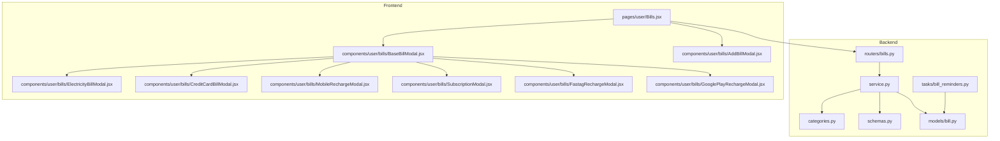
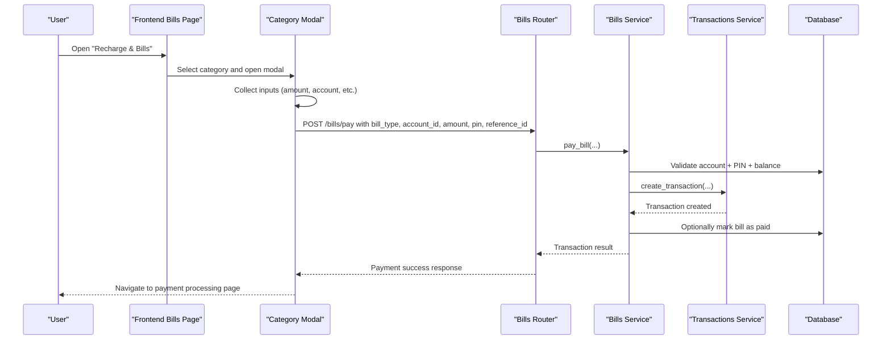
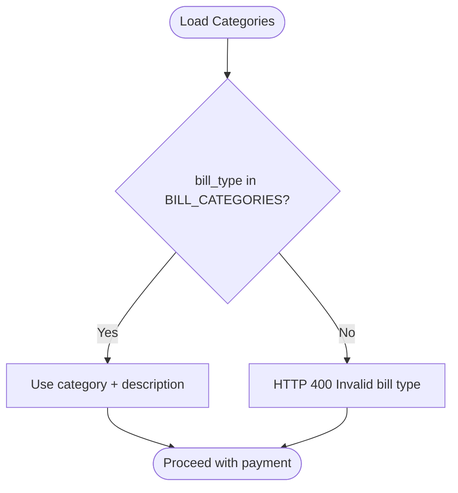
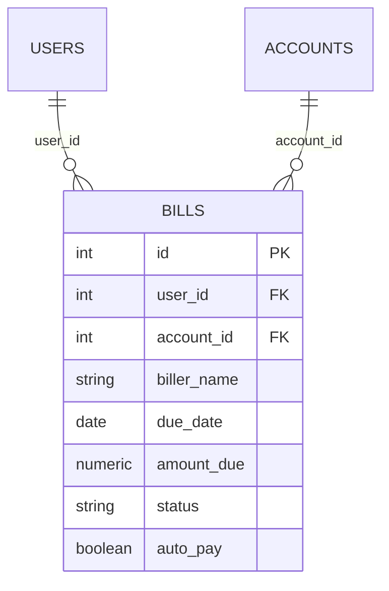
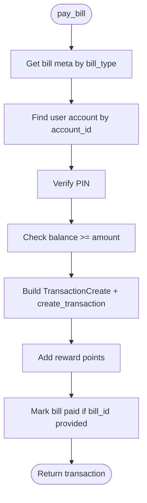
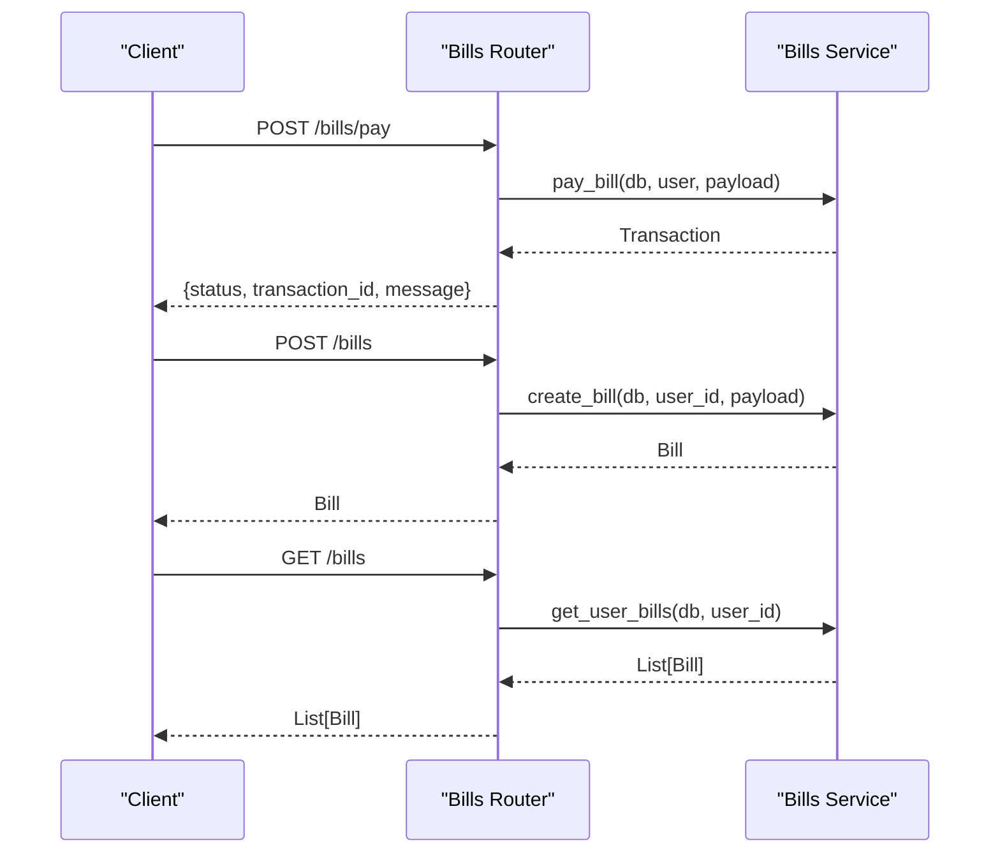
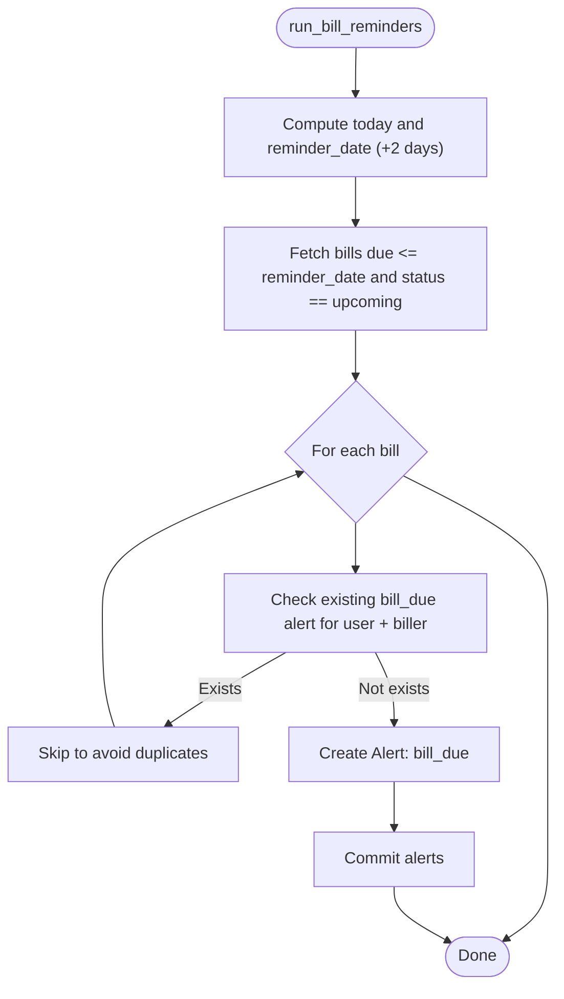
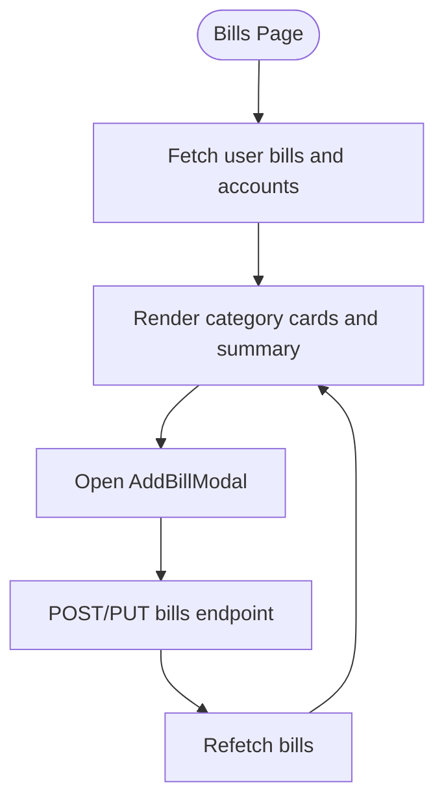
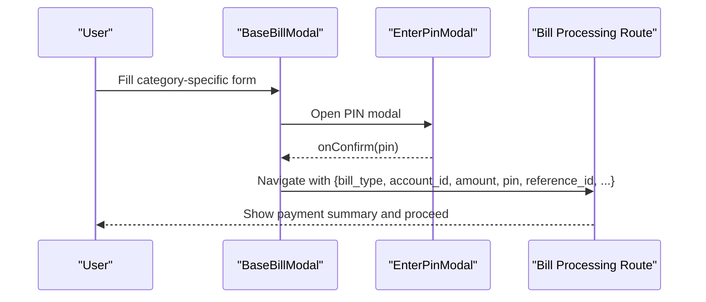
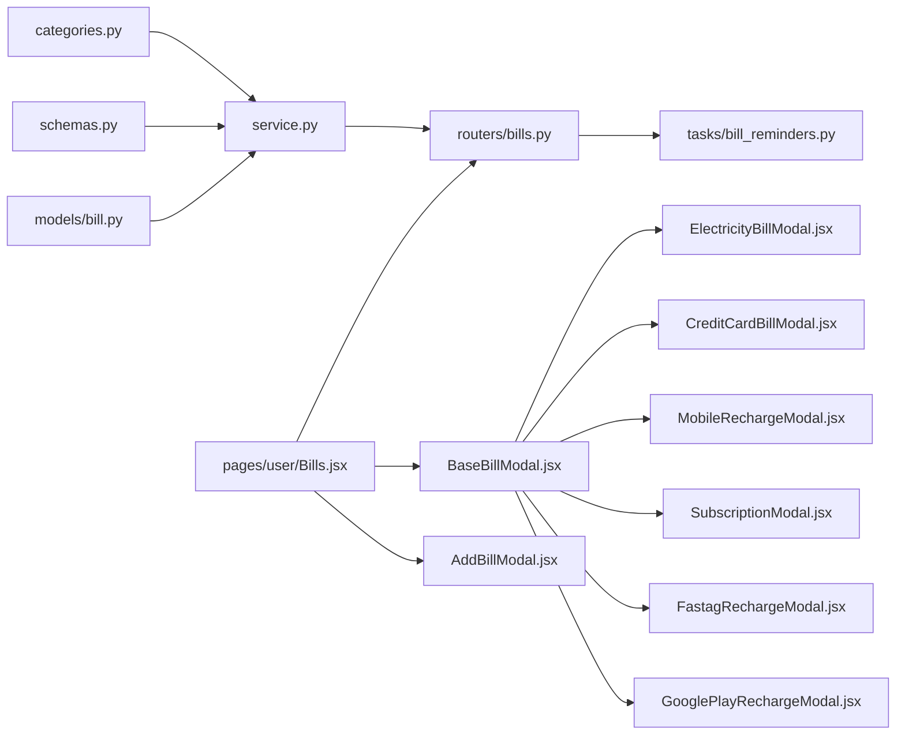

# Bill Payment System

<cite>
**Referenced Files in This Document**
- [categories.py](file://backend/app/bills/categories.py)
- [service.py](file://backend/app/bills/service.py)
- [schemas.py](file://backend/app/bills/schemas.py)
- [router.py](file://backend/app/bills/router.py)
- [bill.py](file://backend/app/models/bill.py)
- [bill_reminders.py](file://backend/app/tasks/bill_reminders.py)
- [Bills.jsx](file://frontend/src/pages/user/Bills.jsx)
- [AddBillModal.jsx](file://frontend/src/components/user/bills/AddBillModal.jsx)
- [BaseBillModal.jsx](file://frontend/src/components/user/bills/BaseBillModal.jsx)
- [CreditCardBillModal.jsx](file://frontend/src/components/user/bills/CreditCardBillModal.jsx)
- [ElectricityBillModal.jsx](file://frontend/src/components/user/bills/ElectricityBillModal.jsx)
- [MobileRechargeModal.jsx](file://frontend/src/components/user/bills/MobileRechargeModal.jsx)
- [SubscriptionModal.jsx](file://frontend/src/components/user/bills/SubscriptionModal.jsx)
- [FastagRechargeModal.jsx](file://frontend/src/components/user/bills/FastagRechargeModal.jsx)
- [GooglePlayRechargeModal.jsx](file://frontend/src/components/user/bills/GooglePlayRechargeModal.jsx)
</cite>

## Table of Contents
1. [Introduction](#introduction)
2. [Project Structure](#project-structure)
3. [Core Components](#core-components)
4. [Architecture Overview](#architecture-overview)
5. [Detailed Component Analysis](#detailed-component-analysis)
6. [Dependency Analysis](#dependency-analysis)
7. [Performance Considerations](#performance-considerations)
8. [Troubleshooting Guide](#troubleshooting-guide)
9. [Conclusion](#conclusion)
10. [Appendices](#appendices)

## Introduction
This document describes the Bill Payment System, covering bill creation, payment processing, reminders, and frontend management interfaces. It explains supported bill categories (credit cards, electricity, mobile, subscriptions, FASTag, Google Play), payment scheduling via recurring reminders, and the end-to-end flow from user selection to payment confirmation and transaction recording.

## Project Structure
The system comprises:
- Backend: bill categories, service layer, models, API routes, and reminder tasks
- Frontend: bill management page and category-specific modals for bill/recharge flows

**Diagram sources**
- [router.py:1-81](file://backend/app/bills/router.py#L1-L81)
- [service.py:1-166](file://backend/app/bills/service.py#L1-L166)
- [bill.py:18-45](file://backend/app/models/bill.py#L18-L45)
- [categories.py:9-34](file://backend/app/bills/categories.py#L9-L34)
- [schemas.py:7-50](file://backend/app/bills/schemas.py#L7-L50)
- [bill_reminders.py:24-57](file://backend/app/tasks/bill_reminders.py#L24-L57)
- [Bills.jsx:1-439](file://frontend/src/pages/user/Bills.jsx#L1-L439)
- [BaseBillModal.jsx:1-49](file://frontend/src/components/user/bills/BaseBillModal.jsx#L1-L49)
- [ElectricityBillModal.jsx:1-136](file://frontend/src/components/user/bills/ElectricityBillModal.jsx#L1-L136)
- [CreditCardBillModal.jsx:1-86](file://frontend/src/components/user/bills/CreditCardBillModal.jsx#L1-L86)
- [MobileRechargeModal.jsx:1-182](file://frontend/src/components/user/bills/MobileRechargeModal.jsx#L1-L182)
- [SubscriptionModal.jsx:1-194](file://frontend/src/components/user/bills/SubscriptionModal.jsx#L1-L194)
- [FastagRechargeModal.jsx:1-89](file://frontend/src/components/user/bills/FastagRechargeModal.jsx#L1-L89)
- [GooglePlayRechargeModal.jsx:1-64](file://frontend/src/components/user/bills/GooglePlayRechargeModal.jsx#L1-L64)
- [AddBillModal.jsx:1-174](file://frontend/src/components/user/bills/AddBillModal.jsx#L1-L174)

**Section sources**
- [router.py:1-81](file://backend/app/bills/router.py#L1-L81)
- [service.py:1-166](file://backend/app/bills/service.py#L1-L166)
- [bill.py:18-45](file://backend/app/models/bill.py#L18-L45)
- [categories.py:9-34](file://backend/app/bills/categories.py#L9-L34)
- [schemas.py:7-50](file://backend/app/bills/schemas.py#L7-L50)
- [bill_reminders.py:24-57](file://backend/app/tasks/bill_reminders.py#L24-L57)
- [Bills.jsx:1-439](file://frontend/src/pages/user/Bills.jsx#L1-L439)
- [BaseBillModal.jsx:1-49](file://frontend/src/components/user/bills/BaseBillModal.jsx#L1-L49)
- [ElectricityBillModal.jsx:1-136](file://frontend/src/components/user/bills/ElectricityBillModal.jsx#L1-L136)
- [CreditCardBillModal.jsx:1-86](file://frontend/src/components/user/bills/CreditCardBillModal.jsx#L1-L86)
- [MobileRechargeModal.jsx:1-182](file://frontend/src/components/user/bills/MobileRechargeModal.jsx#L1-L182)
- [SubscriptionModal.jsx:1-194](file://frontend/src/components/user/bills/SubscriptionModal.jsx#L1-L194)
- [FastagRechargeModal.jsx:1-89](file://frontend/src/components/user/bills/FastagRechargeModal.jsx#L1-L89)
- [GooglePlayRechargeModal.jsx:1-64](file://frontend/src/components/user/bills/GooglePlayRechargeModal.jsx#L1-L64)
- [AddBillModal.jsx:1-174](file://frontend/src/components/user/bills/AddBillModal.jsx#L1-L174)

## Core Components
- Bill categories: central registry of supported bill types and their metadata
- Bill model: persistence of bill records with status and auto-pay flag
- Bill service: payment processing, validation, transaction creation, reward points, and optional bill marking as paid
- Bill router: API endpoints for payments, reminders, CRUD operations on bills
- Reminder task: creates bill due alerts for upcoming bills
- Frontend bills page: lists, adds/edit/removes bills and selects bill/recharge categories
- Category modals: guided flows for electricity, credit card, mobile, subscriptions, FASTag, and Google Play

**Section sources**
- [categories.py:9-34](file://backend/app/bills/categories.py#L9-L34)
- [bill.py:18-45](file://backend/app/models/bill.py#L18-L45)
- [service.py:102-166](file://backend/app/bills/service.py#L102-L166)
- [router.py:26-81](file://backend/app/bills/router.py#L26-L81)
- [bill_reminders.py:24-57](file://backend/app/tasks/bill_reminders.py#L24-L57)
- [Bills.jsx:50-85](file://frontend/src/pages/user/Bills.jsx#L50-L85)
- [AddBillModal.jsx:4-42](file://frontend/src/components/user/bills/AddBillModal.jsx#L4-L42)

## Architecture Overview
The system integrates frontend modals with backend APIs and tasks:
- Users select a bill/recharge category in the frontend
- Modals collect inputs and pass them to the payment confirmation route
- The backend validates account, PIN, and balance, then creates a transaction and optionally marks a bill as paid
- Reminders are generated for upcoming bills

**Diagram sources**
- [router.py:26-37](file://backend/app/bills/router.py#L26-L37)
- [service.py:102-124](file://backend/app/bills/service.py#L102-L124)
- [BaseBillModal.jsx:23-43](file://frontend/src/components/user/bills/BaseBillModal.jsx#L23-L43)
- [CreditCardBillModal.jsx:60-80](file://frontend/src/components/user/bills/CreditCardBillModal.jsx#L60-L80)
- [ElectricityBillModal.jsx:24-36](file://frontend/src/components/user/bills/ElectricityBillModal.jsx#L24-L36)
- [MobileRechargeModal.jsx:29-42](file://frontend/src/components/user/bills/MobileRechargeModal.jsx#L29-L42)
- [SubscriptionModal.jsx:47-60](file://frontend/src/components/user/bills/SubscriptionModal.jsx#L47-L60)
- [FastagRechargeModal.jsx:20-30](file://frontend/src/components/user/bills/FastagRechargeModal.jsx#L20-L30)
- [GooglePlayRechargeModal.jsx:18-28](file://frontend/src/components/user/bills/GooglePlayRechargeModal.jsx#L18-L28)

## Detailed Component Analysis

### Bill Categories
- Purpose: single source of truth for bill types and their mapping to transaction categories and descriptions
- Supported categories: electricity, mobile_recharge, subscription, credit_card, fastag, google_play

**Diagram sources**
- [categories.py:35-38](file://backend/app/bills/categories.py#L35-L38)

**Section sources**
- [categories.py:9-34](file://backend/app/bills/categories.py#L9-L34)

### Bill Model
- Fields: user association, biller name, due date, amount, status, account linkage, auto-pay flag
- Status lifecycle: upcoming → paid/overdue based on processing and reminders

**Diagram sources**
- [bill.py:18-45](file://backend/app/models/bill.py#L18-L45)

**Section sources**
- [bill.py:18-45](file://backend/app/models/bill.py#L18-L45)

### Bill Service
- Responsibilities:
  - Validate bill type against categories
  - Validate user account ownership and PIN
  - Validate sufficient balance
  - Build transaction payload with category and description
  - Create transaction via shared transaction service
  - Award reward points for bill payment
  - Optionally mark a bill as paid if provided
- Error handling: explicit HTTP exceptions for invalid inputs, missing account/PIN, insufficient funds, and transaction failures

**Diagram sources**
- [service.py:102-124](file://backend/app/bills/service.py#L102-L124)
- [service.py:35-38](file://backend/app/bills/service.py#L35-L38)
- [service.py:41-47](file://backend/app/bills/service.py#L41-L47)
- [service.py:50-52](file://backend/app/bills/service.py#L50-L52)
- [service.py:68-80](file://backend/app/bills/service.py#L68-L80)
- [service.py:83-89](file://backend/app/bills/service.py#L83-L89)

**Section sources**
- [service.py:102-124](file://backend/app/bills/service.py#L102-L124)
- [service.py:35-38](file://backend/app/bills/service.py#L35-L38)
- [service.py:41-47](file://backend/app/bills/service.py#L41-L47)
- [service.py:50-52](file://backend/app/bills/service.py#L50-L52)
- [service.py:68-80](file://backend/app/bills/service.py#L68-L80)
- [service.py:83-89](file://backend/app/bills/service.py#L83-L89)

### Bill Router
- Endpoints:
  - POST /bills/pay: process bill payment
  - POST /bills/run-reminders: trigger reminder task
  - POST /bills: create bill
  - GET /bills: list user bills
  - PUT /bills/{bill_id}: update bill
  - DELETE /bills/{bill_id}: delete bill

**Diagram sources**
- [router.py:26-81](file://backend/app/bills/router.py#L26-L81)
- [service.py:127-139](file://backend/app/bills/service.py#L127-L139)
- [service.py:142-143](file://backend/app/bills/service.py#L142-L143)
- [service.py:146-156](file://backend/app/bills/service.py#L146-L156)
- [service.py:159-166](file://backend/app/bills/service.py#L159-L166)

**Section sources**
- [router.py:26-81](file://backend/app/bills/router.py#L26-L81)

### Bill Reminder Task
- Purpose: proactively create alerts for upcoming bills
- Logic: for bills due within two days and status upcoming, create a unique bill_due alert per user and biller

**Diagram sources**
- [bill_reminders.py:24-57](file://backend/app/tasks/bill_reminders.py#L24-L57)

**Section sources**
- [bill_reminders.py:24-57](file://backend/app/tasks/bill_reminders.py#L24-L57)

### Frontend Bill Management
- Bills page:
  - Lists user-added bills with status calculation (Upcoming/Overdue/Paid)
  - Shows totals and counts (Total Due, Upcoming, Auto-Pay Enabled)
  - Allows adding/editing bills via AddBillModal
  - Provides quick-access “Most Used” category cards
- AddBillModal:
  - Captures biller name, due date, amount, account, status, and auto-pay flag
  - Persists via API on add/update

**Diagram sources**
- [Bills.jsx:50-85](file://frontend/src/pages/user/Bills.jsx#L50-L85)
- [Bills.jsx:371-415](file://frontend/src/pages/user/Bills.jsx#L371-L415)
- [AddBillModal.jsx:35-41](file://frontend/src/components/user/bills/AddBillModal.jsx#L35-L41)

**Section sources**
- [Bills.jsx:50-85](file://frontend/src/pages/user/Bills.jsx#L50-L85)
- [Bills.jsx:264-337](file://frontend/src/pages/user/Bills.jsx#L264-L337)
- [Bills.jsx:371-415](file://frontend/src/pages/user/Bills.jsx#L371-L415)
- [AddBillModal.jsx:4-42](file://frontend/src/components/user/bills/AddBillModal.jsx#L4-L42)

### Category-Specific Modals
- BaseBillModal:
  - Standardized flow to open PIN modal and navigate to bill processing with collected data
- ElectricityBillModal:
  - Multi-step: consumer number → provider → amount → confirm
- CreditCardBillModal:
  - Collect last 4 digits and amount, then navigate to bill processing
- MobileRechargeModal:
  - Multi-step: mobile → operator → plan → confirm
- SubscriptionModal:
  - Multi-step: service → subscriber ID → plan → confirm
- FastagRechargeModal:
  - Two steps: vehicle number → amount → confirm
- GooglePlayRechargeModal:
  - Email and amount → confirm

**Diagram sources**
- [BaseBillModal.jsx:23-43](file://frontend/src/components/user/bills/BaseBillModal.jsx#L23-L43)
- [ElectricityBillModal.jsx:24-36](file://frontend/src/components/user/bills/ElectricityBillModal.jsx#L24-L36)
- [CreditCardBillModal.jsx:60-80](file://frontend/src/components/user/bills/CreditCardBillModal.jsx#L60-L80)
- [MobileRechargeModal.jsx:29-42](file://frontend/src/components/user/bills/MobileRechargeModal.jsx#L29-L42)
- [SubscriptionModal.jsx:47-60](file://frontend/src/components/user/bills/SubscriptionModal.jsx#L47-L60)
- [FastagRechargeModal.jsx:20-30](file://frontend/src/components/user/bills/FastagRechargeModal.jsx#L20-L30)
- [GooglePlayRechargeModal.jsx:18-28](file://frontend/src/components/user/bills/GooglePlayRechargeModal.jsx#L18-L28)

**Section sources**
- [BaseBillModal.jsx:1-49](file://frontend/src/components/user/bills/BaseBillModal.jsx#L1-L49)
- [ElectricityBillModal.jsx:1-136](file://frontend/src/components/user/bills/ElectricityBillModal.jsx#L1-L136)
- [CreditCardBillModal.jsx:1-86](file://frontend/src/components/user/bills/CreditCardBillModal.jsx#L1-L86)
- [MobileRechargeModal.jsx:1-182](file://frontend/src/components/user/bills/MobileRechargeModal.jsx#L1-L182)
- [SubscriptionModal.jsx:1-194](file://frontend/src/components/user/bills/SubscriptionModal.jsx#L1-L194)
- [FastagRechargeModal.jsx:1-89](file://frontend/src/components/user/bills/FastagRechargeModal.jsx#L1-L89)
- [GooglePlayRechargeModal.jsx:1-64](file://frontend/src/components/user/bills/GooglePlayRechargeModal.jsx#L1-L64)

## Dependency Analysis
- Backend dependencies:
  - bills.service depends on categories, schemas, models, transactions service, rewards service, and hashing utilities
  - bills.router depends on bills.service and triggers reminder task
  - reminder task depends on bill and alert models
- Frontend dependencies:
  - Bills page composes category modals and AddBillModal
  - Category modals rely on BaseBillModal and EnterPinModal navigation

**Diagram sources**
- [service.py:16-24](file://backend/app/bills/service.py#L16-L24)
- [router.py:12-17](file://backend/app/bills/router.py#L12-L17)
- [bill_reminders.py:20-22](file://backend/app/tasks/bill_reminders.py#L20-L22)
- [Bills.jsx:7-14](file://frontend/src/pages/user/Bills.jsx#L7-L14)
- [BaseBillModal.jsx:1-5](file://frontend/src/components/user/bills/BaseBillModal.jsx#L1-L5)

**Section sources**
- [service.py:16-24](file://backend/app/bills/service.py#L16-L24)
- [router.py:12-17](file://backend/app/bills/router.py#L12-L17)
- [bill_reminders.py:20-22](file://backend/app/tasks/bill_reminders.py#L20-L22)
- [Bills.jsx:7-14](file://frontend/src/pages/user/Bills.jsx#L7-L14)
- [BaseBillModal.jsx:1-5](file://frontend/src/components/user/bills/BaseBillModal.jsx#L1-L5)

## Performance Considerations
- Validation early exits reduce unnecessary work (PIN and balance checks before transaction creation)
- Reminder task filters bills efficiently using due date and status
- Frontend memoization minimizes re-renders for static lists
- Recommendations:
  - Index bill.due_date and bill.status for efficient reminder queries
  - Batch reminder alert creation to reduce round-trips
  - Debounce frontend bill list refresh after updates

## Troubleshooting Guide
Common issues and resolutions:
- Invalid bill type: ensure bill_type matches supported categories
- Account not found: verify account_id belongs to current user
- Invalid PIN: confirm four-digit PIN matches hashed value
- Insufficient balance: ensure account balance covers amount
- Transaction failure: check transaction service availability and logs
- Bill not found: verify bill_id and user ownership
- Duplicate reminders: reminder task avoids duplicates by checking existing alerts

**Section sources**
- [service.py:26-32](file://backend/app/bills/service.py#L26-L32)
- [service.py:105-115](file://backend/app/bills/service.py#L105-L115)
- [bill_reminders.py:38-46](file://backend/app/tasks/bill_reminders.py#L38-L46)

## Conclusion
The Bill Payment System provides a modular, extensible solution for bill and recharge management. It enforces strong validation, integrates with the transaction engine, supports recurring reminders, and offers intuitive frontend modals for diverse bill categories. The design cleanly separates concerns between frontend UX, backend services, and reminder orchestration.

## Appendices

### API Definitions
- POST /bills/pay
  - Request body: BillPaymentCreate (bill_id, account_id, amount, pin, bill_type, reference_id, provider)
  - Response: { status, transaction_id, message }
- POST /bills
  - Request body: BillCreate (biller_name, due_date, amount_due, account_id, auto_pay)
  - Response: BillOut
- GET /bills
  - Response: List[BillOut]
- PUT /bills/{bill_id}
  - Request body: BillUpdate (optional fields)
  - Response: BillOut
- DELETE /bills/{bill_id}
  - Response: { status: "deleted" }
- POST /bills/run-reminders
  - Response: { status: "bill reminders executed" }

**Section sources**
- [router.py:26-81](file://backend/app/bills/router.py#L26-L81)
- [schemas.py:7-50](file://backend/app/bills/schemas.py#L7-L50)

### Example Workflows

#### Setting up a recurring bill reminder
- Add a bill via POST /bills with auto_pay enabled
- Invoke POST /bills/run-reminders to create alerts for upcoming due dates
- Monitor alerts for bill_due notifications

**Section sources**
- [router.py:40-43](file://backend/app/bills/router.py#L40-L43)
- [bill_reminders.py:24-57](file://backend/app/tasks/bill_reminders.py#L24-L57)

#### Processing a bill payment
- Select category in frontend and complete modal steps
- Confirm PIN in EnterPinModal
- Backend validates account/PIN/balance and creates transaction
- Optional: backend marks the bill as paid if bill_id is provided

**Section sources**
- [BaseBillModal.jsx:23-43](file://frontend/src/components/user/bills/BaseBillModal.jsx#L23-L43)
- [service.py:102-124](file://backend/app/bills/service.py#L102-L124)

#### Managing bill reminders
- The reminder task runs daily or on-demand to create bill_due alerts for upcoming bills
- Prevents duplicate alerts by checking existing entries

**Section sources**
- [bill_reminders.py:24-57](file://backend/app/tasks/bill_reminders.py#L24-L57)