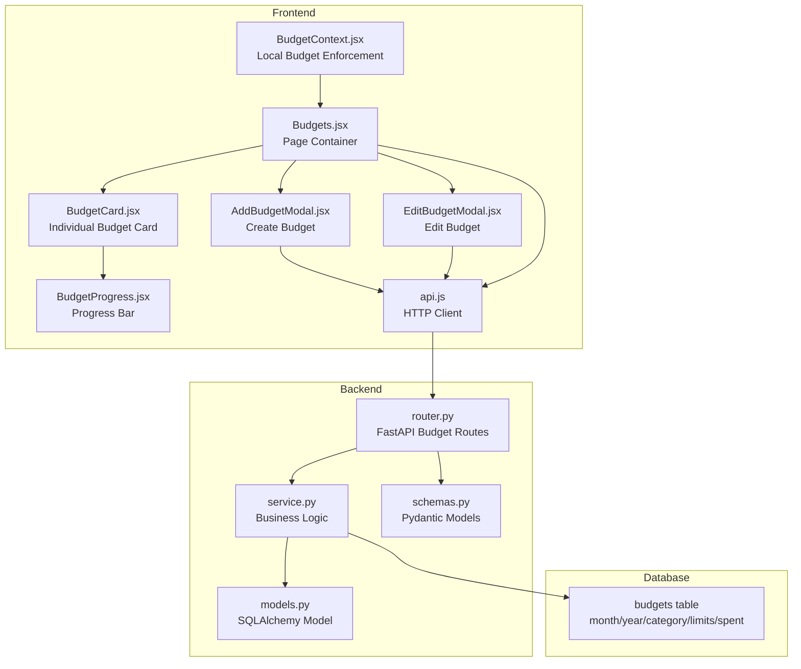
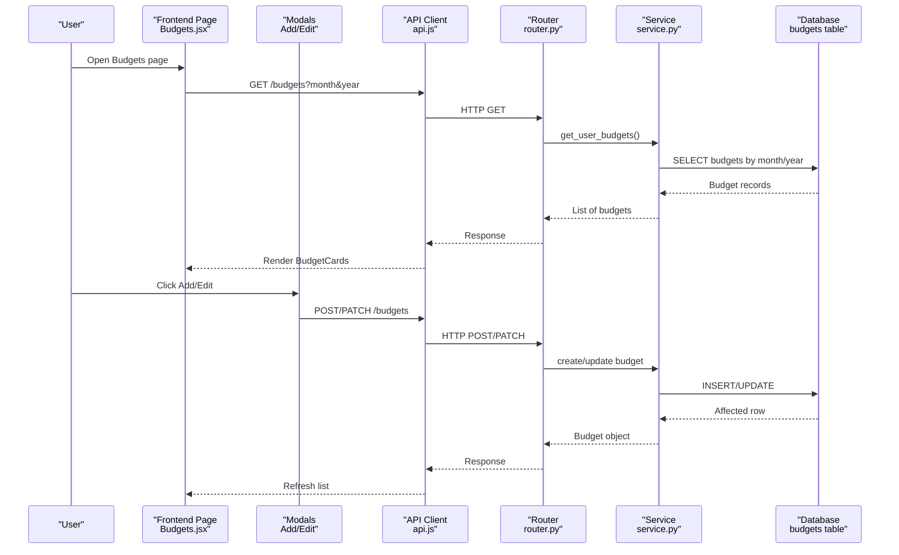
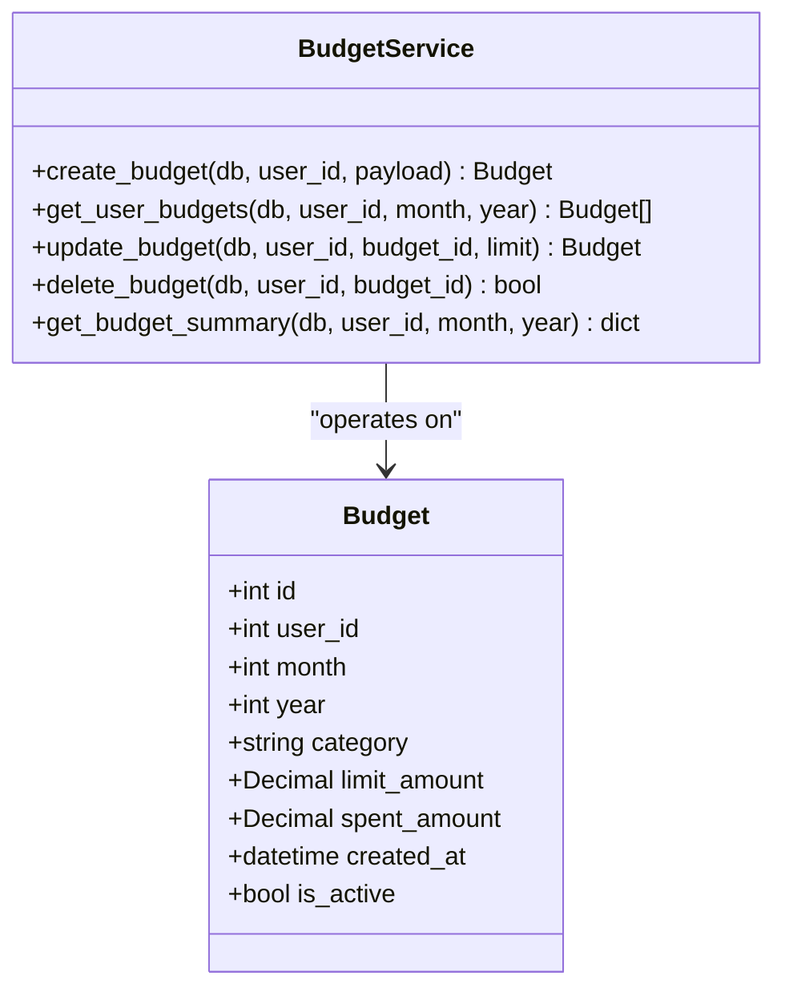
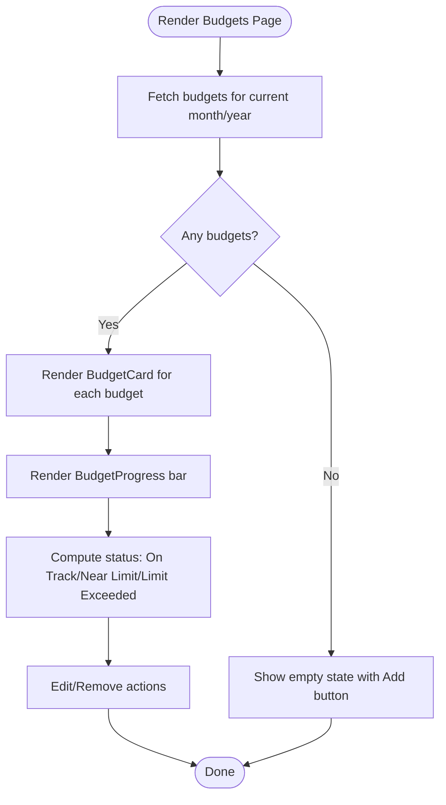
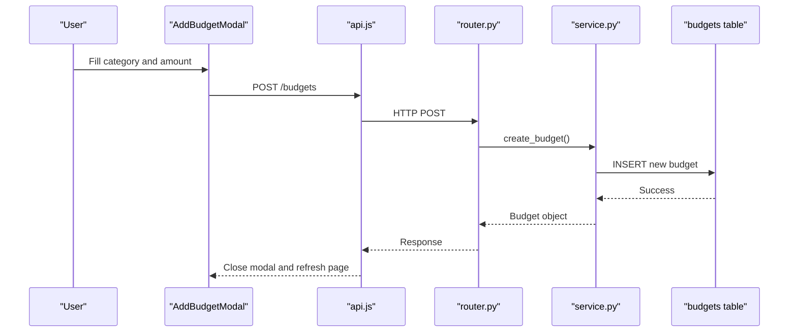
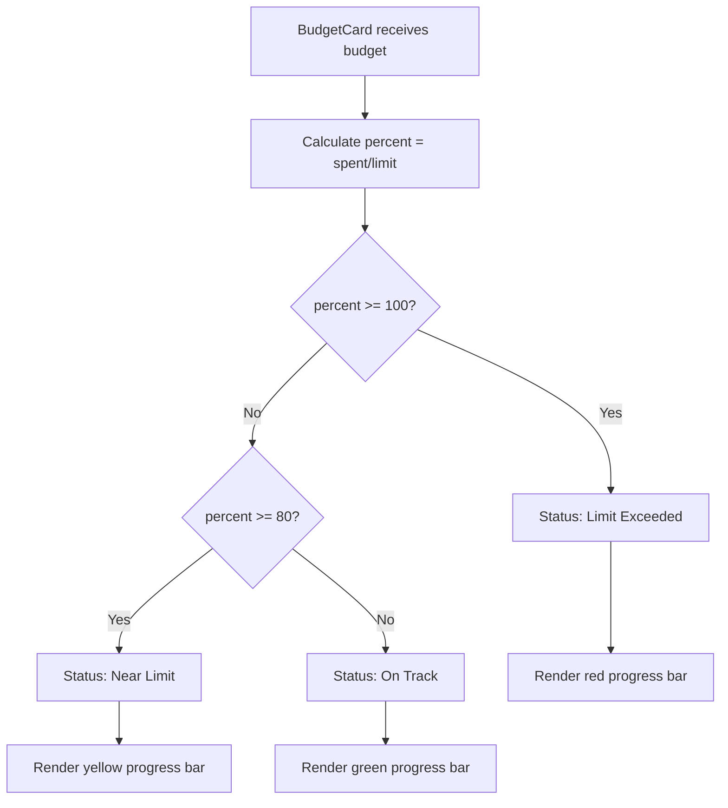
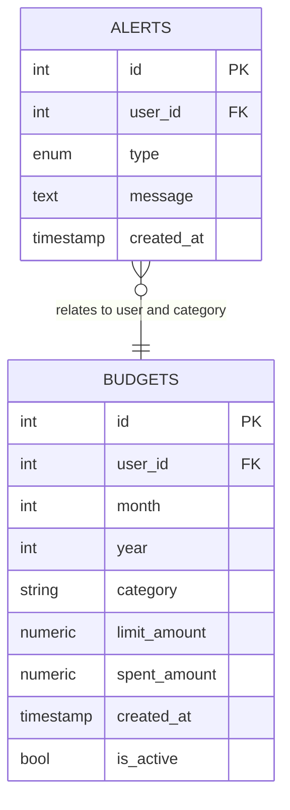
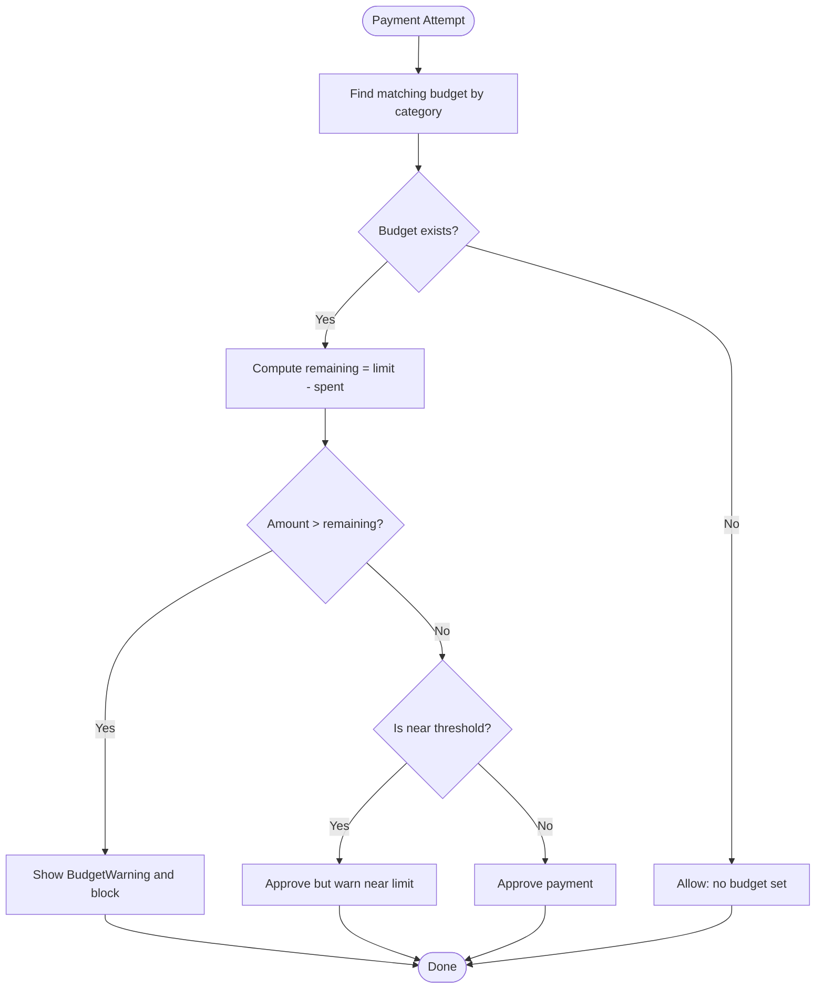
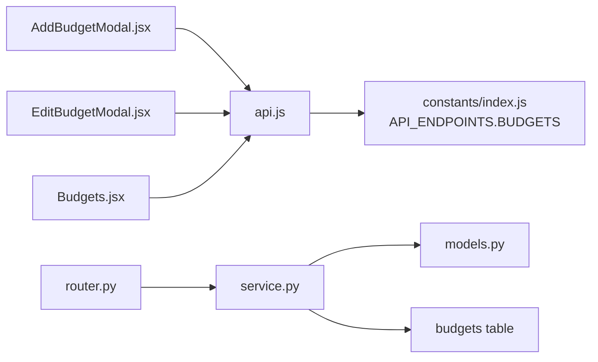

# Budget Management

<cite>
**Referenced Files in This Document**
- [models.py](file://backend/app/budgets/models.py)
- [service.py](file://backend/app/budgets/service.py)
- [schemas.py](file://backend/app/budgets/schemas.py)
- [router.py](file://backend/app/budgets/router.py)
- [database-schema.md](file://docs/database-schema.md)
- [BudgetCard.jsx](file://frontend/src/components/user/budgets/BudgetCard.jsx)
- [BudgetProgress.jsx](file://frontend/src/components/user/budgets/BudgetProgress.jsx)
- [AddBudgetModal.jsx](file://frontend/src/components/user/budgets/AddBudgetModal.jsx)
- [EditBudgetModal.jsx](file://frontend/src/components/user/budgets/EditBudgetModal.jsx)
- [Budgets.jsx](file://frontend/src/pages/user/Budgets.jsx)
- [BudgetContext.jsx](file://frontend/src/context/BudgetContext.jsx)
- [BudgetWarning.jsx](file://frontend/src/components/user/budgets/BudgetWarning.jsx)
- [api.js](file://frontend/src/services/api.js)
- [index.js](file://frontend/src/constants/index.js)
</cite>

## Table of Contents
1. [Introduction](#introduction)
2. [Project Structure](#project-structure)
3. [Core Components](#core-components)
4. [Architecture Overview](#architecture-overview)
5. [Detailed Component Analysis](#detailed-component-analysis)
6. [Dependency Analysis](#dependency-analysis)
7. [Performance Considerations](#performance-considerations)
8. [Troubleshooting Guide](#troubleshooting-guide)
9. [Conclusion](#conclusion)
10. [Appendices](#appendices)

## Introduction
This document explains the Budget Management feature of the Modern Digital Banking Dashboard. It covers budget creation, monthly budget cycles, spending tracking, and alert systems. It documents the backend models and services, frontend components for visualization, and provides practical examples for setting up budgets, enforcing limits, tracking progress, and triggering automated alerts when budgets approach limits.

## Project Structure
The Budget Management feature spans backend and frontend components:

- Backend: SQLAlchemy model, Pydantic schemas, FastAPI router, and service layer for CRUD operations and summaries.
- Frontend: Pages, modals, cards, and context for budget visualization, editing, and enforcement.
- Database: A dedicated budgets table supporting monthly category-based budgets.

**Diagram sources**
- [router.py:1-81](file://backend/app/budgets/router.py#L1-L81)
- [service.py:1-77](file://backend/app/budgets/service.py#L1-L77)
- [models.py:1-22](file://backend/app/budgets/models.py#L1-L22)
- [schemas.py:1-23](file://backend/app/budgets/schemas.py#L1-L23)
- [Budgets.jsx:1-191](file://frontend/src/pages/user/Budgets.jsx#L1-L191)
- [BudgetCard.jsx:1-70](file://frontend/src/components/user/budgets/BudgetCard.jsx#L1-L70)
- [BudgetProgress.jsx:1-20](file://frontend/src/components/user/budgets/BudgetProgress.jsx#L1-L20)
- [AddBudgetModal.jsx:1-273](file://frontend/src/components/user/budgets/AddBudgetModal.jsx#L1-L273)
- [EditBudgetModal.jsx:1-85](file://frontend/src/components/user/budgets/EditBudgetModal.jsx#L1-L85)
- [BudgetContext.jsx:1-63](file://frontend/src/context/BudgetContext.jsx#L1-L63)
- [api.js:1-73](file://frontend/src/services/api.js#L1-L73)
- [database-schema.md:64-78](file://docs/database-schema.md#L64-L78)

**Section sources**
- [router.py:1-81](file://backend/app/budgets/router.py#L1-L81)
- [service.py:1-77](file://backend/app/budgets/service.py#L1-L77)
- [models.py:1-22](file://backend/app/budgets/models.py#L1-L22)
- [schemas.py:1-23](file://backend/app/budgets/schemas.py#L1-L23)
- [database-schema.md:64-78](file://docs/database-schema.md#L64-L78)
- [Budgets.jsx:1-191](file://frontend/src/pages/user/Budgets.jsx#L1-L191)
- [BudgetCard.jsx:1-70](file://frontend/src/components/user/budgets/BudgetCard.jsx#L1-L70)
- [BudgetProgress.jsx:1-20](file://frontend/src/components/user/budgets/BudgetProgress.jsx#L1-L20)
- [AddBudgetModal.jsx:1-273](file://frontend/src/components/user/budgets/AddBudgetModal.jsx#L1-L273)
- [EditBudgetModal.jsx:1-85](file://frontend/src/components/user/budgets/EditBudgetModal.jsx#L1-L85)
- [BudgetContext.jsx:1-63](file://frontend/src/context/BudgetContext.jsx#L1-L63)
- [api.js:1-73](file://frontend/src/services/api.js#L1-L73)

## Core Components
- Backend Budget Model: Defines monthly budgets per category with limit and spent amounts.
- Service Layer: Handles creation, retrieval, updates, deletions, and summary aggregation.
- Router: Exposes REST endpoints for budget management.
- Frontend Page: Lists budgets, shows totals, and renders cards with progress.
- Frontend Modals: Create and edit budgets via forms.
- Frontend Context: Provides local budget enforcement logic for near-limit and exceeded states.
- API Client: Centralized HTTP client for backend communication.

**Section sources**
- [models.py:6-22](file://backend/app/budgets/models.py#L6-L22)
- [service.py:15-77](file://backend/app/budgets/service.py#L15-L77)
- [router.py:26-81](file://backend/app/budgets/router.py#L26-L81)
- [Budgets.jsx:19-65](file://frontend/src/pages/user/Budgets.jsx#L19-L65)
- [AddBudgetModal.jsx:65-104](file://frontend/src/components/user/budgets/AddBudgetModal.jsx#L65-L104)
- [EditBudgetModal.jsx:17-24](file://frontend/src/components/user/budgets/EditBudgetModal.jsx#L17-L24)
- [BudgetContext.jsx:22-53](file://frontend/src/context/BudgetContext.jsx#L22-L53)
- [api.js:54-57](file://frontend/src/services/api.js#L54-L57)

## Architecture Overview
The Budget Management feature follows a layered architecture:
- Frontend pages and components communicate with the backend via HTTP requests.
- Backend routes delegate to service functions that operate on the SQLAlchemy model.
- The database persists budgets with monthly granularity and category grouping.
- Local context enforces budget thresholds for immediate feedback during payments.

**Diagram sources**
- [Budgets.jsx:19-35](file://frontend/src/pages/user/Budgets.jsx#L19-L35)
- [AddBudgetModal.jsx:86-103](file://frontend/src/components/user/budgets/AddBudgetModal.jsx#L86-L103)
- [EditBudgetModal.jsx:17-24](file://frontend/src/components/user/budgets/EditBudgetModal.jsx#L17-L24)
- [api.js:54-57](file://frontend/src/services/api.js#L54-L57)
- [router.py:26-81](file://backend/app/budgets/router.py#L26-L81)
- [service.py:15-48](file://backend/app/budgets/service.py#L15-L48)
- [database-schema.md:64-78](file://docs/database-schema.md#L64-L78)

## Detailed Component Analysis

### Backend Budget Model and Service
The backend defines a budgets table and service functions to manage monthly category budgets.

Key behaviors:
- Monthly cycle: budgets are filtered by month and year.
- Category uniqueness: prevents duplicate budgets per category per month.
- Active flag: soft-deletion via is_active.
- Summary aggregation: computes total limit, total spent, and remaining across active budgets.

**Diagram sources**
- [models.py:6-22](file://backend/app/budgets/models.py#L6-L22)
- [service.py:7-77](file://backend/app/budgets/service.py#L7-L77)

**Section sources**
- [models.py:6-22](file://backend/app/budgets/models.py#L6-L22)
- [service.py:15-77](file://backend/app/budgets/service.py#L15-L77)
- [database-schema.md:64-78](file://docs/database-schema.md#L64-L78)

### Backend Router Endpoints
The router exposes endpoints for creating, listing, editing, deleting, and summarizing budgets.

Endpoints:
- POST /budgets: Create a budget for the current month and category.
- GET /budgets: List budgets for a given month and year.
- GET /budgets/summary: Get total limit, spent, and remaining for the month/year.
- PATCH /budgets/{budget_id}: Update budget limit.
- DELETE /budgets/{budget_id}: Soft-delete budget.

Error handling:
- Returns 400 when attempting to create a duplicate budget.
- Returns 404 when editing/deleting a non-existent budget.

**Section sources**
- [router.py:26-81](file://backend/app/budgets/router.py#L26-L81)
- [schemas.py:4-23](file://backend/app/budgets/schemas.py#L4-L23)

### Frontend Budget Visualization
The frontend page lists budgets, computes totals, and renders cards with progress bars.

**Diagram sources**
- [Budgets.jsx:19-65](file://frontend/src/pages/user/Budgets.jsx#L19-L65)
- [BudgetCard.jsx:4-46](file://frontend/src/components/user/budgets/BudgetCard.jsx#L4-L46)
- [BudgetProgress.jsx:1-17](file://frontend/src/components/user/budgets/BudgetProgress.jsx#L1-L17)

**Section sources**
- [Budgets.jsx:19-65](file://frontend/src/pages/user/Budgets.jsx#L19-L65)
- [BudgetCard.jsx:1-70](file://frontend/src/components/user/budgets/BudgetCard.jsx#L1-L70)
- [BudgetProgress.jsx:1-20](file://frontend/src/components/user/budgets/BudgetProgress.jsx#L1-L20)

### Budget Creation and Editing
Users can create budgets via a modal and edit them afterward.

**Diagram sources**
- [AddBudgetModal.jsx:65-104](file://frontend/src/components/user/budgets/AddBudgetModal.jsx#L65-L104)
- [api.js:54-57](file://frontend/src/services/api.js#L54-L57)
- [router.py:26-35](file://backend/app/budgets/router.py#L26-L35)
- [service.py:15-33](file://backend/app/budgets/service.py#L15-L33)
- [database-schema.md:64-78](file://docs/database-schema.md#L64-L78)

**Section sources**
- [AddBudgetModal.jsx:65-104](file://frontend/src/components/user/budgets/AddBudgetModal.jsx#L65-L104)
- [EditBudgetModal.jsx:17-24](file://frontend/src/components/user/budgets/EditBudgetModal.jsx#L17-L24)
- [api.js:54-57](file://frontend/src/services/api.js#L54-L57)
- [router.py:58-80](file://backend/app/budgets/router.py#L58-L80)
- [service.py:40-58](file://backend/app/budgets/service.py#L40-L58)

### Spending Tracking and Progress
The frontend calculates spent vs limit and displays progress with color-coded status.

**Diagram sources**
- [BudgetCard.jsx:4-46](file://frontend/src/components/user/budgets/BudgetCard.jsx#L4-L46)
- [BudgetProgress.jsx:2-7](file://frontend/src/components/user/budgets/BudgetProgress.jsx#L2-L7)

**Section sources**
- [BudgetCard.jsx:1-70](file://frontend/src/components/user/budgets/BudgetCard.jsx#L1-L70)
- [BudgetProgress.jsx:1-20](file://frontend/src/components/user/budgets/BudgetProgress.jsx#L1-L20)

### Alert Systems
The database schema includes an alerts table with a budget_exceeded type, enabling automated alerts when budgets approach limits.

Implementation guidance:
- Backend service can compute remaining amounts and compare against thresholds to insert alerts of type budget_exceeded.
- Frontend can poll or subscribe to alerts and render notifications accordingly.

**Diagram sources**
- [database-schema.md:112-123](file://docs/database-schema.md#L112-L123)
- [models.py:6-22](file://backend/app/budgets/models.py#L6-L22)

**Section sources**
- [database-schema.md:112-123](file://docs/database-schema.md#L112-L123)
- [service.py:61-77](file://backend/app/budgets/service.py#L61-L77)

### Local Budget Enforcement (Optional)
The BudgetContext provides a lightweight, client-side mechanism to enforce budgets before transactions.

**Diagram sources**
- [BudgetContext.jsx:22-53](file://frontend/src/context/BudgetContext.jsx#L22-L53)
- [BudgetWarning.jsx:1-27](file://frontend/src/components/user/budgets/BudgetWarning.jsx#L1-L27)

**Section sources**
- [BudgetContext.jsx:1-63](file://frontend/src/context/BudgetContext.jsx#L1-L63)
- [BudgetWarning.jsx:1-30](file://frontend/src/components/user/budgets/BudgetWarning.jsx#L1-L30)

## Dependency Analysis
The frontend depends on centralized API endpoints and constants for routing and HTTP calls.

**Diagram sources**
- [AddBudgetModal.jsx:1-273](file://frontend/src/components/user/budgets/AddBudgetModal.jsx#L1-L273)
- [EditBudgetModal.jsx:1-85](file://frontend/src/components/user/budgets/EditBudgetModal.jsx#L1-L85)
- [Budgets.jsx:1-191](file://frontend/src/pages/user/Budgets.jsx#L1-L191)
- [api.js:54-57](file://frontend/src/services/api.js#L54-L57)
- [index.js:91-93](file://frontend/src/constants/index.js#L91-L93)
- [router.py:1-81](file://backend/app/budgets/router.py#L1-L81)
- [service.py:1-77](file://backend/app/budgets/service.py#L1-L77)
- [models.py:1-22](file://backend/app/budgets/models.py#L1-L22)
- [database-schema.md:64-78](file://docs/database-schema.md#L64-L78)

**Section sources**
- [api.js:54-57](file://frontend/src/services/api.js#L54-L57)
- [index.js:91-93](file://frontend/src/constants/index.js#L91-L93)
- [router.py:1-81](file://backend/app/budgets/router.py#L1-L81)
- [service.py:1-77](file://backend/app/budgets/service.py#L1-L77)
- [models.py:1-22](file://backend/app/budgets/models.py#L1-L22)

## Performance Considerations
- Database queries: Filtering by user_id, month, year, and category ensures efficient lookups. Consider adding composite indexes on (user_id, year, month, category) for optimal performance.
- Aggregation: The summary endpoint uses SQL aggregation to compute totals efficiently.
- Frontend rendering: Memoization and minimal re-renders help maintain responsiveness when listing many budgets.
- Network: Batch operations and caching can reduce repeated fetches for the same month/year.

## Troubleshooting Guide
Common issues and resolutions:
- Duplicate budget creation: The backend prevents creating multiple budgets for the same category in the same month. Ensure category selection is unique per month.
- Editing/deleting missing budgets: Returns 404 if the budget does not exist or is inactive. Verify budget_id and active status.
- Authentication errors: API requests require a valid Authorization header. Re-authenticate if session expires.
- Local enforcement mismatches: The BudgetContext is client-side and independent of backend state. Refresh budgets after edits to align local state.

**Section sources**
- [router.py:18-19](file://backend/app/budgets/router.py#L18-L19)
- [router.py:66-79](file://backend/app/budgets/router.py#L66-L79)
- [api.js:23-31](file://frontend/src/services/api.js#L23-L31)
- [AddBudgetModal.jsx:99-103](file://frontend/src/components/user/budgets/AddBudgetModal.jsx#L99-L103)

## Conclusion
The Budget Management feature integrates backend budget persistence with frontend visualization and optional client-side enforcement. It supports monthly category-based budgets, progress tracking, and can trigger automated alerts when budgets approach limits. Extending the backend to emit alerts and enhancing the frontend to consume them would complete the end-to-end budget lifecycle.

## Appendices

### Example Workflows

- Budget Setup
  - Open the Budgets page and click Add Budget.
  - Select a category and enter the desired limit for the current month.
  - Submit to create the budget; the page refreshes to show the new card.

- Spending Limits
  - The BudgetCard shows spent vs limit and a progress bar.
  - When approaching limits, the status label and color indicate risk.

- Automated Alerts
  - Configure backend logic to compare remaining amounts against thresholds and insert alerts of type budget_exceeded.
  - Display alerts in the Alerts page or notifications panel.

- Progress Tracking
  - The page computes total budget, total spent, and remaining across all active budgets for the selected month/year.

**Section sources**
- [AddBudgetModal.jsx:65-104](file://frontend/src/components/user/budgets/AddBudgetModal.jsx#L65-L104)
- [BudgetCard.jsx:1-70](file://frontend/src/components/user/budgets/BudgetCard.jsx#L1-L70)
- [Budgets.jsx:37-48](file://frontend/src/pages/user/Budgets.jsx#L37-L48)
- [database-schema.md:112-123](file://docs/database-schema.md#L112-L123)