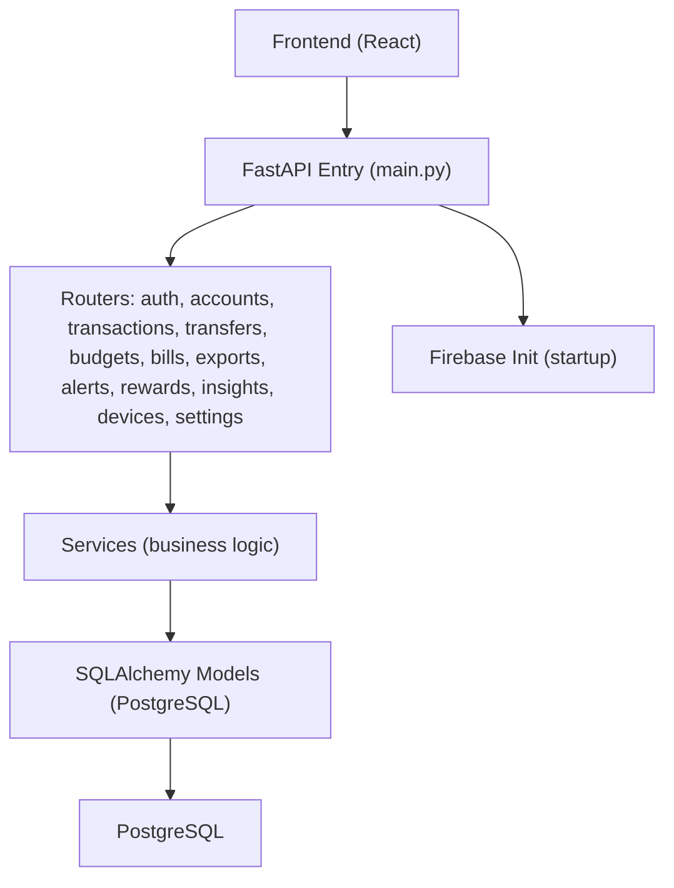
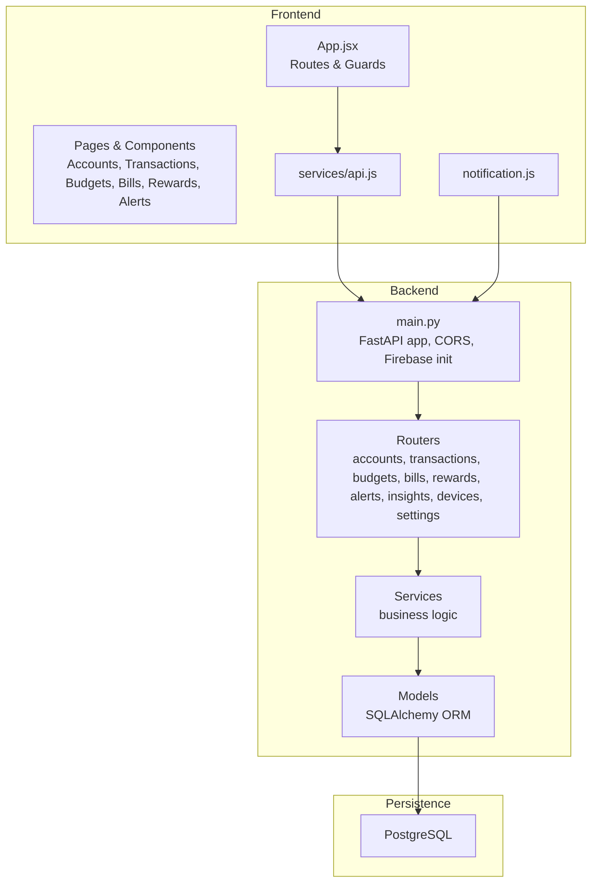
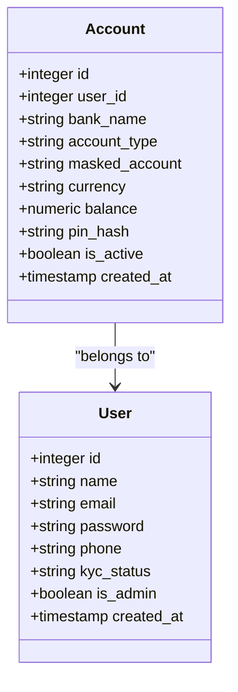
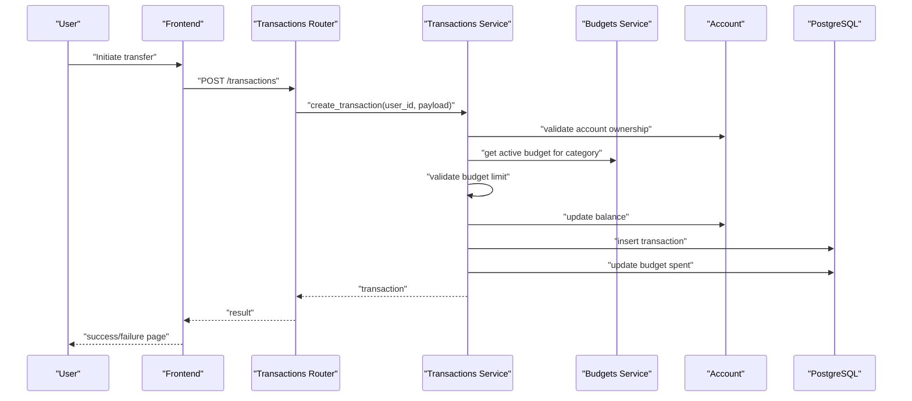
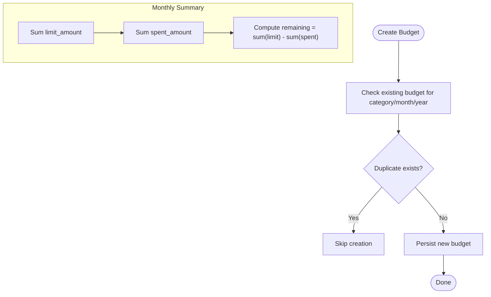
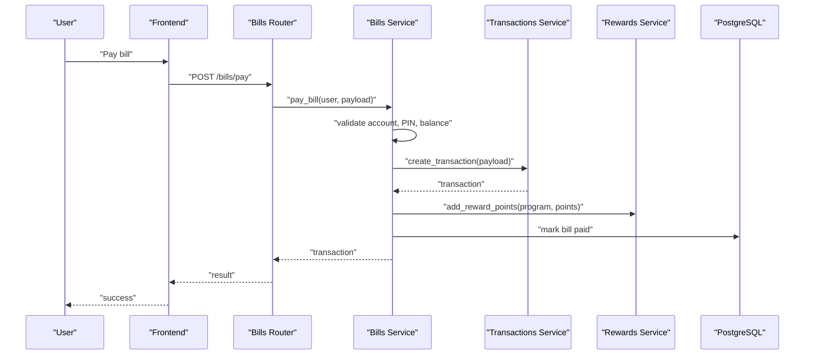
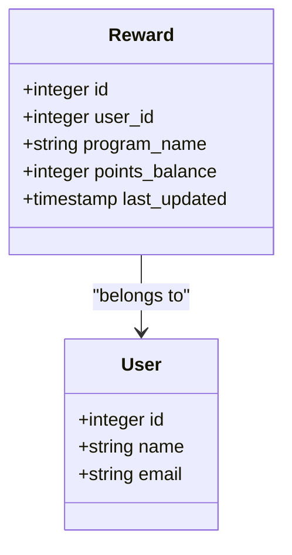
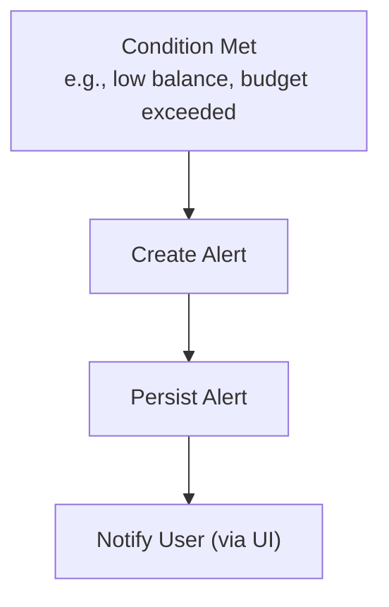
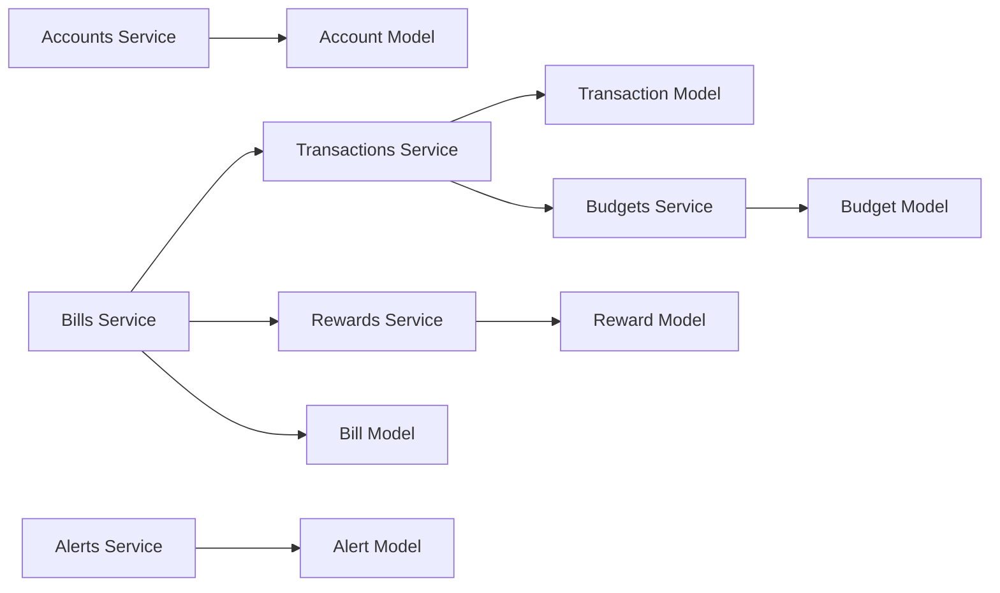

# Core Features

<cite>
**Referenced Files in This Document**
- [backend/app/main.py](file://backend/app/main.py)
- [backend/README.md](file://backend/README.md)
- [docs/database-schema.md](file://docs/database-schema.md)
- [backend/app/models/__init__.py](file://backend/app/models/__init__.py)
- [backend/app/models/account.py](file://backend/app/models/account.py)
- [backend/app/models/transaction.py](file://backend/app/models/transaction.py)
- [backend/app/models/bill.py](file://backend/app/models/bill.py)
- [backend/app/models/reward.py](file://backend/app/models/reward.py)
- [backend/app/models/alert.py](file://backend/app/models/alert.py)
- [backend/app/accounts/service.py](file://backend/app/accounts/service.py)
- [backend/app/transactions/service.py](file://backend/app/transactions/service.py)
- [backend/app/budgets/service.py](file://backend/app/budgets/service.py)
- [backend/app/bills/service.py](file://backend/app/bills/service.py)
- [backend/app/rewards/service.py](file://backend/app/rewards/service.py)
- [backend/app/alerts/service.py](file://backend/app/alerts/service.py)
- [frontend/src/App.jsx](file://frontend/src/App.jsx)
- [frontend/src/pages/user/Accounts.jsx](file://frontend/src/pages/user/Accounts.jsx)
- [frontend/src/pages/user/Transactions.jsx](file://frontend/src/pages/user/Transactions.jsx)
- [frontend/src/pages/user/Budgets.jsx](file://frontend/src/pages/user/Budgets.jsx)
- [frontend/src/pages/user/Bills.jsx](file://frontend/src/pages/user/Bills.jsx)
- [frontend/src/pages/user/Rewards.jsx](file://frontend/src/pages/user/Rewards.jsx)
- [frontend/src/pages/user/Alerts.jsx](file://frontend/src/pages/user/Alerts.jsx)
- [frontend/src/components/user/payments/PaymentProcessing.jsx](file://frontend/src/components/user/payments/PaymentProcessing.jsx)
- [frontend/src/components/user/payments/EnterPinModal.jsx](file://frontend/src/components/user/payments/EnterPinModal.jsx)
- [frontend/src/services/api.js](file://frontend/src/services/api.js)
- [frontend/src/notification.js](file://frontend/src/notification.js)
</cite>

## Table of Contents
1. [Introduction](#introduction)
2. [Project Structure](#project-structure)
3. [Core Components](#core-components)
4. [Architecture Overview](#architecture-overview)
5. [Detailed Component Analysis](#detailed-component-analysis)
6. [Dependency Analysis](#dependency-analysis)
7. [Performance Considerations](#performance-considerations)
8. [Troubleshooting Guide](#troubleshooting-guide)
9. [Conclusion](#conclusion)
10. [Appendices](#appendices)

## Introduction
This document explains the core banking features of the Modern Digital Banking Dashboard: user account management, transaction processing, budget tracking, bill payment system, rewards program, and alert notifications. It covers functionality, user workflows, backend implementation, frontend interfaces, feature interdependencies, business logic, data models, and integration patterns. Practical examples and troubleshooting guidance are included for each major feature area.

## Project Structure
The application follows a layered architecture:
- Frontend (React) routes and UI components under frontend/src
- Backend (FastAPI) entry point registers routers and middleware
- Database models and services organized by feature domains
- Shared database schema documented separately

**Diagram sources**
- [backend/app/main.py:56-89](file://backend/app/main.py#L56-L89)
- [backend/app/models/__init__.py:1-13](file://backend/app/models/__init__.py#L1-L13)

**Section sources**
- [backend/app/main.py:25-89](file://backend/app/main.py#L25-L89)
- [backend/README.md:27-44](file://backend/README.md#L27-L44)

## Core Components
- Accounts: manage linked bank accounts, PIN hashing, masking, and lifecycle
- Transactions: process UPI, bank, and self transfers; enforce budgets; update balances; notify users
- Budgets: define monthly spending limits per category; track spent amounts; compute summaries
- Bills: register bill reminders; validate account and PIN; process payments via shared transaction engine; award reward points
- Rewards: maintain per-user reward programs and points balances
- Alerts: persist system-generated alerts for low balance, bill due, budget exceeded, etc.

**Section sources**
- [backend/app/accounts/service.py:55-111](file://backend/app/accounts/service.py#L55-L111)
- [backend/app/transactions/service.py:105-188](file://backend/app/transactions/service.py#L105-L188)
- [backend/app/budgets/service.py:15-77](file://backend/app/budgets/service.py#L15-L77)
- [backend/app/bills/service.py:102-166](file://backend/app/bills/service.py#L102-L166)
- [backend/app/rewards/service.py:14-54](file://backend/app/rewards/service.py#L14-L54)
- [backend/app/alerts/service.py:6-24](file://backend/app/alerts/service.py#L6-L24)

## Architecture Overview
High-level flow:
- Frontend routes and components call API endpoints via services/api.js
- FastAPI main.py registers routers and middleware
- Routers delegate to services implementing business logic
- Services operate on SQLAlchemy models backed by PostgreSQL
- Firebase initialized on startup for push messaging

**Diagram sources**
- [frontend/src/App.jsx:78-171](file://frontend/src/App.jsx#L78-L171)
- [frontend/src/services/api.js](file://frontend/src/services/api.js)
- [frontend/src/notification.js](file://frontend/src/notification.js)
- [backend/app/main.py:56-109](file://backend/app/main.py#L56-L109)

## Detailed Component Analysis

### User Account Management
- Functionality
  - Add bank accounts linked to a user
  - Mask PAN/Account numbers for privacy
  - Store and verify PIN using bcrypt
  - List and remove accounts (soft deletion)
- User Workflow
  - User navigates to Accounts page, enters bank details and PIN, submits
  - System validates uniqueness by last four digits, hashes PIN, persists masked number
  - User can view accounts and optionally remove by verifying PIN
- Backend Implementation
  - Service enforces uniqueness by last four digits, masks account number, stores PIN hash
  - Deletion requires PIN verification; sets inactive flag
- Frontend Interfaces
  - Accounts page renders account list and add-account form
  - PIN modal used during sensitive operations
- Interdependencies
  - Transactions rely on account ownership checks
  - Bill payments require a valid account and PIN
- Data Model
  - Account entity with user foreign key, masked number, currency, balance, PIN hash, activity flag

**Diagram sources**
- [backend/app/models/account.py:31-57](file://backend/app/models/account.py#L31-L57)
- [docs/database-schema.md:28-42](file://docs/database-schema.md#L28-L42)

**Section sources**
- [backend/app/accounts/service.py:34-111](file://backend/app/accounts/service.py#L34-L111)
- [frontend/src/pages/user/Accounts.jsx](file://frontend/src/pages/user/Accounts.jsx)
- [frontend/src/components/user/payments/EnterPinModal.jsx](file://frontend/src/components/user/payments/EnterPinModal.jsx)

### Transaction Processing
- Functionality
  - Create transaction records for UPI, bank, and self transfers
  - Enforce monthly budget limits per category
  - Update account balances (debit/credit)
  - Notify users based on preferences
- User Workflow
  - Select sender account, enter recipient details, confirm amount
  - PIN verification may be required depending on transfer type
  - On success, show success page; on failure, show failure page
- Backend Implementation
  - Validates account ownership, detects category from description, checks budget
  - Applies balance updates, persists transaction, updates budget spent amount
  - Sends transaction alerts if enabled
- Frontend Interfaces
  - Transfer pages (UPI, Bank, Self, To Bank)
  - Payment result pages (success/failure)
  - Transaction list page
- Interdependencies
  - Budgets module participates in preconditions
  - Alerts module receives notifications
- Data Model
  - Transaction entity with user and account foreign keys, amount, type, date, category

**Diagram sources**
- [backend/app/transactions/service.py:105-149](file://backend/app/transactions/service.py#L105-L149)
- [backend/app/budgets/service.py:46-58](file://backend/app/budgets/service.py#L46-L58)
- [backend/app/models/transaction.py:32-58](file://backend/app/models/transaction.py#L32-L58)

**Section sources**
- [backend/app/transactions/service.py:105-188](file://backend/app/transactions/service.py#L105-L188)
- [frontend/src/pages/user/Transactions.jsx](file://frontend/src/pages/user/Transactions.jsx)
- [frontend/src/components/user/payments/PaymentProcessing.jsx](file://frontend/src/components/user/payments/PaymentProcessing.jsx)

### Budget Tracking
- Functionality
  - Define monthly budgets per category
  - Track spent amounts and remaining limits
  - Summarize totals per month/year
- User Workflow
  - Create budget for a category and month/year
  - View progress toward limits
  - Adjust limits as needed
- Backend Implementation
  - Prevent duplicate category-month-year entries
  - Provide summary aggregation across active budgets
- Frontend Interfaces
  - Budgets page and summary page
- Interdependencies
  - Transactions increment spent amounts upon successful debit
- Data Model
  - Budget entity with user foreign key, month/year, category, limits, spent amount

**Diagram sources**
- [backend/app/budgets/service.py:15-77](file://backend/app/budgets/service.py#L15-L77)
- [docs/database-schema.md:64-78](file://docs/database-schema.md#L64-L78)

**Section sources**
- [backend/app/budgets/service.py:15-77](file://backend/app/budgets/service.py#L15-L77)
- [frontend/src/pages/user/Budgets.jsx](file://frontend/src/pages/user/Budgets.jsx)

### Bill Payment System
- Functionality
  - Register bill reminders with due dates and amounts
  - Validate account ownership and PIN
  - Deduct from account balance and mark bill as paid
  - Award reward points for bill payments
- User Workflow
  - Add bill with provider and amount
  - Pay via bill payment flow selecting account and entering PIN
  - On success, receive reward points and bill marked paid
- Backend Implementation
  - Validates bill type against supported categories
  - Builds transaction payload with enriched description
  - Reuses transaction engine; marks bill paid if present
  - Adds reward points to a program named after the bill type
- Frontend Interfaces
  - Bills page and bill processing page
  - PIN modal for payment confirmation
- Interdependencies
  - Uses shared transaction engine and reward service
- Data Model
  - Bill entity with user and account foreign keys, due date, amount, status, auto-pay

**Diagram sources**
- [backend/app/bills/service.py:102-124](file://backend/app/bills/service.py#L102-L124)
- [backend/app/transactions/service.py:105-149](file://backend/app/transactions/service.py#L105-L149)
- [backend/app/rewards/service.py:34-54](file://backend/app/rewards/service.py#L34-L54)
- [backend/app/models/bill.py:18-45](file://backend/app/models/bill.py#L18-L45)

**Section sources**
- [backend/app/bills/service.py:102-166](file://backend/app/bills/service.py#L102-L166)
- [frontend/src/pages/user/Bills.jsx](file://frontend/src/pages/user/Bills.jsx)
- [frontend/src/components/user/payments/EnterPinModal.jsx](file://frontend/src/components/user/payments/EnterPinModal.jsx)

### Rewards Program
- Functionality
  - Create reward programs per user
  - Add points to programs (e.g., per bill payment)
  - Retrieve user’s reward programs and balances
- User Workflow
  - Earn points automatically upon qualifying transactions (e.g., bill payments)
  - View total earned and program balances
- Backend Implementation
  - Upserts reward program and increments points
- Frontend Interfaces
  - Rewards page and total earned page
- Interdependencies
  - Triggered by bill payments and other qualifying events
- Data Model
  - Reward entity with user foreign key, program name, points balance, last updated

**Diagram sources**
- [backend/app/models/reward.py:5-14](file://backend/app/models/reward.py#L5-L14)
- [backend/app/rewards/service.py:14-54](file://backend/app/rewards/service.py#L14-L54)

**Section sources**
- [backend/app/rewards/service.py:14-54](file://backend/app/rewards/service.py#L14-L54)
- [frontend/src/pages/user/Rewards.jsx](file://frontend/src/pages/user/Rewards.jsx)

### Alert Notifications
- Functionality
  - Persist alerts for low balance, bill due, budget exceeded, etc.
  - Retrieve user alerts
- User Workflow
  - View alerts in the Alerts page
- Backend Implementation
  - Creates alert entries with type and message
- Frontend Interfaces
  - Alerts page
- Interdependencies
  - Generated by various services (e.g., transactions, bills, budgets)
- Data Model
  - Alert entity with user foreign key, type, message, read flag, created timestamp

**Diagram sources**
- [backend/app/alerts/service.py:6-24](file://backend/app/alerts/service.py#L6-L24)
- [backend/app/models/alert.py:17-34](file://backend/app/models/alert.py#L17-L34)

**Section sources**
- [backend/app/alerts/service.py:6-24](file://backend/app/alerts/service.py#L6-L24)
- [frontend/src/pages/user/Alerts.jsx](file://frontend/src/pages/user/Alerts.jsx)

## Dependency Analysis
- Feature Coupling
  - Transactions depend on Accounts and Budgets
  - Bills depend on Transactions and Rewards
  - Alerts are produced by multiple features
- Cohesion
  - Each feature encapsulates related models, routers, services, and schemas
- External Integrations
  - Firebase initialized on startup for push notifications
  - CORS configured for frontend origins
- Potential Circular Dependencies
  - None observed among routers/services/models in the analyzed files

**Diagram sources**
- [backend/app/accounts/service.py:55-111](file://backend/app/accounts/service.py#L55-L111)
- [backend/app/transactions/service.py:105-188](file://backend/app/transactions/service.py#L105-L188)
- [backend/app/budgets/service.py:15-77](file://backend/app/budgets/service.py#L15-L77)
- [backend/app/bills/service.py:102-166](file://backend/app/bills/service.py#L102-L166)
- [backend/app/rewards/service.py:14-54](file://backend/app/rewards/service.py#L14-L54)
- [backend/app/alerts/service.py:6-24](file://backend/app/alerts/service.py#L6-L24)
- [backend/app/models/account.py:31-57](file://backend/app/models/account.py#L31-L57)
- [backend/app/models/transaction.py:32-58](file://backend/app/models/transaction.py#L32-L58)
- [backend/app/models/bill.py:18-45](file://backend/app/models/bill.py#L18-L45)
- [backend/app/models/reward.py:5-14](file://backend/app/models/reward.py#L5-L14)
- [backend/app/models/alert.py:17-34](file://backend/app/models/alert.py#L17-L34)

**Section sources**
- [backend/app/models/__init__.py:1-13](file://backend/app/models/__init__.py#L1-L13)
- [backend/app/main.py:59-85](file://backend/app/main.py#L59-L85)

## Performance Considerations
- Indexing and Filtering
  - Ensure foreign keys and frequently queried columns (user_id, account_id, month/year, category) are indexed
- Query Efficiency
  - Use joins and filters to minimize round trips (as seen in transaction retrieval)
- Caching Opportunities
  - Consider caching recent transactions and budget summaries for active users
- Asynchronous Tasks
  - Use scheduled tasks for recurring reminders and periodic maintenance
- Concurrency
  - Apply database transactions for atomic operations (e.g., balance updates and transaction inserts)

## Troubleshooting Guide
- Account Management
  - Duplicate account detected: Ensure last four digits differ or use a different account number
  - Invalid PIN: Confirm PIN matches the stored hash for the selected account
- Transaction Processing
  - Budget exceeded: Adjust budget limit or choose another category
  - Insufficient balance: Fund the account before transferring
- Budget Tracking
  - Budget not created: Verify no duplicate exists for the same month/year/category
- Bill Payments
  - Invalid bill type: Confirm the bill type is supported
  - Transaction failed: Retry after ensuring sufficient funds and correct PIN
- Rewards
  - Points not added: Verify the reward program exists or is created automatically on first event
- Alerts
  - Missing alerts: Check alert retrieval logic and user context

**Section sources**
- [backend/app/accounts/service.py:25-27](file://backend/app/accounts/service.py#L25-L27)
- [backend/app/transactions/service.py:29](file://backend/app/transactions/service.py#L29)
- [backend/app/budgets/service.py:18-20](file://backend/app/budgets/service.py#L18-L20)
- [backend/app/bills/service.py:26-31](file://backend/app/bills/service.py#L26-L31)
- [backend/app/rewards/service.py:40-49](file://backend/app/rewards/service.py#L40-L49)

## Conclusion
The Modern Digital Banking Dashboard integrates user account management, transaction processing, budget tracking, bill payments, rewards, and alerts into a cohesive system. The backend leverages FastAPI, SQLAlchemy, and PostgreSQL, while the frontend provides role-based navigation and protected routes. Clear separation of concerns and explicit feature boundaries enable maintainability and extensibility.

## Appendices

### API and Routing Overview
- Frontend routes are defined centrally and grouped by user/admin contexts
- ProtectedRoute and AdminRoute guards ensure authorized access
- API calls are routed through FastAPI main entry point

**Section sources**
- [frontend/src/App.jsx:78-171](file://frontend/src/App.jsx#L78-L171)
- [backend/app/main.py:64-85](file://backend/app/main.py#L64-L85)

### Database Schema Reference
- Users, Accounts, Transactions, Budgets, Bills, Rewards, Alerts
- Foreign key relationships and constraints documented

**Section sources**
- [docs/database-schema.md:11-147](file://docs/database-schema.md#L11-L147)