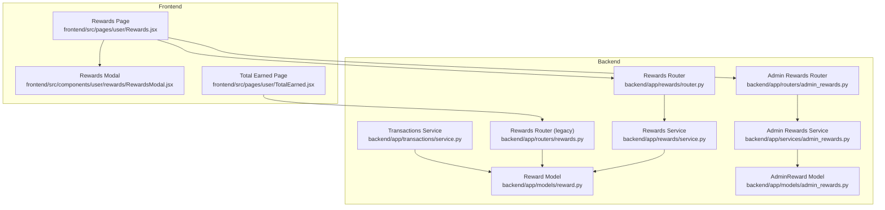
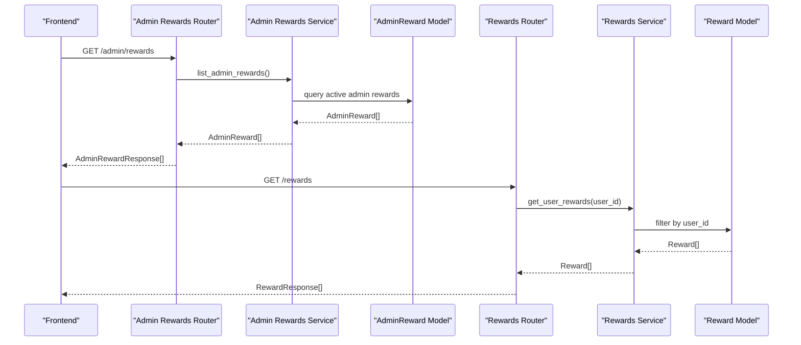
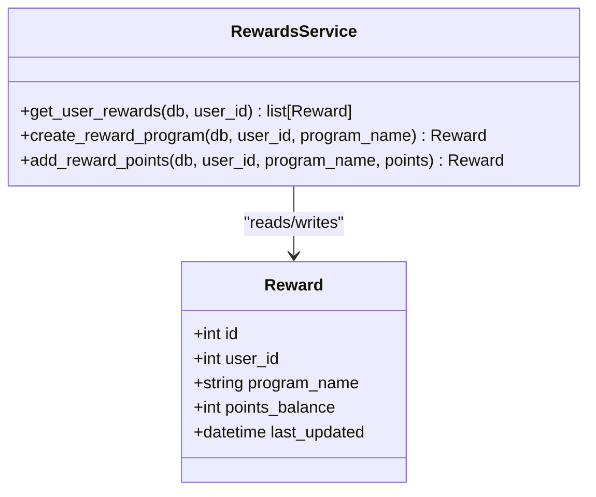
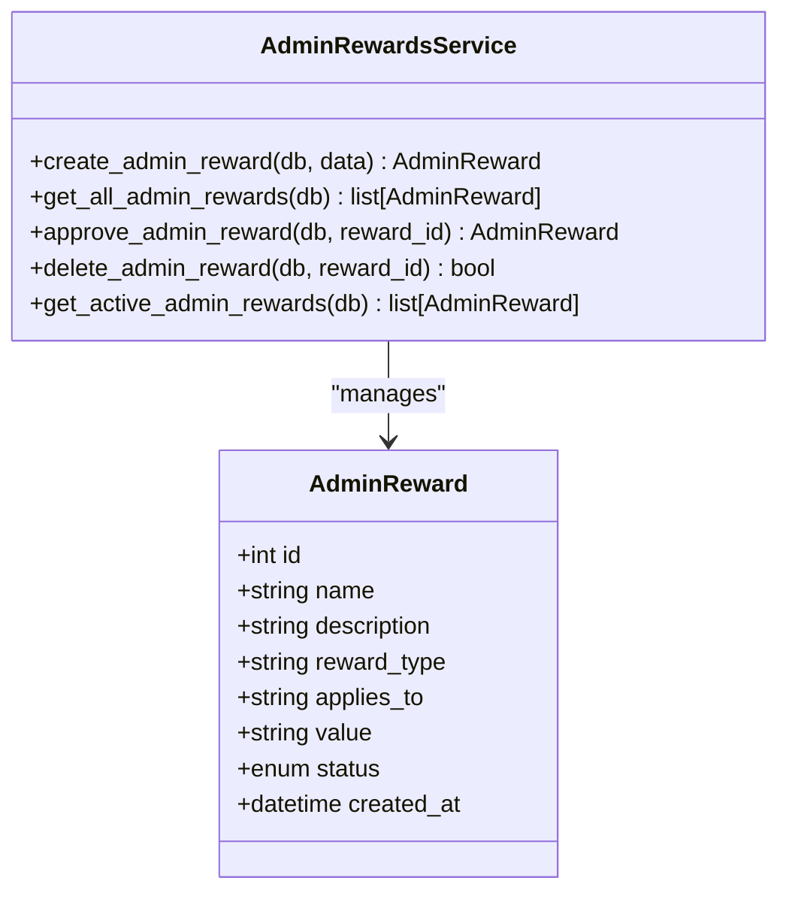
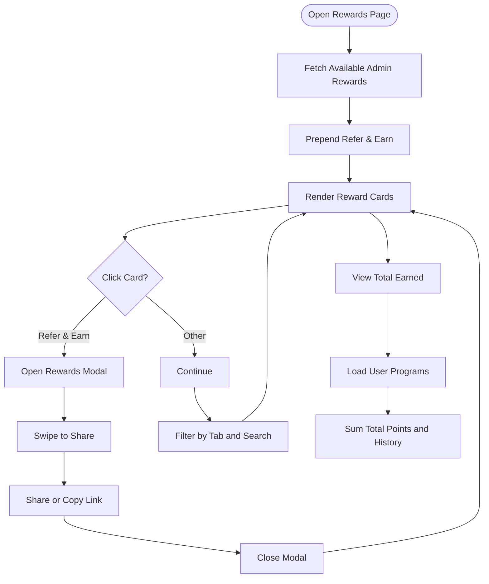
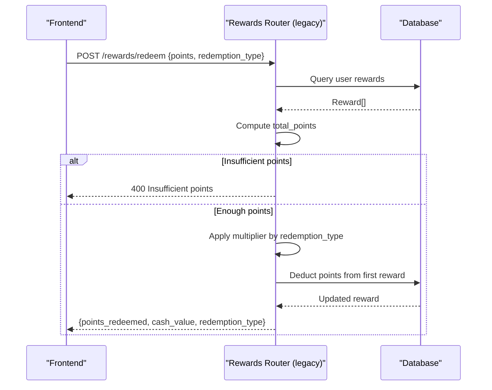
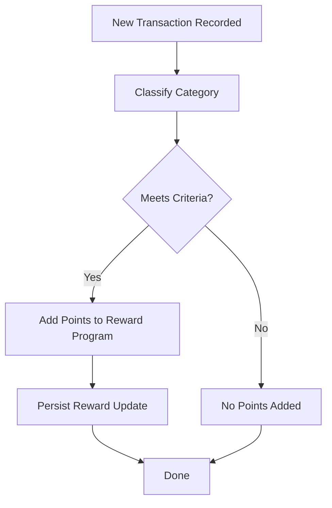
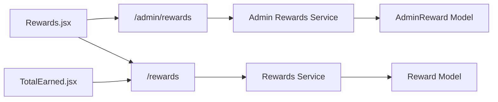

# Rewards Program

<cite>
**Referenced Files in This Document**
- [backend/app/rewards/router.py](file://backend/app/rewards/router.py)
- [backend/app/rewards/service.py](file://backend/app/rewards/service.py)
- [backend/app/rewards/schemas.py](file://backend/app/rewards/schemas.py)
- [backend/app/models/reward.py](file://backend/app/models/reward.py)
- [backend/app/routers/rewards.py](file://backend/app/routers/rewards.py)
- [backend/app/services/admin_rewards.py](file://backend/app/services/admin_rewards.py)
- [backend/app/schemas/admin_rewards.py](file://backend/app/schemas/admin_rewards.py)
- [backend/app/models/admin_rewards.py](file://backend/app/models/admin_rewards.py)
- [backend/app/routers/admin_rewards.py](file://backend/app/routers/admin_rewards.py)
- [backend/app/routers/admin_rewards_simple.py](file://backend/app/routers/admin_rewards_simple.py)
- [backend/app/transactions/service.py](file://backend/app/transactions/service.py)
- [backend/app/models/transaction.py](file://backend/app/models/transaction.py)
- [docs/database-schema.md](file://docs/database-schema.md)
- [frontend/src/pages/user/Rewards.jsx](file://frontend/src/pages/user/Rewards.jsx)
- [frontend/src/components/user/rewards/RewardsModal.jsx](file://frontend/src/components/user/rewards/RewardsModal.jsx)
- [frontend/src/pages/user/TotalEarned.jsx](file://frontend/src/pages/user/TotalEarned.jsx)
</cite>

## Table of Contents
1. [Introduction](#introduction)
2. [Project Structure](#project-structure)
3. [Core Components](#core-components)
4. [Architecture Overview](#architecture-overview)
5. [Detailed Component Analysis](#detailed-component-analysis)
6. [Dependency Analysis](#dependency-analysis)
7. [Performance Considerations](#performance-considerations)
8. [Troubleshooting Guide](#troubleshooting-guide)
9. [Conclusion](#conclusion)

## Introduction
This document explains the Rewards Program feature in the Modern Digital Banking Dashboard. It covers how points are accumulated, how rewards are managed and redeemed, and how cashback programs are represented. It documents the backend rewards service implementation, point calculation algorithms, and frontend reward interfaces. Examples illustrate earning points via transactions, redeeming rewards, and tracking total earned rewards.

## Project Structure
The Rewards Program spans backend API routes, services, and models, plus frontend pages and modals. Admin-managed offers and cashback programs are supported alongside user-level point balances.

**Diagram sources**
- [backend/app/rewards/router.py:1-45](file://backend/app/rewards/router.py#L1-L45)
- [backend/app/rewards/service.py:1-54](file://backend/app/rewards/service.py#L1-L54)
- [backend/app/models/reward.py:1-14](file://backend/app/models/reward.py#L1-L14)
- [backend/app/routers/admin_rewards.py:1-68](file://backend/app/routers/admin_rewards.py#L1-L68)
- [backend/app/services/admin_rewards.py:1-59](file://backend/app/services/admin_rewards.py#L1-L59)
- [backend/app/models/admin_rewards.py:1-33](file://backend/app/models/admin_rewards.py#L1-L33)
- [backend/app/routers/rewards.py:1-162](file://backend/app/routers/rewards.py#L1-L162)
- [backend/app/transactions/service.py:1-188](file://backend/app/transactions/service.py#L1-L188)
- [frontend/src/pages/user/Rewards.jsx:1-272](file://frontend/src/pages/user/Rewards.jsx#L1-L272)
- [frontend/src/components/user/rewards/RewardsModal.jsx:1-155](file://frontend/src/components/user/rewards/RewardsModal.jsx#L1-L155)
- [frontend/src/pages/user/TotalEarned.jsx:1-179](file://frontend/src/pages/user/TotalEarned.jsx#L1-L179)

**Section sources**
- [backend/app/rewards/router.py:1-45](file://backend/app/rewards/router.py#L1-L45)
- [backend/app/routers/admin_rewards.py:1-68](file://backend/app/routers/admin_rewards.py#L1-L68)
- [frontend/src/pages/user/Rewards.jsx:1-272](file://frontend/src/pages/user/Rewards.jsx#L1-L272)

## Core Components
- Rewards model and service: stores per-user point balances and supports creation and point addition.
- Admin rewards: manages offers/cashback campaigns with approval lifecycle.
- Frontend pages: display available rewards, track total earned points, and support referral sharing.

Key backend models and schemas:
- Reward entity with user association, program name, points balance, and timestamps.
- AdminReward entity with campaign metadata, applies-to categories, and status.
- Pydantic schemas for request/response shapes.

**Section sources**
- [backend/app/models/reward.py:1-14](file://backend/app/models/reward.py#L1-L14)
- [backend/app/rewards/schemas.py:1-19](file://backend/app/rewards/schemas.py#L1-L19)
- [backend/app/models/admin_rewards.py:1-33](file://backend/app/models/admin_rewards.py#L1-L33)
- [backend/app/schemas/admin_rewards.py:1-26](file://backend/app/schemas/admin_rewards.py#L1-L26)

## Architecture Overview
The Rewards Program integrates user-level point accounting with admin-defined offers. The frontend consumes admin-available offers and user-owned reward programs, while backend APIs manage persistence and calculations.

**Diagram sources**
- [backend/app/routers/admin_rewards.py:28-35](file://backend/app/routers/admin_rewards.py#L28-L35)
- [backend/app/services/admin_rewards.py:32-33](file://backend/app/services/admin_rewards.py#L32-L33)
- [backend/app/models/admin_rewards.py:11-33](file://backend/app/models/admin_rewards.py#L11-L33)
- [backend/app/rewards/router.py:20-25](file://backend/app/rewards/router.py#L20-L25)
- [backend/app/rewards/service.py:14-15](file://backend/app/rewards/service.py#L14-L15)
- [backend/app/models/reward.py:5-14](file://backend/app/models/reward.py#L5-L14)

## Detailed Component Analysis

### Backend Rewards Service and Model
The rewards service encapsulates CRUD operations for user reward programs and point accumulation. The model persists per-user points with timestamps.

**Diagram sources**
- [backend/app/models/reward.py:5-14](file://backend/app/models/reward.py#L5-L14)
- [backend/app/rewards/service.py:6-54](file://backend/app/rewards/service.py#L6-L54)

Key behaviors:
- Creating a reward program initializes a zero-balance entry for the user.
- Adding points updates existing balance or creates a new program entry.
- Retrieving user rewards returns all programs for the user.

**Section sources**
- [backend/app/rewards/service.py:18-54](file://backend/app/rewards/service.py#L18-L54)
- [backend/app/rewards/router.py:28-34](file://backend/app/rewards/router.py#L28-L34)

### Admin Rewards Management
Admins define campaigns (offers, cashback, referral) with categories they apply to and statuses. The system normalizes CSV-encoded applies-to lists for display and consumption.

**Diagram sources**
- [backend/app/models/admin_rewards.py:11-33](file://backend/app/models/admin_rewards.py#L11-L33)
- [backend/app/services/admin_rewards.py:18-59](file://backend/app/services/admin_rewards.py#L18-L59)

Admin endpoints:
- List all campaigns, create new ones, approve to activate, and delete.
- Normalize applies_to from CSV to list for frontend consumption.

**Section sources**
- [backend/app/routers/admin_rewards.py:28-67](file://backend/app/routers/admin_rewards.py#L28-L67)
- [backend/app/services/admin_rewards.py:32-59](file://backend/app/services/admin_rewards.py#L32-L59)

### Frontend Reward Interfaces
The frontend provides:
- Rewards page: lists available admin campaigns and user programs, with filtering and summary cards.
- Rewards modal: walkthrough for “Refer & Earn” with swipe-to-share UX.
- Total earned page: aggregates completed user programs and displays history.

**Diagram sources**
- [frontend/src/pages/user/Rewards.jsx:43-72](file://frontend/src/pages/user/Rewards.jsx#L43-L72)
- [frontend/src/components/user/rewards/RewardsModal.jsx:21-46](file://frontend/src/components/user/rewards/RewardsModal.jsx#L21-L46)
- [frontend/src/pages/user/TotalEarned.jsx:22-48](file://frontend/src/pages/user/TotalEarned.jsx#L22-L48)

**Section sources**
- [frontend/src/pages/user/Rewards.jsx:17-229](file://frontend/src/pages/user/Rewards.jsx#L17-L229)
- [frontend/src/components/user/rewards/RewardsModal.jsx:16-155](file://frontend/src/components/user/rewards/RewardsModal.jsx#L16-L155)
- [frontend/src/pages/user/TotalEarned.jsx:17-94](file://frontend/src/pages/user/TotalEarned.jsx#L17-L94)

### Redemption and Cashback Programs
Cashback programs are modeled as admin-defined campaigns. Redemption uses a multiplier to compute cash value from points.

**Diagram sources**
- [backend/app/routers/rewards.py:59-86](file://backend/app/routers/rewards.py#L59-L86)

Redemption multipliers:
- cash: 0.01
- gift_card: 0.012
- travel: 0.015
- fallback: 0.01

Note: The legacy rewards router performs point deduction on a single reward instance for simplicity.

**Section sources**
- [backend/app/routers/rewards.py:68-86](file://backend/app/routers/rewards.py#L68-L86)

### Points Accumulation via Transactions
While the provided backend code does not show automatic point accrual tied to transactions, the transaction service demonstrates how spending and income are recorded. A typical integration would:
- Detect spend categories and amounts.
- Trigger point additions for qualifying categories or thresholds.
- Persist points against a user’s reward program(s).

**Diagram sources**
- [backend/app/transactions/service.py:105-149](file://backend/app/transactions/service.py#L105-L149)
- [backend/app/models/transaction.py:32-58](file://backend/app/models/transaction.py#L32-L58)

**Section sources**
- [backend/app/transactions/service.py:178-188](file://backend/app/transactions/service.py#L178-L188)
- [backend/app/models/transaction.py:23-58](file://backend/app/models/transaction.py#L23-L58)

## Dependency Analysis
- Frontend depends on:
  - Admin rewards endpoint for campaign listings.
  - Legacy rewards endpoint for user programs and redemption.
- Backend:
  - Rewards router depends on rewards service and models.
  - Admin rewards router depends on admin rewards service and models.
  - Transactions service is orthogonal to rewards but can trigger point accrual in future extensions.

**Diagram sources**
- [frontend/src/pages/user/Rewards.jsx:46](file://frontend/src/pages/user/Rewards.jsx#L46)
- [frontend/src/pages/user/TotalEarned.jsx:25](file://frontend/src/pages/user/TotalEarned.jsx#L25)
- [backend/app/rewards/router.py:20-44](file://backend/app/rewards/router.py#L20-L44)
- [backend/app/routers/admin_rewards.py:28-35](file://backend/app/routers/admin_rewards.py#L28-L35)
- [backend/app/rewards/service.py:14-31](file://backend/app/rewards/service.py#L14-L31)
- [backend/app/services/admin_rewards.py:32-44](file://backend/app/services/admin_rewards.py#L32-L44)
- [backend/app/models/reward.py:5-14](file://backend/app/models/reward.py#L5-L14)
- [backend/app/models/admin_rewards.py:11-33](file://backend/app/models/admin_rewards.py#L11-L33)

**Section sources**
- [backend/app/rewards/router.py:1-45](file://backend/app/rewards/router.py#L1-L45)
- [backend/app/routers/admin_rewards.py:1-68](file://backend/app/routers/admin_rewards.py#L1-L68)
- [frontend/src/pages/user/Rewards.jsx:1-272](file://frontend/src/pages/user/Rewards.jsx#L1-L272)

## Performance Considerations
- Point queries: User reward retrieval is a simple filtered query; ensure indexing on user_id and program_name for scalability.
- Redemption: Current implementation deducts from a single reward instance; consider distributing redemptions across multiple programs to avoid depletion of early programs.
- Admin campaigns: Listing campaigns should be paginated and cached if traffic increases.
- Frontend rendering: Filtering and mapping are client-side; keep payload sizes reasonable to maintain responsiveness.

## Troubleshooting Guide
Common issues and resolutions:
- Insufficient points during redemption:
  - Symptom: 400 error indicating insufficient points.
  - Cause: Requested points exceed user’s total balance.
  - Resolution: Inform user and guide them to earn more points.
- Reward not found:
  - Symptom: 404 errors when updating/deleting/getting a reward by ID.
  - Cause: Non-existent reward ID or mismatched user ownership.
  - Resolution: Validate IDs and ensure requests are scoped to the current user.
- Admin campaign not appearing:
  - Symptom: Campaign missing from available list.
  - Cause: Campaign not approved or incorrectly formatted applies_to.
  - Resolution: Approve campaigns and verify CSV encoding of applies_to.

**Section sources**
- [backend/app/routers/rewards.py:65-66](file://backend/app/routers/rewards.py#L65-L66)
- [backend/app/routers/rewards.py:107-110](file://backend/app/routers/rewards.py#L107-L110)
- [backend/app/routers/admin_rewards.py:53-56](file://backend/app/routers/admin_rewards.py#L53-L56)

## Conclusion
The Rewards Program provides a foundation for user-level point accounting and admin-defined campaigns. The backend offers robust models and services for managing reward programs and redemption, while the frontend delivers intuitive interfaces for browsing, tracking, and engaging with rewards. Extending automatic point accrual from transactions and refining redemption distribution across multiple programs will further strengthen the system.