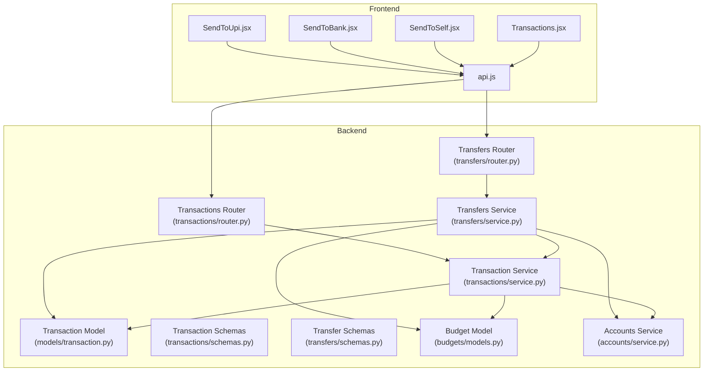
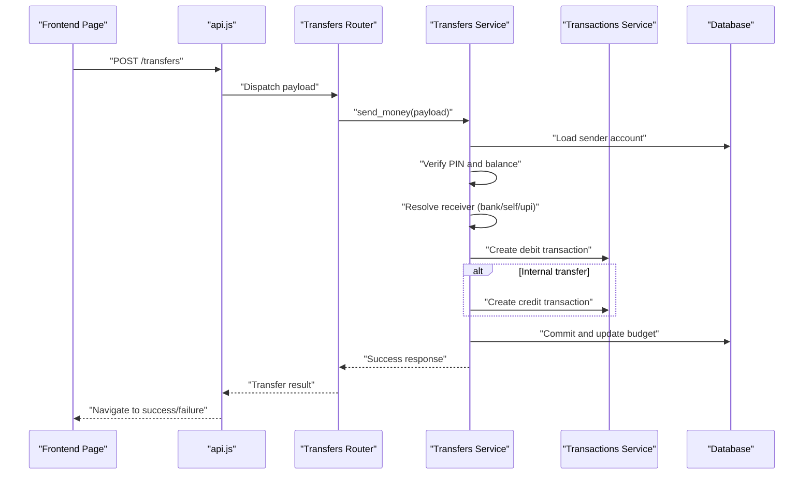
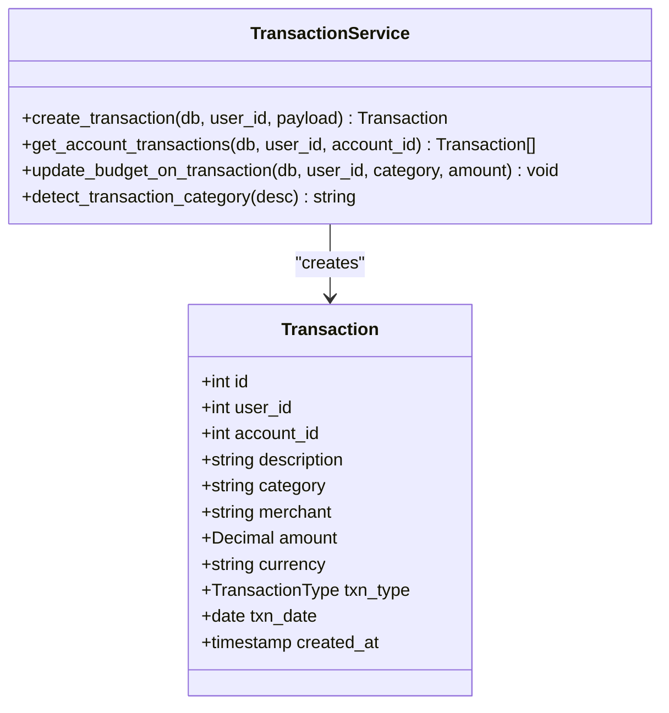
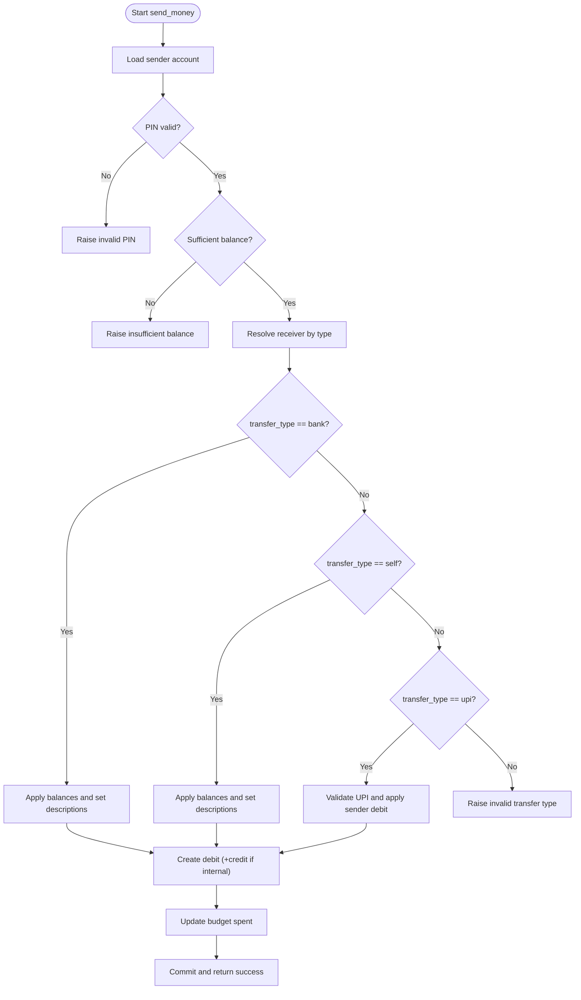
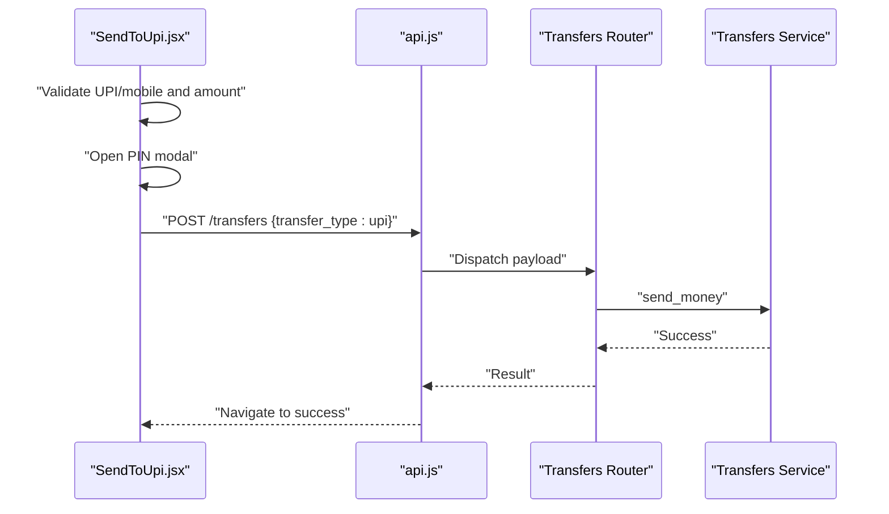
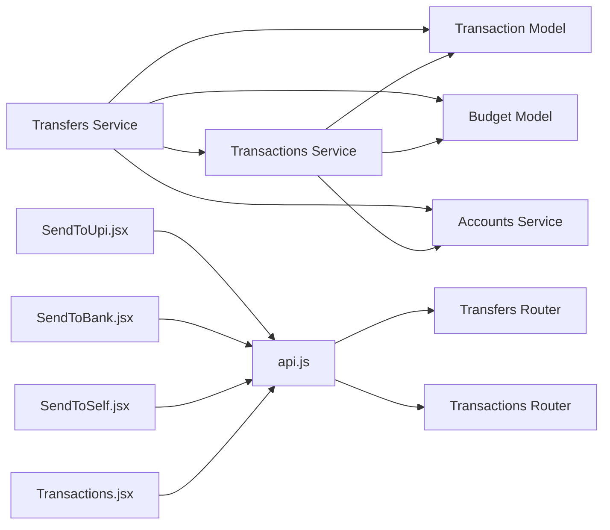

# Transaction Processing

<cite>
**Referenced Files in This Document**
- [models.py](file://backend/app/models/transaction.py)
- [schemas.py](file://backend/app/transactions/schemas.py)
- [service.py](file://backend/app/transactions/service.py)
- [router.py](file://backend/app/transactions/router.py)
- [service.py](file://backend/app/transfers/service.py)
- [schemas.py](file://backend/app/transfers/schemas.py)
- [router.py](file://backend/app/transfers/router.py)
- [models.py](file://backend/app/budgets/models.py)
- [service.py](file://backend/app/accounts/service.py)
- [SendToUpi.jsx](file://frontend/src/pages/user/SendToUpi.jsx)
- [SendToBank.jsx](file://frontend/src/pages/user/SendToBank.jsx)
- [SendToSelf.jsx](file://frontend/src/pages/user/SendToSelf.jsx)
- [Transactions.jsx](file://frontend/src/pages/user/Transactions.jsx)
- [api.js](file://frontend/src/services/api.js)
</cite>

## Table of Contents
1. [Introduction](#introduction)
2. [Project Structure](#project-structure)
3. [Core Components](#core-components)
4. [Architecture Overview](#architecture-overview)
5. [Detailed Component Analysis](#detailed-component-analysis)
6. [Dependency Analysis](#dependency-analysis)
7. [Performance Considerations](#performance-considerations)
8. [Troubleshooting Guide](#troubleshooting-guide)
9. [Conclusion](#conclusion)
10. [Appendices](#appendices)

## Introduction
This document explains the Transaction Processing system in the Modern Digital Banking Dashboard. It covers all transfer types supported by the backend and frontend: UPI transfers, bank transfers, and self-account transfers. It documents the transaction service implementation, validation logic, balance management, transaction models, transfer schemas, and frontend integration patterns. It also includes examples of different transfer scenarios, error handling, and transaction history management.

## Project Structure
The transaction processing spans backend services and frontend pages:
- Backend:
  - Transactions module: models, schemas, service, router
  - Transfers module: schemas, service, router
  - Budgets module: models
  - Accounts module: service (PIN hashing, masking)
- Frontend:
  - Pages for UPI, Bank, and Self transfers
  - Transactions listing and filtering
  - API service for HTTP requests

**Diagram sources**
- [models.py:32-58](file://backend/app/models/transaction.py#L32-L58)
- [schemas.py:10-33](file://backend/app/transactions/schemas.py#L10-L33)
- [service.py:105-149](file://backend/app/transactions/service.py#L105-L149)
- [router.py:65-96](file://backend/app/transactions/router.py#L65-L96)
- [schemas.py:6-26](file://backend/app/transfers/schemas.py#L6-L26)
- [service.py:164-197](file://backend/app/transfers/service.py#L164-L197)
- [router.py:13-23](file://backend/app/transfers/router.py#L13-L23)
- [models.py:6-22](file://backend/app/budgets/models.py#L6-L22)
- [service.py:55-75](file://backend/app/accounts/service.py#L55-L75)
- [SendToUpi.jsx:99-121](file://frontend/src/pages/user/SendToUpi.jsx#L99-L121)
- [SendToBank.jsx:79-102](file://frontend/src/pages/user/SendToBank.jsx#L79-L102)
- [SendToSelf.jsx:76-99](file://frontend/src/pages/user/SendToSelf.jsx#L76-L99)
- [Transactions.jsx:92-122](file://frontend/src/pages/user/Transactions.jsx#L92-L122)
- [api.js:19-46](file://frontend/src/services/api.js#L19-L46)

**Section sources**
- [models.py:32-58](file://backend/app/models/transaction.py#L32-L58)
- [schemas.py:10-33](file://backend/app/transactions/schemas.py#L10-L33)
- [service.py:105-149](file://backend/app/transactions/service.py#L105-L149)
- [router.py:65-96](file://backend/app/transactions/router.py#L65-L96)
- [schemas.py:6-26](file://backend/app/transfers/schemas.py#L6-L26)
- [service.py:164-197](file://backend/app/transfers/service.py#L164-L197)
- [router.py:13-23](file://backend/app/transfers/router.py#L13-L23)
- [models.py:6-22](file://backend/app/budgets/models.py#L6-L22)
- [service.py:55-75](file://backend/app/accounts/service.py#L55-L75)
- [SendToUpi.jsx:99-121](file://frontend/src/pages/user/SendToUpi.jsx#L99-L121)
- [SendToBank.jsx:79-102](file://frontend/src/pages/user/SendToBank.jsx#L79-L102)
- [SendToSelf.jsx:76-99](file://frontend/src/pages/user/SendToSelf.jsx#L76-L99)
- [Transactions.jsx:92-122](file://frontend/src/pages/user/Transactions.jsx#L92-L122)
- [api.js:19-46](file://frontend/src/services/api.js#L19-L46)

## Core Components
- Transaction model and service:
  - Defines transaction records with amounts, types (debit/credit), categories, dates, and relationships to users and accounts.
  - Implements creation, balance updates, budget enforcement, and transaction history retrieval.
- Transfer service and schemas:
  - Validates sender account, PIN, and sufficient funds.
  - Resolves receivers for bank and self transfers; validates UPI targets.
  - Applies balances and creates corresponding debit/credit transactions.
  - Integrates with budget updates for transfer categories.
- Frontend pages:
  - UPI, Bank, and Self transfer pages collect inputs, validate, show PIN modal, and call the transfers API.
  - Transactions page lists, filters, searches, and exports transaction history.

**Section sources**
- [models.py:32-58](file://backend/app/models/transaction.py#L32-L58)
- [service.py:105-149](file://backend/app/transactions/service.py#L105-L149)
- [schemas.py:6-26](file://backend/app/transfers/schemas.py#L6-L26)
- [service.py:164-197](file://backend/app/transfers/service.py#L164-L197)
- [SendToUpi.jsx:99-121](file://frontend/src/pages/user/SendToUpi.jsx#L99-L121)
- [SendToBank.jsx:79-102](file://frontend/src/pages/user/SendToBank.jsx#L79-L102)
- [SendToSelf.jsx:76-99](file://frontend/src/pages/user/SendToSelf.jsx#L76-L99)
- [Transactions.jsx:92-122](file://frontend/src/pages/user/Transactions.jsx#L92-L122)

## Architecture Overview
End-to-end flow for transfers:
- Frontend collects inputs and opens a PIN modal.
- Frontend posts to the transfers endpoint with validated payload.
- Backend validates sender, PIN, and funds; resolves receiver depending on transfer type.
- Backend creates debit transaction for sender and credit transaction for receiver (for internal transfers).
- Backend updates budget spent amount and commits.
- Frontend navigates to success or failure pages.

**Diagram sources**
- [SendToUpi.jsx:99-121](file://frontend/src/pages/user/SendToUpi.jsx#L99-L121)
- [SendToBank.jsx:79-102](file://frontend/src/pages/user/SendToBank.jsx#L79-L102)
- [SendToSelf.jsx:76-99](file://frontend/src/pages/user/SendToSelf.jsx#L76-L99)
- [router.py:13-23](file://backend/app/transfers/router.py#L13-L23)
- [service.py:164-197](file://backend/app/transfers/service.py#L164-L197)
- [service.py:105-149](file://backend/app/transactions/service.py#L105-L149)

## Detailed Component Analysis

### Transaction Model and Service
- Model fields include identifiers, user and account foreign keys, description, category, merchant, amount, currency, transaction type, transaction date, and timestamps.
- Service responsibilities:
  - Validates account ownership.
  - Detects category from description.
  - Enforces budget limits for debits.
  - Applies balance updates (debit decreases, credit increases).
  - Creates transaction records and updates budget spent amounts.
  - Retrieves account-specific transactions ordered by date.

**Diagram sources**
- [models.py:32-58](file://backend/app/models/transaction.py#L32-L58)
- [service.py:105-149](file://backend/app/transactions/service.py#L105-L149)

**Section sources**
- [models.py:32-58](file://backend/app/models/transaction.py#L32-L58)
- [service.py:105-149](file://backend/app/transactions/service.py#L105-L149)

### Transfer Service and Schemas
- TransferCreate schema supports three transfer types:
  - bank: requires target account number
  - self: requires destination account id
  - upi: requires UPI id or mobile number
- Validation and resolution:
  - Sender account lookup and ownership check.
  - PIN verification via hashed PIN comparison.
  - Sufficient balance check.
  - Receiver resolution:
    - Bank: masked account suffix lookup.
    - Self: same user account validation and prevents same-account transfer.
    - UPI: validates presence of "@" or numeric mobile pattern.
- Transaction creation:
  - Debit transaction for sender.
  - Credit transaction for receiver in internal transfers.
  - Budget update for the appropriate category derived from transfer type.

**Diagram sources**
- [service.py:164-197](file://backend/app/transfers/service.py#L164-L197)
- [schemas.py:6-26](file://backend/app/transfers/schemas.py#L6-L26)

**Section sources**
- [schemas.py:6-26](file://backend/app/transfers/schemas.py#L6-L26)
- [service.py:164-197](file://backend/app/transfers/service.py#L164-L197)

### Frontend Integration Patterns
- UPI transfer:
  - Validates UPI ID or mobile number and amount.
  - Opens PIN modal and posts to transfers endpoint with transfer_type "upi".
  - On success, navigates to payment success with receipt details.
- Bank transfer:
  - Validates account number and IFSC code.
  - Posts transfer_type "bank" with to_account_number.
  - On success, updates budget and navigates to payment success.
- Self transfer:
  - Loads user accounts and selects destination account.
  - Posts transfer_type "self" with to_account_id.
  - On success, updates budget and navigates to payment success.
- Transactions listing:
  - Fetches accounts and transactions.
  - Supports filtering by account, type, and date range, plus search.
  - Provides CSV export and CSV import.

**Diagram sources**
- [SendToUpi.jsx:99-121](file://frontend/src/pages/user/SendToUpi.jsx#L99-L121)
- [api.js:19-46](file://frontend/src/services/api.js#L19-L46)
- [router.py:13-23](file://backend/app/transfers/router.py#L13-L23)
- [service.py:164-197](file://backend/app/transfers/service.py#L164-L197)

**Section sources**
- [SendToUpi.jsx:99-121](file://frontend/src/pages/user/SendToUpi.jsx#L99-L121)
- [SendToBank.jsx:79-102](file://frontend/src/pages/user/SendToBank.jsx#L79-L102)
- [SendToSelf.jsx:76-99](file://frontend/src/pages/user/SendToSelf.jsx#L76-L99)
- [Transactions.jsx:92-122](file://frontend/src/pages/user/Transactions.jsx#L92-L122)
- [api.js:19-46](file://frontend/src/services/api.js#L19-L46)

### Transaction History Management
- Backend endpoints:
  - GET /transactions: list with optional filters (account_id, txn_type, from_date, to_date, search).
  - GET /transactions/account/{account_id}: account-specific transactions.
  - GET /transactions/recent: last 5 transactions for the user.
  - POST /transactions/import/csv: import transactions from CSV.
- Frontend:
  - Fetches accounts and transactions on mount.
  - Filters and searches client-side.
  - Exports to CSV and imports CSV via multipart form submission.

**Section sources**
- [router.py:77-128](file://backend/app/transactions/router.py#L77-L128)
- [Transactions.jsx:92-122](file://frontend/src/pages/user/Transactions.jsx#L92-L122)

## Dependency Analysis
- Backend modules:
  - Transfers service depends on:
    - Accounts service for PIN hashing and account masking.
    - Transactions service for creating debit/credit entries.
    - Budget model for enforcing limits and updating spent amounts.
  - Transactions service depends on:
    - Budget model for category-based budget checks.
    - User settings for optional transaction notifications.
- Frontend modules:
  - Transfer pages depend on api.js for HTTP requests.
  - Transactions page depends on api.js for fetching and exporting data.

**Diagram sources**
- [service.py:1-26](file://backend/app/transfers/service.py#L1-L26)
- [service.py:23-27](file://backend/app/transactions/service.py#L23-L27)
- [models.py:6-22](file://backend/app/budgets/models.py#L6-L22)
- [service.py:55-75](file://backend/app/accounts/service.py#L55-L75)
- [SendToUpi.jsx:99-121](file://frontend/src/pages/user/SendToUpi.jsx#L99-L121)
- [SendToBank.jsx:79-102](file://frontend/src/pages/user/SendToBank.jsx#L79-L102)
- [SendToSelf.jsx:76-99](file://frontend/src/pages/user/SendToSelf.jsx#L76-L99)
- [Transactions.jsx:92-122](file://frontend/src/pages/user/Transactions.jsx#L92-L122)
- [api.js:19-46](file://frontend/src/services/api.js#L19-L46)
- [router.py:13-23](file://backend/app/transfers/router.py#L13-L23)
- [router.py:65-96](file://backend/app/transactions/router.py#L65-L96)

**Section sources**
- [service.py:1-26](file://backend/app/transfers/service.py#L1-L26)
- [service.py:23-27](file://backend/app/transactions/service.py#L23-L27)
- [models.py:6-22](file://backend/app/budgets/models.py#L6-L22)
- [service.py:55-75](file://backend/app/accounts/service.py#L55-L75)
- [api.js:19-46](file://frontend/src/services/api.js#L19-L46)

## Performance Considerations
- Database queries:
  - Use indexed foreign keys (user_id, account_id) to optimize joins and filters.
  - Batch writes for transaction creation and budget updates.
- Filtering:
  - Prefer server-side filtering for large datasets to reduce payload sizes.
- Caching:
  - Cache frequently accessed user accounts and budgets where appropriate.
- Asynchronous operations:
  - Offload heavy computations (e.g., CSV import) to background tasks if needed.

## Troubleshooting Guide
Common errors and causes:
- Sender account not found:
  - Occurs when the from_account_id does not belong to the current user.
- Invalid PIN:
  - PIN verification fails; ensure correct 4-digit PIN.
- Insufficient balance:
  - Transfer amount exceeds available balance.
- Account number required:
  - Missing to_account_number for bank transfers.
- Receiver account not found:
  - Target masked account does not match any active account.
- Target account required:
  - Missing to_account_id for self transfers.
- Target account not found:
  - Destination account does not belong to the current user.
- Same account transfer:
  - Attempting to transfer to the same account.
- UPI ID required:
  - Missing upi_id for UPI transfers.
- Invalid UPI ID or Mobile Number:
  - UPI id must contain "@" or be a 10-digit mobile number.
- Invalid transfer type:
  - transfer_type must be one of ["bank", "self", "upi"].

Resolution steps:
- Verify sender account ownership and PIN.
- Confirm receiver details and account availability.
- Ensure amount is greater than zero and within budget limits.
- Validate UPI format or bank account/IFSC correctness.

**Section sources**
- [service.py:13-25](file://backend/app/transfers/service.py#L13-L25)
- [service.py:38-104](file://backend/app/transfers/service.py#L38-L104)

## Conclusion
The Transaction Processing system integrates robust backend validation and balance management with intuitive frontend flows for UPI, bank, and self transfers. It enforces budget limits, maintains accurate transaction records, and provides comprehensive transaction history management with filtering and export capabilities. The modular design ensures maintainability and extensibility for future enhancements.

## Appendices

### Transfer Scenarios and Examples
- UPI transfer:
  - Inputs: from_account_id, amount, pin, transfer_type "upi", upi_id.
  - Behavior: Validates UPI format, debits sender, and records a debit transaction.
- Bank transfer:
  - Inputs: from_account_id, amount, pin, transfer_type "bank", to_account_number.
  - Behavior: Resolves receiver by masked account, debits sender, credits receiver, and updates budgets.
- Self transfer:
  - Inputs: from_account_id, to_account_id, amount, pin, transfer_type "self".
  - Behavior: Validates destination account ownership, debits sender, credits receiver, and updates budgets.

**Section sources**
- [schemas.py:6-26](file://backend/app/transfers/schemas.py#L6-L26)
- [service.py:88-104](file://backend/app/transfers/service.py#L88-L104)
- [SendToUpi.jsx:99-121](file://frontend/src/pages/user/SendToUpi.jsx#L99-L121)
- [SendToBank.jsx:79-102](file://frontend/src/pages/user/SendToBank.jsx#L79-L102)
- [SendToSelf.jsx:76-99](file://frontend/src/pages/user/SendToSelf.jsx#L76-L99)