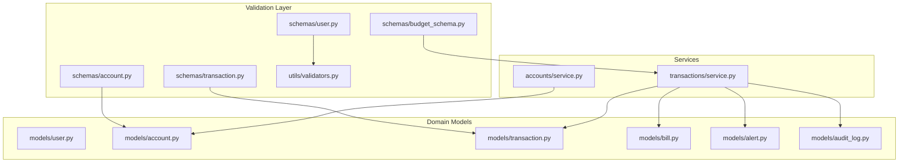
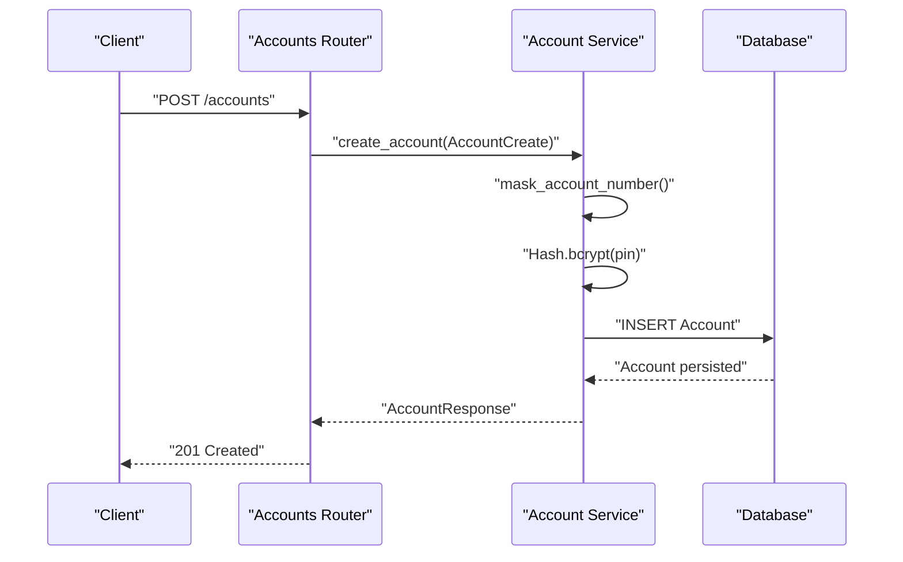
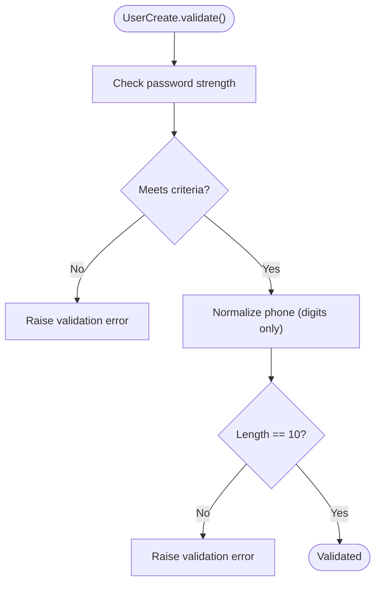
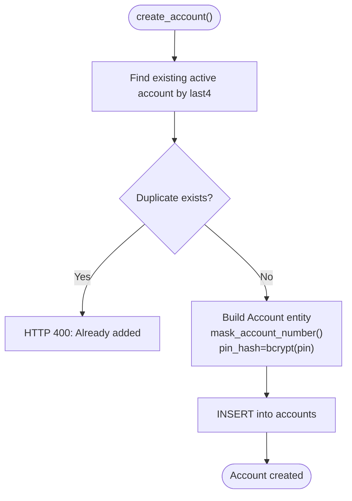
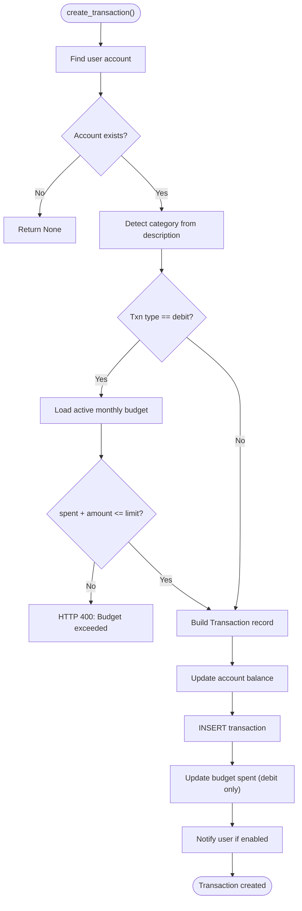
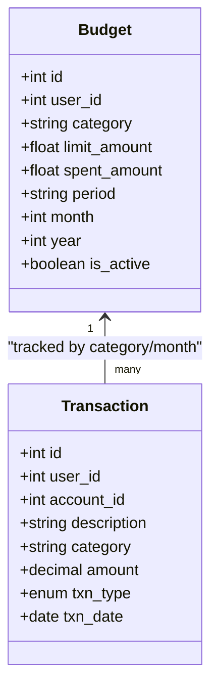
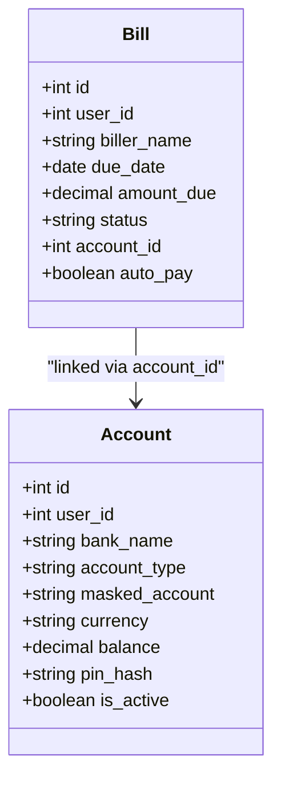
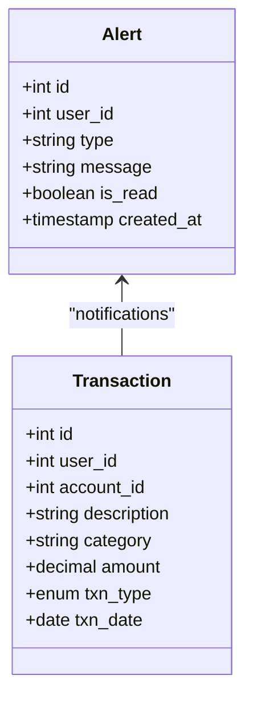
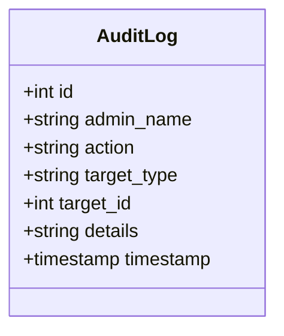
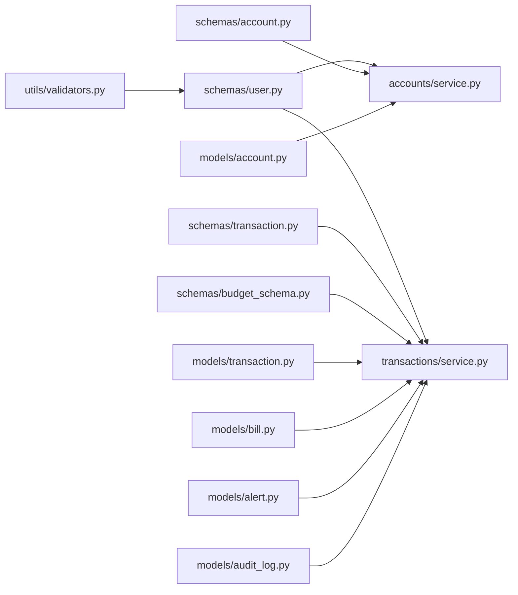

# Data Validation Rules

<cite>
**Referenced Files in This Document**
- [validators.py](file://backend/app/utils/validators.py)
- [user.py](file://backend/app/models/user.py)
- [user.py](file://backend/app/schemas/user.py)
- [account.py](file://backend/app/models/account.py)
- [account.py](file://backend/app/accounts/service.py)
- [transaction.py](file://backend/app/models/transaction.py)
- [transaction.py](file://backend/app/transactions/service.py)
- [budget_schema.py](file://backend/app/schemas/budget_schema.py)
- [bill.py](file://backend/app/models/bill.py)
- [alert.py](file://backend/app/models/alert.py)
- [audit_log.py](file://backend/app/models/audit_log.py)
</cite>

## Table of Contents
1. [Introduction](#introduction)
2. [Project Structure](#project-structure)
3. [Core Components](#core-components)
4. [Architecture Overview](#architecture-overview)
5. [Detailed Component Analysis](#detailed-component-analysis)
6. [Dependency Analysis](#dependency-analysis)
7. [Performance Considerations](#performance-considerations)
8. [Troubleshooting Guide](#troubleshooting-guide)
9. [Conclusion](#conclusion)

## Introduction
This document defines the data validation rules and business logic constraints implemented in the banking application database and backend services. It focuses on:
- Input validation for user registration and profile updates
- Account creation and management constraints
- Transaction amount limits and validation
- Budget allocation rules and spending caps
- Bill payment validation and due date handling
- Reward points calculation and redemption rules
- Alert threshold configurations
- Audit log data integrity requirements

The goal is to explain how validation prevents data corruption and maintains system integrity, with references to concrete source files and implementation patterns.

## Project Structure
The validation and business logic are implemented across:
- Pydantic schemas for request/response validation
- SQLAlchemy models for database constraints and relationships
- Services for business rule enforcement and data sanitization
- Utility modules for shared validation helpers

**Diagram sources**
- [user.py:1-55](file://backend/app/schemas/user.py#L1-L55)
- [account.py:1-34](file://backend/app/schemas/account.py#L1-L34)
- [transaction.py:1-20](file://backend/app/schemas/transaction.py#L1-L20)
- [budget_schema.py:1-18](file://backend/app/schemas/budget_schema.py#L1-L18)
- [validators.py:1-47](file://backend/app/utils/validators.py#L1-L47)
- [user.py:1-65](file://backend/app/models/user.py#L1-L65)
- [account.py:1-57](file://backend/app/models/account.py#L1-L57)
- [transaction.py:1-58](file://backend/app/models/transaction.py#L1-L58)
- [bill.py:1-45](file://backend/app/models/bill.py#L1-L45)
- [alert.py:1-34](file://backend/app/models/alert.py#L1-L34)
- [audit_log.py:1-19](file://backend/app/models/audit_log.py#L1-L19)
- [account.py:1-111](file://backend/app/accounts/service.py#L1-L111)
- [transaction.py:1-188](file://backend/app/transactions/service.py#L1-L188)

**Section sources**
- [user.py:1-55](file://backend/app/schemas/user.py#L1-L55)
- [account.py:1-34](file://backend/app/schemas/account.py#L1-L34)
- [transaction.py:1-20](file://backend/app/schemas/transaction.py#L1-L20)
- [budget_schema.py:1-18](file://backend/app/schemas/budget_schema.py#L1-L18)
- [validators.py:1-47](file://backend/app/utils/validators.py#L1-L47)
- [user.py:1-65](file://backend/app/models/user.py#L1-L65)
- [account.py:1-57](file://backend/app/models/account.py#L1-L57)
- [transaction.py:1-58](file://backend/app/models/transaction.py#L1-L58)
- [bill.py:1-45](file://backend/app/models/bill.py#L1-L45)
- [alert.py:1-34](file://backend/app/models/alert.py#L1-L34)
- [audit_log.py:1-19](file://backend/app/models/audit_log.py#L1-L19)
- [account.py:1-111](file://backend/app/accounts/service.py#L1-L111)
- [transaction.py:1-188](file://backend/app/transactions/service.py#L1-L188)

## Core Components
- Password strength and phone normalization validators
- User registration and profile update schemas with enforced constraints
- Account creation and PIN hashing with duplicate detection
- Transaction creation with budget validation and balance updates
- Budget allocation and spending cap enforcement
- Bill payment validation and due date handling
- Alert generation and persistence
- Audit logging for administrative actions

**Section sources**
- [validators.py:23-47](file://backend/app/utils/validators.py#L23-L47)
- [user.py:7-28](file://backend/app/schemas/user.py#L7-L28)
- [account.py:55-75](file://backend/app/accounts/service.py#L55-L75)
- [transaction.py:105-149](file://backend/app/transactions/service.py#L105-L149)
- [budget_schema.py:4-8](file://backend/app/schemas/budget_schema.py#L4-L8)
- [bill.py:18-44](file://backend/app/models/bill.py#L18-L44)
- [alert.py:17-34](file://backend/app/models/alert.py#L17-L34)
- [audit_log.py:6-19](file://backend/app/models/audit_log.py#L6-L19)

## Architecture Overview
The validation pipeline follows a layered approach:
- Input schemas validate and sanitize request payloads
- Services enforce business rules and orchestrate domain operations
- Models define database constraints and relationships
- Utilities centralize reusable validation logic

**Diagram sources**
- [account.py:55-75](file://backend/app/accounts/service.py#L55-L75)
- [account.py:31-57](file://backend/app/models/account.py#L31-L57)

## Detailed Component Analysis

### User Registration and Profile Update Validation
- Password strength enforced via regex pattern ensuring minimum length and inclusion of uppercase, lowercase, digit, and special character.
- Phone number normalized to 10 digits; non-digit characters are stripped.
- Email validated using Pydantic’s EmailStr.
- Optional profile fields (date of birth, address, pin code) accepted with no enforced constraints beyond presence checks.

**Diagram sources**
- [validators.py:23-47](file://backend/app/utils/validators.py#L23-L47)
- [user.py:16-27](file://backend/app/schemas/user.py#L16-L27)

**Section sources**
- [validators.py:23-47](file://backend/app/utils/validators.py#L23-L47)
- [user.py:7-28](file://backend/app/schemas/user.py#L7-L28)
- [user.py:37-65](file://backend/app/models/user.py#L37-L65)

### Account Creation and Management Constraints
- Duplicate detection by last four digits of account number for active accounts per user.
- Masked account number generated for display and privacy.
- Transaction PIN hashed using bcrypt before storage.
- Account deletion requires PIN verification; otherwise unauthorized removal is prevented.

**Diagram sources**
- [account.py:55-75](file://backend/app/accounts/service.py#L55-L75)
- [account.py:31-57](file://backend/app/models/account.py#L31-L57)

**Section sources**
- [account.py:55-111](file://backend/app/accounts/service.py#L55-L111)
- [account.py:31-57](file://backend/app/models/account.py#L31-L57)

### Transaction Amount Limits and Validation
- Debit transactions are validated against active monthly budgets for the detected category.
- Budget limit check compares spent amount plus new transaction amount against the limit.
- Balance updates occur atomically with transaction creation.
- Category detection supports Food, Travel, Bills; others default to Others.

**Diagram sources**
- [transaction.py:105-149](file://backend/app/transactions/service.py#L105-L149)
- [transaction.py:32-58](file://backend/app/models/transaction.py#L32-L58)

**Section sources**
- [transaction.py:105-188](file://backend/app/transactions/service.py#L105-L188)
- [transaction.py:32-58](file://backend/app/models/transaction.py#L32-L58)

### Budget Allocation Rules and Spending Caps
- Budgets are stored per user, category, and month/year.
- Active budgets are enforced during debit transactions.
- Spent amount increments after successful debit transaction.
- Budget creation accepts category, amount, and period (default monthly).

**Diagram sources**
- [budget_schema.py:4-18](file://backend/app/schemas/budget_schema.py#L4-L18)
- [transaction.py:152-162](file://backend/app/transactions/service.py#L152-L162)

**Section sources**
- [budget_schema.py:1-18](file://backend/app/schemas/budget_schema.py#L1-L18)
- [transaction.py:46-64](file://backend/app/transactions/service.py#L46-L64)
- [transaction.py:152-162](file://backend/app/transactions/service.py#L152-L162)

### Bill Payment Validation and Due Date Handling
- Bills are associated with users and accounts.
- Due dates are mandatory; amounts due must be positive.
- Status defaults to upcoming and transitions to paid or overdue based on processing.
- Auto-pay flag enables automatic deduction from linked account.

**Diagram sources**
- [bill.py:18-44](file://backend/app/models/bill.py#L18-L44)
- [account.py:31-57](file://backend/app/models/account.py#L31-L57)

**Section sources**
- [bill.py:18-44](file://backend/app/models/bill.py#L18-L44)

### Alert Threshold Configurations
- Alerts are persisted with type, message, and read status.
- Transaction notifications are triggered based on user settings.
- Alert persistence ensures auditability of system-generated reminders.

**Diagram sources**
- [alert.py:17-34](file://backend/app/models/alert.py#L17-L34)
- [transaction.py:87-103](file://backend/app/transactions/service.py#L87-L103)

**Section sources**
- [alert.py:17-34](file://backend/app/models/alert.py#L17-L34)
- [transaction.py:87-103](file://backend/app/transactions/service.py#L87-L103)

### Audit Log Data Integrity Requirements
- Audit logs capture administrative actions with timestamps.
- Fields include admin name, action, target type/id, and optional details.
- Timestamps are server-assigned for integrity.

**Diagram sources**
- [audit_log.py:6-19](file://backend/app/models/audit_log.py#L6-L19)

**Section sources**
- [audit_log.py:1-19](file://backend/app/models/audit_log.py#L1-L19)

## Dependency Analysis
- Schemas depend on validators for password and phone normalization.
- Services depend on models for persistence and on each other for cross-domain operations.
- Transactions service integrates with budgets, alerts, and user settings.
- Accounts service integrates with hashing utilities and models.

**Diagram sources**
- [validators.py:1-47](file://backend/app/utils/validators.py#L1-L47)
- [user.py:1-55](file://backend/app/schemas/user.py#L1-L55)
- [account.py:1-34](file://backend/app/schemas/account.py#L1-L34)
- [transaction.py:1-20](file://backend/app/schemas/transaction.py#L1-L20)
- [budget_schema.py:1-18](file://backend/app/schemas/budget_schema.py#L1-L18)
- [account.py:1-111](file://backend/app/accounts/service.py#L1-L111)
- [transaction.py:1-188](file://backend/app/transactions/service.py#L1-L188)
- [bill.py:1-45](file://backend/app/models/bill.py#L1-L45)
- [alert.py:1-34](file://backend/app/models/alert.py#L1-L34)
- [audit_log.py:1-19](file://backend/app/models/audit_log.py#L1-L19)

**Section sources**
- [validators.py:1-47](file://backend/app/utils/validators.py#L1-L47)
- [user.py:1-55](file://backend/app/schemas/user.py#L1-L55)
- [account.py:1-34](file://backend/app/schemas/account.py#L1-L34)
- [transaction.py:1-20](file://backend/app/schemas/transaction.py#L1-L20)
- [budget_schema.py:1-18](file://backend/app/schemas/budget_schema.py#L1-L18)
- [account.py:1-111](file://backend/app/accounts/service.py#L1-L111)
- [transaction.py:1-188](file://backend/app/transactions/service.py#L1-L188)
- [bill.py:1-45](file://backend/app/models/bill.py#L1-L45)
- [alert.py:1-34](file://backend/app/models/alert.py#L1-L34)
- [audit_log.py:1-19](file://backend/app/models/audit_log.py#L1-L19)

## Performance Considerations
- Centralized validators reduce duplication and improve consistency.
- Service-level checks (e.g., duplicate account detection, budget limits) avoid unnecessary database writes.
- Category detection is O(1) string matching; consider caching frequently used categories if needed.
- Balance updates and budget increments are single-table operations; ensure appropriate indexing on user_id, category, and date fields.

## Troubleshooting Guide
Common validation failures and resolutions:
- Password does not meet strength criteria: Ensure the password satisfies minimum length and includes uppercase, lowercase, digit, and special character requirements.
- Phone number invalid: Provide exactly 10 digits; non-digit characters are automatically stripped.
- Duplicate account detected: Use a different account number; duplicates are disallowed for active accounts.
- Budget exceeded: Reduce transaction amount or increase budget limit for the category.
- Invalid PIN during account deletion: Re-enter the correct PIN; incorrect attempts trigger unauthorized access errors.
- Account not found: Verify the account ID and ownership; only accounts belonging to the user can be managed.

**Section sources**
- [validators.py:23-47](file://backend/app/utils/validators.py#L23-L47)
- [account.py:55-111](file://backend/app/accounts/service.py#L55-L111)
- [transaction.py:29-64](file://backend/app/transactions/service.py#L29-L64)

## Conclusion
The banking application enforces robust data validation and business logic through a combination of Pydantic schemas, SQLAlchemy models, and service-layer rules. Validators ensure strong credentials and sanitized inputs, while services enforce constraints such as duplicate prevention, budget caps, and PIN-protected operations. These mechanisms collectively prevent data corruption and maintain system integrity across user registration, account management, transactions, budgets, bills, alerts, and audit trails.