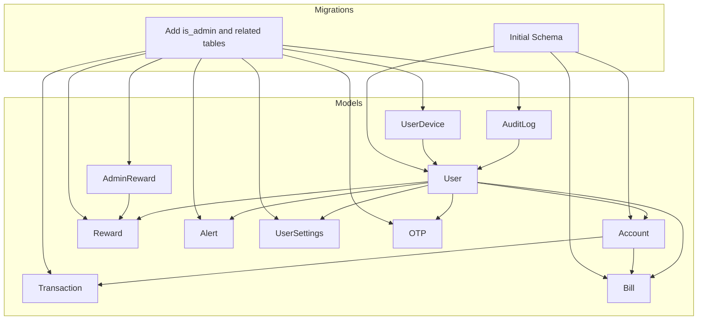
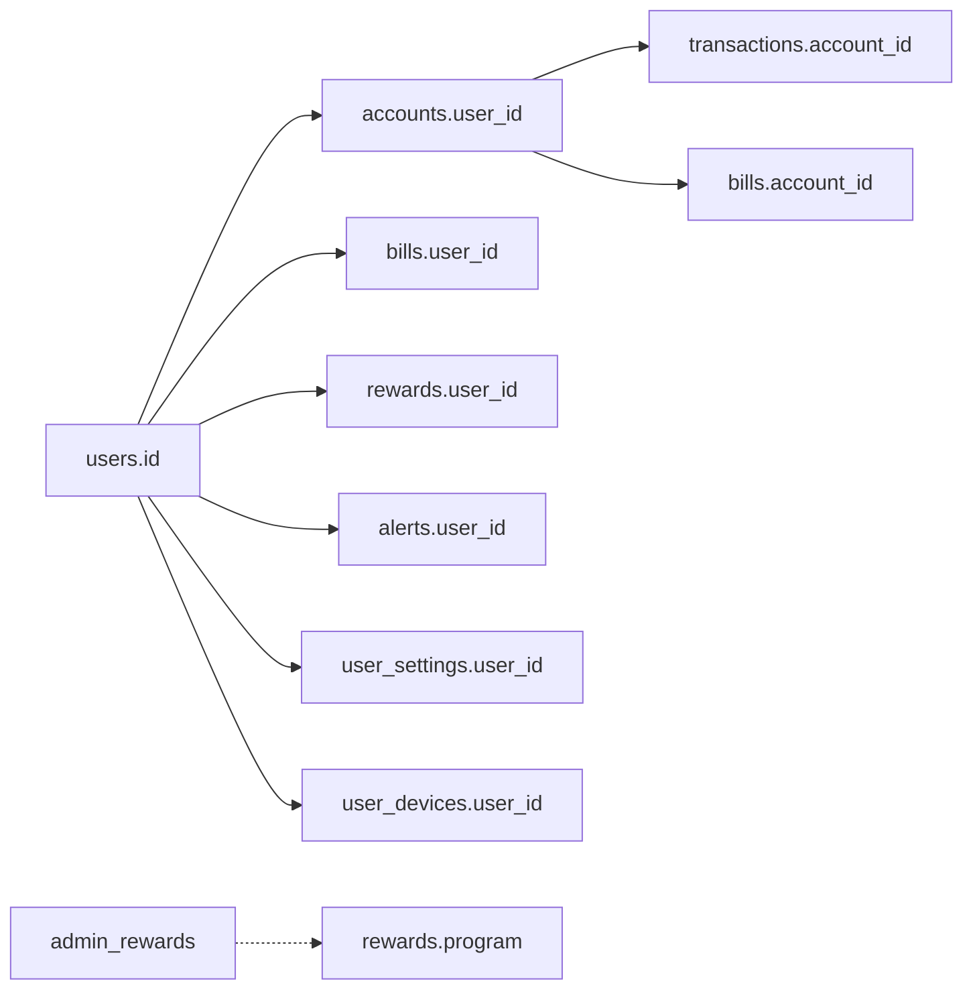
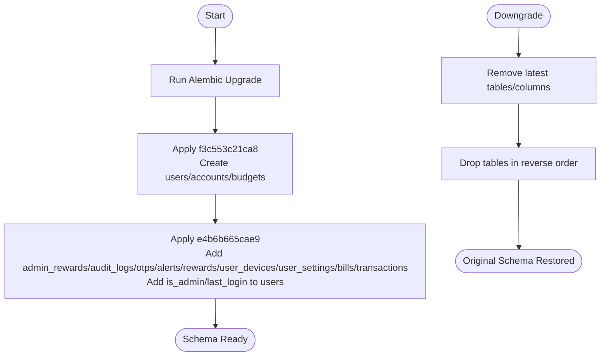

# Database Design

<cite>
**Referenced Files in This Document**
- [backend/app/models/__init__.py](file://backend/app/models/__init__.py)
- [backend/app/models/user.py](file://backend/app/models/user.py)
- [backend/app/models/account.py](file://backend/app/models/account.py)
- [backend/app/models/transaction.py](file://backend/app/models/transaction.py)
- [backend/app/models/bill.py](file://backend/app/models/bill.py)
- [backend/app/models/reward.py](file://backend/app/models/reward.py)
- [backend/app/models/alert.py](file://backend/app/models/alert.py)
- [backend/app/models/audit_log.py](file://backend/app/models/audit_log.py)
- [backend/app/models/user_device.py](file://backend/app/models/user_device.py)
- [backend/app/models/user_settings.py](file://backend/app/models/user_settings.py)
- [backend/app/models/otp.py](file://backend/app/models/otp.py)
- [backend/app/models/admin_rewards.py](file://backend/app/models/admin_rewards.py)
- [backend/alembic/versions/f3c553c21ca8_initial_schema.py](file://backend/alembic/versions/f3c553c21ca8_initial_schema.py)
- [backend/alembic/versions/e4b6b665cae9_add_is_admin_to_users.py](file://backend/alembic/versions/e4b6b665cae9_add_is_admin_to_users.py)
</cite>

## Table of Contents
1. [Introduction](#introduction)
2. [Project Structure](#project-structure)
3. [Core Components](#core-components)
4. [Architecture Overview](#architecture-overview)
5. [Detailed Component Analysis](#detailed-component-analysis)
6. [Dependency Analysis](#dependency-analysis)
7. [Performance Considerations](#performance-considerations)
8. [Troubleshooting Guide](#troubleshooting-guide)
9. [Conclusion](#conclusion)
10. [Appendices](#appendices)

## Introduction
This document describes the database design for the banking application, focusing on the data model, entity relationships, constraints, indexes, and migrations. It covers the main entities: users, accounts, transactions, budgets, bills, rewards, alerts, audit logs, user devices, user settings, OTPs, and admin rewards. It also documents referential integrity, data validation rules, lifecycle management, and security considerations at the database level.

## Project Structure
The database schema is defined via SQLAlchemy models under backend/app/models and managed by Alembic migrations under backend/alembic/versions. The models define tables, columns, data types, constraints, and relationships. Alembic migrations define the initial schema and subsequent additions.



**Diagram sources**
- [backend/app/models/user.py:37-65](file://backend/app/models/user.py#L37-L65)
- [backend/app/models/account.py:31-57](file://backend/app/models/account.py#L31-L57)
- [backend/app/models/transaction.py:32-58](file://backend/app/models/transaction.py#L32-L58)
- [backend/app/models/bill.py:18-45](file://backend/app/models/bill.py#L18-L45)
- [backend/app/models/reward.py:5-14](file://backend/app/models/reward.py#L5-L14)
- [backend/app/models/alert.py:17-34](file://backend/app/models/alert.py#L17-L34)
- [backend/app/models/audit_log.py:6-19](file://backend/app/models/audit_log.py#L6-L19)
- [backend/app/models/user_device.py:5-12](file://backend/app/models/user_device.py#L5-L12)
- [backend/app/models/user_settings.py:4-14](file://backend/app/models/user_settings.py#L4-L14)
- [backend/app/models/otp.py:5-16](file://backend/app/models/otp.py#L5-L16)
- [backend/app/models/admin_rewards.py:11-33](file://backend/app/models/admin_rewards.py#L11-L33)
- [backend/alembic/versions/f3c553c21ca8_initial_schema.py:18-66](file://backend/alembic/versions/f3c553c21ca8_initial_schema.py#L18-L66)
- [backend/alembic/versions/e4b6b665cae9_add_is_admin_to_users.py:18-126](file://backend/alembic/versions/e4b6b665cae9_add_is_admin_to_users.py#L18-L126)

**Section sources**
- [backend/app/models/__init__.py:1-13](file://backend/app/models/__init__.py#L1-L13)
- [backend/alembic/versions/f3c553c21ca8_initial_schema.py:18-66](file://backend/alembic/versions/f3c553c21ca8_initial_schema.py#L18-L66)
- [backend/alembic/versions/e4b6b665cae9_add_is_admin_to_users.py:18-126](file://backend/alembic/versions/e4b6b665cae9_add_is_admin_to_users.py#L18-L126)

## Core Components
This section summarizes the main entities, their fields, data types, constraints, and relationships.

- Users
  - Purpose: Store customer identities, credentials, KYC status, and administrative flags.
  - Key fields: id (PK), name, email (unique), password, phone, dob, address, pin_code, kyc_status (enum), created_at, reset_token, reset_token_expiry, is_admin, last_login.
  - Constraints: Unique email; default kyc_status; server-side timestamps; optional fields for personal details.
  - Relationships: One-to-many with accounts; one-to-one with user_settings; one-to-many with alerts, bills, rewards, user_devices, otps.

- Accounts
  - Purpose: Store bank account details linked to users, including masked account number, currency, balance, PIN hash, and activity flag.
  - Key fields: id (PK), user_id (FK), bank_name, account_type, masked_account, currency, balance, pin_hash, is_active, created_at.
  - Constraints: Foreign key to users with cascade delete; numeric precision/scale for balance; default currency; default active flag.
  - Relationships: Many-to-one to user; many-to-one with bills; many-to-one with transactions.

- Transactions
  - Purpose: Record financial movements (debit/credit) per user and account.
  - Key fields: id (PK), user_id (FK), account_id (FK), description, category, merchant, amount (numeric), currency, txn_type (enum), txn_date, created_at.
  - Constraints: Foreign keys to users and accounts; enum for transaction type; server-side default timestamp.
  - Relationships: Belongs to user and account.

- Budgets
  - Purpose: Track monthly spending limits per category for users.
  - Key fields: id (PK), user_id (FK), month, year, category, limit_amount (numeric), spent_amount (numeric), created_at.
  - Constraints: Foreign key to users; server-side default timestamp.
  - Relationships: Belongs to user.

- Bills
  - Purpose: Manage recurring or one-time bill payees, due dates, amounts, status, and autopay preferences.
  - Key fields: id (PK), user_id (FK), biller_name, due_date, amount_due (numeric), status, account_id (FK), auto_pay.
  - Constraints: Foreign keys to users and accounts; default status; autopay flag.
  - Relationships: Belongs to user and account.

- Rewards
  - Purpose: Track user reward points balances and last updated timestamp.
  - Key fields: id (PK), user_id (FK), program_name, points_balance, last_updated.
  - Constraints: Foreign key to users; server-side default timestamp.
  - Relationships: Belongs to user.

- Alerts
  - Purpose: Store system-generated notifications for users (e.g., bill due, low balance).
  - Key fields: id (PK), user_id (FK), type, message, is_read, created_at.
  - Constraints: Foreign key to users; server-side default timestamp; default unread.
  - Relationships: Belongs to user.

- Audit Logs
  - Purpose: Log administrative actions with target metadata and details.
  - Key fields: id (PK), admin_name, action, target_type, target_id, details, timestamp.
  - Constraints: Server-side default timestamp.
  - Relationships: No foreign key dependencies.

- User Devices
  - Purpose: Store push notification device tokens per user.
  - Key fields: id (PK), user_id (FK), device_token (unique), platform.
  - Constraints: Unique device_token; foreign key to users.
  - Relationships: Belongs to user.

- User Settings
  - Purpose: Per-user preference flags for notifications and security.
  - Key fields: id (PK), user_id (FK, unique), push_notifications, email_alerts, login_alerts, two_factor_enabled.
  - Constraints: Unique user_id; foreign key to users.
  - Relationships: One-to-one with user.

- OTPs
  - Purpose: Temporary authentication codes with expiration.
  - Key fields: id (PK), identifier (index), otp, expires_at.
  - Constraints: Index on identifier; expiry helper method.
  - Relationships: No foreign key dependencies.

- Admin Rewards
  - Purpose: Define reward programs (cashback, offer, referral) with status and metadata.
  - Key fields: id (PK), name, description, reward_type, applies_to, value, status (enum), created_at.
  - Constraints: Enum for status; server-side default timestamp.
  - Relationships: No foreign key dependencies.

**Section sources**
- [backend/app/models/user.py:37-65](file://backend/app/models/user.py#L37-L65)
- [backend/app/models/account.py:31-57](file://backend/app/models/account.py#L31-L57)
- [backend/app/models/transaction.py:32-58](file://backend/app/models/transaction.py#L32-L58)
- [backend/app/models/bill.py:18-45](file://backend/app/models/bill.py#L18-L45)
- [backend/app/models/reward.py:5-14](file://backend/app/models/reward.py#L5-L14)
- [backend/app/models/alert.py:17-34](file://backend/app/models/alert.py#L17-L34)
- [backend/app/models/audit_log.py:6-19](file://backend/app/models/audit_log.py#L6-L19)
- [backend/app/models/user_device.py:5-12](file://backend/app/models/user_device.py#L5-L12)
- [backend/app/models/user_settings.py:4-14](file://backend/app/models/user_settings.py#L4-L14)
- [backend/app/models/otp.py:5-16](file://backend/app/models/otp.py#L5-L16)
- [backend/app/models/admin_rewards.py:11-33](file://backend/app/models/admin_rewards.py#L11-L33)

## Architecture Overview
The database follows a normalized relational design with explicit foreign keys and cascading deletes for dependent resources. The migration history defines the evolution from a minimal schema to a richer set of tables supporting advanced features like alerts, rewards, audit logging, and admin controls.

```mermaid
erDiagram
USERS {
int id PK
string name
string email UK
string password
string phone
date dob
string address
string pin_code
enum kyc_status
timestamp created_at
string reset_token
timestamp reset_token_expiry
boolean is_admin
timestamp last_login
}
ACCOUNTS {
int id PK
int user_id FK
string bank_name
string account_type
string masked_account
string currency
numeric balance
string pin_hash
boolean is_active
timestamp created_at
}
TRANSACTIONS {
int id PK
int user_id FK
int account_id FK
string description
string category
string merchant
numeric amount
string currency
enum txn_type
date txn_date
timestamp created_at
}
BUDGETS {
int id PK
int user_id FK
int month
int year
string category
numeric limit_amount
numeric spent_amount
timestamp created_at
}
BILLS {
int id PK
int user_id FK
string biller_name
date due_date
numeric amount_due
string status
int account_id FK
boolean auto_pay
}
REWARDS {
int id PK
int user_id FK
string program_name
int points_balance
timestamp last_updated
}
ALERTS {
int id PK
int user_id FK
string type
string message
boolean is_read
timestamp created_at
}
AUDIT_LOGS {
int id PK
string admin_name
string action
string target_type
int target_id
string details
timestamp timestamp
}
USER_DEVICES {
int id PK
int user_id FK
string device_token UK
string platform
}
USER_SETTINGS {
int id PK
int user_id UK
boolean push_notifications
boolean email_alerts
boolean login_alerts
boolean two_factor_enabled
}
OTPS {
int id PK
string identifier IDX
string otp
timestamp expires_at
}
ADMIN_REWARDS {
int id PK
string name
string description
string reward_type
string applies_to
string value
enum status
timestamp created_at
}
USERS ||--o{ ACCOUNTS : "has many"
USERS ||--o{ BILLS : "has many"
USERS ||--o{ REWARDS : "has many"
USERS ||--o{ ALERTS : "has many"
USERS ||--o{ USER_SETTINGS : "has one"
USERS ||--o{ USER_DEVICES : "has many"
USERS ||--o{ OTPS : "has many"
ACCOUNTS ||--o{ BILLS : "linked by"
ACCOUNTS ||--o{ TRANSACTIONS : "linked by"
ADMIN_REWARDS ||--o{ REWARDS : "programs"
```

**Diagram sources**
- [backend/alembic/versions/f3c553c21ca8_initial_schema.py:18-66](file://backend/alembic/versions/f3c553c21ca8_initial_schema.py#L18-L66)
- [backend/alembic/versions/e4b6b665cae9_add_is_admin_to_users.py:18-126](file://backend/alembic/versions/e4b6b665cae9_add_is_admin_to_users.py#L18-L126)
- [backend/app/models/user.py:37-65](file://backend/app/models/user.py#L37-L65)
- [backend/app/models/account.py:31-57](file://backend/app/models/account.py#L31-L57)
- [backend/app/models/transaction.py:32-58](file://backend/app/models/transaction.py#L32-L58)
- [backend/app/models/bill.py:18-45](file://backend/app/models/bill.py#L18-L45)
- [backend/app/models/reward.py:5-14](file://backend/app/models/reward.py#L5-L14)
- [backend/app/models/alert.py:17-34](file://backend/app/models/alert.py#L17-L34)
- [backend/app/models/audit_log.py:6-19](file://backend/app/models/audit_log.py#L6-L19)
- [backend/app/models/user_device.py:5-12](file://backend/app/models/user_device.py#L5-L12)
- [backend/app/models/user_settings.py:4-14](file://backend/app/models/user_settings.py#L4-L14)
- [backend/app/models/otp.py:5-16](file://backend/app/models/otp.py#L5-L16)
- [backend/app/models/admin_rewards.py:11-33](file://backend/app/models/admin_rewards.py#L11-L33)

## Detailed Component Analysis

### Users
- Data types and constraints:
  - id: integer, primary key, indexed.
  - email: string, unique, indexed.
  - kyc_status: enum with default unverified.
  - created_at: timestamp with server default.
  - is_admin: boolean, default false.
  - last_login: timestamp, nullable.
- Validation and business rules:
  - Email uniqueness enforced at DB level.
  - KYC status defaults to unverified until updated.
  - Optional personal fields allow partial profiles.
- Lifecycle:
  - Created on registration; last_login updated on successful authentication.
- Security:
  - Password stored as hashed value; sensitive fields excluded from non-admin views.

**Section sources**
- [backend/app/models/user.py:37-65](file://backend/app/models/user.py#L37-L65)
- [backend/alembic/versions/f3c553c21ca8_initial_schema.py:20-36](file://backend/alembic/versions/f3c553c21ca8_initial_schema.py#L20-L36)

### Accounts
- Data types and constraints:
  - user_id: integer, foreign key to users with cascade delete.
  - masked_account: string, unique per account.
  - balance: numeric with precision 12, scale 2; default 0.
  - currency: string with 3-letter code; default INR.
  - pin_hash: string storing a secure hash of the transaction PIN.
  - is_active: boolean, default true.
- Validation and business rules:
  - Cascade delete ensures accounts are removed when user is deleted.
  - Balance constrained to monetary precision.
- Lifecycle:
  - Created upon account addition; can be deactivated via is_active flag.
- Security:
  - PIN stored as a cryptographic hash; never stored in plaintext.

**Section sources**
- [backend/app/models/account.py:31-57](file://backend/app/models/account.py#L31-L57)
- [backend/alembic/versions/f3c553c21ca8_initial_schema.py:37-50](file://backend/alembic/versions/f3c553c21ca8_initial_schema.py#L37-L50)

### Transactions
- Data types and constraints:
  - user_id and account_id: foreign keys to users and accounts.
  - amount: numeric with precision 12, scale 2.
  - txn_type: enum debit/credit.
  - created_at: timestamp with server default.
- Validation and business rules:
  - Debits reduce balance; credits increase balance (business logic enforced by application).
  - Category defaults to Uncategorized if unspecified.
- Lifecycle:
  - Inserted on payment completion; timestamped automatically.

**Section sources**
- [backend/app/models/transaction.py:32-58](file://backend/app/models/transaction.py#L32-L58)
- [backend/alembic/versions/e4b6b665cae9_add_is_admin_to_users.py:107-122](file://backend/alembic/versions/e4b6b665cae9_add_is_admin_to_users.py#L107-L122)

### Budgets
- Data types and constraints:
  - user_id: foreign key to users.
  - limit_amount and spent_amount: numeric with precision 12, scale 2.
  - Composite monthly budget per category.
- Validation and business rules:
  - Enforced at application level to prevent overspending.
- Lifecycle:
  - Created per month/year/category; updated as transactions occur.

**Section sources**
- [backend/alembic/versions/f3c553c21ca8_initial_schema.py:52-66](file://backend/alembic/versions/f3c553c21ca8_initial_schema.py#L52-L66)

### Bills
- Data types and constraints:
  - user_id and account_id: foreign keys to users and accounts.
  - amount_due: numeric with precision 12, scale 2.
  - status: string with default upcoming.
  - auto_pay: boolean.
- Validation and business rules:
  - Status transitions driven by payment and due-date logic.
  - Auto-pay requires a linked account.
- Lifecycle:
  - Created by user; updated on payment or reminder events.

**Section sources**
- [backend/app/models/bill.py:18-45](file://backend/app/models/bill.py#L18-L45)
- [backend/alembic/versions/e4b6b665cae9_add_is_admin_to_users.py:93-106](file://backend/alembic/versions/e4b6b665cae9_add_is_admin_to_users.py#L93-L106)

### Rewards
- Data types and constraints:
  - user_id: foreign key to users.
  - points_balance: integer; default 0.
  - last_updated: timestamp with server default.
- Validation and business rules:
  - Points balance maintained per program; updated on qualifying transactions.
- Lifecycle:
  - Created on first accrual; updated on subsequent transactions.

**Section sources**
- [backend/app/models/reward.py:5-14](file://backend/app/models/reward.py#L5-L14)
- [backend/alembic/versions/e4b6b665cae9_add_is_admin_to_users.py:62-71](file://backend/alembic/versions/e4b6b665cae9_add_is_admin_to_users.py#L62-L71)

### Alerts
- Data types and constraints:
  - user_id: foreign key to users.
  - type: string describing alert category.
  - message: string content.
  - is_read: boolean, default false.
  - created_at: timestamp with server default.
- Validation and business rules:
  - Alerts marked read after user acknowledgment.
- Lifecycle:
  - Generated by system tasks or user actions; persisted until read.

**Section sources**
- [backend/app/models/alert.py:17-34](file://backend/app/models/alert.py#L17-L34)
- [backend/alembic/versions/e4b6b665cae9_add_is_admin_to_users.py:51-61](file://backend/alembic/versions/e4b6b665cae9_add_is_admin_to_users.py#L51-L61)

### Audit Logs
- Data types and constraints:
  - admin_name: string.
  - action: string describing operation.
  - target_type and target_id: optional metadata.
  - details: string for free-form info.
  - timestamp: timestamp with server default.
- Validation and business rules:
  - Logged for administrative actions; supports forensics.
- Lifecycle:
  - Append-only log; retention governed by policy.

**Section sources**
- [backend/app/models/audit_log.py:6-19](file://backend/app/models/audit_log.py#L6-L19)
- [backend/alembic/versions/e4b6b665cae9_add_is_admin_to_users.py:32-41](file://backend/alembic/versions/e4b6b665cae9_add_is_admin_to_users.py#L32-L41)

### User Devices
- Data types and constraints:
  - user_id: foreign key to users.
  - device_token: string, unique.
  - platform: string (android/ios).
- Validation and business rules:
  - Device token uniqueness prevents duplicates.
- Lifecycle:
  - Registered on device login; removed on logout or deactivation.

**Section sources**
- [backend/app/models/user_device.py:5-12](file://backend/app/models/user_device.py#L5-L12)
- [backend/alembic/versions/e4b6b665cae9_add_is_admin_to_users.py:72-81](file://backend/alembic/versions/e4b6b665cae9_add_is_admin_to_users.py#L72-L81)

### User Settings
- Data types and constraints:
  - user_id: unique foreign key to users.
  - Flags for push_notifications, email_alerts, login_alerts, two_factor_enabled.
- Validation and business rules:
  - One settings record per user enforced by unique constraint.
- Lifecycle:
  - Created on user registration; updated by user preferences.

**Section sources**
- [backend/app/models/user_settings.py:4-14](file://backend/app/models/user_settings.py#L4-L14)
- [backend/alembic/versions/e4b6b665cae9_add_is_admin_to_users.py:82-92](file://backend/alembic/versions/e4b6b665cae9_add_is_admin_to_users.py#L82-L92)

### OTPs
- Data types and constraints:
  - identifier: string indexed (email or phone).
  - otp: string.
  - expires_at: timestamp.
- Validation and business rules:
  - Expiry computed by helper method; cleanup handled by scheduler.
- Lifecycle:
  - Generated on demand; removed after use or expiry.

**Section sources**
- [backend/app/models/otp.py:5-16](file://backend/app/models/otp.py#L5-L16)
- [backend/alembic/versions/e4b6b665cae9_add_is_admin_to_users.py:42-49](file://backend/alembic/versions/e4b6b665cae9_add_is_admin_to_users.py#L42-L49)

### Admin Rewards
- Data types and constraints:
  - name, description, reward_type, applies_to, value: strings.
  - status: enum pending/active.
  - created_at: timestamp with server default.
- Validation and business rules:
  - Status controlled by admin workflow; value format depends on type.
- Lifecycle:
  - Created by admin; activated when ready.

**Section sources**
- [backend/app/models/admin_rewards.py:11-33](file://backend/app/models/admin_rewards.py#L11-L33)
- [backend/alembic/versions/e4b6b665cae9_add_is_admin_to_users.py:20-31](file://backend/alembic/versions/e4b6b665cae9_add_is_admin_to_users.py#L20-L31)

## Dependency Analysis
Foreign keys and referential integrity:
- users.id PK
  - accounts.user_id FK → CASCADE DELETE
  - bills.user_id FK
  - rewards.user_id FK
  - alerts.user_id FK
  - user_settings.user_id FK (unique)
  - user_devices.user_id FK
  - otps.identifier (logical association)
- accounts.id PK
  - bills.account_id FK
  - transactions.account_id FK
- enums and defaults:
  - KYCStatus, TransactionType, RewardStatus defined in models.
  - Server defaults for timestamps; enums default to safe values.



**Diagram sources**
- [backend/app/models/account.py:36-40](file://backend/app/models/account.py#L36-L40)
- [backend/app/models/bill.py:23-38](file://backend/app/models/bill.py#L23-L38)
- [backend/app/models/transaction.py:37-38](file://backend/app/models/transaction.py#L37-L38)
- [backend/app/models/reward.py:9-9](file://backend/app/models/reward.py#L9-L9)
- [backend/app/models/alert.py:21-21](file://backend/app/models/alert.py#L21-L21)
- [backend/app/models/user_settings.py:8-8](file://backend/app/models/user_settings.py#L8-L8)
- [backend/app/models/user_device.py:9-9](file://backend/app/models/user_device.py#L9-L9)
- [backend/app/models/admin_rewards.py:16-21](file://backend/app/models/admin_rewards.py#L16-L21)

**Section sources**
- [backend/app/models/account.py:36-40](file://backend/app/models/account.py#L36-L40)
- [backend/app/models/bill.py:23-38](file://backend/app/models/bill.py#L23-L38)
- [backend/app/models/transaction.py:37-38](file://backend/app/models/transaction.py#L37-L38)
- [backend/app/models/reward.py:9-9](file://backend/app/models/reward.py#L9-L9)
- [backend/app/models/alert.py:21-21](file://backend/app/models/alert.py#L21-L21)
- [backend/app/models/user_settings.py:8-8](file://backend/app/models/user_settings.py#L8-L8)
- [backend/app/models/user_device.py:9-9](file://backend/app/models/user_device.py#L9-L9)
- [backend/app/models/admin_rewards.py:16-21](file://backend/app/models/admin_rewards.py#L16-L21)

## Performance Considerations
- Indexes
  - users.email: unique index for fast lookup.
  - users.id, accounts.id, budgets.id, alerts.id, rewards.id, transactions.id, user_devices.id, otps.id, otps.identifier: standard indexes for joins and filters.
- Data types
  - Numeric with precision 12, scale 2 ensures accurate financial calculations.
  - Enum types minimize storage and improve query readability.
- Cascading deletes
  - accounts cascade-delete ensures clean removal of dependent records.
- Timestamps
  - Server defaults reduce application overhead and ensure consistent timezone handling.

[No sources needed since this section provides general guidance]

## Troubleshooting Guide
- Common issues and resolutions
  - Duplicate email on registration: Enforce unique constraint; handle IntegrityError at application boundary.
  - Missing user settings: Ensure user_settings creation on registration; check unique user_id constraint.
  - Expired OTP: Validate expires_at before accepting; schedule cleanup jobs.
  - Transaction balance inconsistencies: Verify debit/credit logic and ensure atomic updates.
  - Cascade deletion: Confirm cascade behavior for user deletion; test with dependent records.
- Audit trails
  - Use audit_logs to track admin actions; ensure consistent logging for sensitive operations.

**Section sources**
- [backend/app/models/user.py:42-42](file://backend/app/models/user.py#L42-L42)
- [backend/app/models/user_settings.py:8-8](file://backend/app/models/user_settings.py#L8-L8)
- [backend/app/models/otp.py:9-11](file://backend/app/models/otp.py#L9-L11)
- [backend/app/models/audit_log.py:6-19](file://backend/app/models/audit_log.py#L6-L19)

## Conclusion
The database schema is designed around clear entity boundaries, strong referential integrity, and practical constraints for financial data. Migrations document a clear evolution from a minimal core (users, accounts, budgets) to a feature-rich system (transactions, bills, alerts, rewards, audit logs, admin controls). Proper indexing, enum usage, and server defaults contribute to reliability and performance. Security is addressed through hashed PINs, OTP expiry, and admin audit logging.

[No sources needed since this section summarizes without analyzing specific files]

## Appendices

### Migration Management
- Initial schema (f3c553c21ca8)
  - Creates users, accounts, budgets with primary keys, foreign keys, and indexes.
- Subsequent schema (e4b6b665cae9)
  - Adds admin_rewards, audit_logs, otps, alerts, rewards, user_devices, user_settings, bills, transactions.
  - Adds is_admin and last_login columns to users.
- Downgrade paths remove tables and columns in reverse order.



**Diagram sources**
- [backend/alembic/versions/f3c553c21ca8_initial_schema.py:18-79](file://backend/alembic/versions/f3c553c21ca8_initial_schema.py#L18-L79)
- [backend/alembic/versions/e4b6b665cae9_add_is_admin_to_users.py:18-151](file://backend/alembic/versions/e4b6b665cae9_add_is_admin_to_users.py#L18-L151)

**Section sources**
- [backend/alembic/versions/f3c553c21ca8_initial_schema.py:18-79](file://backend/alembic/versions/f3c553c21ca8_initial_schema.py#L18-L79)
- [backend/alembic/versions/e4b6b665cae9_add_is_admin_to_users.py:18-151](file://backend/alembic/versions/e4b6b665cae9_add_is_admin_to_users.py#L18-L151)

### Sample Data Access Patterns
- Retrieve user accounts
  - Join users and accounts on user_id; filter by user id and is_active.
- List recent transactions
  - Join users, accounts, transactions; filter by user id and date range; order by created_at desc.
- Get unpaid bills with linked account details
  - Join bills with accounts; filter by user id and status != paid.
- Compute monthly budget utilization
  - Aggregate spent_amount per category/month/year for a user.
- Fetch unread alerts
  - Filter alerts by user id and is_read=false; order by created_at desc.

[No sources needed since this section provides general guidance]

### Data Security and Privacy
- Sensitive fields
  - Passwords and PIN hashes are stored as hashed values; never in plaintext.
  - OTPs include expiry timestamps; ensure cleanup jobs remove expired entries.
- Access control
  - Application-level checks ensure users can only access their own data.
  - Admin-only tables (audit_logs, admin_rewards) are restricted to administrators.
- Compliance
  - Unique constraints on email and device_token; audit logs support traceability.

[No sources needed since this section provides general guidance]