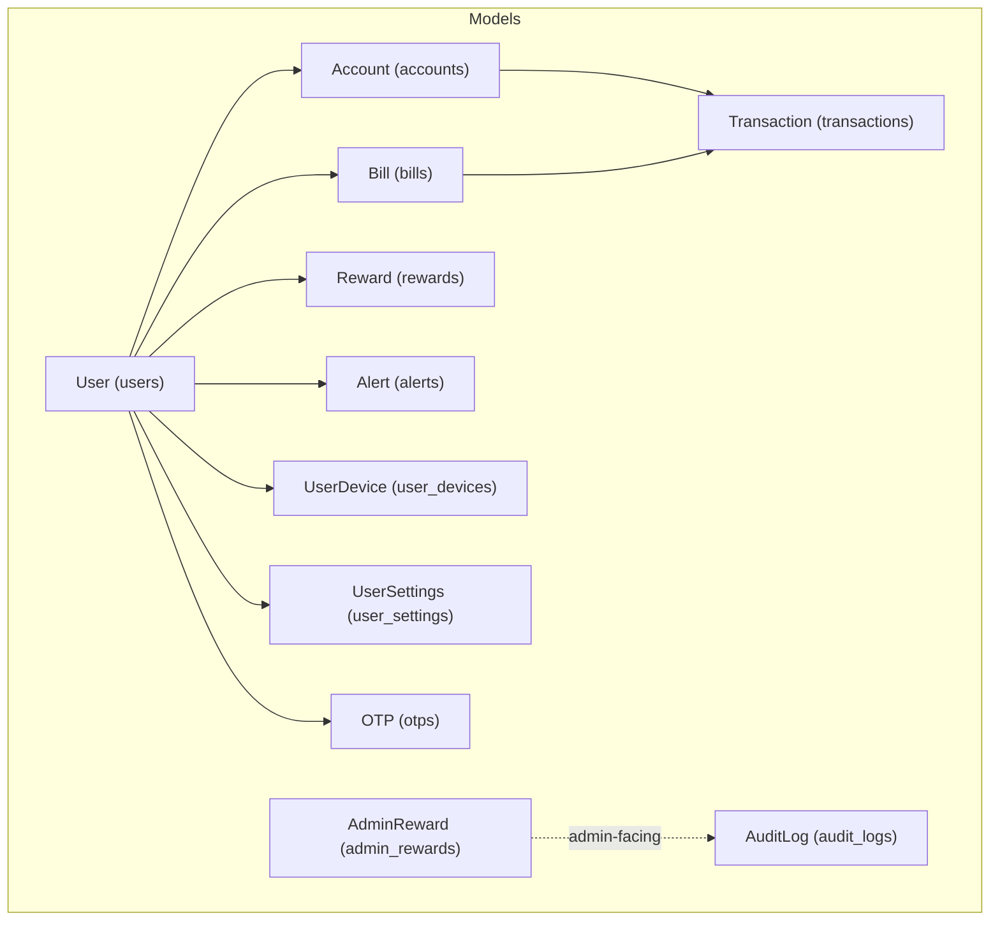
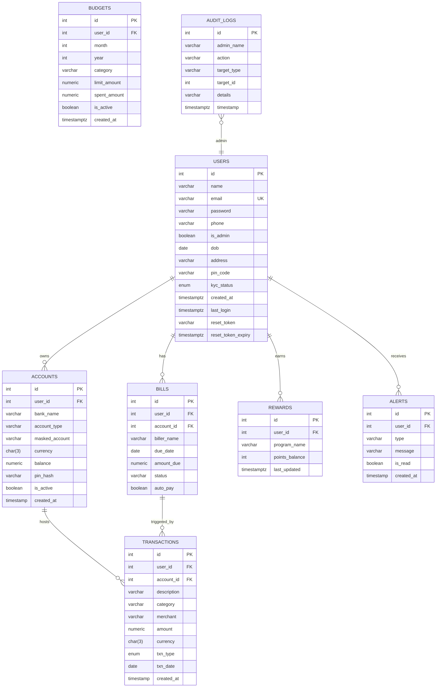
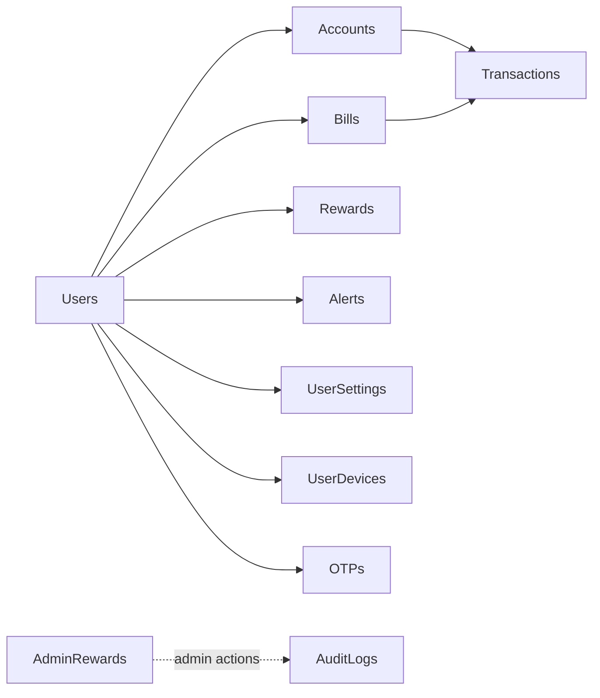

# Entity Models

<cite>
**Referenced Files in This Document**
- [user.py](file://backend/app/models/user.py)
- [account.py](file://backend/app/models/account.py)
- [transaction.py](file://backend/app/models/transaction.py)
- [bill.py](file://backend/app/models/bill.py)
- [reward.py](file://backend/app/models/reward.py)
- [alert.py](file://backend/app/models/alert.py)
- [audit_log.py](file://backend/app/models/audit_log.py)
- [admin_rewards.py](file://backend/app/models/admin_rewards.py)
- [user_device.py](file://backend/app/models/user_device.py)
- [user_settings.py](file://backend/app/models/user_settings.py)
- [otp.py](file://backend/app/models/otp.py)
- [database-schema.md](file://docs/database-schema.md)
- [schema.sql](file://docs/schema.sql)
</cite>

## Table of Contents
1. [Introduction](#introduction)
2. [Project Structure](#project-structure)
3. [Core Components](#core-components)
4. [Architecture Overview](#architecture-overview)
5. [Detailed Component Analysis](#detailed-component-analysis)
6. [Dependency Analysis](#dependency-analysis)
7. [Performance Considerations](#performance-considerations)
8. [Troubleshooting Guide](#troubleshooting-guide)
9. [Conclusion](#conclusion)
10. [Appendices](#appendices)

## Introduction
This document provides comprehensive data model documentation for the banking application’s database entities. It covers the purpose, fields, data types, constraints, defaults, and business rule validations for each entity. The focus areas include Users, Accounts, Transactions, Budgets, Bills, Rewards, Alerts, and Audit Log. Supporting entities such as Admin Rewards, User Devices, User Settings, and OTP are also documented to clarify relationships and cross-cutting concerns.

## Project Structure
The backend uses SQLAlchemy ORM models mapped to PostgreSQL tables. The documentation consolidates model definitions and schema specifications from:
- ORM model files under backend/app/models
- Database schema documentation under docs/database-schema.md and docs/schema.sql

**Diagram sources**
- [user.py:37-65](file://backend/app/models/user.py#L37-L65)
- [account.py:31-57](file://backend/app/models/account.py#L31-L57)
- [transaction.py:32-58](file://backend/app/models/transaction.py#L32-L58)
- [bill.py:18-45](file://backend/app/models/bill.py#L18-L45)
- [reward.py:5-14](file://backend/app/models/reward.py#L5-L14)
- [alert.py:17-34](file://backend/app/models/alert.py#L17-L34)
- [admin_rewards.py:11-33](file://backend/app/models/admin_rewards.py#L11-L33)
- [user_device.py:5-12](file://backend/app/models/user_device.py#L5-L12)
- [user_settings.py:4-14](file://backend/app/models/user_settings.py#L4-L14)
- [otp.py:5-16](file://backend/app/models/otp.py#L5-L16)
- [audit_log.py:6-19](file://backend/app/models/audit_log.py#L6-L19)

**Section sources**
- [database-schema.md:1-147](file://docs/database-schema.md#L1-L147)
- [schema.sql:1-230](file://docs/schema.sql#L1-L230)

## Core Components
This section summarizes each entity’s role and its primary attributes. Refer to Detailed Component Analysis for field-level specifications and validations.

- Users: Authentication, profile, KYC status, admin flag, timestamps, and reset token fields.
- Accounts: Bank account details linked to a user, masked number, currency, balance, PIN hash, activity flag, and creation timestamp.
- Transactions: Debit/credit entries with amounts, currency, date, category, merchant, and timestamps.
- Budgets: Monthly spending limits per category with spent amount tracking and activation flag.
- Bills: Recurring or one-time bill reminders with due dates, amounts, status, and autopay preferences.
- Rewards: User reward points per program with balances and last-updated timestamps.
- Alerts: System notifications with types, messages, read status, and timestamps.
- Audit Log: Admin action tracking with target metadata and timestamps.

**Section sources**
- [user.py:37-65](file://backend/app/models/user.py#L37-L65)
- [account.py:31-57](file://backend/app/models/account.py#L31-L57)
- [transaction.py:32-58](file://backend/app/models/transaction.py#L32-L58)
- [schema.sql:98-113](file://docs/schema.sql#L98-L113)

## Architecture Overview
The entity relationships reflect a typical banking domain: users own accounts; accounts host transactions; users track bills and rewards; alerts notify users; admin-facing rewards and audit logs record administrative actions.

**Diagram sources**
- [schema.sql:34-53](file://docs/schema.sql#L34-L53)
- [schema.sql:58-73](file://docs/schema.sql#L58-L73)
- [schema.sql:78-95](file://docs/schema.sql#L78-L95)
- [schema.sql:100-113](file://docs/schema.sql#L100-L113)
- [schema.sql:118-129](file://docs/schema.sql#L118-L129)
- [schema.sql:134-141](file://docs/schema.sql#L134-L141)
- [schema.sql:146-155](file://docs/schema.sql#L146-L155)
- [schema.sql:218-229](file://docs/schema.sql#L218-L229)

## Detailed Component Analysis

### Users
Purpose
- Store user identity, authentication credentials, profile data, KYC status, admin privileges, and session-related tokens.

Fields and Specifications
- id: integer, primary key
- name: string, not null
- email: string, unique, not null
- password: string, not null (hashed)
- phone: string, not null
- is_admin: boolean, default false, not null
- dob: date, nullable
- address: string, nullable
- pin_code: string, nullable
- kyc_status: enum with values unverified, verified, rejected, default unverified, not null
- created_at: timestamp with timezone, default current timestamp, not null
- last_login: timestamp with timezone, nullable
- reset_token: string, nullable
- reset_token_expiry: timestamp, nullable

Constraints and Validations
- Unique email constraint ensures single registration per email.
- KYC status transitions are governed by business logic outside the model (e.g., admin approval).
- Password must be hashed before persistence; plain-text passwords are not stored.
- Optional profile fields allow partial onboarding until full KYC completion.

Defaults and Behavior
- Admin flag defaults to false.
- KYC status defaults to unverified.
- Created timestamp auto-populated on insert.

Relationships
- One-to-many with Accounts via user_id.

**Section sources**
- [user.py:31-58](file://backend/app/models/user.py#L31-L58)
- [user.py:60-65](file://backend/app/models/user.py#L60-L65)
- [schema.sql:34-53](file://docs/schema.sql#L34-L53)
- [database-schema.md:11-26](file://docs/database-schema.md#L11-L26)

### Accounts
Purpose
- Represent user-linked bank accounts with masked identifiers, currency, balance, and payment PIN protection.

Fields and Specifications
- id: integer, primary key
- user_id: integer, foreign key to users.id with cascade delete, not null
- bank_name: string, max 100, not null
- account_type: string, max 50, not null
- masked_account: string, max 20, not null
- currency: char(3), default INR, not null
- balance: numeric(12,2), default 0, not null
- pin_hash: string, max 255, not null (hashed PIN)
- is_active: boolean, default true, not null
- created_at: timestamp, default current timestamp

Constraints and Validations
- On deletion of a user, all associated accounts are removed (ON DELETE CASCADE).
- Balance is monetary with two decimal places; negative balances are allowed by schema but controlled by business rules (e.g., overdraft policies).
- Currency is an ISO 4217 code; default is INR.
- PIN is hashed; plaintext PIN is never stored.

Defaults and Behavior
- New accounts start with zero balance and active status.
- Creation timestamp auto-populated.

Relationships
- Belongs to one User; participates in many Transactions.

**Section sources**
- [account.py:31-57](file://backend/app/models/account.py#L31-L57)
- [schema.sql:58-73](file://docs/schema.sql#L58-L73)
- [database-schema.md:28-42](file://docs/database-schema.md#L28-L42)

### Transactions
Purpose
- Record all debits and credits for accounts, including merchant, category, and date.

Fields and Specifications
- id: integer, primary key
- user_id: integer, foreign key to users.id, not null
- account_id: integer, foreign key to accounts.id, not null
- description: string, not null
- category: string, default Uncategorized
- merchant: string, nullable
- amount: numeric(12,2), not null
- currency: char(3), default INR
- txn_type: enum debit or credit, not null
- txn_date: date, not null
- created_at: timestamp, default current timestamp

Constraints and Validations
- Debit/credit semantics enforced by enum; amount sign implied by type.
- Currency is ISO 4217; default INR.
- Categories can be customized; default category is provided.
- Merchant is optional; useful for merchant categorization.

Defaults and Behavior
- Created timestamp auto-populated.
- Amount precision supports minor currency units.

Relationships
- Links to User and Account; often triggers bill status updates.

**Section sources**
- [transaction.py:32-58](file://backend/app/models/transaction.py#L32-L58)
- [schema.sql:78-95](file://docs/schema.sql#L78-L95)
- [database-schema.md:45-61](file://docs/database-schema.md#L45-L61)

### Budgets
Purpose
- Track monthly spending limits per category and monitor actual spend.

Fields and Specifications
- id: integer, primary key
- user_id: integer, foreign key to users.id, not null
- month: integer, range 1–12, not null
- year: integer, not null
- category: string, not null
- limit_amount: numeric(12,2), not null
- spent_amount: numeric(12,2), default 0
- is_active: boolean, default true
- created_at: timestamp with timezone, default current timestamp

Constraints and Validations
- Month validated to 1–12; year must be a valid calendar year.
- Limit and spent amounts are monetary with two decimals.
- Isolation by user, month, year, and category ensures per-category budgets.

Defaults and Behavior
- New budgets start inactive until activated by business logic.
- Timestamp auto-populated.

**Section sources**
- [schema.sql:100-113](file://docs/schema.sql#L100-L113)
- [database-schema.md:64-78](file://docs/database-schema.md#L64-L78)

### Bills
Purpose
- Manage recurring or one-time bills with due dates, amounts, and payment status.

Fields and Specifications
- id: integer, primary key
- user_id: integer, foreign key to users.id, not null
- account_id: integer, foreign key to accounts.id, not null
- biller_name: string, not null
- due_date: date, not null
- amount_due: numeric(12,2), not null
- status: string, default upcoming; values include upcoming, paid, overdue
- auto_pay: boolean, default false
- created_at: timestamp, default current timestamp

Constraints and Validations
- Status progression: upcoming → paid or overdue based on payment behavior.
- Auto-pay flag indicates scheduled payment execution.
- Account linkage ensures funds availability for autopay.

Defaults and Behavior
- Default status is upcoming.
- Created timestamp auto-populated.

Relationships
- Optionally triggers Transactions upon payment.

**Section sources**
- [bill.py:18-45](file://backend/app/models/bill.py#L18-L45)
- [schema.sql:118-129](file://docs/schema.sql#L118-L129)
- [database-schema.md:81-94](file://docs/database-schema.md#L81-L94)

### Rewards
Purpose
- Track user reward points per program and maintain last-updated timestamps.

Fields and Specifications
- id: integer, primary key
- user_id: integer, foreign key to users.id, not null
- program_name: string, not null
- points_balance: integer, default 0
- last_updated: timestamp with timezone, default current timestamp

Constraints and Validations
- Points balance is integer; fractional points are not supported by schema.
- Program-level balances enable segmentation (e.g., cashback, referral).

Defaults and Behavior
- New reward entries start with zero points.
- Last-updated timestamp auto-populated.

**Section sources**
- [reward.py:5-14](file://backend/app/models/reward.py#L5-L14)
- [schema.sql:134-141](file://docs/schema.sql#L134-L141)
- [database-schema.md:98-108](file://docs/database-schema.md#L98-L108)

### Alerts
Purpose
- Notify users about low balance, bill due dates, budget exceeded, and other events.

Fields and Specifications
- id: integer, primary key
- user_id: integer, foreign key to users.id, not null
- type: string, not null (e.g., low_balance, bill_due, budget_exceeded)
- message: string, not null
- is_read: boolean, default false, not null
- created_at: timestamp, default current timestamp

Constraints and Validations
- Read/unread state maintained per alert.
- Message content is application-generated or admin-configured.

Defaults and Behavior
- New alerts default unread.
- Created timestamp auto-populated.

**Section sources**
- [alert.py:17-34](file://backend/app/models/alert.py#L17-L34)
- [schema.sql:146-155](file://docs/schema.sql#L146-L155)
- [database-schema.md:112-122](file://docs/database-schema.md#L112-L122)

### Audit Log
Purpose
- Record administrative actions for compliance and monitoring.

Fields and Specifications
- id: integer, primary key
- admin_name: string, not null
- action: string, not null
- target_type: string, nullable
- target_id: integer, nullable
- details: string, nullable
- timestamp: timestamp with timezone, default current timestamp

Constraints and Validations
- Target metadata enables tracing of affected records.
- Timestamp auto-populated.

**Section sources**
- [audit_log.py:6-19](file://backend/app/models/audit_log.py#L6-L19)
- [schema.sql:218-229](file://docs/schema.sql#L218-L229)
- [database-schema.md:126-137](file://docs/database-schema.md#L126-L137)

### Supporting Entities

#### Admin Rewards
Purpose
- Define reward campaigns and offers visible to admins for activation.

Fields and Specifications
- id: integer, primary key
- name: string, not null
- description: string, nullable
- reward_type: string, not null (e.g., Cashback, Offer, Referral)
- applies_to: string, not null (e.g., Savings, Debit, UPI)
- value: string, not null (e.g., 5%, ₹100, 50 points)
- status: enum Pending or Active, default Pending
- created_at: timestamp, default current timestamp

Constraints and Validations
- Status controls campaign lifecycle.
- Value format depends on type (percentage, fixed amount, points).

Defaults and Behavior
- New campaigns default pending.
- Created timestamp auto-populated.

**Section sources**
- [admin_rewards.py:11-33](file://backend/app/models/admin_rewards.py#L11-L33)
- [schema.sql:201-213](file://docs/schema.sql#L201-L213)

#### User Devices
Purpose
- Store device tokens for push notifications and device management.

Fields and Specifications
- id: integer, primary key
- user_id: integer, foreign key to users.id, not null
- device_token: string, unique, not null
- platform: string, nullable (e.g., android, ios)

Constraints and Validations
- Device token uniqueness prevents duplicates.

Defaults and Behavior
- Platform is optional; inferred from client registration.

**Section sources**
- [user_device.py:5-12](file://backend/app/models/user_device.py#L5-L12)
- [schema.sql:170-176](file://docs/schema.sql#L170-L176)

#### User Settings
Purpose
- Configure user notification preferences and security settings.

Fields and Specifications
- id: integer, primary key
- user_id: integer, unique foreign key to users.id, not null
- push_notifications: boolean, default true
- email_alerts: boolean, default true
- login_alerts: boolean, default true
- two_factor_enabled: boolean, default false

Constraints and Validations
- One setting row per user enforced by unique constraint.

Defaults and Behavior
- Defaults enable broad notifications; users can opt out.

**Section sources**
- [user_settings.py:4-14](file://backend/app/models/user_settings.py#L4-L14)
- [schema.sql:181-189](file://docs/schema.sql#L181-L189)

#### OTP
Purpose
- Temporary authentication codes with expiration.

Fields and Specifications
- id: integer, primary key
- identifier: string, index (email or phone), not null
- otp: string, nullable
- expires_at: timestamp, nullable

Constraints and Validations
- Expiration computed by static method (2 minutes from UTC now).

Defaults and Behavior
- Identifier indexed for fast lookup.

**Section sources**
- [otp.py:5-16](file://backend/app/models/otp.py#L5-L16)
- [schema.sql:160-165](file://docs/schema.sql#L160-L165)

## Dependency Analysis
Foreign key relationships enforce referential integrity across entities. The following diagram highlights primary dependencies:

**Diagram sources**
- [schema.sql:58-73](file://docs/schema.sql#L58-L73)
- [schema.sql:78-95](file://docs/schema.sql#L78-L95)
- [schema.sql:118-129](file://docs/schema.sql#L118-L129)
- [schema.sql:134-141](file://docs/schema.sql#L134-L141)
- [schema.sql:146-155](file://docs/schema.sql#L146-L155)
- [schema.sql:181-189](file://docs/schema.sql#L181-L189)
- [schema.sql:170-176](file://docs/schema.sql#L170-L176)
- [schema.sql:160-165](file://docs/schema.sql#L160-L165)
- [schema.sql:201-213](file://docs/schema.sql#L201-L213)
- [schema.sql:218-229](file://docs/schema.sql#L218-L229)

**Section sources**
- [schema.sql:34-53](file://docs/schema.sql#L34-L53)
- [schema.sql:58-73](file://docs/schema.sql#L58-L73)
- [schema.sql:78-95](file://docs/schema.sql#L78-L95)
- [schema.sql:100-113](file://docs/schema.sql#L100-L113)
- [schema.sql:118-129](file://docs/schema.sql#L118-L129)
- [schema.sql:134-141](file://docs/schema.sql#L134-L141)
- [schema.sql:146-155](file://docs/schema.sql#L146-L155)
- [schema.sql:160-165](file://docs/schema.sql#L160-L165)
- [schema.sql:170-176](file://docs/schema.sql#L170-L176)
- [schema.sql:181-189](file://docs/schema.sql#L181-L189)
- [schema.sql:201-213](file://docs/schema.sql#L201-L213)
- [schema.sql:218-229](file://docs/schema.sql#L218-L229)

## Performance Considerations
- Indexes: Email on Users, account_id on Transactions, user_id on Alerts/Bills/Rewards/UserSettings/UserDevices, identifier on OTPs. These are evident from model column definitions and foreign keys.
- Numeric Precision: Monetary fields use numeric(12,2) to prevent floating-point errors.
- Defaults: Server-side defaults reduce application overhead and ensure consistency.
- Cascading Deletes: Accounts cascade-delete with user to avoid orphaned rows.
- Enums: PostgreSQL enums minimize storage and improve query performance compared to varchar enums.

[No sources needed since this section provides general guidance]

## Troubleshooting Guide
Common issues and resolutions:
- Duplicate email on registration: The unique email constraint on Users will cause a duplicate key error; handle gracefully in the API with a user-friendly message.
- Insufficient balance for transfer: Business logic should validate account.balance before debiting; if insufficient, reject the transaction and log an alert.
- Expired OTP: Verify expires_at against current time; reject expired codes and prompt resend.
- Autopay failures: Update Bill status to overdue and create an Alert; optionally retry based on policy.
- Budget overrun: Compare spent_amount vs limit_amount monthly; create an Alert when threshold reached.

**Section sources**
- [user.py:42-42](file://backend/app/models/user.py#L42-L42)
- [otp.py:13-16](file://backend/app/models/otp.py#L13-L16)
- [bill.py:29-32](file://backend/app/models/bill.py#L29-L32)
- [alert.py:23-26](file://backend/app/models/alert.py#L23-L26)

## Conclusion
The entity models form a cohesive, normalized schema supporting authentication, account management, transaction recording, budgeting, bill reminders, rewards, alerts, and admin auditing. Clear constraints, defaults, and relationships ensure data integrity and scalability. Extensibility is supported through enums and separate admin entities.

[No sources needed since this section summarizes without analyzing specific files]

## Appendices

### Field-Level Validation Rules
- Users
  - Email: unique, not null
  - KYC status: enum {unverified, verified, rejected}, default unverified
  - Admin flag: boolean, default false
- Accounts
  - Currency: ISO 3-letter code, default INR
  - Balance: numeric(12,2), default 0
  - PIN: hashed string, not null
  - Active flag: boolean, default true
- Transactions
  - Amount: numeric(12,2), not null
  - Type: enum {debit, credit}, not null
  - Date: not null
- Budgets
  - Month: 1–12, not null
  - Limit/spent: numeric(12,2), not null/default 0
  - Active: boolean, default true
- Bills
  - Amount due: numeric(12,2), not null
  - Status: enum {upcoming, paid, overdue}, default upcoming
  - Auto pay: boolean, default false
- Rewards
  - Points: integer, default 0
- Alerts
  - Read: boolean, default false
- Audit Log
  - Timestamp: timezone-aware, default current timestamp

**Section sources**
- [schema.sql:34-53](file://docs/schema.sql#L34-L53)
- [schema.sql:58-73](file://docs/schema.sql#L58-L73)
- [schema.sql:78-95](file://docs/schema.sql#L78-L95)
- [schema.sql:100-113](file://docs/schema.sql#L100-L113)
- [schema.sql:118-129](file://docs/schema.sql#L118-L129)
- [schema.sql:134-141](file://docs/schema.sql#L134-L141)
- [schema.sql:146-155](file://docs/schema.sql#L146-L155)
- [schema.sql:218-229](file://docs/schema.sql#L218-L229)