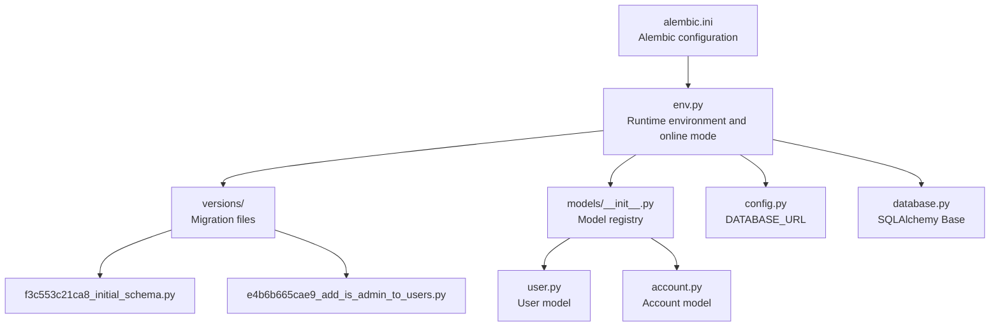
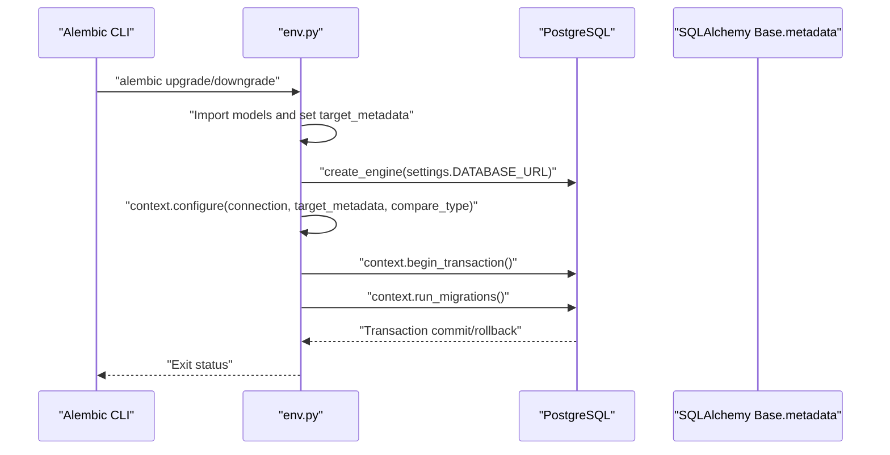
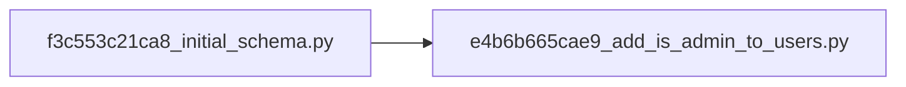

# Migration Management

<cite>
**Referenced Files in This Document**
- [alembic.ini](file://backend/alembic.ini)
- [env.py](file://backend/alembic/env.py)
- [script.py.mako](file://backend/alembic/script.py.mako)
- [f3c553c21ca8_initial_schema.py](file://backend/alembic/versions/f3c553c21ca8_initial_schema.py)
- [e4b6b665cae9_add_is_admin_to_users.py](file://backend/alembic/versions/e4b6b665cae9_add_is_admin_to_users.py)
- [config.py](file://backend/app/config.py)
- [database.py](file://backend/app/database.py)
- [models/__init__.py](file://backend/app/models/__init__.py)
- [user.py](file://backend/app/models/user.py)
- [account.py](file://backend/app/models/account.py)
- [seed_admin.py](file://backend/app/utils/seed_admin.py)
- [README.md](file://backend/README.md)
</cite>

## Table of Contents
1. [Introduction](#introduction)
2. [Project Structure](#project-structure)
3. [Core Components](#core-components)
4. [Architecture Overview](#architecture-overview)
5. [Detailed Component Analysis](#detailed-component-analysis)
6. [Dependency Analysis](#dependency-analysis)
7. [Performance Considerations](#performance-considerations)
8. [Troubleshooting Guide](#troubleshooting-guide)
9. [Conclusion](#conclusion)
10. [Appendices](#appendices)

## Introduction
This document explains the database migration management and schema evolution system for the banking application. It covers the Alembic configuration, migration file structure and naming conventions, initial schema creation, admin user addition migration, and custom migration scripts. It also documents the migration lifecycle, version control strategies, rollback procedures, production deployment processes, execution commands, dependency management, data preservation during schema changes, best practices, troubleshooting, conflict resolution, and testing strategies.

## Project Structure
The backend uses Alembic for database migrations. Migrations are stored under backend/alembic/versions with deterministic filenames derived from revision IDs. The Alembic configuration and runtime environment are defined in alembic.ini and env.py. The SQLAlchemy models define the schema, and Alembic detects metadata from these models to generate or validate migrations.

**Diagram sources**
- [alembic.ini:1-37](file://backend/alembic.ini#L1-L37)
- [env.py:1-59](file://backend/alembic/env.py#L1-L59)
- [f3c553c21ca8_initial_schema.py:1-79](file://backend/alembic/versions/f3c553c21ca8_initial_schema.py#L1-L79)
- [e4b6b665cae9_add_is_admin_to_users.py:1-151](file://backend/alembic/versions/e4b6b665cae9_add_is_admin_to_users.py#L1-L151)
- [models/__init__.py:1-13](file://backend/app/models/__init__.py#L1-L13)
- [user.py:1-65](file://backend/app/models/user.py#L1-L65)
- [account.py:1-57](file://backend/app/models/account.py#L1-L57)
- [config.py:57-72](file://backend/app/config.py#L57-L72)
- [database.py:24-43](file://backend/app/database.py#L24-L43)

**Section sources**
- [alembic.ini:1-37](file://backend/alembic.ini#L1-L37)
- [env.py:1-59](file://backend/alembic/env.py#L1-L59)
- [models/__init__.py:1-13](file://backend/app/models/__init__.py#L1-L13)
- [config.py:57-72](file://backend/app/config.py#L57-L72)
- [database.py:24-43](file://backend/app/database.py#L24-L43)

## Core Components
- Alembic configuration: Defines script location and logging levels.
- Alembic environment: Loads application models, sets up online-only mode, and connects to the database via DATABASE_URL.
- Migration templates: Mako template defines the structure of upgrade/downgrade functions.
- Migration files: Initial schema and subsequent schema changes.
- Model registry: Ensures Alembic detects all tables for autogenerate and comparison.
- Database configuration: Centralized DATABASE_URL used by Alembic and application.

Key responsibilities:
- alembic.ini: Centralizes Alembic settings and logging.
- env.py: Imports models, sets target_metadata, and runs online migrations.
- script.py.mako: Template for generating migration skeletons.
- versions: Contains deterministic migration files with revision IDs and dependencies.
- models/__init__.py: Registers models for detection.
- config.py and database.py: Provide DATABASE_URL and Base for Alembic.

**Section sources**
- [alembic.ini:1-37](file://backend/alembic.ini#L1-L37)
- [env.py:11-37](file://backend/alembic/env.py#L11-L37)
- [script.py.mako:1-24](file://backend/alembic/script.py.mako#L1-L24)
- [f3c553c21ca8_initial_schema.py:11-15](file://backend/alembic/versions/f3c553c21ca8_initial_schema.py#L11-L15)
- [e4b6b665cae9_add_is_admin_to_users.py:11-15](file://backend/alembic/versions/e4b6b665cae9_add_is_admin_to_users.py#L11-L15)
- [models/__init__.py:1-13](file://backend/app/models/__init__.py#L1-L13)
- [config.py:57-72](file://backend/app/config.py#L57-L72)
- [database.py:24-43](file://backend/app/database.py#L24-L43)

## Architecture Overview
The migration system operates in online mode only. Alembic connects to the database using the application’s DATABASE_URL, configures the target metadata from SQLAlchemy Base, and executes migrations within a transaction.

**Diagram sources**
- [env.py:40-58](file://backend/alembic/env.py#L40-L58)
- [config.py:57-72](file://backend/app/config.py#L57-L72)
- [database.py:29-43](file://backend/app/database.py#L29-L43)

## Detailed Component Analysis

### Alembic Configuration and Environment
- alembic.ini
  - script_location points to the alembic directory.
  - Logging levels are configured for root, sqlalchemy, and alembic loggers.
- env.py
  - Adds the backend root to sys.path to resolve imports.
  - Imports models to ensure Alembic detects tables.
  - Sets target_metadata to Base.metadata.
  - Enforces online-only mode by calling run_migrations_online and not supporting offline mode.
  - Uses settings.DATABASE_URL to connect to the database with pool_pre_ping enabled.

Best practices:
- Keep env.py minimal and focused on runtime configuration.
- Ensure all models are imported before invoking context.configure.

**Section sources**
- [alembic.ini:1-37](file://backend/alembic.ini#L1-L37)
- [env.py:1-59](file://backend/alembic/env.py#L1-L59)
- [config.py:57-72](file://backend/app/config.py#L57-L72)

### Migration File Structure and Naming Conventions
- Naming convention: Revision ID followed by a short description, placed in alembic/versions.
- Deterministic IDs: Each migration specifies revision and down_revision explicitly.
- Template: script.py.mako generates skeleton upgrade/downgrade functions.

Guidelines:
- Use descriptive messages in migration headers.
- Set revision and down_revision consistently.
- Define depends_on if a migration must run after another.

**Section sources**
- [script.py.mako:1-24](file://backend/alembic/script.py.mako#L1-L24)
- [f3c553c21ca8_initial_schema.py:11-15](file://backend/alembic/versions/f3c553c21ca8_initial_schema.py#L11-L15)
- [e4b6b665cae9_add_is_admin_to_users.py:11-15](file://backend/alembic/versions/e4b6b665cae9_add_is_admin_to_users.py#L11-L15)

### Initial Schema Creation Migration
- Purpose: Creates the foundational tables for users, accounts, and budgets.
- Tables created: users, accounts, budgets.
- Indexes: Unique and non-unique indexes are added for performance and integrity.
- Downgrade: Drops indexes and tables in reverse dependency order.

Data preservation:
- The initial migration does not modify existing data; it establishes the baseline schema.

**Section sources**
- [f3c553c21ca8_initial_schema.py:18-66](file://backend/alembic/versions/f3c553c21ca8_initial_schema.py#L18-L66)
- [f3c553c21ca8_initial_schema.py:69-79](file://backend/alembic/versions/f3c553c21ca8_initial_schema.py#L69-L79)

### Admin User Addition Migration
- Purpose: Extends the schema to support administrative features and adds admin-related tables and columns.
- Changes:
  - Adds is_admin column to users.
  - Adds last_login column to users.
  - Creates admin_rewards, audit_logs, otps, alerts, rewards, user_devices, user_settings, bills, and transactions tables.
  - Adds indexes for performance.
- Downgrade: Removes columns and drops tables in reverse dependency order.

Data preservation:
- Columns are added with defaults to preserve existing rows.
- Existing data remains intact; new tables are populated separately.

**Section sources**
- [e4b6b665cae9_add_is_admin_to_users.py:18-126](file://backend/alembic/versions/e4b6b665cae9_add_is_admin_to_users.py#L18-L126)
- [e4b6b665cae9_add_is_admin_to_users.py:129-151](file://backend/alembic/versions/e4b6b665cae9_add_is_admin_to_users.py#L129-L151)

### Model Registry and Metadata Detection
- models/__init__.py imports all models to ensure Alembic can detect tables for autogenerate and comparison.
- env.py imports the same models and sets target_metadata to Base.metadata.

Implications:
- Any new model must be imported in models/__init__.py and env.py to be detected by Alembic.

**Section sources**
- [models/__init__.py:1-13](file://backend/app/models/__init__.py#L1-L13)
- [env.py:14-26](file://backend/alembic/env.py#L14-L26)
- [env.py:36-37](file://backend/alembic/env.py#L36-L37)

### Custom Migration Scripts
- The project includes a custom script to seed an admin user after migrations are applied.
- seed_admin.py reads environment variables for admin credentials, checks for existing admin, and inserts a new admin with hashed password.

Usage:
- Set SEED_ADMIN_EMAIL, SEED_ADMIN_PASSWORD, and optional SEED_ADMIN_NAME/PHONE.
- Run the script after applying migrations.

**Section sources**
- [seed_admin.py:9-51](file://backend/app/utils/seed_admin.py#L9-L51)

## Dependency Analysis
Migrations are ordered by revision IDs and explicit down_revision entries. The dependency chain ensures that e4b6b665cae9_add_is_admin_to_users.py follows f3c553c21ca8_initial_schema.py.

**Diagram sources**
- [f3c553c21ca8_initial_schema.py:12-13](file://backend/alembic/versions/f3c553c21ca8_initial_schema.py#L12-L13)
- [e4b6b665cae9_add_is_admin_to_users.py:12-13](file://backend/alembic/versions/e4b6b665cae9_add_is_admin_to_users.py#L12-L13)

**Section sources**
- [f3c553c21ca8_initial_schema.py:12-13](file://backend/alembic/versions/f3c553c21ca8_initial_schema.py#L12-L13)
- [e4b6b665cae9_add_is_admin_to_users.py:12-13](file://backend/alembic/versions/e4b6b665cae9_add_is_admin_to_users.py#L12-L13)

## Performance Considerations
- Online-only migrations: env.py enforces online mode, ensuring migrations run against a live database connection with pool_pre_ping.
- Metadata comparison: compare_type=True helps detect type changes during migrations.
- Indexes: New tables include indexes to optimize lookups and uniqueness constraints.
- Transactional execution: Alembic wraps migrations in a single transaction, minimizing partial state.

[No sources needed since this section provides general guidance]

## Troubleshooting Guide
Common issues and resolutions:
- Missing DATABASE_URL:
  - Ensure DATABASE_URL is set in the environment. Alembic uses settings.DATABASE_URL.
- Model not detected:
  - Verify that models/__init__.py imports the model and env.py imports the same model before configure.
- Offline mode errors:
  - env.py does not support offline mode; migrations must run online.
- Conflicting migrations:
  - Align revision and down_revision IDs. Use depends_on if sequencing is required.
- Rollback failures:
  - Ensure downgrade operations match the upgrade sequence and handle foreign keys and indexes in reverse order.
- Admin seeding:
  - Confirm SEED_ADMIN_EMAIL and SEED_ADMIN_PASSWORD are set. The script checks for existing admin and avoids duplicates.

**Section sources**
- [env.py:40-58](file://backend/alembic/env.py#L40-L58)
- [config.py:57-72](file://backend/app/config.py#L57-L72)
- [models/__init__.py:1-13](file://backend/app/models/__init__.py#L1-L13)
- [seed_admin.py:15-45](file://backend/app/utils/seed_admin.py#L15-L45)

## Conclusion
The migration system leverages Alembic with online-only execution, centralized configuration, and a strict naming convention for deterministic ordering. The initial schema establishes core tables, while subsequent migrations extend the schema for administrative features. The model registry ensures accurate metadata detection, and custom scripts support operational tasks like admin seeding. Adhering to the documented practices ensures safe, reversible, and testable schema evolution.

[No sources needed since this section summarizes without analyzing specific files]

## Appendices

### Migration Lifecycle Management
- Create: Generate a new migration using Alembic’s autogenerate or by editing a new file in alembic/versions.
- Review: Validate migration content and dependency order.
- Test: Apply migrations in a staging environment mirroring production.
- Deploy: Run migrations in production during maintenance windows.
- Rollback: Use downgrade to revert changes if needed.

[No sources needed since this section provides general guidance]

### Version Control Strategies
- Commit migrations alongside application code.
- Keep migration files immutable; never edit applied migrations.
- Use descriptive commit messages linking to feature work.

[No sources needed since this section provides general guidance]

### Rollback Procedures
- Use alembic downgrade to the desired revision.
- Verify data integrity and application behavior after rollback.
- Re-run targeted fixes if necessary.

[No sources needed since this section provides general guidance]

### Production Deployment Processes
- Pre-deploy: Back up the database; confirm DATABASE_URL correctness.
- Deploy: Apply migrations using alembic upgrade head.
- Post-deploy: Validate schema and run smoke tests.

[No sources needed since this section provides general guidance]

### Migration Execution Commands
- Upgrade to latest: alembic upgrade head
- Downgrade to base: alembic downgrade -1
- Downgrade to specific revision: alembic downgrade <revision>
- Autogenerate a migration: alembic revision --autogenerate -m "<message>"
- List current revision: alembic current

[No sources needed since this section provides general guidance]

### Data Preservation During Schema Changes
- Add columns with defaults to avoid null issues.
- Create indexes and constraints in separate steps if needed.
- Use transactions to keep changes atomic.

[No sources needed since this section provides general guidance]

### Best Practices for Safe Database Updates
- Always test migrations in a staging environment.
- Keep migrations small and focused.
- Use explicit revision dependencies when necessary.
- Document breaking changes and deprecations.

[No sources needed since this section provides general guidance]

### Testing Strategies for Schema Changes
- Use a dedicated test database.
- Automate migration application in CI pipelines.
- Validate referential integrity and data types after migration.

[No sources needed since this section provides general guidance]